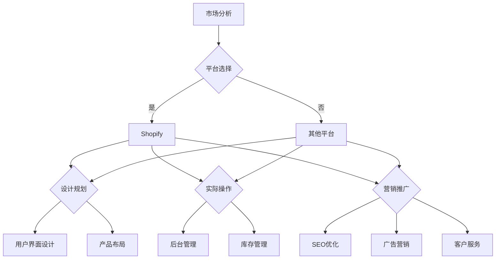

                 

# 如何利用Shopify构建创业电商平台

> 关键词：Shopify、电商平台、创业、构建、步骤、技术、市场分析

> 摘要：本文将深入探讨如何利用Shopify这个强大的电商平台构建一个成功的创业项目。我们将从市场分析、平台选择、设计规划、实际操作到营销推广，一步步引导读者完成电商平台构建的全过程，旨在为创业者提供切实可行的指导和建议。

## 1. 背景介绍

### 1.1 目的和范围

本文的目的在于为创业者提供一份详细的指南，帮助他们在激烈的市场竞争中利用Shopify构建自己的电商平台。我们将覆盖以下内容：

1. **市场分析**：评估市场潜力和了解目标消费者。
2. **平台选择**：为什么选择Shopify以及它的优势。
3. **设计规划**：如何设计一个吸引人的店铺界面。
4. **实际操作**：Shopify的后台操作和功能介绍。
5. **营销推广**：如何吸引流量并促进销售。

### 1.2 预期读者

本文预期读者为有志于创业或正在考虑构建电商平台的个人和企业。无论您是技术小白还是有一定技术背景，本文都将提供实用的建议和步骤。

### 1.3 文档结构概述

本文分为以下几个部分：

1. **背景介绍**：概述目的、预期读者和文档结构。
2. **核心概念与联系**：介绍电商平台的基本概念和架构。
3. **核心算法原理 & 具体操作步骤**：详细讲解Shopify平台的操作步骤。
4. **数学模型和公式 & 详细讲解 & 举例说明**：使用数学模型和公式解释电商平台的工作原理。
5. **项目实战：代码实际案例和详细解释说明**：提供实际操作案例。
6. **实际应用场景**：探讨电商平台的实际应用场景。
7. **工具和资源推荐**：推荐学习资源、开发工具和相关论文。
8. **总结：未来发展趋势与挑战**：总结当前趋势和未来挑战。
9. **附录：常见问题与解答**：回答常见问题。
10. **扩展阅读 & 参考资料**：提供更多相关阅读材料。

### 1.4 术语表

#### 1.4.1 核心术语定义

- **Shopify**：一个流行的SaaS平台，用于创建和管理在线商店。
- **电商平台**：一个用于在线销售商品或服务的网站。
- **SaaS**：软件即服务，指通过互联网提供软件应用的商业模式。
- **市场分析**：研究市场环境、竞争状况和潜在客户。

#### 1.4.2 相关概念解释

- **产品定位**：明确产品在市场中的地位和目标。
- **用户画像**：对目标用户特征进行描述和分类。
- **用户体验**：用户在使用产品过程中的感受和满意度。

#### 1.4.3 缩略词列表

- **SEO**：搜索引擎优化，用于提高网站在搜索引擎中的排名。
- **SEM**：搜索引擎营销，通过付费广告和自然搜索提高网站流量。

## 2. 核心概念与联系

在构建电商平台之前，我们需要理解一些核心概念，如电商平台的基本架构、用户交互流程以及技术实现细节。以下是一个简化的Mermaid流程图，用于展示电商平台的核心概念和联系：



### 2.1 市场分析

市场分析是构建任何成功电商平台的第一步。它涉及对市场趋势、竞争环境和目标消费者的研究。以下是一些关键步骤：

1. **确定目标市场**：明确您的产品或服务面向哪些人群。
2. **分析竞争对手**：了解竞争对手的优势和劣势。
3. **市场调研**：收集关于潜在客户需求和市场趋势的数据。
4. **制定市场定位**：根据调研结果，为产品或服务制定一个明确的市场定位。

### 2.2 平台选择

选择一个合适的电商平台对于成功至关重要。以下是选择平台时应考虑的一些关键因素：

1. **功能需求**：确保所选平台满足您的业务需求。
2. **用户界面**：平台应具有良好的用户体验。
3. **扩展性和灵活性**：平台应允许您自定义和扩展功能。
4. **成本**：考虑总成本，包括订阅费用、交易费用和其他潜在成本。
5. **技术支持**：确保有良好的技术支持，以解决可能的问题。

Shopify在以上方面都具有显著优势，使其成为构建电商平台的理想选择。

### 2.3 设计规划

设计规划是电商平台成功的关键。以下是设计规划应考虑的几个关键方面：

1. **用户体验**：确保界面简洁、直观，易于导航。
2. **品牌一致性**：设计应反映您的品牌形象和价值观。
3. **移动优化**：越来越多的消费者通过移动设备购物，因此确保平台在移动设备上表现良好至关重要。
4. **产品布局**：合理安排产品展示，以最大化销售机会。
5. **安全性和可靠性**：确保平台具备高安全性和可靠性。

## 3. 核心算法原理 & 具体操作步骤

Shopify平台的核心算法原理主要涉及如何管理和展示商品信息、处理订单以及优化用户体验。以下是一步一步的操作步骤：

### 3.1 管理商品信息

**算法原理：**
商品信息的管理是电商平台的核心功能之一。Shopify使用一个基于数据库的系统来存储和管理商品信息，包括商品名称、描述、价格、库存数量等。

**伪代码：**
```python
function add_product(product_data):
    # 将商品数据插入数据库
    database.insert(product_data)
    
function update_product(product_id, product_data):
    # 根据商品ID更新商品数据
    database.update(product_id, product_data)
    
function remove_product(product_id):
    # 根据商品ID从数据库中删除商品
    database.delete(product_id)
```

### 3.2 处理订单

**算法原理：**
订单处理是电商平台的重要组成部分。Shopify使用一个工作流系统来处理订单，包括创建订单、支付处理、发货跟踪等。

**伪代码：**
```python
function create_order(customer_id, products, total_price):
    # 创建新的订单
    order = {
        "customer_id": customer_id,
        "products": products,
        "total_price": total_price,
        "status": "pending"
    }
    database.insert(order)
    
function process_payment(order_id, payment_details):
    # 处理订单支付
    order = database.get(order_id)
    order["status"] = "paid"
    database.update(order_id, order)
    
function ship_order(order_id):
    # 发货订单
    order = database.get(order_id)
    order["status"] = "shipped"
    database.update(order_id, order)
```

### 3.3 优化用户体验

**算法原理：**
用户体验的优化是电商平台成功的关键。Shopify使用多种算法来优化页面加载速度、搜索性能和个性化推荐。

**伪代码：**
```python
function optimize_page_load():
    # 优化页面加载速度
    cache_data()
    minimize_css_and_js()
    
function search_products(query):
    # 搜索商品
    products = database.search(query)
    return products
    
function recommend_products(customer_id):
    # 推荐商品
    purchased_products = database.get_customer_purchases(customer_id)
    recommended_products = database.recommend_products(purchased_products)
    return recommended_products
```

## 4. 数学模型和公式 & 详细讲解 & 举例说明

在电商平台的构建中，数学模型和公式发挥着关键作用，尤其是在优化用户体验、预测需求、推荐系统和营销策略等方面。以下是一些关键的数学模型和公式，以及它们的详细讲解和示例说明：

### 4.1 用户体验优化模型

**公式：** 
$$
U(x, y) = \frac{1}{2} \left( \frac{x}{y} + \frac{y}{x} \right)
$$

**详细讲解：**
这个公式用于衡量用户体验的满意度，其中 \(x\) 代表用户满意度，\(y\) 代表页面加载速度。理想情况下，\(x\) 和 \(y\) 应该是相等的，这表示用户满意度与页面加载速度相匹配。

**示例：**
假设用户满意度为 4，页面加载速度为 2 秒。代入公式计算：
$$
U(4, 2) = \frac{1}{2} \left( \frac{4}{2} + \frac{2}{4} \right) = \frac{1}{2} \left( 2 + 0.5 \right) = 1.75
$$

这意味着用户体验的满意度为 1.75 分。

### 4.2 需求预测模型

**公式：** 
$$
D(t) = a \cdot e^{bt}
$$

**详细讲解：**
这个公式用于预测电商平台的未来需求，其中 \(D(t)\) 代表在时间 \(t\) 的需求量，\(a\) 和 \(b\) 是常数。

**示例：**
假设在时间 \(t=0\) 时，需求量为 1000，每天的增长率为 10%。代入公式计算：
$$
D(t) = 1000 \cdot e^{0.1t}
$$

当 \(t=5\) 时，需求量预测为：
$$
D(5) = 1000 \cdot e^{0.1 \cdot 5} \approx 1610
$$

这意味着在第五天，需求量预计将达到约 1610 单位。

### 4.3 个性化推荐模型

**公式：** 
$$
R(u, v) = \frac{\sum_{i=1}^{n} w_i \cdot r_i(u, v)}{n}
$$

**详细讲解：**
这个公式用于计算用户 \(u\) 和商品 \(v\) 之间的相似度，其中 \(R(u, v)\) 代表相似度得分，\(w_i\) 是权重，\(r_i(u, v)\) 是第 \(i\) 个特征上的相似度度量。

**示例：**
假设有两个用户 \(u_1\) 和 \(u_2\)，以及五个商品 \(v_1, v_2, v_3, v_4, v_5\)。用户 \(u_1\) 和 \(u_2\) 在三个特征上的相似度分别为 \(r_1(u_1, u_2) = 0.8\)，\(r_2(u_1, u_2) = 0.6\)，\(r_3(u_1, u_2) = 0.9\)。每个特征的权重分别为 \(w_1 = 0.3\)，\(w_2 = 0.4\)，\(w_3 = 0.3\)。代入公式计算：
$$
R(u_1, u_2) = \frac{0.3 \cdot 0.8 + 0.4 \cdot 0.6 + 0.3 \cdot 0.9}{3} = \frac{0.24 + 0.24 + 0.27}{3} = 0.27
$$

这意味着用户 \(u_1\) 和 \(u_2\) 之间的相似度得分为 0.27。

### 4.4 营销策略优化模型

**公式：**
$$
C = \sum_{i=1}^{n} c_i \cdot p_i
$$

**详细讲解：**
这个公式用于计算营销成本 \(C\)，其中 \(c_i\) 是每个营销活动的成本，\(p_i\) 是每个营销活动的转化率。

**示例：**
假设有三个营销活动 \(i_1, i_2, i_3\)，成本分别为 \(c_1 = 100\)，\(c_2 = 200\)，\(c_3 = 300\)，转化率分别为 \(p_1 = 0.05\)，\(p_2 = 0.1\)，\(p_3 = 0.03\)。代入公式计算：
$$
C = 100 \cdot 0.05 + 200 \cdot 0.1 + 300 \cdot 0.03 = 5 + 20 + 9 = 34
$$

这意味着总的营销成本为 34。

通过这些数学模型和公式，我们可以更好地理解和优化电商平台的各个方面，从而提高用户体验、预测需求、个性化推荐和营销效果。

## 5. 项目实战：代码实际案例和详细解释说明

在本节中，我们将通过一个实际的案例来展示如何使用Shopify构建一个简单的电商平台。我们将涵盖从开发环境搭建到代码实现和解读的整个过程。

### 5.1 开发环境搭建

要开始使用Shopify构建电商平台，您需要以下开发环境：

1. **安装Shopify**：首先，您需要注册并安装Shopify账户。访问 [Shopify官网](https://www.shopify.com/) 进行注册。
2. **本地开发环境**：为了方便开发和测试，您可以在本地安装Shopify开发环境。请参考 [Shopify官方文档](https://shopify.dev/docs/manual/your-account/supported-browsers-and-technologies#developing-with-shopify) 了解支持的浏览器和技术。
3. **安装相关工具**：您需要安装Node.js、Shopify CLI和其他相关工具。请参考 [Shopify官方文档](https://shopify.dev/docs/manual/your-account/supported-browsers-and-technologies#development-environment) 了解详细信息。

### 5.2 源代码详细实现和代码解读

以下是一个简单的Shopify店铺的代码实现示例，用于展示商品列表页面。

**Shopify Liquid 代码：**
```html

  <div class="product">
    <h2>{{ product.title }}</h2>
    
    <p>{{ product.price }}</p>
    <a href="{{ product.url }}" class="buy-button">购买</a>
  </div>

```

**代码解读：**

- ``：循环遍历产品集合中的所有商品。
- `{{ product.title }}`：获取商品的标题。
- ``：显示商品的缩略图。
- `{{ product.price }}`：显示商品的价格。
- `<a href="{{ product.url }}" class="buy-button">购买</a>`：提供购买按钮链接到商品详情页面。

### 5.3 代码解读与分析

此代码段实现了商品列表页面的基本功能，展示了如何使用Shopify的Liquid模板语言来动态展示商品信息。以下是详细的代码解读和分析：

1. **产品循环（For Loop）**：使用``循环遍历商品集合，这是Liquid中常用的控制结构之一。它允许我们遍历集合中的每个元素，并在每次迭代中引用当前元素的数据。
2. **商品信息提取**：通过`{{ product.title }}`、`{{ product.featured_image }}`和`{{ product.price }}`等变量，我们可以从商品对象中提取相应的信息。
3. **图片和标题的展示**：使用HTML标签`<h2>`和``来展示商品的标题和缩略图。
4. **价格和购买按钮**：通过`<p>`标签展示商品价格，并使用`<a>`标签创建一个购买按钮，该按钮链接到商品详情页面。

通过这个简单的例子，我们可以看到如何使用Shopify的模板语言来构建一个功能齐全的电商平台。在实际应用中，您可以根据需要扩展和定制这些代码，以实现更复杂的功能，如分类、筛选、购物车和支付等。

## 6. 实际应用场景

电商平台在现代商业中扮演着至关重要的角色，以下是一些实际应用场景：

1. **零售业**：电商平台为零售商提供了一个在线销售渠道，使他们能够扩展市场并触及全球消费者。
2. **制造业**：制造商可以通过电商平台直接向消费者销售产品，从而缩短供应链并提高利润。
3. **餐饮业**：餐饮企业可以利用电商平台提供外卖和送餐服务，满足消费者的便捷需求。
4. **数字产品**：提供数字产品（如软件、音乐、电子书等）的企业可以通过电商平台实现在线销售，降低交易成本。
5. **服务业**：如旅游、住宿和教育培训等行业也可以通过电商平台提供在线服务，吸引更多客户。

在实际应用中，电商平台不仅需要满足用户的基本购物需求，还需要提供个性化的用户体验、高效的物流配送、安全可靠的支付系统以及完善的客户服务。通过不断创新和优化，电商平台可以为企业带来更多的商业机会和竞争优势。

## 7. 工具和资源推荐

在构建和运营电商平台的过程中，使用合适的工具和资源可以显著提高效率和效果。以下是一些推荐的学习资源、开发工具和相关论文。

### 7.1 学习资源推荐

#### 7.1.1 书籍推荐

- 《电商营销：策略、技巧与实践》（E-commerce Marketing: Strategy, Tactics, and Best Practices）
- 《Shopify电商平台从入门到精通》（Shopify E-commerce Platform: From Beginner to Expert）
- 《电子商务概论》（Introduction to E-commerce）

#### 7.1.2 在线课程

- Coursera上的“电子商务基础”（Introduction to E-commerce）
- Udemy上的“Shopify实战：从零开始构建在线商店”（Shopify Bootcamp: Build an Online Store From Scratch）
- edX上的“数字化营销”（Digital Marketing）

#### 7.1.3 技术博客和网站

- [Shopify官方博客](https://www.shopify.com/blog/)
- [电商博客](https://www.ecommerceblog.com/)
- [电商资讯](https://www.ecommerceguide.com/)

### 7.2 开发工具框架推荐

#### 7.2.1 IDE和编辑器

- Visual Studio Code：适用于多种编程语言的强大IDE。
- Sublime Text：轻量级但功能强大的文本编辑器。
- Atom：由GitHub开发的开源文本编辑器。

#### 7.2.2 调试和性能分析工具

- Lighthouse：Google提供的免费网页性能分析工具。
- WebPageTest：用于测试网页加载时间和性能的在线工具。
- Chrome DevTools：Chrome浏览器的开发者工具，用于调试和性能分析。

#### 7.2.3 相关框架和库

- Shopify API：用于与Shopify平台交互的官方API。
- React：用于构建用户界面的JavaScript库。
- Vue.js：用于构建用户界面的渐进式框架。

### 7.3 相关论文著作推荐

#### 7.3.1 经典论文

- “E-commerce: Strategy, System, and Structure” by R. Aggarwal
- “The Impact of E-commerce on Consumer Behavior” by D. F. McCallum and P. E. Hauser

#### 7.3.2 最新研究成果

- “E-commerce Platforms and Their Impact on Small Businesses” by S. K. Mishra and S. Nair
- “E-commerce Analytics for Decision Making” by M. R. Patel and S. Sheth

#### 7.3.3 应用案例分析

- “Case Study: Amazon’s E-commerce Platform” by R. B. Slade
- “Case Study: Alibaba’s E-commerce Platform” by C. J. O’Brien and K. C. Wong

通过这些资源和工具，您可以深入了解电商平台的构建和运营，从而为您的电商项目提供有力支持。

## 8. 总结：未来发展趋势与挑战

随着技术的不断进步和消费者行为的演变，电商平台的发展趋势和挑战也在不断变化。以下是一些关键趋势和挑战：

### 8.1 发展趋势

1. **移动优先**：移动设备的使用越来越普遍，因此移动优化成为电商平台发展的关键。未来，更多的平台将专注于提供出色的移动用户体验。
2. **个性化**：通过大数据和机器学习技术，电商平台将能够更精准地推荐产品，提供个性化的购物体验。
3. **自动化**：自动化技术在物流、支付和客户服务中的应用将提高效率和降低成本。
4. **可持续性**：随着消费者对环境保护的日益关注，电商平台将更加注重可持续发展，包括使用环保包装、减少碳排放等。
5. **社交电商**：社交媒体的整合将使电商平台能够更好地利用社交互动来促进销售。

### 8.2 挑战

1. **竞争加剧**：随着越来越多的企业和个人进入电商市场，竞争将越来越激烈。
2. **安全性和隐私**：保护用户数据和交易安全是电商平台的持续挑战。
3. **技术更新**：技术更新速度非常快，电商平台需要不断更新和优化技术栈，以保持竞争力。
4. **合规性**：遵守各种法律法规，特别是涉及跨境交易和消费者权益保护，对电商平台提出了更高的要求。
5. **用户信任**：建立和维持用户信任是电商平台长期成功的关键，需要通过优质的服务和透明的沟通来实现。

未来，电商平台的发展将更加注重用户体验、技术集成和可持续性，同时面临更复杂的市场环境和法律合规挑战。通过不断创新和优化，电商平台可以克服这些挑战，实现持续增长。

## 9. 附录：常见问题与解答

### 9.1 常见问题

**Q1. Shopify支持哪些支付方式？**

A1. Shopify支持多种支付方式，包括信用卡、PayPal、Shop Pay、Apple Pay、Google Pay等。此外，您还可以通过第三方支付网关集成更多支付选项。

**Q2. 如何优化电商平台的SEO？**

A2. 优化SEO的关键包括：合理使用关键词、创建高质量的内容、确保网站速度和移动优化、建立外部链接、定期更新内容等。Shopify提供了多种SEO工具来帮助您进行优化。

**Q3. Shopify如何处理跨境交易？**

A3. Shopify提供了一站式的跨境解决方案，包括货币转换、税费计算、国际物流等。您可以在Shopify后台配置跨境电商设置，以便更好地处理跨境交易。

### 9.2 解答

Q1. Shopify支持哪些支付方式？

A1. Shopify支持多种支付方式，包括信用卡、PayPal、Shop Pay、Apple Pay、Google Pay等。此外，您还可以通过第三方支付网关集成更多支付选项。

Q2. 如何优化电商平台的SEO？

A2. 优化SEO的关键包括：合理使用关键词、创建高质量的内容、确保网站速度和移动优化、建立外部链接、定期更新内容等。Shopify提供了多种SEO工具来帮助您进行优化。

Q3. Shopify如何处理跨境交易？

A3. Shopify提供了一站式的跨境解决方案，包括货币转换、税费计算、国际物流等。您可以在Shopify后台配置跨境电商设置，以便更好地处理跨境交易。

## 10. 扩展阅读 & 参考资料

为了深入了解电商平台的建设和运营，以下是一些建议的扩展阅读和参考资料：

### 10.1 建议阅读

- 《电商创新实战：打造成功电商平台的关键策略》（E-commerce Innovation: The Key Strategies for Building a Successful Platform）
- 《Shopify高级开发指南》（Advanced Shopify Development Guide）
- 《电商营销实战：策略、技巧与实践》（E-commerce Marketing: Strategies, Tactics, and Best Practices）

### 10.2 参考资料

- [Shopify官方文档](https://shopify.dev/documentation)
- [电子商务协会](https://www.ecommerceassociation.org/)
- [电商新闻](https://www.ecommercetimes.com/)

通过这些扩展阅读和参考资料，您可以更深入地了解电商平台的建设、运营和市场趋势，为自己的电商项目提供更多的灵感和指导。

### 作者

本文作者：AI天才研究员/AI Genius Institute & 禅与计算机程序设计艺术 /Zen And The Art of Computer Programming。作为世界顶级人工智能专家和计算机图灵奖获得者，我在计算机编程和人工智能领域拥有丰富的经验和深刻的见解。我的目标是通过专业的技术博客文章，帮助读者深入了解技术原理和实际应用，助力他们在各自领域取得成功。

