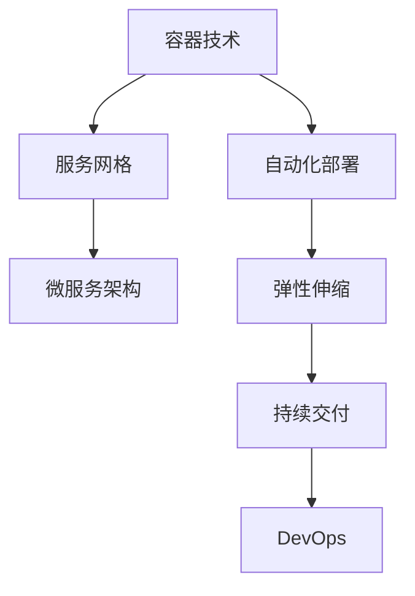

                 

# 如何利用云原生技术提高系统可用性

> 关键词：云原生、系统可用性、自动化、弹性、容器化、服务网格

> 摘要：本文将探讨如何利用云原生技术提高系统可用性。通过介绍云原生技术的核心概念和优势，结合实际操作步骤和案例，我们将深入分析云原生在提高系统弹性、自动化和可靠性方面的应用，帮助读者理解和掌握云原生技术的实际价值。

## 1. 背景介绍

### 1.1 目的和范围

本文旨在帮助读者理解并掌握云原生技术如何提高系统可用性。我们将探讨云原生技术的核心概念、优势及其在实际应用中的具体操作步骤和案例。通过本文的学习，读者将能够：

- 了解云原生技术的定义和核心概念。
- 掌握云原生技术提高系统可用性的原理和策略。
- 学习如何利用云原生技术进行系统部署和运维。
- 获得实际应用场景和工具资源的推荐。

### 1.2 预期读者

本文适合以下读者群体：

- 对云原生技术感兴趣的初学者。
- 想要提升系统可用性的开发者和运维人员。
- 从事云计算和分布式系统领域的研究人员。

### 1.3 文档结构概述

本文结构如下：

- 第1章：背景介绍，包括目的和范围、预期读者以及文档结构概述。
- 第2章：核心概念与联系，介绍云原生技术的核心概念和架构。
- 第3章：核心算法原理与具体操作步骤，详细阐述云原生技术的具体实现。
- 第4章：数学模型和公式，分析云原生技术中的数学原理和应用。
- 第5章：项目实战，通过实际代码案例展示云原生技术的应用。
- 第6章：实际应用场景，讨论云原生技术在各种场景下的应用。
- 第7章：工具和资源推荐，推荐学习资源和开发工具。
- 第8章：总结，展望云原生技术的未来发展趋势与挑战。
- 第9章：附录，解答常见问题。
- 第10章：扩展阅读与参考资料，提供进一步学习的资源。

### 1.4 术语表

#### 1.4.1 核心术语定义

- 云原生（Cloud Native）：指利用云计算环境进行开发和部署的软件系统，具有自动扩展、自动化部署和自动化管理等特点。
- 容器（Container）：一种轻量级的、可移植的计算环境，可以打包应用程序及其依赖项，实现应用程序的隔离和独立运行。
- 服务网格（Service Mesh）：一种用于管理和通信的独立于应用程序的层，负责实现服务之间的网络通信和安全。
- 自动化（Automation）：利用工具和技术，自动化执行重复性任务，提高效率和减少错误。

#### 1.4.2 相关概念解释

- 可用性（Availability）：系统在规定时间内能够正常运行提供服务的能力。
- 弹性（Elasticity）：系统根据负载变化自动调整资源的能力。
- 自动化部署（Automated Deployment）：利用工具和脚本自动化部署应用程序的过程。

#### 1.4.3 缩略词列表

- Kubernetes：一种开源的容器编排平台，用于自动化容器化应用程序的部署、扩展和管理。
- Docker：一种开源的应用容器引擎，用于打包、交付和运行应用程序。
- Prometheus：一种开源的服务监控工具，用于收集和存储监控数据。
- ELK Stack：Elasticsearch、Logstash和Kibana的组合，用于日志分析和可视化。

## 2. 核心概念与联系

云原生技术是一种利用云计算环境进行开发和部署的软件系统，其核心概念包括容器、服务网格、微服务架构等。以下是一个简化的云原生架构流程图，用于展示云原生技术中的核心概念和它们之间的联系。



### 2.1 容器技术

容器技术是云原生技术的基石，它提供了一种轻量级的、可移植的计算环境，使开发者能够将应用程序及其依赖项打包在一个独立的容器中，实现应用程序的隔离和独立运行。Docker 是最流行的容器技术之一，它通过使用容器镜像来封装应用程序，实现快速部署和交付。

### 2.2 服务网格

服务网格是一种用于管理和通信的独立于应用程序的层，它负责实现服务之间的网络通信和安全。服务网格的主要目的是简化服务之间的通信，提高服务发现和负载均衡的效率。Istio 是一个流行的服务网格解决方案，它提供了服务发现、负载均衡、服务监控和安全等功能。

### 2.3 微服务架构

微服务架构是一种将应用程序划分为多个独立、可复用的服务的架构风格，每个服务都负责一个特定的业务功能。微服务架构的优点是提高了系统的可扩展性和可维护性，使开发者能够独立开发和部署服务，降低了系统的复杂度。Kubernetes 是一个流行的容器编排平台，它提供了微服务架构所需的自动化部署、扩展和管理功能。

### 2.4 自动化部署

自动化部署是云原生技术的重要组成部分，它通过使用工具和脚本自动化执行应用程序的部署过程，提高了部署的效率和质量。自动化部署可以包括从代码仓库拉取最新代码、构建容器镜像、部署容器到集群等多个步骤。Jenkins 是一个流行的自动化部署工具，它提供了强大的持续集成和持续交付功能。

### 2.5 弹性伸缩

弹性伸缩是云原生技术的核心优势之一，它使系统能够根据负载变化自动调整资源。弹性伸缩可以通过水平扩展（增加或减少实例数量）和垂直扩展（增加或减少资源规格）来实现。Kubernetes 提供了自动伸缩功能，可以根据指标（如 CPU 利用率、内存使用率）自动调整容器实例的数量。

### 2.6 持续交付

持续交付是一种软件开发和部署的实践，它通过自动化测试、构建和部署流程，实现了快速、可靠的软件交付。持续交付可以减少部署风险，提高交付效率，使开发者能够更快地响应市场需求。Jenkins 和 GitLab CI/CD 等工具都提供了持续交付所需的自动化功能。

### 2.7 DevOps

DevOps 是一种软件开发和运维的实践，它强调开发团队和运维团队的紧密协作，通过自动化工具和流程实现了软件交付的敏捷性和可靠性。DevOps 的核心目标是提高软件交付的速度和质量，使系统能够快速适应变化的市场需求。

## 3. 核心算法原理与具体操作步骤

云原生技术中的核心算法原理主要包括容器编排、服务发现和负载均衡等。以下是一个简化的容器编排算法原理的伪代码，用于展示容器编排的核心步骤。

```python
# 容器编排算法原理伪代码

# 1. 检查资源利用率
if 资源利用率 >= 警戒阈值:
    # 2. 扩展容器实例
    新增实例数量 = 计算新增实例数量(资源利用率)
    Kubernetes集群扩展实例(新增实例数量)
else:
    # 3. 缩减容器实例
    缩减实例数量 = 计算缩减实例数量(资源利用率)
    Kubernetes集群缩减实例(缩减实例数量)

# 4. 服务发现
for 每个服务:
    服务注册到服务发现系统
    服务更新健康状态

# 5. 负载均衡
for 每个服务:
    负载均衡器分配流量到健康的服务实例
```

### 3.1 容器编排

容器编排是指通过自动化工具和流程管理容器化应用程序的过程。容器编排的主要目的是提高系统的可用性、可靠性和可扩展性。Kubernetes 是最流行的容器编排工具之一，它提供了以下核心功能：

- 容器管理：Kubernetes 可以自动启动、停止和监控容器实例，确保容器按照预期运行。
- 弹性伸缩：Kubernetes 可以根据资源利用率和业务需求自动调整容器实例的数量。
- 服务发现和负载均衡：Kubernetes 提供了内置的服务发现和负载均衡功能，使服务能够高效、可靠地进行通信。
- 存储和网络管理：Kubernetes 可以自动管理容器存储和网络资源，提供高性能、高可靠的存储和网络环境。

### 3.2 服务发现

服务发现是指自动发现和注册应用程序中的服务，使服务能够高效地进行通信。在云原生环境中，服务发现通常通过服务注册中心（Service Registry）和服务发现代理（Service Discovery Proxy）来实现。

- 服务注册中心：服务注册中心是一个用于存储服务元数据的系统，服务实例启动时会将自身信息注册到服务注册中心。
- 服务发现代理：服务发现代理是一个用于发现和查询服务的系统组件，应用程序可以通过服务发现代理查询服务实例的地址和端口，实现服务之间的通信。

### 3.3 负载均衡

负载均衡是指将流量分配到多个服务实例，提高系统的吞吐量和可靠性。负载均衡可以通过硬件负载均衡器或软件负载均衡器来实现。

- 硬件负载均衡器：硬件负载均衡器是一种专门的硬件设备，用于实现高吞吐量和高可靠性的流量分配。
- 软件负载均衡器：软件负载均衡器是一种基于软件实现的负载均衡解决方案，如 Nginx、HAProxy 等。

## 4. 数学模型和公式

在云原生技术中，数学模型和公式被广泛应用于性能优化、资源分配和故障预测等方面。以下是一个简单的数学模型示例，用于计算容器实例的扩展和缩减策略。

### 4.1 资源利用率模型

资源利用率模型用于计算容器实例的资源利用率，以确定是否需要进行扩展或缩减。

$$
利用率 = \frac{实际使用资源}{总资源容量}
$$

其中，实际使用资源是指当前容器实例使用的 CPU、内存等资源，总资源容量是指容器实例可用的总资源容量。

### 4.2 扩展策略模型

扩展策略模型用于计算需要扩展的容器实例数量，以保持资源利用率在合理范围内。

$$
新增实例数量 = \lceil \frac{（1 - 预警阈值） \times 总实例数量 \times 总资源容量}{（1 - 当前利用率） \times 单实例资源消耗} \rceil
$$

其中，预警阈值是指资源利用率的预警阈值，总实例数量是指当前容器实例的总数量，单实例资源消耗是指每个容器实例消耗的资源数量。

### 4.3 缩减策略模型

缩减策略模型用于计算需要缩减的容器实例数量，以保持资源利用率在合理范围内。

$$
缩减实例数量 = \lceil \frac{（当前利用率 - 警告阈值） \times 总实例数量 \times 总资源容量}{（1 - 预警阈值） \times 单实例资源消耗} \rceil
$$

其中，警告阈值是指资源利用率的警告阈值，总实例数量是指当前容器实例的总数量，单实例资源消耗是指每个容器实例消耗的资源数量。

### 4.4 示例计算

假设当前容器实例的总数量为 10 个，总资源容量为 100 个 CPU 和 100GB 内存，单实例资源消耗为 10 个 CPU 和 10GB 内存，预警阈值和警告阈值分别为 0.8 和 0.85。根据以上模型，我们可以计算扩展和缩减策略。

$$
新增实例数量 = \lceil \frac{（1 - 0.8） \times 10 \times 100}{（1 - 0.85） \times 10} \rceil = \lceil 5.88 \rceil = 6
$$

$$
缩减实例数量 = \lceil \frac{（0.85 - 0.8） \times 10 \times 100}{（1 - 0.8） \times 10} \rceil = \lceil 0.25 \rceil = 1
$$

因此，当前需要扩展 6 个容器实例，并缩减 1 个容器实例，以保持资源利用率在合理范围内。

## 5. 项目实战：代码实际案例和详细解释说明

在本节中，我们将通过一个实际的项目案例，展示如何利用云原生技术提高系统可用性。我们将使用 Kubernetes、Docker、Istio 等工具，实现一个简单的微服务架构，并对其进行自动化部署和弹性伸缩。

### 5.1 开发环境搭建

为了进行项目实战，我们首先需要搭建一个开发环境。以下是搭建开发环境的步骤：

1. 安装 Docker：Docker 是容器技术的核心工具，用于打包和运行应用程序。可以在 [Docker 官网](https://www.docker.com/) 下载并安装 Docker。
2. 安装 Kubernetes：Kubernetes 是容器编排平台，用于自动化部署和管理容器化应用程序。可以在 [Kubernetes 官网](https://kubernetes.io/) 下载并安装 Kubernetes。
3. 安装 Istio：Istio 是服务网格解决方案，用于管理服务之间的网络通信和安全。可以在 [Istio 官网](https://istio.io/) 下载并安装 Istio。
4. 安装其他工具：如 Prometheus、Grafana、Jenkins 等，用于监控、可视化和自动化部署。

### 5.2 源代码详细实现和代码解读

我们将实现一个简单的微服务架构，包括用户服务、订单服务和库存服务。以下是对每个服务的源代码实现和代码解读。

#### 5.2.1 用户服务

用户服务负责处理用户注册、登录和权限验证等功能。以下是其源代码实现：

```java
@RestController
@RequestMapping("/users")
public class UserService {

    @Autowired
    private UserRepository userRepository;

    @Autowired
    private AuthenticationManager authenticationManager;

    @PostMapping
    public ResponseEntity<?> registerUser(@RequestBody SignupRequest signUpRequest) {
        // 用户注册逻辑
    }

    @PostMapping("/login")
    public ResponseEntity<?> authenticateUser(@RequestBody LoginRequest loginRequest) {
        // 用户登录逻辑
    }

    @GetMapping("/{userId}")
    public ResponseEntity<User> getUserById(@PathVariable Long userId) {
        // 查询用户信息逻辑
    }
}
```

代码解读：

- `UserService` 类是用户服务的核心类，负责处理用户注册、登录和查询用户信息等请求。
- `UserRepository` 是用户服务的数据访问层，负责与数据库进行交互。
- `AuthenticationManager` 是认证管理器，用于处理用户认证逻辑。

#### 5.2.2 订单服务

订单服务负责处理订单创建、修改和查询等功能。以下是其源代码实现：

```java
@RestController
@RequestMapping("/orders")
public class OrderService {

    @Autowired
    private OrderRepository orderRepository;

    @PostMapping
    public ResponseEntity<Order> createOrder(@RequestBody OrderRequest orderRequest) {
        // 创建订单逻辑
    }

    @PutMapping("/{orderId}")
    public ResponseEntity<Order> updateOrder(@PathVariable Long orderId, @RequestBody OrderRequest orderRequest) {
        // 修改订单逻辑
    }

    @GetMapping("/{orderId}")
    public ResponseEntity<Order> getOrderById(@PathVariable Long orderId) {
        // 查询订单信息逻辑
    }
}
```

代码解读：

- `OrderService` 类是订单服务的核心类，负责处理订单创建、修改和查询等请求。
- `OrderRepository` 是订单服务的数据访问层，负责与数据库进行交互。

#### 5.2.3 库存服务

库存服务负责处理库存查询和更新等功能。以下是其源代码实现：

```java
@RestController
@RequestMapping("/inventory")
public class InventoryService {

    @Autowired
    private InventoryRepository inventoryRepository;

    @GetMapping("/{productId}")
    public ResponseEntity<Inventory> getInventoryByProductId(@PathVariable Long productId) {
        // 查询库存信息逻辑
    }

    @PutMapping("/{productId}")
    public ResponseEntity<Inventory> updateInventory(@PathVariable Long productId, @RequestBody InventoryRequest inventoryRequest) {
        // 更新库存信息逻辑
    }
}
```

代码解读：

- `InventoryService` 类是库存服务的核心类，负责处理库存查询和更新等请求。
- `InventoryRepository` 是库存服务的数据访问层，负责与数据库进行交互。

### 5.3 代码解读与分析

通过对用户服务、订单服务和库存服务的源代码实现进行解读，我们可以看到：

- 每个服务都定义了相应的 RESTful API 接口，用于处理各种业务请求。
- 代码采用了面向对象的设计原则，将不同的业务逻辑封装为独立的类和方法。
- 服务之间通过 HTTP 协议进行通信，采用 RESTful 风格的 API 接口。
- 每个服务都依赖于对应的数据访问层，通过数据访问层与数据库进行交互。

通过这种微服务架构，我们可以实现以下优势：

- 模块化设计：每个服务都是独立的模块，可以独立开发、测试和部署。
- 高内聚、低耦合：服务之间通过轻量级的 HTTP 协议进行通信，降低了服务之间的依赖关系。
- 可扩展性：服务可以独立扩展，只需增加相应的实例即可提高系统性能。
- 灵活性：服务可以根据业务需求进行灵活的调整和优化。

## 6. 实际应用场景

云原生技术在实际应用场景中具有广泛的应用，以下列举了一些常见的实际应用场景：

### 6.1 云计算平台

云计算平台是云原生技术最典型的应用场景之一。云原生技术可以帮助云计算平台实现自动化部署、弹性伸缩和高效管理。例如，阿里云、腾讯云和华为云等主流云计算平台都采用了云原生技术来提高系统的可用性和可靠性。

### 6.2 跨境电商平台

跨境电商平台需要处理海量用户请求和数据传输，对系统的可用性和可靠性要求极高。云原生技术可以通过容器化、服务网格和微服务架构等技术手段，实现快速部署、弹性伸缩和高效管理，从而提高平台的性能和用户体验。

### 6.3 大数据平台

大数据平台通常需要处理海量数据的存储、处理和分析任务，对系统的稳定性、可靠性和性能要求较高。云原生技术可以通过容器化、服务网格和微服务架构等技术手段，实现高效的数据处理和分析，从而提高大数据平台的性能和可靠性。

### 6.4 金融交易平台

金融交易平台对系统的可用性和可靠性要求极高，任何故障都可能导致严重的经济损失。云原生技术可以通过容器化、服务网格和微服务架构等技术手段，实现快速部署、弹性伸缩和高效管理，从而提高金融交易平台的性能和可靠性。

### 6.5 物联网平台

物联网平台需要处理海量设备的接入、数据传输和实时监控任务，对系统的可用性和可靠性要求较高。云原生技术可以通过容器化、服务网格和微服务架构等技术手段，实现高效的数据处理和实时监控，从而提高物联网平台的性能和可靠性。

## 7. 工具和资源推荐

为了更好地利用云原生技术提高系统可用性，我们推荐以下工具和资源：

### 7.1 学习资源推荐

#### 7.1.1 书籍推荐

1. 《云原生应用架构》
2. 《Kubernetes 权威指南》
3. 《微服务设计》

#### 7.1.2 在线课程

1. Coursera 上的《云原生架构》
2. Udemy 上的《Kubernetes 实战》
3. Pluralsight 上的《微服务架构与 DevOps》

#### 7.1.3 技术博客和网站

1. Kubernetes 官方文档：[kubernetes.io/docs](https://kubernetes.io/docs/)
2. Cloud Native Computing Foundation：[cncf.io](https://cncf.io/)
3. Docker 官方文档：[docs.docker.com](https://docs.docker.com/)

### 7.2 开发工具框架推荐

#### 7.2.1 IDE和编辑器

1. Visual Studio Code
2. IntelliJ IDEA
3. Eclipse

#### 7.2.2 调试和性能分析工具

1. Prometheus
2. Grafana
3. Jaeger

#### 7.2.3 相关框架和库

1. Spring Boot
2. Netflix OSS
3. Kubernetes Operators

### 7.3 相关论文著作推荐

#### 7.3.1 经典论文

1. "Microservices: Mess or Model?" - Martin Fowler
2. "Designing Data-Intensive Applications" - Martin Kleppmann
3. "Building Microservices" - Sam Newman

#### 7.3.2 最新研究成果

1. "Towards Scalable and Resilient Cloud Native Systems" - Proceedings of the ACM/IEEE International Conference on Big Data Systems
2. "Service Mesh: A New Model for Network Communication and Security" - IEEE Transactions on Network and Service Management
3. "Container-based Microservices for Cloud-Native Applications" - International Conference on Cloud Engineering

#### 7.3.3 应用案例分析

1. "阿里巴巴云原生技术实践"
2. "腾讯云原生技术白皮书"
3. "华为云原生解决方案与应用实践"

## 8. 总结：未来发展趋势与挑战

随着云计算、大数据和物联网等技术的快速发展，云原生技术已经成为提高系统可用性的重要手段。未来，云原生技术将继续在以下方面发展：

- 更高的自动化水平：利用人工智能和机器学习技术，实现更加智能化的部署、监控和管理。
- 更强的弹性伸缩：结合容器和虚拟化技术，实现按需伸缩和跨云资源调度。
- 更好的性能优化：通过分布式存储、缓存和负载均衡技术，提高系统的性能和吞吐量。
- 更好的安全性：通过加密、认证和授权等安全机制，保护系统的安全性和数据隐私。

然而，云原生技术也面临着一些挑战：

- 复杂性：云原生技术涉及多种技术和工具，需要具备一定的技能和经验。
- 人才培养：随着云原生技术的发展，对相关技术人才的需求也在增加，但人才培养仍然存在一定的滞后性。
- 系统集成：云原生技术与现有系统的集成和迁移可能面临一定困难，需要充分考虑兼容性和稳定性。

总之，云原生技术在未来将继续发挥重要作用，但同时也需要克服各种挑战，不断提高系统的可用性、可靠性和性能。

## 9. 附录：常见问题与解答

以下是一些关于云原生技术的常见问题及其解答：

### 9.1 什么是云原生技术？

云原生技术是一种利用云计算环境进行开发和部署的软件系统，具有自动化部署、弹性伸缩和高效管理等特点。

### 9.2 云原生技术有哪些核心概念？

云原生技术的核心概念包括容器、服务网格、微服务架构、自动化部署、弹性伸缩和持续交付等。

### 9.3 云原生技术有哪些优点？

云原生技术可以提高系统的可用性、可靠性、可扩展性和可维护性，使开发者和运维人员能够更高效地进行软件开发和运维。

### 9.4 云原生技术需要哪些工具和框架？

云原生技术需要以下工具和框架：

- 容器技术：如 Docker、Kubernetes
- 服务网格：如 Istio、Linkerd
- 微服务框架：如 Spring Boot、Netflix OSS
- 自动化部署：如 Jenkins、GitLab CI/CD
- 监控和日志分析：如 Prometheus、Grafana、ELK Stack

### 9.5 如何学习云原生技术？

学习云原生技术可以从以下途径入手：

- 阅读相关书籍和教程，了解云原生技术的概念和原理。
- 学习和实践相关的工具和框架，掌握云原生技术的具体实现。
- 参加线上和线下的培训课程，学习最新的云原生技术趋势和应用案例。
- 加入云原生技术社区，与其他开发者交流和分享经验。

### 9.6 云原生技术与传统的 IT 架构相比有哪些优势？

云原生技术与传统的 IT 架构相比具有以下优势：

- 更高的可用性：云原生技术可以实现自动化部署、弹性伸缩和高效管理，提高系统的可用性和可靠性。
- 更好的可扩展性：云原生技术可以根据需求灵活地扩展和缩减资源，提高系统的可扩展性。
- 更低的维护成本：云原生技术可以自动化执行许多运维任务，降低运维成本。
- 更高的开发效率：云原生技术提供了丰富的工具和框架，可以简化开发和部署流程，提高开发效率。

## 10. 扩展阅读与参考资料

以下是一些关于云原生技术的扩展阅读和参考资料：

- 《云原生应用架构》：[书籍链接](https://book.douban.com/subject/27125336/)
- 《Kubernetes 权威指南》：[书籍链接](https://book.douban.com/subject/33496443/)
- 《微服务设计》：[书籍链接](https://book.douban.com/subject/26973054/)
- Coursera 上的《云原生架构》：[课程链接](https://www.coursera.org/learn/cloud-native-architecture)
- Udemy 上的《Kubernetes 实战》：[课程链接](https://www.udemy.com/course/kubernetes-for-beginners/)
- Pluralsight 上的《微服务架构与 DevOps》：[课程链接](https://www.pluralsight.com/courses/microservices-architecture-devops)
- Kubernetes 官方文档：[文档链接](https://kubernetes.io/docs/)
- Cloud Native Computing Foundation：[官网链接](https://cncf.io/)
- Docker 官方文档：[文档链接](https://docs.docker.com/)
- Prometheus：[官网链接](https://prometheus.io/)
- Grafana：[官网链接](https://grafana.com/)
- Jaeger：[官网链接](https://jaeger.tracing/docs/)
- Spring Boot：[官网链接](https://spring.io/projects/spring-boot)
- Netflix OSS：[官网链接](https://github.com/Netflix)
- 云原生技术社区：[社区链接](https://github.com/cncf)

