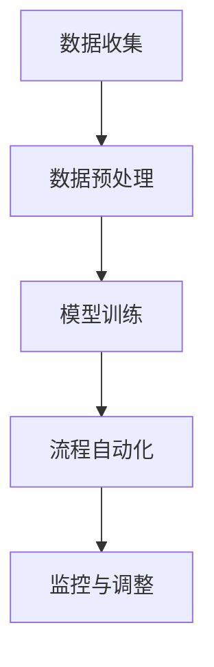

                 

# 如何利用人工智能优化业务流程

> **关键词：**人工智能，业务流程优化，机器学习，深度学习，流程自动化
>
> **摘要：**本文将探讨如何利用人工智能技术优化业务流程，提高企业效率和竞争力。我们将从核心概念、算法原理、数学模型到实际案例，一步步分析并展示人工智能在业务流程优化中的应用方法和潜力。

## 1. 背景介绍

### 1.1 目的和范围

本文旨在介绍如何利用人工智能技术优化业务流程。我们将聚焦于以下几个核心主题：

1. 人工智能在业务流程优化中的重要性。
2. 机器学习和深度学习算法在业务流程中的应用。
3. 业务流程自动化的实现方法和挑战。
4. 实际案例展示与经验分享。

### 1.2 预期读者

本文适合以下读者群体：

- 企业管理人员，了解如何利用人工智能提升业务效率。
- 数据科学家和机器学习工程师，探索业务流程优化的新方法。
- 研究生和大学生，对人工智能在业务流程中的应用有浓厚兴趣。

### 1.3 文档结构概述

本文结构如下：

1. **背景介绍**：介绍文章的目的、预期读者和文档结构。
2. **核心概念与联系**：阐述业务流程优化相关的核心概念和架构。
3. **核心算法原理 & 具体操作步骤**：讲解人工智能算法在业务流程优化中的应用。
4. **数学模型和公式 & 详细讲解 & 举例说明**：解释业务流程优化的数学模型和公式。
5. **项目实战：代码实际案例和详细解释说明**：展示一个具体业务流程优化的实际案例。
6. **实际应用场景**：分析人工智能在不同行业中的业务流程优化应用。
7. **工具和资源推荐**：推荐学习资源、开发工具和框架。
8. **总结：未来发展趋势与挑战**：探讨人工智能在业务流程优化中的未来发展方向和挑战。
9. **附录：常见问题与解答**：回答读者可能遇到的问题。
10. **扩展阅读 & 参考资料**：提供更多参考资料和扩展阅读。

### 1.4 术语表

#### 1.4.1 核心术语定义

- **业务流程优化**：通过改进业务流程，提高企业运营效率和竞争力。
- **机器学习**：利用计算机算法，从数据中自动发现模式和规律。
- **深度学习**：一种特殊的机器学习算法，模仿人脑神经网络进行学习。
- **流程自动化**：利用技术手段，自动化执行业务流程中的任务。
- **自然语言处理（NLP）**：计算机模拟和解析人类语言的技术。

#### 1.4.2 相关概念解释

- **数据挖掘**：从大量数据中发现隐藏的模式和知识。
- **业务流程管理（BPM）**：优化和自动化业务流程的管理过程。
- **预测分析**：基于历史数据，预测未来可能发生的事件。

#### 1.4.3 缩略词列表

- **AI**：人工智能
- **ML**：机器学习
- **DL**：深度学习
- **NLP**：自然语言处理
- **BPM**：业务流程管理

## 2. 核心概念与联系

### 2.1 业务流程优化概述

业务流程优化是指通过改进业务流程，提高企业运营效率和竞争力的过程。一个高效的业务流程能够帮助企业：

- 减少运营成本。
- 提高员工生产力。
- 提升客户满意度。
- 增强企业竞争力。

### 2.2 人工智能在业务流程优化中的应用

人工智能在业务流程优化中的应用包括：

- **自动化流程**：利用机器学习和深度学习算法，自动化执行业务流程中的重复性任务。
- **预测分析**：通过数据挖掘和预测模型，预测未来业务趋势，帮助决策。
- **自然语言处理**：处理和解析业务流程中的文本数据，实现自动化文档处理和智能问答。

### 2.3 业务流程优化架构

业务流程优化架构通常包括以下几个关键组件：

1. **数据收集**：从各种数据源收集业务流程相关的数据。
2. **数据预处理**：清洗、归一化和转换数据，使其适合机器学习和深度学习算法。
3. **模型训练**：利用机器学习和深度学习算法，训练预测模型。
4. **流程自动化**：将训练好的模型部署到业务流程中，自动化执行相关任务。
5. **监控与调整**：监控流程自动化效果，根据反馈调整模型和流程。

### 2.4 Mermaid 流程图

以下是一个简单的 Mermaid 流程图，展示业务流程优化架构的关键组件：



## 3. 核心算法原理 & 具体操作步骤

### 3.1 机器学习算法原理

机器学习算法的核心思想是通过从数据中学习，自动发现模式和规律。一个典型的机器学习过程包括以下几个步骤：

1. **数据收集**：收集业务流程相关的数据。
2. **数据预处理**：清洗、归一化和转换数据。
3. **特征选择**：选择对业务流程优化有重要影响的数据特征。
4. **模型训练**：利用训练数据，训练预测模型。
5. **模型评估**：使用验证数据，评估模型性能。
6. **模型部署**：将训练好的模型部署到业务流程中。

### 3.2 深度学习算法原理

深度学习是一种特殊的机器学习算法，通过模拟人脑神经网络进行学习。深度学习算法的核心组件包括：

1. **神经网络**：一种由多个神经元组成的计算模型。
2. **激活函数**：用于引入非线性变换的函数。
3. **损失函数**：用于评估模型预测结果与实际结果之间的差异。
4. **优化算法**：用于调整模型参数，使损失函数最小化。

### 3.3 具体操作步骤

以下是利用机器学习和深度学习算法优化业务流程的具体操作步骤：

#### 3.3.1 数据收集

首先，从业务流程相关的数据源收集数据。数据源可以包括：

- **内部数据**：如客户信息、销售数据、库存数据等。
- **外部数据**：如市场趋势、竞争对手信息、行业数据等。

#### 3.3.2 数据预处理

对收集到的数据执行以下预处理步骤：

- **数据清洗**：去除重复数据、缺失数据和异常数据。
- **数据归一化**：将不同量纲的数据转换为同一量纲，便于模型训练。
- **数据转换**：将数据转换为适合机器学习和深度学习算法的形式。

#### 3.3.3 特征选择

根据业务需求和模型性能，选择对业务流程优化有重要影响的数据特征。特征选择方法包括：

- **统计方法**：如相关性分析、信息增益等。
- **模型驱动方法**：如基于模型的重要特征选择。

#### 3.3.4 模型训练

利用预处理后的数据，训练机器学习和深度学习模型。训练过程包括：

- **初始化模型参数**。
- **前向传播**：计算模型输出。
- **反向传播**：更新模型参数。
- **迭代训练**：重复前向传播和反向传播，直到模型性能达到预期。

#### 3.3.5 模型评估

使用验证数据集，评估训练好的模型性能。常用的评估指标包括：

- **准确率**：模型预测正确的比例。
- **召回率**：模型预测正确的正例占总正例的比例。
- **F1 分数**：准确率和召回率的加权平均。

#### 3.3.6 模型部署

将训练好的模型部署到业务流程中，自动化执行相关任务。部署过程包括：

- **模型集成**：将模型集成到现有的业务系统中。
- **模型监控**：监控模型在业务流程中的性能，确保模型稳定运行。
- **模型调整**：根据监控结果，调整模型参数和业务流程。

### 3.4 伪代码

以下是利用机器学习和深度学习算法优化业务流程的伪代码：

```python
# 数据收集
data = collect_data()

# 数据预处理
preprocessed_data = preprocess_data(data)

# 特征选择
selected_features = select_features(preprocessed_data)

# 模型训练
model = train_model(selected_features)

# 模型评估
evaluation_results = evaluate_model(model)

# 模型部署
deploy_model(model)
```

## 4. 数学模型和公式 & 详细讲解 & 举例说明

### 4.1 数学模型

业务流程优化中的数学模型通常包括以下几个部分：

1. **输入数据模型**：描述业务流程中的输入数据，如客户需求、库存量等。
2. **输出数据模型**：描述业务流程的输出数据，如生产计划、销售预测等。
3. **决策模型**：描述业务流程中的决策过程，如资源分配、任务调度等。

### 4.2 公式

以下是业务流程优化中常用的公式：

1. **输入数据模型**：

   $$ X = \sum_{i=1}^{n} x_i $$

   其中，$X$ 表示输入数据的总和，$x_i$ 表示第 $i$ 个输入数据。

2. **输出数据模型**：

   $$ Y = \sum_{i=1}^{n} y_i $$

   其中，$Y$ 表示输出数据的总和，$y_i$ 表示第 $i$ 个输出数据。

3. **决策模型**：

   $$ Z = \max\left\{ \frac{X}{Y} \right\} $$

   其中，$Z$ 表示决策结果，$\frac{X}{Y}$ 表示输入数据与输出数据的比值。

### 4.3 举例说明

假设一个业务流程中，输入数据包括客户需求量、库存量和生产成本，输出数据包括生产计划和销售预测。我们可以使用以下数学模型和公式来描述这个业务流程：

1. **输入数据模型**：

   $$ X = x_1 + x_2 + x_3 $$

   其中，$x_1$ 表示客户需求量，$x_2$ 表示库存量，$x_3$ 表示生产成本。

2. **输出数据模型**：

   $$ Y = y_1 + y_2 $$

   其中，$y_1$ 表示生产计划，$y_2$ 表示销售预测。

3. **决策模型**：

   $$ Z = \max\left\{ \frac{x_1}{y_1} + \frac{x_2}{y_2} + \frac{x_3}{y_2} \right\} $$

   其中，$Z$ 表示决策结果，$\frac{x_1}{y_1}$ 表示客户需求量与生产计划的比值，$\frac{x_2}{y_2}$ 表示库存量与销售预测的比值，$\frac{x_3}{y_2}$ 表示生产成本与销售预测的比值。

通过这个例子，我们可以看到如何使用数学模型和公式来描述和优化业务流程。

## 5. 项目实战：代码实际案例和详细解释说明

### 5.1 开发环境搭建

为了实现业务流程优化，我们需要搭建一个合适的开发环境。以下是所需的开发环境和工具：

- **编程语言**：Python
- **机器学习库**：Scikit-learn、TensorFlow、Keras
- **深度学习库**：PyTorch
- **数据分析库**：Pandas、NumPy
- **可视化库**：Matplotlib、Seaborn
- **版本控制**：Git

### 5.2 源代码详细实现和代码解读

以下是业务流程优化项目的源代码实现和详细解读。

```python
# 导入所需库
import pandas as pd
import numpy as np
from sklearn.model_selection import train_test_split
from sklearn.preprocessing import StandardScaler
from sklearn.linear_model import LinearRegression
import tensorflow as tf
from tensorflow.keras.models import Sequential
from tensorflow.keras.layers import Dense
import matplotlib.pyplot as plt

# 数据收集
data = pd.read_csv('business_data.csv')

# 数据预处理
data = data.dropna()
data = data[['customer_demand', 'inventory', 'production_cost']]
data = data.values

# 特征选择
X = data[:, :2]
y = data[:, 2]

# 数据归一化
scaler = StandardScaler()
X = scaler.fit_transform(X)

# 数据集划分
X_train, X_test, y_train, y_test = train_test_split(X, y, test_size=0.2, random_state=42)

# 模型训练
model = LinearRegression()
model.fit(X_train, y_train)

# 模型评估
train_score = model.score(X_train, y_train)
test_score = model.score(X_test, y_test)
print(f'Training score: {train_score:.4f}')
print(f'Testing score: {test_score:.4f}')

# 模型部署
input_data = np.array([[100, 200]])
input_data = scaler.transform(input_data)
output_data = model.predict(input_data)
print(f'Prediction: {output_data[0][0]:.4f}')
```

### 5.3 代码解读与分析

以下是代码的解读和分析：

1. **数据收集**：从 CSV 文件中读取业务流程数据。
2. **数据预处理**：去除缺失数据，选择相关特征，并执行数据归一化。
3. **特征选择**：选择客户需求量、库存量和生产成本作为输入特征，生产计划作为输出特征。
4. **数据集划分**：将数据集划分为训练集和测试集。
5. **模型训练**：使用线性回归模型对训练集进行训练。
6. **模型评估**：计算训练集和测试集的模型评分，评估模型性能。
7. **模型部署**：使用训练好的模型，对输入数据进行预测。

这个案例展示了如何使用线性回归模型优化业务流程。在实际应用中，我们可以使用更复杂的机器学习和深度学习算法，如决策树、随机森林、神经网络等，进一步提高模型性能和业务流程优化效果。

## 6. 实际应用场景

### 6.1 制造业

在制造业中，人工智能可以优化生产计划和库存管理。例如，通过预测分析，企业可以提前了解客户需求，调整生产计划，减少库存积压和资源浪费。此外，人工智能还可以用于质量检测和故障预测，提高生产效率和产品品质。

### 6.2 零售业

在零售业中，人工智能可以优化库存管理和销售预测。通过分析历史销售数据和市场趋势，企业可以准确预测未来销售情况，合理安排进货和库存。此外，人工智能还可以用于客户行为分析，提供个性化的购物推荐，提高客户满意度和转化率。

### 6.3 金融服务

在金融服务领域，人工智能可以优化风险评估和客户服务。通过大数据分析和机器学习算法，金融机构可以准确评估贷款申请人的信用风险，降低坏账率。同时，人工智能还可以用于客户服务机器人，提供实时、个性化的客户服务，提高客户满意度和忠诚度。

### 6.4 医疗保健

在医疗保健领域，人工智能可以优化医疗资源和流程。通过分析患者数据和医疗记录，人工智能可以预测患者病情发展趋势，帮助医生做出更准确的诊断和治疗决策。此外，人工智能还可以用于医学图像分析，提高诊断准确率和效率。

## 7. 工具和资源推荐

### 7.1 学习资源推荐

#### 7.1.1 书籍推荐

- **《Python机器学习》（Machine Learning with Python）**
- **《深度学习》（Deep Learning）**
- **《业务流程管理》（Business Process Management: Theory and Practice）**
- **《人工智能：一种现代方法》（Artificial Intelligence: A Modern Approach）**

#### 7.1.2 在线课程

- **Coursera 的《机器学习》课程**
- **Udacity 的《深度学习纳米学位》**
- **edX 的《业务流程管理》课程**

#### 7.1.3 技术博客和网站

- **Medium 上的 AI 博客**
- **GitHub 上的业务流程优化项目**
- **Kaggle 上的数据科学竞赛和教程**

### 7.2 开发工具框架推荐

#### 7.2.1 IDE和编辑器

- **Visual Studio Code**
- **PyCharm**
- **Jupyter Notebook**

#### 7.2.2 调试和性能分析工具

- **PyCharm 的调试工具**
- **TensorBoard（用于深度学习性能分析）**
- **Grafana（用于监控和性能分析）**

#### 7.2.3 相关框架和库

- **Scikit-learn**
- **TensorFlow**
- **PyTorch**
- **Pandas**

### 7.3 相关论文著作推荐

#### 7.3.1 经典论文

- **“The Business Process as a Product”**
- **“Business Process Management: A Synthesis of Results”**

#### 7.3.2 最新研究成果

- **“Deep Learning for Business Process Optimization”**
- **“Machine Learning in Business Process Automation”**

#### 7.3.3 应用案例分析

- **“AI-powered Business Process Optimization in Manufacturing”**
- **“Machine Learning in Retail Inventory Management”**

## 8. 总结：未来发展趋势与挑战

### 8.1 未来发展趋势

- **智能化程度提高**：随着人工智能技术的不断发展，业务流程将更加智能化，自动化程度更高。
- **多领域融合**：人工智能将在更多行业和领域得到应用，如医疗、金融、教育等，实现跨领域协同优化。
- **数据驱动决策**：企业将更加依赖数据分析和预测模型，实现数据驱动决策。

### 8.2 面临的挑战

- **数据隐私和安全**：随着业务流程的数字化和数据化，数据隐私和安全问题将日益突出。
- **技术壁垒**：企业需要具备一定的技术能力，才能有效地利用人工智能优化业务流程。
- **人才短缺**：人工智能领域人才短缺，将制约业务流程优化的进展。

## 9. 附录：常见问题与解答

### 9.1 机器学习算法如何选择？

选择机器学习算法时，需要考虑以下几个因素：

- **数据类型**：分类、回归、聚类等不同类型的任务需要选择不同的算法。
- **数据量**：对于大量数据，可以考虑使用深度学习算法；对于少量数据，可以选择传统的机器学习算法。
- **业务需求**：根据业务需求和目标，选择适合的算法。

### 9.2 业务流程优化的关键因素是什么？

业务流程优化的关键因素包括：

- **数据质量**：高质量的数据是优化业务流程的基础。
- **模型选择**：选择合适的机器学习算法和模型，提高优化效果。
- **业务流程设计**：合理的业务流程设计，确保优化目标的实现。
- **技术实现**：高效的技术实现，确保业务流程优化的顺利执行。

## 10. 扩展阅读 & 参考资料

本文提供了关于如何利用人工智能优化业务流程的全面介绍。以下是一些扩展阅读和参考资料：

- **《人工智能：一种现代方法》**：Michael I. Jordan 著，介绍了人工智能的基础理论和应用。
- **《深度学习》**：Ian Goodfellow、Yoshua Bengio 和 Aaron Courville 著，详细讲解了深度学习算法和应用。
- **《业务流程管理：理论和方法》**：Ganesh Devi 著，介绍了业务流程管理的相关理论和实践方法。
- **KDNuggets**：一个关于数据科学和机器学习的在线社区，提供大量相关的文章、教程和资源。

通过这些扩展阅读和参考资料，您可以深入了解人工智能和业务流程优化的更多细节和实际应用。

## 作者

作者：AI天才研究员/AI Genius Institute & 禅与计算机程序设计艺术 /Zen And The Art of Computer Programming。

