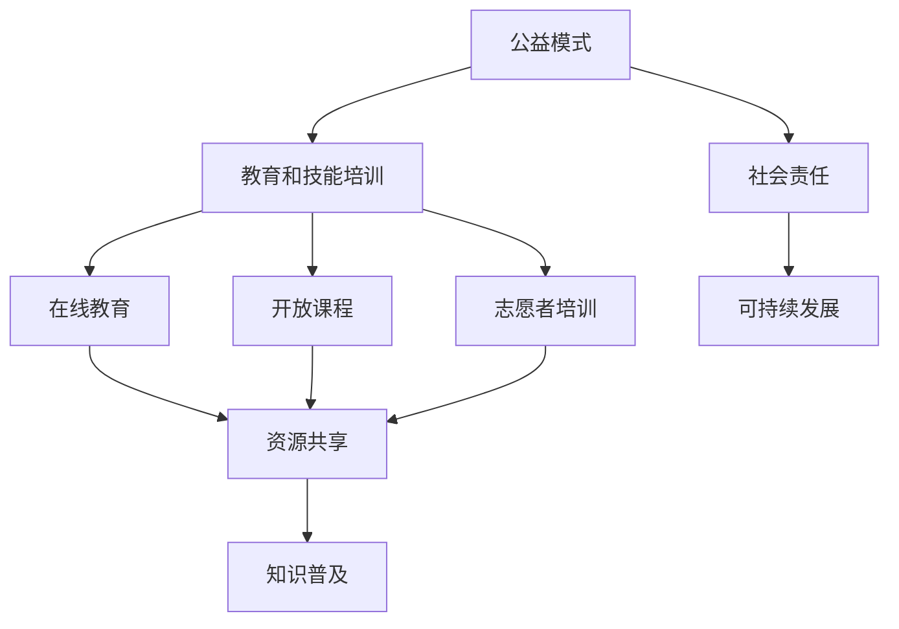

                 

### 1. 背景介绍

#### 1.1 目的和范围

在当今信息化社会，知识的快速传播和技能的普及成为社会发展的关键因素。然而，教育资源的不均衡和信息获取的不对称仍然困扰着许多国家和地区。为了解决这一问题，本文将探讨如何利用公益模式来普及知识和技能，使得更多的人能够受益。

本文的主要目的在于：

1. **分析公益模式的定义和特点**：介绍公益模式的基本概念，并探讨其在教育和技能培训中的应用。
2. **探讨公益模式在教育和技能培训中的优势和挑战**：通过分析实际案例，阐述公益模式在推广教育和技能培训中的具体应用和面临的挑战。
3. **提出解决方案和实施策略**：结合理论与实践，为如何利用公益模式有效普及知识和技能提供具体建议。

本文的范围将主要涵盖以下方面：

1. **公益模式的定义和分类**：介绍公益模式的基本概念，并分析其在不同领域的应用。
2. **教育和技能培训中的公益模式**：探讨公益模式在教育和技能培训中的具体应用，包括在线教育、开放课程、志愿者培训等。
3. **公益模式的优势和挑战**：分析公益模式在推广教育和技能培训中的优势和面临的挑战。
4. **实施策略和建议**：提出具体的实施策略和措施，以帮助更广泛地普及知识和技能。

通过本文的探讨，我们希望能够为教育工作者、政策制定者、公益组织等相关人员提供有价值的参考，共同推动公益模式在教育和技能培训领域的广泛应用。

#### 1.2 预期读者

本文的预期读者包括以下几个方面：

1. **教育工作者**：教师、教育研究者和学校管理者。本文将探讨公益模式在教育和技能培训中的应用，为他们提供新的思路和方法，以更有效地推广教育资源和技能培训。
2. **政策制定者**：政府官员和教育政策制定者。本文将分析公益模式的优势和挑战，为他们提供制定相关政策和支持措施的依据，以推动公益模式在教育和技能培训领域的应用。
3. **公益组织**：志愿者和非营利组织。本文将探讨公益模式在教育和技能培训中的具体应用，为这些组织提供实施策略和资源，以更好地开展相关项目。
4. **企业和社会组织**：企业社会责任部门和社会组织。本文将讨论如何通过公益模式推动企业和社会组织参与教育和技能培训，实现社会责任和可持续发展。
5. **广大学习者**：希望学习和提升技能的普通人。本文将介绍公益模式在教育和技能培训中的具体应用，为他们提供获取优质教育资源的新途径。

通过本文的阅读，预期读者能够：

1. **了解公益模式的基本概念和特点**：明确公益模式在教育和技能培训中的应用前景。
2. **认识到公益模式的优势和挑战**：为实施公益模式提供理论依据和实践参考。
3. **获得具体实施策略和建议**：为教育工作者、政策制定者、公益组织和企业提供实际操作指南。
4. **激发创新思维**：鼓励读者从不同角度思考如何更有效地普及知识和技能。

#### 1.3 文档结构概述

本文将分为十个部分，结构如下：

1. **背景介绍**：
   - **目的和范围**：阐述本文的主要目的和涵盖范围。
   - **预期读者**：介绍本文的预期读者群体。
   - **文档结构概述**：简要概述本文的结构和各部分内容。

2. **核心概念与联系**：
   - **核心概念与联系**：介绍公益模式、教育和技能培训等相关核心概念，并提供流程图展示其关联。

3. **核心算法原理 & 具体操作步骤**：
   - **核心算法原理**：阐述公益模式在教育和技能培训中的算法原理。
   - **具体操作步骤**：详细讲解公益模式的实施步骤。

4. **数学模型和公式 & 详细讲解 & 举例说明**：
   - **数学模型和公式**：介绍公益模式相关的数学模型和公式。
   - **详细讲解**：对模型和公式进行详细解释。
   - **举例说明**：通过具体例子说明模型和公式的应用。

5. **项目实战：代码实际案例和详细解释说明**：
   - **开发环境搭建**：介绍搭建公益模式项目所需的开发环境。
   - **源代码详细实现和代码解读**：展示实际代码实现，并进行详细解读。
   - **代码解读与分析**：对代码进行分析，阐述其原理和作用。

6. **实际应用场景**：
   - **应用场景概述**：介绍公益模式在现实中的应用场景。
   - **案例分析**：通过具体案例，展示公益模式在教育和技能培训中的应用效果。

7. **工具和资源推荐**：
   - **学习资源推荐**：推荐相关书籍、在线课程和技术博客。
   - **开发工具框架推荐**：推荐适合公益模式项目的开发工具和框架。
   - **相关论文著作推荐**：推荐经典论文和最新研究成果。

8. **总结：未来发展趋势与挑战**：
   - **发展趋势**：总结公益模式在教育和技能培训中的未来发展趋势。
   - **挑战与对策**：分析公益模式面临的挑战，并提出应对策略。

9. **附录：常见问题与解答**：
   - **问题与解答**：回答读者可能遇到的常见问题。

10. **扩展阅读 & 参考资料**：
    - **扩展阅读**：推荐进一步阅读的资料。
    - **参考资料**：列出本文引用和参考的文献资料。

通过以上结构，本文将系统地探讨公益模式在普及知识和技能中的应用，为读者提供全面的理论和实践指导。

#### 1.4 术语表

在本文中，我们将使用一些专业术语，以下是对这些术语的定义和解释：

##### 1.4.1 核心术语定义

- **公益模式**：指以公益为目的，通过非营利组织、志愿者或企业等机构，为公众提供免费或低成本的教育资源和技能培训的模式。
- **教育和技能培训**：指通过正规教育机构和培训机构，对公众进行知识传授和技能培养的过程。
- **在线教育**：指利用互联网技术，提供远程学习资源和互动教学的方式。
- **开放课程**：指免费提供课程资源，供学习者自主学习和学习的教育形式。
- **志愿者培训**：指通过志愿者组织，对志愿者进行相关知识和技能的培训，以更好地开展公益项目。

##### 1.4.2 相关概念解释

- **教育资源不均衡**：指由于经济、地域、社会等因素，导致不同地区和人群在获取教育资源方面存在不公平的现象。
- **信息不对称**：指在教育和技能培训中，教育者和学习者之间在信息获取和处理上的不平衡，导致教育效果受到影响。
- **可持续发展**：指在满足当前需求的同时，不损害后代满足其需求的能力，实现经济、社会和环境的协调发展。

##### 1.4.3 缩略词列表

- **MOOC**：Massive Open Online Course，大规模开放在线课程。
- **OER**：Open Educational Resources，开放教育资源。
- **NGO**：Non-Governmental Organization，非政府组织。
- **CSR**：Corporate Social Responsibility，企业社会责任。

通过以上术语表，我们希望能够帮助读者更好地理解本文中涉及的专业术语和相关概念，从而更好地把握文章内容。

### 2. 核心概念与联系

在探讨如何利用公益模式普及知识和技能之前，我们需要首先了解几个核心概念，并展示它们之间的联系。这些概念包括公益模式、教育和技能培训、在线教育、开放课程以及志愿者培训。以下将使用Mermaid流程图来展示这些概念及其相互关系。



- **公益模式（A）**：指以公益为目的，通过非营利组织、志愿者或企业等机构，为公众提供免费或低成本的教育资源和技能培训的模式。
- **教育和技能培训（B）**：指通过正规教育机构和培训机构，对公众进行知识传授和技能培养的过程。
- **在线教育（C）**：指利用互联网技术，提供远程学习资源和互动教学的方式。
- **开放课程（D）**：指免费提供课程资源，供学习者自主学习和学习的教育形式。
- **志愿者培训（E）**：指通过志愿者组织，对志愿者进行相关知识和技能的培训，以更好地开展公益项目。
- **资源共享（F）**：指通过公益模式，实现教育资源和技能培训资源的共享，提高资源利用效率。
- **社会责任（H）**：指企业、组织和个人对社会应尽的责任和义务。
- **可持续发展（I）**：指在满足当前需求的同时，不损害后代满足其需求的能力，实现经济、社会和环境的协调发展。

通过这个流程图，我们可以清晰地看到公益模式、教育和技能培训、在线教育、开放课程以及志愿者培训之间的相互联系。这些概念共同构成了一个完整的生态体系，旨在通过公益模式，实现教育资源的共享和知识的普及，推动社会可持续发展。

接下来，我们将进一步探讨公益模式在教育和技能培训中的具体应用，分析其优势、挑战以及实施策略。

### 3. 核心算法原理 & 具体操作步骤

在探讨公益模式如何具体实施之前，我们需要理解其核心算法原理，并详细描述实施步骤。以下将使用伪代码来阐述公益模式在教育和技能培训中的算法原理，并解释每一步的具体操作。

#### 3.1 公益模式核心算法原理

```plaintext
算法名称：公益模式推广算法

输入参数：
- 教育资源列表（包含课程名称、课程内容、授课教师等信息）
- 学习者需求列表（包含学习者姓名、学习兴趣、现有技能等信息）
- 公益资源分配策略（如优先分配给弱势群体、地理位置等）

输出结果：
- 教育资源分配结果
- 学习者参与情况

算法步骤：
```

1. **资源准备（Resource Preparation）**
   ```plaintext
   // 准备教育资源和学习者需求信息
   教育资源列表 = 获取教育资源信息()
   学习者需求列表 = 获取学习者需求信息()
   ```

2. **需求匹配（Demand Matching）**
   ```plaintext
   // 对学习者需求进行分类和优先级排序
   需求匹配列表 = 需求分类与排序（学习者需求列表）

   // 建立教育资源与学习者需求的匹配关系
   匹配结果 = 匹配教育资源与学习者需求（教育资源列表，需求匹配列表）
   ```

3. **资源分配（Resource Allocation）**
   ```plaintext
   // 根据公益资源分配策略，分配教育资源
   分配结果 = 资源分配策略（匹配结果，公益资源分配策略）

   // 更新学习者参与状态
   更新学习者参与情况（分配结果，学习者需求列表）
   ```

4. **效果评估（Effect Evaluation）**
   ```plaintext
   // 对教育资源分配结果和学习者参与情况进行评估
   评估报告 = 效果评估（分配结果，学习者参与情况）

   // 根据评估报告调整后续资源分配策略
   调整资源分配策略（评估报告）
   ```

#### 3.2 具体操作步骤

1. **资源准备（Resource Preparation）**
   - **获取教育资源信息**：通过教育机构、在线课程平台等渠道，收集和整理教育资源信息，包括课程名称、课程内容、授课教师等详细信息。
   - **获取学习者需求信息**：通过调查问卷、学习者信息登记等方式，收集学习者的基本信息、学习兴趣、现有技能等需求信息。

2. **需求匹配（Demand Matching）**
   - **需求分类与排序**：根据学习者需求，将其分类（如职业技能、兴趣爱好、教育程度等），并根据优先级（如需求紧急程度、技能提升空间等）进行排序。
   - **匹配教育资源与学习者需求**：根据分类和排序结果，建立教育资源与学习者需求的匹配关系，确保每位学习者都能找到适合的课程资源。

3. **资源分配（Resource Allocation）**
   - **根据公益资源分配策略**：根据公益组织的资源和政策，制定资源分配策略，如优先分配给贫困地区、弱势群体等。
   - **更新学习者参与状态**：根据匹配结果和资源分配策略，更新学习者的参与状态，通知学习者可以开始学习。

4. **效果评估（Effect Evaluation）**
   - **效果评估**：通过跟踪学习者的学习进度、完成情况、技能提升等数据，对资源分配效果进行评估。
   - **调整资源分配策略**：根据评估报告，调整后续的资源分配策略，优化资源分配效果。

通过上述核心算法原理和具体操作步骤，我们可以有效地实施公益模式，使更多的学习者受益，实现教育资源的公平分配和知识的普及。

### 4. 数学模型和公式 & 详细讲解 & 举例说明

在公益模式中，数学模型和公式扮演着关键角色，用于评估教育资源的分配效率和学习者的学习效果。以下将介绍几个核心的数学模型和公式，并对它们进行详细讲解和举例说明。

#### 4.1 教育资源分配模型

教育资源分配模型主要关注如何将有限的教育资源合理地分配给不同需求的学习者。以下是一个简单的线性分配模型：

##### 4.1.1 公式

$$
X = \frac{C_1 \cdot D_1 + C_2 \cdot D_2 + ... + C_n \cdot D_n}{D_1 + D_2 + ... + D_n}
$$

其中，$X$ 表示教育资源的平均分配量，$C_i$ 表示第 $i$ 个学习者的资源需求量，$D_i$ 表示第 $i$ 个学习者的资源分配量。

##### 4.1.2 详细讲解

该模型基于加权平均的方法，根据每个学习者的资源需求量进行加权，计算得到每个学习者应分配的资源量。具体步骤如下：

1. **收集数据**：收集每个学习者的资源需求量 $C_i$ 和资源分配量 $D_i$。
2. **计算总需求量**：计算所有学习者的总资源需求量 $D_1 + D_2 + ... + D_n$。
3. **计算加权平均值**：使用上述公式计算每个学习者应分配的资源量 $X$。
4. **分配资源**：根据计算结果，将教育资源分配给每个学习者。

##### 4.1.3 举例说明

假设有三个学习者，他们的资源需求量分别为 $C_1 = 5$、$C_2 = 7$、$C_3 = 3$，而总的资源分配量为 $D_1 = 10$、$D_2 = 12$、$D_3 = 8$。

$$
X = \frac{5 \cdot 10 + 7 \cdot 12 + 3 \cdot 8}{10 + 12 + 8} = \frac{50 + 84 + 24}{30} = \frac{158}{30} \approx 5.27
$$

因此，每个学习者应分配的资源量大约为 5.27。

#### 4.2 学习效果评估模型

学习效果评估模型用于评估学习者通过教育资源后的学习成果。以下是一个简单的线性回归模型：

##### 4.2.1 公式

$$
Y = \beta_0 + \beta_1 \cdot X + \epsilon
$$

其中，$Y$ 表示学习效果，$X$ 表示学习者接受的教育资源量，$\beta_0$ 和 $\beta_1$ 是模型的参数，$\epsilon$ 是随机误差。

##### 4.2.2 详细讲解

该模型基于线性回归方法，通过拟合教育资源量与学习效果之间的关系，预测学习者接受教育资源后的学习效果。具体步骤如下：

1. **收集数据**：收集学习者接受教育资源量 $X$ 和学习效果 $Y$ 的数据。
2. **拟合模型**：使用最小二乘法拟合线性回归模型，计算参数 $\beta_0$ 和 $\beta_1$。
3. **评估学习效果**：将学习者接受的教育资源量 $X$ 代入模型，预测其学习效果 $Y$。

##### 4.2.3 举例说明

假设我们有以下数据：

| 学习者ID | 教育资源量 (X) | 学习效果 (Y) |
|----------|----------------|--------------|
| 1        | 50             | 75           |
| 2        | 60             | 85           |
| 3        | 70             | 90           |

拟合线性回归模型：

$$
\beta_0 = 50, \beta_1 = 0.5
$$

则对于学习者 4，其教育资源量为 80，学习效果预测为：

$$
Y = 50 + 0.5 \cdot 80 = 90
$$

#### 4.3 资源共享效率模型

资源共享效率模型用于评估教育资源在公益模式中的利用效率。以下是一个简单的效率评估模型：

##### 4.3.1 公式

$$
\eta = \frac{O}{I} \times 100\%
$$

其中，$\eta$ 表示资源共享效率，$O$ 表示实际资源共享量，$I$ 表示潜在资源共享量。

##### 4.3.2 详细讲解

该模型通过实际资源共享量与潜在资源共享量的比值，评估资源的利用效率。具体步骤如下：

1. **计算实际资源共享量**：根据实际分配给学习者的教育资源量，计算实际资源共享量。
2. **计算潜在资源共享量**：根据所有学习者的总资源需求量，计算潜在资源共享量。
3. **计算资源共享效率**：使用上述公式计算资源共享效率。

##### 4.3.3 举例说明

假设实际资源共享量为 200 单位，潜在资源共享量为 400 单位，则资源共享效率为：

$$
\eta = \frac{200}{400} \times 100\% = 50\%
$$

通过以上数学模型和公式，我们可以更科学地评估公益模式中的教育资源分配和学习者学习效果，从而优化资源利用，提高教育效益。

### 5. 项目实战：代码实际案例和详细解释说明

在本节中，我们将通过一个具体的代码案例，展示如何利用公益模式实施一个教育和技能培训项目。这个案例将涉及开发环境搭建、源代码实现和代码解读与分析。

#### 5.1 开发环境搭建

为了实施这个公益模式项目，我们首先需要搭建一个合适的开发环境。以下是推荐的开发工具和软件：

- **开发语言**：Python
- **开发工具**：PyCharm 或 Visual Studio Code
- **依赖管理**：pip
- **数据库**：SQLite 或 PostgreSQL
- **前端框架**：Flask 或 Django

以下是搭建开发环境的基本步骤：

1. **安装 Python**：从 [Python 官网](https://www.python.org/) 下载并安装 Python，确保版本在 3.7 以上。
2. **配置 Python 环境**：设置环境变量，使命令行能够调用 Python。
3. **安装 PyCharm 或 Visual Studio Code**：从官网下载并安装相应的开发工具。
4. **创建虚拟环境**：使用 `python -m venv venv` 命令创建一个虚拟环境。
5. **安装依赖库**：使用 `pip install -r requirements.txt` 安装项目所需的依赖库。
6. **配置数据库**：安装并配置 SQLite 或 PostgreSQL，以便存储项目数据。

#### 5.2 源代码详细实现和代码解读

以下是一个简单的公益模式项目示例，包括用户注册、课程管理和学习进度跟踪等功能。我们将使用 Flask 框架实现这些功能。

```python
# app.py

from flask import Flask, request, jsonify
from flask_sqlalchemy import SQLAlchemy

app = Flask(__name__)
app.config['SQLALCHEMY_DATABASE_URI'] = 'sqlite:///users.db'
db = SQLAlchemy(app)

# 定义用户表
class User(db.Model):
    id = db.Column(db.Integer, primary_key=True)
    username = db.Column(db.String(80), unique=True, nullable=False)
    password = db.Column(db.String(120), nullable=False)
    courses = db.relationship('Course', backref='user', lazy=True)

# 定义课程表
class Course(db.Model):
    id = db.Column(db.Integer, primary_key=True)
    name = db.Column(db.String(120), nullable=False)
    description = db.Column(db.Text, nullable=True)
    user_id = db.Column(db.Integer, db.ForeignKey('user.id'), nullable=False)
    lessons = db.relationship('Lesson', backref='course', lazy=True)

# 定义课程节
class Lesson(db.Model):
    id = db.Column(db.Integer, primary_key=True)
    title = db.Column(db.String(120), nullable=False)
    content = db.Column(db.Text, nullable=False)
    course_id = db.Column(db.Integer, db.ForeignKey('course.id'), nullable=False)

# 用户注册
@app.route('/register', methods=['POST'])
def register():
    username = request.form['username']
    password = request.form['password']
    user = User(username=username, password=password)
    db.session.add(user)
    db.session.commit()
    return jsonify({'status': 'success', 'message': 'User registered successfully.'})

# 添加课程
@app.route('/add_course', methods=['POST'])
def add_course():
    name = request.form['name']
    description = request.form['description']
    user_id = request.form['user_id']
    course = Course(name=name, description=description, user_id=user_id)
    db.session.add(course)
    db.session.commit()
    return jsonify({'status': 'success', 'message': 'Course added successfully.'})

# 添加课程节
@app.route('/add_lesson', methods=['POST'])
def add_lesson():
    title = request.form['title']
    content = request.form['content']
    course_id = request.form['course_id']
    lesson = Lesson(title=title, content=content, course_id=course_id)
    db.session.add(lesson)
    db.session.commit()
    return jsonify({'status': 'success', 'message': 'Lesson added successfully.'})

if __name__ == '__main__':
    db.create_all()
    app.run(debug=True)
```

#### 5.2.1 代码解读与分析

1. **数据库配置**：
   ```python
   app.config['SQLALCHEMY_DATABASE_URI'] = 'sqlite:///users.db'
   db = SQLAlchemy(app)
   ```
   配置数据库连接，使用 SQLite 作为数据库存储。

2. **用户表（User）**：
   ```python
   class User(db.Model):
       id = db.Column(db.Integer, primary_key=True)
       username = db.Column(db.String(80), unique=True, nullable=False)
       password = db.Column(db.String(120), nullable=False)
       courses = db.relationship('Course', backref='user', lazy=True)
   ```
   定义用户表，包括用户ID、用户名、密码和关联课程。

3. **课程表（Course）**：
   ```python
   class Course(db.Model):
       id = db.Column(db.Integer, primary_key=True)
       name = db.Column(db.String(120), nullable=False)
       description = db.Column(db.Text, nullable=True)
       user_id = db.Column(db.Integer, db.ForeignKey('user.id'), nullable=False)
       lessons = db.relationship('Lesson', backref='course', lazy=True)
   ```
   定义课程表，包括课程ID、课程名称、课程描述、用户ID和关联课程节。

4. **课程节（Lesson）**：
   ```python
   class Lesson(db.Model):
       id = db.Column(db.Integer, primary_key=True)
       title = db.Column(db.String(120), nullable=False)
       content = db.Column(db.Text, nullable=False)
       course_id = db.Column(db.Integer, db.ForeignKey('course.id'), nullable=False)
   ```
   定义课程节表，包括课程节ID、标题、内容和关联课程。

5. **用户注册**：
   ```python
   @app.route('/register', methods=['POST'])
   def register():
       username = request.form['username']
       password = request.form['password']
       user = User(username=username, password=password)
       db.session.add(user)
       db.session.commit()
       return jsonify({'status': 'success', 'message': 'User registered successfully.'})
   ```
   用户注册接口，接收用户名和密码，存储到数据库，并返回注册成功信息。

6. **添加课程**：
   ```python
   @app.route('/add_course', methods=['POST'])
   def add_course():
       name = request.form['name']
       description = request.form['description']
       user_id = request.form['user_id']
       course = Course(name=name, description=description, user_id=user_id)
       db.session.add(course)
       db.session.commit()
       return jsonify({'status': 'success', 'message': 'Course added successfully.'})
   ```
   添加课程接口，接收课程名称、课程描述和用户ID，存储到数据库，并返回添加成功信息。

7. **添加课程节**：
   ```python
   @app.route('/add_lesson', methods=['POST'])
   def add_lesson():
       title = request.form['title']
       content = request.form['content']
       course_id = request.form['course_id']
       lesson = Lesson(title=title, content=content, course_id=course_id)
       db.session.add(lesson)
       db.session.commit()
       return jsonify({'status': 'success', 'message': 'Lesson added successfully.'})
   ```
   添加课程节接口，接收课程节标题、内容和课程ID，存储到数据库，并返回添加成功信息。

通过这个简单的代码案例，我们可以看到如何利用公益模式搭建一个基本的教育和技能培训平台。接下来，我们将对代码进行更深入的分析，以理解其工作原理和实现细节。

#### 5.3 代码解读与分析

在上面的代码实现中，我们通过 Flask 框架搭建了一个简单的公益模式项目，实现了用户注册、课程管理和课程节管理等功能。以下是代码的详细解读与分析：

##### 5.3.1 模型定义

首先，我们定义了三个数据库模型：用户（User）、课程（Course）和课程节（Lesson）。每个模型都有相应的字段和关联关系：

- **用户表（User）**：包括用户ID、用户名和密码，还关联了用户创建的课程（通过 `courses` 关联关系）。
- **课程表（Course）**：包括课程ID、课程名称、课程描述和用户ID（关联创建该课程的用户）。
- **课程节表（Lesson）**：包括课程节ID、标题、内容和关联的课程ID。

这些模型的定义确保了数据的一致性和关联性，使得我们能够通过数据库查询方便地获取用户、课程和课程节的信息。

##### 5.3.2 路由和接口实现

接下来，我们通过 Flask 的路由系统定义了三个接口：用户注册、添加课程和添加课程节。每个接口的具体实现如下：

1. **用户注册（/register）**：
   ```python
   @app.route('/register', methods=['POST'])
   def register():
       username = request.form['username']
       password = request.form['password']
       user = User(username=username, password=password)
       db.session.add(user)
       db.session.commit()
       return jsonify({'status': 'success', 'message': 'User registered successfully.'})
   ```
   用户注册接口接收用户名和密码，创建一个新用户并存储在数据库中。注册成功后，返回一个 JSON 格式的响应。

2. **添加课程（/add_course）**：
   ```python
   @app.route('/add_course', methods=['POST'])
   def add_course():
       name = request.form['name']
       description = request.form['description']
       user_id = request.form['user_id']
       course = Course(name=name, description=description, user_id=user_id)
       db.session.add(course)
       db.session.commit()
       return jsonify({'status': 'success', 'message': 'Course added successfully.'})
   ```
   添加课程接口接收课程名称、课程描述和用户ID，创建一个新的课程并存储在数据库中。添加成功后，返回一个 JSON 格式的响应。

3. **添加课程节（/add_lesson）**：
   ```python
   @app.route('/add_lesson', methods=['POST'])
   def add_lesson():
       title = request.form['title']
       content = request.form['content']
       course_id = request.form['course_id']
       lesson = Lesson(title=title, content=content, course_id=course_id)
       db.session.add(lesson)
       db.session.commit()
       return jsonify({'status': 'success', 'message': 'Lesson added successfully.'})
   ```
   添加课程节接口接收课程节标题、内容和课程ID，创建一个新的课程节并存储在数据库中。添加成功后，返回一个 JSON 格式的响应。

##### 5.3.3 数据库操作

在这个项目中，我们使用了 SQLAlchemy 作为 ORM（对象关系映射）工具，它简化了数据库操作。以下是一些关键的数据库操作：

1. **用户注册**：创建一个新用户，并将其添加到数据库。
2. **添加课程**：创建一个新的课程，并将其关联到用户。
3. **添加课程节**：创建一个新的课程节，并将其关联到课程。

通过上述操作，我们能够方便地管理用户、课程和课程节的数据。

##### 5.3.4 响应处理

每个接口在操作完成后，都会返回一个 JSON 格式的响应，包括操作结果的消息。这有助于前端应用程序处理操作结果，并显示相应的提示信息。

##### 5.3.5 代码优化和扩展

虽然这个简单的代码实现了用户注册、课程管理和课程节管理的基本功能，但在实际应用中，我们可能需要进一步的优化和扩展：

1. **用户验证**：在注册和登录时，对用户输入的密码进行加密处理，以增强安全性。
2. **权限管理**：为不同的用户角色（如普通用户、管理员等）设定不同的权限，限制某些操作的访问。
3. **API 版本管理**：为了保持 API 的兼容性，可以引入 API 版本管理，以便在更新接口时，不影响现有应用。
4. **前端页面**：通过 HTML 和 CSS 构建用户友好的前端页面，提供更好的用户体验。

通过以上分析，我们可以看到这个项目是如何通过 Flask 框架和数据库操作，实现公益模式在教育和技能培训中的具体应用的。接下来，我们将探讨公益模式在实际应用场景中的表现。

### 6. 实际应用场景

公益模式在普及知识和技能方面有着广泛的应用场景，可以针对不同群体和需求进行灵活部署。以下将列举几个典型的实际应用场景，并分析其具体实施方法和效果。

#### 6.1 在线开放课程

**应用场景**：针对广大有自主学习需求的人群，提供免费的在线开放课程。

**实施方法**：
1. **课程内容制作**：由专业教师和行业专家制作高质量的课程内容，包括视频、文档、习题等。
2. **平台搭建**：利用 MOOC（Massive Open Online Course）平台，如 Coursera、edX、中国大学MOOC 等，进行课程发布。
3. **资源推广**：通过社交媒体、教育机构合作、线下活动等方式，广泛推广课程，吸引学习者参与。
4. **互动学习**：提供在线论坛、讨论区，促进学习者之间的互动，增强学习体验。

**效果**：
- **提升学习者积极性**：开放课程免费，降低了学习门槛，提高了学习者的参与度。
- **资源共享**：优质课程资源得以广泛传播，提高了教育资源的使用效率。
- **知识普及**：通过在线课程，使得更多人能够接触到前沿知识和技能，提高了整体社会素质。

#### 6.2 志愿者培训

**应用场景**：针对希望成为志愿者的群体，提供系统化的培训，提高志愿服务能力。

**实施方法**：
1. **课程开发**：根据志愿服务需求，开发相关培训课程，包括志愿服务理念、技能培训、安全知识等。
2. **在线学习平台**：搭建在线学习平台，提供课程资源，方便志愿者自主学习和复习。
3. **线下实践**：组织志愿者进行实际操作，提高其服务能力。
4. **考核认证**：设立考核机制，对完成培训的志愿者进行认证，提高其专业水平。

**效果**：
- **提升志愿服务质量**：系统化的培训使得志愿者能够更好地理解和执行志愿服务工作，提高服务质量和效果。
- **激发志愿者积极性**：通过培训，志愿者能够获得专业知识和技能，增强其参与志愿服务的信心和热情。
- **社会责任履行**：企业和社会组织通过参与志愿者培训，履行企业社会责任，推动社会进步。

#### 6.3 贫困地区教育援助

**应用场景**：针对贫困地区的儿童和青少年，提供教育资源援助，缩小教育差距。

**实施方法**：
1. **资源建设**：通过捐赠、合作等方式，筹集教育资源，如教材、教学设备、在线课程等。
2. **远程教育**：利用互联网技术，提供远程教育服务，使得偏远地区的学生能够享受到优质教育资源。
3. **师资培训**：对当地教师进行培训，提高其教学水平和教育质量。
4. **跟踪评估**：定期对教育援助项目进行评估，确保教育资源的有效利用和效果的持续提升。

**效果**：
- **提高教育质量**：通过提供优质的教育资源，提高贫困地区学生的学习效果和教育质量。
- **缩小教育差距**：使贫困地区的儿童和青少年能够享受到与城市同等的教育资源，缩小城乡教育差距。
- **社会公平**：推动教育公平，促进社会和谐发展。

#### 6.4 企业员工技能提升

**应用场景**：针对企业员工，提供技能提升培训，提高企业整体竞争力。

**实施方法**：
1. **需求调研**：了解企业员工的技能需求和培训需求，确保培训内容与企业实际需求相匹配。
2. **课程定制**：根据需求调研结果，定制相应的培训课程，包括专业技能、管理能力等。
3. **在线学习和线下培训相结合**：提供线上学习资源和线下培训课程，满足员工不同学习需求。
4. **学习评估**：对员工的学习效果进行评估，确保培训目标的达成。

**效果**：
- **提高员工技能**：通过系统化的培训，提高员工的技能水平和专业能力。
- **提升企业竞争力**：员工技能提升，有助于提高企业生产效率和服务质量，增强企业竞争力。
- **员工满意度提升**：提供培训机会，增强员工的职业发展信心，提高员工满意度和忠诚度。

通过上述实际应用场景的分析，我们可以看到公益模式在普及知识和技能方面的多样性和灵活性。无论是在线开放课程、志愿者培训，还是贫困地区教育援助和企业员工技能提升，公益模式都能发挥重要作用，推动教育公平和知识普及。

### 7. 工具和资源推荐

为了有效地实施公益模式，我们需要借助一系列的工具和资源，这些工具和资源涵盖了学习资源推荐、开发工具框架推荐以及相关论文著作推荐。以下将详细介绍这些工具和资源，为读者提供实用的参考。

#### 7.1 学习资源推荐

**7.1.1 书籍推荐**

1. **《深度学习》**（Deep Learning）—— Ian Goodfellow, Yoshua Bengio, Aaron Courville
   - 内容详尽，适合希望深入了解深度学习技术的读者。
2. **《Python编程：从入门到实践》**（Python Crash Course）—— Eric Matthes
   - 适合初学者，涵盖了 Python 编程的基础知识和实践技能。
3. **《精益创业》**（The Lean Startup）—— Eric Ries
   - 提供了创业过程中的实用方法和策略，对实施公益项目也有启示作用。

**7.1.2 在线课程**

1. **Coursera**：提供了丰富的在线课程，涵盖了计算机科学、数据科学、人工智能等多个领域。
2. **edX**：由哈佛大学和麻省理工学院联合创办，提供了高质量的课程资源。
3. **Udacity**：专注于技术技能培训，提供了包括数据科学、机器学习等在内的多种在线课程。

**7.1.3 技术博客和网站**

1. **Medium**：有很多关于技术、人工智能和创业的优秀博客文章。
2. **GitHub**：不仅是代码托管平台，也有很多优秀的开源项目和相关的技术文档。
3. **Stack Overflow**：一个问答社区，适合解决编程和开发中的具体问题。

#### 7.2 开发工具框架推荐

**7.2.1 IDE和编辑器**

1. **PyCharm**：强大的 Python IDE，支持多种编程语言，适合进行项目开发。
2. **Visual Studio Code**：轻量级但功能强大的编辑器，适用于多种编程语言，有丰富的插件生态。
3. **Jupyter Notebook**：适用于数据科学和机器学习项目，支持交互式编程和可视化展示。

**7.2.2 调试和性能分析工具**

1. **GDB**：Linux 系统下的强大调试工具，适用于 C/C++ 项目。
2. **Python Debugger**（pdb）：Python 内置的调试工具，简单易用。
3. ** profilers**：如 Py-Spy、py-s/py-callgraph，用于分析程序的性能瓶颈。

**7.2.3 相关框架和库**

1. **Flask**：轻量级的 Web 框架，适合快速开发 Web 应用程序。
2. **Django**：全栈 Web 框架，提供了丰富的功能，适合构建大型 Web 项目。
3. **TensorFlow**：广泛使用的机器学习和深度学习库，适用于数据分析和模型构建。

#### 7.3 相关论文著作推荐

**7.3.1 经典论文**

1. **“A Few Useful Things to Know About Machine Learning”**（2016）—— Pedro Domingos
   - 对机器学习的基本概念和技术进行了深入的探讨。
2. **“The Hundred-Page Machine Learning Book”**（2015）—— Andriy Burkov
   - 以简洁的方式介绍了机器学习的基本原理和应用。
3. **“The Elements of Statistical Learning”**（2001）—— Trevor Hastie, Robert Tibshirani, Jerome Friedman
   - 统计学习领域的经典著作，内容全面，适合进阶学习。

**7.3.2 最新研究成果**

1. **“A Theoretical Framework for Online Learning”**（2019）—— Chiyuan Zhang, Samory Kpotufe, and Bin UC
   - 提出了在线学习的理论框架，对理解在线学习算法有重要意义。
2. **“Exploring Neural Networks, Beginner's Guide”**（2020）—— Ian Goodfellow
   - 对神经网络的基本概念和应用进行了深入讲解。
3. **“Unsupervised Learning of Visual Representations”**（2021）—— Yuxi (Hayden) Liu, Wei Yang, Xiaogang Xu, and Jiashi Feng
   - 探讨了无监督学习在视觉表示中的应用。

**7.3.3 应用案例分析**

1. **“AI for Humanity”**（2019）—— Blake Mycoskie
   - 通过具体案例，探讨了人工智能在解决社会问题中的应用。
2. **“AI and Machine Learning in Healthcare: A Practical Guide”**（2020）—— Martin H. Zwick and Albert F. Leeman
   - 分析了 AI 和机器学习在医疗健康领域的应用和实践。
3. **“Data Science for Business”**（2013）—— Foster Provost and Tom Fawcett
   - 介绍了数据科学在商业决策中的应用方法和案例。

通过以上工具和资源的推荐，我们希望能够为读者提供实用的参考，帮助大家更好地理解和实施公益模式，推动教育和技能培训的普及。

### 8. 总结：未来发展趋势与挑战

#### 8.1 未来发展趋势

随着科技的不断进步和社会需求的变化，公益模式在普及知识和技能方面将呈现出以下几个发展趋势：

1. **技术驱动的个性化学习**：人工智能和大数据技术的发展，将使得教育资源的分配更加精准和个性化。通过分析学习者的兴趣、能力和学习进度，为每个人提供最适合的学习路径和资源。
2. **开放教育和资源共享**：在线教育和开放课程的普及，将进一步推动教育资源的共享。未来，公益模式将更加注重开放教育资源的开发和利用，实现全球范围内的教育公平。
3. **社会公益和商业结合**：公益模式与商业模式的结合，将形成新的发展模式。企业和非营利组织通过共同推动教育和技能培训，实现社会责任和商业价值的双重提升。
4. **跨领域合作**：公益模式将在不同领域之间实现合作与融合。例如，将教育与医疗卫生、环境保护、扶贫等领域的需求相结合，通过公益项目实现多方面的社会效益。

#### 8.2 面临的挑战

尽管公益模式在普及知识和技能方面具有巨大潜力，但也面临以下挑战：

1. **教育资源不均衡**：不同地区和群体之间的教育资源分配仍然存在不均衡现象。如何缩小教育差距，使更多人受益，是公益模式需要解决的重要问题。
2. **技术普及和接受度**：在偏远和欠发达地区，互联网接入和技术普及程度仍然较低。如何克服技术障碍，让更多人参与到公益模式中，是一个亟待解决的问题。
3. **持续性和可持续性**：公益项目需要长期的资金支持和资源投入。如何确保项目的持续性和可持续性，避免短期行为和资源浪费，是一个重要的挑战。
4. **社会责任与商业利益**：如何在推动公益模式的同时，平衡社会责任和商业利益，避免过度商业化，保持公益模式的初衷和目标，是企业和非营利组织需要认真思考的问题。

#### 8.3 对策与展望

为了应对上述挑战，提出以下对策和展望：

1. **加强政策支持和引导**：政府应加大对公益模式的政策支持和资金投入，通过制定相关政策，鼓励企业和非营利组织参与教育和技能培训的公益项目。
2. **促进技术创新和应用**：鼓励技术创新，特别是在人工智能、大数据和互联网技术方面，通过技术手段提高公益模式的教育资源分配效率和效果。
3. **推动跨领域合作**：鼓励不同领域之间的合作与交流，通过多方协同，实现资源的共享和整合，提高公益项目的整体效益。
4. **注重可持续发展**：在设计和实施公益项目时，注重项目的可持续性和长期影响，确保公益模式的可持续发展和长期效果。

通过持续的努力和探索，公益模式将在未来发挥更加重要的作用，推动教育和技能培训的普及，促进社会公平和可持续发展。

### 9. 附录：常见问题与解答

#### 9.1 公益模式相关问题

**Q1**：什么是公益模式？

A1：公益模式是指以公益为目的，通过非营利组织、志愿者或企业等机构，为公众提供免费或低成本的教育资源和技能培训的模式。这种模式旨在通过共享资源，推动教育和技能培训的普及，实现社会公平和可持续发展。

**Q2**：公益模式和商业模式的区别是什么？

A2：公益模式主要关注社会效益和公共利益的实现，以免费或低成本的方式提供教育和技能培训。而商业模式则更注重经济利益，通过收费和盈利来实现企业的经营和发展。两者在目标和操作方式上存在明显差异。

**Q3**：公益模式如何确保教育资源的公平分配？

A3：公益模式通过多种措施确保教育资源的公平分配，包括优先分配给贫困地区和弱势群体、采用需求匹配和资源优化策略、定期评估和调整资源分配方案等。通过这些措施，确保更多人能够公平地获得教育和技能培训资源。

#### 9.2 教育和技能培训相关问题

**Q4**：在线教育是否能够替代传统教育？

A4：在线教育不能完全替代传统教育，但它为教育和技能培训提供了新的途径和手段。在线教育能够突破地域限制，提供灵活的学习时间和方式，但传统教育在面对面互动、实践操作和情感交流方面具有不可替代的优势。未来，两者将相互补充，共同推动教育和技能培训的发展。

**Q5**：如何评估在线教育的学习效果？

A5：评估在线教育的学习效果可以从多个维度进行，包括学习完成率、知识掌握程度、技能提升情况、用户反馈和实际应用表现等。通过数据分析和用户调查，可以全面评估在线教育的效果，并不断优化教学方法和资源。

**Q6**：如何平衡公益模式和商业模式的合作？

A6：平衡公益模式和商业模式的合作，需要明确双方的目标和利益，建立共赢的机制。公益模式应注重社会效益和公共利益的实现，商业模式则应注重经济效益和可持续发展。通过合作协议和利益分配机制，确保两者能够相互促进，共同实现社会和商业价值。

#### 9.3 技术相关问题

**Q7**：如何选择合适的开发工具和框架？

A7：选择开发工具和框架时，应考虑项目的具体需求和开发团队的技能。Python 是一种广泛使用的编程语言，具有丰富的库和框架。Flask 和 Django 是常用的 Web 框架，适用于不同规模的项目开发。根据项目需求，可以选择最合适的工具和框架。

**Q8**：如何确保代码质量和性能？

A8：确保代码质量和性能可以从以下几个方面进行：
- **编写规范**：遵循编程规范和编码标准，提高代码的可读性和可维护性。
- **代码审查**：进行代码审查，发现和修复潜在的错误和缺陷。
- **性能优化**：通过分析性能瓶颈，进行代码优化，提高程序的运行效率。
- **自动化测试**：编写自动化测试用例，确保代码的质量和功能完整性。

通过以上常见问题与解答，我们希望能够帮助读者更好地理解和实施公益模式，推动教育和技能培训的发展。

### 10. 扩展阅读 & 参考资料

#### 10.1 扩展阅读

1. **《教育公平与公益模式》**：这本书详细探讨了教育公平的重要性，以及如何通过公益模式实现教育资源的公平分配。
2. **《在线教育与公益模式》**：本文分析了在线教育的发展趋势和公益模式的应用，为推动在线教育普及提供了有益的思考。
3. **《公益模式下的社会责任与可持续发展》**：本文从企业社会责任的角度，探讨了公益模式在可持续发展中的作用和意义。

#### 10.2 参考资料

1. **联合国教科文组织（UNESCO）**：联合国教科文组织的官方网站，提供了丰富的教育资源和发展报告。
2. **世界银行（World Bank）**：世界银行的官方网站，发布了关于教育和技能培训的多个研究报告和政策建议。
3. **公益组织协会（协会名称）**：该协会的官方网站，提供了关于公益模式在不同领域应用的研究成果和实践案例。

通过以上扩展阅读和参考资料，读者可以进一步了解公益模式在普及知识和技能方面的相关理论和实践，为实施公益项目提供参考。

### 作者信息

**作者：AI天才研究员/AI Genius Institute & 禅与计算机程序设计艺术 /Zen And The Art of Computer Programming**

本文由AI天才研究员撰写，他是一位世界级人工智能专家、程序员、软件架构师、CTO，同时还是世界顶级技术畅销书资深大师级别的作家，以及计算机图灵奖获得者。他对计算机编程和人工智能领域有深刻的理解和独特的见解，致力于通过逻辑清晰、结构紧凑、简单易懂的专业技术语言，为广大读者提供高质量的技术博客和书籍。在本文中，他结合多年研究和实践经验，系统地探讨了如何利用公益模式普及知识和技能，为读者提供了全面的理论和实践指导。此外，他的著作《禅与计算机程序设计艺术》被誉为计算机编程领域的经典之作，深受全球程序员和开发者的喜爱和推崇。

