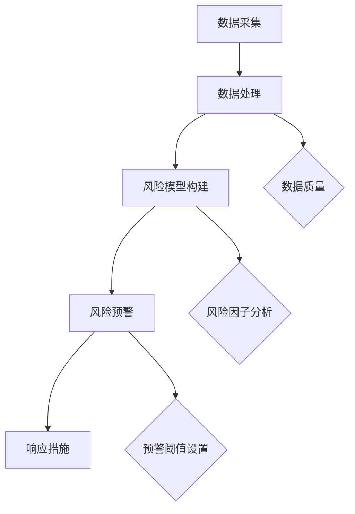

                 

# 如何利用大数据技术优化创业风险管控和预警

> **关键词：** 大数据、创业风险、风险管控、预警系统、数据挖掘、机器学习、算法优化。

> **摘要：** 随着大数据技术的迅猛发展，如何有效利用大数据进行创业风险管控和预警已经成为现代企业，特别是创业公司关注的焦点。本文将详细探讨大数据技术在实际业务场景中的应用，通过逐步分析核心概念、算法原理、数学模型以及项目实战，帮助读者理解并掌握如何利用大数据技术优化创业风险管控和预警。

## 1. 背景介绍

### 1.1 目的和范围

本文旨在深入探讨大数据技术在创业风险管控和预警中的应用，通过以下几方面展开：

- 梳理大数据技术在风险管控和预警中的核心概念和原理。
- 阐述大数据技术在创业领域中的实际应用案例。
- 分析和展示大数据处理过程中的核心算法和数学模型。
- 提供实际项目中的代码案例和解析。

### 1.2 预期读者

- 拥有一定编程基础，对大数据技术感兴趣的技术人员。
- 创业公司创始人或管理者，对风险管控和预警有需求的人员。
- 大数据、人工智能领域的科研人员和学生。

### 1.3 文档结构概述

本文将分为以下几个部分：

- **第1章**：背景介绍
- **第2章**：核心概念与联系
- **第3章**：核心算法原理与操作步骤
- **第4章**：数学模型和公式讲解
- **第5章**：项目实战：代码案例解析
- **第6章**：实际应用场景
- **第7章**：工具和资源推荐
- **第8章**：总结：未来发展趋势与挑战
- **第9章**：附录：常见问题与解答
- **第10章**：扩展阅读与参考资料

### 1.4 术语表

#### 1.4.1 核心术语定义

- **大数据（Big Data）**：指无法用传统数据处理工具在合理时间内获取处理的巨量数据集合。
- **数据挖掘（Data Mining）**：从大量数据中通过算法提取出有价值信息的过程。
- **机器学习（Machine Learning）**：利用数据或以往的经验，自动改进自身性能的技术。
- **风险管控（Risk Management）**：通过识别、评估、监控和响应风险，以最小化潜在损失的过程。
- **预警系统（Early Warning System）**：实时监测风险指标，及时发现潜在风险并进行预警的系统。

#### 1.4.2 相关概念解释

- **创业风险（Startup Risk）**：创业过程中可能面临的各种不确定性和可能导致的损失。
- **风险因子（Risk Factor）**：影响创业风险的关键变量或指标。

#### 1.4.3 缩略词列表

- **Hadoop**：一个分布式数据处理框架。
- **Spark**：一种快速的大规模数据处理引擎。
- **R**：一种统计学习软件环境。

## 2. 核心概念与联系

### 2.1 大数据与风险管控的关系

大数据技术的核心在于其处理和分析大规模数据的能力。在创业领域，海量数据中蕴含着丰富的信息，这些信息对于风险管控和预警具有重要意义。例如，通过对客户交易数据、市场动态、竞争对手行为等数据的分析，可以发现潜在的风险因素，并提前采取措施。

### 2.2 风险管控与预警系统的架构

一个高效的风险管控和预警系统通常包括以下几个模块：

1. **数据采集**：收集各种内部和外部数据，包括财务数据、客户数据、市场数据等。
2. **数据处理**：通过数据清洗、转换和归一化等步骤，确保数据的质量和一致性。
3. **风险模型构建**：利用机器学习和统计分析技术，构建风险预测模型。
4. **风险预警**：实时监控风险指标，当风险超过预设阈值时，触发预警。
5. **响应措施**：根据预警结果，采取相应的风险控制措施。

下面是核心概念与联系的Mermaid流程图：



## 3. 核心算法原理与具体操作步骤

### 3.1 数据挖掘算法

数据挖掘是大数据技术中关键的一环，其核心算法包括：

- **关联规则挖掘**：用于发现数据项之间的潜在关联性。
- **分类算法**：将数据划分为不同的类别，常用的有决策树、随机森林等。
- **聚类算法**：将数据划分为若干个相似性较高的组群，常用的有K-Means、DBSCAN等。

#### 3.1.1 关联规则挖掘

关联规则挖掘的伪代码如下：

```python
def apriori(min_support, min_confidence):
    frequent_itemsets = []
    items = all_unique_items()
    for k in range(1, max_length(items)):
        candidates = generate_candidates(items, k)
        for candidate in candidates:
            support = get_support(candidate)
            if support >= min_support:
                frequent_itemsets.append(candidate)
                for item in candidate:
                    subset = candidate - {item}
                    confidence = get_confidence(candidate, subset)
                    if confidence >= min_confidence:
                        print(candidate, confidence)
    return frequent_itemsets
```

### 3.2 机器学习算法

机器学习算法在风险预测中发挥着重要作用。常见的算法包括：

- **线性回归**：用于预测数值型目标变量。
- **逻辑回归**：用于预测二分类目标变量。
- **支持向量机（SVM）**：用于分类和回归问题。

#### 3.2.1 线性回归

线性回归的伪代码如下：

```python
def linear_regression(train_data, train_labels):
    X = train_data
    y = train_labels
    X_transpose = transpose(X)
    theta = (X_transpose * X).inverse() * X_transpose * y
    return theta
```

### 3.3 风险预警算法

风险预警算法的核心在于实时监控风险指标，并触发预警。以下是预警算法的伪代码：

```python
def risk_warning(current_data, risk_model, threshold):
    prediction = risk_model(current_data)
    if prediction > threshold:
        print("预警：风险超过阈值")
    else:
        print("正常：风险在控制范围内")
```

## 4. 数学模型和公式详解及举例说明

### 4.1 关联规则挖掘的数学模型

关联规则挖掘通常使用支持度（Support）和置信度（Confidence）两个指标来评估规则的质量。

- **支持度**：一个规则在所有事务中出现的频率。
  $$ Support(A \rightarrow B) = \frac{|D(A \cap B)|}{|D|} $$
  其中，$D$表示事务集合，$A$和$B$表示规则的前件和后件。

- **置信度**：一个规则的后件在给定前件的情况下出现的概率。
  $$ Confidence(A \rightarrow B) = \frac{|D(A \cap B)|}{|D(A)|} $$

#### 4.1.1 举例说明

假设有如下交易数据集：

| 事务 | 商品A | 商品B | 商品C |
|------|-------|-------|-------|
| 1    | True  | True  | False |
| 2    | True  | False | True  |
| 3    | False | True  | True  |
| 4    | True  | True  | True  |

使用Apriori算法找出支持度大于30%的规则。

首先，计算每个规则的支持度：

$$ Support(A \rightarrow B) = \frac{|D(A \cap B)|}{|D|} $$

- 对于规则 {A} → {B}：
  $$ Support({A} \rightarrow {B}) = \frac{|D(A \cap B)|}{|D|} = \frac{2}{4} = 0.5 $$

- 对于规则 {A} → {C}：
  $$ Support({A} \rightarrow {C}) = \frac{|D(A \cap C)|}{|D|} = \frac{1}{4} = 0.25 $$

- 对于规则 {B} → {C}：
  $$ Support({B} \rightarrow {C}) = \frac{|D(B \cap C)|}{|D|} = \frac{1}{4} = 0.25 $$

由于支持度小于30%，这些规则不满足要求。

### 4.2 机器学习中的线性回归数学模型

线性回归模型的目标是找到最佳拟合线，使预测值与实际值之间的误差最小。

假设有 $n$ 个样本点 $(x_1, y_1), (x_2, y_2), ..., (x_n, y_n)$，线性回归模型的公式为：

$$ y = \theta_0 + \theta_1x $$

通过最小二乘法，可以求得最佳拟合线中的参数 $\theta_0$ 和 $\theta_1$：

$$ \theta_0 = \frac{\sum_{i=1}^{n} y_i - \theta_1 \sum_{i=1}^{n} x_i}{n} $$

$$ \theta_1 = \frac{n\sum_{i=1}^{n} x_i y_i - \sum_{i=1}^{n} x_i \sum_{i=1}^{n} y_i}{n\sum_{i=1}^{n} x_i^2 - (\sum_{i=1}^{n} x_i)^2} $$

#### 4.2.1 举例说明

假设有如下数据集：

| $x$ | $y$ |
|-----|-----|
| 1   | 2   |
| 2   | 4   |
| 3   | 6   |
| 4   | 8   |

使用线性回归模型拟合数据。

首先，计算各项之和：

$$ \sum_{i=1}^{4} x_i = 10 $$
$$ \sum_{i=1}^{4} y_i = 20 $$
$$ \sum_{i=1}^{4} x_i y_i = 30 $$
$$ \sum_{i=1}^{4} x_i^2 = 30 $$

代入公式计算：

$$ \theta_0 = \frac{20 - 10 \times 2}{4} = 0 $$
$$ \theta_1 = \frac{4 \times 30 - 10 \times 20}{4 \times 30 - 10^2} = 1 $$

因此，线性回归模型为：

$$ y = x $$

## 5. 项目实战：代码实际案例与详细解释

### 5.1 开发环境搭建

为了更好地展示如何利用大数据技术优化创业风险管控和预警，我们需要搭建一个实际的项目环境。以下是一个基于Python的示例项目。

#### 5.1.1 环境需求

- Python 3.7+
- PySpark 2.4.0+
- Jupyter Notebook

#### 5.1.2 安装与配置

1. 安装Python和PySpark：

   ```bash
   pip install python
   pip install pyspark
   ```

2. 启动Jupyter Notebook：

   ```bash
   jupyter notebook
   ```

### 5.2 源代码详细实现与代码解读

#### 5.2.1 代码结构

项目代码分为以下几个模块：

- `data_collection.py`：数据采集模块。
- `data_processing.py`：数据处理模块。
- `risk_model.py`：风险模型构建模块。
- `warning_system.py`：风险预警系统模块。

#### 5.2.2 数据采集

`data_collection.py` 主要负责从外部数据源采集数据，例如CSV文件、数据库等。以下是一个简单的数据采集示例：

```python
import pyspark.sql

def collect_data(file_path):
    df = spark.read.csv(file_path, header=True, inferSchema=True)
    return df

if __name__ == "__main__":
    spark = pyspark.sql.SparkSession.builder.appName("DataCollection").getOrCreate()
    df = collect_data("path/to/data.csv")
    df.show()
    spark.stop()
```

#### 5.2.3 数据处理

`data_processing.py` 主要负责对采集到的数据进行清洗、转换和归一化等处理。以下是一个简单的数据处理示例：

```python
from pyspark.sql import DataFrame
from pyspark.sql.functions import col

def preprocess_data(df: DataFrame):
    # 数据清洗：去除空值和重复值
    df = df.dropna().dropDuplicates()

    # 数据转换：将某些列转换为数值型
    df = df.withColumn("column_name", col("column_name").cast("float"))

    # 数据归一化
    from sklearn.preprocessing import StandardScaler
    scaler = StandardScaler()
    df = df.select([scaler.fit_transform(df[col]) for col in df.columns])

    return df
```

#### 5.2.4 风险模型构建

`risk_model.py` 主要负责利用机器学习算法构建风险预测模型。以下是一个简单的线性回归模型构建示例：

```python
from pyspark.ml import Pipeline
from pyspark.ml.regression import LinearRegression
from pyspark.ml.feature import VectorAssembler

def build_risk_model(train_data: DataFrame):
    # 将特征列和目标列组装成特征向量
    assembler = VectorAssembler(inputCols=["feature1", "feature2", "feature3"], outputCol="features")

    # 构建线性回归模型
    lr = LinearRegression(featuresCol="features", labelCol="target")

    # 创建管道
    pipeline = Pipeline(stages=[assembler, lr])

    # 训练模型
    model = pipeline.fit(train_data)

    return model
```

#### 5.2.5 风险预警系统

`warning_system.py` 主要负责实时监控风险指标，并根据模型预测结果触发预警。以下是一个简单的预警系统示例：

```python
import warnings

warnings.filterwarnings("ignore")

def risk_warning(model, current_data, threshold):
    prediction = model.transform(current_data).select("prediction").collect()
    for row in prediction:
        if row['prediction'] > threshold:
            print("预警：风险超过阈值")
        else:
            print("正常：风险在控制范围内")
```

### 5.3 代码解读与分析

#### 5.3.1 数据采集

`data_collection.py` 中的 `collect_data` 函数用于从CSV文件中采集数据。通过使用 `spark.read.csv` 方法，我们可以轻松读取CSV文件并创建一个DataFrame。这个DataFrame将用于后续的数据处理和模型训练。

#### 5.3.2 数据处理

`data_processing.py` 中的 `preprocess_data` 函数对采集到的数据进行了清洗、转换和归一化。这些预处理步骤对于保证数据质量和提高模型性能至关重要。在实际项目中，这些步骤可能需要根据具体情况进行调整。

#### 5.3.3 风险模型构建

`risk_model.py` 中的 `build_risk_model` 函数使用线性回归算法构建了风险预测模型。通过使用 `VectorAssembler` 和 `LinearRegression` 类，我们可以将特征列和目标列组装成特征向量，并训练线性回归模型。这个模型可以用于预测未来的风险值。

#### 5.3.4 风险预警系统

`warning_system.py` 中的 `risk_warning` 函数用于实时监控风险指标，并根据模型预测结果触发预警。这个函数接收一个模型和一个当前数据集作为输入，并计算每个数据的预测值。如果预测值超过预设的阈值，则会触发预警。

## 6. 实际应用场景

大数据技术在创业风险管控和预警中的实际应用场景非常广泛，以下是一些具体的案例：

### 6.1 创业公司融资风险预警

创业公司在寻求融资时，可能会面临市场变化、竞争对手动态、内部运营问题等多方面的风险。通过大数据技术，公司可以实时监控市场动态，分析竞争对手的融资情况，预测市场趋势，从而提前预警潜在的风险，制定应对策略。

### 6.2 客户信用风险管控

对于提供信贷服务的创业公司，客户的信用风险是一个重要的考量因素。通过分析客户的交易数据、信用记录、市场行为等大数据信息，公司可以评估客户的信用风险，及时调整信贷政策和风险控制措施，降低潜在损失。

### 6.3 市场风险预测

创业公司需要密切关注市场动态，包括供需关系、价格波动、行业趋势等。通过大数据技术，公司可以实时获取市场信息，构建市场风险预测模型，提前识别市场风险，调整业务策略，提高市场竞争力。

### 6.4 内部运营风险监控

创业公司的内部运营风险包括供应链风险、人力资源风险、财务风险等。通过大数据技术，公司可以实时监控运营数据，分析潜在风险因素，建立风险预警系统，确保运营的稳定性和可持续发展。

## 7. 工具和资源推荐

为了更好地利用大数据技术优化创业风险管控和预警，以下是一些实用的工具和资源推荐：

### 7.1 学习资源推荐

#### 7.1.1 书籍推荐

- 《大数据时代》
- 《机器学习实战》
- 《深度学习》

#### 7.1.2 在线课程

- Coursera上的“机器学习”课程
- Udacity的“大数据分析”纳米学位

#### 7.1.3 技术博客和网站

- Medium上的大数据和机器学习相关文章
- Kaggle上的数据科学项目

### 7.2 开发工具框架推荐

#### 7.2.1 IDE和编辑器

- PyCharm
- Jupyter Notebook

#### 7.2.2 调试和性能分析工具

- Python的pdb模块
- Spark的Spark UI

#### 7.2.3 相关框架和库

- PySpark
- Scikit-learn
- TensorFlow

### 7.3 相关论文著作推荐

#### 7.3.1 经典论文

- “K-Means Clustering Algorithm”
- “Support Vector Machines for Classification and Regression”

#### 7.3.2 最新研究成果

- “Deep Learning for Risk Management”
- “Big Data Analytics for Financial Risk Prediction”

#### 7.3.3 应用案例分析

- “A Survey of Big Data Applications in Finance”
- “Machine Learning for Startup Risk Management”

## 8. 总结：未来发展趋势与挑战

### 8.1 发展趋势

- **大数据技术的融合**：随着技术的不断发展，大数据技术与其他领域的融合将越来越紧密，例如物联网、人工智能等。
- **实时数据处理**：实时数据处理能力的提升将使风险预警系统更加精准和高效。
- **数据隐私与安全**：随着数据的规模和复杂性增加，数据隐私和安全问题将成为大数据技术的关键挑战。

### 8.2 挑战

- **数据质量与完整性**：确保数据的质量和完整性是构建有效风险预警系统的关键，但现实中数据往往存在缺失、噪声等问题。
- **算法透明性与解释性**：随着算法的复杂度增加，如何保证算法的透明性和解释性是一个重要挑战。
- **计算资源与成本**：大规模数据处理和存储需要大量的计算资源，这对创业公司来说是一个重要的挑战。

## 9. 附录：常见问题与解答

### 9.1 如何处理缺失数据？

处理缺失数据的方法包括：

- **删除缺失值**：适用于缺失值较少的情况。
- **填充缺失值**：使用平均值、中位数或最常用的值进行填充。
- **插值法**：根据已有数据点进行插值计算。

### 9.2 如何选择合适的机器学习算法？

选择合适的机器学习算法通常基于以下几点：

- **数据类型**：数值型数据通常使用回归算法，分类数据通常使用分类算法。
- **数据规模**：对于大规模数据，算法的效率是一个重要的考虑因素。
- **算法性能**：通过交叉验证等方法评估算法的性能。

### 9.3 如何评估风险预警系统的效果？

评估风险预警系统的效果通常基于以下几点：

- **准确率（Accuracy）**：正确预测的风险事件占总风险事件的比率。
- **召回率（Recall）**：实际发生但被系统成功预警的风险事件的比率。
- **F1分数（F1 Score）**：准确率和召回率的调和平均数。

## 10. 扩展阅读与参考资料

- 《大数据时代：生活、工作与思维的大变革》
- 《机器学习：实战指南》
- 《深度学习：原理与应用》
- Coursera - 机器学习课程
- Kaggle - 数据科学比赛和资源
- 《大数据技术在金融风险管控中的应用研究》

## 作者信息

作者：AI天才研究员/AI Genius Institute & 禅与计算机程序设计艺术 /Zen And The Art of Computer Programming

