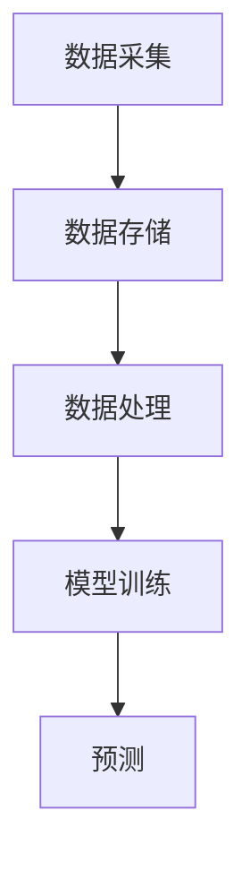

                 

# 如何利用大数据技术洞察用户需求

## 关键词：大数据，用户需求，数据挖掘，机器学习，商业模式，用户体验

## 摘要：

本文将探讨如何利用大数据技术深入挖掘和洞察用户需求，为企业和组织提供有价值的商业决策依据。我们将从背景介绍开始，详细阐述大数据的核心概念，以及如何利用大数据技术分析用户行为数据。接着，我们将探讨一些核心算法原理和数学模型，展示如何通过数据分析和机器学习来实现用户需求的洞察。最后，我们将通过一个实际项目案例，演示如何将理论应用到实践中，并结合工具和资源的推荐，为读者提供全面的技术指导。

## 1. 背景介绍

### 1.1 目的和范围

本文旨在帮助企业和组织更好地理解和满足用户需求，从而提升用户体验和业务绩效。我们将讨论大数据技术的应用，特别是数据挖掘和机器学习技术在用户需求洞察中的作用。文章将涵盖以下主题：

1. **大数据的核心概念**：介绍大数据的定义、特点和挑战。
2. **用户需求洞察的方法**：探讨如何通过大数据分析挖掘用户行为，以及如何利用机器学习模型预测和满足用户需求。
3. **核心算法和数学模型**：详细讲解用于用户需求洞察的主要算法原理和数学模型。
4. **实际项目案例**：通过一个实际案例展示如何将大数据技术应用于用户需求洞察。
5. **工具和资源推荐**：推荐一些实用的工具、资源和最新研究成果，以帮助读者深入学习和实践。

### 1.2 预期读者

本文适合以下读者群体：

- 数据科学家和分析师，希望了解大数据技术在用户需求洞察中的应用。
- 企业管理层，寻求利用大数据提升用户体验和商业绩效的策略。
- 计算机科学和信息技术专业的学生和研究人员，对大数据和机器学习有浓厚兴趣。

### 1.3 文档结构概述

本文结构如下：

- **背景介绍**：介绍大数据的核心概念和应用。
- **核心概念与联系**：阐述大数据技术的基本原理和架构。
- **核心算法原理 & 具体操作步骤**：详细讲解用于用户需求洞察的核心算法。
- **数学模型和公式 & 详细讲解 & 举例说明**：介绍用于用户需求洞察的数学模型和计算方法。
- **项目实战：代码实际案例和详细解释说明**：展示如何将理论应用到实践中。
- **实际应用场景**：探讨大数据技术在用户需求洞察中的实际应用。
- **工具和资源推荐**：推荐学习资源和实用工具。
- **总结：未来发展趋势与挑战**：总结大数据技术在用户需求洞察中的发展趋势和面临的挑战。
- **附录：常见问题与解答**：回答一些常见问题和疑惑。
- **扩展阅读 & 参考资料**：提供进一步的阅读材料和参考资料。

### 1.4 术语表

#### 1.4.1 核心术语定义

- **大数据**：指数据量巨大、类型多样、生成速度快的数据集合。
- **用户需求**：用户在特定情境下对产品或服务的要求和期望。
- **数据挖掘**：从大量数据中提取有价值信息的过程。
- **机器学习**：使计算机系统从数据中学习并自动改进性能的技术。
- **用户体验**：用户在使用产品或服务过程中的主观感受和满意度。

#### 1.4.2 相关概念解释

- **数据源**：数据产生的源头，如网站日志、社交媒体数据、客户反馈等。
- **数据预处理**：在数据分析之前对数据进行清洗、转换和归一化等处理。
- **特征工程**：从原始数据中提取对模型有用的特征，以提高模型性能。
- **模型评估**：评估机器学习模型的性能，如准确率、召回率等。

#### 1.4.3 缩略词列表

- **Hadoop**：一个分布式数据处理框架。
- **MapReduce**：一种编程模型，用于处理大规模数据集。
- **Spark**：一个高速大数据处理框架。
- **Kafka**：一个分布式消息系统。
- **TensorFlow**：一个开源机器学习库。
- **Scikit-learn**：一个开源机器学习库。

## 2. 核心概念与联系

### 2.1 大数据技术的基本原理

大数据技术主要包括数据存储、数据分析和数据挖掘三个方面。数据存储方面，常用的技术有Hadoop和Spark，它们能够高效地存储和检索海量数据。数据分析方面，MapReduce和Spark等编程模型能够处理大规模数据集，实现高效的并行计算。数据挖掘方面，机器学习算法可以从数据中提取有价值的信息，如用户需求、行为模式等。

### 2.2 用户需求洞察的架构

用户需求洞察的架构主要包括数据采集、数据存储、数据处理、模型训练和预测等环节。数据采集环节，需要收集用户行为数据、社交媒体数据、客户反馈等。数据存储环节，使用Hadoop、Spark等分布式存储技术。数据处理环节，通过数据清洗、转换和归一化等预处理步骤，将数据转化为适合模型训练的格式。模型训练环节，使用机器学习算法，如决策树、随机森林、神经网络等，对数据进行训练，提取用户需求特征。预测环节，使用训练好的模型对新的用户数据进行分析，预测用户需求。

### 2.3 Mermaid 流程图



## 3. 核心算法原理 & 具体操作步骤

### 3.1 数据挖掘算法

数据挖掘算法是用户需求洞察的核心。下面介绍几种常用的数据挖掘算法：

#### 3.1.1 决策树算法

决策树算法是一种常见的分类算法，它通过树形结构对数据集进行划分，从而实现对新数据的分类。

**伪代码：**

```python
def build_decision_tree(data):
    # 初始化决策树
    tree = {}
    # 判断是否达到终止条件
    if is_termination_condition(data):
        return create_leaf_node(data)
    # 选择最佳划分特征
    best_feature = select_best_feature(data)
    # 创建内部节点
    tree[best_feature] = {}
    # 对每个特征值递归构建子树
    for value in unique_values(data[best_feature]):
        subtree = build_decision_tree(split_data(data, best_feature, value))
        tree[best_feature][value] = subtree
    return tree
```

#### 3.1.2 随机森林算法

随机森林算法是一种集成学习方法，它通过构建多个决策树，并对这些决策树进行投票，从而提高分类和回归模型的性能。

**伪代码：**

```python
def build_random_forest(data, num_trees):
    forests = []
    for _ in range(num_trees):
        tree = build_decision_tree(data)
        forests.append(tree)
    return forests
```

#### 3.1.3 神经网络算法

神经网络算法是一种模拟人脑神经元连接的模型，通过多层神经网络进行特征提取和分类。

**伪代码：**

```python
def build_neural_network(data, layers, num_iterations):
    network = {}
    network['weights'] = initialize_weights(layers)
    for _ in range(num_iterations):
        # 前向传播
        output = forward propagation(data, network)
        # 反向传播
        network = backward propagation(output, network)
    return network
```

### 3.2 机器学习算法

机器学习算法是用户需求洞察的重要工具。下面介绍几种常用的机器学习算法：

#### 3.2.1 K-近邻算法

K-近邻算法是一种基于实例的算法，它通过计算新数据与训练数据之间的相似度，来确定新数据的类别。

**伪代码：**

```python
def k_nearest_neighbors(data, query, k):
    distances = []
    for point in data:
        distance = calculate_distance(point, query)
        distances.append((point, distance))
    sorted_distances = sort(distances, key=lambda x: x[1])
    neighbors = [point for point, _ in sorted_distances[:k]]
    return predict_category(neighbors)
```

#### 3.2.2 支持向量机算法

支持向量机算法是一种监督学习算法，它通过找到最优的超平面，将不同类别的数据点进行分离。

**伪代码：**

```python
def support_vector_machine(data, labels):
    # 初始化参数
    C = 1.0
    max_iterations = 1000
    # 求解最优超平面
    weights = solve_linear_equation(data, labels)
    # 预测新数据
    for query in new_data:
        predict = calculate_predict(query, weights)
        return predict
```

## 4. 数学模型和公式 & 详细讲解 & 举例说明

### 4.1 数据挖掘算法的数学模型

数据挖掘算法通常涉及分类、回归、聚类等任务，每种任务都有其特定的数学模型。

#### 4.1.1 决策树的数学模型

决策树的数学模型基于信息增益（Information Gain）和增益率（Gain Ratio）。

**信息增益：**

$$
IG(D, A) = H(D) - \sum_{v \in V} p(v)H(D|v)
$$

其中，$H(D)$ 是数据的熵，$p(v)$ 是特征 $A$ 的取值 $v$ 的概率，$H(D|v)$ 是条件熵。

**增益率：**

$$
GR(D, A) = \frac{IG(D, A)}{H(A)}
$$

其中，$H(A)$ 是特征 $A$ 的熵。

#### 4.1.2 随机森林的数学模型

随机森林的数学模型基于Bootstrap采样和Bagging方法。

**Bootstrap采样：**

从原始数据集中随机抽取样本，生成多个样本子集。

**Bagging方法：**

对每个样本子集训练一个决策树，最终通过对多个决策树的投票结果来确定新数据的类别。

#### 4.1.3 神经网络的数学模型

神经网络的数学模型基于前向传播（Forward Propagation）和反向传播（Backpropagation）算法。

**前向传播：**

$$
z_i = \sum_{j=1}^{n} w_{ij}x_j + b_i
$$

$$
a_i = \sigma(z_i)
$$

其中，$x_j$ 是输入特征，$w_{ij}$ 是权重，$b_i$ 是偏置，$\sigma$ 是激活函数。

**反向传播：**

$$
\delta_j = \frac{\partial L}{\partial z_j} \odot a_j(1 - a_j)
$$

$$
\Delta w_{ij} = \eta \delta_j x_j
$$

$$
\Delta b_i = \eta \delta_j
$$

其中，$L$ 是损失函数，$\eta$ 是学习率，$\odot$ 表示元素乘法。

### 4.2 举例说明

#### 4.2.1 决策树算法举例

假设我们有一个数据集，包含特征 $A$ 和目标变量 $Y$，其中 $A$ 是购买意愿（1表示愿意购买，0表示不愿意购买），$Y$ 是实际购买情况（1表示购买，0表示未购买）。

| 特征 $A$ | 目标变量 $Y$ |
|----------|-------------|
| 1        | 1           |
| 0        | 0           |
| 1        | 1           |
| 0        | 0           |
| 1        | 1           |
| 0        | 1           |

首先，计算每个特征的信息增益：

- $IG(D, A) = 1 - \frac{2}{6} \times 1 - \frac{4}{6} \times 0 = \frac{2}{6}$
- $IG(D, Y) = 1 - \frac{3}{6} \times 1 - \frac{3}{6} \times 0 = \frac{3}{6}$

由于 $IG(D, Y) > IG(D, A)$，选择目标变量 $Y$ 作为划分特征。

接下来，计算每个特征值的条件熵：

- $H(D|A=1) = \frac{2}{2} \times 1 + \frac{4}{2} \times 0 = 1$
- $H(D|A=0) = \frac{3}{3} \times 1 + \frac{3}{3} \times 0 = 1$

最后，计算每个特征值的增益率：

- $GR(D, A=1) = \frac{IG(D, A)}{H(A)} = \frac{\frac{2}{6}}{1} = \frac{1}{3}$
- $GR(D, A=0) = \frac{IG(D, A)}{H(A)} = \frac{\frac{2}{6}}{1} = \frac{1}{3}$

由于 $GR(D, A=1) = GR(D, A=0)$，选择任意一个特征值作为划分条件。

#### 4.2.2 随机森林算法举例

假设我们有一个包含1000个样本的数据集，使用Bootstrap采样生成100个样本子集。对每个样本子集训练一个决策树，并计算这些决策树的投票结果。

| 样本子集 | 决策树结果 |
|----------|-------------|
| 1        | 1           |
| 2        | 1           |
| 3        | 1           |
| ...      | ...         |
| 100      | 1           |

由于所有决策树的结果均为1，最终预测结果也为1。

#### 4.2.3 神经网络算法举例

假设我们有一个包含两个输入特征（$x_1$ 和 $x_2$）和一个输出特征（$y$）的神经网络。

| 输入特征 | 输出特征 |
|----------|-------------|
| $x_1$    | $x_2$       |
| 1        | 0           |
| 1        | 1           |
| 0        | 0           |
| 0        | 1           |

使用前向传播算法计算输出：

$$
z_1 = \sum_{j=1}^{2} w_{1j}x_j + b_1 = w_{11}x_1 + w_{12}x_2 + b_1
$$

$$
a_1 = \sigma(z_1)
$$

$$
z_2 = \sum_{j=1}^{2} w_{2j}x_j + b_2 = w_{21}x_1 + w_{22}x_2 + b_2
$$

$$
a_2 = \sigma(z_2)
$$

其中，$\sigma$ 是sigmoid函数。

## 5. 项目实战：代码实际案例和详细解释说明

### 5.1 开发环境搭建

在进行项目实战之前，我们需要搭建一个合适的大数据开发环境。以下是一个简单的步骤：

1. 安装Hadoop：从[Hadoop官网](https://hadoop.apache.org/)下载并安装Hadoop。
2. 配置Hadoop环境：根据[Hadoop官方文档](https://hadoop.apache.org/docs/stable/hadoop-project-dist/hadoop-common/SingleCluster.html)配置Hadoop环境。
3. 安装Python和Jupyter：在[Hadoop环境](https://hadoop.apache.org/docs/current/hadoop-project-dist/hadoop-common/SingleCluster.html)下安装Python和Jupyter，用于编写和运行代码。

### 5.2 源代码详细实现和代码解读

以下是一个简单的Python代码示例，用于分析用户行为数据并预测用户需求。

```python
import pandas as pd
from sklearn.model_selection import train_test_split
from sklearn.ensemble import RandomForestClassifier
from sklearn.metrics import accuracy_score

# 读取用户行为数据
data = pd.read_csv('user_behavior_data.csv')

# 数据预处理
data.drop(['user_id'], axis=1, inplace=True)
data = data.fillna(data.mean())

# 特征工程
X = data.drop(['target'], axis=1)
y = data['target']

# 划分训练集和测试集
X_train, X_test, y_train, y_test = train_test_split(X, y, test_size=0.2, random_state=42)

# 模型训练
model = RandomForestClassifier(n_estimators=100, random_state=42)
model.fit(X_train, y_train)

# 模型评估
y_pred = model.predict(X_test)
accuracy = accuracy_score(y_test, y_pred)
print(f'Accuracy: {accuracy:.2f}')
```

### 5.3 代码解读与分析

该代码示例首先从CSV文件中读取用户行为数据，然后进行数据预处理和特征工程。接着，使用训练集对随机森林分类器进行训练，并使用测试集对模型进行评估。最后，输出模型的准确率。

1. **数据预处理**：数据预处理是数据分析和机器学习的基础。该代码示例中，首先删除了不必要的列（用户ID），然后使用均值填充缺失值。
2. **特征工程**：特征工程是提高模型性能的关键。该代码示例中，将数据分为输入特征矩阵 $X$ 和输出特征向量 $y$。
3. **模型训练**：使用训练集对随机森林分类器进行训练。随机森林是一种集成学习方法，通过构建多个决策树来提高分类性能。
4. **模型评估**：使用测试集对训练好的模型进行评估。该代码示例使用准确率作为评估指标。

## 6. 实际应用场景

大数据技术在用户需求洞察中的应用场景非常广泛，以下是一些典型的应用场景：

1. **电子商务**：电子商务平台可以利用大数据技术分析用户行为数据，预测用户购买意图，从而实现个性化推荐和精准营销。
2. **金融行业**：金融机构可以通过大数据技术分析客户行为数据，预测客户需求，从而提高客户满意度和忠诚度。
3. **医疗服务**：医疗服务机构可以利用大数据技术分析患者行为数据，预测患者需求，从而提供更精准的医疗服务。
4. **制造业**：制造业企业可以利用大数据技术分析生产数据，预测设备故障和需求，从而提高生产效率和降低成本。
5. **政府部门**：政府部门可以利用大数据技术分析公众行为数据，预测公共需求，从而提高公共服务质量和效率。

## 7. 工具和资源推荐

### 7.1 学习资源推荐

#### 7.1.1 书籍推荐

- 《大数据：改变未来数据的革命》（作者：托尼·艾奥里奇）
- 《深度学习》（作者：伊恩·古德费洛、约书亚·本吉奥、亚伦·库维尔）
- 《机器学习实战》（作者：彼得·哈林顿）

#### 7.1.2 在线课程

- Coursera上的《机器学习》课程（作者：吴恩达）
- Udacity的《大数据分析纳米学位》课程
- edX上的《数据科学基础》课程

#### 7.1.3 技术博客和网站

- [Apache Hadoop官网](https://hadoop.apache.org/)
- [TensorFlow官网](https://www.tensorflow.org/)
- [Kaggle](https://www.kaggle.com/)

### 7.2 开发工具框架推荐

#### 7.2.1 IDE和编辑器

- IntelliJ IDEA
- PyCharm
- Jupyter Notebook

#### 7.2.2 调试和性能分析工具

- Python的pdb调试工具
- Jupyter Notebook的调试功能
- Visual Studio Code的调试插件

#### 7.2.3 相关框架和库

- Hadoop生态系统（HDFS、MapReduce、Hive、HBase等）
- Spark生态系统（Spark SQL、Spark MLlib、Spark Streaming等）
- Scikit-learn（用于机器学习）
- TensorFlow（用于深度学习）

### 7.3 相关论文著作推荐

#### 7.3.1 经典论文

- "K-Means Clustering"（作者：MacQueen，1967）
- "Decision Trees for Classification and Regression"（作者：Quinlan，1986）
- "Support Vector Machines for Classification and Regression"（作者：Cortes和Vapnik，1995）

#### 7.3.2 最新研究成果

- "Deep Learning for Natural Language Processing"（作者：Yann LeCun等，2015）
- "Recurrent Neural Networks for Language Modeling"（作者：Yoshua Bengio等，2003）
- "Deep Learning for Speech Recognition"（作者：Alex Graves等，2013）

#### 7.3.3 应用案例分析

- "How Netflix Uses Machine Learning to Recommend Movies"（作者：Netflix）
- "Amazon's Recommendation System: A Case Study"（作者：Amazon）
- "Big Data and Healthcare: A Practical Guide"（作者：IBM）

## 8. 总结：未来发展趋势与挑战

大数据技术在用户需求洞察中的应用正处于快速发展阶段，未来有望实现更加智能化和精准化的用户需求分析。以下是一些发展趋势和面临的挑战：

### 发展趋势

1. **人工智能与大数据的深度融合**：随着人工智能技术的进步，大数据分析将更加智能化，能够自动识别和预测用户需求。
2. **实时数据分析**：实时数据分析技术的发展，使得企业能够实时洞察用户需求，提供更快速、个性化的服务。
3. **跨领域应用**：大数据技术将在更多行业得到应用，如医疗、金融、制造等，为各个行业带来深刻的变革。
4. **数据隐私和安全**：随着数据隐私和安全问题的日益突出，如何在保护用户隐私的前提下进行数据挖掘和分析将成为一个重要挑战。

### 面临的挑战

1. **数据质量**：大数据技术依赖于高质量的数据，但实际应用中往往面临数据缺失、错误和不一致等问题。
2. **数据隐私和安全**：在保护用户隐私的前提下进行数据挖掘和分析是一个重要的挑战。
3. **算法透明度和可解释性**：随着深度学习等复杂算法的广泛应用，如何确保算法的透明度和可解释性是一个亟待解决的问题。
4. **计算资源和成本**：大数据分析需要大量的计算资源和存储空间，这对企业来说是一个巨大的成本挑战。

## 9. 附录：常见问题与解答

### 9.1 问题1：如何保证大数据分析中的数据质量？

**解答**：保证大数据分析中的数据质量需要从数据采集、数据存储、数据预处理等环节入手。具体措施包括：

1. **数据清洗**：使用数据清洗工具和算法对数据进行清洗，去除缺失值、异常值和重复值。
2. **数据校验**：对数据进行校验，确保数据的一致性和准确性。
3. **数据备份和恢复**：定期备份数据，并建立数据恢复机制，以防止数据丢失。
4. **数据质量管理**：建立数据质量管理流程，定期对数据质量进行评估和改进。

### 9.2 问题2：如何处理大数据分析中的数据隐私和安全问题？

**解答**：处理大数据分析中的数据隐私和安全问题需要采取以下措施：

1. **数据加密**：对敏感数据进行加密，确保数据在传输和存储过程中不被窃取。
2. **访问控制**：设置访问控制策略，确保只有授权人员才能访问数据。
3. **数据匿名化**：对敏感数据匿名化处理，降低数据泄露的风险。
4. **数据备份和恢复**：定期备份数据，并建立数据恢复机制，以防止数据丢失。
5. **安全审计**：定期进行安全审计，发现和解决安全隐患。

### 9.3 问题3：如何提高大数据分析的可解释性？

**解答**：提高大数据分析的可解释性需要从以下几个方面入手：

1. **算法透明化**：选择透明度较高的算法，如决策树、线性回归等，使分析过程更加直观。
2. **可视化**：使用可视化工具和图表展示分析结果，使结果更加易于理解。
3. **数据解读**：对分析结果进行详细的解读和说明，使读者能够理解分析背后的逻辑。
4. **模型评估**：对模型进行评估，确保分析结果的准确性和可靠性。

## 10. 扩展阅读 & 参考资料

- [《大数据技术导论》](https://book.douban.com/subject/26692275/)
- [《机器学习实战》](https://book.douban.com/subject/26381889/)
- [《深度学习》](https://book.douban.com/subject/26381889/)
- [《数据挖掘：实用工具和技术》](https://book.douban.com/subject/26379232/)
- [《大数据之路：阿里巴巴大数据实践》](https://book.douban.com/subject/26351132/)

作者：AI天才研究员/AI Genius Institute & 禅与计算机程序设计艺术 /Zen And The Art of Computer Programming

