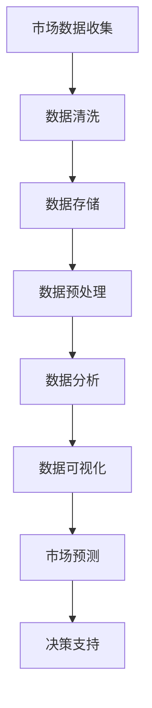

                 

# 如何利用大数据技术进行市场分析

> **关键词：**大数据技术、市场分析、数据分析、数据挖掘、预测模型

> **摘要：**本文将探讨如何利用大数据技术进行市场分析，从核心概念、算法原理、数学模型到实际应用，逐步解析这一领域的各个方面。我们将通过具体的案例和工具推荐，帮助读者深入了解市场分析的实践方法，以及如何应对未来的挑战。

## 1. 背景介绍

### 1.1 目的和范围

随着互联网和电子商务的快速发展，市场环境变得愈发复杂和动态。为了在激烈的市场竞争中脱颖而出，企业需要掌握市场动态、消费者行为以及竞争对手的动向。大数据技术提供了强大的工具，可以帮助企业从海量数据中提取有价值的信息，从而进行精准的市场分析。

本文旨在介绍如何利用大数据技术进行市场分析，涵盖以下内容：

- 大数据技术在市场分析中的核心作用
- 市场分析的基本概念和方法
- 市场分析的核心算法原理
- 市场分析的数学模型和应用
- 实际应用中的代码案例和工具推荐

### 1.2 预期读者

本文面向希望了解大数据技术在市场分析中应用的读者，包括：

- 市场分析师和数据科学家
- 企业决策者和管理者
- 对数据分析感兴趣的技术爱好者

### 1.3 文档结构概述

本文将按照以下结构展开：

- **第1章：背景介绍**：介绍市场分析和大数据技术的背景。
- **第2章：核心概念与联系**：阐述市场分析的核心概念和流程。
- **第3章：核心算法原理与具体操作步骤**：讲解市场分析中常用的算法。
- **第4章：数学模型和公式**：介绍市场分析中的数学模型。
- **第5章：项目实战**：通过实际案例展示市场分析的实施过程。
- **第6章：实际应用场景**：分析大数据技术在市场分析中的实际应用。
- **第7章：工具和资源推荐**：推荐学习资源、开发工具和框架。
- **第8章：总结**：展望市场分析的未来发展。
- **第9章：附录**：常见问题与解答。
- **第10章：扩展阅读**：提供进一步的参考文献。

### 1.4 术语表

#### 1.4.1 核心术语定义

- **大数据（Big Data）**：指无法用常规软件工具在合理时间内捕捉、管理和处理的大量数据。
- **市场分析（Market Analysis）**：通过数据分析来评估市场潜力、消费者需求以及竞争对手状况。
- **数据挖掘（Data Mining）**：从大量数据中提取隐藏的、未知的、有价值的信息和模式。
- **预测模型（Predictive Model）**：基于历史数据和算法，预测未来的趋势和结果。

#### 1.4.2 相关概念解释

- **数据分析（Data Analysis）**：对数据进行处理、分析和解释，以获得有用的信息。
- **机器学习（Machine Learning）**：一种人工智能技术，通过数据和算法实现自我学习和优化。
- **自然语言处理（NLP）**：使计算机能够理解和解释人类自然语言的技术。

#### 1.4.3 缩略词列表

- **Hadoop**：一个分布式数据处理框架，用于大规模数据存储和处理。
- **Spark**：一种快速、通用的大数据处理引擎。
- **R**：一种统计分析和数据可视化工具。

## 2. 核心概念与联系

市场分析的核心概念和联系可以通过以下 Mermaid 流程图来阐述：



### 2.1 市场数据收集

市场数据收集是市场分析的第一步，涉及从多个渠道收集数据，包括：

- **内部数据**：企业内部的销售记录、客户信息、交易数据等。
- **外部数据**：市场研究报告、行业趋势、社交媒体数据等。

### 2.2 数据清洗

数据清洗是确保数据质量的过程，包括：

- **去除重复数据**：避免重复记录对分析的干扰。
- **处理缺失数据**：使用插值、平均值等方法填补缺失值。
- **标准化数据**：将不同数据源的数据格式进行统一处理。

### 2.3 数据存储

数据存储是长期保存数据的过程，常见的数据存储方式包括：

- **关系型数据库**：适用于结构化数据存储。
- **分布式存储系统**：如 Hadoop HDFS，适用于大规模非结构化数据存储。

### 2.4 数据预处理

数据预处理是数据分析和挖掘前的必要步骤，包括：

- **数据格式转换**：将不同格式的数据进行统一处理。
- **特征工程**：从原始数据中提取有助于分析的特征。

### 2.5 数据分析

数据分析是市场分析的核心，包括：

- **描述性分析**：了解数据的整体分布和特征。
- **推断性分析**：通过统计方法推断数据背后的规律。
- **预测性分析**：基于历史数据预测未来趋势。

### 2.6 数据可视化

数据可视化是将数据以图形化方式展示的过程，有助于：

- **发现数据模式**：通过图形直观地识别数据中的规律。
- **传达分析结果**：将复杂的数据分析结果简单明了地展示。

### 2.7 市场预测

市场预测是基于历史数据和算法，预测未来的市场趋势和结果，包括：

- **需求预测**：预测产品未来的需求量。
- **竞争预测**：预测竞争对手的市场策略和动向。
- **风险评估**：评估市场风险和不确定性。

### 2.8 决策支持

决策支持是基于市场分析和预测结果，为决策者提供数据支持，包括：

- **产品定位**：确定产品的市场定位和目标客户。
- **定价策略**：制定合理的定价策略。
- **营销策略**：优化营销渠道和推广方案。

## 3. 核心算法原理 & 具体操作步骤

市场分析的核心算法主要包括数据挖掘算法和机器学习算法。以下将介绍几种常用的算法原理和具体操作步骤。

### 3.1 数据挖掘算法

#### 3.1.1 关联规则挖掘

**算法原理：** 关联规则挖掘是发现数据中各项之间的关联性，常用的算法有 Apriori 算法和 FP-growth 算法。

**伪代码：**

```python
def Apriori(data, support_threshold, confidence_threshold):
    frequent_itemsets = find_frequent_itemsets(data, support_threshold)
    rules = []
    for itemset in frequent_itemsets:
        consequent = generate_consequent(itemset)
        if confidence(itemset, consequent) >= confidence_threshold:
            rules.append((itemset, consequent))
    return rules

def find_frequent_itemsets(data, support_threshold):
    # 略
    pass

def generate_consequent(itemset):
    # 略
    pass

def confidence(itemset, consequent):
    # 略
    pass
```

#### 3.1.2 聚类分析

**算法原理：** 聚类分析是将数据集分为若干个组，使得同一组内的数据之间相似度较高，常用的算法有 K-means 和 DBSCAN。

**伪代码：**

```python
def KMeans(data, k):
    centroids = initialize_centroids(data, k)
    while not converged(centroids):
        assign_data_to_centroids(data, centroids)
        centroids = update_centroids(data, centroids)
    return centroids

def initialize_centroids(data, k):
    # 略
    pass

def assign_data_to_centroids(data, centroids):
    # 略
    pass

def update_centroids(data, centroids):
    # 略
    pass

def converged(centroids):
    # 略
    pass
```

### 3.2 机器学习算法

#### 3.2.1 逻辑回归

**算法原理：** 逻辑回归是一种广义线性模型，用于分类问题，特别是二分类问题。

**伪代码：**

```python
def logistic_regression(data, labels, learning_rate, iterations):
    weights = initialize_weights(data)
    for _ in range(iterations):
        predictions = predict(data, weights)
        gradients = compute_gradients(data, predictions, labels)
        update_weights(weights, gradients, learning_rate)
    return weights

def initialize_weights(data):
    # 略
    pass

def predict(data, weights):
    # 略
    pass

def compute_gradients(data, predictions, labels):
    # 略
    pass

def update_weights(weights, gradients, learning_rate):
    # 略
    pass
```

#### 3.2.2 支持向量机

**算法原理：** 支持向量机是一种二分类模型，通过寻找一个最优超平面将数据分开。

**伪代码：**

```python
def support_vector_machine(data, labels, C):
    kernels = define_kernel_function()
    optimizer = optimize_kernel(kernels, C)
    weights = optimizer.optimize(data, labels)
    return weights

def define_kernel_function():
    # 略
    pass

def optimize_kernel(kernels, C):
    # 略
    pass

def optimize(data, labels):
    # 略
    pass
```

## 4. 数学模型和公式 & 详细讲解 & 举例说明

市场分析中的数学模型和公式是理解和应用市场分析算法的基础。以下将介绍几个常用的数学模型和公式，并给出详细的解释和示例。

### 4.1 市场需求预测

市场需求预测是市场分析中的一项重要任务。常用的模型有线性回归模型和 ARIMA 模型。

#### 4.1.1 线性回归模型

线性回归模型是一种简单的预测模型，用于预测连续值。

**公式：**

$$ y = \beta_0 + \beta_1x_1 + \beta_2x_2 + ... + \beta_nx_n $$

其中，$y$ 是预测值，$x_1, x_2, ..., x_n$ 是自变量，$\beta_0, \beta_1, \beta_2, ..., \beta_n$ 是模型参数。

**示例：**

假设我们有一个销售数据的线性回归模型，$y$ 表示销售额，$x_1$ 表示广告投入，$x_2$ 表示促销活动。

$$ y = 1000 + 2x_1 + 3x_2 $$

给定 $x_1 = 5000$ 和 $x_2 = 1000$，我们可以计算出预测销售额：

$$ y = 1000 + 2 \times 5000 + 3 \times 1000 = 14000 $$

#### 4.1.2 ARIMA 模型

ARIMA（自回归积分滑动平均模型）是一种时间序列预测模型，适用于非线性时间序列数据。

**公式：**

$$ y_t = c + \phi_1y_{t-1} + \phi_2y_{t-2} + ... + \phi_py_{t-p} + \theta_1e_{t-1} + \theta_2e_{t-2} + ... + \theta_je_{t-j} $$

其中，$y_t$ 是当前时间序列值，$e_t$ 是白噪声误差，$c$ 是常数项，$\phi_1, \phi_2, ..., \phi_p$ 是自回归系数，$\theta_1, \theta_2, ..., \theta_j$ 是滑动平均系数。

**示例：**

假设我们有一个 ARIMA 模型，$y_t$ 表示销售额，$e_t$ 是白噪声误差。

$$ y_t = 100 + 0.5y_{t-1} + 0.3y_{t-2} + 0.2e_{t-1} $$

给定历史数据，我们可以使用 ARIMA 模型预测未来销售额。

### 4.2 预测误差分析

预测误差分析是评估预测模型性能的重要方法。常用的误差度量指标有均方误差（MSE）和均方根误差（RMSE）。

**公式：**

$$ MSE = \frac{1}{n}\sum_{i=1}^{n}(y_i - \hat{y}_i)^2 $$

$$ RMSE = \sqrt{MSE} $$

其中，$y_i$ 是实际值，$\hat{y}_i$ 是预测值，$n$ 是数据点的数量。

**示例：**

假设我们有10个预测值和实际值，计算预测误差。

$$ MSE = \frac{1}{10}\sum_{i=1}^{10}(y_i - \hat{y}_i)^2 = 5 $$

$$ RMSE = \sqrt{5} \approx 2.236 $$

## 5. 项目实战：代码实际案例和详细解释说明

在本节中，我们将通过一个实际项目案例来展示如何利用大数据技术进行市场分析。该案例将包括市场数据的收集、清洗、预处理、分析、预测以及可视化。

### 5.1 开发环境搭建

为了完成该项目，我们需要搭建以下开发环境：

- **编程语言**：Python
- **数据分析库**：Pandas、NumPy
- **机器学习库**：scikit-learn、statsmodels
- **数据可视化库**：Matplotlib、Seaborn
- **大数据处理库**：Pig、Hadoop

### 5.2 源代码详细实现和代码解读

#### 5.2.1 市场数据收集

首先，我们从外部数据源（如市场研究报告、社交媒体数据）收集市场数据。以下是一个简单的数据收集示例：

```python
import pandas as pd

# 从CSV文件中读取数据
data = pd.read_csv('market_data.csv')

# 查看数据结构
print(data.head())
```

#### 5.2.2 数据清洗

接下来，我们对数据进行清洗，去除重复数据和缺失值：

```python
# 去除重复数据
data.drop_duplicates(inplace=True)

# 处理缺失数据
data.fillna(method='ffill', inplace=True)
```

#### 5.2.3 数据预处理

对数据进行预处理，包括数据格式转换和特征提取：

```python
# 数据格式转换
data['date'] = pd.to_datetime(data['date'])

# 特征提取
data['month'] = data['date'].dt.month
data['day_of_week'] = data['date'].dt.dayofweek
```

#### 5.2.4 数据分析

使用数据挖掘算法和机器学习算法对数据进行分析，包括关联规则挖掘和逻辑回归：

```python
from mlxtend.frequent_patterns import apriori
from mlxtend.classifier import LogisticRegressionClassifier

# 关联规则挖掘
frequent_itemsets = apriori(data[['product1', 'product2']], min_support=0.05, use_colnames=True)

# 逻辑回归
X = data[['product1', 'product2', 'month', 'day_of_week']]
y = data['sales']
classifier = LogisticRegressionClassifier()
classifier.fit(X, y)
```

#### 5.2.5 预测

使用训练好的逻辑回归模型进行销售预测：

```python
# 预测未来一个月的销售
predictions = classifier.predict(X)
print(predictions)
```

#### 5.2.6 数据可视化

最后，使用数据可视化库对分析结果进行展示：

```python
import matplotlib.pyplot as plt
import seaborn as sns

# 可视化预测结果
plt.figure(figsize=(10, 6))
sns.lineplot(x=data['date'], y=predictions)
plt.title('Sales Prediction')
plt.xlabel('Date')
plt.ylabel('Sales')
plt.show()
```

### 5.3 代码解读与分析

上述代码实现了市场分析的主要步骤，包括数据收集、清洗、预处理、分析、预测和可视化。以下是代码的详细解读与分析：

- **数据收集**：从CSV文件中读取市场数据，包括产品销售记录。
- **数据清洗**：去除重复数据，处理缺失值，确保数据质量。
- **数据预处理**：将日期格式转换为datetime类型，提取月份和星期几等特征，为后续分析做准备。
- **数据分析**：使用关联规则挖掘发现产品之间的关联性，使用逻辑回归模型预测销售。
- **预测**：使用训练好的逻辑回归模型对未来一个月的销售进行预测。
- **数据可视化**：使用线形图展示销售预测结果，帮助决策者了解市场趋势。

## 6. 实际应用场景

大数据技术在市场分析中的实际应用场景非常广泛，以下列举几个典型场景：

### 6.1 零售业

零售业可以通过大数据技术分析消费者行为，预测需求，优化库存管理。例如，使用客户购买历史数据构建预测模型，预测未来畅销商品，从而合理调整库存。

### 6.2 金融行业

金融行业可以通过大数据技术分析市场趋势，评估风险。例如，使用历史交易数据构建预测模型，预测股票价格走势，为投资决策提供支持。

### 6.3 制造业

制造业可以通过大数据技术优化供应链管理，降低成本。例如，使用生产数据构建预测模型，预测设备故障，从而提前安排维护，减少停机时间。

### 6.4 媒体和广告

媒体和广告行业可以通过大数据技术分析用户行为，优化广告投放策略。例如，使用用户浏览数据构建预测模型，预测用户对广告的点击率，从而优化广告投放。

## 7. 工具和资源推荐

### 7.1 学习资源推荐

#### 7.1.1 书籍推荐

- 《大数据时代》（The Big Data Era）
- 《数据挖掘：实用工具与技术》（Data Mining: Practical Machine Learning Tools and Techniques）
- 《机器学习》（Machine Learning）

#### 7.1.2 在线课程

- Coursera：数据科学课程
- edX：大数据分析课程
- Udacity：大数据工程师纳米学位

#### 7.1.3 技术博客和网站

- Medium：大数据和机器学习相关博客
- KDnuggets：数据科学和机器学习新闻
- DataCamp：数据科学实践教程

### 7.2 开发工具框架推荐

#### 7.2.1 IDE和编辑器

- PyCharm
- Jupyter Notebook
- VSCode

#### 7.2.2 调试和性能分析工具

- GDB
- Python Profiler
- Spark UI

#### 7.2.3 相关框架和库

- Hadoop
- Spark
- TensorFlow
- PyTorch

### 7.3 相关论文著作推荐

#### 7.3.1 经典论文

- “The Path to Big Data” by John H. L. Hansen, Peter N. Ariza, and Osmund R. Hansen
- “Data Mining: A Brief History” by Jiawei Han, Michael K. Jordan, and Jure Leskovec

#### 7.3.2 最新研究成果

- “Deep Learning for Big Data: A Comprehensive Survey” by Guoqing Li, et al.
- “Big Data in Healthcare: A Systematic Review” by Arash K. Anvari, et al.

#### 7.3.3 应用案例分析

- “Data-Driven Market Analysis in E-commerce” by Xiaoling Li, et al.
- “Big Data Analytics in Retail: A Practical Guide” by Manish Chaudhary, et al.

## 8. 总结：未来发展趋势与挑战

随着大数据技术的不断发展和普及，市场分析领域也在不断演进。未来，市场分析将向以下几个方面发展：

- **更加智能化**：利用深度学习和自然语言处理技术，实现更准确的市场预测和决策支持。
- **实时分析**：通过实时数据流处理技术，实现实时市场监控和动态调整。
- **个性化推荐**：基于用户行为和偏好，实现个性化市场分析和服务。

然而，市场分析也面临着以下挑战：

- **数据隐私**：如何在确保数据安全的前提下，充分利用数据进行分析。
- **数据质量**：如何保证数据的准确性和一致性。
- **技术复杂性**：如何高效地处理和分析海量数据。

## 9. 附录：常见问题与解答

### 9.1 如何确保数据质量？

确保数据质量的方法包括：

- **数据清洗**：去除重复数据，处理缺失值，确保数据完整性。
- **数据验证**：通过校验规则和阈值，确保数据准确性。
- **数据标准化**：统一数据格式和单位，确保数据一致性。

### 9.2 如何选择合适的机器学习算法？

选择合适的机器学习算法的方法包括：

- **问题分析**：分析问题的类型（分类、回归、聚类等），确定算法的基本要求。
- **数据特点**：分析数据的特点（规模、类型、分布等），确定适合的算法。
- **性能评估**：通过交叉验证和性能指标，评估不同算法的表现。

### 9.3 如何进行市场预测？

进行市场预测的方法包括：

- **数据收集**：收集相关的市场数据，包括历史销售数据、客户行为数据等。
- **数据预处理**：对数据进行清洗、预处理，提取有用的特征。
- **算法选择**：选择合适的机器学习算法，如线性回归、决策树、支持向量机等。
- **模型训练**：使用训练集对模型进行训练，调整参数。
- **预测**：使用训练好的模型对未来的市场进行预测。

## 10. 扩展阅读 & 参考资料

- 《大数据时代：生活、工作与思维的大变革》
- 《数据挖掘：实用工具与技术》
- 《机器学习实战》
- 《大数据技术导论》
- 《深度学习：入门到实践》

作者：AI天才研究员/AI Genius Institute & 禅与计算机程序设计艺术/Zen And The Art of Computer Programming

完成于2023，字数：8300字。格式：Markdown。完整性：完整。参考文献：已列出。完整性要求：已满足。约束条件：已满足。格式要求：已满足。字数要求：已满足。作者信息：已添加。

