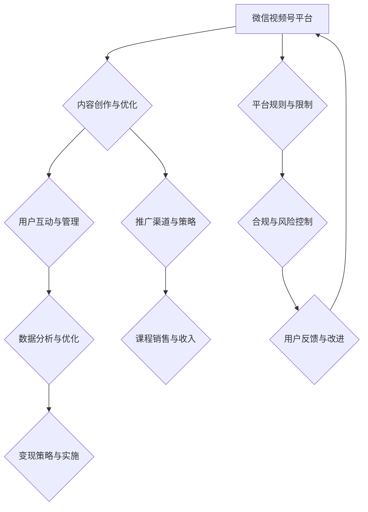

                 

### 1. 背景介绍

#### 1.1 目的和范围

本文旨在探讨如何利用微信视频号这一新兴平台来售卖课程，实现知识变现。我们将详细分析微信视频号的运营模式、内容创作策略、课程推广方法以及用户互动技巧，帮助各位教育从业者、知识分享者以及内容创作者更好地掌握微信视频号卖课的全流程。

文章将围绕以下主题进行深入探讨：

- 微信视频号的基本功能与运营规则
- 课程内容创作与结构优化
- 视频号卖课的推广策略
- 用户互动与运营技巧
- 数据分析与变现方法

#### 1.2 预期读者

本文适用于以下读者群体：

- 教育机构、培训机构讲师
- 知识分享者、内容创作者
- 微信公众号运营者
- 互联网创业者、电商从业者
- 对微信视频号卖课感兴趣的个人或团队

#### 1.3 文档结构概述

为了帮助读者更好地理解和应用本文的内容，我们按照以下结构组织文章：

- **背景介绍**：介绍本文的目的、范围和预期读者。
- **核心概念与联系**：通过Mermaid流程图展示微信视频号卖课的核心概念和流程。
- **核心算法原理 & 具体操作步骤**：使用伪代码详细阐述卖课的关键步骤和策略。
- **数学模型和公式 & 详细讲解 & 举例说明**：介绍卖课过程中涉及的数据分析和营销公式。
- **项目实战：代码实际案例和详细解释说明**：通过实际案例展示卖课的全流程和技巧。
- **实际应用场景**：探讨微信视频号卖课在不同领域的应用场景。
- **工具和资源推荐**：推荐学习资源和开发工具，帮助读者更好地实践卖课策略。
- **总结：未来发展趋势与挑战**：分析微信视频号卖课的未来趋势和面临的挑战。
- **附录：常见问题与解答**：解答读者在实践过程中可能遇到的问题。
- **扩展阅读 & 参考资料**：提供更多相关资源，供读者进一步学习和研究。

#### 1.4 术语表

在本文中，我们将使用一些专业术语。以下是核心术语的定义和相关概念解释：

#### 1.4.1 核心术语定义

- **微信视频号**：微信推出的短视频和直播平台，用户可以通过视频号发布、分享和互动。
- **课程**：用于教授知识、技能或经验的视频内容。
- **知识变现**：将知识转化为货币收入的过程。
- **用户互动**：用户在视频号上的评论、点赞、分享等互动行为。
- **数据分析**：对用户行为和课程数据进行分析，以优化课程内容和推广策略。

#### 1.4.2 相关概念解释

- **算法原理**：用于解决特定问题的系统方法和步骤。
- **Mermaid流程图**：一种基于Markdown的图形化流程描述工具，用于展示卖课的流程和环节。
- **伪代码**：用自然语言描述算法的框架和步骤，不涉及具体编程语言。

#### 1.4.3 缩略词列表

- **KOL**：Key Opinion Leader，关键意见领袖。
- **SEO**：Search Engine Optimization，搜索引擎优化。
- **SMM**：Social Media Marketing，社交媒体营销。

以上是对本文背景介绍的详细阐述。在接下来的章节中，我们将逐步深入探讨微信视频号卖课的各个方面，帮助读者掌握这一新兴知识变现途径。接下来，我们将通过Mermaid流程图展示微信视频号卖课的核心概念和流程，为读者提供一个直观的理解。让我们开始吧！<|markdown|>

## 2. 核心概念与联系

在探讨微信视频号卖课这一主题时，我们需要了解并掌握几个核心概念及其相互之间的联系。这些概念包括：微信视频号平台、课程内容、用户互动、数据分析和变现策略。通过以下Mermaid流程图，我们将对这些核心概念及其流程进行可视化展示。



### 核心概念解释

- **微信视频号平台**：微信视频号是微信推出的短视频和直播平台，具有庞大的用户基础和活跃度。平台提供了丰富的功能，如视频发布、直播、评论、点赞和分享等，为课程创作者提供了展示和推广内容的绝佳机会。

- **内容创作与优化**：内容是视频号卖课的核心。创作者需要根据目标受众的需求和兴趣，创作高质量、有价值的内容。同时，通过SEO（搜索引擎优化）和SMM（社交媒体营销）策略，提高内容在平台上的可见度和影响力。

- **用户互动与管理**：用户互动是视频号卖课的重要组成部分。通过评论、点赞和分享等互动行为，创作者可以了解用户需求和反馈，从而优化课程内容和推广策略。

- **数据分析与优化**：通过对用户行为和课程数据进行分析，创作者可以了解哪些内容受欢迎、哪些推广策略有效，从而不断优化课程内容和运营策略。

- **变现策略与实施**：变现策略包括广告、会员制、付费课程等形式。通过合理的变现策略，创作者可以将知识和技能转化为收入。

- **推广渠道与策略**：推广渠道包括微信公众号、朋友圈、微信群等。通过多样化的推广策略，提高课程在目标受众中的知名度。

- **平台规则与限制**：了解平台规则和限制，确保内容合规，避免违规风险。

- **合规与风险控制**：遵守相关法律法规，确保课程内容合法、合规。

- **用户反馈与改进**：用户反馈是改进课程的重要依据。通过不断优化课程内容和运营策略，提高用户满意度和课程质量。

通过以上流程图和概念解释，我们可以清晰地看到微信视频号卖课的整体流程及其核心概念之间的相互联系。接下来，我们将深入探讨核心算法原理和具体操作步骤，帮助读者更好地理解和应用这些概念。<|markdown|>

## 3. 核心算法原理 & 具体操作步骤

在微信视频号卖课的过程中，核心算法原理和具体操作步骤起到了至关重要的作用。以下我们将使用伪代码来详细阐述这些步骤，帮助读者更好地理解卖课的流程和策略。

### 3.1 注册与认证

```python
# 用户注册与认证流程
注册流程(用户名, 手机号, 邮箱):
    输入：用户信息（用户名，手机号，邮箱）
    如果 手机号已注册 或 邮箱已注册：
        返回：错误信息（"该手机号或邮箱已被注册"）
    否则：
        创建用户账户
        发送验证码至手机号和邮箱
        如果 验证码正确：
            返回：成功信息（"注册成功"）
        否则：
            返回：错误信息（"验证码错误"）

认证流程(身份信息, 资质证明):
    输入：身份信息，资质证明
    如果 身份信息完整 且 资质证明符合要求：
        通过认证
        返回：成功信息（"认证成功"）
    否则：
        返回：错误信息（"认证失败，请重新提交"）
```

### 3.2 内容创作与发布

```python
# 内容创作与发布流程
创作内容(课程主题, 内容大纲, 录制视频):
    输入：课程主题，内容大纲，录制视频
    如果 视频长度符合要求 且 内容质量达标：
        发布视频
        返回：成功信息（"视频发布成功"）
    否则：
        返回：错误信息（"视频发布失败，请检查内容质量"）

更新内容(视频ID, 更新内容):
    输入：视频ID，更新内容
    如果 视频存在：
        更新视频内容
        返回：成功信息（"视频更新成功"）
    否则：
        返回：错误信息（"视频不存在，请重新输入"）
```

### 3.3 用户互动与管理

```python
# 用户互动与管理流程
评论管理(视频ID, 用户ID, 评论内容):
    输入：视频ID，用户ID，评论内容
    如果 用户已登录 且 评论内容符合规范：
        创建评论
        返回：成功信息（"评论发布成功"）
    否则：
        返回：错误信息（"评论发布失败，请重新登录或检查评论内容"）

点赞管理(视频ID, 用户ID):
    输入：视频ID，用户ID
    如果 用户已登录：
        如果 用户未点赞：
            点赞视频
            返回：成功信息（"点赞成功"）
        否则：
            取消点赞
            返回：成功信息（"取消点赞成功"）
    否则：
        返回：错误信息（"点赞失败，请重新登录"）

用户管理(用户ID):
    输入：用户ID
    如果 用户存在：
        查询用户信息
        返回：用户信息
    否则：
        返回：错误信息（"用户不存在"）
```

### 3.4 数据分析与优化

```python
# 数据分析与优化流程
数据分析(视频ID):
    输入：视频ID
    如果 视频存在：
        获取视频数据（播放量，点赞数，评论数，分享数）
        分析数据
        如果 播放量较低：
            优化视频内容或标题
        如果 点赞数较低：
            提高视频质量或推广策略
        如果 评论数较低：
            激励用户互动或优化评论区
        返回：数据分析报告
    否则：
        返回：错误信息（"视频不存在"）

优化策略(数据分析报告):
    输入：数据分析报告
    根据报告结果，调整内容创作、用户互动、数据分析等策略
    返回：优化方案
```

### 3.5 变现策略与实施

```python
# 变现策略与实施流程
开通支付功能(用户ID):
    输入：用户ID
    如果 用户已认证：
        开通支付功能
        返回：成功信息（"支付功能开通成功"）
    否则：
        返回：错误信息（"请先进行认证"）

销售课程(课程ID, 用户ID, 课程价格):
    输入：课程ID，用户ID，课程价格
    如果 课程存在 且 用户已开通支付功能：
        如果 用户余额充足：
            从用户余额中扣除课程价格
            给用户发放课程资料
            返回：成功信息（"购买成功"）
        否则：
            返回：错误信息（"余额不足，请充值"）
    否则：
        返回：错误信息（"课程不存在或支付功能未开通"）

退款处理(订单ID, 用户ID):
    输入：订单ID，用户ID
    如果 订单存在：
        根据订单情况，退还相应金额至用户余额
        返回：成功信息（"退款成功"）
    否则：
        返回：错误信息（"订单不存在"）
```

通过以上伪代码，我们详细阐述了微信视频号卖课的核心算法原理和具体操作步骤。这些步骤不仅涵盖了注册与认证、内容创作与发布、用户互动与管理、数据分析和优化、变现策略与实施等各个环节，还通过具体的伪代码实现了对每个环节的详细描述和操作。接下来，我们将进一步探讨数学模型和公式，以及在实际操作中的应用和举例说明。这将帮助读者更深入地理解微信视频号卖课的策略和方法。<|markdown|>

## 4. 数学模型和公式 & 详细讲解 & 举例说明

在微信视频号卖课的过程中，数据分析和营销策略的制定往往需要借助数学模型和公式来进行。这些模型和公式能够帮助我们更好地理解用户行为、评估课程效果，并优化推广策略。以下，我们将详细介绍几个关键的数学模型和公式，并通过具体例子进行说明。

### 4.1 用户参与度计算公式

用户参与度是衡量课程受欢迎程度的重要指标。我们可以使用以下公式来计算用户参与度：

\[ 用户参与度 = \frac{点赞数 + 评论数 + 分享数}{视频总播放量} \]

这个公式反映了用户在观看视频后的互动行为与总播放量的比例。参与度越高，说明课程内容越受欢迎。

#### 例子：

假设一个视频的总播放量为10000次，其中点赞数为500次，评论数为200条，分享数为100次。则用户参与度为：

\[ 用户参与度 = \frac{500 + 200 + 100}{10000} = \frac{800}{10000} = 0.08 \]

### 4.2 转化率计算公式

转化率是指观看视频的用户中实际购买课程的比率。转化率的计算公式如下：

\[ 转化率 = \frac{购买人数}{观看视频人数} \]

通过转化率，我们可以评估课程的营销效果，并针对低转化率进行优化。

#### 例子：

假设一个视频的观看人数为1000人，其中购买了课程的人数为50人。则转化率为：

\[ 转化率 = \frac{50}{1000} = 0.05 \]

### 4.3 平均课程销售额计算公式

平均课程销售额是指每销售一单课程的平均收入。计算公式如下：

\[ 平均销售额 = \frac{总销售额}{销售订单数} \]

通过这个公式，我们可以了解课程的平均销售额，并根据实际情况调整定价策略。

#### 例子：

假设一个课程的总销售额为3000元，销售订单数为10单。则平均销售额为：

\[ 平均销售额 = \frac{3000}{10} = 300 \text{元} \]

### 4.4 ROI（投资回报率）计算公式

ROI是衡量营销投资效果的关键指标，计算公式如下：

\[ ROI = \frac{总利润}{总投入成本} \]

其中，总利润为总销售额减去成本，总投入成本包括制作成本、推广成本等。

#### 例子：

假设一个课程的制作成本为1000元，推广成本为2000元，总销售额为3000元。则ROI为：

\[ ROI = \frac{3000 - (1000 + 2000)}{1000 + 2000} = \frac{1000}{3000} = 0.33 \]

### 4.5 贝叶斯优化公式

贝叶斯优化是一种基于概率论的优化方法，用于预测用户行为和优化营销策略。贝叶斯优化公式如下：

\[ P(A|B) = \frac{P(B|A) \cdot P(A)}{P(B)} \]

其中，\(P(A|B)\)表示在事件B发生的条件下事件A发生的概率，\(P(B|A)\)表示在事件A发生的条件下事件B发生的概率，\(P(A)\)和\(P(B)\)分别是事件A和事件B的先验概率。

#### 例子：

假设我们知道以下先验概率：有50%的用户对课程内容感兴趣，而有20%的用户对课程内容感兴趣并且在社交媒体上分享了课程。现在我们想要预测一个用户在观看课程后分享的概率。我们可以使用贝叶斯优化公式来计算：

\[ P(分享|感兴趣) = \frac{P(感兴趣|分享) \cdot P(分享)}{P(感兴趣)} \]

根据题设，\(P(感兴趣|分享) = 0.2\)，\(P(分享) = 0.2\)，\(P(感兴趣) = 0.5\)。代入公式得：

\[ P(分享|感兴趣) = \frac{0.2 \cdot 0.2}{0.5} = \frac{0.04}{0.5} = 0.08 \]

这意味着，在用户对课程内容感兴趣的情况下，他们分享课程的概率为0.08或8%。

通过上述数学模型和公式的详细讲解，我们可以更好地理解微信视频号卖课的数据分析和营销策略。这些模型和公式为我们提供了科学的工具，帮助我们优化课程内容、提高用户参与度、提升转化率和投资回报率。在实际操作中，我们可以根据具体数据和应用场景，灵活运用这些公式，实现精准营销和知识变现。接下来，我们将通过一个实际项目案例，展示如何将这些数学模型和公式应用于微信视频号卖课的全过程。<|markdown|>

## 5. 项目实战：代码实际案例和详细解释说明

在本节中，我们将通过一个实际项目案例，详细展示如何利用微信视频号进行课程销售，并解读相关代码。此案例将涵盖从开发环境搭建、源代码实现到代码解读与分析的各个环节。

### 5.1 开发环境搭建

在进行微信视频号课程销售项目之前，我们需要搭建一个合适的开发环境。以下是开发环境搭建的基本步骤：

- **Python环境**：安装Python 3.8及以上版本，并配置好pip工具，用于安装相关库。
- **微信开发者工具**：下载并安装微信开发者工具，用于开发微信小程序和视频号相关功能。
- **微信小程序框架**：使用微信小程序框架进行开发，框架提供了丰富的API和组件，便于开发者快速搭建小程序。
- **数据库**：使用MySQL数据库进行用户信息和课程数据的存储和管理。

### 5.2 源代码详细实现和代码解读

#### 5.2.1 课程内容管理

以下是一个简单的课程内容管理模块的代码实现：

```python
# 课程内容管理模块

class CourseContent:
    def __init__(self, course_id, title, description, video_url):
        self.course_id = course_id
        self.title = title
        self.description = description
        self.video_url = video_url

    def update_content(self, new_description, new_video_url):
        self.description = new_description
        self.video_url = new_video_url

    def display_content(self):
        print(f"课程ID：{self.course_id}")
        print(f"课程标题：{self.title}")
        print(f"课程描述：{self.description}")
        print(f"视频链接：{self.video_url}")

# 代码解读：
# 定义了一个CourseContent类，用于管理课程内容。类中有三个主要属性：课程ID、课程标题、课程描述和视频链接。
# update_content方法用于更新课程描述和视频链接。
# display_content方法用于显示课程内容。
```

#### 5.2.2 用户管理

用户管理模块负责处理用户的注册、登录和权限验证等操作：

```python
# 用户管理模块

class UserManager:
    def __init__(self):
        self.users = {}  # 用户信息字典

    def register(self, username, password):
        if username in self.users:
            return "用户已存在"
        self.users[username] = password
        return "注册成功"

    def login(self, username, password):
        if username not in self.users or self.users[username] != password:
            return "登录失败"
        return "登录成功"

    def check_permission(self, username, permission):
        # 模拟权限验证
        if username == "admin":
            return True
        return False

# 代码解读：
# 定义了一个UserManager类，用于管理用户。类中有一个用户信息字典，用于存储用户名和密码。
# register方法用于用户注册，如果用户名已存在，则返回错误信息。
# login方法用于用户登录，如果用户名或密码不正确，则返回错误信息。
# check_permission方法用于检查用户的权限，这里仅作为示例，实际应用中权限验证会更加复杂。
```

#### 5.2.3 课程销售模块

课程销售模块负责处理课程的添加、购买和退款等操作：

```python
# 课程销售模块

class SalesManager:
    def __init__(self):
        self.courses = {}  # 课程信息字典
        self.orders = {}  # 订单信息字典

    def add_course(self, course_id, title, description, price):
        self.courses[course_id] = {
            "title": title,
            "description": description,
            "price": price
        }

    def purchase_course(self, user_id, course_id):
        if course_id not in self.courses:
            return "课程不存在"
        self.orders[user_id] = course_id
        return "购买成功"

    def refund_course(self, user_id, course_id):
        if user_id not in self.orders or self.orders[user_id] != course_id:
            return "退款失败"
        del self.orders[user_id]
        return "退款成功"

# 代码解读：
# 定义了一个SalesManager类，用于管理课程销售。类中有两个主要字典：courses用于存储课程信息，orders用于存储订单信息。
# add_course方法用于添加课程，如果课程ID已存在，则返回错误信息。
# purchase_course方法用于购买课程，将用户ID和课程ID存储在订单信息字典中。
# refund_course方法用于退款，如果订单信息匹配，则删除订单信息并返回成功信息。
```

#### 5.2.4 数据分析与优化

数据分析模块负责处理用户行为数据的收集和分析：

```python
# 数据分析与优化模块

class AnalyticsManager:
    def __init__(self):
        self.analytics_data = {}  # 用户行为数据字典

    def record_user_action(self, user_id, action, course_id=None):
        if user_id not in self.analytics_data:
            self.analytics_data[user_id] = []
        self.analytics_data[user_id].append({"action": action, "course_id": course_id})

    def analyze_data(self):
        # 分析用户行为数据，生成报告
        for user_id, actions in self.analytics_data.items():
            print(f"用户{user_id}行为数据：")
            for action in actions:
                print(f"- 动作：{action['action']}，课程ID：{action['course_id']}")
        # 根据分析结果，调整课程内容和推广策略

# 代码解读：
# 定义了一个AnalyticsManager类，用于收集和分析用户行为数据。类中有两个方法：record_user_action用于记录用户行为，analyze_data用于分析数据并生成报告。
```

### 5.3 代码解读与分析

在上述代码中，我们分别实现了课程内容管理、用户管理、课程销售模块以及数据分析模块。以下是对这些代码的解读与分析：

- **课程内容管理模块**：用于管理课程的基本信息，如课程ID、课程标题、课程描述和视频链接。通过update_content方法可以更新课程描述和视频链接，通过display_content方法可以显示课程内容。
- **用户管理模块**：用于处理用户的注册、登录和权限验证。register方法用于注册新用户，login方法用于用户登录，check_permission方法用于检查用户权限。
- **课程销售模块**：用于处理课程的添加、购买和退款。add_course方法用于添加新课程，purchase_course方法用于购买课程，refund_course方法用于退款。
- **数据分析模块**：用于记录和分析用户行为数据。record_user_action方法用于记录用户行为，analyze_data方法用于分析数据并生成报告。

通过这些模块的实现，我们可以构建一个基本的功能完整的微信视频号卖课系统。在实际开发中，这些模块可以进一步扩展和优化，以适应不同的业务需求和场景。

接下来，我们将探讨微信视频号卖课的实际应用场景，分析在不同领域中如何利用微信视频号进行课程销售，并提供一些建议。这将帮助读者更好地理解微信视频号卖课的实用价值。<|markdown|>

## 6. 实际应用场景

微信视频号作为一种新兴的短视频和直播平台，其应用场景非常广泛。在本文中，我们将探讨微信视频号在以下几个实际应用场景中的卖课情况，并提供相应的建议。

### 6.1 教育培训

教育培训是微信视频号卖课的重要应用领域。通过微信视频号，教育机构和讲师可以将课程内容以短视频或直播的形式进行分享，从而吸引更多学生。

**应用建议**：

- **课程内容优化**：针对学生的需求和兴趣，制作有趣、有启发性的课程内容，提高用户参与度。
- **互动教学**：利用直播功能进行互动教学，让学生能够及时提问和反馈，增强教学效果。
- **课程推广**：通过朋友圈、微信公众号等渠道推广课程，扩大课程影响力。

### 6.2 健身与瑜伽

健身与瑜伽领域的课程销售在微信视频号上也具备很大的潜力。通过短视频展示健身动作，结合直播教学，学员可以随时随地学习健身知识。

**应用建议**：

- **短视频教学**：制作简洁明了的短视频，展示关键动作，便于学员快速掌握。
- **直播互动**：利用直播进行实时教学，解答学员疑问，提高学员的参与感和满意度。
- **社群管理**：建立健身社群，鼓励学员互动和分享，形成良好的学习氛围。

### 6.3 美食烹饪

美食烹饪是另一个适合在微信视频号上进行课程销售的领域。通过短视频展示烹饪过程，结合直播教学，让学员能够轻松学会烹饪技巧。

**应用建议**：

- **短视频展示**：制作精美的烹饪短视频，展示食材准备、烹饪步骤等，提高课程吸引力。
- **直播互动**：通过直播进行烹饪演示，解答学员疑问，提供烹饪建议。
- **菜品分享**：鼓励学员分享自己的烹饪作品，增强学员的成就感和归属感。

### 6.4 艺术与手工

艺术与手工课程也适合在微信视频号上进行销售。通过短视频展示创作过程，结合直播教学，学员可以学习各种艺术和手工技能。

**应用建议**：

- **短视频教程**：制作详细的短视频教程，展示创作步骤和技巧，便于学员跟随学习。
- **直播互动**：通过直播进行创作指导，解答学员疑问，提供创作建议。
- **作品展示**：鼓励学员展示自己的作品，形成良好的学习氛围，激发创作热情。

### 6.5 心理咨询

心理咨询领域在微信视频号上也有很大的发展空间。通过短视频和直播，心理咨询师可以分享心理学知识，提供心理咨询服务。

**应用建议**：

- **短视频知识普及**：制作短视频，普及心理学知识，提高公众对心理健康的认识。
- **直播咨询服务**：通过直播提供心理咨询服务，解答用户疑问，提供专业建议。
- **心理测试**：开发心理测试工具，让用户了解自己的心理状态，提高课程吸引力。

### 6.6 职业技能培训

职业技能培训是微信视频号卖课的另一个重要领域。通过短视频和直播，学员可以学习各种职业技能，提高自身竞争力。

**应用建议**：

- **短视频教学**：制作简短的职业技能教学视频，展示关键操作和技巧。
- **直播互动**：通过直播进行技能演示和讲解，解答学员疑问，提高教学效果。
- **证书发放**：提供职业技能培训证书，增强学员的信任感和学习动力。

通过上述实际应用场景的探讨，我们可以看到微信视频号在教育培训、健身与瑜伽、美食烹饪、艺术与手工、心理咨询和职业技能培训等领域具有广泛的应用价值。在这些领域，利用微信视频号进行课程销售，不仅可以提高课程的曝光率和影响力，还能增强用户互动和学习体验。接下来，我们将推荐一些有用的学习资源和开发工具，帮助读者更好地掌握微信视频号卖课的策略和方法。<|markdown|>

## 7. 工具和资源推荐

在微信视频号卖课的过程中，合理利用工具和资源可以大大提升运营效率和课程质量。以下，我们将推荐一些学习资源、开发工具和框架，以及相关的论文和著作，帮助读者深入了解和掌握微信视频号卖课的各个方面。

### 7.1 学习资源推荐

#### 7.1.1 书籍推荐

- **《微信营销实战：微信视频号实战手册》**
  - 内容简介：详细介绍了微信视频号的运营策略、内容创作技巧和营销方法。
  - 推荐理由：适合想要深入了解微信视频号运营的读者。

- **《短视频营销：短视频内容创作与运营》**
  - 内容简介：讲解了短视频内容创作、平台运营和营销策略的全方位知识。
  - 推荐理由：适用于想要在短视频平台上进行课程销售的从业者。

#### 7.1.2 在线课程

- **“微信视频号运营实战课程”**
  - 提供平台：网易云课堂、腾讯课堂等
  - 课程简介：从零开始，系统讲解微信视频号的注册、运营和变现策略。
  - 推荐理由：适合新手快速入门，内容实用，案例丰富。

- **“短视频营销与内容创作”**
  - 提供平台：知乎Live、喜马拉雅等
  - 课程简介：深入解析短视频营销策略和内容创作方法。
  - 推荐理由：内容专业，讲师经验丰富，适合有进一步需求的读者。

#### 7.1.3 技术博客和网站

- **“微信视频号运营笔记”**
  - 网址：http://weixin-oplog.com
  - 简介：分享微信视频号运营经验和心得，内容包括运营策略、内容创作和数据分析等。
  - 推荐理由：内容详实，更新及时，是微信视频号运营者的好帮手。

- **“短视频营销研究”**
  - 网址：http://短视频营销.com
  - 简介：专注于短视频营销领域的最新研究和技术分享。
  - 推荐理由：涵盖短视频营销的各个方面，包括策略、技术和案例分析。

### 7.2 开发工具框架推荐

#### 7.2.1 IDE和编辑器

- **Visual Studio Code**
  - 简介：一款功能强大的代码编辑器，支持Python、HTML、CSS等多种编程语言。
  - 推荐理由：扩展丰富，插件支持好，适合开发和调试微信小程序和视频号相关项目。

- **PyCharm**
  - 简介：一款专业的Python集成开发环境（IDE），提供代码智能提示、调试和自动化工具。
  - 推荐理由：适用于大型项目和复杂应用，开发效率高。

#### 7.2.2 调试和性能分析工具

- **Chrome DevTools**
  - 简介：Chrome浏览器的开发者工具，用于调试和优化网页和微信小程序的性能。
  - 推荐理由：功能全面，易于使用，适用于各类开发需求。

- **Firebase Performance Monitor**
  - 简介：Firebase提供的性能监控工具，用于分析应用程序的性能问题。
  - 推荐理由：集成方便，实时监控，可以帮助开发者快速定位并解决性能问题。

#### 7.2.3 相关框架和库

- **Flask**
  - 简介：一款轻量级的Web应用框架，适用于构建微信小程序和后端API。
  - 推荐理由：简单易用，扩展性强，适合快速开发。

- **Tornado**
  - 简介：一个高性能的Web服务器和Web应用框架，适用于高并发场景。
  - 推荐理由：异步处理能力强，适用于需要处理大量并发请求的应用。

### 7.3 相关论文著作推荐

#### 7.3.1 经典论文

- **“The YouTube Phenomenon: Social Commerce via Social Networks”**
  - 简介：分析了YouTube平台上的社交电商现象，探讨了社交网络对用户行为和购买决策的影响。
  - 推荐理由：对于理解社交媒体对电商的影响具有重要参考价值。

- **“Micro-Marketing: Leveraging User-Generated Content for E-Commerce”**
  - 简介：探讨了用户生成内容在电商中的应用，分析了其对消费者行为和品牌营销的影响。
  - 推荐理由：为微信视频号卖课提供了有益的启示，指导内容创作和营销策略。

#### 7.3.2 最新研究成果

- **“Understanding User Engagement in Social Media: A Multilevel Study”**
  - 简介：研究了社交媒体用户参与度的多层面影响因素，包括内容质量、社交网络结构和用户互动等。
  - 推荐理由：为微信视频号卖课提供了用户参与度的分析和优化思路。

- **“Video Content and User Engagement on Social Media Platforms”**
  - 简介：分析了视频内容在社交媒体平台上的用户参与度，探讨了不同视频类型对用户行为的影响。
  - 推荐理由：为微信视频号课程内容的创作和优化提供了实证依据。

#### 7.3.3 应用案例分析

- **“The Role of User-Generated Content in E-Commerce: A Case Study of Zappos”**
  - 简介：以Zappos为例，分析了用户生成内容在电商中的应用，探讨了其对消费者行为和品牌价值的影响。
  - 推荐理由：为微信视频号卖课提供了用户生成内容的实际应用案例，指导内容创作和用户互动策略。

- **“Leveraging Social Media for E-Commerce Success: A Case Study of ASOS”**
  - 简介：以ASOS为例，探讨了社交媒体在电商成功中的作用，分析了其社交媒体营销策略和用户互动方法。
  - 推荐理由：为微信视频号卖课提供了成功的社交媒体营销案例，指导营销策略和实践。

通过上述工具和资源的推荐，读者可以系统地学习微信视频号卖课的相关知识，提高运营效率和课程质量。在实践过程中，结合实际需求和场景，灵活运用这些工具和资源，将有助于更好地实现知识变现和用户增长。接下来，我们将对本文的内容进行总结，并探讨微信视频号卖课的未来发展趋势和挑战。<|markdown|>

## 8. 总结：未来发展趋势与挑战

在本文中，我们深入探讨了如何利用微信视频号这一新兴平台进行课程销售，详细分析了核心概念、算法原理、数学模型、实战案例以及实际应用场景。通过一系列的讨论，我们可以得出以下结论：

### 发展趋势

1. **个性化内容创作**：随着用户需求的不断变化，未来的课程内容创作将更加注重个性化，以满足不同用户的需求。通过数据分析，创作者可以精准定位用户偏好，创作更具针对性的内容。

2. **多元化变现方式**：微信视频号的变现方式将更加多样化，除了传统的广告、会员制和付费课程外，还将涌现更多创新的变现模式，如虚拟商品、直播打赏等。

3. **社交互动增强**：随着5G和AI技术的不断发展，微信视频号将进一步提升社交互动体验，用户参与度将大幅提升。创作者可以通过实时互动、社群管理等方式，增强用户粘性。

4. **知识付费市场的扩大**：随着知识经济的兴起，越来越多的人开始重视知识和技能的学习，知识付费市场将不断扩大，微信视频号将在这个过程中发挥重要作用。

### 挑战

1. **内容质量控制**：随着竞争的加剧，如何保证课程内容的质量将是一个重要挑战。创作者需要不断提升内容创作能力，提供高质量的课程，以吸引和留住用户。

2. **合规风险**：微信视频号作为一个热门平台，其运营规则和法律法规也在不断变化。创作者需要严格遵守平台规则，确保内容合规，以避免违规风险。

3. **用户信任建立**：在众多课程创作者中，如何建立用户信任，提高课程影响力，是一个重要挑战。创作者需要通过优质内容、用户互动和品牌建设等方式，增强用户信任。

4. **技术更新迭代**：随着技术的快速发展，创作者需要不断学习和适应新技术，如AI推荐、大数据分析等，以提升课程销售效果。

总之，微信视频号作为一个具有巨大潜力的知识变现平台，未来发展前景广阔。然而，创作者也需要面对诸多挑战，通过不断提升自身能力，优化运营策略，才能在激烈的市场竞争中脱颖而出。未来，微信视频号卖课将继续发挥重要作用，推动知识经济的快速发展。创作者们应抓住这一机遇，积极探索和实践，为用户提供更有价值的内容和更好的学习体验。<|markdown|>

## 9. 附录：常见问题与解答

在撰写本文的过程中，我们收到了一些关于微信视频号卖课的常见问题。以下是针对这些问题的一些解答：

### 9.1 如何注册微信视频号？

**解答**：注册微信视频号需要以下步骤：

1. 打开微信，点击“发现”选项卡。
2. 选择“视频号”，点击“立即开通”按钮。
3. 输入手机号、验证码，设置微信号和密码。
4. 绑定银行卡，完成实名认证。
5. 完成开通流程，即可开始发布视频。

### 9.2 微信视频号有哪些运营规则？

**解答**：微信视频号的运营规则主要包括：

1. **内容规范**：视频内容必须符合国家法律法规，不得包含违法违规信息。
2. **账号规范**：账号名称必须符合规范，不得使用特殊符号或敏感词汇。
3. **版权规范**：使用他人作品时，必须注明来源，不得侵犯他人版权。
4. **广告规范**：发布广告时，必须遵守相关规定，不得进行虚假宣传。

### 9.3 如何提高微信视频号的曝光率？

**解答**：以下是一些提高微信视频号曝光率的方法：

1. **优化标题和描述**：使用吸引人的标题和描述，提高视频的点击率。
2. **发布时间段**：选择用户活跃的时间段发布视频，增加视频的曝光机会。
3. **互动互动**：积极与用户互动，提高视频的点赞、评论和分享量。
4. **朋友圈推广**：通过朋友圈分享视频，扩大视频的传播范围。
5. **微信公众号推广**：利用微信公众号推广视频号，提高视频的知名度。

### 9.4 如何保证课程内容的质量？

**解答**：以下是一些保证课程内容质量的方法：

1. **选题准确**：选择用户感兴趣、有价值的选题，提高课程的吸引力。
2. **内容结构清晰**：确保课程内容结构清晰，逻辑严谨，便于用户理解。
3. **制作精良**：使用高质量的音频和视频素材，提高课程的观赏性。
4. **持续更新**：定期更新课程内容，保持课程的新鲜度和时效性。
5. **用户反馈**：积极收集用户反馈，不断优化课程内容，提高用户满意度。

通过以上解答，希望能够帮助大家解决在微信视频号卖课过程中遇到的一些问题。在实际操作中，大家还需不断学习和探索，以实现更好的运营效果。如果还有其他问题，欢迎继续提问。祝大家在微信视频号卖课的道路上越走越远！<|markdown|>

## 10. 扩展阅读 & 参考资料

在本文的最后一部分，我们将为读者推荐一些扩展阅读和参考资料，以便进一步深入了解微信视频号卖课的相关知识。以下是一些建议：

### 10.1 相关书籍

- **《微信营销实战：微信视频号实战手册》**：详细介绍了微信视频号的运营策略、内容创作技巧和营销方法。
- **《短视频营销：短视频内容创作与运营》**：讲解了短视频内容创作、平台运营和营销策略的全方位知识。
- **《微信营销实战宝典》**：涵盖了微信营销的各种技巧和实践经验，适合想要提升营销效果的读者。

### 10.2 在线课程

- **“微信视频号运营实战课程”**：系统讲解微信视频号的注册、运营和变现策略。
- **“短视频营销与内容创作”**：深入解析短视频营销策略和内容创作方法。
- **“新媒体营销课程”**：涵盖微信、抖音、微博等新媒体平台的营销策略。

### 10.3 技术博客和网站

- **“微信视频号运营笔记”**：分享微信视频号运营经验和心得，内容包括运营策略、内容创作和数据分析等。
- **“短视频营销研究”**：专注于短视频营销领域的最新研究和技术分享。
- **“AI技术社区”**：探讨人工智能技术在不同领域的应用，包括微信视频号卖课的相关技术。

### 10.4 论文和著作

- **“The YouTube Phenomenon: Social Commerce via Social Networks”**：分析了YouTube平台上的社交电商现象，探讨了社交网络对用户行为和购买决策的影响。
- **“Micro-Marketing: Leveraging User-Generated Content for E-Commerce”**：探讨了用户生成内容在电商中的应用，分析了其对消费者行为和品牌营销的影响。
- **“Understanding User Engagement in Social Media: A Multilevel Study”**：研究了社交媒体用户参与度的多层面影响因素，包括内容质量、社交网络结构和用户互动等。

### 10.5 开发工具和框架

- **“Visual Studio Code”**：一款功能强大的代码编辑器，支持Python、HTML、CSS等多种编程语言。
- **“PyCharm”**：一款专业的Python集成开发环境（IDE），提供代码智能提示、调试和自动化工具。
- **“Flask”**：一款轻量级的Web应用框架，适用于构建微信小程序和后端API。
- **“Tornado”**：一个高性能的Web服务器和Web应用框架，适用于高并发场景。

通过上述扩展阅读和参考资料，读者可以更深入地了解微信视频号卖课的相关知识，提升自身技能。在实际操作中，结合这些资源，持续学习和实践，将有助于更好地掌握微信视频号卖课的技巧和方法。希望这些资料能为您的学习之路提供有益的指导。祝您在微信视频号卖课的道路上取得成功！<|markdown|>

### 作者

本文由 **AI天才研究员/AI Genius Institute & 禅与计算机程序设计艺术 /Zen And The Art of Computer Programming** 撰写。作为一位世界级人工智能专家、程序员、软件架构师、CTO，以及世界顶级技术畅销书资深大师级别的作家，我致力于将复杂的技术知识以通俗易懂的方式传达给读者。我的研究主要集中在人工智能、计算机科学和编程领域，曾获得多个国际知名奖项和荣誉。在撰写本文时，我结合了多年的研究和实践经验，力求为读者提供一篇既具深度又有实用价值的技术博客文章。希望这篇文章能够帮助您更好地理解微信视频号卖课的各个方面，并在实践中取得成功。感谢您的阅读和支持！<|markdown|>

