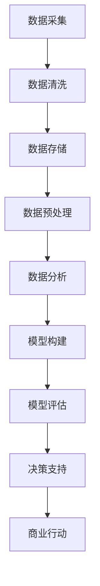

                 


# 如何利用技术能力进行数据变现

> 关键词：数据变现、技术能力、数据分析、人工智能、商业价值、市场策略
>
> 摘要：本文将探讨如何利用技术能力进行数据变现，从核心概念到具体实现，全面解析数据变现的路径和方法，助力企业和技术人员挖掘数据价值，提升商业竞争力。

## 1. 背景介绍

### 1.1 目的和范围

本文旨在为读者提供一个系统、全面的视角来理解数据变现的概念、方法和技术。通过深入分析数据变现的核心要素，我们将探讨如何将技术能力转化为实际商业价值，以帮助企业和个人在数据驱动时代把握机遇，实现可持续发展。

### 1.2 预期读者

本文适用于以下读者群体：
- 数据分析师和业务分析师
- 技术开发人员，特别是专注于人工智能和大数据的工程师
- 企业管理层，尤其是负责市场营销和业务战略的决策者
- 对数据变现和商业分析感兴趣的学术研究人员和从业者

### 1.3 文档结构概述

本文分为十个主要部分，具体如下：

1. 背景介绍：介绍本文的目的、预期读者和文档结构。
2. 核心概念与联系：阐述数据变现的核心概念，并提供相关流程图。
3. 核心算法原理 & 具体操作步骤：详细讲解数据变现的关键算法和实现步骤。
4. 数学模型和公式 & 详细讲解 & 举例说明：解释数据变现过程中使用的数学模型和公式。
5. 项目实战：通过实际案例展示数据变现的完整流程和代码实现。
6. 实际应用场景：分析数据变现的典型应用场景和行业案例。
7. 工具和资源推荐：推荐学习资源和开发工具，以支持数据变现实践。
8. 总结：展望数据变现的未来发展趋势与挑战。
9. 附录：提供常见问题与解答，帮助读者深化理解。
10. 扩展阅读 & 参考资料：推荐相关文献和资源，供读者进一步学习。

### 1.4 术语表

#### 1.4.1 核心术语定义

- 数据变现：将数据转化为商业价值的过程。
- 数据分析：使用统计学、机器学习等方法对数据进行处理和分析。
- 人工智能（AI）：模拟人类智能行为的计算机系统。
- 大数据：规模巨大、类型繁多的数据集合。

#### 1.4.2 相关概念解释

- 数据挖掘：从大量数据中发现有用信息和知识的过程。
- 商业智能（BI）：利用数据分析技术来优化企业决策过程。

#### 1.4.3 缩略词列表

- AI：人工智能
- BI：商业智能
- SQL：结构化查询语言
- ML：机器学习

## 2. 核心概念与联系

在探讨如何利用技术能力进行数据变现之前，我们需要先了解数据变现的核心概念和流程。以下是一个简化的数据变现流程图，用于阐述数据变现的基本步骤和各环节之间的联系。



### 2.1 数据采集

数据采集是数据变现的第一步，涉及从各种来源收集原始数据。这些来源可能包括内部数据库、外部API、传感器网络等。有效的数据采集需要考虑数据的完整性、及时性和准确性。

### 2.2 数据清洗

数据清洗是对原始数据进行清洗和预处理的过程，旨在去除重复、无效和错误的数据。数据清洗的目的是提高数据质量，为后续的数据分析奠定基础。

### 2.3 数据存储

数据存储是将清洗后的数据存储在数据库或其他数据存储系统中。选择合适的存储方案对于数据变现至关重要，因为它将影响数据访问速度和存储成本。

### 2.4 数据预处理

数据预处理包括数据格式转换、缺失值填充、异常值处理等，旨在将数据转换为适合分析的形式。数据预处理的质量直接影响数据分析的结果。

### 2.5 数据分析

数据分析是数据变现的核心环节，涉及使用统计学、机器学习等方法对数据进行处理和分析，以提取有价值的信息和知识。

### 2.6 模型构建

模型构建是基于数据分析的结果，构建用于预测或决策的模型。常用的模型包括回归模型、分类模型、聚类模型等。

### 2.7 模型评估

模型评估是验证模型性能的过程，常用的评估指标包括准确率、召回率、F1值等。模型评估有助于确定模型是否适合实际应用。

### 2.8 决策支持

决策支持是将模型应用于实际业务场景，为决策者提供参考依据。有效的决策支持能够帮助企业实现数据变现。

### 2.9 商业行动

商业行动是根据决策支持的结果，采取具体的商业行动，如市场营销、产品优化、风险控制等。商业行动是实现数据变现的关键步骤。

## 3. 核心算法原理 & 具体操作步骤

### 3.1 数据采集

#### 3.1.1 算法原理

数据采集可以使用不同的算法，如SQL查询、Web爬虫等。以下是使用SQL查询进行数据采集的基本原理：

- SQL查询：使用SQL语句从数据库中检索数据。
- Web爬虫：通过爬取互联网上的数据源，收集公开可用的数据。

#### 3.1.2 操作步骤

1. 确定数据来源和需求，制定数据采集计划。
2. 设计SQL查询语句或编写爬虫脚本。
3. 执行查询或爬取操作，获取原始数据。
4. 验证数据质量和完整性，确保数据采集的准确性。

### 3.2 数据清洗

#### 3.2.1 算法原理

数据清洗主要使用以下算法：

- 缺失值处理：使用平均值、中位数、众数等方法填充缺失值。
- 异常值处理：使用统计方法（如3倍标准差规则）检测和去除异常值。
- 重复值处理：使用去重算法去除重复数据。

#### 3.2.2 操作步骤

1. 识别数据中的缺失值和异常值。
2. 选择合适的缺失值填充方法，如平均值填充或插值法。
3. 使用统计方法检测并去除异常值。
4. 对重复值进行去重处理。
5. 验证数据清洗的效果，确保数据质量。

### 3.3 数据存储

#### 3.3.1 算法原理

数据存储可以使用不同的存储方案，如关系数据库、NoSQL数据库等。以下是使用关系数据库进行数据存储的基本原理：

- 关系数据库：使用表和关系来存储数据。
- NoSQL数据库：使用键值对、文档、图等方式存储非结构化数据。

#### 3.3.2 操作步骤

1. 设计数据库结构，包括表、字段等。
2. 使用SQL语句将数据插入到数据库中。
3. 确保数据存储的安全性和可靠性，如备份和恢复机制。
4. 管理数据库性能，如索引优化和查询优化。

### 3.4 数据预处理

#### 3.4.1 算法原理

数据预处理的主要算法包括：

- 数据格式转换：将不同格式的数据转换为统一的格式。
- 缺失值填充：使用平均值、中位数、众数等方法填充缺失值。
- 异常值处理：使用统计方法检测和去除异常值。

#### 3.4.2 操作步骤

1. 识别数据中的格式不一致问题。
2. 选择合适的数据格式转换方法，如日期格式转换或文本编码转换。
3. 识别并处理缺失值和异常值。
4. 验证数据预处理的正确性，确保数据质量。

### 3.5 数据分析

#### 3.5.1 算法原理

数据分析的主要算法包括：

- 描述性统计分析：计算均值、方差、标准差等基本统计量。
- 预测性分析：使用回归、时间序列等方法进行预测。
- 探索性数据分析：使用可视化方法（如散点图、直方图）探索数据分布和关系。

#### 3.5.2 操作步骤

1. 选择合适的数据分析方法，如描述性统计或预测性分析。
2. 使用统计学或机器学习库（如pandas、scikit-learn）进行数据计算和模型构建。
3. 分析数据，提取有价值的信息和知识。
4. 验证分析结果，确保分析的正确性和有效性。

### 3.6 模型构建

#### 3.6.1 算法原理

模型构建的主要算法包括：

- 回归模型：用于预测数值型目标变量。
- 分类模型：用于预测离散型目标变量。
- 聚类模型：用于无监督分类，发现数据中的自然分组。

#### 3.6.2 操作步骤

1. 选择合适的模型，如线性回归、决策树、K-均值聚类等。
2. 使用机器学习库（如scikit-learn）训练模型。
3. 调整模型参数，优化模型性能。
4. 验证模型性能，确保模型的有效性和可靠性。

### 3.7 模型评估

#### 3.7.1 算法原理

模型评估的主要算法包括：

- 准确率、召回率、F1值：用于评估分类模型的性能。
- 均方误差、均方根误差：用于评估回归模型的性能。

#### 3.7.2 操作步骤

1. 选择合适的评估指标，如准确率、均方误差等。
2. 使用评估指标计算模型性能。
3. 比较不同模型的性能，选择最优模型。
4. 验证模型评估结果的可靠性。

### 3.8 决策支持

#### 3.8.1 算法原理

决策支持主要基于模型预测结果，为决策者提供参考依据。以下是决策支持的基本原理：

- 模型预测：使用训练好的模型预测目标变量的值。
- 决策支持：根据预测结果，制定相应的决策策略。

#### 3.8.2 操作步骤

1. 根据模型预测结果，制定决策策略。
2. 分析决策支持的效果，确保决策的合理性和有效性。
3. 实施决策支持，采取具体的商业行动。

### 3.9 商业行动

#### 3.9.1 算法原理

商业行动涉及将数据变现为实际商业价值，包括以下方面：

- 市场营销：基于数据分析结果，制定针对性的营销策略。
- 产品优化：根据用户行为数据，优化产品功能和用户体验。
- 风险控制：利用数据分析，降低业务风险。

#### 3.9.2 操作步骤

1. 制定商业行动计划，明确目标、策略和执行步骤。
2. 分析商业行动的效果，调整策略和行动方案。
3. 实施商业行动，监控和评估效果。

## 4. 数学模型和公式 & 详细讲解 & 举例说明

在数据变现过程中，数学模型和公式是不可或缺的工具。以下将介绍几种常见的数学模型和公式，并举例说明其在数据变现中的应用。

### 4.1 回归模型

回归模型用于预测数值型目标变量，如销售额、价格等。以下是线性回归模型的公式：

$$
y = \beta_0 + \beta_1 x_1 + \beta_2 x_2 + \ldots + \beta_n x_n
$$

其中，$y$ 是目标变量，$x_1, x_2, \ldots, x_n$ 是自变量，$\beta_0, \beta_1, \beta_2, \ldots, \beta_n$ 是模型参数。

#### 举例说明

假设我们要预测一家电商平台的月销售额。我们可以使用线性回归模型，根据历史数据拟合销售额与自变量（如广告费用、折扣力度等）之间的关系。

### 4.2 分类模型

分类模型用于预测离散型目标变量，如客户流失、产品类别等。以下是逻辑回归模型的公式：

$$
\text{logit}(P) = \ln\left(\frac{P}{1 - P}\right) = \beta_0 + \beta_1 x_1 + \beta_2 x_2 + \ldots + \beta_n x_n
$$

其中，$P$ 是目标变量为某一类别的概率，$\text{logit}(P)$ 是逻辑函数，$\beta_0, \beta_1, \beta_2, \ldots, \beta_n$ 是模型参数。

#### 举例说明

假设我们要预测一位客户是否会流失。我们可以使用逻辑回归模型，根据客户的历史行为数据（如购买次数、消费金额等）计算流失概率，并根据概率阈值（如0.5）判断客户是否流失。

### 4.3 聚类模型

聚类模型用于无监督分类，发现数据中的自然分组。以下是K-均值聚类模型的公式：

$$
\text{centroid}_i = \frac{1}{k}\sum_{x_j \in S_i} x_j
$$

其中，$S_i$ 是第 $i$ 个聚类集合，$\text{centroid}_i$ 是该集合的重心。

#### 举例说明

假设我们要对一组客户进行聚类，以发现他们的购买行为模式。我们可以使用K-均值聚类模型，根据客户的购买历史数据（如购买频率、购买品类等）将客户分为不同的群体。

### 4.4 时间序列模型

时间序列模型用于预测随时间变化的数据，如股票价格、销售额等。以下是ARIMA模型的公式：

$$
X_t = \varphi_0 + \varphi_1 X_{t-1} + \varphi_2 X_{t-2} + \ldots + \phi_p X_{t-p} + \theta_1 \epsilon_{t-1} + \theta_2 \epsilon_{t-2} + \ldots + \theta_q \epsilon_{t-q} + \epsilon_t
$$

其中，$X_t$ 是时间序列数据，$\varphi_0, \varphi_1, \varphi_2, \ldots, \varphi_p$ 是自回归系数，$\theta_1, \theta_2, \ldots, \theta_q$ 是移动平均系数，$\epsilon_t$ 是误差项。

#### 举例说明

假设我们要预测一家电商平台的未来销售额。我们可以使用ARIMA模型，根据历史销售额数据拟合自回归和移动平均过程，预测未来销售额的趋势和波动。

## 5. 项目实战：代码实际案例和详细解释说明

为了更好地理解数据变现的完整流程，我们通过一个实际案例来展示如何利用Python和相关的数据科学库进行数据变现。以下是一个简单的电商销售数据变现案例，包括数据采集、清洗、存储、预处理、分析、模型构建和评估等步骤。

### 5.1 开发环境搭建

在进行数据变现项目之前，我们需要搭建一个合适的数据科学开发环境。以下是Python环境搭建的步骤：

1. 安装Python（建议使用Python 3.8及以上版本）。
2. 安装Jupyter Notebook，用于编写和运行代码。
3. 安装相关数据科学库，如pandas、numpy、scikit-learn、matplotlib等。

```bash
pip install pandas numpy scikit-learn matplotlib
```

### 5.2 源代码详细实现和代码解读

以下是一个简单的电商销售数据变现案例的代码实现，包括数据采集、清洗、存储、预处理、分析、模型构建和评估等步骤。

```python
import pandas as pd
import numpy as np
from sklearn.model_selection import train_test_split
from sklearn.linear_model import LinearRegression
from sklearn.metrics import mean_squared_error

# 5.2.1 数据采集
# 假设数据存储在一个CSV文件中，包含销售额、广告费用、折扣力度等字段。
data = pd.read_csv('sales_data.csv')

# 5.2.2 数据清洗
# 处理缺失值、异常值和重复值。
data = data.dropna()  # 删除缺失值
data = data[data['discount'] > 0]  # 删除折扣力度为0的数据
data = data.drop_duplicates()  # 删除重复值

# 5.2.3 数据存储
# 将清洗后的数据存储为新的CSV文件。
data.to_csv('clean_sales_data.csv', index=False)

# 5.2.4 数据预处理
# 将数据格式转换为统一的格式。
data['date'] = pd.to_datetime(data['date'])
data.set_index('date', inplace=True)
data = data.asfreq('M')  # 将数据调整为按月度汇总

# 5.2.5 数据分析
# 描述性统计分析。
print(data.describe())

# 5.2.6 模型构建
# 使用线性回归模型预测销售额。
X = data[['ad_spend', 'discount']]
y = data['sales']
X_train, X_test, y_train, y_test = train_test_split(X, y, test_size=0.2, random_state=42)
model = LinearRegression()
model.fit(X_train, y_train)

# 5.2.7 模型评估
# 计算模型预测误差。
y_pred = model.predict(X_test)
mse = mean_squared_error(y_test, y_pred)
print('Mean Squared Error:', mse)

# 5.2.8 决策支持
# 根据模型预测结果，制定营销策略。
# 假设我们预测下一月的销售额为100万元，广告费用为10万元，折扣力度为10%。
next_month_sales = model.predict([[10, 0.1]])[0]
print('Predicted Next Month Sales:', next_month_sales)
# 制定营销策略：增加广告投入，提高折扣力度，以实现销售额目标。
```

### 5.3 代码解读与分析

以上代码实现了从数据采集到决策支持的完整数据变现流程。以下是代码的详细解读和分析：

- **数据采集**：使用pandas库从CSV文件中读取数据。假设数据集包含销售额、广告费用、折扣力度等字段。
- **数据清洗**：删除缺失值、异常值和重复值，以提高数据质量。
- **数据存储**：将清洗后的数据存储为新的CSV文件，以备后续使用。
- **数据预处理**：将日期字段转换为时间序列格式，以便进行时间序列分析。
- **数据分析**：使用描述性统计分析了解数据的基本特征和分布情况。
- **模型构建**：使用线性回归模型预测销售额，以广告费用和折扣力度为自变量。
- **模型评估**：计算模型预测误差，以评估模型性能。
- **决策支持**：根据模型预测结果，制定营销策略，如增加广告投入和调整折扣力度。

通过以上代码实现，我们可以看到数据变现的核心步骤是如何将数据转化为实际商业价值的过程。在数据驱动时代，充分利用技术能力和数据分析方法，实现数据变现，是企业赢得市场竞争的关键。

## 6. 实际应用场景

数据变现技术在各个行业和领域中都有广泛的应用，以下列举几个典型的实际应用场景：

### 6.1 金融行业

在金融行业中，数据变现主要通过大数据分析和人工智能技术来实现。例如，银行可以利用客户的交易数据和行为模式，进行风险控制和个性化推荐。通过分析客户的信用记录、交易频率和金额等数据，银行可以更准确地评估客户的信用等级，降低坏账风险。此外，金融机构还可以利用数据分析技术进行市场预测，如股票价格预测、外汇汇率预测等，从而为投资决策提供支持。

### 6.2 零售行业

零售行业的数据变现主要应用于客户行为分析和市场营销。通过分析客户的购物记录、浏览历史和偏好数据，零售企业可以更精准地了解客户需求，优化产品设计和库存管理。例如，电商平台可以根据用户的购物习惯和浏览记录，推荐相关的商品和促销活动，提高销售额和用户满意度。同时，零售企业还可以利用数据分析技术进行价格优化，根据市场需求和竞争情况调整产品价格，以最大化利润。

### 6.3 医疗行业

医疗行业的数据变现主要体现在患者管理和疾病预测方面。通过对患者的历史医疗记录、体检数据和生物标志物等数据进行分析，医疗机构可以更准确地评估患者的健康状况和疾病风险。例如，通过分析大量患者的病历数据，医疗机构可以预测某种疾病的发病率，制定针对性的预防措施。此外，医疗保险公司可以利用数据分析技术，评估患者的保险需求和赔付风险，优化保险产品和理赔流程。

### 6.4 电信行业

电信行业的数据变现主要应用于客户运营和市场营销。通过对客户的通话记录、短信流量和网络使用数据进行分析，电信运营商可以了解客户的通信需求和偏好，优化网络资源配置和服务策略。例如，电信运营商可以根据客户的通话频率和时长，推荐适合的套餐和服务。此外，电信企业还可以利用数据分析技术进行客户流失预测，制定针对性的客户保留策略，提高客户满意度。

### 6.5 物流行业

物流行业的数据变现主要体现在运输优化和供应链管理方面。通过对运输路线、货物种类、运输时间和运输成本等数据进行分析，物流企业可以优化运输路线，降低运输成本，提高运输效率。例如，物流企业可以根据货物类型和运输需求，选择最佳运输方式和运输路线。此外，物流企业还可以利用数据分析技术进行供应链管理，预测市场需求和库存水平，优化库存管理和配送计划。

总之，数据变现技术在各个行业和领域都有广泛的应用，通过深入分析和挖掘数据，企业可以更好地了解客户需求、优化业务流程和提高运营效率，从而实现商业价值的最大化。

## 7. 工具和资源推荐

为了更好地实现数据变现，以下推荐一些学习资源、开发工具和框架，以支持读者在数据变现领域的深入学习和实践。

### 7.1 学习资源推荐

#### 7.1.1 书籍推荐

- 《数据科学入门》（"Data Science for Beginners"）：适合初学者的数据科学入门书籍，详细介绍了数据采集、清洗、分析和可视化等基础知识。
- 《Python数据分析》（"Python Data Analysis"）：针对Python数据科学领域的经典书籍，涵盖了数据分析、数据可视化、机器学习等方面的内容。
- 《深度学习》（"Deep Learning"）：介绍深度学习基础知识和最新技术的经典教材，包括神经网络、卷积神经网络、循环神经网络等。

#### 7.1.2 在线课程

- Coursera上的“数据科学专项课程”：由Johns Hopkins大学提供，包括数据采集、数据处理、数据分析等课程。
- edX上的“机器学习基础课程”：由哥伦比亚大学提供，涵盖了线性回归、逻辑回归、决策树等机器学习算法的基础知识。
- Udacity的“数据科学家纳米学位”：提供从数据采集到数据变现的完整课程，涵盖Python编程、数据分析、机器学习等方面的内容。

#### 7.1.3 技术博客和网站

- Medium上的数据科学博客：包含大量高质量的数据科学和机器学习文章，适合读者深入学习和交流。
- towardsdatascience.com：一个专注于数据科学和机器学习的技术博客，提供实用的教程和案例分析。
- kaggle.com：一个数据科学竞赛平台，提供丰富的数据集和项目，供读者练习和实战。

### 7.2 开发工具框架推荐

#### 7.2.1 IDE和编辑器

- Jupyter Notebook：适用于数据科学和机器学习的交互式开发环境，支持Python、R等多种编程语言。
- PyCharm：一款强大的Python IDE，提供代码编辑、调试、自动化测试等功能。
- RStudio：专为R编程语言设计，适合进行统计分析和数据可视化。

#### 7.2.2 调试和性能分析工具

- Python Debugger（pdb）：Python内置的调试工具，用于跟踪代码执行过程和调试错误。
- Py-Spy：一款性能分析工具，用于跟踪Python程序的内存和CPU使用情况。
- Perf：Linux系统下的性能分析工具，用于分析程序的性能瓶颈。

#### 7.2.3 相关框架和库

- Pandas：Python的数据分析库，提供数据清洗、数据预处理、数据分析等功能。
- Scikit-learn：Python的机器学习库，提供各种机器学习算法的实现和评估工具。
- TensorFlow：由Google开发的深度学习框架，支持构建和训练各种深度神经网络。
- PyTorch：由Facebook开发的深度学习框架，以灵活性和易用性著称。

#### 7.2.4 数据存储和数据库

- MySQL：开源的关系数据库管理系统，适合存储和查询大规模数据。
- MongoDB：一款开源的NoSQL数据库，适用于存储非结构化和半结构化数据。
- Redis：一款高性能的内存数据库，适用于缓存和实时数据处理。

### 7.3 相关论文著作推荐

- "Deep Learning" by Ian Goodfellow, Yoshua Bengio, and Aaron Courville：深度学习领域的经典教材，详细介绍了深度学习的基础知识、算法和实现。
- "The Elements of Statistical Learning" by Trevor Hastie, Robert Tibshirani, and Jerome Friedman：统计学和机器学习领域的经典著作，涵盖了各种统计学习方法和应用。
- "Data Mining: Concepts and Techniques" by Jiawei Han, Micheline Kamber, and Jian Pei：数据挖掘领域的权威教材，介绍了数据挖掘的基本概念、技术和应用。

通过以上推荐的学习资源、开发工具和框架，读者可以更好地掌握数据变现的核心技术和方法，提升自身的专业技能，为实际项目提供有力支持。

## 8. 总结：未来发展趋势与挑战

随着大数据、人工智能和云计算等技术的快速发展，数据变现已经成为企业和个人获取商业价值的重要手段。在未来，数据变现将呈现以下发展趋势：

1. **数据驱动决策**：越来越多的企业将数据作为决策的核心依据，通过深入的数据分析和挖掘，制定更加精准和高效的业务策略。
2. **个性化推荐**：基于用户行为和偏好数据，个性化推荐系统将在电子商务、社交媒体等领域得到广泛应用，提升用户体验和销售额。
3. **自动化数据分析**：随着人工智能技术的进步，自动化数据分析工具将逐渐替代传统的手工分析，提高数据分析的效率和准确性。
4. **跨行业融合**：数据变现技术将在不同行业之间实现融合，如金融、医疗、物流等行业，通过共享数据和技术资源，实现跨界创新和协同发展。

然而，数据变现也面临一系列挑战：

1. **数据质量和隐私**：数据质量是数据变现的基础，但在数据采集、存储和处理过程中，如何确保数据的质量和安全性是一个亟待解决的问题。此外，数据隐私保护也是数据变现过程中需要关注的重要议题。
2. **数据治理**：随着数据规模的不断扩大，数据治理成为企业面临的重大挑战。如何管理和维护庞大的数据资产，确保数据的可追溯性和一致性，是数据变现的关键问题。
3. **算法透明度和公平性**：人工智能算法在数据变现中的应用日益广泛，但算法的透明度和公平性成为公众和监管机构关注的焦点。如何确保算法的公正性和透明度，避免算法歧视和偏见，是数据变现需要解决的难题。
4. **技术人才短缺**：数据变现需要大量的专业人才，包括数据科学家、数据工程师、机器学习工程师等。然而，当前市场上这类人才供不应求，企业面临人才短缺的挑战。

总之，未来数据变现将在技术进步和市场需求的双重推动下不断发展。面对数据质量和隐私、数据治理、算法透明性和人才短缺等挑战，企业和技术人员需要积极探索和创新，制定有效的应对策略，以实现数据变现的最大化价值。

## 9. 附录：常见问题与解答

以下是一些关于数据变现的常见问题及其解答：

### 9.1 什么是数据变现？

数据变现是指将数据转化为实际商业价值的过程，通常涉及数据分析、机器学习、人工智能等技术手段，以帮助企业或个人获取经济收益或优化业务流程。

### 9.2 数据变现有哪些应用场景？

数据变现广泛应用于金融、零售、医疗、电信等行业。具体应用场景包括风险控制、个性化推荐、市场预测、客户管理、供应链优化等。

### 9.3 数据变现过程中如何确保数据质量和隐私？

确保数据质量和隐私的关键在于数据采集、存储、处理和分析的全过程。具体措施包括：
- 数据采集：确保数据来源的合法性和合规性，避免非法获取数据。
- 数据存储：采用加密技术保护数据安全，防止数据泄露。
- 数据处理：建立严格的数据治理机制，确保数据的完整性、准确性和一致性。
- 数据分析：使用匿名化、去标识化等技术手段，降低数据隐私风险。

### 9.4 数据变现与商业智能（BI）有何区别？

数据变现和商业智能（BI）都是利用数据优化业务决策的过程，但侧重点不同。数据变现更注重将数据转化为实际的经济价值，如增加收入、降低成本等。而商业智能则侧重于提供业务分析和报告，帮助管理者了解业务状况和趋势。

### 9.5 如何提高数据变现的效率？

提高数据变现效率的关键在于以下几个方面：
- 优化数据采集和存储流程，确保数据的质量和及时性。
- 引入自动化工具和算法，提高数据分析的效率和准确性。
- 建立完善的数据治理机制，确保数据的可用性和一致性。
- 加强团队协作和沟通，确保项目顺利推进。

### 9.6 数据变现项目失败的原因有哪些？

数据变现项目失败的原因可能包括：
- 数据质量差：数据不准确、不完整，导致分析结果不可靠。
- 项目规划不当：缺乏明确的目标、范围和预算，导致项目进展受阻。
- 技术选型不当：选择不适合的算法或工具，导致项目效率低下。
- 团队协作不佳：团队成员之间沟通不畅，导致项目进度延误。
- 缺乏持续优化：项目完成后缺乏持续监控和优化，导致效果不佳。

通过以上常见问题与解答，读者可以更好地理解数据变现的概念、方法和实践，为实际项目提供参考和指导。

## 10. 扩展阅读 & 参考资料

为了帮助读者深入了解数据变现的相关知识，以下推荐一些拓展阅读资料和参考资料。

### 10.1 经典书籍

- "Data Science from Scratch" by Joel Grus
- "Data Science Handbook" by Jake VanderPlas
- "Data Smart" by John Foreman

### 10.2 最新研究成果

- "Data-Driven Business: Strategies for Leveraging Data to Build Value" by Russ Ballard and David Edelman
- "Data Monetization: A Guide to Turning Data into Revenue" by Josh Sullivan and Angela Zutavern
- "Data as an Asset: A New Model for the Data-Driven Organization" by Carla Graf and Frank Stamer

### 10.3 应用案例分析

- "The Business Value of Data Analytics" by SAS
- "Data Monetization: How Leading Companies Leverage Their Data Assets" by McKinsey & Company
- "Data Analytics and Artificial Intelligence: How Leading Companies are Creating Value" by Deloitte

### 10.4 技术博客和网站

- Medium上的数据科学和商业分析相关博客
- towardsdatascience.com：提供丰富的数据科学和机器学习教程和案例
- kdnuggets.com：数据科学领域的重要资源，涵盖最新研究成果和应用案例

### 10.5 学术期刊和会议

- "Journal of Business Analytics"
- "Journal of Data and Information Quality"
- "IEEE Transactions on Knowledge and Data Engineering"

通过以上拓展阅读和参考资料，读者可以进一步了解数据变现的最新研究动态和应用实践，为自己的数据变现项目提供有力支持。

## 作者

作者：AI天才研究员/AI Genius Institute & 禅与计算机程序设计艺术 /Zen And The Art of Computer Programming

本文旨在为读者提供一个系统、全面的视角来理解数据变现的概念、方法和技术。通过深入分析数据变现的核心要素，我们将探讨如何将技术能力转化为实际商业价值，以帮助企业和个人在数据驱动时代把握机遇，实现可持续发展。希望本文对您在数据变现领域的探索和实践有所启发。谢谢阅读！<|im_end|>

