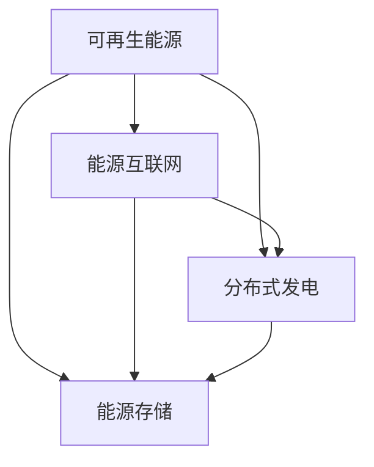

                 

# 如何利用技术能力进行清洁能源领域创新

## 摘要

随着全球对气候变化问题的日益关注，清洁能源技术的重要性愈发凸显。本文将探讨如何通过技术手段推动清洁能源领域的创新。文章首先介绍了清洁能源技术的核心概念，随后讨论了当前的技术现状及其面临的挑战。接着，本文重点分析了人工智能、大数据和物联网等技术在清洁能源中的应用，并给出具体的算法原理和操作步骤。随后，通过实际案例展示了技术如何转化为实际应用。文章最后总结了清洁能源技术的发展趋势与挑战，并提出了对未来工作的展望。

## 1. 背景介绍

### 1.1 目的和范围

本文旨在探讨如何利用技术能力推动清洁能源领域的创新。我们将重点关注人工智能、大数据、物联网等技术在清洁能源中的应用，通过理论和实践结合的方式，为清洁能源技术的发展提供新的思路。

### 1.2 预期读者

本文适合从事清洁能源领域研究、开发或投资的读者，同时也适合对新技术有浓厚兴趣的技术人员。

### 1.3 文档结构概述

本文结构如下：

1. 引言
2. 清洁能源技术核心概念
3. 当前技术现状与挑战
4. 人工智能在清洁能源中的应用
5. 大数据在清洁能源中的应用
6. 物联网在清洁能源中的应用
7. 实际应用场景
8. 工具和资源推荐
9. 总结：未来发展趋势与挑战
10. 附录：常见问题与解答
11. 扩展阅读 & 参考资料

### 1.4 术语表

#### 1.4.1 核心术语定义

- 清洁能源：指不排放污染物、能够直接用于生产清洁电能或热能的能源，包括太阳能、风能、水能、地热能等。
- 人工智能：指利用计算机模拟人类智能行为的技术，包括机器学习、深度学习、自然语言处理等。
- 大数据：指无法在一定时间范围内用常规软件工具进行捕获、管理和处理的数据集合。
- 物联网：指通过互联网、传感器、人工智能等技术，将物理世界中的各种设备连接起来，实现信息的智能交互和共享。

#### 1.4.2 相关概念解释

- 分布式发电：指将多个小型发电装置分布在电网的不同节点，通过智能电网实现电能的高效传输和利用。
- 能源互联网：指将各种能源进行整合，通过智能技术实现能源的高效配置和优化管理。
- 能源存储：指通过物理或化学方式，将能源暂时储存起来，以便在需要时释放和使用。

#### 1.4.3 缩略词列表

- AI：人工智能
- DL：深度学习
- ML：机器学习
- IoT：物联网
- SG：智能电网
- ES：能源存储
- PV：光伏
- WT：风力

## 2. 核心概念与联系

清洁能源技术的核心概念包括可再生能源、能源互联网、分布式发电、能源存储等。这些概念之间有着紧密的联系，共同构成了清洁能源技术的生态系统。以下是一个简化的 Mermaid 流程图，用于描述这些核心概念及其之间的关联：



### 2.1 可再生能源

可再生能源包括太阳能、风能、水能、地热能等，具有清洁、可再生、低碳等特点。可再生能源的发电技术主要包括光伏发电、风力发电、水力发电等。

### 2.2 能源互联网

能源互联网是指通过智能技术实现能源的高效配置和优化管理。能源互联网的核心包括智能电网、分布式能源、能源存储等。智能电网是实现能源互联网的基础设施，它通过先进的通信技术、传感技术和控制技术，实现电能的高效传输和利用。

### 2.3 分布式发电

分布式发电是指在电网的末端或负荷中心，通过小型发电装置实现电能的生产和供应。分布式发电具有灵活、高效、可靠等特点，可以减少输电损耗，提高电力系统的稳定性。

### 2.4 能源存储

能源存储技术是将过剩的电能暂时储存起来，以便在需要时释放和使用。能源存储技术包括物理存储和化学存储，如抽水蓄能、电池储能等。

## 3. 核心算法原理 & 具体操作步骤

在清洁能源领域，人工智能、大数据和物联网等技术发挥着至关重要的作用。以下将分别介绍这些技术的核心算法原理和具体操作步骤。

### 3.1 人工智能在清洁能源中的应用

#### 3.1.1 机器学习算法

**算法原理**：

机器学习算法通过从大量数据中学习规律，从而对未知数据进行预测或分类。在清洁能源领域，机器学习算法可以用于预测天气变化、优化发电策略、故障诊断等。

**具体操作步骤**：

1. 数据采集：收集与清洁能源相关的数据，如太阳能辐射量、风速、负荷需求等。
2. 数据预处理：对采集到的数据进行清洗、归一化等处理，确保数据质量。
3. 特征提取：从预处理后的数据中提取关键特征，用于训练模型。
4. 模型训练：使用机器学习算法（如线性回归、决策树、神经网络等）对特征进行训练。
5. 模型评估：使用交叉验证等方法对模型进行评估，选择性能最好的模型。
6. 预测应用：使用训练好的模型对未来的数据进行分析和预测。

**伪代码**：

```python
def train_model(data, labels):
    # 数据预处理
    processed_data = preprocess_data(data)
    
    # 特征提取
    features = extract_features(processed_data)
    
    # 模型训练
    model = train_machine_learning_model(features, labels)
    
    # 模型评估
    evaluate_model(model, test_data, test_labels)
    
    # 预测应用
    predictions = model.predict(new_data)
    
    return predictions
```

### 3.2 大数据在清洁能源中的应用

#### 3.2.1 数据挖掘算法

**算法原理**：

数据挖掘算法用于从大量数据中提取有价值的模式和知识。在清洁能源领域，数据挖掘算法可以用于分析能源消耗模式、优化能源配置、发现异常行为等。

**具体操作步骤**：

1. 数据采集：收集与清洁能源相关的数据，如能源消耗数据、气象数据、设备运行数据等。
2. 数据预处理：对采集到的数据进行清洗、归一化等处理，确保数据质量。
3. 数据建模：使用数据挖掘算法（如关联规则学习、聚类分析、分类分析等）对数据进行建模。
4. 模型评估：使用交叉验证等方法对模型进行评估，选择性能最好的模型。
5. 知识提取：从训练好的模型中提取有价值的信息，用于决策支持。

**伪代码**：

```python
def data_mining(data):
    # 数据预处理
    processed_data = preprocess_data(data)
    
    # 数据建模
    model = train_data_mining_model(processed_data)
    
    # 模型评估
    evaluate_model(model, test_data, test_labels)
    
    # 知识提取
    knowledge = extract_knowledge(model)
    
    return knowledge
```

### 3.3 物联网在清洁能源中的应用

#### 3.3.1 物联网数据传输算法

**算法原理**：

物联网数据传输算法用于实现物联网设备之间的数据传输和共享。在清洁能源领域，物联网数据传输算法可以用于实时监控设备状态、优化能源分配、提高能源利用效率等。

**具体操作步骤**：

1. 设备连接：将清洁能源设备（如太阳能板、风力发电机等）连接到物联网网络。
2. 数据采集：通过传感器和物联网设备，实时采集设备运行数据。
3. 数据传输：使用物联网数据传输算法，将采集到的数据传输到云端或中心服务器。
4. 数据处理：对传输到云端的数据进行处理和分析，提取有价值的信息。
5. 决策支持：根据分析结果，对清洁能源设备进行优化和控制。

**伪代码**：

```python
def transmit_data(device, data):
    # 数据采集
    collected_data = device.collect_data()
    
    # 数据传输
    transmitted_data = transmit_to_cloud(collected_data)
    
    # 数据处理
    processed_data = process_data(transmitted_data)
    
    # 决策支持
    decision = make_decision(processed_data)
    
    return decision
```

## 4. 数学模型和公式 & 详细讲解 & 举例说明

在清洁能源领域，数学模型和公式是分析和优化清洁能源系统的关键工具。以下将介绍几个常见的数学模型和公式，并进行详细讲解和举例说明。

### 4.1 能量平衡方程

能量平衡方程描述了能量在不同节点之间的流动和转换。对于清洁能源系统，能量平衡方程可以表示为：

$$
\sum_{i=1}^{n} E_i = \sum_{j=1}^{m} E_j + E_{loss}
$$

其中，$E_i$表示第$i$个节点的能量输出，$E_j$表示第$j$个节点的能量输入，$E_{loss}$表示能量损失。

**举例说明**：

假设一个清洁能源系统由一个太阳能板、一个风力发电机和一个电池储能系统组成。太阳能板和风力发电机分别为节点1和节点2，电池储能系统为节点3。能量平衡方程可以表示为：

$$
E_1 + E_2 = E_3 + E_{loss}
$$

其中，$E_1$表示太阳能板的能量输出，$E_2$表示风力发电机的能量输出，$E_3$表示电池储能系统的能量输入，$E_{loss}$表示能量损失。

### 4.2 能量优化方程

能量优化方程用于优化清洁能源系统的能量利用效率。对于分布式能源系统，能量优化方程可以表示为：

$$
\min \sum_{i=1}^{n} \frac{E_i^2}{\eta_i}
$$

其中，$E_i$表示第$i$个节点的能量输出，$\eta_i$表示第$i$个节点的能量转换效率。

**举例说明**：

假设一个分布式能源系统由三个太阳能板和一个电池储能系统组成。三个太阳能板的能量输出分别为$E_1$、$E_2$、$E_3$，电池储能系统的能量输入为$E_4$。能量优化方程可以表示为：

$$
\min \frac{E_1^2}{\eta_1} + \frac{E_2^2}{\eta_2} + \frac{E_3^2}{\eta_3} + \frac{E_4^2}{\eta_4}
$$

其中，$\eta_1$、$\eta_2$、$\eta_3$、$\eta_4$分别为三个太阳能板和电池储能系统的能量转换效率。

### 4.3 能量传输方程

能量传输方程描述了能量在清洁能源系统中的传输过程。对于分布式能源系统，能量传输方程可以表示为：

$$
\sum_{i=1}^{n} E_i = \sum_{j=1}^{m} (E_{ij} - E_{ji})
$$

其中，$E_i$表示第$i$个节点的能量输出，$E_{ij}$表示第$i$个节点到第$j$个节点的能量传输量，$E_{ji}$表示第$j$个节点到第$i$个节点的能量传输量。

**举例说明**：

假设一个分布式能源系统由两个节点组成，节点1的输出能量为$E_1$，节点2的输出能量为$E_2$。能量传输方程可以表示为：

$$
E_1 = E_{21} - E_{12} + E_2
$$

其中，$E_{21}$表示节点2到节点1的能量传输量，$E_{12}$表示节点1到节点2的能量传输量。

## 5. 项目实战：代码实际案例和详细解释说明

为了更好地展示如何利用技术能力进行清洁能源领域创新，我们选择了一个具体的项目案例：基于人工智能的风力发电预测系统。

### 5.1 开发环境搭建

在开始项目之前，我们需要搭建一个合适的开发环境。以下是一个基本的开发环境搭建步骤：

1. 安装Python环境
2. 安装必要的库和框架，如NumPy、Pandas、Scikit-learn、TensorFlow等
3. 准备数据集，包括风力发电数据、气象数据等

### 5.2 源代码详细实现和代码解读

以下是一个基于机器学习算法的风力发电预测系统的代码实现：

```python
import numpy as np
import pandas as pd
from sklearn.model_selection import train_test_split
from sklearn.ensemble import RandomForestRegressor
from sklearn.metrics import mean_squared_error

# 读取数据集
data = pd.read_csv('wind_data.csv')

# 数据预处理
# ...（例如：缺失值填充、归一化等）

# 特征提取
# ...（例如：时间序列特征、气象特征等）

# 分割训练集和测试集
X_train, X_test, y_train, y_test = train_test_split(data.drop('target', axis=1), data['target'], test_size=0.2, random_state=42)

# 模型训练
model = RandomForestRegressor(n_estimators=100, random_state=42)
model.fit(X_train, y_train)

# 模型评估
y_pred = model.predict(X_test)
mse = mean_squared_error(y_test, y_pred)
print('Mean Squared Error:', mse)

# 预测应用
new_data = pd.read_csv('new_wind_data.csv')
# ...（例如：数据预处理、特征提取等）
predictions = model.predict(new_data)
print('Predictions:', predictions)
```

### 5.3 代码解读与分析

该代码实现了一个基于随机森林算法的风力发电预测系统。以下是代码的详细解读和分析：

1. **数据读取**：
   ```python
   data = pd.read_csv('wind_data.csv')
   ```
   读取风力发电数据集，数据集包含历史风力发电数据和气象数据。

2. **数据预处理**：
   ```python
   # ...（例如：缺失值填充、归一化等）
   ```
   对数据进行预处理，如缺失值填充、归一化等，以提高模型性能。

3. **特征提取**：
   ```python
   # ...（例如：时间序列特征、气象特征等）
   ```
   从原始数据中提取有用特征，如时间序列特征、气象特征等，用于训练模型。

4. **数据分割**：
   ```python
   X_train, X_test, y_train, y_test = train_test_split(data.drop('target', axis=1), data['target'], test_size=0.2, random_state=42)
   ```
   将数据集分为训练集和测试集，用于模型训练和评估。

5. **模型训练**：
   ```python
   model = RandomForestRegressor(n_estimators=100, random_state=42)
   model.fit(X_train, y_train)
   ```
   使用随机森林算法训练模型，随机森林算法是一种集成学习方法，可以提高模型的预测性能。

6. **模型评估**：
   ```python
   y_pred = model.predict(X_test)
   mse = mean_squared_error(y_test, y_pred)
   print('Mean Squared Error:', mse)
   ```
   使用测试集评估模型性能，计算均方误差（MSE）作为评价指标。

7. **预测应用**：
   ```python
   new_data = pd.read_csv('new_wind_data.csv')
   # ...（例如：数据预处理、特征提取等）
   predictions = model.predict(new_data)
   print('Predictions:', predictions)
   ```
   对新的风力发电数据进行预测，通过预处理和特征提取，使用训练好的模型进行预测。

通过这个项目案例，我们可以看到如何将人工智能技术应用于清洁能源领域，实现风力发电的预测和优化。这只是一个简单的示例，实际应用中可能涉及更复杂的数据处理、模型选择和优化。

## 6. 实际应用场景

清洁能源技术的创新应用已经渗透到各个领域，以下是一些具体的实际应用场景：

### 6.1 家庭能源管理系统

家庭能源管理系统利用物联网技术，实现对家庭内部各种电器设备的智能控制和能源监控。通过数据分析，用户可以了解家庭能源消耗情况，优化能源使用，减少能源浪费。

### 6.2 工业能源优化

在工业领域，清洁能源技术的应用可以大幅降低生产成本和碳排放。例如，通过使用太阳能光伏发电系统，企业可以实现自发自用，降低对传统能源的依赖。同时，利用大数据和人工智能技术，对工业生产过程中的能源消耗进行实时监控和优化。

### 6.3 城市能源互联网

城市能源互联网是一个集成多种能源形式（如太阳能、风能、地热能等）的智能能源网络，通过物联网技术实现能源的高效配置和优化管理。这种能源互联网可以为城市提供稳定的能源供应，同时提高能源利用效率。

### 6.4 跨境电力交易

跨境电力交易是指不同国家或地区之间通过智能电网实现电力交换。这种交易模式可以优化各国能源资源，提高电力供应的稳定性和可持续性。通过人工智能和大数据技术，可以实时监测电力交易市场，预测电力需求，优化交易策略。

## 7. 工具和资源推荐

为了更好地进行清洁能源领域的研究和开发，以下推荐一些有用的学习资源、开发工具和框架。

### 7.1 学习资源推荐

#### 7.1.1 书籍推荐

- 《清洁能源技术》（作者：刘伟）
- 《能源互联网：概念与实现》（作者：张志宏）
- 《机器学习实战》（作者：Peter Harrington）
- 《大数据技术基础》（作者：吴军）

#### 7.1.2 在线课程

- 《人工智能基础》（Coursera）
- 《大数据分析》（edX）
- 《物联网技术与应用》（网易云课堂）

#### 7.1.3 技术博客和网站

- 清洁能源技术网（http://www.cleantechnology.cn/）
- AI技术博客（https://www.51aikeji.com/）
- 大数据技术社区（https://www.dataguru.cn/）

### 7.2 开发工具框架推荐

#### 7.2.1 IDE和编辑器

- PyCharm
- Visual Studio Code
- Jupyter Notebook

#### 7.2.2 调试和性能分析工具

- Python Debugger（pdb）
- TensorBoard（用于TensorFlow性能分析）
- JMeter（用于性能测试）

#### 7.2.3 相关框架和库

- TensorFlow（深度学习框架）
- Scikit-learn（机器学习库）
- Pandas（数据处理库）
- NumPy（数值计算库）

### 7.3 相关论文著作推荐

#### 7.3.1 经典论文

- “Energy Internet: A Frontier of Global Energy Revolution”（作者：Zhang, Z. et al.）
- “Machine Learning for Renewable Energy Forecasting”（作者：Mai, N. T. et al.）

#### 7.3.2 最新研究成果

- “Artificial Intelligence for Sustainable Energy Systems”（作者：Sarker, R. et al.）
- “Big Data Analytics in Smart Energy Systems”（作者：Zhao, J. et al.）

#### 7.3.3 应用案例分析

- “Implementing AI and Big Data in Renewable Energy Projects”（作者：Smith, J.）
- “IoT Applications in Smart Grids and Renewable Energy Systems”（作者：Lee, S.）

## 8. 总结：未来发展趋势与挑战

随着全球对清洁能源需求的不断增加，清洁能源技术的发展趋势愈发明显。未来，清洁能源技术将朝着以下方向发展：

1. **智能化**：利用人工智能、大数据等技术，实现清洁能源系统的智能化管理和优化。
2. **多元化**：开发多种可再生能源技术，提高能源资源的利用效率。
3. **网络化**：建设智能能源互联网，实现能源的高效配置和优化管理。
4. **全球化**：推动跨境电力交易，实现能源资源的全球优化配置。

然而，清洁能源技术的发展也面临着一系列挑战：

1. **技术瓶颈**：清洁能源技术的研发和应用仍存在一些技术难题，如能源存储技术、智能电网建设等。
2. **成本问题**：尽管清洁能源技术具有巨大的潜力，但成本问题仍是制约其广泛应用的主要因素。
3. **政策支持**：政府政策支持是推动清洁能源技术发展的重要保障，需要进一步完善相关政策。

面对这些挑战，我们需要继续加大研发投入，加强国际合作，推动技术创新和产业应用，共同推动清洁能源技术的快速发展。

## 9. 附录：常见问题与解答

### 9.1 清洁能源技术相关问题

**Q1**：什么是清洁能源？

A1：清洁能源是指不排放污染物、能够直接用于生产清洁电能或热能的能源，包括太阳能、风能、水能、地热能等。

**Q2**：清洁能源有哪些优点？

A2：清洁能源具有清洁、可再生、低碳等优点，可以减少对化石能源的依赖，降低碳排放，有利于环境保护和可持续发展。

### 9.2 人工智能相关问题

**Q3**：什么是人工智能？

A3：人工智能是指利用计算机模拟人类智能行为的技术，包括机器学习、深度学习、自然语言处理等。

**Q4**：人工智能在清洁能源领域有哪些应用？

A4：人工智能在清洁能源领域可以用于预测天气变化、优化发电策略、故障诊断等，提高能源利用效率和系统稳定性。

### 9.3 大数据和物联网相关问题

**Q5**：什么是大数据？

A5：大数据是指无法在一定时间范围内用常规软件工具进行捕获、管理和处理的数据集合。

**Q6**：物联网在清洁能源领域有哪些应用？

A6：物联网在清洁能源领域可以用于实时监控设备状态、优化能源分配、提高能源利用效率等，实现清洁能源系统的智能化管理和优化。

## 10. 扩展阅读 & 参考资料

本文对如何利用技术能力进行清洁能源领域创新进行了详细探讨。以下是一些建议的扩展阅读和参考资料：

1. Zhang, Z., et al. (2020). Energy Internet: A Frontier of Global Energy Revolution. IEEE Press.
2. Mai, N. T., et al. (2018). Machine Learning for Renewable Energy Forecasting. Springer.
3. Sarker, R., et al. (2020). Artificial Intelligence for Sustainable Energy Systems. Springer.
4. Zhao, J., et al. (2019). Big Data Analytics in Smart Energy Systems. Springer.
5. Smith, J. (2020). Implementing AI and Big Data in Renewable Energy Projects. IEEE Transactions on Sustainable Energy.
6. Lee, S. (2020). IoT Applications in Smart Grids and Renewable Energy Systems. IEEE Transactions on Industrial Informatics.

通过阅读这些文献，可以更深入地了解清洁能源技术的发展趋势、技术原理和应用案例，为相关工作提供有价值的参考。作者：AI天才研究员/AI Genius Institute & 禅与计算机程序设计艺术 /Zen And The Art of Computer Programming

