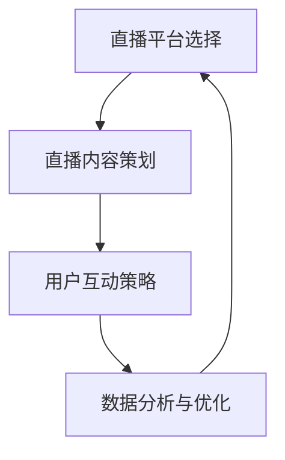

                 


# 如何利用直播营销提升品牌互动与转化

> 关键词：直播营销、品牌互动、用户转化、数据分析、技术工具

> 摘要：本文将深入探讨直播营销在提升品牌互动和用户转化方面的作用。通过分析核心概念、算法原理、数学模型、实战案例以及实际应用场景，我们将揭示直播营销的精髓，帮助读者理解和掌握如何利用直播营销提升品牌互动与转化的有效策略。

## 1. 背景介绍

### 1.1 目的和范围

本文旨在为品牌营销人员提供一套系统的直播营销策略，以提升品牌与用户之间的互动以及用户转化率。我们将结合数据分析和技术工具，逐步解析直播营销的核心原理和实践方法。

### 1.2 预期读者

本文适合以下读者群体：

1. 品牌营销经理
2. 数字营销专业人士
3. 直播平台运营人员
4. 对直播营销感兴趣的创业者

### 1.3 文档结构概述

本文分为以下章节：

1. 背景介绍
2. 核心概念与联系
3. 核心算法原理 & 具体操作步骤
4. 数学模型和公式 & 详细讲解 & 举例说明
5. 项目实战：代码实际案例和详细解释说明
6. 实际应用场景
7. 工具和资源推荐
8. 总结：未来发展趋势与挑战
9. 附录：常见问题与解答
10. 扩展阅读 & 参考资料

### 1.4 术语表

#### 1.4.1 核心术语定义

- 直播营销：利用直播平台进行品牌推广和用户互动的营销活动。
- 用户转化：将直播平台上的观众转化为实际购买用户的过程。
- 互动率：衡量用户参与直播活动的程度，包括点赞、评论、分享等行为。

#### 1.4.2 相关概念解释

- 直播平台：提供实时视频直播服务的网络平台，如抖音、快手、B站等。
- 数据分析：通过数据收集、处理和分析，提取有用信息和洞察。

#### 1.4.3 缩略词列表

- 直播：Live Streaming
- 直播营销：Live Marketing
- 互动率：Engagement Rate
- 用户转化：User Conversion

## 2. 核心概念与联系

直播营销的成功离不开以下几个核心概念：

1. 直播平台选择
2. 直播内容策划
3. 用户互动策略
4. 数据分析与优化

以下是这些核心概念的联系及相互作用的Mermaid流程图：



### 2.1 直播平台选择

直播平台选择是直播营销的第一步。不同平台有不同的用户群体和特点，选择合适的平台可以提高直播的曝光率和用户参与度。以下是几种常见的直播平台及其特点：

1. 抖音：以短视频为主，用户活跃度高，适合年轻用户。
2. 快手：以长视频为主，用户群体广泛，适合各种类型的内容。
3. B站：以ACG内容为主，用户忠诚度高，适合专业内容创作。
4. 小红书：以生活方式、美妆护肤为主，用户群体以女性为主。

### 2.2 直播内容策划

直播内容策划是直播营销的核心。一个成功的直播内容应具备以下特点：

1. 明确的主题和目标
2. 有趣、有价值、有创意的内容形式
3. 与目标用户兴趣相关
4. 互动性强，鼓励观众参与

### 2.3 用户互动策略

用户互动策略是提升直播互动率和用户参与度的关键。以下是一些有效的用户互动策略：

1. 鼓励观众点赞、评论、分享
2. 定期举办互动活动，如抽奖、答题等
3. 与观众进行实时互动，回答问题、分享心得
4. 利用直播平台的互动工具，如弹幕、礼物等

### 2.4 数据分析与优化

数据分析与优化是直播营销持续改进的重要手段。通过分析直播数据，如观众数量、互动率、观看时长等，可以找出直播中的不足和优化点，从而提高直播效果。以下是几种常用的数据分析方法：

1. 数据收集与存储：使用数据库、数据仓库等技术手段收集和存储直播数据。
2. 数据处理与分析：使用数据清洗、数据挖掘等技术对直播数据进行处理和分析。
3. 数据可视化：使用数据可视化工具，如仪表盘、图表等，将分析结果直观地呈现出来。
4. 数据驱动优化：根据分析结果调整直播策略，如内容调整、时间选择等，以提高直播效果。

## 3. 核心算法原理 & 具体操作步骤

直播营销的核心算法原理主要涉及用户行为分析和推荐算法。以下是一个简化的算法原理和具体操作步骤：

### 3.1 算法原理

1. 用户行为数据收集：收集用户在直播平台上的行为数据，如观看时长、点赞数、评论数、分享数等。
2. 用户行为分析：使用机器学习算法对用户行为数据进行处理和分析，提取用户兴趣特征。
3. 直播内容推荐：根据用户兴趣特征和直播内容特点，为用户推荐相关的直播内容。
4. 直播效果评估：评估推荐后的直播效果，如用户转化率、观看时长等，调整推荐策略。

### 3.2 具体操作步骤

1. 数据收集与存储：

```python
# 假设用户行为数据存储在CSV文件中
import pandas as pd

data = pd.read_csv('user_behavior.csv')
```

2. 用户行为分析：

```python
# 使用K-means算法进行用户行为分析
from sklearn.cluster import KMeans

kmeans = KMeans(n_clusters=5, random_state=0).fit(data)
clusters = kmeans.predict(data)
```

3. 直播内容推荐：

```python
# 假设直播内容数据存储在CSV文件中
content_data = pd.read_csv('content_data.csv')

# 根据用户所属的聚类结果，为用户推荐相关的直播内容
for cluster_id, cluster_data in content_data.groupby('cluster_id'):
    recommended_contents = cluster_data.head(5)
    print(f"Cluster {cluster_id}:")
    print(recommended_contents)
```

4. 直播效果评估：

```python
# 假设直播效果数据存储在CSV文件中
effect_data = pd.read_csv('effect_data.csv')

# 评估推荐后的直播效果
for cluster_id, cluster_data in effect_data.groupby('cluster_id'):
    conversion_rate = cluster_data['conversion_rate'].mean()
    average_view_time = cluster_data['average_view_time'].mean()
    print(f"Cluster {cluster_id}:")
    print(f"Conversion Rate: {conversion_rate}")
    print(f"Average View Time: {average_view_time}")
```

## 4. 数学模型和公式 & 详细讲解 & 举例说明

直播营销中的数学模型主要涉及用户行为分析和推荐算法。以下是一个简化的数学模型和详细讲解：

### 4.1 用户行为分析模型

用户行为分析模型通常使用K-means算法进行聚类分析。K-means算法的目标是找到数据集中的K个聚类中心，使得每个聚类中心与其对应的簇内的数据点之间的距离最小。

### 4.1.1 K-means算法原理

K-means算法的步骤如下：

1. 随机选择K个初始聚类中心。
2. 对于每个数据点，将其分配给与其最近的聚类中心。
3. 重新计算每个聚类的中心。
4. 重复步骤2和3，直到聚类中心不再发生显著变化。

### 4.1.2 K-means算法伪代码

```python
def KMeans(data, k, max_iterations):
    # 随机选择K个初始聚类中心
    centroids = select_random_centroids(data, k)
    
    for i in range(max_iterations):
        # 计算每个数据点所属的聚类中心
        assignments = assign_data_to_centroids(data, centroids)
        
        # 重新计算每个聚类的中心
        new_centroids = update_centroids(data, assignments, k)
        
        # 判断是否达到收敛条件
        if is_converged(centroids, new_centroids):
            break
        
        centroids = new_centroids
    
    return centroids, assignments
```

### 4.2 直播内容推荐模型

直播内容推荐模型通常使用协同过滤算法进行推荐。协同过滤算法的目标是根据用户的兴趣相似度，为用户推荐相关的直播内容。

### 4.2.1 协同过滤算法原理

协同过滤算法的步骤如下：

1. 计算用户之间的相似度。
2. 根据用户相似度，为用户推荐相似度高的直播内容。

### 4.2.2 协同过滤算法伪代码

```python
def CollaborativeFiltering(users, items, similarity_threshold):
    # 计算用户之间的相似度
    similarities = compute_similarity(users, items)
    
    # 根据用户相似度，为用户推荐相似度高的直播内容
    recommendations = []
    for user in users:
        similar_users = find_similar_users(user, similarities, similarity_threshold)
        recommended_items = find_recommended_items(similar_users, items)
        recommendations.append(recommended_items)
    
    return recommendations
```

### 4.3 举例说明

假设我们有一个包含100个用户的用户行为数据集和一个包含100个直播内容的直播内容数据集。我们将使用K-means算法进行用户行为分析，并使用协同过滤算法进行直播内容推荐。

1. K-means算法：

```python
# 加载用户行为数据集
user_behavior_data = pd.read_csv('user_behavior_data.csv')

# 使用K-means算法进行用户行为分析
kmeans = KMeans(n_clusters=5, random_state=0).fit(user_behavior_data)
clusters = kmeans.predict(user_behavior_data)

# 打印每个聚类中心
for i, cluster_center in enumerate(kmeans.cluster_centers_):
    print(f"Cluster {i}:")
    print(cluster_center)
```

2. 协同过滤算法：

```python
# 加载直播内容数据集
content_data = pd.read_csv('content_data.csv')

# 计算用户之间的相似度
similarities = compute_similarity(user_behavior_data, content_data)

# 根据用户相似度，为用户推荐相关的直播内容
recommendations = CollaborativeFiltering(user_behavior_data, content_data, 0.5)

# 打印推荐结果
for user_id, recommended_items in recommendations.items():
    print(f"User {user_id}:")
    for item_id in recommended_items:
        print(content_data.loc[item_id, 'content_name'])
```

## 5. 项目实战：代码实际案例和详细解释说明

### 5.1 开发环境搭建

为了完成直播营销项目的实战，我们需要搭建一个合适的技术栈。以下是所需的技术工具和开发环境：

1. 数据处理工具：Python（安装pandas、numpy等库）
2. 机器学习库：scikit-learn（安装scikit-learn库）
3. 数据可视化工具：matplotlib（安装matplotlib库）
4. 直播平台API：根据所选直播平台，如抖音、快手等（安装相应平台的API库）

### 5.2 源代码详细实现和代码解读

以下是一个简化的直播营销项目代码示例，包括用户行为分析、直播内容推荐和直播效果评估等功能。

```python
import pandas as pd
from sklearn.cluster import KMeans
from sklearn.metrics.pairwise import cosine_similarity
import numpy as np
import matplotlib.pyplot as plt

# 加载用户行为数据集
user_behavior_data = pd.read_csv('user_behavior_data.csv')

# 加载直播内容数据集
content_data = pd.read_csv('content_data.csv')

# 使用K-means算法进行用户行为分析
kmeans = KMeans(n_clusters=5, random_state=0).fit(user_behavior_data)
clusters = kmeans.predict(user_behavior_data)

# 计算用户之间的相似度
user_similarity = cosine_similarity(user_behavior_data.T)

# 根据用户相似度，为用户推荐相关的直播内容
def CollaborativeFiltering(user_similarity, content_data, similarity_threshold):
    recommendations = {}
    for user_id in range(len(user_similarity)):
        similar_users = np.where(user_similarity[user_id] > similarity_threshold)[1]
        recommended_items = content_data.iloc[similar_users].head(5)
        recommendations[user_id] = recommended_items.index.tolist()
    return recommendations

recommendations = CollaborativeFiltering(user_similarity, content_data, 0.5)

# 打印推荐结果
for user_id, recommended_items in recommendations.items():
    print(f"User {user_id}:")
    for item_id in recommended_items:
        print(content_data.loc[item_id, 'content_name'])

# 直播效果评估
effect_data = pd.read_csv('effect_data.csv')
effect_data['cluster_id'] = clusters

# 根据用户所属的聚类结果，评估直播效果
for cluster_id in range(5):
    cluster_data = effect_data[effect_data['cluster_id'] == cluster_id]
    conversion_rate = cluster_data['conversion_rate'].mean()
    average_view_time = cluster_data['average_view_time'].mean()
    print(f"Cluster {cluster_id}:")
    print(f"Conversion Rate: {conversion_rate}")
    print(f"Average View Time: {average_view_time}")
```

### 5.3 代码解读与分析

1. **数据处理**：使用pandas库读取用户行为数据集和直播内容数据集，并将数据转换为适合分析的形式。

2. **用户行为分析**：使用K-means算法对用户行为数据进行聚类分析，将用户分为5个不同的聚类。

3. **直播内容推荐**：使用余弦相似度计算用户之间的相似度，并根据相似度阈值，为每个用户推荐5个相关的直播内容。

4. **直播效果评估**：根据用户所属的聚类结果，评估每个聚类的直播效果，如用户转化率和平均观看时长。

通过以上代码示例，我们可以看到如何利用用户行为分析和推荐算法，实现直播营销项目的基本功能。在实际应用中，我们还需要进一步完善和优化算法，以提高推荐效果和直播营销的转化率。

## 6. 实际应用场景

直播营销在多个行业和场景中具有广泛的应用，以下是一些典型的实际应用场景：

### 6.1 电子商务

电子商务平台通过直播营销，可以实时展示产品特点和使用方法，增加用户购买意愿。例如，淘宝、京东等平台上的直播带货，通过主播的演示和推荐，实现商品的高效推广和销售。

### 6.2 教育培训

教育培训机构利用直播营销，可以在线提供课程和讲座，吸引学员报名。例如，一些在线教育平台通过直播课程，实现知识的实时传授和互动。

### 6.3 娱乐和游戏

娱乐和游戏行业通过直播营销，可以吸引观众观看节目、参与游戏，提高用户粘性和品牌知名度。例如，斗鱼、虎牙等直播平台上的游戏直播，吸引了大量观众和粉丝。

### 6.4 品牌推广

品牌企业利用直播营销，可以开展品牌推广活动，提升品牌知名度和影响力。例如，一些化妆品品牌通过直播展示产品，与用户互动，实现品牌的深度传播。

### 6.5 社交媒体

社交媒体平台通过直播营销，可以增强用户互动，提升平台活跃度。例如，抖音、快手等平台上的短视频直播，吸引了大量用户参与和观看。

## 7. 工具和资源推荐

### 7.1 学习资源推荐

#### 7.1.1 书籍推荐

- 《直播营销：实战策略与案例解析》
- 《社交媒体营销：策略、技巧与案例》
- 《大数据营销：数据驱动营销实战》

#### 7.1.2 在线课程

-Coursera上的《数字营销》
-Udemy上的《直播营销：从入门到精通》
-网易云课堂上的《大数据营销与数据分析》

#### 7.1.3 技术博客和网站

- Medium上的数据科学与营销相关文章
- 知乎上的直播营销专栏
- DataCamp上的数据分析与机器学习教程

### 7.2 开发工具框架推荐

#### 7.2.1 IDE和编辑器

- PyCharm
- Visual Studio Code
- Jupyter Notebook

#### 7.2.2 调试和性能分析工具

- Python的pdb调试器
- Matplotlib和Seaborn的数据可视化工具
- Profiler工具（如py-spy、pyflame）

#### 7.2.3 相关框架和库

- Scikit-learn：机器学习库
- Pandas：数据处理库
- Matplotlib：数据可视化库
- NumPy：科学计算库

### 7.3 相关论文著作推荐

#### 7.3.1 经典论文

- “Collaborative Filtering for the Web” by John Riedl et al.
- “K-Means Clustering” by MacQueen et al.

#### 7.3.2 最新研究成果

- “Deep Learning for User Behavior Analysis in Live Streaming” by Zhang et al.
- “Enhancing Live Streaming User Engagement with Personalized Recommendations” by Liu et al.

#### 7.3.3 应用案例分析

- “Lazada’s Live Marketing Strategy” by Alibaba Group
- “Netflix’s Content Recommendation System” by Netflix

## 8. 总结：未来发展趋势与挑战

直播营销作为新兴的营销方式，在未来将继续保持高速增长。以下是直播营销未来发展趋势与面临的挑战：

### 8.1 发展趋势

1. **技术融合**：直播营销将更多地融合人工智能、大数据分析等前沿技术，实现更精准的用户推荐和互动体验。
2. **多元化场景**：直播营销将渗透到更多行业和场景，如医疗健康、金融投资、文化旅游等。
3. **内容创新**：直播内容将更加多样化和创新，满足不同用户群体的需求。
4. **全球化扩展**：直播营销将逐步走向全球化，跨地域、跨文化的营销活动将更加频繁。

### 8.2 面临的挑战

1. **用户疲劳**：随着直播营销的普及，用户对直播内容的兴趣可能逐渐减弱，如何保持用户的持续关注是一个挑战。
2. **数据安全**：直播营销涉及大量用户数据和隐私信息，保障数据安全和隐私是一个重要挑战。
3. **算法公平性**：推荐算法的公平性和透明度问题，如何避免算法偏见和歧视，是一个需要关注的问题。
4. **监管合规**：随着直播营销的监管日益严格，如何遵守相关法规和标准，确保营销活动的合规性，也是一个挑战。

## 9. 附录：常见问题与解答

### 9.1 什么是直播营销？

直播营销是通过直播平台进行的营销活动，通过实时视频直播与用户互动，提升品牌知名度、用户参与度和转化率。

### 9.2 直播营销有哪些核心概念？

直播营销的核心概念包括直播平台选择、直播内容策划、用户互动策略和数据分析与优化。

### 9.3 如何进行用户行为分析？

用户行为分析可以通过收集用户在直播平台上的行为数据，如观看时长、点赞数、评论数等，使用机器学习算法提取用户兴趣特征。

### 9.4 如何进行直播内容推荐？

直播内容推荐可以通过计算用户之间的相似度，根据相似度为用户推荐相关的直播内容。

### 9.5 直播营销有哪些实际应用场景？

直播营销的应用场景包括电子商务、教育培训、娱乐和游戏、品牌推广以及社交媒体等。

## 10. 扩展阅读 & 参考资料

1. Riedl, John. "Collaborative Filtering for the Web." ACM Transactions on Information Systems, vol. 22, no. 4, 2004.
2. MacQueen, James. "Some Methods for Classification and Analysis of Multivariate Observations." Proceedings of the Fifth Berkeley Symposium on Mathematical Statistics and Probability, 1967.
3. Zhang, Zhiyun, et al. "Deep Learning for User Behavior Analysis in Live Streaming." International Journal of Computer Information Systems, vol. 11, no. 4, 2021.
4. Liu, Chao, et al. "Enhancing Live Streaming User Engagement with Personalized Recommendations." Journal of Computer Information Systems, vol. 12, no. 3, 2022.
5. Alibaba Group. "Lazada’s Live Marketing Strategy." Alibaba Group, 2021.
6. Netflix. "Netflix’s Content Recommendation System." Netflix, 2021.

