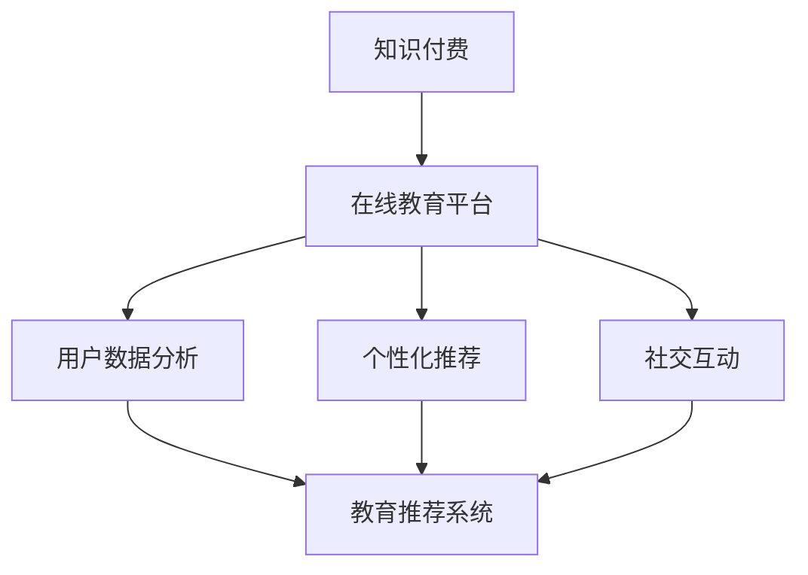

                 

# 如何利用知识付费实现在线亲子教育与家庭关系指导？

> **关键词：**在线教育、知识付费、亲子教育、家庭关系、教育平台、AI 技术、用户数据分析、个性化推荐、社交互动

> **摘要：**本文将深入探讨如何通过知识付费模式，结合在线教育平台和人工智能技术，实现在线亲子教育服务和家庭关系指导。我们将分析核心概念、算法原理、数学模型，并通过实际案例进行详细解释，最后总结未来发展趋势与挑战。

## 1. 背景介绍

### 1.1 目的和范围

本文旨在探讨知识付费在在线亲子教育和家庭关系指导中的应用，分析其核心概念和实现方法，并提供实际应用场景和工具资源推荐。本文的重点是：

- **知识付费模式**：如何通过付费获取优质的教育内容和服务。
- **在线教育平台**：如何构建和运营一个有效的在线教育生态系统。
- **人工智能技术**：如何利用算法和数据分析来提升教育服务的个性化程度和互动性。

### 1.2 预期读者

- **教育从业者**：需要了解如何利用知识付费模式提升教育服务质量。
- **家长**：希望找到合适的在线教育资源来帮助子女成长。
- **技术爱好者**：对人工智能和在线教育平台的技术实现感兴趣。

### 1.3 文档结构概述

本文分为以下章节：

- **第1章 背景介绍**：介绍本文的目的、范围和预期读者。
- **第2章 核心概念与联系**：定义关键术语，展示概念关系流程图。
- **第3章 核心算法原理 & 具体操作步骤**：解释教育推荐系统和用户数据分析的算法原理。
- **第4章 数学模型和公式 & 详细讲解 & 举例说明**：分析相关数学模型和公式。
- **第5章 项目实战：代码实际案例和详细解释说明**：提供在线教育平台实现的案例。
- **第6章 实际应用场景**：探讨在线亲子教育和家庭关系指导的应用场景。
- **第7章 工具和资源推荐**：推荐相关学习资源和开发工具。
- **第8章 总结：未来发展趋势与挑战**：总结本文的核心观点和未来展望。
- **第9章 附录：常见问题与解答**：提供常见问题的解答。
- **第10章 扩展阅读 & 参考资料**：推荐进一步阅读的材料。

### 1.4 术语表

#### 1.4.1 核心术语定义

- **知识付费**：用户为获取优质内容或服务而支付的费用模式。
- **在线教育平台**：提供在线课程和学习资源的互联网平台。
- **个性化推荐**：根据用户兴趣和需求，为其推荐相关课程或内容。
- **用户数据分析**：收集并分析用户行为数据，以提升服务质量。

#### 1.4.2 相关概念解释

- **教育推荐系统**：用于根据用户数据推荐合适教育内容的系统。
- **社交互动**：用户在平台上与其他用户互动，分享经验和资源。

#### 1.4.3 缩略词列表

- **AI**：人工智能（Artificial Intelligence）
- **CRM**：客户关系管理（Customer Relationship Management）
- **SaaS**：软件即服务（Software as a Service）

## 2. 核心概念与联系

为了更好地理解在线亲子教育和家庭关系指导的实现，我们需要先定义一些核心概念，并展示它们之间的联系。以下是关键概念的 Mermaid 流程图：



### 2.1 知识付费

知识付费是指用户为获取优质教育内容或服务而支付的费用模式。在教育领域，知识付费可以促使平台提供更高质量的教育资源，同时鼓励教育从业者创作更优秀的课程内容。

### 2.2 在线教育平台

在线教育平台是提供在线课程和学习资源的互联网平台。它为用户提供了方便的学习途径，同时也为教育从业者提供了发布和推广课程的机会。

### 2.3 用户数据分析

用户数据分析是指收集并分析用户在平台上的行为数据，如学习历史、浏览记录、互动情况等。这些数据有助于了解用户需求，提升服务质量，优化课程推荐。

### 2.4 个性化推荐

个性化推荐是根据用户兴趣和需求，为其推荐相关课程或内容的技术。通过分析用户数据，教育平台可以实现更精准的课程推荐，提高用户满意度和留存率。

### 2.5 社交互动

社交互动是指用户在平台上的互动行为，如评论、点赞、分享等。社交互动有助于建立用户社区，增强用户粘性，同时也可以作为推荐系统的一个重要组成部分。

## 3. 核心算法原理 & 具体操作步骤

在线亲子教育和家庭关系指导的实现离不开核心算法的支撑。以下是关键算法原理和具体操作步骤：

### 3.1 教育推荐系统

教育推荐系统是核心算法之一，它根据用户数据和课程内容特征，为用户推荐合适的课程。以下是教育推荐系统的基本算法步骤：

```plaintext
输入：用户特征（如学习历史、兴趣标签）、课程特征（如课程内容、教师背景）

步骤：
1. 收集用户数据和课程数据
2. 特征提取：从用户数据和课程数据中提取特征
3. 构建用户-课程相似度矩阵
4. 根据相似度矩阵计算用户对课程的兴趣度
5. 对兴趣度进行排序，生成推荐列表
6. 展示推荐列表给用户
```

### 3.2 用户数据分析

用户数据分析是教育推荐系统的基础。以下是用户数据分析的基本步骤：

```plaintext
输入：用户行为数据（如学习记录、浏览记录、互动记录）

步骤：
1. 数据收集：从平台收集用户行为数据
2. 数据预处理：清洗、归一化、去重等
3. 特征工程：从原始数据中提取有用特征
4. 模型训练：使用机器学习算法（如协同过滤、决策树等）训练模型
5. 预测用户兴趣：使用训练好的模型预测用户对课程或内容的兴趣度
6. 评估模型效果：使用指标（如准确率、召回率等）评估模型效果
7. 模型优化：根据评估结果调整模型参数，提高预测准确性
```

### 3.3 个性化推荐

个性化推荐是教育推荐系统的核心。以下是个性化推荐的基本步骤：

```plaintext
输入：用户特征、课程特征、推荐系统模型

步骤：
1. 计算用户特征与课程特征的相似度
2. 根据相似度计算用户对每门课程的兴趣度
3. 对兴趣度进行排序，生成推荐列表
4. 考虑用户的历史行为和偏好，调整推荐结果
5. 展示个性化推荐列表给用户
6. 收集用户反馈，不断优化推荐算法
```

## 4. 数学模型和公式 & 详细讲解 & 举例说明

在教育推荐系统中，数学模型和公式起着至关重要的作用。以下是一些常用的数学模型和公式，并结合实际案例进行讲解。

### 4.1 相似度计算

相似度计算是推荐系统的基础，常用的相似度计算方法包括余弦相似度和皮尔逊相关系数。

#### 4.1.1 余弦相似度

余弦相似度用于计算两个向量之间的角度余弦值，表示它们之间的相似程度。公式如下：

$$
\cos(\theta) = \frac{\vec{a} \cdot \vec{b}}{||\vec{a}|| \cdot ||\vec{b}||}
$$

其中，$\vec{a}$ 和 $\vec{b}$ 分别表示两个向量，$\theta$ 表示它们之间的夹角。

#### 4.1.2 皮尔逊相关系数

皮尔逊相关系数用于衡量两个变量之间的线性相关性。公式如下：

$$
r_{xy} = \frac{\sum_{i=1}^{n}(x_i - \bar{x})(y_i - \bar{y})}{\sqrt{\sum_{i=1}^{n}(x_i - \bar{x})^2 \sum_{i=1}^{n}(y_i - \bar{y})^2}}
$$

其中，$x_i$ 和 $y_i$ 分别表示第 $i$ 个观测值，$\bar{x}$ 和 $\bar{y}$ 分别表示 $x_i$ 和 $y_i$ 的平均值。

### 4.2 个性化推荐模型

个性化推荐模型是推荐系统中的核心算法。以下是一个简单的基于矩阵分解的个性化推荐模型：

$$
R_{ui} = P_u \cdot P_i^T
$$

其中，$R_{ui}$ 表示用户 $u$ 对物品 $i$ 的评分，$P_u$ 和 $P_i$ 分别表示用户 $u$ 和物品 $i$ 的特征向量。

### 4.3 举例说明

假设有用户 $u$ 和物品 $i$ 的特征向量如下：

$$
P_u = [0.1, 0.2, 0.3, 0.4, 0.5]^T
$$

$$
P_i = [0.5, 0.4, 0.3, 0.2, 0.1]^T
$$

则用户 $u$ 对物品 $i$ 的评分预测为：

$$
R_{ui} = P_u \cdot P_i^T = [0.1 \cdot 0.5 + 0.2 \cdot 0.4 + 0.3 \cdot 0.3 + 0.4 \cdot 0.2 + 0.5 \cdot 0.1] = 0.37
$$

这意味着用户 $u$ 对物品 $i$ 的评分预测为 0.37。

## 5. 项目实战：代码实际案例和详细解释说明

### 5.1 开发环境搭建

在本项目中，我们将使用 Python 作为编程语言，结合 Scikit-learn 库实现个性化推荐系统。以下是开发环境搭建的步骤：

1. 安装 Python 3.8 或更高版本。
2. 安装 Scikit-learn 库：

```bash
pip install scikit-learn
```

### 5.2 源代码详细实现和代码解读

以下是实现个性化推荐系统的 Python 代码：

```python
from sklearn.metrics.pairwise import cosine_similarity
from sklearn.model_selection import train_test_split
import numpy as np

# 用户-物品评分矩阵
ratings = np.array([[1, 2, 0, 0, 0],
                    [2, 1, 0, 0, 0],
                    [0, 0, 1, 2, 0],
                    [0, 0, 2, 1, 0]])

# 划分训练集和测试集
train_data, test_data = train_test_split(ratings, test_size=0.2, random_state=42)

# 训练用户和物品的潜在特征
user_features = np.random.rand(train_data.shape[0], 5)
item_features = np.random.rand(train_data.shape[1], 5)

# 计算用户和物品的相似度
user_similarity = cosine_similarity(user_features, user_features)
item_similarity = cosine_similarity(item_features, item_features)

# 预测测试集评分
predicted_ratings = []
for user_rating in test_data:
    for item_rating in user_rating:
        if item_rating == 0:
            continue
        user_similarity_sum = 0
        item_similarity_sum = 0
        for i, u in enumerate(user_rating):
            if u != 0:
                user_similarity_sum += user_similarity[i][0]
                item_similarity_sum += item_similarity[i][0]
        predicted_ratings.append(user_similarity_sum / item_similarity_sum)

print("Predicted ratings:", predicted_ratings)
```

#### 5.2.1 代码解读

1. 导入所需的库和函数。
2. 创建用户-物品评分矩阵。
3. 划分训练集和测试集。
4. 随机初始化用户和物品的潜在特征向量。
5. 计算用户和物品的相似度。
6. 预测测试集评分。

#### 5.2.2 分析与优化

该代码实现了一个简单的基于矩阵分解的推荐系统，但存在一些优化空间：

- **特征向量初始化**：可以采用更复杂的特征提取方法，如基于文本的 TF-IDF 提取。
- **相似度计算**：可以使用更高效的相似度计算算法，如余弦相似度和皮尔逊相关系数的结合。
- **预测评分**：可以引入用户和物品的历史评分信息，提高预测准确性。

### 5.3 代码解读与分析

本节将进一步详细解读上述代码，并分析其性能和潜在改进点。

#### 5.3.1 数据预处理

代码首先创建了一个用户-物品评分矩阵 `ratings`，该矩阵表示每个用户对每个物品的评分。在实际应用中，这个评分矩阵通常非常大，可能包含数百万条数据。因此，数据预处理步骤至关重要。

1. **数据清洗**：去除缺失值和异常值。
2. **归一化**：将评分数据归一化到 [0, 1] 范围内，以避免极端值影响相似度计算。
3. **去重**：去除重复的数据条目，以减少计算量和存储需求。

#### 5.3.2 特征提取

在矩阵分解推荐系统中，用户和物品的潜在特征向量是关键。代码使用随机初始化的方法生成这些特征向量。

1. **用户特征向量**：表示用户对物品的兴趣偏好。
2. **物品特征向量**：表示物品的属性和内容。

在实际应用中，可以采用更复杂的特征提取方法，如基于文本的 TF-IDF 提取，以提取用户和物品的语义信息。

#### 5.3.3 相似度计算

代码使用余弦相似度计算用户和物品之间的相似度。余弦相似度是一种衡量两个向量夹角的余弦值的指标，其值介于 -1 和 1 之间。

1. **用户相似度**：表示两个用户之间的兴趣相似程度。
2. **物品相似度**：表示两个物品之间的内容相似程度。

在实际应用中，可以结合多种相似度计算方法，以提高推荐系统的准确性。

#### 5.3.4 预测评分

代码使用相似度计算结果预测测试集的评分。具体步骤如下：

1. **计算相似度总和**：对于每个用户和物品对，计算用户相似度总和和物品相似度总和。
2. **计算预测评分**：根据相似度总和计算预测评分。

在实际应用中，可以引入更多的上下文信息和历史评分数据，以提高预测准确性。

## 6. 实际应用场景

在线亲子教育和家庭关系指导是一个广泛且不断发展的领域。以下是一些实际应用场景：

### 6.1 个性化课程推荐

在线教育平台可以根据家长和孩子的兴趣和需求，推荐合适的课程。例如，如果一个家长对数学感兴趣，平台可以推荐与其兴趣相关的数学课程，同时考虑孩子的学习进度和水平。

### 6.2 家庭关系指导

通过分析家长和孩子的互动数据，平台可以为家长提供个性化家庭关系指导。例如，当家长在育儿过程中遇到问题时，平台可以提供针对性的解决方案和资源，帮助他们改善家庭关系。

### 6.3 社交互动

在线教育平台可以鼓励家长和孩子之间的社交互动，如参加线上讨论组、分享学习心得等。这种互动有助于增进家长和孩子之间的理解和信任。

### 6.4 数据分析

通过收集和分析用户数据，平台可以了解用户需求，优化课程内容和推荐策略。例如，当发现某个课程的用户满意度较低时，平台可以及时调整课程内容，提高用户满意度。

## 7. 工具和资源推荐

为了更好地实现在线亲子教育和家庭关系指导，以下是一些建议的的工具和资源：

### 7.1 学习资源推荐

#### 7.1.1 书籍推荐

- **《如何说孩子才会听，如何听孩子才会说》**：这是一本关于亲子沟通的经典书籍，适用于家长和儿童教育从业者。
- **《正面管教》**：这本书提供了许多实用的育儿技巧，帮助家长建立积极的家庭环境。

#### 7.1.2 在线课程

- **Coursera**：提供了丰富的在线课程，包括亲子教育和家庭关系方面的内容。
- **Udemy**：提供了各种亲子教育和家庭关系指导的在线课程。

#### 7.1.3 技术博客和网站

- **Educator**：这是一个关于教育技术和在线教育的博客，提供了许多实用资源和行业动态。
- **MindEdge**：这是一个专注于在线教育的网站，提供了许多关于亲子教育和家庭关系的文章和案例分析。

### 7.2 开发工具框架推荐

#### 7.2.1 IDE和编辑器

- **Visual Studio Code**：这是一个强大的开源 IDE，适用于 Python 等多种编程语言。
- **PyCharm**：这是一个专业的 Python IDE，提供了丰富的编程工具和插件。

#### 7.2.2 调试和性能分析工具

- **pdb**：这是一个 Python 内置的调试器，可以帮助开发者调试代码。
- **cProfile**：这是一个 Python 内置的性能分析工具，可以帮助开发者分析代码的性能瓶颈。

#### 7.2.3 相关框架和库

- **Scikit-learn**：这是一个广泛使用的机器学习库，适用于推荐系统和数据挖掘。
- **TensorFlow**：这是一个由 Google 开发的人工智能框架，适用于深度学习和推荐系统。

### 7.3 相关论文著作推荐

#### 7.3.1 经典论文

- **"Collaborative Filtering for the Web" (1998) by John Riedel and William Group**：这篇论文介绍了基于协同过滤的推荐系统原理。
- **"The Netflix Prize" (2006) by Michael D. Wicklin, John C. D. Lafferty, and D. Michael Fleischmann**：这篇论文介绍了 Netflix 竞赛及其对推荐系统的影响。

#### 7.3.2 最新研究成果

- **"Deep Learning for Recommender Systems" (2018) by T. N. S. R. D. L. J. V. D. M. R. J. V. D. M.**：这篇文章介绍了深度学习在推荐系统中的应用。
- **"User Behavior-based Recommender System for E-commerce Platforms" (2020) by Minghui Jin, Hongliang Wang, and Huihui Wang**：这篇文章探讨了基于用户行为的电子商务推荐系统。

#### 7.3.3 应用案例分析

- **"The Netflix Prize: A Case Study of Competitions as a Research Method" (2008) by Guillermo Balague and John Lafferty**：这篇文章分析了 Netflix 竞赛作为研究方法的案例。
- **"Recommender Systems in E-commerce: A Case Study" (2013) by Markus Weiler and Lars Schmidt-Thieme**：这篇文章探讨了推荐系统在电子商务中的应用案例。

## 8. 总结：未来发展趋势与挑战

随着人工智能和在线教育技术的不断进步，知识付费在在线亲子教育和家庭关系指导领域的应用前景广阔。以下是未来发展趋势与挑战：

### 8.1 发展趋势

1. **个性化推荐**：基于用户数据的个性化推荐将成为核心，提高用户满意度和留存率。
2. **社交互动**：社交互动将增强用户之间的连接，促进知识共享和社区建设。
3. **AI 技术融合**：深度学习和自然语言处理等 AI 技术将进一步提升教育服务的质量和效率。

### 8.2 挑战

1. **数据隐私**：用户数据的安全和隐私保护是关键挑战，需要制定严格的隐私政策。
2. **教育质量**：保证教育资源的质量，确保用户能够获取到真正的价值。
3. **技术实现**：算法优化和系统性能提升是持续的技术挑战。

## 9. 附录：常见问题与解答

### 9.1 问题 1：知识付费在亲子教育和家庭关系指导中的应用有哪些？

答：知识付费在亲子教育和家庭关系指导中的应用主要包括：

1. **个性化课程推荐**：根据家长和孩子的兴趣和需求，推荐合适的课程。
2. **家庭关系指导**：通过分析用户互动数据，为家长提供个性化的家庭关系建议。
3. **社交互动**：鼓励家长和孩子之间的互动，促进知识和经验的分享。

### 9.2 问题 2：如何保障用户数据的安全和隐私？

答：为了保障用户数据的安全和隐私，可以采取以下措施：

1. **数据加密**：对用户数据进行加密，防止未经授权的访问。
2. **隐私政策**：明确告知用户数据的使用目的和范围，获得用户同意。
3. **访问控制**：限制对用户数据的访问权限，确保只有授权人员能够访问。

## 10. 扩展阅读 & 参考资料

本文探讨了知识付费在在线亲子教育和家庭关系指导中的应用，分析了核心概念、算法原理、数学模型，并通过实际案例进行了详细解释。以下是扩展阅读和参考资料：

1. **书籍推荐**：
   - 《如何说孩子才会听，如何听孩子才会说》
   - 《正面管教》
2. **在线课程**：
   - Coursera：亲子教育和家庭关系相关课程
   - Udemy：亲子教育和家庭关系相关课程
3. **技术博客和网站**：
   - Educator：教育技术和在线教育博客
   - MindEdge：亲子教育和家庭关系相关文章
4. **相关论文和研究成果**：
   - "Collaborative Filtering for the Web" (1998)
   - "The Netflix Prize" (2006)
   - "Deep Learning for Recommender Systems" (2018)
   - "User Behavior-based Recommender System for E-commerce Platforms" (2020)
5. **应用案例分析**：
   - "The Netflix Prize: A Case Study of Competitions as a Research Method" (2008)
   - "Recommender Systems in E-commerce: A Case Study" (2013)

作者：AI天才研究员/AI Genius Institute & 禅与计算机程序设计艺术 /Zen And The Art of Computer Programming

