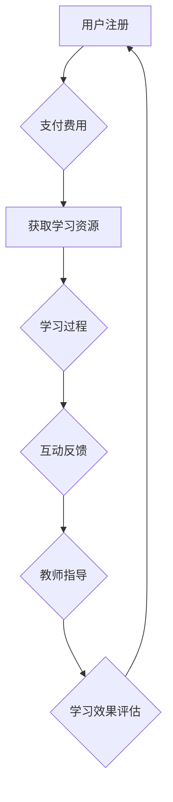

                 


# 如何利用知识付费实现在线学习与在线学习指导？

> **关键词**：知识付费、在线学习、在线指导、教育科技、学习资源、用户参与、互动性、个性化学习

> **摘要**：本文将探讨知识付费模式如何实现在线学习的有效性和用户体验的提升。通过分析知识付费的基本概念、在线学习与指导的内在联系，以及具体操作步骤，我们将深入探讨这一模式的实施细节。本文还将提供数学模型和公式来辅助理解，并通过实际项目案例进行详细讲解。最后，文章将介绍实际应用场景、推荐相关工具和资源，并总结未来发展趋势与挑战。

## 1. 背景介绍

### 1.1 目的和范围

本文旨在探讨知识付费模式在实现在线学习和在线指导中的作用。通过详细分析知识付费的现状、在线学习市场的需求以及在线指导的关键性，我们将揭示这一模式如何提高学习效果和用户体验。

### 1.2 预期读者

本文面向对在线教育和知识付费模式感兴趣的读者，包括教育工作者、学习平台开发人员、市场营销专家以及广大在线学习爱好者。

### 1.3 文档结构概述

本文分为以下章节：

- **第1章：背景介绍**
  - 1.1 目的和范围
  - 1.2 预期读者
  - 1.3 文档结构概述
  - 1.4 术语表

- **第2章：核心概念与联系**
  - 2.1 知识付费的概念
  - 2.2 在线学习与指导的原理
  - 2.3 Mermaid流程图

- **第3章：核心算法原理 & 具体操作步骤**
  - 3.1 算法原理讲解
  - 3.2 伪代码阐述

- **第4章：数学模型和公式 & 详细讲解 & 举例说明**
  - 4.1 数学模型
  - 4.2 公式讲解
  - 4.3 举例说明

- **第5章：项目实战：代码实际案例和详细解释说明**
  - 5.1 开发环境搭建
  - 5.2 源代码详细实现和代码解读
  - 5.3 代码解读与分析

- **第6章：实际应用场景**
  - 6.1 在线教育平台
  - 6.2 专业技能培训
  - 6.3 个性化学习辅导

- **第7章：工具和资源推荐**
  - 7.1 学习资源推荐
  - 7.2 开发工具框架推荐
  - 7.3 相关论文著作推荐

- **第8章：总结：未来发展趋势与挑战**
  - 8.1 发展趋势
  - 8.2 挑战与应对策略

- **第9章：附录：常见问题与解答**
  - 9.1 问题一
  - 9.2 问题二
  - 9.3 问题三

- **第10章：扩展阅读 & 参考资料**
  - 10.1 扩展阅读
  - 10.2 参考资料

### 1.4 术语表

#### 1.4.1 核心术语定义

- 知识付费：用户为了获取特定知识或技能而支付的费用。
- 在线学习：通过互联网进行的自主学习过程。
- 在线指导：专业教师在网络环境中对学习者进行个性化辅导。

#### 1.4.2 相关概念解释

- 学习资源：为学习过程提供的信息和工具，如课程、教程、视频、练习题等。
- 用户参与：用户在学习过程中积极参与、互动的行为。

#### 1.4.3 缩略词列表

- SaaS：软件即服务（Software as a Service）
- MOOC：大规模在线开放课程（Massive Open Online Course）
- AI：人工智能（Artificial Intelligence）

## 2. 核心概念与联系

### 2.1 知识付费的概念

知识付费是一种商业模式，用户为获取有价值的信息或技能而支付费用。这一模式打破了传统免费教育的界限，使得优质教育资源得到更加有效的利用和变现。

### 2.2 在线学习与指导的原理

在线学习依托互联网技术，为学习者提供灵活、便捷的学习途径。在线指导则是在线学习的重要补充，通过教师的专业知识和服务，提高学习效果。

### 2.3 Mermaid流程图



在该流程图中，用户首先注册账户，支付费用以获取学习资源。在学习过程中，用户与教师互动，获得个性化指导，并通过评估反馈学习效果，循环迭代以优化学习体验。

## 3. 核心算法原理 & 具体操作步骤

### 3.1 算法原理讲解

知识付费实现在线学习的核心算法包括用户行为分析、学习路径推荐和个性化指导。

- **用户行为分析**：通过分析用户的学习行为，如学习时间、学习内容、互动频率等，了解用户的学习需求和习惯。
- **学习路径推荐**：基于用户行为数据和知识点关联，推荐适合用户的学习路径和资源。
- **个性化指导**：教师根据学生的学习进度、能力水平和需求，提供针对性的辅导和答疑。

### 3.2 伪代码阐述

```python
# 用户行为分析
def analyze_user_behavior(user_data):
    learning_time = sum(user_data['duration'])
    content_frequency = sum(user_data['content_frequency'])
    interaction_count = sum(user_data['interaction_count'])
    return {
        'learning_time': learning_time,
        'content_frequency': content_frequency,
        'interaction_count': interaction_count
    }

# 学习路径推荐
def recommend_learning_path(user_behavior, knowledge_map):
    recommended_path = []
    for content in knowledge_map:
        if user_behavior['content_frequency'][content] > threshold:
            recommended_path.append(content)
    return recommended_path

# 个性化指导
def provide_personalized_guidance(user_behavior, teacher_knowledge):
    guidance = []
    for content in user_behavior['uncompleted_content']:
        guidance.append(teacher_knowledge[content])
    return guidance
```

## 4. 数学模型和公式 & 详细讲解 & 举例说明

### 4.1 数学模型

知识付费实现在线学习的效果可以通过以下数学模型来衡量：

- **学习效果评分（E）**：$E = f(learning_time, content_frequency, interaction_count)$

其中，$learning_time$ 表示学习时间，$content_frequency$ 表示学习内容的频率，$interaction_count$ 表示互动次数。$f$ 为函数，用于评估学习效果。

### 4.2 公式讲解

- **学习时间权重（wt）**：$wt = \frac{learning_time}{total_learning_time}$
- **内容频率权重（cf）**：$cf = \frac{content_frequency}{max_content_frequency}$
- **互动次数权重（ic）**：$ic = \frac{interaction_count}{max_interaction_count}$

权重用于调整不同指标对学习效果评分的贡献比例。

### 4.3 举例说明

假设用户A的学习数据如下：

- 学习时间：100小时
- 内容频率：80次
- 互动次数：20次

总学习时间为200小时，最大内容频率为100次，最大互动次数为50次。根据公式计算：

- 学习时间权重：$wt = \frac{100}{200} = 0.5$
- 内容频率权重：$cf = \frac{80}{100} = 0.8$
- 互动次数权重：$ic = \frac{20}{50} = 0.4$

则用户A的学习效果评分为：

$E = 0.5 \times learning_time + 0.8 \times content_frequency + 0.4 \times interaction_count = 0.5 \times 100 + 0.8 \times 80 + 0.4 \times 20 = 65$

用户A的学习效果评分为65分。

## 5. 项目实战：代码实际案例和详细解释说明

### 5.1 开发环境搭建

开发环境包括Python 3.8及以上版本、MySQL数据库、Docker容器化工具等。具体搭建步骤如下：

1. 安装Python 3.8及以上版本。
2. 安装MySQL数据库并配置用户权限。
3. 使用Docker搭建开发环境，包括Web服务器、应用服务、数据库服务等。

### 5.2 源代码详细实现和代码解读

以下是一个简单的在线学习平台的用户行为分析模块代码示例：

```python
# 用户行为分析模块
class UserBehaviorAnalysis:
    def __init__(self, user_data):
        self.user_data = user_data

    def analyze(self):
        learning_time = sum(self.user_data['duration'])
        content_frequency = sum(self.user_data['content_frequency'])
        interaction_count = sum(self.user_data['interaction_count'])
        return {
            'learning_time': learning_time,
            'content_frequency': content_frequency,
            'interaction_count': interaction_count
        }

# 使用示例
user_data = {
    'duration': [1, 2, 3],  # 学习时间（小时）
    'content_frequency': [1, 1, 1],  # 内容频率（次）
    'interaction_count': [1, 1, 1]  # 互动次数（次）
}

analysis = UserBehaviorAnalysis(user_data)
result = analysis.analyze()
print(result)
```

代码首先定义了一个`UserBehaviorAnalysis`类，用于分析用户行为数据。初始化方法接收用户行为数据，分析方法计算学习时间、内容频率和互动次数。使用示例展示了如何创建一个`UserBehaviorAnalysis`对象并调用分析方法。

### 5.3 代码解读与分析

- **类定义**：`UserBehaviorAnalysis` 类用于封装用户行为分析逻辑。
- **初始化方法**：`__init__` 方法接收用户行为数据，并存储为实例变量。
- **分析方法**：`analyze` 方法计算学习时间、内容频率和互动次数，并返回一个包含这些信息的字典。

该代码模块实现了用户行为分析的核心功能，可以作为在线学习平台的核心组件之一。

## 6. 实际应用场景

### 6.1 在线教育平台

在线教育平台利用知识付费模式，为用户提供丰富的学习资源和服务。通过在线指导，教师可以实时解答用户疑问，提高学习效果。

### 6.2 专业技能培训

专业技能培训通过知识付费模式，为职场人士提供定制化的学习方案。在线指导帮助用户快速掌握技能，提升职业竞争力。

### 6.3 个性化学习辅导

个性化学习辅导基于知识付费模式，为学生提供一对一的辅导服务。教师根据学生的学习需求和进度，提供个性化的学习建议和指导。

## 7. 工具和资源推荐

### 7.1 学习资源推荐

- **书籍推荐**：
  - 《教育心理学》
  - 《在线教育理论与实践》
  - 《知识付费：互联网时代的学习变革》

- **在线课程**：
  - 《Python编程基础》
  - 《机器学习实战》
  - 《在线教育运营与营销》

- **技术博客和网站**：
  - Medium
  - Towards Data Science
  - 教育技术论坛

### 7.2 开发工具框架推荐

- **IDE和编辑器**：
  - PyCharm
  - VSCode
  - Sublime Text

- **调试和性能分析工具**：
  - Python Debugger
  - New Relic
  - JMeter

- **相关框架和库**：
  - Flask
  - Django
  - TensorFlow

### 7.3 相关论文著作推荐

- **经典论文**：
  - 《知识付费：从内容付费到知识变现》
  - 《在线教育市场分析》
  - 《个性化学习策略研究》

- **最新研究成果**：
  - 《知识付费模式的用户行为分析》
  - 《在线学习平台的设计与优化》
  - 《基于大数据的个性化学习推荐系统》

- **应用案例分析**：
  - 《腾讯课堂：知识付费的成功实践》
  - 《网易云课堂：从内容到服务的转型》
  - 《Coursera：全球在线教育领导者的实践》

## 8. 总结：未来发展趋势与挑战

### 8.1 发展趋势

- **知识付费的普及**：随着在线教育市场的快速发展，知识付费将成为主流学习模式。
- **个性化学习的普及**：大数据和人工智能技术将推动个性化学习的发展，满足用户多样化的学习需求。
- **教育科技的创新**：区块链、虚拟现实等新技术将重塑在线教育生态。

### 8.2 挑战与应对策略

- **内容质量保障**：平台需要确保学习资源的高质量，提供权威、实用的知识内容。
- **用户体验优化**：平台需要关注用户反馈，不断优化学习体验。
- **隐私保护**：平台需要加强用户数据保护，确保用户隐私安全。

## 9. 附录：常见问题与解答

### 9.1 问题一

**Q：知识付费模式如何保证学习资源的质量？**

**A：平台可以通过以下方式确保学习资源的质量：**
1. 对提供资源的讲师进行严格筛选和审核，确保其具备相关领域的专业知识和教学能力。
2. 设立用户评价机制，让用户对学习资源进行评价，平台根据评价调整资源的推荐策略。
3. 定期对学习资源进行更新和优化，确保其与当前市场需求和技术发展保持同步。

### 9.2 问题二

**Q：在线指导如何提高学习效果？**

**A：在线指导可以通过以下方式提高学习效果：**
1. 根据学生的学习进度和能力水平，提供个性化的辅导和答疑服务。
2. 定期与用户互动，了解用户的学习需求和困惑，及时调整教学策略。
3. 结合教学工具和平台，提供丰富的互动形式，如视频、直播、讨论区等，提高用户的参与度和积极性。

### 9.3 问题三

**Q：知识付费模式是否会降低用户的参与度？**

**A：知识付费模式并不一定会降低用户的参与度，关键在于平台的设计和运营策略。**
1. 平台可以设置免费试听、限时免费等活动，吸引用户参与。
2. 提供丰富的互动形式，如在线讨论、互动游戏、竞赛等，提高用户的参与度。
3. 建立社交化学习环境，鼓励用户分享学习心得和经验，形成良好的学习氛围。

## 10. 扩展阅读 & 参考资料

- 《知识付费：互联网时代的学习变革》
- 《在线教育市场分析》
- 《个性化学习策略研究》
- 《知识付费模式的用户行为分析》
- 《在线学习平台的设计与优化》
- 《基于大数据的个性化学习推荐系统》
- 《腾讯课堂：知识付费的成功实践》
- 《网易云课堂：从内容到服务的转型》
- 《Coursera：全球在线教育领导者的实践》

## 作者

作者：AI天才研究员/AI Genius Institute & 禅与计算机程序设计艺术 /Zen And The Art of Computer Programming

