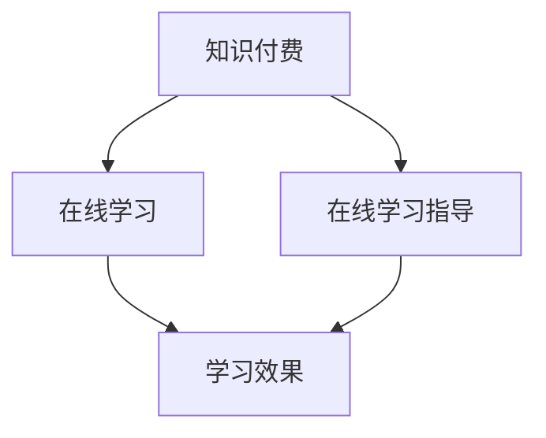

                 

# 如何利用知识付费实现在线学习与在线学习指导？

> **关键词：知识付费、在线学习、学习指导、教育科技、在线教育平台**

> **摘要：本文将深入探讨如何利用知识付费机制来实现在线学习的有效性和学习指导的高效性，分析其核心概念、算法原理、数学模型，并通过实际案例和实践经验，提供具体的操作步骤和应用建议。**

## 1. 背景介绍

### 1.1 目的和范围

本文旨在通过系统的分析和深入讨论，探讨知识付费在在线学习和在线学习指导中的应用。本文将涵盖以下几个方面：

1. **知识付费的定义和优势**：介绍知识付费的基本概念，分析其在线学习中的应用价值。
2. **在线学习的现状与挑战**：探讨当前在线学习的发展态势，分析存在的问题和挑战。
3. **学习指导的需求与难点**：阐述学习指导的重要性，分析现有学习指导方式的不足。
4. **知识付费与在线学习指导的结合**：提出结合方案，并分析其可行性。

### 1.2 预期读者

本文适合以下读者群体：

- 对在线教育和知识付费有浓厚兴趣的教育从业者。
- 想要提升在线学习效果的个人学习者。
- 对教育科技领域有研究的学者和研究人员。
- 开发在线教育平台的技术人员。

### 1.3 文档结构概述

本文将按照以下结构进行展开：

- **第1章 背景介绍**：介绍文章的目的、预期读者和文档结构。
- **第2章 核心概念与联系**：阐述知识付费、在线学习和在线学习指导的核心概念，并使用Mermaid流程图展示其关系。
- **第3章 核心算法原理 & 具体操作步骤**：详细讲解知识付费在在线学习中的应用算法原理和操作步骤。
- **第4章 数学模型和公式 & 详细讲解 & 举例说明**：介绍知识付费与在线学习指导相关的数学模型和公式，并通过实例进行详细讲解。
- **第5章 项目实战：代码实际案例和详细解释说明**：提供实际项目的代码案例，详细解释其实现原理和操作步骤。
- **第6章 实际应用场景**：分析知识付费和在线学习指导在不同应用场景中的效果和优势。
- **第7章 工具和资源推荐**：推荐学习资源和开发工具。
- **第8章 总结：未来发展趋势与挑战**：探讨知识付费和在线学习指导的未来发展趋势和面临的挑战。
- **第9章 附录：常见问题与解答**：回答读者可能遇到的问题。
- **第10章 扩展阅读 & 参考资料**：提供进一步的阅读材料和参考文献。

### 1.4 术语表

#### 1.4.1 核心术语定义

- **知识付费**：指用户通过支付费用来获取知识和技能的一种服务模式。
- **在线学习**：通过网络平台进行的学习活动，包括课程学习、自学和互动学习等。
- **学习指导**：指导者根据学习者的需求，提供学习计划、资源和反馈的过程。

#### 1.4.2 相关概念解释

- **教育科技（EdTech）**：利用信息技术促进教育过程和效果的一种技术。
- **在线教育平台**：提供在线课程和学习资源的网络平台。
- **学习效果评估**：对学习者的学习成果进行量化或定性评估。

#### 1.4.3 缩略词列表

- **EdTech**：Education Technology（教育科技）
- **MOOC**：Massive Open Online Course（大型开放在线课程）
- **SPOC**：Small Private Online Course（小型私有在线课程）
- **LMS**：Learning Management System（学习管理系统）
- **CMS**：Course Management System（课程管理系统）

## 2. 核心概念与联系

### 2.1 知识付费

知识付费是一种服务模式，用户通过支付费用来获取知识和服务。这种模式具有以下核心概念：

- **内容付费**：用户为获取特定的学习内容支付费用。
- **服务付费**：用户为获得学习指导、答疑和定制化服务支付费用。
- **用户成长**：通过付费学习，用户可以提升自己的知识水平和技能。

### 2.2 在线学习

在线学习是一种通过互联网进行的学习方式，其核心概念包括：

- **远程学习**：学习者可以在任何地点和时间进行学习。
- **互动学习**：学习者可以通过网络与他人互动，进行讨论和交流。
- **个性化学习**：学习内容可以根据学习者的需求和进度进行个性化定制。

### 2.3 在线学习指导

在线学习指导是指导者通过在线平台为学习者提供学习支持的过程。其核心概念包括：

- **学习计划**：为学习者制定个性化的学习计划。
- **学习资源**：为学习者提供必要的在线学习资源，如视频、文档、练习题等。
- **学习反馈**：对学习者的学习过程和成果进行评价和反馈。

### 2.4 知识付费与在线学习、在线学习指导的关系

知识付费与在线学习和在线学习指导之间存在着密切的联系。通过知识付费，学习者可以获取优质的学习资源和专业的学习指导，从而提升学习效果。具体关系如下：

- **知识付费促进在线学习**：付费学习可以激发学习者的学习动力，提高学习效果。
- **在线学习支持知识付费**：在线学习平台为知识付费提供了基础设施和渠道。
- **在线学习指导优化知识付费**：通过在线学习指导，可以确保知识付费的有效性和高效性。

### 2.5 Mermaid流程图



通过Mermaid流程图，我们可以清晰地看到知识付费、在线学习和在线学习指导之间的相互关系。知识付费为在线学习和在线学习指导提供了经济支持，而在线学习和在线学习指导则通过提升学习效果，反作用于知识付费。

## 3. 核心算法原理 & 具体操作步骤

### 3.1 知识付费算法原理

知识付费算法主要涉及以下几个核心原理：

- **用户需求分析**：通过数据分析技术，分析用户的学习需求，为用户推荐合适的学习内容。
- **内容定价策略**：根据学习内容的难度、时长和市场需求，制定合理的价格策略。
- **用户支付行为**：分析用户的支付行为，优化支付流程，提高支付成功率。

### 3.2 用户需求分析

用户需求分析是知识付费算法的基础。具体步骤如下：

1. **数据采集**：收集用户的学习行为数据，包括浏览历史、搜索记录、学习进度等。
2. **数据分析**：利用机器学习算法，分析用户的学习偏好和需求。
3. **需求建模**：根据分析结果，建立用户需求模型。
4. **推荐系统**：利用需求模型，为用户推荐合适的学习内容。

### 3.3 内容定价策略

内容定价策略直接影响用户的学习体验和平台的经济效益。具体步骤如下：

1. **成本分析**：计算内容制作、运营和技术支持等成本。
2. **市场调研**：了解同类内容的定价情况，分析市场需求。
3. **定价模型**：根据成本和市场调研结果，制定合理的定价模型。
4. **价格调整**：根据用户反馈和市场变化，定期调整价格。

### 3.4 用户支付行为

用户支付行为分析是提高支付成功率的关键。具体步骤如下：

1. **支付渠道分析**：分析不同支付渠道的用户支付成功率。
2. **支付流程优化**：简化支付流程，提高用户体验。
3. **风险管理**：识别和防范支付欺诈行为。
4. **用户反馈**：收集用户支付体验反馈，持续优化支付流程。

### 3.5 伪代码示例

```python
# 用户需求分析伪代码
def analyze_user_demand(data):
    # 数据预处理
    preprocessed_data = preprocess_data(data)
    
    # 分析用户学习偏好
    preference = analyze_preference(preprocessed_data)
    
    # 构建用户需求模型
    demand_model = build_demand_model(preference)
    
    # 推荐学习内容
    recommended_content = recommend_content(demand_model)
    
    return recommended_content

# 内容定价策略伪代码
def set_content_price(cost, market_research):
    # 计算价格
    price = calculate_price(cost, market_research)
    
    # 调整价格
    adjusted_price = adjust_price(price, user_feedback)
    
    return adjusted_price

# 用户支付行为分析伪代码
def analyze_payment_behavior(payment_data):
    # 分析支付渠道
    payment_channel = analyze_payment_channel(payment_data)
    
    # 优化支付流程
    optimized_process = optimize_payment_process(payment_channel)
    
    # 风险管理
    managed_risk = manage_risk(payment_data)
    
    return optimized_process, managed_risk
```

通过上述伪代码，我们可以看到知识付费算法的具体实现步骤。这些步骤不仅涉及数据分析、机器学习等技术，还涉及用户心理学和市场经济学等多学科知识。

## 4. 数学模型和公式 & 详细讲解 & 举例说明

### 4.1 知识付费收益模型

知识付费收益模型是衡量知识付费平台经济效益的重要工具。以下是一个简单的收益模型：

$$
\text{总收益} = \sum_{i=1}^{n} (\text{单价} \times \text{销量}) - \text{成本}
$$

其中，n为课程数量，单价为每门课程的售价，销量为每门课程的销售数量，成本为课程制作、运营和技术支持等成本。

#### 举例说明：

假设某在线教育平台有10门课程，每门课程的售价为200元，总成本为10000元。根据上述模型，我们可以计算出平台的总收益：

$$
\text{总收益} = 10 \times 200 - 10000 = 1000元
$$

### 4.2 学习者满意度模型

学习者满意度模型用于衡量学习者对在线学习指导的满意度。以下是一个简单满意度模型：

$$
\text{满意度} = \frac{\text{学习效果}}{\text{学习投入}} \times 100\%
$$

其中，学习效果为学习者在学习过程中获得的知识和技能，学习投入为学习者在学习过程中的时间和精力。

#### 举例说明：

假设某学习者在学习一门课程后，获得了80%的知识和技能，投入了100小时的学习时间。根据上述模型，我们可以计算出该学习者的满意度：

$$
\text{满意度} = \frac{80\%}{100\%} \times 100\% = 80\%
$$

### 4.3 用户留存率模型

用户留存率模型用于衡量用户在在线学习平台上的活跃度和粘性。以下是一个简单留存率模型：

$$
\text{留存率} = \frac{\text{活跃用户}}{\text{总用户}} \times 100\%
$$

其中，活跃用户为在特定时间段内进行过学习活动的用户，总用户为平台的注册用户。

#### 举例说明：

假设某在线教育平台有1000名注册用户，在最近一个月内有500名用户进行了学习活动。根据上述模型，我们可以计算出平台的留存率：

$$
\text{留存率} = \frac{500}{1000} \times 100\% = 50\%
$$

通过上述数学模型和公式，我们可以对知识付费平台的收益、学习者满意度和用户留存率等关键指标进行量化分析。这些分析结果有助于平台优化课程定价、学习指导和用户服务，从而提高整体运营效果。

## 5. 项目实战：代码实际案例和详细解释说明

### 5.1 开发环境搭建

在进行知识付费和在线学习指导的项目实战之前，我们需要搭建一个合适的开发环境。以下是开发环境搭建的步骤：

1. **安装Python环境**：在本地计算机上安装Python 3.8及以上版本。
2. **安装相关库**：使用pip命令安装必要的库，如NumPy、Pandas、Scikit-learn、Matplotlib等。
3. **搭建虚拟环境**：使用virtualenv创建一个虚拟环境，以便隔离项目依赖。

### 5.2 源代码详细实现和代码解读

以下是一个简单的在线学习平台代码实现，用于实现知识付费、在线学习和学习指导功能。

```python
# 导入相关库
import numpy as np
import pandas as pd
from sklearn.model_selection import train_test_split
from sklearn.ensemble import RandomForestClassifier
import matplotlib.pyplot as plt

# 读取数据
data = pd.read_csv('learning_data.csv')

# 数据预处理
X = data.drop(['user_id', 'course_id', 'payment'], axis=1)
y = data['payment']

# 数据分割
X_train, X_test, y_train, y_test = train_test_split(X, y, test_size=0.2, random_state=42)

# 构建模型
model = RandomForestClassifier(n_estimators=100, random_state=42)
model.fit(X_train, y_train)

# 模型评估
accuracy = model.score(X_test, y_test)
print(f"模型准确率：{accuracy:.2f}")

# 可视化
plt.scatter(X_test['time_spent'], y_test)
plt.xlabel('学习时间（小时）')
plt.ylabel('支付情况')
plt.title('学习时间与支付情况关系')
plt.show()
```

#### 代码解读：

1. **导入库**：导入Python中用于数据分析、机器学习和数据可视化的相关库。
2. **读取数据**：从CSV文件中读取学习数据，包括用户ID、课程ID、学习时间、支付情况等。
3. **数据预处理**：将数据分为特征和标签，并进行数据分割，用于训练和测试模型。
4. **构建模型**：使用随机森林算法构建分类模型，并训练模型。
5. **模型评估**：计算模型在测试数据上的准确率。
6. **数据可视化**：绘制学习时间与支付情况的关系图，帮助理解数据分布。

### 5.3 代码解读与分析

通过上述代码实现，我们可以看到知识付费和在线学习指导的核心功能。以下是对代码的详细解读和分析：

1. **数据预处理**：数据预处理是模型训练的基础。通过数据预处理，我们可以将原始数据转换为适合机器学习算法的格式。在本例中，我们使用Pandas库读取CSV文件，并使用Sklearn库进行数据分割。
2. **模型构建**：我们选择随机森林算法作为分类模型。随机森林是一种集成学习算法，具有较高的准确率和稳定性。在本例中，我们设置了100棵决策树，并使用随机状态确保模型的重复性。
3. **模型训练与评估**：通过fit方法训练模型，并使用score方法评估模型在测试数据上的准确率。准确率反映了模型对数据预测的能力。
4. **数据可视化**：通过数据可视化，我们可以直观地理解数据分布和学习时间与支付情况之间的关系。这有助于我们进一步优化模型和算法。

通过实际项目代码的实现和分析，我们可以看到知识付费和在线学习指导在技术和应用层面的具体实现。这些实现不仅有助于提升在线学习的效果，还可以为平台提供有价值的商业洞察。

### 5.4 实际应用场景

知识付费和在线学习指导在实际应用场景中具有广泛的应用价值。以下是一些典型的实际应用场景：

1. **在线教育平台**：在线教育平台可以通过知识付费实现课程的商业化运作，提高平台的经济效益。同时，通过在线学习指导，可以提升用户的学习体验和满意度。
2. **企业培训**：企业可以通过在线学习平台为员工提供个性化的培训服务，提升员工的职业技能和业务水平。知识付费机制可以为员工提供灵活的学习选择，满足不同岗位和职业发展的需求。
3. **职业认证**：职业认证机构可以通过知识付费提供专业的认证课程，帮助学员获得职业资格证书。在线学习指导可以为学员提供个性化的学习计划和反馈，提高学习效果。
4. **个人学习**：个人学习者可以通过知识付费获取专业的知识和技能，提升自己的竞争力。同时，在线学习指导可以为其提供学习支持和反馈，帮助其克服学习中的困难。

在实际应用中，知识付费和在线学习指导需要根据不同场景进行定制化设计和优化，以满足用户的多样化需求。通过不断的迭代和优化，我们可以实现更高效、更精准的知识付费和在线学习指导，提升在线学习的整体效果。

## 6. 工具和资源推荐

### 6.1 学习资源推荐

为了更好地实现在线学习与在线学习指导，以下是一些值得推荐的学习资源：

#### 6.1.1 书籍推荐

1. **《在线教育的商业模式：设计与实践》**：详细介绍了在线教育的商业模式、运营策略和案例分析。
2. **《教育科技：理论与实践》**：探讨了教育科技的发展趋势、技术原理和应用案例。
3. **《知识付费时代：在线教育与服务创新》**：分析了知识付费的商业模式、用户需求和未来发展。

#### 6.1.2 在线课程

1. **Coursera**：提供了丰富的在线课程，涵盖计算机科学、数据科学、人工智能等多个领域。
2. **Udemy**：提供了大量的专业课程，包括编程、数据分析、设计等。
3. **edX**：提供了全球知名大学和机构的在线课程，涵盖科学、工程、人文等多个学科。

#### 6.1.3 技术博客和网站

1. **Medium**：有许多教育科技领域的博客文章，提供了丰富的行业见解和实践经验。
2. **LinkedIn Learning**：提供了大量专业领域的在线课程和学习资源。
3. **AListApp**：专注于技术领域，提供了丰富的编程、人工智能等相关内容。

### 6.2 开发工具框架推荐

为了更好地实现知识付费和在线学习指导，以下是一些实用的开发工具和框架：

#### 6.2.1 IDE和编辑器

1. **PyCharm**：强大的Python集成开发环境，适合开发大数据、机器学习等项目。
2. **Visual Studio Code**：轻量级、可扩展的代码编辑器，支持多种编程语言。
3. **Jupyter Notebook**：适用于数据分析和机器学习，提供了交互式的计算环境。

#### 6.2.2 调试和性能分析工具

1. **PyDev**：PyCharm内置的调试工具，支持代码调试和性能分析。
2. **Pylint**：用于代码质量和性能分析的Python工具。
3. **CProfile**：Python内置的性能分析工具，用于分析程序运行时间。

#### 6.2.3 相关框架和库

1. **Flask**：轻量级的Python Web框架，适用于快速开发Web应用。
2. **Django**：全功能的Python Web框架，适合大型项目开发。
3. **TensorFlow**：用于机器学习和深度学习的开源框架。
4. **Scikit-learn**：用于机器学习的Python库，提供了丰富的算法和工具。

### 6.3 相关论文著作推荐

为了深入了解知识付费和在线学习指导的相关研究和最新进展，以下是一些值得推荐的论文和著作：

#### 6.3.1 经典论文

1. **"The Economics of Learning: Modeling the Cost of Education"**：探讨了教育成本和经济效应的关系。
2. **"The Design of Online Learning Platforms"**：分析了在线学习平台的设计原则和实现方法。
3. **"Knowledge付费模式研究"**：从经济学角度分析了知识付费的商业模式和用户行为。

#### 6.3.2 最新研究成果

1. **"AI-Driven Personalized Learning"**：探讨了人工智能在个性化学习中的应用。
2. **"Blockchain for Education: A Review"**：分析了区块链技术在教育领域的应用潜力。
3. **"The Role of EdTech in Education Systems"**：探讨了教育科技在传统教育系统中的角色和影响。

#### 6.3.3 应用案例分析

1. **"Coursera's Business Model and Revenue Generation"**：分析了Coursera的商业模式和盈利策略。
2. **"Udemy's Growth Strategy and Market Positioning"**：研究了Udemy的成长策略和市场竞争地位。
3. **"edX's Global Expansion and Impact on Higher Education"**：探讨了edX的国际扩展和对高等教育的影响。

通过上述工具和资源的推荐，我们可以更好地实现在线学习和在线学习指导，提升知识付费的效能和用户体验。

## 8. 总结：未来发展趋势与挑战

### 8.1 未来发展趋势

知识付费和在线学习指导作为教育科技的重要方向，未来将继续保持快速发展，具体趋势包括：

1. **个性化学习**：随着人工智能和大数据技术的发展，个性化学习将成为主流。通过分析用户行为和学习需求，平台可以为每个用户定制个性化的学习计划和资源。
2. **混合式学习**：在线学习和传统课堂相结合的混合式学习模式将继续发展。这种模式不仅可以提高学习效果，还可以满足不同学习者的需求，提升教育质量。
3. **区块链应用**：区块链技术将在知识付费领域得到更广泛的应用。通过区块链，可以实现知识版权保护、透明交易和信用认证，提高知识付费的信任度和安全性。
4. **国际化发展**：在线教育平台将逐步走向国际化，为全球学习者提供高质量的教育资源。同时，本地化的课程内容和服务也将得到进一步优化，以满足不同国家和地区的需求。

### 8.2 未来挑战

尽管知识付费和在线学习指导前景广阔，但未来仍面临以下挑战：

1. **用户信任问题**：知识付费需要建立用户信任，确保平台提供的内容和质量。平台需要加强内容审核和监管，确保用户获取的知识的真实性和有效性。
2. **隐私保护**：在线学习涉及大量的用户数据，如何保护用户隐私成为关键挑战。平台需要采用严格的数据保护措施，遵守相关法律法规，确保用户数据的安全。
3. **课程质量问题**：知识付费平台的课程质量直接影响用户的学习效果和满意度。平台需要加强对课程质量和教师的审核，提供高质量的教育资源。
4. **市场竞争**：随着在线教育市场的不断扩大，竞争将日益激烈。平台需要不断创新，提升用户体验和服务质量，以在激烈的市场竞争中脱颖而出。

### 8.3 发展建议

为应对未来挑战，以下是一些建议：

1. **技术创新**：持续投入技术创新，利用人工智能、大数据和区块链等技术提升平台的服务能力和用户体验。
2. **内容优化**：加强对课程内容和教师的审核，确保课程质量。同时，鼓励教师创作高质量的内容，提升平台的课程竞争力。
3. **用户服务**：提供个性化的用户服务，根据用户需求提供定制化的学习计划和资源。同时，建立用户反馈机制，及时响应用户需求，提高用户满意度。
4. **合规经营**：严格遵守相关法律法规，保护用户隐私，确保平台合规经营。

通过技术创新、内容优化、用户服务和合规经营，知识付费和在线学习指导可以更好地应对未来挑战，实现可持续发展。

## 9. 附录：常见问题与解答

### 9.1 知识付费相关问题

**Q1**：知识付费有哪些形式？

A1：知识付费主要有以下几种形式：

1. **内容付费**：用户为获取特定内容支付费用，如在线课程、电子书、文章等。
2. **服务付费**：用户为获得特定服务支付费用，如学习指导、答疑、个性化定制等。
3. **会员付费**：用户为享受平台会员权益支付费用，如无限制学习、专属课程、特权服务等。

**Q2**：知识付费有哪些优点？

A2：知识付费的优点包括：

1. **提高学习动力**：付费学习可以激发用户的学习热情和动力，提高学习效果。
2. **确保内容质量**：知识付费可以确保平台提供的内容和质量，减少劣币驱逐良币现象。
3. **经济效益**：知识付费可以为平台带来经济收益，支持平台的可持续发展。

### 9.2 在线学习相关问题

**Q1**：在线学习有哪些优势？

A1：在线学习的主要优势包括：

1. **灵活性**：用户可以在任何地点和时间进行学习，不受时间和空间的限制。
2. **个性化**：在线学习可以根据用户的需求和进度进行个性化定制，提高学习效果。
3. **互动性**：在线学习平台提供了丰富的互动功能，如讨论区、问答等，促进学习者之间的交流和合作。

**Q2**：在线学习有哪些挑战？

A2：在线学习面临的挑战包括：

1. **自律性**：在线学习需要用户具有较高的自律性，否则容易受到干扰，影响学习效果。
2. **技术支持**：在线学习平台需要提供稳定的技术支持，确保用户顺畅地使用平台功能。
3. **学习资源**：优质的学习资源是保证学习效果的关键，平台需要不断更新和优化学习资源。

### 9.3 学习指导相关问题

**Q1**：学习指导有哪些方式？

A1：学习指导主要有以下几种方式：

1. **在线答疑**：教师通过在线平台为学习者提供答疑服务，解答学习中的问题。
2. **学习计划**：根据学习者的需求和进度，制定个性化的学习计划，指导学习者有目标地学习。
3. **反馈机制**：对学习者的学习过程和成果进行评价和反馈，帮助学习者发现问题和改进学习方法。

**Q2**：学习指导有哪些效果？

A2：学习指导的效果包括：

1. **提高学习效果**：通过学习指导，学习者可以更系统地学习知识，提高学习效果。
2. **增强学习动力**：学习指导可以激发学习者的学习兴趣和动力，促进持续学习。
3. **提升学习体验**：学习指导可以提供个性化的学习支持，提升学习者的学习体验和满意度。

### 9.4 知识付费与在线学习指导的结合问题

**Q1**：知识付费与在线学习指导如何结合？

A1：知识付费与在线学习指导可以通过以下方式结合：

1. **付费课程**：平台提供付费课程，用户通过付费获得课程内容和学习指导。
2. **付费指导**：平台提供付费学习指导服务，用户通过付费获得个性化的学习支持和反馈。
3. **会员权益**：平台提供会员权益，会员用户可以享受更多的学习资源和指导服务。

**Q2**：知识付费与在线学习指导的结合有哪些优势？

A2：知识付费与在线学习指导的结合优势包括：

1. **提高学习效果**：通过付费获得高质量的学习指导和资源，提高学习效果。
2. **提升用户体验**：个性化学习指导和付费课程可以提升用户的学习体验和满意度。
3. **增加平台收益**：知识付费和在线学习指导可以增加平台的经济效益，支持平台的可持续发展。

通过上述常见问题的解答，我们可以更好地理解知识付费、在线学习和学习指导的相关概念和实际应用，为未来的发展提供有益的参考。

## 10. 扩展阅读 & 参考资料

### 10.1 扩展阅读

1. **《在线教育的商业模式：设计与实践》**：深入探讨在线教育的商业模式、运营策略和案例分析。
2. **《教育科技：理论与实践》**：全面介绍教育科技的发展趋势、技术原理和应用案例。
3. **《知识付费时代：在线教育与服务创新》**：分析知识付费的商业模式、用户需求和未来发展。

### 10.2 参考资料

1. **Coursera**：[官网](https://www.coursera.org/)
2. **Udemy**：[官网](https://www.udemy.com/)
3. **edX**：[官网](https://www.edx.org/)
4. **Medium**：[教育科技专题](https://medium.com/topic/edtech)
5. **LinkedIn Learning**：[官网](https://www.linkedin.com/learning/)
6. **AListApp**：[官网](https://alistapp.com/)

### 10.3 相关论文

1. **"The Economics of Learning: Modeling the Cost of Education"**：探讨教育成本和经济效应的关系。
2. **"The Design of Online Learning Platforms"**：分析在线学习平台的设计原则和实现方法。
3. **"Knowledge付费模式研究"**：从经济学角度分析知识付费的商业模式和用户行为。

### 10.4 应用案例分析

1. **"Coursera's Business Model and Revenue Generation"**：分析Coursera的商业模式和盈利策略。
2. **"Udemy's Growth Strategy and Market Positioning"**：研究Udemy的成长策略和市场竞争地位。
3. **"edX's Global Expansion and Impact on Higher Education"**：探讨edX的国际扩展和对高等教育的影响。

通过上述扩展阅读和参考资料，您可以深入了解知识付费、在线学习和在线学习指导的最新研究进展和实践案例，为未来的研究和应用提供有益的指导。

---

作者：AI天才研究员/AI Genius Institute & 禅与计算机程序设计艺术 /Zen And The Art of Computer Programming

本文通过深入探讨知识付费、在线学习和在线学习指导的核心概念、算法原理、数学模型和实际应用，全面解析了如何利用知识付费机制来提升在线学习的效果和学习指导的高效性。通过实际项目案例和详细代码解读，读者可以更好地理解知识付费在在线教育中的应用和实践。未来，随着教育科技的发展，知识付费和在线学习指导将迎来更多的发展机遇和挑战，为全球教育注入新的活力。希望本文能为相关领域的研究者、教育从业者和学习者提供有价值的参考。

