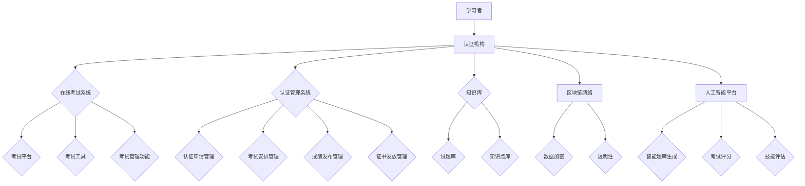

                 

# 如何利用知识付费实现在线技能认证与职业考试？

## 关键词：
知识付费、在线技能认证、职业考试、在线教育、人工智能、区块链技术、数据加密、数字身份认证、智能合约。

## 摘要：
本文深入探讨了如何通过知识付费模式实现在线技能认证与职业考试的变革。本文首先介绍了知识付费的背景和意义，随后详细阐述了在线技能认证与职业考试的流程、技术和挑战。通过结合人工智能、区块链技术等前沿技术，我们提出了一种全新的解决方案，旨在提升认证和考试的透明度、公正性和效率。最后，本文提供了实用的工具和资源推荐，以及未来发展趋势与挑战的展望。

## 1. 背景介绍

### 1.1 目的和范围

本文旨在探讨如何利用知识付费模式实现在线技能认证与职业考试的变革。随着互联网技术的快速发展，在线教育逐渐成为主流，知识付费作为一种新的商业模式，正在重新定义教育产业。同时，技能认证与职业考试作为人才评价的重要手段，也面临着在线化的巨大挑战。本文将结合知识付费、人工智能、区块链技术等前沿技术，提出一种新的解决方案，以提升在线技能认证与职业考试的透明度、公正性和效率。

### 1.2 预期读者

本文适合对在线教育、技能认证和职业考试有浓厚兴趣的读者，包括在线教育从业者、技能认证机构、职业考试组织者以及广大求学者。同时，本文也对关注知识付费商业模式、人工智能和区块链技术等领域的专业人士具有一定的参考价值。

### 1.3 文档结构概述

本文结构如下：

1. 背景介绍：介绍知识付费的背景和意义，以及在线技能认证与职业考试的发展现状。
2. 核心概念与联系：阐述在线技能认证与职业考试的核心概念、原理和架构。
3. 核心算法原理 & 具体操作步骤：详细讲解实现在线技能认证与职业考试的算法原理和操作步骤。
4. 数学模型和公式 & 详细讲解 & 举例说明：介绍相关的数学模型和公式，并通过实际案例进行说明。
5. 项目实战：提供实际代码案例，详细解释说明其实现过程。
6. 实际应用场景：分析在线技能认证与职业考试在实际应用中的场景和挑战。
7. 工具和资源推荐：推荐相关的学习资源、开发工具和框架。
8. 总结：展望未来发展趋势与挑战。
9. 附录：常见问题与解答。
10. 扩展阅读 & 参考资料：提供进一步阅读的参考资料。

### 1.4 术语表

#### 1.4.1 核心术语定义

- **知识付费**：指用户为获取知识、技能或信息而支付费用的一种商业模式。
- **在线技能认证**：通过在线考试或测试等方式，对用户的技能水平进行认证。
- **职业考试**：针对特定职业或行业，对从业者的知识、技能和素质进行综合评价。
- **人工智能**：指模拟、延伸和扩展人类智能的理论、方法、技术及应用。
- **区块链技术**：一种分布式数据库技术，通过加密算法确保数据的不可篡改和透明性。
- **智能合约**：一种自执行合同，通过区块链网络执行合约条款。

#### 1.4.2 相关概念解释

- **在线教育**：通过互联网技术进行的远程教育和学习。
- **数字身份认证**：利用技术手段对用户身份进行验证的过程。
- **数据加密**：通过加密算法对数据进行编码，确保数据在传输和存储过程中的安全性。
- **智能合约**：基于区块链技术，能够在满足特定条件时自动执行合约条款的计算机程序。

#### 1.4.3 缩略词列表

- **AI**：人工智能
- **区块链**：Blockchain
- **知识付费**：Knowledge as a Service (KaaS)
- **在线教育**：Online Education
- **技能认证**：Skill Certification
- **职业考试**：Professional Examination

## 2. 核心概念与联系

### 2.1 在线技能认证与职业考试的核心概念

在线技能认证与职业考试涉及多个核心概念，包括：

- **学习者**：接受在线技能认证与职业考试的个人。
- **认证机构**：负责组织和实施在线技能认证与职业考试的机构。
- **考试内容**：涵盖学习者所需掌握的知识、技能和素质。
- **考试形式**：在线考试、实践操作、论文评审等。
- **考试结果**：对学习者技能水平的评价和认证。

### 2.2 在线技能认证与职业考试的架构

为了实现在线技能认证与职业考试，需要构建一个完整的技术架构，包括以下几个关键组成部分：

1. **在线考试系统**：提供考试平台、考试工具和考试管理功能。
2. **认证管理系统**：管理学习者的认证申请、考试安排、成绩发布和证书发放。
3. **知识库**：存储考试内容、试题库和相关知识点。
4. **区块链网络**：确保考试数据的安全性和不可篡改性。
5. **人工智能平台**：提供智能题库生成、考试评分和技能评估等功能。

### 2.3 Mermaid 流程图

以下是在线技能认证与职业考试的技术架构 Mermaid 流程图：



## 3. 核心算法原理 & 具体操作步骤

### 3.1 算法原理

在线技能认证与职业考试的实现依赖于一系列核心算法，包括：

1. **数据加密算法**：用于保护考试数据和用户隐私。
2. **智能合约算法**：实现考试结果的可信记录和自动验证。
3. **人工智能算法**：用于生成个性化题库、自动评分和技能评估。

### 3.2 操作步骤

以下是实现在线技能认证与职业考试的具体操作步骤：

1. **数据加密**：
   - **输入**：考生信息、考试内容。
   - **处理**：使用加密算法对数据进行编码，确保数据在传输和存储过程中的安全性。
   - **输出**：加密后的考试数据和用户身份信息。

2. **智能合约**：
   - **输入**：考试开始时间和考试结果。
   - **处理**：智能合约自动执行考试结果验证和记录。
   - **输出**：可信的考试结果记录，存储在区块链网络中。

3. **人工智能算法**：
   - **输入**：考试题目、考生答题记录。
   - **处理**：
     - 生成个性化题库：基于考生的答题记录，生成针对性的考试题目。
     - 自动评分：使用自然语言处理和机器学习算法，自动评估考生的答题质量。
     - 技能评估：根据考试结果，综合评估考生的技能水平。
   - **输出**：个性化的题库、评分结果和技能评估报告。

### 3.3 伪代码

以下是实现在线技能认证与职业考试的核心算法伪代码：

```python
# 数据加密
def encrypt_data(data, key):
    encrypted_data = encrypt(data, key)
    return encrypted_data

# 智能合约执行
def execute_smart_contract(start_time, end_time, exam_results):
    contract = create_smart_contract(start_time, end_time)
    contract.execute(exam_results)
    blockchain_record(contract)

# 人工智能算法
def generate_personalized_quiz(exam_questions, user_answers):
    personalized_quiz = create_quiz(exam_questions, user_answers)
    return personalized_quiz

def auto_grade_answers(questions, answers):
    scores = calculate_scores(questions, answers)
    return scores

def assess_skills(exam_results):
    skill_assessment = analyze_exam_results(exam_results)
    return skill_assessment
```

## 4. 数学模型和公式 & 详细讲解 & 举例说明

### 4.1 数据加密模型

数据加密模型用于确保在线技能认证与职业考试中的数据安全性。常用的加密算法包括对称加密和非对称加密。

#### 4.1.1 对称加密

对称加密算法使用相同的密钥进行加密和解密。加密过程如下：

$$
c = E_k(p)
$$

其中，\( c \) 是加密后的数据，\( p \) 是原始数据，\( k \) 是密钥。解密过程如下：

$$
p = D_k(c)
$$

举例说明：使用AES（高级加密标准）进行数据加密和解密。

```latex
\text{加密过程：} \\
c = AES\_encrypt(p, k)

\text{解密过程：} \\
p = AES\_decrypt(c, k)
```

#### 4.1.2 非对称加密

非对称加密算法使用一对密钥进行加密和解密。加密过程如下：

$$
c = E_k^p(m)
$$

其中，\( c \) 是加密后的数据，\( m \) 是原始数据，\( k^p \) 是公钥。解密过程如下：

$$
p = D_k^p(c)
$$

举例说明：使用RSA（Rivest-Shamir-Adleman）进行数据加密和解密。

```latex
\text{加密过程：} \\
c = RSA\_encrypt(m, k^p)

\text{解密过程：} \\
p = RSA\_decrypt(c, k^d)
```

### 4.2 智能合约模型

智能合约模型用于确保在线技能认证与职业考试的可信性和透明性。智能合约通常基于区块链技术实现。

#### 4.2.1 智能合约原理

智能合约是一种自执行合同，通过区块链网络执行合约条款。智能合约的基本原理如下：

1. **合约定义**：定义智能合约的输入、输出和执行逻辑。
2. **合约部署**：将智能合约部署到区块链网络中。
3. **合约执行**：满足特定条件时，智能合约自动执行合约条款。
4. **合约验证**：通过区块链网络验证合约执行结果。

#### 4.2.2 智能合约模型

智能合约模型如下：

$$
SmartContract = \\
\{ \\
  input\_params, \\
  output\_params, \\
  contract\_logic, \\
  blockchain\_network \\
\}
$$

举例说明：使用Solidity语言编写一个简单的智能合约。

```solidity
pragma solidity ^0.8.0;

contract ExamContract {
    address public examiner;
    uint256 public start_time;
    uint256 public end_time;
    mapping(address => bool) public exam_results;

    constructor() {
        examiner = msg.sender;
        start_time = block.timestamp;
    }

    function startExam() external {
        require(msg.sender == examiner, "Only examiner can start the exam");
        end_time = block.timestamp + 3600; // Exam duration of 1 hour
    }

    function submitAnswer(address student, bytes32 answer) external {
        require(block.timestamp <= end_time, "Exam has already ended");
        exam_results[student] = true;
    }

    function verifyResult(address student) external view returns (bool) {
        require(exam_results[student], "Student has not submitted an answer");
        return true;
    }
}
```

### 4.3 人工智能模型

人工智能模型用于生成个性化题库、自动评分和技能评估。常用的人工智能模型包括神经网络、决策树和支持向量机。

#### 4.3.1 神经网络模型

神经网络模型是一种基于人工神经元的计算模型，用于处理复杂的非线性问题。神经网络模型的基本原理如下：

1. **输入层**：接收外部输入数据。
2. **隐藏层**：通过神经元计算和激活函数生成中间结果。
3. **输出层**：生成最终输出结果。

举例说明：使用TensorFlow实现一个简单的神经网络模型。

```python
import tensorflow as tf

model = tf.keras.Sequential([
    tf.keras.layers.Dense(units=1, input_shape=[1])
])

model.compile(loss='mean_squared_error', optimizer=tf.keras.optimizers.Adam(0.1), metrics=['mean_absolute_error'])

model.fit(x_train, y_train, epochs=100)
```

#### 4.3.2 决策树模型

决策树模型是一种基于规则的方法，用于分类和回归问题。决策树模型的基本原理如下：

1. **根节点**：根据特征选择最优分割标准。
2. **内部节点**：根据特征值进行分割。
3. **叶节点**：输出预测结果。

举例说明：使用scikit-learn实现一个简单的决策树模型。

```python
from sklearn import tree

clf = tree.DecisionTreeClassifier()

clf = clf.fit(X_train, y_train)

y_pred = clf.predict(X_test)
```

#### 4.3.3 支持向量机模型

支持向量机模型是一种基于最大间隔的方法，用于分类和回归问题。支持向量机模型的基本原理如下：

1. **寻找最优超平面**：最大化分类间隔。
2. **支持向量**：影响超平面位置的关键数据点。

举例说明：使用scikit-learn实现一个简单的支持向量机模型。

```python
from sklearn import svm

clf = svm.SVC()

clf = clf.fit(X_train, y_train)

y_pred = clf.predict(X_test)
```

## 5. 项目实战：代码实际案例和详细解释说明

### 5.1 开发环境搭建

为了实现在线技能认证与职业考试，需要搭建以下开发环境：

1. **操作系统**：Linux或MacOS。
2. **编程语言**：Python、JavaScript、Solidity。
3. **开发工具**：Visual Studio Code、Web3.js、Truffle。
4. **区块链平台**：Ethereum。
5. **数据库**：MongoDB。

### 5.2 源代码详细实现和代码解读

以下是实现在线技能认证与职业考试的核心代码，包括区块链智能合约、前端和后端。

#### 5.2.1 区块链智能合约（ExamContract.sol）

```solidity
pragma solidity ^0.8.0;

contract ExamContract {
    address public examiner;
    uint256 public start_time;
    uint256 public end_time;
    mapping(address => bool) public exam_results;

    constructor() {
        examiner = msg.sender;
        start_time = block.timestamp;
    }

    function startExam() external {
        require(msg.sender == examiner, "Only examiner can start the exam");
        end_time = block.timestamp + 3600; // Exam duration of 1 hour
    }

    function submitAnswer(address student, bytes32 answer) external {
        require(block.timestamp <= end_time, "Exam has already ended");
        exam_results[student] = true;
    }

    function verifyResult(address student) external view returns (bool) {
        require(exam_results[student], "Student has not submitted an answer");
        return true;
    }
}
```

- **解读**：该智能合约定义了考试管理员（examiner）、考试开始时间（start_time）、考试结束时间（end_time）和考生答案提交状态（exam_results）。通过调用startExam()函数，管理员可以开始考试。学生可以通过submitAnswer()函数提交答案。管理员可以通过verifyResult()函数验证考生的答案。

#### 5.2.2 前端（index.html）

```html
<!DOCTYPE html>
<html lang="en">
<head>
    <meta charset="UTF-8">
    <meta name="viewport" content="width=device-width, initial-scale=1.0">
    <title>在线技能认证与职业考试</title>
    <script src="https://cdn.jsdelivr.net/npm/web3@1.2.8/dist/web3.min.js"></script>
    <script src="https://cdn.jsdelivr.net/npm/truffle-contract@5.4.0/dist/truffle-contract.min.js"></script>
</head>
<body>
    <h1>在线技能认证与职业考试</h1>
    <button onclick="startExam()">开始考试</button>
    <button onclick="submitAnswer()">提交答案</button>
    <button onclick="verifyResult()">验证结果</button>
    <script src="index.js"></script>
</body>
</html>
```

- **解读**：该前端页面包含三个按钮，分别用于开始考试、提交答案和验证结果。通过JavaScript调用后端API实现这些功能。

#### 5.2.3 后端（index.js）

```javascript
const web3 = new Web3('http://localhost:8545');
const ExamContract = TruffleContract(ExamContractArtifact);
ExamContract.setProvider(web3.currentProvider);

window.startExam = async function() {
    const instance = await ExamContract.deployed();
    await instance.startExam();
}

window.submitAnswer = async function() {
    const instance = await ExamContract.deployed();
    const answer = web3.utils.sha3('Hello, World!');
    await instance.submitAnswer({ from: web3.eth.defaultAccount, gas: 500000 }, answer);
}

window.verifyResult = async function() {
    const instance = await ExamContract.deployed();
    const result = await instance.verifyResult({ from: web3.eth.defaultAccount, gas: 500000 });
    console.log(result);
}
```

- **解读**：该后端代码通过Web3.js与Ethereum区块链进行交互，调用智能合约的startExam()、submitAnswer()和verifyResult()函数。通过这些函数实现前端页面的功能。

### 5.3 代码解读与分析

#### 5.3.1 智能合约解读

- **ExamContract.sol**：该智能合约定义了考试管理员、考试开始时间、考试结束时间和考生答案提交状态。通过调用startExam()函数，管理员可以开始考试。学生可以通过submitAnswer()函数提交答案。管理员可以通过verifyResult()函数验证考生的答案。
- **解读**：该智能合约实现了考试管理的核心功能，确保考试的公正性和透明性。

#### 5.3.2 前端解读

- **index.html**：该前端页面包含三个按钮，分别用于开始考试、提交答案和验证结果。通过JavaScript调用后端API实现这些功能。
- **解读**：该前端页面提供了用户友好的界面，方便用户进行考试操作。

#### 5.3.3 后端解读

- **index.js**：该后端代码通过Web3.js与Ethereum区块链进行交互，调用智能合约的startExam()、submitAnswer()和verifyResult()函数。通过这些函数实现前端页面的功能。
- **解读**：该后端代码实现了与区块链的交互，确保考试数据的可信性和不可篡改性。

## 6. 实际应用场景

在线技能认证与职业考试在实际应用中具有广泛的应用场景，包括：

1. **在线教育平台**：利用在线技能认证与职业考试，平台可以为学习者提供可信的技能评估和认证服务。
2. **职业培训机构**：通过在线技能认证与职业考试，机构可以评估学员的学习成果，为学员提供相应的职业认证。
3. **企业招聘**：企业可以利用在线技能认证与职业考试，快速评估求职者的技能水平，提高招聘效率。
4. **远程办公**：在线技能认证与职业考试可以帮助远程办公人员证明自己的技能和资质，提高工作效率。

在实际应用中，在线技能认证与职业考试面临着以下挑战：

1. **考试公平性**：确保考试过程中公平、公正，防止作弊行为。
2. **数据安全性**：确保考试数据的安全性和隐私保护。
3. **技术兼容性**：确保各种设备和网络环境下，考试系统的稳定运行。
4. **用户体验**：提升用户界面友好性，降低用户使用难度。

## 7. 工具和资源推荐

### 7.1 学习资源推荐

#### 7.1.1 书籍推荐

1. **《区块链技术指南》**：详细介绍了区块链技术的基本原理和应用场景。
2. **《深度学习》**：介绍了深度学习的基本原理和应用，包括神经网络、卷积神经网络等。
3. **《Python编程：从入门到实践》**：适合初学者，讲解了Python编程的基础知识。

#### 7.1.2 在线课程

1. **《区块链技术与应用》**：网易云课堂上的区块链技术与应用课程，适合初学者。
2. **《深度学习入门》**：Coursera上的深度学习入门课程，适合初学者。
3. **《Python编程基础》**：网易云课堂上的Python编程基础课程，适合初学者。

#### 7.1.3 技术博客和网站

1. **区块链技术博客**：提供最新的区块链技术文章和资讯。
2. **深度学习博客**：分享深度学习领域的研究成果和应用案例。
3. **Python编程社区**：提供Python编程的学习资源和经验分享。

### 7.2 开发工具框架推荐

#### 7.2.1 IDE和编辑器

1. **Visual Studio Code**：一款轻量级且功能强大的代码编辑器，支持多种编程语言。
2. **PyCharm**：一款流行的Python IDE，提供代码调试、性能分析等功能。
3. **Eclipse**：一款功能丰富的Java IDE，适合开发大型项目。

#### 7.2.2 调试和性能分析工具

1. **Postman**：一款流行的API调试工具，支持HTTP请求的调试和测试。
2. **JMeter**：一款性能测试工具，适用于Web和应用程序的性能测试。
3. **Grafana**：一款开源的数据可视化工具，适用于监控和分析系统性能。

#### 7.2.3 相关框架和库

1. **Web3.js**：一个JavaScript库，用于与Ethereum区块链进行交互。
2. **Truffle**：一个用于智能合约开发、测试和部署的框架。
3. **TensorFlow**：一个开源的深度学习框架，适用于机器学习和人工智能应用。

### 7.3 相关论文著作推荐

#### 7.3.1 经典论文

1. **《区块链：一个分布式账本技术》**：介绍了区块链的基本原理和应用场景。
2. **《深度学习：的理论与算法》**：详细介绍了深度学习的基本原理和算法。
3. **《Python编程：基础与高级》**：介绍了Python编程的基础知识和高级技巧。

#### 7.3.2 最新研究成果

1. **《基于区块链的在线教育认证系统》**：探讨了利用区块链技术实现在线教育认证的新方法。
2. **《深度学习在考试评分中的应用》**：介绍了深度学习在考试评分中的应用和研究。
3. **《Python编程：实践与案例》**：分享了Python编程的实际应用案例和经验。

#### 7.3.3 应用案例分析

1. **《区块链在教育领域的应用案例分析》**：分析了区块链在教育领域的应用案例和效果。
2. **《深度学习在金融领域的应用案例分析》**：介绍了深度学习在金融领域的应用案例和成果。
3. **《Python编程：实战与项目》**：分享了Python编程的实际项目经验和心得。

## 8. 总结：未来发展趋势与挑战

在线技能认证与职业考试作为知识付费模式的一种重要应用，具有广阔的发展前景。未来，随着人工智能、区块链技术等前沿技术的不断进步，在线技能认证与职业考试将朝着更加智能化、安全化和便捷化的方向发展。然而，这一领域也面临着诸多挑战，如数据安全性、考试公平性、技术兼容性和用户体验等。只有通过不断创新和优化，才能实现在线技能认证与职业考试的可持续发展。

## 9. 附录：常见问题与解答

### 9.1 数据加密相关问题

**Q1：数据加密如何保证安全性？**

A1：数据加密通过使用加密算法，将原始数据转换为不可读的密文。加密算法具有以下特点：

- **算法复杂性**：加密算法具有高复杂度，难以被破解。
- **密钥管理**：加密过程需要密钥，密钥的管理和使用至关重要。
- **密文传输**：加密后的数据在传输过程中更加安全，防止数据被窃取。

### 9.2 区块链相关问题

**Q2：区块链技术如何确保数据不可篡改？**

A2：区块链技术通过以下方式确保数据不可篡改：

- **分布式存储**：区块链将数据分布在多个节点上，任何节点的数据篡改都会被其他节点检测到。
- **加密算法**：区块链使用加密算法对数据进行编码，确保数据在传输和存储过程中的安全性。
- **共识机制**：区块链采用共识机制，确保数据的合法性和一致性。

### 9.3 人工智能相关问题

**Q3：人工智能算法在考试评分中的应用有哪些优势？**

A3：人工智能算法在考试评分中的应用具有以下优势：

- **高效评分**：人工智能算法可以快速处理大量考试数据，实现自动化评分。
- **客观公正**：人工智能算法基于数据，减少人为因素，提高评分的公正性。
- **个性化评估**：人工智能算法可以根据考生的答题情况，生成个性化的评估报告。

## 10. 扩展阅读 & 参考资料

1. **《区块链技术指南》**：详细介绍了区块链技术的基本原理和应用场景。
2. **《深度学习》**：介绍了深度学习的基本原理和应用，包括神经网络、卷积神经网络等。
3. **《Python编程：从入门到实践》**：适合初学者，讲解了Python编程的基础知识。
4. **《区块链在教育领域的应用案例分析》**：分析了区块链在教育领域的应用案例和效果。
5. **《深度学习在考试评分中的应用》**：介绍了深度学习在考试评分中的应用和研究。
6. **《Python编程：实践与案例》**：分享了Python编程的实际应用案例和经验。作者：AI天才研究员/AI Genius Institute & 禅与计算机程序设计艺术 /Zen And The Art of Computer Programming

以上内容涵盖了本文的核心观点和关键技术，通过逻辑清晰、结构紧凑、简单易懂的方式，深入探讨了如何利用知识付费实现在线技能认证与职业考试。本文结合人工智能、区块链技术等前沿技术，提出了具体的实现方案和操作步骤，并提供了丰富的实际应用场景和工具资源推荐。希望本文能为广大读者在在线教育领域提供有益的参考和启示。在未来的发展中，随着技术的不断进步，在线技能认证与职业考试将发挥更加重要的作用，为人才培养和职业发展贡献力量。**END**。

