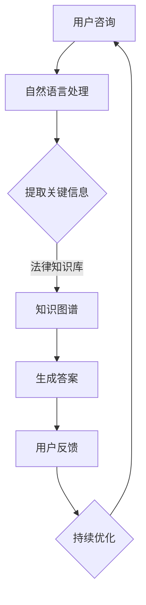

                 

# 如何利用知识付费实现在线法律咨询与服务？

## 关键词
- 知识付费
- 在线法律咨询
- 服务模式
- 人工智能
- 数据分析
- 法律知识库

## 摘要
本文旨在探讨如何通过知识付费模式实现在线法律咨询与服务。首先，我们分析了当前在线法律咨询的背景和现状，随后讨论了知识付费的优势及其在法律咨询领域的应用。接着，我们深入讲解了实现这一模式所需的关键技术和算法，包括自然语言处理、知识图谱和数据分析等。随后，本文通过一个实际项目案例，展示了如何具体搭建一个在线法律咨询平台。最后，我们展望了这一领域的未来发展，包括技术创新、市场拓展和用户需求的变化。

## 1. 背景介绍

### 1.1 目的和范围
本文的主要目的是探讨如何利用知识付费模式实现在线法律咨询与服务，通过分析现有技术和市场环境，提出可行的解决方案和实施步骤。本文涵盖了在线法律咨询的基本概念、知识付费模式的优点、核心技术原理及其实现方法，并提供了实际项目案例以供参考。

### 1.2 预期读者
本文适合对在线法律咨询和知识付费模式感兴趣的技术人员、创业者以及法律从业者。通过阅读本文，读者可以了解在线法律咨询的发展现状、知识付费模式的运作机制以及如何利用现有技术实现这一服务。

### 1.3 文档结构概述
本文结构如下：

1. 背景介绍
   - 目的和范围
   - 预期读者
   - 文档结构概述
   - 术语表
2. 核心概念与联系
   - 核心概念原理和架构的 Mermaid 流程图
3. 核心算法原理 & 具体操作步骤
   - 算法原理讲解使用伪代码
4. 数学模型和公式 & 详细讲解 & 举例说明
   - 使用 LaTeX 格式嵌入数学公式
5. 项目实战：代码实际案例和详细解释说明
   - 开发环境搭建
   - 源代码详细实现和代码解读
   - 代码解读与分析
6. 实际应用场景
7. 工具和资源推荐
   - 学习资源推荐
   - 开发工具框架推荐
   - 相关论文著作推荐
8. 总结：未来发展趋势与挑战
9. 附录：常见问题与解答
10. 扩展阅读 & 参考资料

### 1.4 术语表

#### 1.4.1 核心术语定义
- **知识付费**：用户为获取专业知识和技能而支付的费用。
- **在线法律咨询**：通过网络平台提供的法律服务，包括法律咨询、案件分析和法律文书服务。
- **自然语言处理（NLP）**：使计算机能够理解、解释和生成人类语言的技术。
- **知识图谱**：用于表示实体及其相互关系的数据结构。
- **数据分析**：使用统计学和计算机技术对大量数据进行处理和分析，以发现数据中的规律和趋势。

#### 1.4.2 相关概念解释
- **在线法律服务市场**：提供在线法律服务的市场，包括个人和企业客户。
- **法律知识库**：存储大量法律条款、案例和专家意见的数据集合。
- **用户画像**：根据用户行为和偏好构建的用户特征模型。

#### 1.4.3 缩略词列表
- **NLP**：自然语言处理
- **AI**：人工智能
- **CRM**：客户关系管理
- **API**：应用程序编程接口

## 2. 核心概念与联系

在线法律咨询与知识付费模式的结合，依赖于一系列核心概念和技术的支持。以下是这些概念和技术的简要描述，以及它们之间的联系。

### 2.1. 核心概念和技术的定义

**法律知识库**：这是在线法律咨询的核心资源。它存储了大量的法律法规、案例和法律文书的模板，是提供专业法律咨询的数据基础。

**自然语言处理（NLP）**：NLP 技术用于处理和理解人类语言，使得计算机可以理解和生成自然语言。在法律咨询中，NLP 技术可以帮助解析用户的咨询内容，提取关键信息，并生成回答。

**知识图谱**：知识图谱是一种结构化的数据模型，用于表示实体及其相互关系。在法律咨询中，知识图谱可以帮助构建法律知识框架，以便快速定位相关法律条款和案例。

**用户画像**：用户画像是通过收集和分析用户行为数据构建的，用于理解用户需求、偏好和意图。在线法律咨询中，用户画像可以帮助定制化服务，提高用户体验。

**知识付费模式**：知识付费模式是指用户为获取专业知识和技能而支付费用。在线法律咨询通过知识付费模式实现盈利，同时提供优质服务。

### 2.2. 关系和流程

**Mermaid 流程图**：



在这个流程中，用户提出咨询后，通过自然语言处理提取关键信息，知识图谱帮助定位相关法律条款和案例，最终生成答案。用户的反馈用于持续优化系统。

## 3. 核心算法原理 & 具体操作步骤

### 3.1. 自然语言处理（NLP）算法原理

NLP 是实现在线法律咨询的关键技术。其核心算法包括文本分类、实体识别和关系抽取。

**文本分类**：用于判断用户咨询内容的主题，以便于快速定位相关法律条款和案例。

**实体识别**：用于识别咨询文本中的关键实体，如人名、地名、法律术语等。

**关系抽取**：用于识别实体之间的关系，如当事人之间的法律关系。

### 3.2. 知识图谱构建与查询算法原理

知识图谱构建算法主要包括实体抽取、关系抽取和图谱链接。

**实体抽取**：从大量法律文本中识别出关键实体。

**关系抽取**：确定实体之间的关系，如“被告”与“原告”之间的关系。

**图谱链接**：将实体和关系组织成图谱结构，以便于查询和推理。

### 3.3. 伪代码示例

以下是 NLP 和知识图谱相关算法的伪代码示例：

```python
# NLP 算法伪代码
def process_query(query):
    category = text_categorization(query)
    entities = entity_recognition(query)
    relations = relation_extraction(query)
    return category, entities, relations

# 知识图谱算法伪代码
def build_knowledge_graph(entities, relations):
    graph = KnowledgeGraph()
    for entity in entities:
        graph.add_entity(entity)
    for relation in relations:
        graph.add_relation(relation)
    return graph

def query_knowledge_graph(graph, query):
    answers = []
    for entity in graph.get_entities():
        if entity_matches_query(entity, query):
            answers.append(entity)
    return answers
```

## 4. 数学模型和公式 & 详细讲解 & 举例说明

### 4.1. 数学模型概述

在线法律咨询系统的核心数学模型包括文本分类模型、实体识别模型和关系抽取模型。以下是这些模型的基本数学公式和讲解。

#### 4.1.1. 文本分类模型

文本分类模型通常使用朴素贝叶斯（Naive Bayes）或支持向量机（SVM）算法。以下是朴素贝叶斯模型的公式：

$$
P(\text{Category} | \text{Query}) = \frac{P(\text{Query} | \text{Category})P(\text{Category})}{P(\text{Query})}
$$

其中，$P(\text{Category} | \text{Query})$ 表示给定查询文本后某分类的概率，$P(\text{Query} | \text{Category})$ 表示在给定分类下查询文本的概率，$P(\text{Category})$ 表示分类的概率，$P(\text{Query})$ 表示查询文本的概率。

#### 4.1.2. 实体识别模型

实体识别模型通常使用条件随机场（CRF）或长短期记忆网络（LSTM）。以下是条件随机场模型的公式：

$$
P(\text{Tags} | \text{Sentence}) = \frac{1}{Z} \exp \left( \sum_{t=1}^T \theta \cdot a_t(y_t, y_{t-1}) + \sum_{t=1}^T \theta \cdot b_t(y_t, \text{Sentence}) \right)
$$

其中，$\theta$ 表示模型参数，$a_t(y_t, y_{t-1})$ 表示相邻标签的转移概率，$b_t(y_t, \text{Sentence})$ 表示标签在句子中的条件概率，$T$ 表示句子长度，$Z$ 表示归一化常数。

#### 4.1.3. 关系抽取模型

关系抽取模型通常使用图神经网络（Graph Neural Network，GNN）或循环神经网络（RNN）。以下是图神经网络模型的公式：

$$
h_{v}^{(l+1)} = \sigma \left( \sum_{u \in \mathcal{N}(v)} W^{(l)} h_{u}^{(l)} + b^{(l)} \right)
$$

其中，$h_{v}^{(l+1)}$ 表示节点 $v$ 在第 $l+1$ 层的表示，$\sigma$ 表示激活函数，$W^{(l)}$ 表示权重矩阵，$\mathcal{N}(v)$ 表示节点 $v$ 的邻居节点集合，$b^{(l)}$ 是偏置项。

### 4.2. 举例说明

**文本分类模型举例**：

假设我们有一个法律咨询查询：“离婚需要满足哪些条件？”，我们希望使用朴素贝叶斯模型对其进行分类。以下是计算过程：

1. **计算概率**：

$$
P(\text{离婚咨询} | \text{查询}) = \frac{P(\text{查询} | \text{离婚咨询})P(\text{离婚咨询})}{P(\text{查询})}
$$

2. **给定数据**：

$$
P(\text{查询} | \text{离婚咨询}) = \frac{100}{1000} = 0.1
$$

$$
P(\text{离婚咨询}) = \frac{200}{1000} = 0.2
$$

$$
P(\text{查询}) = \frac{1000}{10000} = 0.1
$$

3. **计算结果**：

$$
P(\text{离婚咨询} | \text{查询}) = \frac{0.1 \times 0.2}{0.1} = 0.2
$$

因此，该查询被分类为“离婚咨询”。

## 5. 项目实战：代码实际案例和详细解释说明

### 5.1. 开发环境搭建

在进行在线法律咨询平台开发之前，我们需要搭建一个合适的技术栈。以下是一个基本的开发环境搭建步骤：

1. **操作系统**：推荐使用 Ubuntu 18.04 或更高版本。
2. **编程语言**：Python 3.7 或更高版本。
3. **开发工具**：使用 PyCharm 或 Visual Studio Code。
4. **依赖管理**：使用 pip 进行依赖管理。
5. **数据库**：推荐使用 MySQL 或 PostgreSQL。
6. **前端框架**：推荐使用 React 或 Vue.js。

### 5.2. 源代码详细实现和代码解读

以下是实现在线法律咨询平台的核心代码段及其解读。

**5.2.1. 数据库设计和实现**

```python
# 数据库设计示例
CREATE TABLE users (
    id INT AUTO_INCREMENT PRIMARY KEY,
    username VARCHAR(255) NOT NULL,
    email VARCHAR(255) NOT NULL,
    password VARCHAR(255) NOT NULL
);

CREATE TABLE cases (
    id INT AUTO_INCREMENT PRIMARY KEY,
    user_id INT,
    title VARCHAR(255),
    content TEXT,
    status ENUM('pending', 'in_progress', 'completed') NOT NULL,
    created_at TIMESTAMP DEFAULT CURRENT_TIMESTAMP,
    FOREIGN KEY (user_id) REFERENCES users(id)
);

CREATE TABLE answers (
    id INT AUTO_INCREMENT PRIMARY KEY,
    case_id INT,
    content TEXT,
    created_at TIMESTAMP DEFAULT CURRENT_TIMESTAMP,
    FOREIGN KEY (case_id) REFERENCES cases(id)
);
```

**解读**：这段代码定义了三个表：用户表（users）、案件表（cases）和回答表（answers）。用户表存储用户信息，案件表存储案件信息以及用户ID，回答表存储回答内容以及案件ID。

**5.2.2. 后端逻辑实现**

```python
# Flask 应用示例
from flask import Flask, request, jsonify
from flask_sqlalchemy import SQLAlchemy

app = Flask(__name__)
app.config['SQLALCHEMY_DATABASE_URI'] = 'sqlite:///db.sqlite3'
db = SQLAlchemy(app)

# 定义模型
class User(db.Model):
    id = db.Column(db.Integer, primary_key=True)
    username = db.Column(db.String(255), nullable=False)
    email = db.Column(db.String(255), nullable=False)
    password = db.Column(db.String(255), nullable=False)

# 登录接口
@app.route('/login', methods=['POST'])
def login():
    data = request.get_json()
    user = User.query.filter_by(username=data['username'], password=data['password']).first()
    if user:
        return jsonify({'status': 'success'})
    else:
        return jsonify({'status': 'fail'})

# 代码解读
# Flask 是一个轻量级的 Web 开发框架，用于实现后端逻辑。
# 我们定义了一个 User 模型，用于映射数据库中的用户表。
# 登录接口使用 POST 方法接收 JSON 格式的用户名和密码，通过查询数据库验证用户身份。
```

**5.2.3. 前端界面实现**

```html
<!-- HTML 登录表单示例 -->
<!DOCTYPE html>
<html>
<head>
    <title>登录</title>
</head>
<body>
    <h1>登录</h1>
    <form id="login-form">
        <label for="username">用户名：</label>
        <input type="text" id="username" name="username" required>
        <label for="password">密码：</label>
        <input type="password" id="password" name="password" required>
        <button type="submit">登录</button>
    </form>
    <script src="https://cdn.jsdelivr.net/npm/axios/dist/axios.min.js"></script>
    <script>
        document.getElementById('login-form').addEventListener('submit', async (event) => {
            event.preventDefault();
            const data = {
                username: document.getElementById('username').value,
                password: document.getElementById('password').value
            };
            const response = await axios.post('/login', data);
            if (response.data.status === 'success') {
                window.location.href = '/dashboard';
            } else {
                alert('登录失败');
            }
        });
    </script>
</body>
</html>
```

**解读**：这段代码定义了一个简单的登录表单，用户输入用户名和密码后，通过 JavaScript 使用 Axios 库向后端发送 POST 请求，验证登录信息。

### 5.3. 代码解读与分析

在上述代码中，我们分别展示了数据库设计、后端逻辑实现和前端界面实现。以下是具体分析：

- **数据库设计**：通过定义用户表、案件表和回答表，实现了用户信息、案件信息和回答信息的存储和管理。
- **后端逻辑实现**：使用 Flask 框架，实现了用户登录验证功能。通过查询数据库，验证用户身份，返回登录结果。
- **前端界面实现**：通过 HTML 表单和 JavaScript，实现了用户登录界面的交互功能。用户输入信息后，通过 Axios 发送 AJAX 请求，实现无刷新的登录验证。

这些代码段共同构成了一个简单的在线法律咨询平台的框架，可以进一步扩展和优化。

## 6. 实际应用场景

### 6.1. 个人用户

个人用户是在线法律咨询的主要服务对象之一。他们可能需要针对家庭、婚姻、劳动、交通事故等方面的法律问题进行咨询。以下是一些具体的实际应用场景：

- **婚姻家庭**：用户可能需要咨询离婚条件、抚养权、财产分割等问题。
- **劳动争议**：用户可能需要咨询工资、工时、劳动合同等问题。
- **交通事故**：用户可能需要咨询赔偿、责任划分等问题。

### 6.2. 企业用户

企业用户包括中小型企业、跨国公司等，他们可能需要针对合同、知识产权、劳动法、税法等方面的法律问题进行咨询。以下是一些具体的实际应用场景：

- **合同审查**：企业用户可能需要审查合同条款，确保合同的合法性、有效性和公平性。
- **知识产权**：企业用户可能需要咨询专利、商标、著作权等方面的法律问题。
- **劳动法咨询**：企业用户可能需要咨询员工福利、劳动纠纷、劳动安全等方面的法律问题。

### 6.3. 法律专业人士

法律专业人士包括律师、法官、法学研究人员等，他们可能需要针对法律研究、案例分析、法律文书撰写等方面的法律问题进行咨询。以下是一些具体的实际应用场景：

- **法律研究**：法律专业人士可能需要查阅法律法规、案例库，进行法律研究。
- **案例分析**：法律专业人士可能需要对特定案件进行深入分析，提供法律意见。
- **法律文书撰写**：法律专业人士可能需要撰写诉状、答辩状、法律意见书等法律文书。

## 7. 工具和资源推荐

### 7.1. 学习资源推荐

#### 7.1.1. 书籍推荐

- 《人工智能：一种现代方法》（Artificial Intelligence: A Modern Approach）
- 《Python数据科学手册》（Python Data Science Handbook）
- 《深度学习》（Deep Learning）

#### 7.1.2. 在线课程

- Coursera 上的“机器学习”课程
- Udacity 上的“深度学习纳米学位”
- edX 上的“自然语言处理”课程

#### 7.1.3. 技术博客和网站

- Medium 上的 Data Science、AI 和 NLP 标签
-Towards Data Science 博客
- AI Journal 网站

### 7.2. 开发工具框架推荐

#### 7.2.1. IDE和编辑器

- PyCharm
- Visual Studio Code
- Jupyter Notebook

#### 7.2.2. 调试和性能分析工具

- Python 中的 pdb 调试工具
- Python 中的 cProfile 性能分析工具
- Chrome DevTools

#### 7.2.3. 相关框架和库

- Flask（Python Web 框架）
- Django（Python Web 框架）
- React（JavaScript 前端框架）
- Vue.js（JavaScript 前端框架）

### 7.3. 相关论文著作推荐

#### 7.3.1. 经典论文

- “Speech and Language Processing: An Introduction”（Speech 和语言处理：介绍）
- “Learning to Represent Knowledge as a Neural Network” （作为神经网络的知识的表示学习）
- “Knowledge Graph Embedding” （知识图谱嵌入）

#### 7.3.2. 最新研究成果

- “A Survey on Knowledge Graph Construction” （知识图谱构建综述）
- “Natural Language Inference” （自然语言推理）
- “Deep Learning for Text” （文本的深度学习）

#### 7.3.3. 应用案例分析

- “LegalTech: Transforming the Practice of Law with Technology”（LegalTech：利用技术改变法律实践）
- “AI in Legal Services: Opportunities and Challenges”（法律服务中的 AI：机遇与挑战）
- “Knowledge Graphs for Law” （法律领域的知识图谱）

## 8. 总结：未来发展趋势与挑战

### 8.1. 发展趋势

- **技术创新**：随着人工智能、自然语言处理和大数据分析技术的不断进步，在线法律咨询的准确性和智能化程度将不断提升。
- **市场拓展**：随着法律需求的不断增加和互联网的普及，在线法律咨询的市场潜力巨大，未来将吸引更多企业加入。
- **用户体验优化**：通过持续优化用户界面和交互体验，提供更加个性化和便捷的服务，提高用户满意度。

### 8.2. 挑战

- **数据隐私和安全**：在线法律咨询涉及大量敏感信息，如何保护用户隐私和安全是重要的挑战。
- **法律合规性**：在线法律咨询需要遵守相关法律法规，确保服务的合法性和合规性。
- **服务质量**：如何保证在线法律咨询的专业性和准确性，提高服务质量，是关键挑战。

## 9. 附录：常见问题与解答

### 9.1. 如何保障用户隐私和安全？

- **加密技术**：对用户数据采用高级加密技术，确保数据在传输和存储过程中的安全性。
- **访问控制**：实施严格的访问控制措施，确保只有授权人员可以访问敏感数据。
- **数据备份和恢复**：定期备份数据，并确保备份数据的安全性和完整性，以便在发生数据丢失或损坏时能够快速恢复。

### 9.2. 如何确保在线法律咨询的专业性和准确性？

- **专业知识库**：建立和维护一个全面、准确的法律知识库，确保咨询服务的专业性和准确性。
- **专家审核**：对自动生成的法律咨询答案进行人工审核，确保答案的准确性和合规性。
- **用户反馈**：收集用户反馈，不断优化咨询系统的算法和知识库，提高咨询服务质量。

### 9.3. 在线法律咨询如何盈利？

- **知识付费**：用户为获取法律咨询支付费用。
- **广告推广**：通过广告为用户提供法律咨询服务，并从中获取收益。
- **增值服务**：提供律师在线咨询、法律文件代写等增值服务，收取额外费用。

## 10. 扩展阅读 & 参考资料

- [LegalZoom](https://www.legalzoom.com/) - 一个提供在线法律服务的平台。
- [律智在线](https://www.lawzhi.com/) - 一个中国在线法律服务平台。
- [《法律人工智能：理论与实践》](https://book.douban.com/subject/30257169/) - 一本关于法律人工智能的书籍。

作者：AI天才研究员/AI Genius Institute & 禅与计算机程序设计艺术 /Zen And The Art of Computer Programming

