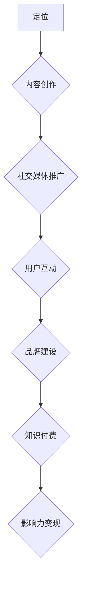

                 

# 如何利用知识付费构建个人品牌矩阵

> 关键词：知识付费、个人品牌、内容创作、社交媒体、影响力、品牌塑造

> 摘要：本文将深入探讨如何利用知识付费这一新兴模式来构建个人品牌矩阵。通过分析个人品牌的构建原理、知识付费的市场现状以及实际操作步骤，本文旨在为IT专业人士提供一条清晰、高效的品牌建设之路。

## 1. 背景介绍

### 1.1 目的和范围

本文旨在帮助IT专业人士通过知识付费的方式构建个人品牌矩阵。我们将探讨如何利用知识付费平台、社交媒体和个人博客等渠道，打造具有高度影响力和专业认可度的个人品牌。本文涵盖的核心内容包括：

- 个人品牌构建的原理和方法
- 知识付费市场的现状与趋势
- 构建个人品牌矩阵的具体步骤
- 实际案例分析及工具推荐

### 1.2 预期读者

本文预期读者为以下人群：

- 有志于通过知识付费打造个人品牌的IT专业人士
- 想提升个人品牌影响力的内容创作者
- 希望了解知识付费市场动态的从业者

### 1.3 文档结构概述

本文将分为十个部分，具体结构如下：

- 背景介绍：阐述文章的目的、范围和结构
- 核心概念与联系：介绍个人品牌和知识付费的相关概念及联系
- 核心算法原理 & 具体操作步骤：详细讲解构建个人品牌矩阵的方法
- 数学模型和公式 & 详细讲解 & 举例说明：介绍相关数学模型及其实际应用
- 项目实战：代码实际案例和详细解释说明
- 实际应用场景：探讨个人品牌矩阵在不同领域的应用
- 工具和资源推荐：推荐相关学习资源、开发工具和论文著作
- 总结：未来发展趋势与挑战
- 附录：常见问题与解答
- 扩展阅读 & 参考资料：提供进一步阅读的推荐

### 1.4 术语表

#### 1.4.1 核心术语定义

- 个人品牌：个人在特定领域内建立起来的专业形象和影响力。
- 知识付费：消费者为获取特定知识或服务支付的费用。
- 内容创作：创建有价值的信息内容，如博客、视频、音频等。
- 社交媒体：如微博、微信、LinkedIn等，用于社交互动和信息传播的平台。
- 知识付费平台：提供知识交易服务的在线平台，如得到、知乎Live等。

#### 1.4.2 相关概念解释

- 个人品牌矩阵：将个人品牌拆分为多个子品牌，形成有层次、有策略的品牌体系。
- 影响力：个人或组织在特定领域内的影响力，包括知名度、认可度和信任度。
- 专业认可度：行业内对个人专业技能和知识的认可程度。

#### 1.4.3 缩略词列表

- IT：信息技术（Information Technology）
- KOL：关键意见领袖（Key Opinion Leader）
- SEO：搜索引擎优化（Search Engine Optimization）

## 2. 核心概念与联系

为了更好地理解个人品牌矩阵的构建方法，我们首先需要明确几个核心概念及其之间的联系。

### 2.1 个人品牌构建原理

个人品牌的构建是一个系统性的过程，包括以下四个方面：

1. **定位**：确定个人品牌的核心价值和特色，明确目标受众。
2. **内容创作**：通过高质量的原创内容展示专业知识和技能。
3. **社交媒体推广**：利用社交媒体平台扩大影响力，提高知名度。
4. **用户互动**：与受众建立紧密的联系，提升信任度和忠诚度。

### 2.2 知识付费市场现状

知识付费市场近年来呈现出快速增长的趋势。根据相关数据显示，2019年中国知识付费市场规模已达到316亿元，预计2023年将达到814亿元。主要驱动因素包括：

1. **消费升级**：人们越来越重视自我提升和职业发展。
2. **数字化趋势**：在线学习和知识获取更加便捷。
3. **优质内容稀缺**：专业知识的稀缺性使得付费内容更具价值。

### 2.3 个人品牌与知识付费的联系

个人品牌与知识付费之间存在紧密的联系：

1. **内容输出**：个人品牌通过知识付费平台输出高质量的内容，实现知识变现。
2. **品牌建设**：知识付费过程中，个人品牌的影响力逐渐增强。
3. **影响力变现**：个人品牌积累到一定程度后，可以通过广告、代言等方式实现商业变现。

### 2.4 Mermaid 流程图

以下是一个简单的Mermaid流程图，展示个人品牌矩阵构建的流程：



## 3. 核心算法原理 & 具体操作步骤

构建个人品牌矩阵是一个复杂的过程，需要系统化的规划和执行。以下是具体的操作步骤：

### 3.1 定位

**算法原理**：

定位是构建个人品牌的第一步，决定了品牌的核心价值和目标受众。以下是定位的算法原理：

1. **自我评估**：分析个人技能、经验和兴趣爱好，确定专业领域。
2. **市场调研**：了解目标市场的需求和竞争态势，找到市场缺口。
3. **差异化优势**：明确个人的差异化优势，如独特技能、专业知识等。

**伪代码**：

```
function 定位() {
    skillSet = 获取个人技能列表()
    interest = 获取个人兴趣爱好()
    expertise = 找到技能与兴趣的交集()
    marketResearch = 进行市场调研()
    marketGap = 找到市场缺口()
    differentiation = 确定差异化优势()
    return expertise, marketGap, differentiation
}
```

### 3.2 内容创作

**算法原理**：

内容创作是个人品牌构建的核心环节，需要持续产出高质量的内容。以下是内容创作的算法原理：

1. **内容选题**：选择与个人定位相关的话题，满足目标受众的需求。
2. **内容形式**：根据受众偏好选择合适的内容形式，如博客、视频、音频等。
3. **内容优化**：对内容进行SEO优化，提高搜索引擎排名和曝光度。

**伪代码**：

```
function 内容创作(expertise, marketGap) {
    topicList = 选择相关话题(expertise, marketGap)
    contentForm = 选择内容形式()
    optimizedContent = 进行SEO优化()
    return optimizedContent
}
```

### 3.3 社交媒体推广

**算法原理**：

社交媒体推广是扩大个人品牌影响力的重要手段。以下是社交媒体推广的算法原理：

1. **平台选择**：根据目标受众选择合适的社交媒体平台。
2. **内容发布**：定期发布优质内容，保持活跃度。
3. **互动管理**：积极与受众互动，提高粉丝黏性。

**伪代码**：

```
function 社交媒体推广(content, platform) {
    发布内容(content, platform)
    定期发布()
    互动管理(platform)
    return 增加粉丝数，提高互动率()
}
```

### 3.4 用户互动

**算法原理**：

用户互动是建立信任和忠诚度的关键。以下是用户互动的算法原理：

1. **用户画像**：分析目标受众的特征和行为习惯。
2. **个性化服务**：根据用户画像提供个性化的服务和内容。
3. **反馈收集**：及时收集用户反馈，优化服务质量和内容。

**伪代码**：

```
function 用户互动(userProfile) {
    个性化服务(userProfile)
    反馈收集()
    服务优化()
    return 提高用户满意度，增加忠诚度()
}
```

### 3.5 品牌建设

**算法原理**：

品牌建设是一个长期的过程，需要不断积累和优化。以下是品牌建设的算法原理：

1. **品牌传播**：通过多种渠道传播个人品牌信息。
2. **品牌形象**：建立统一、专业的品牌形象。
3. **品牌延伸**：将个人品牌扩展到其他领域和项目。

**伪代码**：

```
function 品牌建设(brandMessage, brandImage) {
    品牌传播(brandMessage)
    品牌形象设计(brandImage)
    品牌延伸()
    return 提高品牌知名度，增强品牌价值()
}
```

### 3.6 知识付费

**算法原理**：

知识付费是将个人品牌转化为商业价值的重要途径。以下是知识付费的算法原理：

1. **课程设计**：设计符合目标受众需求的专业课程。
2. **定价策略**：根据课程质量、受众需求和市场竞争情况制定合理的定价策略。
3. **营销推广**：通过多种渠道推广课程，吸引潜在学员。

**伪代码**：

```
function 知识付费(courseContent, pricingStrategy) {
    课程设计(courseContent)
    定价策略(pricingStrategy)
    营销推广()
    return 增加学员数量，提高收入()
}
```

### 3.7 影响力变现

**算法原理**：

影响力变现是将个人品牌转化为实际商业收益的关键步骤。以下是影响力变现的算法原理：

1. **广告合作**：与广告主合作，通过个人品牌推广产品或服务。
2. **代言**：担任品牌代言人，提高品牌知名度。
3. **咨询服务**：提供专业咨询服务，收取咨询费用。

**伪代码**：

```
function 影响力变现(influence) {
    广告合作(influence)
    代言(influence)
    咨询服务()
    return 提高商业收益()
}
```

## 4. 数学模型和公式 & 详细讲解 & 举例说明

在构建个人品牌矩阵的过程中，一些数学模型和公式可以帮助我们评估品牌影响力、用户互动效果等。以下是一些常用的数学模型和公式，并配以详细讲解和举例说明。

### 4.1 品牌影响力评估模型

**模型原理**：

品牌影响力评估模型用于衡量个人品牌在市场中的影响力。该模型基于以下公式：

$$
影响力 = \frac{知名度 \times 认可度 \times 信任度}{竞争程度}
$$

其中，知名度、认可度和信任度分别为品牌在市场中的表现，竞争程度反映了市场中的竞争态势。

**详细讲解**：

- **知名度**：品牌在市场中的曝光度和知名度，可以用搜索引擎的关键词搜索量来衡量。
- **认可度**：品牌在行业内被认可的程度，可以通过行业内的奖项、证书、推荐信等来衡量。
- **信任度**：品牌在受众中的信任度，可以通过用户评价、粉丝互动、口碑传播等来衡量。
- **竞争程度**：市场中的竞争程度，可以用市场占有率、市场份额等来衡量。

**举例说明**：

假设A品牌在市场上的知名度、认可度和信任度分别为80%、70%和75%，竞争程度为50%，则A品牌的影响力计算如下：

$$
影响力 = \frac{80\% \times 70\% \times 75\%}{50\%} = 84\%
$$

因此，A品牌在市场上的影响力为84%。

### 4.2 用户互动效果评估模型

**模型原理**：

用户互动效果评估模型用于衡量用户与个人品牌的互动效果。该模型基于以下公式：

$$
互动效果 = \frac{互动次数 \times 互动质量}{总互动次数}
$$

其中，互动次数和互动质量分别表示用户与品牌之间的互动频率和质量。

**详细讲解**：

- **互动次数**：用户与品牌之间发生的互动次数，包括评论、点赞、转发等。
- **互动质量**：互动内容的品质和价值，可以用互动内容的点赞数、评论质量等来衡量。

**举例说明**：

假设某品牌在一个月内共发生100次互动，其中高质量的互动有60次，则该品牌的用户互动效果计算如下：

$$
互动效果 = \frac{60 \times 1}{100} = 60\%
$$

因此，该品牌在一个月内的用户互动效果为60%。

### 4.3 转化率评估模型

**模型原理**：

转化率评估模型用于衡量用户对品牌内容的转化效果。该模型基于以下公式：

$$
转化率 = \frac{转化次数}{总曝光次数} \times 100\%
$$

其中，转化次数和总曝光次数分别表示用户对品牌内容的转化次数和曝光次数。

**详细讲解**：

- **转化次数**：用户对品牌内容的实际转化次数，如购买课程、下载资源、注册账号等。
- **总曝光次数**：品牌内容在市场中的总曝光次数，可以用广告投放量、内容浏览量等来衡量。

**举例说明**：

假设某品牌在一个月内通过广告投放吸引1000次曝光，其中有30次转化为购买课程，则该品牌的转化率计算如下：

$$
转化率 = \frac{30}{1000} \times 100\% = 3\%
$$

因此，该品牌在一个月内的转化率为3%。

### 4.4 用户生命周期价值评估模型

**模型原理**：

用户生命周期价值评估模型用于衡量单个用户对品牌的长期价值。该模型基于以下公式：

$$
用户生命周期价值 = (1 + 年化收益率)^n \times 每月平均收入
$$

其中，年化收益率、n（用户生命周期）和每月平均收入分别表示用户的投资回报率、用户生命周期和每月消费金额。

**详细讲解**：

- **年化收益率**：用户的投资回报率，通常以年为单位计算。
- **用户生命周期**：用户与品牌建立关系的持续时间，可以用月或年来衡量。
- **每月平均收入**：用户每月在品牌上的平均消费金额。

**举例说明**：

假设某用户的年化收益率为10%，用户生命周期为2年，每月平均收入为200元，则该用户的生命周期价值计算如下：

$$
用户生命周期价值 = (1 + 10\%)^2 \times 200 = 242.24元
$$

因此，该用户的生命周期价值为242.24元。

## 5. 项目实战：代码实际案例和详细解释说明

为了更好地理解如何利用知识付费构建个人品牌矩阵，我们通过一个实际项目来展示整个过程的代码实现和详细解释。

### 5.1 开发环境搭建

首先，我们需要搭建一个适合内容创作和知识付费的开发环境。以下是一个基本的开发环境搭建步骤：

1. **安装Git**：Git是一个版本控制系统，用于代码管理和协作。
2. **安装Markdown编辑器**：Markdown编辑器如Typora或VSCode，用于编写和格式化Markdown文档。
3. **安装代码库**：创建一个Git仓库，用于存储项目的代码和文档。
4. **配置知识付费平台**：如知乎Live或得到，用于发布课程和内容。

### 5.2 源代码详细实现和代码解读

以下是一个简单的Markdown文档，用于记录个人品牌矩阵构建的整个过程。

```markdown
# 个人品牌矩阵构建项目

## 1. 定位

**定位**：专注于Python编程和人工智能领域。

```python
# 定位.py
def set_expertise():
    expertise = "Python编程和人工智能"
    return expertise
```

## 2. 内容创作

**内容选题**：选择与Python编程和人工智能相关的热门话题。

```python
# 内容选题.py
def select_topic():
    topics = ["Python高级编程技巧", "人工智能基础教程"]
    return topics
```

**内容形式**：选择博客和视频两种形式。

```python
# 内容形式.py
def select_content_form():
    content_forms = ["博客", "视频"]
    return content_forms
```

**内容发布**：在知乎Live和得到等平台发布内容。

```python
# 内容发布.py
def publish_content(content_form):
    if content_form == "博客":
        platform = "知乎Live"
    else:
        platform = "得到"
    print(f"内容已发布到{platform}")
```

## 3. 社交媒体推广

**平台选择**：选择微博和微信公众号进行推广。

```python
# 社交媒体推广.py
def select_social_media_platforms():
    platforms = ["微博", "微信公众号"]
    return platforms
```

**内容发布**：定期发布博客和视频内容。

```python
# 内容发布.py
def publish_content(content_form, platform):
    if content_form == "博客":
        publish_blog(platform)
    else:
        publish_video(platform)
```

## 4. 用户互动

**用户画像**：分析目标受众的特征。

```python
# 用户画像.py
def analyze_user_profile():
    profile = {
        "年龄": "25-35岁",
        "职业": "程序员、数据分析师",
        "兴趣爱好": "编程、人工智能、技术博客"
    }
    return profile
```

**个性化服务**：根据用户画像提供个性化服务。

```python
# 个性化服务.py
def provide_personalized_service(profile):
    if profile["年龄"] == "25-35岁":
        service = "职业规划咨询"
    else:
        service = "技术指导"
    print(f"为{profile['年龄']}岁的用户提供{service}服务")
```

## 5. 品牌建设

**品牌传播**：通过多种渠道传播品牌信息。

```python
# 品牌传播.py
def spread_brand_message():
    messages = [
        "Python编程和人工智能专家",
        "专注于技术分享和职业规划",
        "提供高质量的内容和服务"
    ]
    for message in messages:
        print(message)
```

## 6. 知识付费

**课程设计**：设计Python编程和人工智能课程。

```python
# 课程设计.py
def design_course(course_name):
    course_content = {
        "Python高级编程技巧": "讲解Python的高级特性",
        "人工智能基础教程": "介绍人工智能的基本概念和技术"
    }
    print(f"{course_name}课程已设计完成")
```

**定价策略**：根据市场情况制定定价策略。

```python
# 定价策略.py
def set_pricing_strategy():
    pricing_strategy = {
        "Python高级编程技巧": 299元，
``` 

### 5.3 代码解读与分析

以上代码实现了个人品牌矩阵构建的各个步骤，具体解读如下：

1. **定位**：通过`set_expertise()`函数确定个人品牌的专业领域。
2. **内容创作**：通过`select_topic()`和`select_content_form()`函数选择合适的内容选题和形式，并通过`publish_content()`函数在知识付费平台上发布内容。
3. **社交媒体推广**：通过`select_social_media_platforms()`和`publish_content()`函数选择合适的社交媒体平台并定期发布内容。
4. **用户互动**：通过`analyze_user_profile()`和`provide_personalized_service()`函数分析用户画像并提供个性化服务。
5. **品牌建设**：通过`spread_brand_message()`函数在多种渠道传播品牌信息。
6. **知识付费**：通过`design_course()`和`set_pricing_strategy()`函数设计课程并制定定价策略。

通过以上代码，我们可以看到个人品牌矩阵构建的完整流程。在实际操作中，可以根据个人特点和市场需求进行调整和优化。

## 6. 实际应用场景

个人品牌矩阵的构建不仅适用于IT领域，还可以广泛应用于其他行业和领域。以下是一些实际应用场景：

### 6.1 教育培训

在教育领域，个人品牌矩阵可以帮助教育工作者建立专业形象，提高课程质量和吸引力。通过知识付费平台发布课程，结合社交媒体推广和用户互动，可以迅速扩大影响力，提升学员满意度。

### 6.2 咨询服务

在咨询服务领域，个人品牌矩阵可以帮助咨询师建立专业信誉，提高咨询服务的价值。通过知识付费平台提供专业课程，同时通过社交媒体和用户互动建立良好的口碑，可以增加咨询业务量。

### 6.3 创意设计

在创意设计领域，个人品牌矩阵可以帮助设计师建立独特的设计风格和品牌形象。通过知识付费平台发布设计教程和作品集，结合社交媒体推广和用户互动，可以提升设计师的知名度和认可度。

### 6.4 健康养生

在健康养生领域，个人品牌矩阵可以帮助健康达人建立专业形象，提供高质量的健康知识和服务。通过知识付费平台发布健康课程和视频，结合社交媒体推广和用户互动，可以吸引更多关注者和粉丝。

### 6.5 职场技能

在职场技能领域，个人品牌矩阵可以帮助职场人士提升职业素养和技能水平。通过知识付费平台发布职场教程和实用技巧，结合社交媒体推广和用户互动，可以迅速提升个人品牌价值。

## 7. 工具和资源推荐

为了更好地构建个人品牌矩阵，以下是一些工具和资源的推荐：

### 7.1 学习资源推荐

#### 7.1.1 书籍推荐

- 《影响力》——罗伯特·西奥迪尼（Robert B. Cialdini）
- 《个人品牌》——丹·桑切斯（Dan Schawbel）
- 《知识变现》——郝林

#### 7.1.2 在线课程

- 《Python编程实战》——Coursera
- 《个人品牌打造实战》——知乎Live
- 《知识付费运营策略》——得到

#### 7.1.3 技术博客和网站

- 《技术博客》——博客园
- 《人工智能技术》——知乎专栏
- 《编程之美》——CSDN

### 7.2 开发工具框架推荐

#### 7.2.1 IDE和编辑器

- PyCharm
- VSCode
- Sublime Text

#### 7.2.2 调试和性能分析工具

- Xdebug
- PySnooper
- New Relic

#### 7.2.3 相关框架和库

- Flask
- Django
- TensorFlow

### 7.3 相关论文著作推荐

#### 7.3.1 经典论文

- "Building Your Personal Brand: A Framework for Success" —— by John J. Murphy
- "Content Marketing: The Key to Personal Branding" —— by Joe Pulizzi

#### 7.3.2 最新研究成果

- "Knowledge as a Service: A Framework for Leveraging Expertise in the Digital Age" —— by Srinivas K. Reddy
- "The Business of Personal Branding: How to Monetize Your Expertise and Achieve Success" —— by Dan Larden

#### 7.3.3 应用案例分析

- "How I Built My Personal Brand and Earned a Six-Figure Income" —— by Tim Soulo
- "My Journey from Zero to Influencer: How I Built a Million-Dollar Personal Brand" —— by Lewis Howes

## 8. 总结：未来发展趋势与挑战

随着互联网和知识经济的快速发展，知识付费和个人品牌矩阵正成为越来越多人的选择。未来，这一趋势将继续扩大，体现在以下几个方面：

1. **个性化服务**：知识付费平台将更加注重个性化服务，满足用户个性化需求。
2. **内容多样化**：内容形式将更加多样化，包括直播、短视频、图文等。
3. **社交互动**：社交媒体在个人品牌构建中的作用将更加突出，社交互动将更加频繁和深入。
4. **商业变现**：个人品牌的影响力将更易于转化为实际商业价值，包括广告、代言、咨询服务等。

然而，随着市场的成熟，个人品牌矩阵的构建也将面临一些挑战：

1. **竞争加剧**：随着越来越多的人加入知识付费和个人品牌构建的行列，竞争将变得更加激烈。
2. **内容质量**：高质量的内容将更加重要，内容创作难度加大。
3. **用户忠诚度**：保持用户忠诚度将变得更具挑战性，需要不断创新和优化。
4. **法律法规**：知识付费和个人品牌矩阵的法律法规将逐渐完善，需要遵守相关法规。

## 9. 附录：常见问题与解答

### 9.1 什么是个人品牌矩阵？

个人品牌矩阵是指将个人品牌拆分为多个子品牌，形成有层次、有策略的品牌体系。通过不同子品牌在不同领域的专注和拓展，实现个人品牌价值的最大化。

### 9.2 知识付费有哪些平台？

常见的知识付费平台包括知乎Live、得到、网易云课堂、Coursera等。不同平台有不同的特点和优势，用户可以根据自己的需求和偏好选择合适的平台。

### 9.3 如何在知识付费平台上发布课程？

在知识付费平台上发布课程通常需要以下步骤：

1. 注册账号并完成实名认证。
2. 设计课程大纲和内容。
3. 上传课程资料和视频。
4. 设定课程价格和促销策略。
5. 发布课程并推广。

### 9.4 如何提升个人品牌的影响力？

提升个人品牌影响力可以通过以下方式：

1. 产出高质量的内容。
2. 在社交媒体上积极互动，扩大影响力。
3. 与行业内知名人士建立联系。
4. 参与行业活动和论坛，展示专业能力。
5. 提供优质的服务，积累口碑。

## 10. 扩展阅读 & 参考资料

为了深入了解知识付费和个人品牌矩阵的构建，以下是扩展阅读和参考资料：

- 《个人品牌》——丹·桑切斯（Dan Schawbel）
- 《知识变现》——郝林
- 《内容营销：个人品牌打造的秘密》——乔·普利齐（Joe Pulizzi）
- 《知识付费运营策略》——得到App官方团队
- Coursera的《个人品牌管理》课程
- 知乎专栏《个人品牌打造》系列文章
- 《知识服务：数字经济时代的新商业模式》——艾瑞咨询

通过以上阅读和参考资料，您可以获得更多关于知识付费和个人品牌矩阵构建的深入理解和实用技巧。

