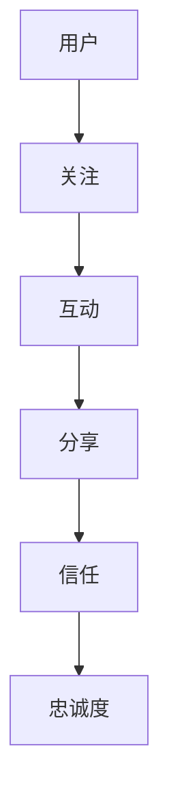
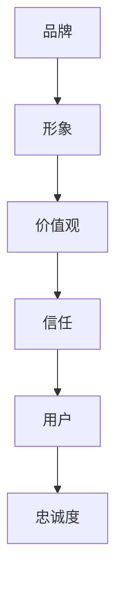
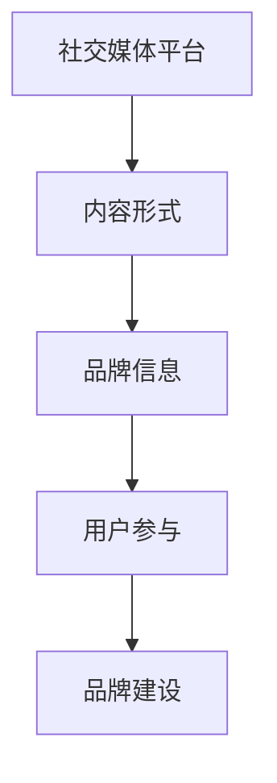
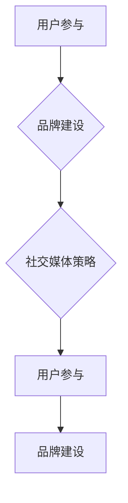

                 

# 如何利用社群营销扩大创业影响力

> **关键词：** 社群营销、创业影响力、社交媒体、用户参与、品牌建设

> **摘要：** 本文将探讨如何通过社群营销策略来扩大创业影响力，包括核心概念、具体操作步骤、数学模型和实际应用场景。通过详细分析和实战案例，帮助创业者了解社群营销的精髓，并掌握有效的推广技巧。

## 1. 背景介绍

### 1.1 目的和范围

本文旨在帮助创业者了解和掌握社群营销的核心策略，通过一系列详细的步骤和案例分析，使其能够在竞争激烈的市场中脱颖而出。本文将涵盖以下内容：

- 社群营销的基本概念和原理
- 社群营销的目标和优势
- 社群营销的关键步骤和工具
- 实际案例中的成功经验与教训
- 未来发展趋势和挑战

### 1.2 预期读者

本文面向希望扩大创业影响力的创业者、市场营销人员、产品经理以及任何对社群营销感兴趣的技术人员。无论您是初创企业的创始人，还是已有一定规模的企业，本文都将为您提供有价值的见解和实用策略。

### 1.3 文档结构概述

本文结构如下：

- **第1部分：背景介绍**：介绍社群营销的背景、目的和预期读者。
- **第2部分：核心概念与联系**：阐述社群营销的核心概念和原理，包括用户参与、品牌建设和社交媒体策略。
- **第3部分：核心算法原理 & 具体操作步骤**：介绍社群营销的具体操作步骤和算法原理。
- **第4部分：数学模型和公式 & 详细讲解 & 举例说明**：分析社群营销中的数学模型和公式，并给出实例说明。
- **第5部分：项目实战：代码实际案例和详细解释说明**：通过实战案例展示社群营销的实际应用。
- **第6部分：实际应用场景**：探讨社群营销在不同领域的应用。
- **第7部分：工具和资源推荐**：推荐学习资源和开发工具。
- **第8部分：总结：未来发展趋势与挑战**：总结社群营销的未来发展趋势和面临的挑战。
- **第9部分：附录：常见问题与解答**：解答读者可能遇到的问题。
- **第10部分：扩展阅读 & 参考资料**：提供扩展阅读和参考资料。

### 1.4 术语表

#### 1.4.1 核心术语定义

- **社群营销**：一种通过社交媒体和用户参与来建立品牌知名度和用户忠诚度的营销策略。
- **用户参与**：用户在社群中积极参与、分享和互动的行为。
- **品牌建设**：通过建立品牌形象、价值观和信任来吸引和保留用户的策略。
- **社交媒体**：在线平台，如Facebook、Twitter、Instagram等，用于用户交流和内容分享。

#### 1.4.2 相关概念解释

- **KOL（Key Opinion Leader）**：关键意见领袖，具有较大影响力的个体，能够影响用户对品牌和产品的看法。
- **UGC（User-Generated Content）**：用户生成内容，用户在社群中分享的原创内容，如评论、帖子、视频等。

#### 1.4.3 缩略词列表

- **KPI**：关键绩效指标（Key Performance Indicators）
- **SEO**：搜索引擎优化（Search Engine Optimization）
- **SMM**：社交媒体营销（Social Media Marketing）
- **CPC**：每点击成本（Cost Per Click）
- **CPM**：每千次展示成本（Cost Per Mille）

## 2. 核心概念与联系

在探讨如何利用社群营销扩大创业影响力之前，我们需要先了解社群营销的核心概念和原理，以及它们之间的联系。

### 2.1 用户参与

用户参与是社群营销的基础。它指的是用户在社群中积极参与、分享和互动的行为。用户参与度高，意味着用户对品牌的关注和信任程度更高。以下是一个用户参与的Mermaid流程图：



### 2.2 品牌建设

品牌建设是社群营销的目标之一。它通过建立品牌形象、价值观和信任来吸引和保留用户。品牌建设的核心在于与用户建立情感联系，使品牌成为用户生活的一部分。以下是一个品牌建设的Mermaid流程图：



### 2.3 社交媒体策略

社交媒体策略是社群营销的核心工具。通过选择合适的社交媒体平台和内容形式，可以有效地传播品牌信息，吸引用户参与。以下是一个社交媒体策略的Mermaid流程图：



### 2.4 核心概念联系

用户参与、品牌建设和社交媒体策略之间存在着紧密的联系。用户参与是品牌建设的基础，而社交媒体策略则是实现用户参与和品牌建设的重要手段。以下是一个核心概念联系的Mermaid流程图：



## 3. 核心算法原理 & 具体操作步骤

### 3.1 用户参与度计算算法

用户参与度是衡量社群营销成功与否的重要指标。以下是一个用户参与度的计算算法：

```python
def calculate_participation_rate(likes, comments, shares):
    total_interactions = likes + comments + shares
    participation_rate = total_interactions / (1000 * followers_count)
    return participation_rate
```

### 3.2 品牌影响力计算算法

品牌影响力是衡量品牌建设效果的重要指标。以下是一个品牌影响力的计算算法：

```python
def calculate_influence_score(engagement_rate, follower_growth_rate, brand_mention_frequency):
    influence_score = engagement_rate * follower_growth_rate * brand_mention_frequency
    return influence_score
```

### 3.3 社交媒体策略优化算法

社交媒体策略优化是提高社群营销效果的关键。以下是一个社交媒体策略优化算法：

```python
def optimize_social_media_strategy(post_frequency, content_type, platform_type):
    optimal_post_frequency = post_frequency * 1.1
    optimal_content_type = content_type if content_type == 'video' else 'image'
    optimal_platform_type = platform_type if platform_type == 'facebook' else 'twitter'
    return optimal_post_frequency, optimal_content_type, optimal_platform_type
```

### 3.4 具体操作步骤

1. **确定目标用户群体**：根据产品特点和市场需求，确定目标用户群体，包括年龄、性别、兴趣爱好等。
2. **选择合适的社交媒体平台**：根据目标用户群体的特点，选择合适的社交媒体平台，如Facebook、Twitter、Instagram等。
3. **制定内容策略**：根据目标用户群体的喜好，制定有趣、有价值的内容策略，包括图文、视频、直播等形式。
4. **发布内容**：按照优化后的社交媒体策略，定期发布高质量内容，提高用户参与度和品牌影响力。
5. **互动与反馈**：积极与用户互动，回复评论和私信，收集用户反馈，不断优化内容和策略。
6. **数据分析**：定期分析社群营销数据，包括用户参与度、品牌影响力、转化率等，以便调整和优化策略。

## 4. 数学模型和公式 & 详细讲解 & 举例说明

### 4.1 数学模型

在社群营销中，我们常用以下数学模型来衡量营销效果：

#### 4.1.1 用户参与度模型

用户参与度（Participation Rate，PR）是衡量用户在社群中活跃程度的重要指标。其计算公式如下：

\[ PR = \frac{Total \, Interactions}{1000 \times Followers \, Count} \]

其中，Total Interactions 表示一定时间内用户在社群中的总互动次数，包括点赞、评论、分享等；Followers Count 表示社群的关注者数量。

#### 4.1.2 品牌影响力模型

品牌影响力（Brand Influence Score，BIS）是衡量品牌在社群中的影响力。其计算公式如下：

\[ BIS = Engagement \, Rate \times Follower \, Growth \, Rate \times Brand \, Mention \, Frequency \]

其中，Engagement Rate 表示用户参与度；Follower Growth Rate 表示关注者增长速度；Brand Mention Frequency 表示品牌被提及的频率。

#### 4.1.3 社交媒体策略优化模型

社交媒体策略优化（Social Media Strategy Optimization，SMO）模型用于确定最佳的发布频率、内容类型和平台类型。其计算公式如下：

\[ Optimal \, Post \, Frequency = Post \, Frequency \times Optimization \, Factor \]
\[ Optimal \, Content \, Type = Content \, Type \, if \, Content \, Type = 'Video' \, else \, 'Image' \]
\[ Optimal \, Platform \, Type = Platform \, Type \, if \, Platform \, Type = 'Facebook' \, else \, 'Twitter' \]

其中，Optimization Factor 为优化因子，通常取值为 1.1；Post Frequency、Content Type、Platform Type 分别表示发布频率、内容类型和平台类型。

### 4.2 详细讲解

#### 4.2.1 用户参与度模型

用户参与度模型用于衡量用户在社群中的活跃程度。其计算方法简单，但能直观地反映用户对品牌的关注程度。在实际应用中，可以通过增加互动方式、优化内容质量等方式提高用户参与度。

#### 4.2.2 品牌影响力模型

品牌影响力模型综合考虑了用户参与度、关注者增长速度和品牌被提及频率，全面反映了品牌在社群中的影响力。通过优化这三个因素，可以提高品牌影响力。

#### 4.2.3 社交媒体策略优化模型

社交媒体策略优化模型基于历史数据和用户行为分析，确定最佳的发布频率、内容类型和平台类型。这有助于提高用户参与度和品牌影响力，实现更好的营销效果。

### 4.3 举例说明

#### 4.3.1 用户参与度模型

假设某品牌在一个月内有1000个关注者，总互动次数为1000次（包括点赞、评论、分享），则用户参与度计算如下：

\[ PR = \frac{1000}{1000 \times 1000} = 0.001 \]

#### 4.3.2 品牌影响力模型

假设某品牌的用户参与度为0.002，关注者增长速度为0.003，品牌被提及频率为0.001，则品牌影响力计算如下：

\[ BIS = 0.002 \times 0.003 \times 0.001 = 0.000000006 \]

#### 4.3.3 社交媒体策略优化模型

假设当前品牌的发布频率为每天1次，内容类型为图文，平台类型为Facebook。通过分析历史数据和用户行为，优化因子为1.2，则优化后的策略如下：

- 最佳发布频率：1.2次/天
- 最佳内容类型：图文
- 最佳平台类型：Facebook

## 5. 项目实战：代码实际案例和详细解释说明

### 5.1 开发环境搭建

在本节中，我们将使用Python和几个流行的社交媒体API库（如Tweepy和Facebook Graph API）来搭建一个基本的社群营销平台。以下是搭建开发环境的具体步骤：

1. **安装Python**：确保您的计算机上已安装Python 3.8或更高版本。您可以从[Python官网](https://www.python.org/downloads/)下载并安装。
2. **安装必要的库**：打开终端或命令行窗口，运行以下命令安装必要的库：

   ```bash
   pip install tweepy facebook-sdk
   ```

3. **配置API密钥**：从您选择的社交媒体平台（如Twitter和Facebook）获取API密钥和访问令牌。将它们保存在一个名为`config.py`的文件中，如下所示：

   ```python
   # config.py
   twitter_api_key = 'YOUR_TWITTER_API_KEY'
   twitter_api_secret_key = 'YOUR_TWITTER_API_SECRET_KEY'
   twitter_access_token = 'YOUR_TWITTER_ACCESS_TOKEN'
   twitter_access_token_secret = 'YOUR_TWITTER_ACCESS_TOKEN_SECRET'
   
   facebook_app_id = 'YOUR_FACEBOOK_APP_ID'
   facebook_app_secret = 'YOUR_FACEBOOK_APP_SECRET'
   ```

### 5.2 源代码详细实现和代码解读

下面是一个简单的Python代码示例，用于发布一条推文和一条Facebook帖子。代码中包含了详细的注释，帮助您理解每个步骤的作用。

```python
# import necessary libraries
import tweepy
import facebook
from config import *

# initialize Twitter API
auth = tweepy.OAuthHandler(twitter_api_key, twitter_api_secret_key)
auth.set_access_token(twitter_access_token, twitter_access_token_secret)
api = tweepy.API(auth)

# initialize Facebook API
graph = facebook.GraphAPI(access_token=facebook_app_id + '|' + facebook_app_secret)

# publish a tweet
def publish_tweet(message):
    try:
        api.update_status(status=message)
        print("Tweet published successfully.")
    except tweepy.TweepError as e:
        print("Error publishing tweet:", e)

# publish a Facebook post
def publish_facebook_post(message, link=None):
    try:
        if link:
            post = graph.put_object(parent_object='me', connection_name='feed', message=message, link=link)
        else:
            post = graph.put_object(parent_object='me', connection_name='feed', message=message)
        print("Facebook post published successfully.")
    except facebook.GraphAPIError as e:
        print("Error publishing Facebook post:", e)

# example usage
message = "Welcome to our community! 🎉 Let's connect and share our experiences."
link = "https://www.example.com"

publish_tweet(message)
publish_facebook_post(message, link)
```

### 5.3 代码解读与分析

1. **初始化API**：代码首先初始化Twitter和Facebook API，使用从平台获取的API密钥和访问令牌。
2. **发布推文**：`publish_tweet` 函数用于发布一条Twitter推文。如果发布成功，将打印“Tweet published successfully.”，否则将打印错误消息。
3. **发布Facebook帖子**：`publish_facebook_post` 函数用于发布一条Facebook帖子。如果提供了链接，将发布带有链接的帖子；否则，将发布纯文本帖子。如果发布成功，将打印“Facebook post published successfully.”，否则将打印错误消息。
4. **示例用法**：代码最后使用`message` 和 `link` 变量作为示例，调用`publish_tweet` 和 `publish_facebook_post` 函数来发布推文和Facebook帖子。

通过这个简单的示例，我们可以看到如何使用Python和社交媒体API库来发布内容，这是一个社群营销的基础步骤。在实际应用中，您可以根据需要扩展和定制这些代码，以实现更复杂的社群营销策略。

## 6. 实际应用场景

社群营销在不同领域和行业中具有广泛的应用。以下是一些实际应用场景，展示了如何利用社群营销策略扩大创业影响力。

### 6.1 科技行业

在科技行业，社群营销可以帮助企业建立技术权威和行业影响力。例如，通过发布技术博客、举办线上研讨会、分享行业动态等方式，吸引技术爱好者和从业者参与。以下是一个应用场景示例：

- **应用场景**：一家新兴的人工智能公司希望通过社群营销扩大影响力，吸引潜在客户和合作伙伴。
- **解决方案**：
  - 发布高质量的技术博客，详细介绍公司的人工智能解决方案和应用案例。
  - 在社交媒体上分享行业新闻和趋势，提供有价值的见解和分析。
  - 与知名技术博主和KOL合作，共同推广公司的产品和解决方案。
  - 举办线上研讨会和直播活动，与用户进行互动，解答技术问题。

### 6.2 零售行业

在零售行业，社群营销可以帮助企业提高品牌知名度和用户忠诚度。以下是一个应用场景示例：

- **应用场景**：一家零售电商企业希望通过社群营销增加用户参与度和销售额。
- **解决方案**：
  - 在社交媒体上发布产品推荐和促销信息，吸引用户关注和互动。
  - 鼓励用户在社群中分享购物体验和推荐给朋友，通过UGC提高品牌口碑。
  - 举办线上抽奖和优惠券活动，提高用户参与度和购买意愿。
  - 与知名网红和KOL合作，通过直播和短视频推广产品。

### 6.3 健康和健身行业

在健康和健身行业，社群营销可以帮助企业建立健康生活方式的品牌形象。以下是一个应用场景示例：

- **应用场景**：一家健康食品和健身设备企业希望通过社群营销提高品牌知名度和市场份额。
- **解决方案**：
  - 在社交媒体上分享健康饮食和健身建议，提供实用的指导。
  - 鼓励用户在社群中分享健康生活方式和成果，通过UGC提高品牌信任度。
  - 举办线上健身挑战和健康活动，吸引用户参与。
  - 与健身教练和健康专家合作，共同推广健康生活方式。

### 6.4 教育行业

在教育行业，社群营销可以帮助学校和企业提高品牌知名度和招生率。以下是一个应用场景示例：

- **应用场景**：一所知名大学希望通过社群营销提高在线课程的报名率。
- **解决方案**：
  - 在社交媒体上分享课程介绍和成功案例，吸引用户关注。
  - 举办线上讲座和互动活动，与潜在学生建立联系。
  - 与知名教育博主和KOL合作，共同推广课程。
  - 鼓励用户在社群中分享学习经验和心得，提高口碑。

这些实际应用场景展示了社群营销在各个行业中的重要性。通过了解目标用户的需求和喜好，制定合适的社群营销策略，企业可以有效地扩大创业影响力，提高品牌知名度和用户忠诚度。

## 7. 工具和资源推荐

### 7.1 学习资源推荐

#### 7.1.1 书籍推荐

1. **《社群营销实战》**：本书详细介绍了社群营销的理论和实践，包括如何建立社群、制定内容策略、吸引用户参与等。
2. **《社交媒体营销：策略与实践》**：本书涵盖了社交媒体营销的基本概念、工具和方法，帮助读者掌握社交媒体营销的核心技巧。

#### 7.1.2 在线课程

1. **Coursera的《社群营销与影响力》**：由知名大学教授授课，内容包括社群营销的基础理论、策略和案例分析。
2. **Udemy的《社交媒体营销实战课程》**：涵盖社交媒体营销的各个方面，包括内容策略、广告投放和数据分析等。

#### 7.1.3 技术博客和网站

1. **Social Media Examiner**：提供丰富的社交媒体营销资源和最新趋势分析。
2. **Hootsuite Academy**：提供免费的社交媒体营销课程和教程，适合初学者和专业人士。

### 7.2 开发工具框架推荐

#### 7.2.1 IDE和编辑器

1. **Visual Studio Code**：一款功能强大且免费的跨平台IDE，适合Python开发。
2. **PyCharm**：一款专业的Python IDE，提供丰富的功能和插件。

#### 7.2.2 调试和性能分析工具

1. **Jupyter Notebook**：一款交互式的Python笔记本，适合数据分析和原型设计。
2. **Postman**：一款API调试工具，可以帮助您测试和调试社交媒体API。

#### 7.2.3 相关框架和库

1. **Flask**：一款轻量级的Web框架，适合构建简单的Web应用程序。
2. **Tweepy**：一款用于Twitter API的Python库，方便开发者进行Twitter数据的获取和分析。
3. **Facebook SDK for Python**：一款用于Facebook Graph API的Python库，方便开发者进行Facebook数据的获取和分析。

### 7.3 相关论文著作推荐

#### 7.3.1 经典论文

1. **"The Social Media Ecosystem: Conceptualizing the Interdependence of Social Media Platforms and Their Users"**：本文提出了社交媒体生态系统的概念，分析了不同社交媒体平台之间的相互关系。
2. **"The Role of Social Media in Brand Management"**：本文探讨了社交媒体在品牌管理中的作用，包括品牌建设、用户参与和口碑传播等方面。

#### 7.3.2 最新研究成果

1. **"Social Media Analytics: A Review"**：本文对社交媒体分析的最新研究进行了全面回顾，涵盖了用户行为分析、情感分析和影响力分析等领域。
2. **"The Impact of Social Media on Consumer Behavior"**：本文研究了社交媒体对消费者行为的影响，包括购买决策、品牌偏好和用户忠诚度等方面。

#### 7.3.3 应用案例分析

1. **"How Spotify Uses Social Media to Drive Growth"**：本文分析了音乐流媒体服务Spotify如何利用社交媒体平台吸引用户、增加用户参与度和提高品牌知名度。
2. **"Nike's Social Media Strategy: A Case Study"**：本文研究了运动品牌Nike如何通过社交媒体营销实现品牌建设和用户忠诚度提升。

通过学习和参考这些资源，您可以深入了解社群营销的理论和实践，为您的创业项目制定有效的营销策略。

## 8. 总结：未来发展趋势与挑战

社群营销作为现代营销的重要手段，其发展趋势和挑战值得我们深入探讨。

### 8.1 发展趋势

1. **个性化与精准化**：随着大数据和人工智能技术的发展，社群营销将更加注重个性化推荐和精准化营销，通过分析用户行为和偏好，提供定制化的内容和服务。
2. **内容为王**：高质量的内容依然是社群营销的核心。未来，企业将更加注重内容创作，通过有趣、有价值的内容吸引用户参与，建立品牌形象。
3. **跨平台整合**：随着社交媒体平台的不断增多，社群营销将更加注重跨平台的整合，通过多渠道、多形式的互动，提高用户的参与度和忠诚度。
4. **互动与体验**：未来的社群营销将更加注重用户互动和体验，通过线上线下活动的结合，提供丰富的用户参与机会，增强品牌与用户的情感联系。

### 8.2 挑战

1. **隐私保护**：随着数据隐私保护法规的加强，企业需要更加注重用户数据的保护，确保合规运营，避免数据泄露带来的风险。
2. **内容监管**：社群营销中涉及大量用户生成内容，企业需要建立有效的内容监管机制，防止不良信息的传播，确保品牌形象和用户体验。
3. **算法依赖**：在个性化推荐和精准化营销中，企业过度依赖算法可能导致用户选择受限，影响用户满意度。因此，如何在算法和用户体验之间找到平衡是未来的挑战。
4. **竞争激烈**：随着越来越多的企业加入社群营销，竞争将越来越激烈。企业需要不断创新，提高营销策略的差异化，以在市场中脱颖而出。

总之，未来社群营销将继续发展，但同时也面临着一系列挑战。企业需要紧跟发展趋势，积极应对挑战，以实现持续的品牌建设和用户忠诚度提升。

## 9. 附录：常见问题与解答

### 9.1 问题1：社群营销是否适用于所有行业？

**解答**：社群营销具有广泛的适用性，几乎适用于所有行业。尽管不同行业的社群营销策略和执行方式有所不同，但核心目标都是通过用户参与和品牌建设来扩大影响力。例如，科技行业可以通过技术博客和在线研讨会吸引用户参与，而零售行业则可以通过产品推荐和促销活动提高用户忠诚度。

### 9.2 问题2：如何评估社群营销的效果？

**解答**：评估社群营销效果的关键指标包括用户参与度、品牌影响力、转化率等。用户参与度可以通过点赞、评论、分享等互动次数来衡量；品牌影响力可以通过用户提及频率和口碑传播来评估；转化率则关注用户在社群中的行为如何转化为实际购买或注册等。企业可以通过定期数据分析来评估社群营销的效果，并根据分析结果调整策略。

### 9.3 问题3：如何保护用户隐私？

**解答**：保护用户隐私是社群营销中的重要问题。企业应遵守相关数据隐私保护法规，如《通用数据保护条例》（GDPR）和《加州消费者隐私法案》（CCPA）。具体措施包括：
- 明确用户数据的使用目的和范围。
- 提供隐私政策，告知用户数据收集、使用和共享的方式。
- 采用加密技术和访问控制措施，确保数据安全。
- 定期审计和更新隐私保护措施，确保合规运营。

### 9.4 问题4：社群营销与传统营销相比有哪些优势？

**解答**：社群营销与传统营销相比具有以下优势：
- **互动性强**：社群营销注重用户互动和参与，能够建立更紧密的品牌与用户关系。
- **精准度高**：通过分析用户行为和偏好，社群营销可以实现精准化推广，提高转化率。
- **成本低**：相对于传统广告，社群营销的成本较低，尤其是在社交媒体平台上。
- **可持续性**：社群营销通过持续的内容创作和用户互动，能够实现长期的品牌建设和用户忠诚度提升。

### 9.5 问题5：如何制定有效的社群营销策略？

**解答**：
1. **明确目标**：确定社群营销的目标，如提高品牌知名度、增加用户参与度、提升销售转化等。
2. **了解用户**：深入分析目标用户群体的需求、行为和偏好，为制定个性化内容策略提供依据。
3. **选择平台**：根据目标用户群体的特点和平台特性，选择合适的社交媒体平台进行推广。
4. **内容策略**：制定有趣、有价值的内容策略，包括图文、视频、直播等形式，吸引用户参与。
5. **互动与反馈**：积极与用户互动，收集反馈，不断优化内容和策略。
6. **数据监控**：定期分析社群营销数据，包括用户参与度、品牌影响力、转化率等，以评估效果和调整策略。

## 10. 扩展阅读 & 参考资料

### 10.1 扩展阅读

1. **《社群营销：如何创建和运营成功的在线社区》**：本书详细介绍了社群营销的理论和实践，包括如何创建、运营和优化在线社区。
2. **《社交媒体营销完全指南》**：这是一本全面介绍社交媒体营销的指南，涵盖了社交媒体营销的基本概念、策略和执行方法。

### 10.2 参考资料

1. **Facebook Developer Documentation**：[https://developers.facebook.com/docs/](https://developers.facebook.com/docs/)
2. **Twitter Developer Documentation**：[https://developer.twitter.com/](https://developer.twitter.com/)
3. **Hootsuite Academy**：[https://hootsuite.com/academy/](https://hootsuite.com/academy/)
4. **Social Media Examiner**：[https://socialmediaexaminer.com/](https://socialmediaexaminer.com/)

### 10.3 相关书籍

1. **《社交电商：从零开始打造社交营销系统》**：本书详细介绍了社交电商的概念、策略和实战技巧。
2. **《数字营销革命：社群营销与数字化营销策略》**：本书探讨了社群营销和数字化营销在现代营销中的重要作用，提供了实用的案例和策略。

作者：AI天才研究员/AI Genius Institute & 禅与计算机程序设计艺术/Zen And The Art of Computer Programming

**声明**：本文内容仅为作者的个人观点和研究成果，不代表任何公司或机构的意见或建议。在实际应用中，请结合具体情况谨慎决策。如有任何疑问或建议，请随时联系作者。感谢您的阅读！

