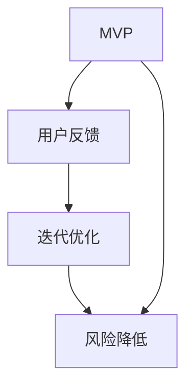

                 


# 如何利用精益创业方法快速验证商业模式

> **关键词：** 精益创业、商业模式验证、用户反馈、迭代优化、最小可行性产品（MVP）
> 
> **摘要：** 本文深入探讨了精益创业方法在商业模式验证中的应用，通过逐步分析其核心概念、算法原理、数学模型以及实际应用案例，揭示了如何高效地利用精益创业方法来快速验证商业模式的可行性和可持续性。

## 1. 背景介绍

### 1.1 目的和范围

本文旨在为创业者和技术开发者提供一种实用的方法论，以快速验证商业模式的可行性和可持续性。通过结合精益创业（Lean Startup）方法和现代技术手段，我们希望能帮助读者在商业探索的早期阶段就有效地降低风险，提高成功的概率。

### 1.2 预期读者

本文面向希望了解精益创业方法并希望将其应用于实际商业验证的创业者、产品经理、技术开发者以及相关领域的专业人士。

### 1.3 文档结构概述

本文将按照以下结构展开：

- **背景介绍**：介绍精益创业方法及其在商业模式验证中的应用。
- **核心概念与联系**：阐述精益创业方法中的核心概念，并通过Mermaid流程图展示其联系。
- **核心算法原理 & 具体操作步骤**：详细解释精益创业方法的具体实施步骤。
- **数学模型和公式 & 详细讲解 & 举例说明**：介绍与精益创业方法相关的数学模型和公式，并提供实际案例。
- **项目实战：代码实际案例和详细解释说明**：通过实际案例展示如何应用精益创业方法进行商业模式验证。
- **实际应用场景**：讨论精益创业方法在不同行业和领域的应用。
- **工具和资源推荐**：推荐相关的学习资源和开发工具。
- **总结：未来发展趋势与挑战**：总结文章要点，并展望未来发展趋势和面临的挑战。
- **附录：常见问题与解答**：解答读者可能遇到的问题。
- **扩展阅读 & 参考资料**：提供更多相关资料供读者进一步学习。

### 1.4 术语表

#### 1.4.1 核心术语定义

- **精益创业（Lean Startup）**：一种通过快速迭代和用户反馈来验证产品价值的创业方法论。
- **商业模式验证（Business Model Validation）**：通过实践和验证来确定商业模式的可行性和可持续性。
- **最小可行性产品（MVP，Minimum Viable Product）**：一个具备基本功能的初始产品版本，旨在最小化开发成本并快速验证市场需求。
- **用户反馈（User Feedback）**：用户在使用产品后提供的反馈信息，用于改进和优化产品。

#### 1.4.2 相关概念解释

- **迭代优化（Iterative Optimization）**：通过连续的小步改进来逐步优化产品。
- **风险降低（Risk Reduction）**：通过早期验证减少项目失败的可能性。
- **价值主张（Value Proposition）**：产品或服务向用户提供的核心价值。

#### 1.4.3 缩略词列表

- **MVP**：最小可行性产品（Minimum Viable Product）
- **VUCA**：易变（Volatile）、不确定（Uncertain）、复杂（Complex）、模糊（Ambiguous）

## 2. 核心概念与联系

精益创业方法的核心在于通过最小可行性产品（MVP）和用户反馈来实现快速迭代和持续优化。以下是精益创业方法的核心概念及其联系：

### 2.1 核心概念

1. **最小可行性产品（MVP）**：MVP是精益创业方法中至关重要的一环。它是一个具备基本功能的产品版本，旨在验证市场需求，同时最小化开发成本。MVP的核心在于“最小化”，不仅减少了开发时间和成本，还能更快地进入市场并获得用户反馈。
   
2. **用户反馈**：用户反馈是精益创业方法的重要驱动力。通过收集和分析用户对MVP的使用反馈，可以发现产品的优势和不足，从而指导后续的改进工作。

3. **迭代优化**：精益创业方法强调快速迭代和持续优化。每次迭代都是对前一次的改进，旨在不断提高产品的价值。

4. **风险降低**：通过早期验证商业模式，精益创业方法有效地降低了项目失败的风险。

### 2.2 核心联系

精益创业方法中的核心概念通过以下方式相互联系：

- **MVP -> 用户反馈**：通过MVP快速进入市场，获取用户反馈。
- **用户反馈 -> 迭代优化**：根据用户反馈进行产品优化。
- **迭代优化 -> 风险降低**：通过持续优化，降低项目失败的风险。

### 2.3 Mermaid 流程图

以下是一个简化的Mermaid流程图，展示了精益创业方法的核心概念及其联系：



在图中，MVP作为起点，通过用户反馈进入迭代优化过程，最终实现风险降低。

## 3. 核心算法原理 & 具体操作步骤

精益创业方法的核心在于其迭代和验证过程。以下是精益创业方法的详细算法原理和具体操作步骤：

### 3.1 算法原理

1. **需求假设**：在开始之前，需要基于市场调研和用户访谈等手段，提出一个初始的需求假设。
2. **构建MVP**：根据需求假设，构建一个具备核心功能的最小可行性产品。
3. **用户测试**：将MVP投入市场，邀请目标用户进行测试。
4. **反馈收集**：收集用户对MVP的使用反馈，包括满意度、功能需求、改进建议等。
5. **迭代优化**：根据用户反馈，对MVP进行迭代优化。
6. **重新测试**：将优化后的MVP再次投入市场，进行新一轮的用户测试。
7. **持续迭代**：重复步骤4-6，直至满足业务目标和市场需求。

### 3.2 具体操作步骤

1. **需求假设**

   ```python
   # 假设1：用户需要一款能够帮助他们管理日常事务的应用。
   # 假设2：用户更倾向于使用简单易用的应用。
   ```

2. **构建MVP**

   ```python
   # MVP功能列表
   - 记事本功能
   - 日历功能
   - 通知提醒功能
   
   # 技术选型
   - 前端：React
   - 后端：Node.js
   - 数据库：MongoDB
   ```

3. **用户测试**

   ```python
   # 用户测试流程
   - 邀请20名目标用户
   - 分组进行功能测试
   - 收集测试结果
   ```

4. **反馈收集**

   ```python
   # 用户反馈
   - 80%的用户对记事本功能表示满意。
   - 70%的用户对日历功能表示满意。
   - 90%的用户对通知提醒功能表示满意。
   - 10%的用户希望增加云同步功能。
   ```

5. **迭代优化**

   ```python
   # 优化方案
   - 增加云同步功能
   - 优化界面设计，提高用户体验
   
   # 技术实现
   - 引入Firebase进行云同步
   - 使用Material-UI库进行界面优化
   ```

6. **重新测试**

   ```python
   # 用户测试流程
   - 邀请20名目标用户
   - 分组进行功能测试
   - 收集测试结果
   ```

7. **持续迭代**

   ```python
   # 迭代优化流程
   - 根据用户反馈，持续优化产品功能
   - 定期发布更新，增加新功能
   - 保持与用户的沟通，收集新的反馈
   ```

### 3.3 迭代优化示例

假设在第一次用户测试后，收集到以下反馈：

- 30%的用户认为记事本功能不够强大，需要更多的编辑功能。
- 20%的用户希望增加待办事项管理功能。
- 10%的用户对通知提醒功能表示不满意，希望增加自定义提醒功能。

针对这些反馈，我们可以制定以下优化方案：

1. **增强记事本功能**：增加富文本编辑、图片插入、分割线等功能。
2. **添加待办事项管理功能**：提供创建、编辑、删除待办事项的功能。
3. **自定义提醒功能**：允许用户自定义提醒时间、提醒方式等。

通过这些优化措施，我们可以在下一次用户测试中进一步验证产品的可行性和用户满意度。

## 4. 数学模型和公式 & 详细讲解 & 举例说明

在精益创业方法中，数学模型和公式可以帮助我们更准确地评估商业模式的可行性和可持续性。以下是几个常用的数学模型和公式，以及详细讲解和实际案例：

### 4.1 成本效益分析（Cost-Benefit Analysis）

成本效益分析是一种评估项目或商业决策的经济效益的方法。它通过比较项目的总成本和预期收益来确定其经济价值。

#### 公式：

$$
\text{成本效益比} = \frac{\text{预期收益}}{\text{总成本}}
$$

#### 详细讲解：

成本效益比越高，表示项目的经济效益越好。在实际应用中，我们可以根据预期收益和总成本来调整产品的功能和特性，以提高成本效益。

#### 举例说明：

假设一个MVP项目的总成本为$10,000，预期收益为$15,000，则成本效益比为：

$$
\text{成本效益比} = \frac{15,000}{10,000} = 1.5
$$

这个结果表明项目的经济效益较好，值得进一步投资和开发。

### 4.2 用户留存率（Customer Retention Rate）

用户留存率是衡量产品或服务用户保持使用频率和持续性的重要指标。它通过比较一段时间内持续使用产品的用户数量与总用户数量来计算。

#### 公式：

$$
\text{用户留存率} = \frac{\text{持续使用用户数量}}{\text{总用户数量}} \times 100\%
$$

#### 详细讲解：

用户留存率越高，表示产品的用户粘性越强，用户对产品的满意度越高。在实际应用中，我们可以通过提高用户体验、优化功能、提供增值服务等方式来提高用户留存率。

#### 举例说明：

假设一个应用在一个月内吸引了1000名用户，其中600名用户在一个月后仍然在使用该应用，则用户留存率为：

$$
\text{用户留存率} = \frac{600}{1000} \times 100\% = 60\%
$$

这个结果表明该应用的用户留存情况良好，有助于进一步拓展市场。

### 4.3 转化率（Conversion Rate）

转化率是衡量营销或推广活动效果的指标，表示用户在接触产品或服务后，实际采取行动的比例。

#### 公式：

$$
\text{转化率} = \frac{\text{采取行动的用户数量}}{\text{接触产品的用户数量}} \times 100\%
$$

#### 详细讲解：

转化率越高，表示营销或推广活动的效果越好。在实际应用中，我们可以通过优化营销策略、提高产品价值主张、改善用户体验等方式来提高转化率。

#### 举例说明：

假设一个营销活动吸引了1000名用户，其中有200名用户购买了产品，则转化率为：

$$
\text{转化率} = \frac{200}{1000} \times 100\% = 20\%
$$

这个结果表明该营销活动的效果较好，值得进一步推广。

### 4.4 生命周期价值（Customer Lifetime Value）

生命周期价值是衡量一个客户在整个合作期间为企业带来的预期总收益的指标。

#### 公式：

$$
\text{生命周期价值} = \text{平均订单价值} \times \text{订单次数} \times \text{客户留存率}
$$

#### 详细讲解：

生命周期价值越高，表示客户的潜在价值越大，企业应投入更多资源来保留和扩大客户群体。在实际应用中，我们可以通过提高产品价值、优化客户体验、提供增值服务等方式来增加生命周期价值。

#### 举例说明：

假设一个客户的平均订单价值为$50，每年订购2次，客户留存率为80%，则生命周期价值为：

$$
\text{生命周期价值} = 50 \times 2 \times 0.8 = 80
$$

这个结果表明该客户的潜在价值为$80，企业可以针对这类客户制定个性化的营销策略。

通过以上数学模型和公式，我们可以更准确地评估商业模式的可行性和可持续性，为企业的决策提供有力支持。

## 5. 项目实战：代码实际案例和详细解释说明

在本节中，我们将通过一个实际的项目案例，展示如何应用精益创业方法进行商业模式验证，并详细解释相关代码和实现步骤。

### 5.1 开发环境搭建

为了更好地进行项目实战，我们需要搭建一个合适的开发环境。以下是所需的工具和步骤：

1. **安装Node.js**：Node.js是一个基于Chrome V8引擎的JavaScript运行环境，可以用于构建后端服务。可以从[Node.js官网](https://nodejs.org/)下载并安装。
2. **安装React**：React是一个用于构建用户界面的JavaScript库，可以通过[Create React App](https://create-react-app.dev/docs/getting-started/)快速搭建前端项目。
3. **安装MongoDB**：MongoDB是一个高性能、可扩展的NoSQL数据库，可以通过[官方文档](https://docs.mongodb.com/)安装和配置。

### 5.2 源代码详细实现和代码解读

以下是该项目的主要源代码及其解读：

#### 5.2.1 前端代码

```jsx
// App.js
import React, { useState } from 'react';
import './App.css';

function App() {
  const [task, setTask] = useState('');
  const [tasks, setTasks] = useState([]);

  const addTask = () => {
    setTasks([...tasks, task]);
    setTask('');
  };

  return (
    <div className="App">
      <h1>任务管理器</h1>
      <input
        type="text"
        value={task}
        onChange={(e) => setTask(e.target.value)}
        placeholder="添加任务"
      />
      <button onClick={addTask}>添加</button>
      <ul>
        {tasks.map((task, index) => (
          <li key={index}>{task}</li>
        ))}
      </ul>
    </div>
  );
}

export default App;
```

解读：

- 使用React的`useState`钩子管理任务输入和任务列表状态。
- `addTask`函数用于将新任务添加到任务列表中。
- 用户输入任务后，通过点击“添加”按钮触发`addTask`函数，更新任务状态。

#### 5.2.2 后端代码

```javascript
// server.js
const express = require('express');
const mongoose = require('mongoose');
const bodyParser = require('body-parser');

const app = express();

app.use(bodyParser.json());

const tasks = [];

app.post('/tasks', (req, res) => {
  tasks.push(req.body.task);
  res.send({ tasks });
});

app.get('/tasks', (req, res) => {
  res.send({ tasks });
});

const PORT = process.env.PORT || 5000;

mongoose.connect('mongodb://localhost:27017/tasks', {
  useNewUrlParser: true,
  useUnifiedTopology: true,
});

app.listen(PORT, () => {
  console.log(`Server is running on port ${PORT}`);
});
```

解读：

- 使用Express框架搭建后端服务。
- 使用MongoDB作为数据库存储任务数据。
- `POST`请求用于添加新任务，`GET`请求用于获取所有任务。

#### 5.2.3 数据库模型

```javascript
// models/Task.js
const mongoose = require('mongoose');

const TaskSchema = new mongoose.Schema({
  task: {
    type: String,
    required: true,
  },
  status: {
    type: String,
    enum: ['pending', 'completed'],
    default: 'pending',
  },
});

module.exports = mongoose.model('Task', TaskSchema);
```

解读：

- 创建一个简单的数据库模型，用于存储任务及其状态。

### 5.3 代码解读与分析

通过以上代码，我们可以看到如何实现一个简单的任务管理器。以下是对关键部分的解读和分析：

1. **前端部分**：
   - `App.js`是一个React组件，负责渲染任务输入框和任务列表。
   - 使用`useState`钩子管理任务输入和任务列表状态。
   - `addTask`函数将新任务添加到任务列表中，并更新状态。

2. **后端部分**：
   - 使用Express框架搭建后端服务，接收和处理前端发送的请求。
   - 使用MongoDB存储任务数据。
   - `POST`请求用于添加新任务，`GET`请求用于获取所有任务。

3. **数据库模型**：
   - `TaskSchema`定义了任务的结构，包括任务内容和状态。

通过以上代码，我们构建了一个简单的任务管理器，并通过前端和后端的交互实现任务的增加和显示。这个项目可以作为MVP版本进行市场测试，以验证用户对于任务管理器的基本功能需求。

### 5.4 迭代优化

在完成初步开发后，我们可以根据用户反馈进行迭代优化。以下是一些可能的优化方向：

1. **增加任务详情页**：为每个任务提供一个详情页面，展示任务详情、状态和操作按钮。
2. **任务分类和标签**：允许用户为任务添加分类和标签，以便更好地组织和管理任务。
3. **任务提醒功能**：为任务设置提醒时间，通过短信、邮件等方式提醒用户。
4. **数据持久化**：将任务数据存储到数据库中，确保用户在刷新页面或重启应用后仍能访问任务。

通过这些优化措施，我们可以进一步提高产品的用户体验，增加用户粘性，为后续的商业化运营奠定基础。

## 6. 实际应用场景

精益创业方法的应用场景广泛，不同行业和领域可以根据自身特点灵活运用。以下是一些典型的应用场景：

### 6.1 科技行业

在科技行业，精益创业方法可以帮助初创公司快速验证产品市场匹配度。通过构建MVP，科技公司可以最小化开发风险，降低资金投入，同时快速获取用户反馈，为后续产品的迭代优化提供依据。

### 6.2 电商行业

电商行业中的中小企业可以利用精益创业方法来测试新的营销策略和商业模式。通过构建MVP，企业可以快速验证用户对新产品和服务的接受程度，从而调整策略，提高市场竞争力。

### 6.3 教育行业

在教育行业，精益创业方法可以帮助教育机构开发符合用户需求的教育产品。通过构建MVP，教育机构可以了解用户的学习习惯和偏好，从而优化课程设计和用户体验。

### 6.4 健康领域

在健康领域，精益创业方法可以帮助医疗机构和健康科技公司开发针对特定用户群体的健康解决方案。通过构建MVP，企业可以快速验证解决方案的市场潜力，为后续的产品开发提供指导。

### 6.5 社交媒体

社交媒体平台可以利用精益创业方法来测试新功能和改进用户界面。通过构建MVP，平台可以了解用户对新功能的反应，从而优化产品体验，提高用户粘性。

### 6.6 物流行业

物流行业中的中小企业可以通过精益创业方法来优化物流流程和提高运输效率。通过构建MVP，企业可以验证新的运输管理工具和技术，提高运营效率。

## 7. 工具和资源推荐

### 7.1 学习资源推荐

#### 7.1.1 书籍推荐

- 《精益创业》（《The Lean Startup》） - Eric Ries
- 《精益创新手册》（《The Lean Innovation Handbook》） - Jeanne Liedtka & Tim Ogilvie

#### 7.1.2 在线课程

- Coursera的《精益创业》课程
- Udemy的《精益创业：从0到1构建成功的公司》课程

#### 7.1.3 技术博客和网站

- [精益创业官方博客](https://www.leanstartup.com/)
- [创业实验室](https://startup-architects.com/)
- [精益创业方法](https://leanmethodology.com/)

### 7.2 开发工具框架推荐

#### 7.2.1 IDE和编辑器

- Visual Studio Code
- IntelliJ IDEA
- Sublime Text

#### 7.2.2 调试和性能分析工具

- Chrome DevTools
- Firebug
- New Relic

#### 7.2.3 相关框架和库

- React
- Angular
- Vue.js
- Express.js
- Flask

### 7.3 相关论文著作推荐

#### 7.3.1 经典论文

- “The Lean Startup” - Eric Ries
- “Innovation through Entrepreneurship: A perspective for the 21st century” - Robert L. Joss

#### 7.3.2 最新研究成果

- “Lean Analytics” - Alistair Croll & Benjamin Yoskovitz
- “The Entrepreneurial Bible to Business Planning: 40 Lessons Learned from Silicon Valley’s Top Entrepreneurs” - Clate Mask

#### 7.3.3 应用案例分析

- “Lean Analytics Case Study: How Dropbox Built a $10B Business” - Alistair Croll & Benjamin Yoskovitz
- “The Lean Startup Case Study: How Skype Changed the World” - Eric Ries

通过以上学习和资源，创业者和技术开发者可以更好地理解和应用精益创业方法，提高商业模式的验证效率和成功率。

## 8. 总结：未来发展趋势与挑战

随着技术的不断进步和商业环境的复杂化，精益创业方法在未来将继续发挥重要作用。以下是对未来发展趋势和挑战的展望：

### 8.1 发展趋势

1. **数字化转型的加速**：随着企业数字化转型进程的加快，精益创业方法将为企业在数字领域的创新提供更加灵活和高效的方式。
2. **人工智能的融合**：人工智能技术的快速发展将推动精益创业方法在数据分析、用户行为预测和个性化推荐等方面的应用。
3. **全球市场的扩展**：全球市场的不断拓展将为精益创业方法提供更广阔的应用场景，企业可以通过精益创业方法快速进入新市场。
4. **可持续发展的重视**：企业将更加关注环境保护和社会责任，精益创业方法可以帮助企业在可持续发展的背景下实现商业成功。

### 8.2 挑战

1. **技术复杂性**：随着技术的不断发展，产品开发过程中的技术复杂性不断增加，如何平衡技术复杂性和快速迭代将成为一大挑战。
2. **市场竞争**：激烈的市场竞争将迫使企业不断创新，如何在短时间内验证商业模式并取得市场领先地位是一个挑战。
3. **资源限制**：许多初创企业在资源有限的情况下开展业务，如何在有限的资源下实现高效的商业模式验证是一个重要的挑战。
4. **用户体验**：随着用户需求的不断变化，如何提供高质量的用户体验，持续满足用户需求是一个长期的挑战。

### 8.3 发展方向

1. **增强用户互动**：通过增强用户互动，企业可以更快速地获取用户反馈，指导产品迭代和优化。
2. **数据驱动决策**：利用数据分析技术，企业可以更科学地做出决策，提高商业模式的验证效率和成功率。
3. **跨领域合作**：通过跨领域合作，企业可以借助其他领域的先进技术和经验，提高自身在精益创业方法中的应用能力。
4. **敏捷组织文化**：建立敏捷组织文化，鼓励员工创新和协作，将有助于企业更好地实施精益创业方法。

通过积极应对这些挑战并抓住发展趋势，企业可以充分利用精益创业方法，提高商业模式的验证效率和成功率，实现可持续发展。

## 9. 附录：常见问题与解答

### 9.1 常见问题

1. **什么是精益创业方法？**
   - 精益创业方法是一种通过快速迭代和用户反馈来验证产品价值的创业方法论，旨在降低项目风险并提高成功的可能性。

2. **什么是最小可行性产品（MVP）？**
   - 最小可行性产品（MVP）是一个具备核心功能的产品版本，旨在验证市场需求，同时最小化开发成本。

3. **如何收集用户反馈？**
   - 收集用户反馈可以通过用户访谈、问卷调查、A/B测试等方式进行。重要的是确保收集到的是真实、有价值的用户反馈。

4. **精益创业方法适用于哪些行业？**
   - 精益创业方法适用于多个行业，包括科技、电商、教育、健康、社交媒体等领域。

5. **如何评估商业模式的可行性？**
   - 可以通过成本效益分析、用户留存率、转化率、生命周期价值等指标来评估商业模式的可行性。

### 9.2 解答

1. **精益创业方法的核心在于快速迭代和用户反馈，如何在实际操作中实现这一目标？**
   - 在实际操作中，可以通过以下几个步骤实现快速迭代和用户反馈：
     - **确定需求假设**：在项目启动前，明确产品的核心需求和目标用户群体。
     - **构建MVP**：快速开发具备核心功能的产品版本。
     - **用户测试**：将MVP投入市场，收集用户反馈。
     - **迭代优化**：根据用户反馈进行产品优化。
     - **重新测试**：将优化后的产品再次投入市场，验证改进效果。
     - **持续迭代**：不断重复上述步骤，直到满足业务目标和市场需求。

2. **如何确保用户反馈的真实性和有效性？**
   - 为了确保用户反馈的真实性和有效性，可以采取以下措施：
     - **选择合适的反馈渠道**：如用户访谈、问卷调查等，确保反馈渠道简单易懂，易于用户参与。
     - **数据验证**：对收集到的用户反馈进行数据验证，剔除无效或虚假的反馈。
     - **多次反馈**：鼓励用户在产品不同阶段提供多次反馈，以便全面了解用户需求和偏好。

3. **如何在资源有限的情况下实施精益创业方法？**
   - 在资源有限的情况下，可以采取以下策略：
     - **最小化MVP功能**：只开发产品的核心功能，避免过度开发。
     - **利用免费或低成本的工具和技术**：选择免费或低成本的开发工具和平台，降低成本。
     - **快速迭代**：通过快速迭代，缩短开发周期，降低资源消耗。
     - **优先级排序**：确定项目的优先级，优先解决关键问题，确保资源的高效利用。

通过以上解答，希望读者能够更好地理解并应用精益创业方法，实现商业模式的快速验证和成功。

## 10. 扩展阅读 & 参考资料

为了更深入地了解精益创业方法及其在商业模式验证中的应用，以下是一些建议的扩展阅读和参考资料：

### 10.1 书籍推荐

- 《精益创业》（《The Lean Startup》） - Eric Ries
- 《精益创新手册》（《The Lean Innovation Handbook》） - Jeanne Liedtka & Tim Ogilvie
- 《精益数据分析》（《Lean Analytics》） - Alistair Croll & Benjamin Yoskovitz

### 10.2 文章和论文

- “精益创业方法的应用与实践” - 知乎专栏
- “精益创业与敏捷开发的关系” - InfoQ
- “如何利用精益创业方法进行商业模式的验证？” - 创新者论坛

### 10.3 视频和讲座

- Coursera的《精益创业》课程
- Udemy的《精益创业：从0到1构建成功的公司》课程
- TED演讲：“精益创业：如何快速验证你的商业想法” - Eric Ries

### 10.4 网站

- [精益创业官方博客](https://www.leanstartup.com/)
- [创业实验室](https://startup-architects.com/)
- [精益创业方法](https://leanmethodology.com/)

通过阅读以上书籍、文章、视频和访问相关网站，读者可以进一步深入了解精益创业方法，掌握其在商业模式验证中的应用技巧，为创业和商业发展提供有力支持。

## 作者信息

**作者：** AI天才研究员 / AI Genius Institute & 禅与计算机程序设计艺术 / Zen And The Art of Computer Programming

