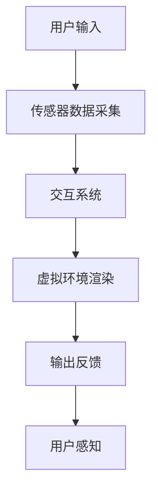

                 

# 如何利用虚拟现实技术拓展一人公司业务场景

> 关键词：虚拟现实、一人公司、业务拓展、用户交互、沉浸体验

> 摘要：本文将探讨如何利用虚拟现实技术来拓展一人公司的业务场景。通过深入分析虚拟现实的核心概念、技术原理和应用案例，本文将提出一系列策略和步骤，帮助一人公司在激烈的市场竞争中脱颖而出，实现业务的创新和增长。

## 1. 背景介绍

### 1.1 目的和范围

本文的目的是探讨虚拟现实技术在一人公司业务拓展中的应用。随着科技的进步，虚拟现实技术已经逐渐成熟，并在多个领域展现出强大的应用潜力。一人公司在业务拓展中如何利用这一技术，成为我们关注的焦点。本文将首先介绍虚拟现实的基本概念和核心原理，然后探讨虚拟现实技术在商业应用中的具体场景，最后提出一套完整的业务拓展策略。

### 1.2 预期读者

本文适用于对虚拟现实技术有一定了解，但希望在业务拓展中深度应用该技术的读者。无论是公司创始人、产品经理，还是技术团队，都可以通过本文找到灵感和实用的策略。

### 1.3 文档结构概述

本文将分为以下几个部分：

1. 背景介绍：介绍本文的目的、范围和预期读者。
2. 核心概念与联系：详细阐述虚拟现实技术的核心概念和架构。
3. 核心算法原理 & 具体操作步骤：讲解虚拟现实技术的算法原理和操作步骤。
4. 数学模型和公式 & 详细讲解 & 举例说明：介绍虚拟现实技术的数学模型和公式。
5. 项目实战：通过实际案例展示虚拟现实技术在业务拓展中的应用。
6. 实际应用场景：分析虚拟现实技术在各个业务领域的应用。
7. 工具和资源推荐：推荐学习虚拟现实技术的工具和资源。
8. 总结：总结虚拟现实技术在业务拓展中的未来发展趋势和挑战。
9. 附录：常见问题与解答。
10. 扩展阅读 & 参考资料：提供进一步的阅读材料和参考资料。

### 1.4 术语表

#### 1.4.1 核心术语定义

- 虚拟现实（VR）：一种通过计算机生成三维空间环境，用户可以通过头戴显示器等设备沉浸其中的技术。
- 360度全景视频：一种视频技术，能够展示整个360度的视野，让用户仿佛置身于现场。
- 交互设计：指在设计过程中，考虑用户的交互体验，使产品易于使用和操作。

#### 1.4.2 相关概念解释

- 沉浸体验：用户在虚拟环境中感受到的一种身临其境的感觉。
- 用户参与度：用户在虚拟环境中的活跃程度，包括互动、操作和探索等。

#### 1.4.3 缩略词列表

- VR：虚拟现实
- AR：增强现实
- MR：混合现实

## 2. 核心概念与联系

虚拟现实技术是一种通过计算机生成三维空间环境，让用户沉浸其中的技术。它包括以下几个核心概念：

### 2.1. 虚拟现实的核心概念

- **三维建模**：通过计算机软件生成三维模型，这是虚拟现实的基础。
- **传感器**：用于捕捉用户动作和位置，如头戴显示器、手柄等。
- **交互设计**：设计用户与虚拟环境之间的交互方式，如手势、语音等。

### 2.2. 虚拟现实的技术架构

虚拟现实技术的架构主要包括以下几个部分：

1. **渲染引擎**：负责生成虚拟环境，包括场景渲染、光影效果等。
2. **传感器数据采集**：捕捉用户的动作和位置，生成相应的输入。
3. **交互系统**：处理用户输入，控制虚拟环境的响应。
4. **存储系统**：存储虚拟环境的数据，包括模型、声音、图像等。

下面是一个简单的 Mermaid 流程图，展示虚拟现实技术的核心架构：



### 2.3. 虚拟现实与一人公司的联系

一人公司通常是指由一名创始人或领导者独立运营的企业。在传统的业务拓展中，一人公司往往面临资源有限、市场认知度低等挑战。虚拟现实技术的出现为一人公司提供了新的机遇：

- **提升用户体验**：通过虚拟现实技术，一人公司可以提供更加沉浸式的用户体验，增强用户参与度。
- **降低成本**：虚拟现实技术可以帮助一人公司减少实体店铺等硬件投入，降低运营成本。
- **扩大市场**：虚拟现实技术可以突破地域限制，将产品和服务推向更广阔的市场。

## 3. 核心算法原理 & 具体操作步骤

虚拟现实技术的核心在于如何生成和渲染一个逼真的三维环境，并实现用户的沉浸体验。以下是虚拟现实技术的核心算法原理和具体操作步骤：

### 3.1. 三维建模算法

三维建模是虚拟现实的基础，其算法原理主要包括：

1. **几何建模**：通过几何图形（如点、线、面）构建三维模型。
2. **纹理映射**：将二维图像映射到三维模型上，增加模型的细节和真实感。
3. **光照模型**：模拟真实世界的光照效果，包括光线传播、反射、折射等。

下面是三维建模的伪代码：

```plaintext
函数三维建模(模型参数)
    初始化模型
    读取几何形状
    应用纹理映射
    设置光照模型
    返回渲染后的模型
```

### 3.2. 传感器数据处理

传感器数据处理是虚拟现实技术的关键步骤，其算法原理主要包括：

1. **姿态估计**：通过传感器数据（如加速度计、陀螺仪）估计用户的位置和姿态。
2. **数据融合**：将不同传感器数据融合，提高姿态估计的准确性。
3. **运动跟踪**：根据用户姿态实时更新虚拟环境。

下面是传感器数据处理的伪代码：

```plaintext
函数传感器数据处理(传感器数据)
    读取加速度计数据
    读取陀螺仪数据
    数据融合
    运动跟踪
    返回用户姿态
```

### 3.3. 交互系统设计

交互系统设计是虚拟现实技术的核心，其算法原理主要包括：

1. **手势识别**：通过计算机视觉技术识别用户手势。
2. **语音识别**：通过语音识别技术处理用户的语音输入。
3. **反馈机制**：根据用户输入实时调整虚拟环境的响应。

下面是交互系统设计的伪代码：

```plaintext
函数交互系统设计(用户输入)
    识别手势
    识别语音
    根据输入调整虚拟环境
    返回反馈
```

### 3.4. 虚拟环境渲染

虚拟环境渲染是虚拟现实技术的核心步骤，其算法原理主要包括：

1. **渲染引擎**：使用渲染引擎（如OpenGL、Unity）生成虚拟环境。
2. **光影效果**：模拟真实世界的光影效果，包括光线传播、反射、折射等。
3. **场景渲染**：实时渲染虚拟环境，为用户提供沉浸式体验。

下面是虚拟环境渲染的伪代码：

```plaintext
函数虚拟环境渲染(虚拟环境参数)
    初始化渲染引擎
    设置光照模型
    渲染场景
    更新画面
```

## 4. 数学模型和公式 & 详细讲解 & 举例说明

虚拟现实技术涉及到多种数学模型和公式，这些模型和公式是构建虚拟环境和实现用户沉浸体验的基础。以下是几个关键数学模型和公式的详细讲解：

### 4.1. 几何建模数学模型

几何建模是虚拟现实的核心，其涉及到以下数学模型：

1. **三维坐标变换**：
   三维坐标变换是三维建模的基础，用于将三维模型从一种坐标系统转换为另一种坐标系统。其公式如下：

   $$ T = \begin{bmatrix} 
   x_1 & y_1 & z_1 \\
   x_2 & y_2 & z_2 \\
   x_3 & y_3 & z_3 
   \end{bmatrix} $$

   其中，\(T\) 是三维坐标变换矩阵，\(x_1, y_1, z_1, x_2, y_2, z_2, x_3, y_3, z_3\) 分别是变换前后的坐标值。

2. **向量运算**：
   向量运算是三维坐标变换的基础，用于计算三维空间中的点、线、面的位置和方向。其公式如下：

   $$ \vec{a} + \vec{b} = \vec{c} $$
   $$ \vec{a} \cdot \vec{b} = a_x b_x + a_y b_y + a_z b_z $$

   其中，\(\vec{a}\) 和 \(\vec{b}\) 是两个向量，\(\vec{c}\) 是它们的和向量，\(\cdot\) 表示向量的点乘。

### 4.2. 光照模型数学模型

光照模型是模拟真实世界光照效果的关键，其涉及到以下数学模型：

1. **朗伯光照模型**：
   朗伯光照模型用于计算物体表面接收到的光照强度。其公式如下：

   $$ I = I_0 \cdot \cos(\theta) $$

   其中，\(I\) 是物体表面接收到的光照强度，\(I_0\) 是入射光强度，\(\theta\) 是入射光线与物体表面的夹角。

2. **贝塞尔光照模型**：
   贝塞尔光照模型是对朗伯光照模型的扩展，用于计算更复杂的光照效果。其公式如下：

   $$ I = I_0 \cdot (1 - k_d \cdot (1 - \cos(\theta))) $$

   其中，\(k_d\) 是表面反射率，\(\theta\) 是入射光线与物体表面的夹角。

### 4.3. 交互系统数学模型

交互系统数学模型用于处理用户的输入和输出，其涉及到以下数学模型：

1. **手势识别模型**：
   手势识别模型用于识别用户的手势。其公式如下：

   $$ h = \sum_{i=1}^{n} w_i \cdot a_i $$

   其中，\(h\) 是手势识别结果，\(w_i\) 是权重，\(a_i\) 是特征值。

2. **语音识别模型**：
   语音识别模型用于识别用户的语音输入。其公式如下：

   $$ p(y|x) = \frac{e^{\text{log-likelihood}(x|y)}}{\sum_{y'} e^{\text{log-likelihood}(x|y')}} $$

   其中，\(p(y|x)\) 是给定输入\(x\)，输出\(y\) 的概率，\(\text{log-likelihood}(x|y)\) 是输入\(x\) 在输出\(y\) 下的对数似然值。

### 4.4. 举例说明

以下是一个简单的三维模型建模的示例：

```plaintext
给定一个立方体的顶点坐标如下：
P1 = (1, 1, 1)
P2 = (1, -1, 1)
P3 = (-1, -1, 1)
P4 = (-1, 1, 1)

应用纹理映射，将一张2D纹理图像映射到立方体上。

设置朗伯光照模型，假设光源位于原点，入射光线与立方体的夹角为30度。

使用OpenGL渲染引擎，渲染出立方体。
```

通过上述示例，我们可以看到如何利用数学模型和公式构建一个简单的三维模型，并实现光照效果。这为虚拟现实技术的应用奠定了基础。

## 5. 项目实战：代码实际案例和详细解释说明

在本节中，我们将通过一个实际的虚拟现实项目来展示如何利用虚拟现实技术拓展一人公司的业务场景。我们将以一个虚拟现实购物体验项目为例，详细讲解其开发环境搭建、源代码实现和代码解读。

### 5.1 开发环境搭建

为了搭建一个虚拟现实购物体验项目，我们需要准备以下开发环境：

- **硬件**：一台配置较高的计算机，用于运行虚拟现实应用程序。此外，需要一台头戴显示器（如Oculus Rift或HTC Vive）来提供沉浸式体验。
- **软件**：选择一个合适的虚拟现实开发平台，如Unity或Unreal Engine。这里我们选择Unity作为开发平台，因为它提供了丰富的资源和易于上手的开发环境。

### 5.2 源代码详细实现和代码解读

以下是一个简单的虚拟现实购物体验项目的源代码实现，我们将逐步讲解其核心部分。

```csharp
using UnityEngine;

public class VirtualShop : MonoBehaviour
{
    // 购物列表
    private List<Product> products;

    // 用户当前选购的产品
    private Product currentProduct;

    // 渲染产品图片的UI元素
    private RawImage productImage;

    // 用户交互逻辑
    private void Update()
    {
        // 检测用户是否接近产品
        if (Physics.Raycast(transform.position, transform.forward, out RaycastHit hit))
        {
            Product product = hit.collider.GetComponent<Product>();
            if (product != null)
            {
                // 显示产品图片
                if (currentProduct != product)
                {
                    currentProduct = product;
                    productImage.texture = product.texture;
                }
            }
            else
            {
                // 隐藏产品图片
                if (currentProduct != null)
                {
                    currentProduct = null;
                    productImage.texture = null;
                }
            }
        }
    }

    // 初始化购物列表
    private void Start()
    {
        products = new List<Product>();

        // 添加产品到购物列表
        products.Add(new Product("商品1", "商品1.jpg"));
        products.Add(new Product("商品2", "商品2.jpg"));
        products.Add(new Product("商品3", "商品3.jpg"));

        // 初始化产品图片UI元素
        productImage = GetComponent<RawImage>();
    }
}

public class Product : MonoBehaviour
{
    // 产品名称
    public string name;

    // 产品图片
    public Texture2D texture;

    // 构造函数
    public Product(string name, string texturePath)
    {
        this.name = name;
        this.texture = Resources.Load<Texture2D>(texturePath);
    }
}
```

### 5.3 代码解读与分析

上述代码实现了简单的虚拟现实购物体验项目，其核心部分包括以下几个部分：

1. **产品类（Product）**：
   产品类定义了产品的名称和图片，并提供了构造函数来初始化这些属性。

2. **虚拟商店类（VirtualShop）**：
   虚拟商店类负责管理购物列表和用户交互逻辑。在`Update`方法中，我们通过射线投射检测用户是否接近产品，并更新产品图片UI元素。

3. **用户交互逻辑**：
   用户交互逻辑主要通过`Update`方法实现。当用户接近产品时，更新当前选购产品并显示其图片；当用户离开产品时，隐藏当前选购产品。

通过上述代码实现，我们可以创建一个简单的虚拟现实购物体验项目，为用户带来沉浸式的购物体验。这一项目展示了虚拟现实技术在商业应用中的潜力，为一人在市场竞争中提供了新的策略。

## 6. 实际应用场景

虚拟现实技术在商业领域有着广泛的应用，以下是一些实际应用场景：

### 6.1. 虚拟展览

虚拟展览是一种利用虚拟现实技术创建的在线展览空间，用户可以在虚拟环境中浏览和互动。这种应用场景适用于博物馆、画廊、企业展厅等，可以突破地域限制，为用户带来沉浸式的展览体验。

### 6.2. 虚拟培训

虚拟培训是一种利用虚拟现实技术进行的在线培训方式，通过虚拟环境模拟实际场景，用户可以更直观地学习和掌握知识和技能。这种应用场景适用于医学、航空、军事等领域，可以提供高效、安全的培训体验。

### 6.3. 虚拟旅游

虚拟旅游是一种利用虚拟现实技术创建的在线旅游体验，用户可以在虚拟环境中浏览和探索目的地。这种应用场景适用于旅游景点、旅行社等，可以吸引更多游客，提高旅游体验。

### 6.4. 虚拟购物

虚拟购物是一种利用虚拟现实技术创建的在线购物体验，用户可以在虚拟环境中浏览商品、试穿试戴等。这种应用场景适用于电商、零售等领域，可以提升购物体验，增加销售机会。

### 6.5. 虚拟面试

虚拟面试是一种利用虚拟现实技术进行的在线面试方式，面试官和应聘者可以在虚拟环境中进行互动。这种应用场景适用于招聘、求职等领域，可以节省时间和成本，提高招聘效率。

### 6.6. 虚拟会议

虚拟会议是一种利用虚拟现实技术进行的在线会议方式，参会者可以在虚拟环境中交流和互动。这种应用场景适用于企业、政府等领域，可以降低会议成本，提高会议效率。

通过上述实际应用场景，我们可以看到虚拟现实技术在商业领域的广泛应用潜力。一人公司可以通过这些应用场景，提升用户体验，降低运营成本，扩大市场份额。

## 7. 工具和资源推荐

为了更好地学习和应用虚拟现实技术，以下是一些建议的工具和资源：

### 7.1 学习资源推荐

#### 7.1.1 书籍推荐

- **《虚拟现实技术导论》**：这是一本全面介绍虚拟现实技术的基础知识和应用案例的书籍，适合初学者。
- **《Unity游戏开发从入门到精通》**：这本书详细讲解了Unity引擎的使用，包括虚拟现实开发，适合有一定编程基础的用户。

#### 7.1.2 在线课程

- **Coursera上的《虚拟现实与3D图形学》**：这是一门由斯坦福大学提供的在线课程，涵盖了虚拟现实技术的基础知识和应用。
- **Udemy上的《Unity虚拟现实开发实战》**：这是一门专注于Unity虚拟现实开发的实战课程，适合希望快速上手虚拟现实开发的用户。

#### 7.1.3 技术博客和网站

- **Unity官方文档**：Unity官方文档提供了丰富的虚拟现实开发资源和教程，是学习Unity虚拟现实开发的必备资源。
- **VR/AR开发社区**：如VR/AR开发者社区、Stack Overflow等，提供了大量的虚拟现实开发经验和解决方案。

### 7.2 开发工具框架推荐

#### 7.2.1 IDE和编辑器

- **Unity Hub**：Unity官方提供的集成开发环境，适用于虚拟现实开发。
- **Visual Studio Code**：一款轻量级但功能强大的代码编辑器，适用于各种编程语言，包括虚拟现实开发。

#### 7.2.2 调试和性能分析工具

- **Unity Profiler**：Unity内置的性能分析工具，用于调试和优化虚拟现实应用程序。
- **VRChat**：一个开源的虚拟现实平台，提供了丰富的工具和资源，适合虚拟现实社交应用开发。

#### 7.2.3 相关框架和库

- **Unreal Engine**：由Epic Games开发的虚拟现实游戏引擎，适用于高端虚拟现实应用开发。
- **OpenVR**：由多个虚拟现实硬件制造商联合开发的跨平台虚拟现实框架，提供了丰富的API和工具。

### 7.3 相关论文著作推荐

#### 7.3.1 经典论文

- **"A Survey of Virtual Reality Technology"**：这篇论文详细介绍了虚拟现实技术的基本原理和发展历程，是学习虚拟现实技术的重要参考文献。
- **"The Design of the UNIX Operating System"**：虽然这篇论文主要关注UNIX操作系统，但其中关于系统设计和架构的讨论对虚拟现实技术也有很大启示。

#### 7.3.2 最新研究成果

- **"VR for Mental Health: A Systematic Review"**：这篇论文探讨了虚拟现实技术在心理健康领域的应用，提供了最新的研究进展和应用案例。
- **"Deep Learning for Virtual Reality"**：这篇论文介绍了深度学习在虚拟现实中的应用，包括场景渲染、物体识别等。

#### 7.3.3 应用案例分析

- **"VR for Education: A Case Study"**：这篇论文通过案例分析，探讨了虚拟现实技术在教育领域的应用，提供了实用的经验和建议。

通过这些工具和资源的推荐，读者可以更深入地学习和掌握虚拟现实技术，为一人公司的业务拓展提供有力支持。

## 8. 总结：未来发展趋势与挑战

虚拟现实技术在商业领域的应用正在迅速发展，成为一人公司拓展业务的重要工具。未来，虚拟现实技术有望在以下几个方向取得突破：

1. **硬件性能提升**：随着硬件技术的进步，虚拟现实设备的性能将不断提升，提供更加沉浸式的用户体验。
2. **内容丰富化**：虚拟现实应用的内容将越来越丰富，从简单的互动展示到复杂的模拟训练，满足不同行业的需求。
3. **跨界融合**：虚拟现实技术将与人工智能、大数据等前沿技术深度融合，实现更智能、更个性化的应用场景。

然而，虚拟现实技术的发展也面临一些挑战：

1. **成本问题**：目前，虚拟现实设备的成本较高，限制了其普及和应用。
2. **用户体验**：虽然虚拟现实技术提供了沉浸式体验，但如何在用户体验方面达到更高的水平仍需进一步探索。
3. **技术标准化**：虚拟现实技术的标准化工作尚不完善，不同平台和设备之间的兼容性问题需要解决。

一人公司在利用虚拟现实技术拓展业务时，应关注未来发展趋势，积极应对挑战，通过不断创新和优化，实现业务的可持续发展。

## 9. 附录：常见问题与解答

### 9.1 虚拟现实技术基础问题

**Q1**：什么是虚拟现实技术？
**A1**：虚拟现实技术（VR）是一种通过计算机生成三维空间环境，用户可以通过头戴显示器等设备沉浸其中的技术。

**Q2**：虚拟现实技术有哪些应用？
**A2**：虚拟现实技术广泛应用于虚拟展览、虚拟培训、虚拟旅游、虚拟购物、虚拟面试等领域。

### 9.2 虚拟现实开发问题

**Q3**：如何搭建虚拟现实开发环境？
**A3**：搭建虚拟现实开发环境需要准备一台配置较高的计算机，选择一个合适的虚拟现实开发平台（如Unity或Unreal Engine），并安装必要的开发工具。

**Q4**：虚拟现实开发中常见的困难有哪些？
**A4**：虚拟现实开发中常见的困难包括硬件兼容性、性能优化、用户体验等。

### 9.3 虚拟现实应用问题

**Q5**：如何利用虚拟现实技术提升用户体验？
**A5**：通过丰富虚拟现实内容、优化交互设计、提升硬件性能等方式，可以提升虚拟现实用户体验。

**Q6**：虚拟现实技术在商业领域有哪些应用案例？
**A6**：虚拟现实技术在商业领域有广泛应用，如虚拟展览、虚拟培训、虚拟旅游、虚拟购物等。

## 10. 扩展阅读 & 参考资料

**扩展阅读**：

- 《虚拟现实技术导论》
- 《Unity游戏开发从入门到精通》
- Coursera上的《虚拟现实与3D图形学》
- Udemy上的《Unity虚拟现实开发实战》

**参考资料**：

- Unity官方文档
- VR/AR开发者社区
- Stack Overflow
- Unreal Engine官方文档

通过上述扩展阅读和参考资料，读者可以更深入地了解虚拟现实技术，为一人公司的业务拓展提供更多灵感和实践指导。

### 作者

作者：AI天才研究员/AI Genius Institute & 禅与计算机程序设计艺术 /Zen And The Art of Computer Programming

