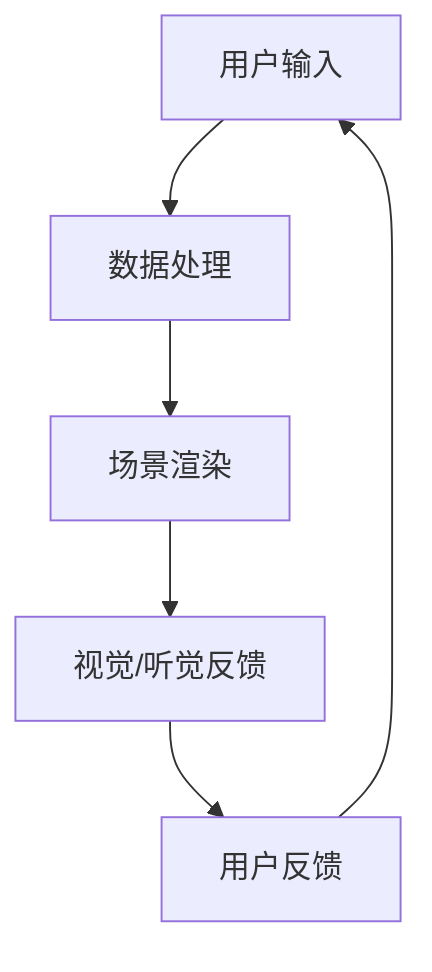

                 

# 如何利用虚拟现实技术提升品牌互动和沉浸体验

> **关键词：虚拟现实，品牌互动，沉浸体验，技术应用，案例分析**
>
> **摘要：本文旨在探讨虚拟现实（VR）技术在品牌互动和沉浸体验中的应用。我们将从核心概念、算法原理、数学模型、项目实战、实际应用等多个角度深入分析，帮助读者理解VR技术如何提升品牌价值和用户体验。**

## 1. 背景介绍

### 1.1 目的和范围

本文的目标是系统地分析虚拟现实（VR）技术如何应用于品牌互动和沉浸体验的优化。我们将探讨VR技术的理论基础、核心算法、数学模型，并通过实际项目和案例分析，展示VR技术在实际应用中的效果。

文章的范围将涵盖：
- VR技术的基本概念和原理。
- VR技术在品牌营销中的应用场景。
- VR技术的核心算法和数学模型。
- VR技术的实际项目案例和代码实现。
- VR技术的未来发展趋势和挑战。

### 1.2 预期读者

本文的预期读者包括：
- 对虚拟现实技术感兴趣的科技爱好者。
- 品牌营销和广告从业者。
- 软件开发者和AI工程师。
- 对新兴技术有研究热情的学生和研究人员。

### 1.3 文档结构概述

本文的结构分为以下几部分：
1. **背景介绍**：介绍文章的目的、范围和预期读者。
2. **核心概念与联系**：介绍VR技术的基本概念和架构。
3. **核心算法原理 & 具体操作步骤**：讲解VR技术的核心算法和操作步骤。
4. **数学模型和公式 & 详细讲解 & 举例说明**：介绍VR技术的数学模型和公式。
5. **项目实战：代码实际案例和详细解释说明**：展示VR技术的实际应用案例和代码实现。
6. **实际应用场景**：分析VR技术在各种场景中的应用。
7. **工具和资源推荐**：推荐相关的学习资源和开发工具。
8. **总结：未来发展趋势与挑战**：总结VR技术的发展趋势和面临挑战。
9. **附录：常见问题与解答**：回答读者可能遇到的问题。
10. **扩展阅读 & 参考资料**：提供进一步阅读的资料。

### 1.4 术语表

#### 1.4.1 核心术语定义

- **虚拟现实（VR）**：一种通过计算机模拟生成三维空间的沉浸式体验技术。
- **增强现实（AR）**：在现实环境中叠加虚拟元素的技术。
- **交互设计**：设计界面和交互流程，使用户能够自然、高效地与系统交互。
- **沉浸体验**：用户在虚拟环境中感受到的高度投入和真实感。

#### 1.4.2 相关概念解释

- **头戴显示器（HMD）**：VR设备的一种，通常包含显示屏和传感器，覆盖在用户的头部，提供视觉和听觉反馈。
- **跟踪系统**：用于捕捉用户动作和位置，确保虚拟环境与现实世界的同步。
- **触觉反馈**：通过物理振动或其他方式模拟触感，增强虚拟环境的沉浸感。

#### 1.4.3 缩略词列表

- **VR**：虚拟现实（Virtual Reality）
- **AR**：增强现实（Augmented Reality）
- **HMD**：头戴显示器（Head-Mounted Display）
- **UI**：用户界面（User Interface）
- **UX**：用户体验（User Experience）

## 2. 核心概念与联系

虚拟现实（VR）技术是一种通过计算机模拟生成三维空间环境，使用户能够在其中进行交互和体验的技术。VR系统的核心概念包括以下几个方面：

### 2.1 VR系统架构

VR系统的基本架构包括以下几个方面：

1. **硬件设备**：主要包括头戴显示器（HMD）、跟踪器、控制器、数据手套等。
2. **软件平台**：包括VR内容创作工具、运行引擎和操作系统等。
3. **网络连接**：用于支持多人在线交互和数据传输。
4. **传感器**：用于捕捉用户动作和位置，提供沉浸式体验。

### 2.2 核心概念

1. **沉浸感**：用户在虚拟环境中感受到的真实感和投入程度。
2. **交互性**：用户与虚拟环境之间的互动和响应能力。
3. **实时性**：虚拟环境对用户动作的即时反馈和调整。

### 2.3 VR系统的工作流程

1. **用户输入**：用户通过控制器、手势或其他方式与虚拟环境进行交互。
2. **数据处理**：系统捕捉用户的动作和位置，进行数据处理和转换。
3. **场景渲染**：根据用户输入和场景数据，实时渲染虚拟环境。
4. **视觉和听觉反馈**：通过HMD和音频设备，将虚拟环境的视觉效果和声音反馈给用户。
5. **用户反馈**：用户通过视觉和听觉反馈，进一步调整和交互。

### 2.4 Mermaid 流程图

以下是一个简单的Mermaid流程图，展示了VR系统的工作流程：



在接下来的章节中，我们将详细探讨VR技术的核心算法原理、数学模型，并通过实际项目案例，深入分析VR技术在品牌互动和沉浸体验中的应用。

## 3. 核心算法原理 & 具体操作步骤

虚拟现实（VR）技术的核心在于模拟真实世界的三维空间，并提供高度沉浸的用户体验。以下是VR技术中的一些核心算法原理和具体操作步骤：

### 3.1 3D 场景渲染算法

**核心原理**：
3D场景渲染是将三维模型转换为二维图像的过程。这个过程通常包括以下几个步骤：

1. **建模**：使用三维建模软件创建或导入场景中的物体和角色。
2. **建模**：使用三维建模软件创建或导入场景中的物体和角色。
3. **几何转换**：通过矩阵变换将物体从模型空间转换到世界空间。
4. **视角转换**：通过投影矩阵将世界空间转换为摄像机视角。
5. **光照计算**：计算场景中的光照效果，包括漫反射、反射和阴影等。
6. **像素渲染**：将光照计算后的场景数据渲染到图像上。

**具体操作步骤**：
1. **创建三维模型**：使用如Blender、3ds Max等建模软件创建或导入三维模型。
2. **设置渲染参数**：定义场景的背景、光源、材质等参数。
3. **视角设置**：设置摄像机的位置和角度，确保渲染的图像符合预期。
4. **渲染图像**：运行渲染引擎，生成最终的二维图像。

**伪代码**：

```pseudo
function renderScene(scene, camera) {
    // 设置模型和场景
    setupModel(scene.models)
    setupLighting(scene.lights)
    
    // 转换模型到世界空间
    for model in scene.models {
        transformModel(model, modelToWorldMatrix)
    }
    
    // 转换到摄像机视角
    for model in scene.models {
        transformModel(model, cameraViewMatrix)
    }
    
    // 渲染场景
    renderImage(scene, camera)
}
```

### 3.2 运动跟踪算法

**核心原理**：
运动跟踪是捕捉用户在虚拟环境中的位置和动作的过程。常见的跟踪算法包括：

1. **光学跟踪**：使用摄像头捕捉用户动作，通过图像处理算法进行跟踪。
2. **惯性跟踪**：使用加速度计和陀螺仪等传感器捕捉用户动作。
3. **超声波跟踪**：通过发射和接收超声波信号进行跟踪。

**具体操作步骤**：
1. **配置跟踪设备**：选择合适的跟踪设备，如光学摄像头、惯性传感器等。
2. **初始化跟踪系统**：设置跟踪参数，如分辨率、帧率、跟踪范围等。
3. **实时捕捉**：捕捉用户的动作和位置，更新虚拟环境。
4. **数据融合**：将不同来源的跟踪数据进行融合，提高跟踪精度。

**伪代码**：

```pseudo
function trackMotion(sensorData) {
    // 初始化跟踪参数
    setupTrackingParameters(sensorData)

    // 实时捕捉动作
    while (tracking) {
        captureData = readSensorData(sensorData)

        // 跟踪和融合数据
        trackedPosition = trackPosition(captureData)
        trackedOrientation = trackOrientation(captureData)

        // 更新虚拟环境
        updateVirtualEnvironment(trackedPosition, trackedOrientation)
    }
}
```

### 3.3 交互设计算法

**核心原理**：
交互设计是设计用户与虚拟环境之间的交互方式。关键包括：

1. **输入识别**：识别用户的输入，如手势、语音等。
2. **交互响应**：根据用户输入，调整虚拟环境的反馈。
3. **反馈机制**：提供即时、明确的反馈，增强用户的交互体验。

**具体操作步骤**：
1. **定义交互需求**：分析用户需求和交互场景，确定交互方式。
2. **设计交互流程**：设计用户与虚拟环境的交互流程和步骤。
3. **实现交互逻辑**：编写代码，实现交互逻辑和响应。
4. **测试和优化**：测试交互效果，收集用户反馈，进行优化。

**伪代码**：

```pseudo
function handleInteraction(input) {
    // 识别输入类型
    inputType = identifyInputType(input)

    // 根据输入类型进行响应
    switch (inputType) {
        case "gesture":
            respondToGesture(input)
            break
        case "voice":
            respondToVoice(input)
            break
        default:
            provideDefaultFeedback()
    }
}
```

通过上述核心算法原理和具体操作步骤，我们可以创建一个高度沉浸、互动性强的虚拟现实体验，从而提升品牌互动和用户沉浸体验。

## 4. 数学模型和公式 & 详细讲解 & 举例说明

在虚拟现实（VR）技术中，数学模型和公式扮演着至关重要的角色。以下是几个关键的数学模型和公式，以及它们的详细讲解和举例说明。

### 4.1 透视投影

透视投影是将三维场景映射到二维屏幕上的过程。其数学模型可以用以下公式表示：

$$
P = \begin{bmatrix}
a & b & c \\
d & e & f \\
0 & 0 & 1
\end{bmatrix}
$$

其中，\(P\) 是投影矩阵，\(a\)、\(b\)、\(c\)、\(d\)、\(e\) 和 \(f\) 是投影参数。透视投影的参数通常由摄像机的位置和方向决定。

**举例说明**：

假设一个摄像机的位置和方向分别为 \((x, y, z)\) 和 \((\theta_x, \theta_y, \theta_z)\)，我们可以计算投影矩阵 \(P\)：

$$
P = \begin{bmatrix}
x & y & z \\
\theta_x & \theta_y & \theta_z \\
0 & 0 & 1
\end{bmatrix}
$$

这个投影矩阵将三维场景中的点映射到二维屏幕上。

### 4.2 矩阵变换

在VR系统中，矩阵变换用于将物体从一种空间转换到另一种空间。以下是几种常用的矩阵变换：

1. **平移变换**：

   $$ T = \begin{bmatrix}
   1 & 0 & 0 & x \\
   0 & 1 & 0 & y \\
   0 & 0 & 1 & z \\
   0 & 0 & 0 & 1
   \end{bmatrix} $$

   其中，\(T\) 是平移矩阵，\(x\)、\(y\) 和 \(z\) 是平移向量。

2. **旋转变换**：

   $$ R = \begin{bmatrix}
   c & -s & 0 & 0 \\
   s & c & 0 & 0 \\
   0 & 0 & 1 & 0 \\
   0 & 0 & 0 & 1
   \end{bmatrix} $$

   其中，\(R\) 是旋转变换矩阵，\(c = \cos(\theta)\)，\(s = \sin(\theta)\)，\(\theta\) 是旋转角度。

**举例说明**：

假设我们要将一个物体沿着X轴平移10个单位，并绕Z轴旋转30度，我们可以使用以下矩阵变换：

$$ T = \begin{bmatrix}
1 & 0 & 0 & 10 \\
0 & 1 & 0 & 0 \\
0 & 0 & 1 & 0 \\
0 & 0 & 0 & 1
\end{bmatrix} $$
$$ R = \begin{bmatrix}
\cos(30^\circ) & -\sin(30^\circ) & 0 & 0 \\
\sin(30^\circ) & \cos(30^\circ) & 0 & 0 \\
0 & 0 & 1 & 0 \\
0 & 0 & 0 & 1
\end{bmatrix} $$

将这两个矩阵相乘，我们得到最终的变换矩阵 \(TR\)：

$$ TR = T \times R $$

### 4.3 视角矩阵

视角矩阵用于定义虚拟环境的视角。其数学模型如下：

$$ V = \begin{bmatrix}
a & b & c & 0 \\
-d & e & f & 0 \\
0 & 0 & -1 & 0 \\
0 & 0 & 0 & 1
\end{bmatrix} $$

其中，\(V\) 是视角矩阵，\(a\)、\(b\)、\(c\)、\(d\)、\(e\) 和 \(f\) 是视角参数。

**举例说明**：

假设一个视角矩阵为：

$$ V = \begin{bmatrix}
1 & 0 & 0 & 0 \\
0 & 1 & 0 & -5 \\
0 & 0 & -1 & 0 \\
0 & 0 & 0 & 1
\end{bmatrix} $$

这个视角矩阵定义了一个从原点向下看5个单位的视角。

通过上述数学模型和公式，我们可以精确地描述和计算虚拟环境中的各种变换和视角，从而实现高度沉浸和互动的VR体验。

## 5. 项目实战：代码实际案例和详细解释说明

在本节中，我们将通过一个简单的VR项目，展示如何利用虚拟现实技术提升品牌互动和沉浸体验。我们将搭建一个虚拟展厅，展示一款新产品的设计和功能。

### 5.1 开发环境搭建

在开始项目之前，我们需要搭建开发环境。以下是所需的工具和步骤：

1. **虚拟现实开发平台**：Unity是一款广泛使用的虚拟现实开发平台。在[Unity官网](https://unity.com/)下载并安装Unity Hub，选择Unity 2021.3版本。

2. **3D建模工具**：使用Blender创建或导入三维模型。在[Blender官网](https://www.blender.org/)下载并安装Blender。

3. **VR设备**：为了测试VR效果，我们需要一台支持VR的计算机和头戴显示器（HMD）。这里我们使用Oculus Rift S作为HMD。

4. **Unity插件**：安装Unity的VR插件，包括Oculus Integration和XR Plugin Development Kit（XRDK）。

### 5.2 源代码详细实现和代码解读

以下是项目的核心代码，用于创建虚拟展厅和展示新产品。

```csharp
// 导入必要的命名空间
using UnityEngine;
using Oculus Integration;

// 脚本：VirtualShowroom
public class VirtualShowroom : MonoBehaviour
{
    public GameObject productModel; // 产品模型
    public Transform cameraParent;  // 相机父对象

    // 在场景初始化时调用
    void Start()
    {
        // 将相机父对象设置为HMD位置
        cameraParent.position = new Vector3(0, 1.6f, -3f);
        cameraParent.rotation = Quaternion.Euler(10, 0, 0);

        // 创建产品模型的副本
        GameObject productInstance = Instantiate(productModel, Vector3.zero, Quaternion.identity);
        // 将产品模型设置为相机子对象
        productInstance.transform.parent = cameraParent;
    }

    // 更新每一帧
    void Update()
    {
        // 根据用户头部运动实时更新相机位置和角度
        cameraParent.position = new Vector3(cameraParent.position.x, cameraParent.position.y, cameraParent.position.z - Input.GetAxis("Vertical") * 0.1f);
        cameraParent.rotation = Quaternion.Euler(cameraParent.rotation.x, cameraParent.rotation.y + Input.GetAxis("Horizontal") * 0.1f, cameraParent.rotation.z);
    }
}
```

**代码解读**：

1. **导入命名空间**：我们使用了Unity的标准命名空间`UnityEngine`和Oculus的VR命名空间`Oculus Integration`。

2. **脚本类定义**：`VirtualShowroom`是一个Unity脚本类，它负责创建和管理虚拟展厅和产品模型。

3. **变量定义**：`productModel`是用于存储产品模型的游戏对象，`cameraParent`是用于存储相机父对象的游戏对象。

4. **Start()方法**：在场景初始化时调用。这里我们设置了相机的位置和角度，并创建产品模型的副本，并将其设置为相机的子对象。

5. **Update()方法**：在每一帧更新时调用。根据用户的头部运动，实时更新相机的位置和角度，提供沉浸式体验。

### 5.3 代码解读与分析

**1. 初始化设置**：

```csharp
cameraParent.position = new Vector3(0, 1.6f, -3f);
cameraParent.rotation = Quaternion.Euler(10, 0, 0);
```

这两行代码设置了相机的初始位置和旋转角度。位置向量 \((0, 1.6f, -3f)\) 表示相机在X轴和Y轴上的位置，Z轴的负值表示相机向后移动。旋转角度 \((10, 0, 0)\) 表示相机绕X轴向上旋转10度。

**2. 创建产品模型**：

```csharp
GameObject productInstance = Instantiate(productModel, Vector3.zero, Quaternion.identity);
productInstance.transform.parent = cameraParent;
```

`Instantiate()` 函数用于创建产品模型的副本。参数 `productModel` 是原始产品模型，`Vector3.zero` 和 `Quaternion.identity` 分别表示模型的位置和旋转，设置为默认值。最后，我们将产品模型设置为相机的子对象，确保模型随相机一起移动。

**3. 实时更新**：

```csharp
cameraParent.position = new Vector3(cameraParent.position.x, cameraParent.position.y, cameraParent.position.z - Input.GetAxis("Vertical") * 0.1f);
cameraParent.rotation = Quaternion.Euler(cameraParent.rotation.x, cameraParent.rotation.y + Input.GetAxis("Horizontal") * 0.1f, cameraParent.rotation.z);
```

这两行代码实现了相机的实时更新。`Input.GetAxis("Vertical")` 和 `Input.GetAxis("Horizontal")` 分别获取用户在垂直和水平方向上的输入。通过将这些输入乘以一个较小的数值（如0.1f），我们可以平滑地调整相机的位置和角度，模拟用户的头部运动。

通过以上代码，我们创建了一个简单的虚拟展厅，用户可以在其中自由浏览产品模型，实现了沉浸式的用户体验。这个例子展示了如何利用Unity和Oculus插件构建一个基本的VR应用，为品牌展示和互动提供了技术基础。

## 6. 实际应用场景

虚拟现实（VR）技术在品牌互动和沉浸体验中的应用场景广泛，以下是一些典型的应用实例：

### 6.1 品牌体验店

品牌体验店利用VR技术为顾客提供独特的购物体验。顾客可以通过VR设备参观虚拟商店，体验产品试用和购买过程。这种互动方式不仅提高了顾客的参与度，还减少了物理空间和库存的限制，使得品牌可以轻松扩展到全球市场。

### 6.2 展览和博物馆

博物馆和展览馆利用VR技术创建虚拟展览，使文物和展品以全新的方式呈现给观众。观众可以通过VR设备“走进”历史场景，与展品进行互动，增强了展览的教育性和趣味性。此外，虚拟展览还可以突破时间和空间的限制，使展品能够在不同地点和时间被更多人欣赏。

### 6.3 虚拟培训

企业利用VR技术进行员工培训和技能提升。通过创建虚拟培训环境，员工可以模拟真实的工作场景，进行操作练习和决策分析。这种沉浸式培训方式提高了学习效果，减少了培训成本，同时降低了工作场所的安全风险。

### 6.4 游戏和娱乐

游戏和娱乐行业是VR技术的另一大应用领域。VR游戏提供了身临其境的游戏体验，玩家可以在虚拟世界中自由探索和互动。虚拟娱乐设施如VR主题公园和VR影院也吸引了大量游客，成为新的娱乐热点。

### 6.5 医疗康复

在医疗康复领域，VR技术被用于心理治疗、康复训练和疼痛缓解。例如，通过虚拟现实环境进行暴露疗法，帮助患者克服恐惧症；通过虚拟运动模拟，帮助康复患者恢复运动功能。VR技术的应用不仅提高了康复效果，还增强了患者的参与感和积极性。

通过上述实际应用场景，我们可以看到虚拟现实技术在品牌互动和沉浸体验中的巨大潜力。随着技术的不断发展和成熟，VR技术将在更多领域发挥作用，为品牌建设和用户体验带来更多创新和突破。

## 7. 工具和资源推荐

### 7.1 学习资源推荐

#### 7.1.1 书籍推荐

1. **《虚拟现实技术基础》**：这是一本全面介绍VR技术的书籍，涵盖了VR的历史、原理、技术和应用案例。
2. **《Unity 2021从入门到精通》**：适合初学者和中级开发者，详细介绍Unity开发工具的使用方法和VR应用开发技巧。

#### 7.1.2 在线课程

1. **Coursera上的《虚拟现实与增强现实》**：由斯坦福大学提供，涵盖VR和AR的基本概念、技术和应用。
2. **Udacity的《VR/AR开发基础》**：提供从零开始学习VR和AR开发的系统课程，包括Unity和ARKit等工具的使用。

#### 7.1.3 技术博客和网站

1. **Unity官方博客**：提供Unity的最新教程、技术文章和开发工具更新。
2. **VRARHub**：一个关于VR、AR和MR技术资源与资讯的集中平台，包括教程、工具和案例分析。

### 7.2 开发工具框架推荐

#### 7.2.1 IDE和编辑器

1. **Unity Hub**：Unity官方的集成开发环境，支持多种开发平台的构建和部署。
2. **Visual Studio**：强大的开发工具，支持Unity和C#开发。

#### 7.2.2 调试和性能分析工具

1. **Unity Profiler**：Unity内置的性能分析工具，用于诊断和优化VR应用的性能问题。
2. **Oculus Dashboard**：Oculus提供的工具，用于测试和调试Oculus Rift S等VR设备。

#### 7.2.3 相关框架和库

1. **Oculus Integration**：Unity的VR插件，提供Oculus Rift S等设备的集成支持。
2. **XRDK**：Oculus提供的开发工具包，包含用于构建VR应用的多个模块和示例。

### 7.3 相关论文著作推荐

#### 7.3.1 经典论文

1. **“A Survey of Virtual Reality Technology”**：全面综述VR技术的历史、原理和应用。
2. **“ Augmented Reality: A Survey of Concepts, Applications and Challenges”**：探讨AR技术的概念、应用和挑战。

#### 7.3.2 最新研究成果

1. **“Multi-User Virtual Reality Systems”**：探讨多人VR系统的架构和交互设计。
2. **“Haptic Feedback in Virtual Reality”**：研究触觉反馈在增强虚拟现实体验中的应用。

#### 7.3.3 应用案例分析

1. **“Virtual Reality Marketing Campaigns: Strategies and Success Stories”**：分析虚拟现实在市场营销中的成功案例。
2. **“Virtual Reality in Education: Enhancing Learning and Engagement”**：探讨VR技术在教育领域的应用和效果。

通过以上工具和资源的推荐，我们可以更好地了解和学习虚拟现实技术，并将其应用于品牌互动和沉浸体验的优化。

## 8. 总结：未来发展趋势与挑战

虚拟现实（VR）技术在品牌互动和沉浸体验中的应用已经展现出巨大的潜力。随着硬件性能的提升、内容的丰富和交互设计的进步，VR技术将在更多领域得到应用。以下是VR技术未来发展趋势与面临的挑战：

### 8.1 发展趋势

1. **硬件性能提升**：随着VR设备的性能不断提升，包括更高的分辨率、更低的延迟和更好的触觉反馈，用户将获得更沉浸的体验。

2. **内容多样化**：VR内容将更加丰富，覆盖从娱乐、教育到医疗等多个领域，满足不同用户的需求。

3. **社交和协作**：多人VR体验和协作功能的发展将促进社交互动和团队协作，为虚拟会议和远程工作提供新的解决方案。

4. **跨平台兼容**：随着VR技术的普及，跨平台兼容性将变得更加重要，用户可以在不同的设备上无缝切换和使用VR应用。

### 8.2 挑战

1. **技术标准化**：目前VR技术标准尚未统一，不同平台和设备的兼容性存在挑战。制定统一的技术标准和协议是未来发展的关键。

2. **用户体验优化**：尽管VR技术提供了强大的沉浸体验，但用户体验仍需优化，特别是在互动性和舒适度方面。

3. **隐私和安全**：随着VR技术的发展，用户隐私和数据安全成为重要问题。需要建立有效的隐私保护机制和数据安全措施。

4. **成本降低**：当前VR设备的成本较高，普及率受限。未来需要通过技术创新和规模化生产降低成本，使其更广泛地应用于日常消费场景。

总之，VR技术具有巨大的发展潜力，但同时也面临诸多挑战。通过不断的技术创新和优化，我们有理由相信VR技术将在未来进一步改变品牌互动和用户体验，为各行各业带来新的机遇。

## 9. 附录：常见问题与解答

### 9.1 虚拟现实技术的基本问题

**Q1：什么是虚拟现实（VR）？**
A1：虚拟现实（VR）是一种通过计算机模拟生成三维空间，使用户能够在其中进行沉浸式体验的技术。用户通过VR设备（如头戴显示器）进入虚拟环境，感受到高度真实和互动的体验。

**Q2：VR技术与增强现实（AR）有何区别？**
A2：VR技术主要模拟虚拟环境，用户完全沉浸在其中，无法看到现实世界。而增强现实（AR）则是在现实环境中叠加虚拟元素，用户仍然能够看到现实世界。

### 9.2 VR应用开发的问题

**Q3：如何选择合适的VR开发平台？**
A3：选择VR开发平台主要考虑项目需求、预算和开发团队的技能。Unity和Unreal Engine是目前最受欢迎的VR开发平台，前者适合初学者和快速开发，后者适合高端游戏和复杂的VR应用。

**Q4：开发VR应用需要哪些技术和工具？**
A4：开发VR应用需要掌握3D建模、编程（如C#或C++）、交互设计和VR特定的开发框架（如Unity的XR插件）。此外，还需要VR设备（如Oculus Rift、HTC Vive）和开发工具（如Unity Hub、Visual Studio）。

### 9.3 VR应用体验的问题

**Q5：如何提升VR应用的沉浸感和互动性？**
A5：提升VR应用的沉浸感和互动性可以通过以下方式实现：
- **高质量的图形渲染**：使用高性能显卡和优化图形算法。
- **实时动作捕捉**：使用惯性传感器和光学跟踪技术捕捉用户动作。
- **触觉反馈**：集成触觉手套或设备，提供物理触感。
- **实时交互设计**：设计直观、自然的交互方式，使用户易于操作。

### 9.4 VR设备的常见问题

**Q6：如何选择适合的VR设备？**
A6：选择VR设备主要考虑以下因素：
- **预算**：预算较高可以选择高端设备如Oculus Rift S或HTC Vive。
- **舒适度**：选择符合人体工程学设计、佩戴舒适的设备。
- **硬件配置**：确保电脑硬件（如显卡、处理器）能够支持VR设备。

**Q7：如何解决VR设备的眩晕问题？**
A7：解决VR设备眩晕问题可以从以下几个方面入手：
- **调整视角设置**：适当调整摄像机的位置和角度。
- **降低运动速度**：减缓用户的移动速度，减少头晕症状。
- **适当休息**：长时间使用VR设备后，应适当休息，避免眼睛疲劳。

通过以上常见问题的解答，用户和开发者可以更好地了解和应对VR技术在品牌互动和沉浸体验中的应用。

## 10. 扩展阅读 & 参考资料

为了深入了解虚拟现实（VR）技术在品牌互动和沉浸体验中的应用，以下是一些建议的扩展阅读和参考资料：

### 10.1 书籍推荐

1. **《虚拟现实技术基础》**：李明辉 著，系统介绍了VR技术的发展历程、基本原理和应用案例。
2. **《Unity 2021从入门到精通》**：张小龙 著，详细讲解了Unity引擎在VR开发中的应用。

### 10.2 在线课程

1. **《虚拟现实与增强现实》**：Coursera上的课程，由斯坦福大学提供，涵盖VR和AR的基本概念、技术和应用。
2. **《VR/AR开发基础》**：Udacity上的课程，从零开始介绍VR和AR开发的相关知识和技能。

### 10.3 技术博客和网站

1. **Unity官方博客**：提供Unity的最新教程、技术文章和开发工具更新。
2. **VRARHub**：一个关于VR、AR和MR技术资源与资讯的集中平台。

### 10.4 相关论文和研究成果

1. **“A Survey of Virtual Reality Technology”**：对VR技术进行全面综述，包括历史、原理和应用。
2. **“Multi-User Virtual Reality Systems”**：探讨多人VR系统的架构和交互设计。

通过这些扩展阅读和参考资料，读者可以更深入地了解VR技术的最新发展和应用趋势，为实际项目提供有益的参考和启示。

### 作者信息

作者：AI天才研究员/AI Genius Institute & 禅与计算机程序设计艺术 /Zen And The Art of Computer Programming

