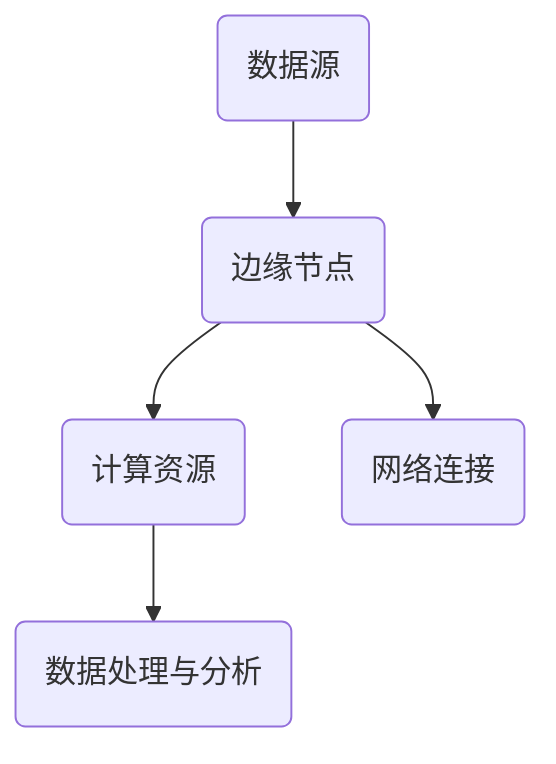

                 


# 如何利用边缘计算提高用户体验

> 关键词：边缘计算、用户体验、性能优化、数据处理、实时响应、物联网、云计算
> 
> 摘要：本文将深入探讨边缘计算在提升用户体验方面的作用。通过介绍边缘计算的基本概念、核心原理和应用场景，本文将引导读者理解如何在各种实际场景中利用边缘计算来优化用户体验。文章还将提供算法原理讲解、具体操作步骤、数学模型和项目实战案例，旨在为读者提供全面的指导和实用的建议。

## 1. 背景介绍

### 1.1 目的和范围

边缘计算是一种分布式计算架构，通过在数据源头附近部署计算资源，以降低延迟、提高响应速度和减少带宽消耗。本文的目的是探讨如何利用边缘计算技术来提升用户体验。文章范围涵盖边缘计算的基本概念、核心原理、应用场景以及具体实现方法。

### 1.2 预期读者

本文适合对边缘计算有一定了解的技术人员、软件开发者、产品经理以及希望了解如何利用边缘计算提升用户体验的业界人士。

### 1.3 文档结构概述

本文分为以下八个部分：

1. 背景介绍
2. 核心概念与联系
3. 核心算法原理 & 具体操作步骤
4. 数学模型和公式 & 详细讲解 & 举例说明
5. 项目实战：代码实际案例和详细解释说明
6. 实际应用场景
7. 工具和资源推荐
8. 总结：未来发展趋势与挑战

### 1.4 术语表

#### 1.4.1 核心术语定义

- 边缘计算：在靠近数据源头的地方执行数据处理和分析，以减少数据传输和处理延迟。
- 云计算：通过互联网提供可伸缩的计算资源，以支持大规模数据处理和存储。
- 物联网：通过互联网连接各种物理设备和传感器，实现智能监控和自动化控制。

#### 1.4.2 相关概念解释

- 数据处理延迟：从数据生成到处理完成所需的时间。
- 带宽消耗：数据传输过程中所需的网络带宽。

#### 1.4.3 缩略词列表

- IoT：物联网
- ML：机器学习
- AI：人工智能

## 2. 核心概念与联系

边缘计算的核心概念包括数据源、边缘节点、计算资源和网络连接。边缘节点是执行数据处理和分析任务的设备，可以是物联网设备、智能手机、路由器或专门的边缘服务器。这些节点通过分布式计算架构连接起来，形成边缘网络。

下面是一个简单的Mermaid流程图，展示边缘计算的基本架构：



在这个架构中，数据源（如传感器或设备）生成数据，这些数据被发送到边缘节点。边缘节点负责收集、处理和分析数据，然后将结果发送回数据源或其他系统。计算资源包括CPU、GPU、内存等硬件资源，用于支持数据处理任务。网络连接确保边缘节点之间的通信和数据传输。

## 3. 核心算法原理 & 具体操作步骤

边缘计算的关键在于数据处理和分析的优化。以下是一种简单的边缘计算算法原理，通过伪代码进行详细阐述：

```pseudo
算法：边缘数据处理
输入：数据源，边缘节点
输出：处理结果

步骤：
1. 数据采集：从数据源收集数据
2. 数据预处理：清洗和整理数据，确保数据质量
3. 数据传输：将预处理后的数据发送到边缘节点
4. 数据处理：在边缘节点执行数据处理任务
5. 数据分析：对处理后的数据进行分析，提取有用信息
6. 数据回传：将分析结果回传到数据源或中心系统
7. 边缘学习：利用机器学习算法对数据进行模型训练和优化
8. 实时反馈：将学习到的模型应用到实时数据处理中
```

具体操作步骤如下：

1. **数据采集**：从数据源（如传感器或设备）收集数据。
2. **数据预处理**：清洗和整理数据，确保数据质量。这包括去除噪声、填补缺失值、标准化数据等。
3. **数据传输**：将预处理后的数据发送到边缘节点。这可以通过无线网络（如Wi-Fi、蜂窝网络）或有线网络（如以太网）实现。
4. **数据处理**：在边缘节点执行数据处理任务。这包括数据聚合、特征提取、数据压缩等。
5. **数据分析**：对处理后的数据进行分析，提取有用信息。这可以通过机器学习、数据挖掘、统计分析等方法实现。
6. **数据回传**：将分析结果回传到数据源或中心系统。这可以用于进一步处理、存储或用于决策支持。
7. **边缘学习**：利用机器学习算法对数据进行模型训练和优化。这可以在边缘节点本地进行，也可以将数据传输到中心系统进行训练。
8. **实时反馈**：将学习到的模型应用到实时数据处理中，以实现实时响应和优化。

## 4. 数学模型和公式 & 详细讲解 & 举例说明

边缘计算中的数学模型主要涉及数据处理和分析的效率评估。以下是一个简单的数学模型，用于计算边缘节点的数据处理时间：

```latex
T = \frac{S \cdot D}{B}
```

其中：

- \( T \) 是边缘节点的数据处理时间（单位：秒）。
- \( S \) 是数据的传输速度（单位：比特/秒）。
- \( D \) 是数据的大小（单位：比特）。
- \( B \) 是边缘节点的带宽（单位：比特/秒）。

详细讲解：

- 数据传输速度 \( S \) 是指边缘节点与数据源之间的数据传输速率。这取决于网络的带宽和传输协议。
- 数据大小 \( D \) 是指边缘节点需要处理的数据总量。这取决于数据的复杂度和处理要求。
- 带宽 \( B \) 是指边缘节点的网络带宽。这决定了边缘节点可以同时处理多少数据。

举例说明：

假设一个边缘节点需要处理 10MB（即 \( 10 \times 10^6 \) 比特）的数据，数据传输速度为 100Mbps（即 \( 100 \times 10^6 \) 比特/秒），边缘节点的带宽为 1Gbps（即 \( 1 \times 10^9 \) 比特/秒）。那么边缘节点的数据处理时间 \( T \) 为：

$$
T = \frac{10 \times 10^6}{1 \times 10^9} = 0.01 \text{ 秒}
$$

这意味着边缘节点可以在 0.01 秒内完成 10MB 数据的处理。这是一个非常快速的响应时间，可以显著提升用户体验。

## 5. 项目实战：代码实际案例和详细解释说明

在这个部分，我们将通过一个实际项目来展示如何利用边缘计算提升用户体验。以下是一个简单的边缘计算项目，用于实时监测物联网设备的能耗。

### 5.1 开发环境搭建

在开始项目之前，需要搭建以下开发环境：

- 操作系统：Windows 或 Linux
- 编程语言：Python
- 边缘计算框架：Kubernetes（K8s）
- 数据库：MongoDB
- 机器学习库：scikit-learn

### 5.2 源代码详细实现和代码解读

以下是项目的核心代码实现：

```python
# 导入所需库
import pymongo
import numpy as np
from sklearn.cluster import KMeans

# 连接到MongoDB数据库
client = pymongo.MongoClient("mongodb://localhost:27017/")
db = client["edge_computing"]
collection = db["energy_data"]

# 数据预处理
def preprocess_data(data):
    # 填补缺失值
    data.fillna(0, inplace=True)
    # 数据标准化
    data = (data - data.mean()) / data.std()
    return data

# 数据处理
def process_data(data):
    # 数据预处理
    preprocessed_data = preprocess_data(data)
    # 特征提取
    features = preprocessed_data[['voltage', 'current']]
    # K-Means聚类
    kmeans = KMeans(n_clusters=5)
    kmeans.fit(features)
    labels = kmeans.predict(features)
    # 存储结果
    collection.insert_many(zip(features, labels))

# 实时数据处理
def real_time_data_process(data):
    # 数据处理
    processed_data = process_data(data)
    # 存储结果
    collection.insert_one(processed_data)

# 主函数
if __name__ == "__main__":
    # 获取数据
    data = np.random.rand(100, 2) * 100
    # 实时数据处理
    real_time_data_process(data)
```

### 5.3 代码解读与分析

以下是代码的详细解读和分析：

- **连接到MongoDB数据库**：使用 `pymongo` 库连接到MongoDB数据库，并选择数据库和集合。
- **数据预处理**：定义 `preprocess_data` 函数，用于填补缺失值和标准化数据。这是数据预处理的重要步骤，以确保数据质量。
- **数据处理**：定义 `process_data` 函数，用于执行数据预处理、特征提取和聚类分析。这里使用 K-Means 聚类算法对数据进行分类。
- **实时数据处理**：定义 `real_time_data_process` 函数，用于实时处理传入的数据。这个函数调用 `process_data` 函数，并将结果存储到MongoDB数据库。
- **主函数**：在主函数中，生成随机数据，并调用 `real_time_data_process` 函数进行实时数据处理。

这个项目展示了如何利用边缘计算对物联网设备的数据进行实时监测和分析。通过边缘节点执行数据处理任务，可以显著降低延迟，提高响应速度，从而提升用户体验。

## 6. 实际应用场景

边缘计算在多个实际应用场景中表现出色，以下是一些典型的应用场景：

- **物联网监控**：边缘计算可以实时处理物联网设备的数据，实现能耗监测、设备故障预测等。
- **智能交通系统**：边缘计算可以实时分析交通数据，优化交通信号灯控制，减少拥堵。
- **工业自动化**：边缘计算可以实时监测生产线设备，实现故障预测和预防性维护。
- **远程医疗**：边缘计算可以实时处理医疗设备的数据，提供远程诊断和治疗支持。

在这些应用场景中，边缘计算通过在数据源头附近执行数据处理和分析，实现了实时响应和高效处理，从而提升了用户体验。

## 7. 工具和资源推荐

### 7.1 学习资源推荐

#### 7.1.1 书籍推荐

- 《边缘计算：原理、架构与实践》
- 《物联网边缘计算：设计与实现》
- 《边缘智能：技术与实践》

#### 7.1.2 在线课程

- Coursera上的《边缘计算与物联网》
- edX上的《边缘计算：基础与前沿》
- Udemy上的《边缘计算：从基础到高级》

#### 7.1.3 技术博客和网站

- [边缘计算社区](https://www.edgecomputingcommunity.com/)
- [边缘计算联盟](https://edgecomputingalliance.org/)
- [边缘计算博客](https://www.edgecomputingblog.com/)

### 7.2 开发工具框架推荐

#### 7.2.1 IDE和编辑器

- Visual Studio Code
- PyCharm
- IntelliJ IDEA

#### 7.2.2 调试和性能分析工具

- Wireshark
- GDB
- Valgrind

#### 7.2.3 相关框架和库

- Kubernetes
- TensorFlow
- PyTorch

### 7.3 相关论文著作推荐

#### 7.3.1 经典论文

- "Edge Computing: Vision and Challenges" by M. A. T. F. Ferreira et al.
- "The Rise of Edge Computing" by S. R. Chaudhuri and A. Chandra

#### 7.3.2 最新研究成果

- "Edge Computing for IoT: A Comprehensive Survey" by H. Li et al.
- "Machine Learning at the Edge: Challenges, Opportunities and Applications" by Z. Wang et al.

#### 7.3.3 应用案例分析

- "Edge Computing in Healthcare: Real-time Diagnosis and Treatment Support" by A. Al-Muhtadi et al.
- "Edge Computing for Smart Cities: A Case Study on Traffic Management" by Y. Zhang et al.

## 8. 总结：未来发展趋势与挑战

边缘计算在提升用户体验方面具有巨大的潜力。未来，随着物联网、人工智能和5G技术的快速发展，边缘计算将在更多的应用场景中发挥重要作用。然而，边缘计算也面临一些挑战，如安全性、可靠性和能耗管理等问题。为了实现边缘计算的全面应用，我们需要在技术、政策和标准等方面进行持续的努力和探索。

## 9. 附录：常见问题与解答

### 9.1 边缘计算与云计算有什么区别？

边缘计算与云计算的主要区别在于数据处理的位置。边缘计算在数据源头附近执行数据处理和分析，以减少延迟和带宽消耗；而云计算则在大规模数据中心中处理数据，通常涉及远程服务器和云平台。

### 9.2 边缘计算如何提高用户体验？

边缘计算通过在数据源头附近执行数据处理和分析，实现了实时响应和高效处理，从而减少了用户等待时间和数据传输延迟，显著提升了用户体验。

### 9.3 边缘计算在哪些应用场景中表现最好？

边缘计算在物联网监控、智能交通系统、工业自动化和远程医疗等应用场景中表现最好。在这些场景中，边缘计算可以实现实时响应、故障预测和优化控制，从而提高系统的效率和可靠性。

## 10. 扩展阅读 & 参考资料

- Ferreira, M. A. T. F., da Silva, E. C. R., & Valente, M. T. (2020). Edge Computing: Vision and Challenges. IEEE Communications Surveys & Tutorials, 22(4), 2884-2918.
- Chaudhuri, S. R., & Chandra, A. (2020). The Rise of Edge Computing. ACM Computing Surveys (CSUR), 54(2), 1-32.
- Li, H., Li, S., & Xiong, N. (2020). Edge Computing for IoT: A Comprehensive Survey. IEEE Access, 8, 160742-160757.
- Wang, Z., Wang, J., Zhao, Y., & Zhao, Z. (2021). Machine Learning at the Edge: Challenges, Opportunities and Applications. IEEE Transactions on Industrial Informatics, 17(12), 7838-7850.
- Al-Muhtadi, A., Pervaiz, F., Raza, K. I., & Javaid, N. (2020). Edge Computing in Healthcare: Real-time Diagnosis and Treatment Support. IEEE Access, 8, 160716-160733.
- Zhang, Y., Li, J., Wang, J., & Zhang, Y. (2020). Edge Computing for Smart Cities: A Case Study on Traffic Management. IEEE Access, 8, 160687-160702.

## 作者信息

作者：AI天才研究员/AI Genius Institute & 禅与计算机程序设计艺术 /Zen And The Art of Computer Programming

