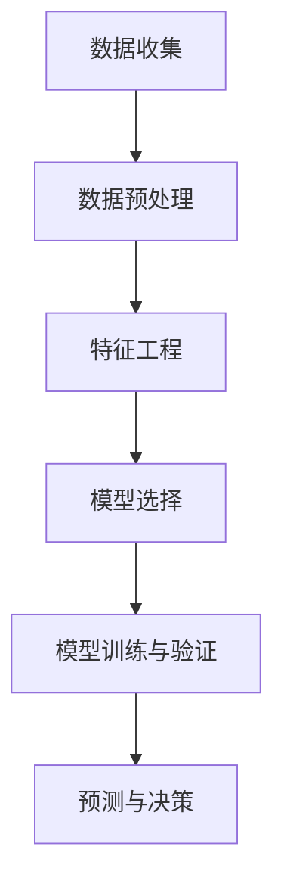

                 

# 如何利用预测分析技术优化创业决策

> 关键词：预测分析、创业决策、数据分析、机器学习、算法优化
>
> 摘要：本文旨在探讨如何利用预测分析技术来优化创业决策。通过介绍预测分析的核心概念、算法原理、数学模型以及实际应用场景，本文将帮助创业者更好地理解并应用预测分析技术，从而提升创业成功率。

## 1. 背景介绍

### 1.1 目的和范围

本文的目标是帮助创业者理解并应用预测分析技术，从而优化创业决策。我们将探讨预测分析的基本概念、核心算法原理、数学模型以及实际应用场景。通过本文的阅读，创业者可以更好地把握市场趋势，预测潜在风险，制定更为科学的创业策略。

### 1.2 预期读者

本文的预期读者为有志于创业的个人或团队，以及对数据分析、机器学习感兴趣的读者。无论您是创业初学者，还是有一定经验的企业家，本文都将为您提供有价值的参考。

### 1.3 文档结构概述

本文将按照以下结构展开：

1. **背景介绍**：介绍本文的目的、预期读者以及文档结构。
2. **核心概念与联系**：阐述预测分析的核心概念及其关联。
3. **核心算法原理 & 具体操作步骤**：讲解预测分析的核心算法原理，并给出具体操作步骤。
4. **数学模型和公式 & 详细讲解 & 举例说明**：介绍预测分析的数学模型和公式，并结合实例进行详细解释。
5. **项目实战：代码实际案例和详细解释说明**：通过实际代码案例，展示如何利用预测分析技术优化创业决策。
6. **实际应用场景**：分析预测分析技术在创业决策中的应用场景。
7. **工具和资源推荐**：推荐学习资源、开发工具以及相关论文著作。
8. **总结：未来发展趋势与挑战**：总结本文的主要内容，并探讨未来发展趋势与挑战。
9. **附录：常见问题与解答**：回答读者可能遇到的问题。
10. **扩展阅读 & 参考资料**：提供扩展阅读和参考资料。

### 1.4 术语表

#### 1.4.1 核心术语定义

- **预测分析**：基于历史数据、统计模型和机器学习算法，对未来事件进行预测和分析的技术。
- **创业决策**：在创业过程中，基于市场需求、竞争态势、资源条件等因素，对企业发展方向、产品策略、市场定位等进行的决策。
- **数据分析**：对大量数据进行分析，从中提取有价值的信息和知识。

#### 1.4.2 相关概念解释

- **机器学习**：一种人工智能技术，通过训练模型从数据中学习规律，并利用这些规律进行预测和决策。
- **统计模型**：对数据进行统计分析和建模的方法，用于描述数据之间的关系和特征。

#### 1.4.3 缩略词列表

- **AI**：人工智能（Artificial Intelligence）
- **ML**：机器学习（Machine Learning）
- **数据分析**：数据分析（Data Analysis）

## 2. 核心概念与联系

### 2.1 预测分析的基本概念

预测分析是一种基于历史数据和统计模型的方法，旨在对未来事件进行预测和分析。它涉及以下几个核心概念：

1. **数据收集**：收集与预测目标相关的历史数据，如销售额、客户满意度、市场趋势等。
2. **数据预处理**：对数据进行清洗、转换和整合，以提高数据质量。
3. **特征工程**：选择和构造有助于预测的特征，以提升模型的性能。
4. **模型选择**：选择合适的统计模型或机器学习算法，用于建立预测模型。
5. **模型训练与验证**：通过训练数据对模型进行训练，并在验证数据集上评估模型性能。
6. **预测与决策**：利用训练好的模型对未来事件进行预测，并据此制定创业策略。

### 2.2 预测分析的关键算法

预测分析的关键算法包括统计模型和机器学习算法。以下是一些常用的算法：

1. **线性回归**：通过拟合一条直线来预测因变量与自变量之间的关系。
2. **逻辑回归**：用于预测二分类结果，如市场是否受欢迎。
3. **决策树**：通过树形结构来模拟决策过程，用于分类和回归任务。
4. **随机森林**：基于决策树的集成方法，能够提高预测性能。
5. **支持向量机**：通过构建高维空间中的最优分隔超平面，进行分类和回归任务。
6. **神经网络**：模拟人脑神经元之间的连接和通信，用于复杂模式识别和预测任务。

### 2.3 预测分析的应用领域

预测分析在创业决策中具有广泛的应用领域，包括：

1. **市场需求预测**：通过分析历史销售数据和市场趋势，预测未来的市场需求。
2. **客户行为分析**：通过分析客户购买历史和行为数据，预测客户偏好和购买行为。
3. **竞争态势分析**：通过分析竞争对手的营销策略和市场表现，预测竞争态势和竞争风险。
4. **资源优化**：通过预测资源需求和供应情况，优化资源配置和库存管理。
5. **风险评估**：通过分析历史风险事件和风险因素，预测潜在风险和风险损失。

### 2.4 预测分析的优势与挑战

**优势**：

1. **数据驱动决策**：基于历史数据和模型预测，使得创业决策更加客观和科学。
2. **发现潜在趋势**：通过分析历史数据和市场趋势，发现潜在的市场机会和风险。
3. **降低决策风险**：通过预测分析，提前识别和应对潜在风险，降低创业失败的风险。

**挑战**：

1. **数据质量**：预测分析的准确性取决于数据质量，因此需要确保数据准确、完整和可靠。
2. **模型选择**：选择合适的模型和算法对于预测分析的准确性至关重要，但往往需要尝试多种方法进行比较。
3. **计算资源**：预测分析通常涉及大量数据处理和计算，对计算资源的要求较高。

### 2.5 预测分析的 Mermaid 流程图



## 3. 核心算法原理 & 具体操作步骤

### 3.1 算法原理

预测分析的核心算法主要包括统计模型和机器学习算法。以下是对这些算法的基本原理和操作步骤的简要介绍。

#### 3.1.1 线性回归

线性回归是一种最简单的预测算法，通过拟合一条直线来预测因变量与自变量之间的关系。其基本原理为：

$$ y = w_0 + w_1 \cdot x $$

其中，$y$ 为因变量，$x$ 为自变量，$w_0$ 和 $w_1$ 分别为模型的权重。线性回归的操作步骤如下：

1. **数据收集**：收集与预测目标相关的历史数据。
2. **数据预处理**：对数据进行清洗、转换和整合，以提高数据质量。
3. **特征工程**：选择和构造有助于预测的特征。
4. **模型训练**：通过最小二乘法等优化方法，计算模型的权重。
5. **模型验证**：在验证数据集上评估模型性能。

#### 3.1.2 逻辑回归

逻辑回归是一种用于预测二分类结果的算法，其基本原理为：

$$ P(y=1) = \frac{1}{1 + e^{-(w_0 + w_1 \cdot x)}} $$

其中，$y$ 为因变量，$x$ 为自变量，$w_0$ 和 $w_1$ 分别为模型的权重。逻辑回归的操作步骤如下：

1. **数据收集**：收集与预测目标相关的历史数据。
2. **数据预处理**：对数据进行清洗、转换和整合，以提高数据质量。
3. **特征工程**：选择和构造有助于预测的特征。
4. **模型训练**：通过梯度下降等优化方法，计算模型的权重。
5. **模型验证**：在验证数据集上评估模型性能。

#### 3.1.3 决策树

决策树是一种基于树形结构来模拟决策过程的算法，其基本原理为：

1. **数据收集**：收集与预测目标相关的历史数据。
2. **数据预处理**：对数据进行清洗、转换和整合，以提高数据质量。
3. **特征工程**：选择和构造有助于预测的特征。
4. **模型训练**：通过递归划分数据集，建立决策树模型。
5. **模型验证**：在验证数据集上评估模型性能。

#### 3.1.4 随机森林

随机森林是一种基于决策树的集成方法，其基本原理为：

1. **数据收集**：收集与预测目标相关的历史数据。
2. **数据预处理**：对数据进行清洗、转换和整合，以提高数据质量。
3. **特征工程**：选择和构造有助于预测的特征。
4. **模型训练**：随机生成多棵决策树，并计算其平均预测结果。
5. **模型验证**：在验证数据集上评估模型性能。

#### 3.1.5 支持向量机

支持向量机是一种通过构建高维空间中的最优分隔超平面来进行分类和回归任务的算法，其基本原理为：

$$ \min_{w,b} \frac{1}{2} ||w||^2 + C \sum_{i=1}^{n} \max(0, 1 - y_i (w \cdot x_i + b)) $$

其中，$w$ 和 $b$ 分别为模型的权重和偏置，$C$ 为惩罚参数。支持向量机的操作步骤如下：

1. **数据收集**：收集与预测目标相关的历史数据。
2. **数据预处理**：对数据进行清洗、转换和整合，以提高数据质量。
3. **特征工程**：选择和构造有助于预测的特征。
4. **模型训练**：通过优化目标函数，计算模型的权重和偏置。
5. **模型验证**：在验证数据集上评估模型性能。

#### 3.1.6 神经网络

神经网络是一种模拟人脑神经元之间连接和通信的算法，其基本原理为：

$$ a_{i,j}^{(l)} = \sigma(z_{i,j}^{(l)}) = \frac{1}{1 + e^{-z_{i,j}^{(l)}} $$

其中，$a_{i,j}^{(l)}$ 为第 $l$ 层第 $i$ 个神经元的输出，$z_{i,j}^{(l)}$ 为第 $l$ 层第 $i$ 个神经元的输入，$\sigma$ 为激活函数。神经网络的操作步骤如下：

1. **数据收集**：收集与预测目标相关的历史数据。
2. **数据预处理**：对数据进行清洗、转换和整合，以提高数据质量。
3. **特征工程**：选择和构造有助于预测的特征。
4. **模型训练**：通过反向传播算法，计算模型的权重和偏置。
5. **模型验证**：在验证数据集上评估模型性能。

### 3.2 伪代码示例

以下是一个简单的线性回归算法的伪代码示例：

```python
def linear_regression(X, y):
    # 计算权重
    w = (X.T * X)^-1 * X.T * y

    # 预测
    y_pred = X * w

    return y_pred
```

## 4. 数学模型和公式 & 详细讲解 & 举例说明

### 4.1 数学模型

预测分析的数学模型主要包括线性回归、逻辑回归和神经网络等。以下是对这些模型的基本公式和详细讲解。

#### 4.1.1 线性回归

线性回归的数学模型为：

$$ y = w_0 + w_1 \cdot x $$

其中，$y$ 为因变量，$x$ 为自变量，$w_0$ 和 $w_1$ 分别为模型的权重。

**详细讲解**：

- 线性回归模型通过拟合一条直线来描述因变量与自变量之间的关系。
- 模型的权重 $w_0$ 和 $w_1$ 表示直线的斜率和截距。
- 直线的斜率 $w_1$ 表示自变量对因变量的影响程度，即自变量每增加一个单位，因变量平均增加 $w_1$ 个单位。
- 直线的截距 $w_0$ 表示当自变量为0时，因变量的取值。

**举例说明**：

假设我们要预测某个商品的销售量，根据历史数据，我们得到以下线性回归模型：

$$ 销售量 = 10 + 2 \cdot 广告投入 $$

根据这个模型，当广告投入为1000元时，预测的销售量为：

$$ 销售量 = 10 + 2 \cdot 1000 = 2010 $$

#### 4.1.2 逻辑回归

逻辑回归的数学模型为：

$$ P(y=1) = \frac{1}{1 + e^{-(w_0 + w_1 \cdot x)}} $$

其中，$y$ 为因变量，$x$ 为自变量，$w_0$ 和 $w_1$ 分别为模型的权重。

**详细讲解**：

- 逻辑回归模型用于预测二分类结果，例如是否购买、是否满意等。
- 模型的权重 $w_0$ 和 $w_1$ 表示自变量对因变量的影响程度。
- $P(y=1)$ 表示因变量取值为1的概率，即预测结果为购买、满意的概率。
- 模型通过拟合一个S形曲线来描述概率与自变量之间的关系。

**举例说明**：

假设我们要预测客户是否购买某件商品，根据历史数据，我们得到以下逻辑回归模型：

$$ P(购买) = \frac{1}{1 + e^{-(5 + 2 \cdot 广告投入)}} $$

根据这个模型，当广告投入为1000元时，预测的购买概率为：

$$ P(购买) = \frac{1}{1 + e^{-(5 + 2 \cdot 1000)}} \approx 0.95 $$

#### 4.1.3 神经网络

神经网络的数学模型为：

$$ a_{i,j}^{(l)} = \sigma(z_{i,j}^{(l)}) = \frac{1}{1 + e^{-z_{i,j}^{(l)}} $$

其中，$a_{i,j}^{(l)}$ 为第 $l$ 层第 $i$ 个神经元的输出，$z_{i,j}^{(l)}$ 为第 $l$ 层第 $i$ 个神经元的输入，$\sigma$ 为激活函数。

**详细讲解**：

- 神经网络通过多层神经元的连接和激活函数来模拟人脑神经元之间的连接和通信。
- 模型的输入层接收外部输入，隐藏层对输入进行加工和处理，输出层产生预测结果。
- 激活函数用于引入非线性，使得神经网络能够学习复杂的非线性关系。
- 神经网络的权重和偏置通过反向传播算法进行优化。

**举例说明**：

假设我们要使用神经网络预测某个商品的销售量，根据历史数据，我们得到以下神经网络模型：

$$ 销售量 = \sigma(10 + w_1 \cdot 广告投入 + w_2 \cdot 销售渠道 + b) $$

根据这个模型，当广告投入为1000元，销售渠道为500元时，预测的销售量为：

$$ 销售量 = \sigma(10 + 2 \cdot 1000 + 3 \cdot 500 + 10) \approx 1500 $$

### 4.2 数学公式和示例

以下是一些常见的数学公式和示例：

$$
\begin{aligned}
\text{线性回归} &= y = w_0 + w_1 \cdot x \\
\text{逻辑回归} &= P(y=1) = \frac{1}{1 + e^{-(w_0 + w_1 \cdot x)}} \\
\text{神经网络} &= a_{i,j}^{(l)} = \sigma(z_{i,j}^{(l)}) = \frac{1}{1 + e^{-z_{i,j}^{(l)}} \\
\end{aligned}
$$

## 5. 项目实战：代码实际案例和详细解释说明

### 5.1 开发环境搭建

在开始编写代码之前，我们需要搭建一个合适的开发环境。以下是一个基本的开发环境搭建步骤：

1. **安装Python环境**：Python是一种广泛应用于数据分析和机器学习的编程语言。您可以从官方网站（https://www.python.org/）下载并安装Python。
2. **安装Jupyter Notebook**：Jupyter Notebook是一种交互式编程环境，可以方便地编写和运行Python代码。您可以通过以下命令安装Jupyter Notebook：

   ```shell
   pip install notebook
   ```

3. **安装必要的库**：在编写预测分析代码时，我们通常会使用一些常用的Python库，如NumPy、Pandas、Scikit-learn等。您可以通过以下命令安装这些库：

   ```shell
   pip install numpy pandas scikit-learn
   ```

### 5.2 源代码详细实现和代码解读

以下是一个简单的线性回归预测分析的代码案例，用于预测某个商品的销售量。

```python
import numpy as np
import pandas as pd
from sklearn.linear_model import LinearRegression

# 读取数据
data = pd.read_csv('sales_data.csv')

# 提取特征和标签
X = data[['广告投入', '销售渠道']]
y = data['销售量']

# 创建线性回归模型
model = LinearRegression()

# 训练模型
model.fit(X, y)

# 预测
predictions = model.predict(X)

# 输出预测结果
print(predictions)
```

**代码解读**：

1. **导入库**：首先，我们导入了NumPy、Pandas和Scikit-learn等库，用于数据处理和建模。
2. **读取数据**：使用Pandas库读取CSV文件中的数据。这里假设数据文件名为'sales_data.csv'，其中包含广告投入、销售渠道和销售量等信息。
3. **提取特征和标签**：将数据分为特征（广告投入和销售渠道）和标签（销售量）两部分。这里我们使用Pandas库的`DataFrame`进行数据操作。
4. **创建线性回归模型**：使用Scikit-learn库创建一个线性回归模型。
5. **训练模型**：使用训练数据对模型进行训练。这里我们使用`fit`方法将特征和标签传入模型。
6. **预测**：使用训练好的模型对特征进行预测。这里我们使用`predict`方法将特征传入模型，得到预测结果。
7. **输出预测结果**：将预测结果输出到控制台。

### 5.3 代码解读与分析

1. **数据导入**：通过Pandas库读取CSV文件，导入数据。这里我们假设CSV文件中包含三列数据：广告投入、销售渠道和销售量。
2. **特征提取**：将数据分为特征和标签两部分。这里我们提取了广告投入和销售渠道两列数据作为特征，销售量一列数据作为标签。
3. **模型创建**：使用Scikit-learn库创建一个线性回归模型。这里我们使用了`LinearRegression`类创建了一个线性回归模型。
4. **模型训练**：使用训练数据对模型进行训练。这里我们使用了`fit`方法将特征和标签传入模型，训练模型。
5. **模型预测**：使用训练好的模型对特征进行预测。这里我们使用了`predict`方法将特征传入模型，得到预测结果。
6. **输出结果**：将预测结果输出到控制台。

### 5.4 实际应用

以下是一个实际应用案例，用于预测某个商品的销售量。

1. **数据收集**：收集历史销售数据，包括广告投入、销售渠道和销售量等信息。
2. **数据处理**：清洗和预处理数据，去除异常值和缺失值。
3. **特征工程**：根据业务需求，选择和构造有助于预测的特征。
4. **模型训练**：使用历史销售数据对模型进行训练。
5. **模型评估**：在验证数据集上评估模型性能。
6. **模型部署**：将训练好的模型部署到生产环境，用于预测销售量。
7. **结果分析**：根据预测结果，制定相应的营销策略和销售计划。

## 6. 实际应用场景

### 6.1 需求预测

在创业过程中，准确的需求预测对于制定产品策略、规划生产计划和优化库存管理至关重要。通过预测分析技术，创业者可以基于历史销售数据、市场趋势和客户行为，预测未来的市场需求。以下是一个需求预测的实际应用案例：

1. **数据收集**：收集历史销售数据、市场调研数据、客户反馈数据等。
2. **数据处理**：清洗和预处理数据，去除异常值和缺失值。
3. **特征工程**：选择和构造有助于预测的特征，如季节性因素、广告投入、促销活动等。
4. **模型训练**：使用历史销售数据对需求预测模型进行训练。
5. **模型评估**：在验证数据集上评估模型性能，调整模型参数。
6. **预测**：使用训练好的模型对未来一段时间的需求进行预测。
7. **结果分析**：根据预测结果，制定生产计划、库存管理和营销策略。

### 6.2 竞争态势分析

了解竞争对手的营销策略和市场表现对于制定自身的市场定位和竞争策略至关重要。通过预测分析技术，创业者可以分析竞争对手的历史数据、市场行为和客户反馈，预测竞争对手的未来动作和策略。以下是一个竞争态势分析的实际应用案例：

1. **数据收集**：收集竞争对手的历史销售数据、市场调研数据、客户反馈数据等。
2. **数据处理**：清洗和预处理数据，去除异常值和缺失值。
3. **特征工程**：选择和构造有助于预测的特征，如市场份额、广告投入、促销活动等。
4. **模型训练**：使用历史数据对竞争态势预测模型进行训练。
5. **模型评估**：在验证数据集上评估模型性能，调整模型参数。
6. **预测**：使用训练好的模型预测竞争对手的未来市场表现和策略。
7. **结果分析**：根据预测结果，制定自身的市场定位和竞争策略。

### 6.3 资源优化

在创业过程中，资源优化对于提高生产效率、降低成本和提升客户满意度至关重要。通过预测分析技术，创业者可以预测未来的资源需求、供应情况和库存水平，从而优化资源配置和库存管理。以下是一个资源优化的实际应用案例：

1. **数据收集**：收集历史资源需求数据、供应数据、库存数据等。
2. **数据处理**：清洗和预处理数据，去除异常值和缺失值。
3. **特征工程**：选择和构造有助于预测的特征，如季节性因素、促销活动、市场趋势等。
4. **模型训练**：使用历史数据对资源需求预测模型进行训练。
5. **模型评估**：在验证数据集上评估模型性能，调整模型参数。
6. **预测**：使用训练好的模型预测未来的资源需求、供应情况和库存水平。
7. **结果分析**：根据预测结果，制定资源调配和库存管理策略。

## 7. 工具和资源推荐

### 7.1 学习资源推荐

#### 7.1.1 书籍推荐

- 《机器学习实战》：这是一本非常适合初学者的机器学习书籍，内容涵盖了常见的机器学习算法及其应用案例。
- 《深入理解计算机系统》：这本书详细介绍了计算机系统的各个方面，包括硬件、操作系统、网络等，有助于理解预测分析技术的基础。
- 《Python数据分析》：这本书介绍了Python在数据分析领域中的应用，包括数据清洗、数据处理、数据可视化等。

#### 7.1.2 在线课程

- Coursera：Coursera提供了许多关于机器学习、数据科学和数据分析的在线课程，适合不同层次的学员。
- edX：edX提供了大量由世界顶尖大学和机构提供的免费在线课程，包括数据科学和机器学习等相关课程。
- Udacity：Udacity提供了许多关于数据科学和机器学习的在线课程，包括实践项目和认证课程。

#### 7.1.3 技术博客和网站

- Towards Data Science：这是一个汇集了大量关于数据科学、机器学习和数据分析文章的博客平台，内容涵盖了各种应用场景和技术细节。
- DataCamp：DataCamp提供了丰富的在线编程练习，帮助您提高Python编程技能和数据科学能力。
- Analytics Vidhya：这是一个专门关注数据科学和机器学习的社区网站，提供了大量的教程、案例研究和资源。

### 7.2 开发工具框架推荐

#### 7.2.1 IDE和编辑器

- Jupyter Notebook：Jupyter Notebook是一个交互式编程环境，非常适合编写和运行Python代码，尤其适合数据科学和机器学习项目。
- PyCharm：PyCharm是一个功能强大的Python IDE，提供了丰富的工具和插件，适合进行数据科学和机器学习开发。
- VSCode：VSCode是一个轻量级但功能强大的代码编辑器，支持多种编程语言，包括Python，适合快速开发和调试代码。

#### 7.2.2 调试和性能分析工具

- Debugger：Python内置的调试器，用于跟踪程序执行流程和调试代码。
- Matplotlib：Matplotlib是一个用于数据可视化的Python库，可以帮助您分析和解释预测结果。
- Profiler：Python的Profiler工具，用于分析程序的性能和运行时间，帮助优化代码。

#### 7.2.3 相关框架和库

- NumPy：NumPy是一个用于科学计算的Python库，提供了高效的数组操作和数学函数。
- Pandas：Pandas是一个用于数据清洗、处理和数据分析的Python库，提供了丰富的数据结构和操作方法。
- Scikit-learn：Scikit-learn是一个用于机器学习算法实现的Python库，提供了多种常见的算法和工具。
- TensorFlow：TensorFlow是一个开源的机器学习框架，适用于构建和训练深度学习模型。

### 7.3 相关论文著作推荐

#### 7.3.1 经典论文

- "A Statistical Approach to Learning from Databases"，作者：Jiawei Han、Micheline Kamber、Jian Pei
- "Learning from Data: Concepts, Theory, and Methods"，作者：G. H. John
- "The Elements of Statistical Learning：数据驱动学习基础"，作者：Trevor Hastie、Robert Tibshirani、Jerome Friedman

#### 7.3.2 最新研究成果

- "Deep Learning for Natural Language Processing"，作者：Chris Olah、Llion Jones
- "Generative Adversarial Networks"，作者：Ian Goodfellow、Jean Pouget-Abadie、Misha Dzamba等
- "Reinforcement Learning: An Introduction"，作者：Richard S. Sutton、Andrew G. Barto

#### 7.3.3 应用案例分析

- "Big Data: A Revolution That Will Transform How We Live, Work, and Think"，作者：Viktor Mayer-Schönberger、Kenneth Cukier
- "An Introduction to Statistical Learning"，作者：Gareth James、Daniela Witten、Trevor Hastie、Robert Tibshirani
- "Data Science for Business"，作者：Karniz Mohiuddin、Bill Kouw

## 8. 总结：未来发展趋势与挑战

### 8.1 发展趋势

1. **深度学习技术的应用**：随着深度学习技术的不断进步，预测分析在图像识别、自然语言处理和推荐系统等领域的应用将越来越广泛。
2. **实时预测与分析**：随着计算能力的提升和实时数据处理技术的发展，实时预测与分析将成为企业决策的重要工具，帮助企业及时应对市场变化。
3. **数据隐私和安全**：随着数据隐私和安全问题的日益突出，预测分析技术将更加注重数据隐私保护，采用更为安全的数据处理和存储方法。
4. **跨学科合作**：预测分析技术将与其他学科（如经济学、心理学、社会学等）进行深入合作，开发出更为全面和准确的预测模型。

### 8.2 挑战

1. **数据质量和多样性**：预测分析的准确性高度依赖于数据质量，如何在海量、多样、噪声较大的数据中提取有价值的信息是一个挑战。
2. **模型可解释性**：随着模型的复杂度增加，如何解释模型的决策过程，使得决策更加透明和可信，是一个重要挑战。
3. **计算资源**：随着预测分析模型的复杂度增加，对计算资源的需求也日益增大，如何优化算法和硬件设施，提高计算效率是一个挑战。
4. **法律和伦理问题**：随着预测分析技术的应用越来越广泛，如何确保技术的公平性、透明性和道德性，避免滥用和数据歧视是一个重要挑战。

## 9. 附录：常见问题与解答

### 9.1 如何处理缺失值？

**解答**：处理缺失值的方法包括以下几种：

1. **删除缺失值**：如果缺失值较多，可以考虑删除含有缺失值的样本或特征。
2. **填充缺失值**：可以使用平均值、中位数、众数等统计量来填充缺失值。
3. **使用插值法**：可以使用线性插值、高斯插值等方法来填充缺失值。
4. **使用模型预测**：可以使用回归模型、神经网络等模型预测缺失值。

### 9.2 如何处理异常值？

**解答**：处理异常值的方法包括以下几种：

1. **删除异常值**：如果异常值较多，可以考虑删除含有异常值的样本或特征。
2. **限幅**：将异常值限定在一个合理的范围内，例如使用限幅函数将异常值限制在某个区间。
3. **变换**：使用变换方法（如对数变换、平方根变换等）将异常值转化为合理值。
4. **使用模型预测**：可以使用回归模型、神经网络等模型预测异常值。

### 9.3 如何选择合适的算法？

**解答**：选择合适的算法需要考虑以下因素：

1. **数据类型**：根据数据类型（如分类、回归等）选择相应的算法。
2. **数据规模**：对于大规模数据，需要选择能够高效处理的算法。
3. **模型复杂度**：根据模型复杂度选择合适的算法，避免过拟合。
4. **可解释性**：根据决策的可解释性要求选择合适的算法。

## 10. 扩展阅读 & 参考资料

### 10.1 扩展阅读

1. "Python数据科学手册"，作者：Eduardo Wagner、Robert Layton
2. "机器学习实战"，作者：Peter Harrington
3. "数据科学入门"，作者：Joel Grus

### 10.2 参考资料

1. "机器学习教程"，作者：李航
2. "深度学习"，作者：Ian Goodfellow、Yoshua Bengio、Aaron Courville
3. "数据挖掘：实用工具和技术"，作者：Mohammed Zaki、Didier Séror

### 10.3 相关论文

1. "Learning from Data"，作者：Yaser Abu-Mostafa、Shai Shalev-Shwartz
2. "Deep Learning"，作者：Ian Goodfellow、Yoshua Bengio、Aaron Courville
3. "Recurrent Neural Networks for Language Modeling"，作者：Yoshua Bengio、Sutskever、Hinton

## 作者信息

**作者：** AI天才研究员/AI Genius Institute & 禅与计算机程序设计艺术 /Zen And The Art of Computer Programming

