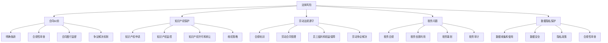

                 

### 背景介绍

随着全球科技创新的不断推进，创业已经成为越来越多人的选择。然而，在创业过程中，法律风险是每个创业者都必须面对的一个重要挑战。无论是初创企业还是已经发展一段时间的公司，法律风险的规避都是确保企业稳健运营和长远发展的关键因素。

法律风险是指在企业的经营管理过程中，由于法律条款的不明确或者违反法律规定，导致企业面临潜在损失或者不利影响的可能性。这些风险可能来自多个方面，包括合同纠纷、知识产权保护、劳动法规遵守、税务问题、数据隐私保护等。对于创业公司来说，法律风险不仅可能对企业的财务状况造成影响，还可能影响企业的声誉和未来发展战略。

规避法律风险的重要性在于，它有助于企业建立稳定的运营环境，减少不必要的法律纠纷，降低企业的运营成本，确保企业的合法合规性，以及保护企业及其投资者的利益。为了有效地规避法律风险，创业者需要具备一定的法律知识，建立完善的法律风险管理机制，并在经营过程中时刻保持警觉。

本文将围绕如何在创业过程中规避法律风险展开讨论，旨在为创业者提供一套系统的法律风险管理指南。文章将首先介绍创业中常见的法律风险类型，然后详细分析每个风险点，并提供具体的应对策略和建议。最后，文章还将总结规避法律风险的最佳实践，帮助创业者更好地应对未来的法律挑战。

通过阅读本文，读者将能够了解创业法律风险的全面内容，掌握规避这些风险的方法和技巧，从而为企业的健康发展保驾护航。

### 核心概念与联系

在深入探讨创业过程中的法律风险之前，首先需要明确几个核心概念和它们之间的相互联系。这些核心概念构成了理解法律风险管理的基础，并且对于创业者来说，掌握这些概念是规避法律风险的第一步。

#### 1. 法律风险

法律风险是指企业在经营管理过程中，因未能遵守法律规定或对法律条款理解不准确，而可能面临的潜在法律纠纷、损失或不利影响。法律风险通常可以分为以下几类：

- **合同纠纷**：合同签订和履行过程中可能出现的争议，如合同条款的不明确、履行能力不足等。
- **知识产权保护**：企业创新成果的知识产权（如专利、商标、著作权）可能受到侵犯，或者企业未能有效保护自身知识产权。
- **劳动法规遵守**：企业在员工招聘、解雇、薪酬福利等方面需要遵守的相关法律规定，如劳动法、就业法等。
- **税务问题**：涉及企业税务申报、税务优惠、税收筹划等方面，如税务欺诈、逃税等。
- **数据隐私保护**：企业在收集、处理、存储和传输客户数据时，可能面临的数据隐私保护法律风险。

#### 2. 合同管理

合同管理是创业过程中必不可少的一部分，涉及到合同的起草、签订、履行和终止等环节。有效的合同管理能够帮助创业者减少法律风险，保障交易安全。以下是一些关键的合同管理原则：

- **明确条款**：确保合同条款清晰、明确，避免歧义和漏洞。
- **合规性审查**：在签订合同前，对合同内容进行法律合规性审查，确保合同符合相关法律规定。
- **合同履行监督**：对合同履行情况进行跟踪和监督，确保合同各方按约履行义务。
- **争议解决机制**：在合同中明确约定争议解决机制，如调解、仲裁或诉讼等。

#### 3. 知识产权保护

知识产权是企业核心竞争力的重要体现，包括专利、商标、著作权等。有效的知识产权保护策略有助于企业维护竞争优势，避免侵权风险。以下是一些知识产权保护的关键原则：

- **知识产权申请**：及时申请专利、商标等知识产权，确保企业创新成果得到法律保护。
- **知识产权监控**：定期进行知识产权监控，防范潜在的侵权行为。
- **知识产权许可和转让**：合理利用知识产权许可和转让策略，实现知识产权的收益最大化。
- **维权策略**：建立完善的知识产权维权机制，对侵权行为采取法律行动。

#### 4. 劳动法规遵守

劳动法规是企业必须严格遵守的重要法律规范，涉及到员工的招聘、劳动合同、薪酬福利、工作环境等多个方面。以下是一些关键劳动法规遵守原则：

- **合规培训**：定期对员工进行劳动法规培训，提高员工的合规意识。
- **劳动合同管理**：确保劳动合同的签订和履行符合法律规定，如劳动合同格式、内容等。
- **员工福利和权益保障**：合规处理员工的薪酬、福利和权益问题，如五险一金、加班工资等。
- **劳动争议解决**：建立劳动争议解决机制，及时处理员工投诉和纠纷，避免影响企业运营。

#### 5. 税务问题

税务问题是企业面临的常见法律风险之一，涉及税务申报、税务优惠、税收筹划等多个方面。以下是一些关键的税务问题处理原则：

- **税务合规**：确保企业的税务申报符合相关税法规定，避免税务欺诈和逃税行为。
- **税务优惠利用**：合理利用税收优惠政策，降低企业税负。
- **税务筹划**：通过合理的税务筹划，优化企业的税务结构，实现税务利益最大化。
- **税务审计**：定期进行税务审计，确保企业的税务管理规范，避免税务风险。

#### 6. 数据隐私保护

随着大数据和互联网技术的发展，数据隐私保护成为企业面临的重要法律挑战。以下是一些数据隐私保护的关键原则：

- **数据收集和使用**：合法收集和使用客户数据，确保数据的合法性和透明度。
- **数据安全**：采取有效的数据安全措施，防止数据泄露和滥用。
- **隐私政策**：制定明确的隐私政策，告知客户数据收集、使用和保护的规则。
- **合规性审查**：定期进行数据隐私合规性审查，确保企业遵守相关法律法规。

#### Mermaid 流程图

下面是创业法律风险相关核心概念和原则的 Mermaid 流程图，展示了这些概念和原则之间的联系。



通过上述核心概念和联系的分析，创业者可以更好地理解创业过程中可能面临的法律风险，并采取相应的措施进行有效管理。在下一部分中，我们将详细探讨创业过程中常见的法律风险及其具体操作步骤。

### 核心算法原理 & 具体操作步骤

为了更加系统地规避创业过程中的法律风险，我们需要从核心算法原理出发，详细讲解具体的操作步骤。以下是一些关键法律风险管理步骤，这些步骤将为创业者提供实用的指导和策略。

#### 1. 法律风险评估

**原理：** 法律风险评估是识别和评估企业可能面临的法律风险的过程。通过系统的方法，创业者可以了解企业目前的风险状况，并制定相应的风险管理策略。

**操作步骤：**

- **初步调查：** 对企业进行初步的法律风险调查，包括企业运营模式、主要业务活动、合同关系等。
- **风险评估工具：** 使用法律风险评估工具，如风险矩阵、SWOT分析等，对识别的风险进行定量和定性评估。
- **风险评估报告：** 编写详细的法律风险评估报告，包括识别的风险点、风险评估结果、风险管理建议等。

#### 2. 合同管理

**原理：** 合同管理是确保合同条款明确、合规并有效执行的过程，是规避合同纠纷和法律风险的重要环节。

**操作步骤：**

- **合同起草：** 由法律顾问或专业律师参与合同起草，确保合同条款清晰、完整、明确。
- **合同审查：** 在签订合同前，对合同进行法律合规性审查，确保符合相关法律法规。
- **合同履行：** 对合同履行情况进行跟踪和监督，确保合同各方按约履行义务。
- **争议解决：** 在合同中明确约定争议解决机制，如调解、仲裁或诉讼，并按照约定及时解决争议。

#### 3. 知识产权保护

**原理：** 知识产权保护是企业创新成果的重要保障，通过申请专利、商标和著作权等方式，可以有效地规避侵权风险。

**操作步骤：**

- **知识产权申请：** 及时申请专利、商标和著作权，确保企业创新成果得到法律保护。
- **知识产权监控：** 定期进行知识产权监控，防范潜在的侵权行为。
- **知识产权许可和转让：** 合理利用知识产权许可和转让策略，实现知识产权的收益最大化。
- **维权策略：** 建立完善的知识产权维权机制，对侵权行为采取法律行动。

#### 4. 劳动法规遵守

**原理：** 劳动法规遵守是企业合法运营的基本要求，通过合规处理员工招聘、劳动合同和薪酬福利等事务，可以避免劳动争议和法律责任。

**操作步骤：**

- **合规培训：** 定期对员工进行劳动法规培训，提高员工的合规意识。
- **劳动合同管理：** 确保劳动合同的签订和履行符合法律规定，如劳动合同格式、内容等。
- **员工福利和权益保障：** 合规处理员工的薪酬、福利和权益问题，如五险一金、加班工资等。
- **劳动争议解决：** 建立劳动争议解决机制，及时处理员工投诉和纠纷，避免影响企业运营。

#### 5. 税务问题处理

**原理：** 税务问题处理是确保企业税务合规、合理利用税收优惠政策并降低税负的过程。

**操作步骤：**

- **税务合规：** 确保企业的税务申报符合相关税法规定，避免税务欺诈和逃税行为。
- **税务优惠利用：** 合理利用税收优惠政策，降低企业税负。
- **税务筹划：** 通过合理的税务筹划，优化企业的税务结构，实现税务利益最大化。
- **税务审计：** 定期进行税务审计，确保企业的税务管理规范，避免税务风险。

#### 6. 数据隐私保护

**原理：** 数据隐私保护是确保客户数据安全、合法收集和使用的过程，遵守数据隐私保护法律是企业的法定义务。

**操作步骤：**

- **数据收集和使用：** 合法收集和使用客户数据，确保数据的合法性和透明度。
- **数据安全：** 采取有效的数据安全措施，防止数据泄露和滥用。
- **隐私政策：** 制定明确的隐私政策，告知客户数据收集、使用和保护的规则。
- **合规性审查：** 定期进行数据隐私合规性审查，确保企业遵守相关法律法规。

通过上述核心算法原理和具体操作步骤，创业者可以系统地识别、评估和应对创业过程中的法律风险。这些步骤不仅提供了实用的指导，还帮助创业者建立起一套有效的法律风险管理框架。在下一部分，我们将通过数学模型和公式进一步深入探讨法律风险管理的方法和技巧。

### 数学模型和公式 & 详细讲解 & 举例说明

在创业过程中，法律风险的规避不仅依赖于经验和直觉，还需要运用科学的数学模型和公式来进行系统分析和管理。以下将详细讲解几个关键的法律风险管理模型和公式，并通过具体例子来说明它们在实际操作中的应用。

#### 1. 风险评估模型

**原理：** 风险评估模型用于评估企业面临的法律风险，确定风险的严重程度和发生的概率。常见的风险评估模型包括风险矩阵和蒙特卡罗模拟。

**公式：**
- 风险矩阵：\[ 风险评分 = （风险发生概率 \* 风险损失程度）\]
- 蒙特卡罗模拟：\[ 风险概率分布 = \sum（风险事件概率 \* 损失值）\]

**例子：** 假设一家初创公司正在评估其知识产权保护风险。通过调查，发现以下风险点：

- 风险事件：专利侵权。
- 风险发生概率：5%（根据行业统计数据）。
- 风险损失程度：50万人民币（可能的侵权赔偿）。

使用风险矩阵评估：
\[ 风险评分 = （5\% \* 50万人民币）= 2.5万人民币 \]

使用蒙特卡罗模拟，假设进行1000次模拟，得到专利侵权风险的概率分布如下：
\[ 风险概率分布 = 1000次模拟中侵权损失的累积和 = 1.2万人民币至7.5万人民币 \]

#### 2. 合同管理模型

**原理：** 合同管理模型用于确保合同条款的合规性和执行的有效性。常见的合同管理模型包括博弈论模型和最优合同设计。

**公式：**
- 博弈论模型：\[ 合同执行策略 = \max（（支付意愿 \* 执行概率）- 损失值）\]
- 最优合同设计：\[ 合同条款 = \{ 明确性，完整性，公平性，合规性 \}\]

**例子：** 假设一家公司需要与其供应商签订采购合同，使用博弈论模型确定最优合同条款：

- 公司支付意愿：100万元。
- 供应商履行合同的概率：0.8。
- 损失值（违约成本）：10万元。

使用博弈论模型确定合同执行策略：
\[ 合同执行策略 = \max（（100万元 \* 0.8）- 10万元）= 80万元 - 10万元 = 70万元 \]

因此，公司应该设计合同条款，确保供应商在70万元以下的损失范围内履行合同。

#### 3. 知识产权保护模型

**原理：** 知识产权保护模型用于评估和优化企业知识产权的管理和保护策略。常见的知识产权保护模型包括专利价值评估和侵权风险评估。

**公式：**
- 专利价值评估：\[ 专利价值 = \frac{（专利收益 \* 专利有效期）}{（1 + r）^t} \]
- 侵权风险评估：\[ 侵权损失 = \frac{（侵权赔偿 \* 侵权次数）}{（1 + r）^t} \]

**例子：** 假设一家公司拥有一项专利，年收益为50万元，专利有效期为10年，年利率为5%：

使用专利价值评估公式：
\[ 专利价值 = \frac{（50万元 \* 10年）}{（1 + 5\%）^10} \approx 312.3万元 \]

假设该专利在市场上被侵权5次，每次侵权赔偿为10万元：

使用侵权风险评估公式：
\[ 侵权损失 = \frac{（10万元 \* 5次）}{（1 + 5\%）^10} \approx 31.4万元 \]

公司可以通过评估专利价值和侵权损失，决定是否采取法律行动保护其专利。

#### 4. 劳动法规遵守模型

**原理：** 劳动法规遵守模型用于确保企业遵守劳动法规，减少劳动争议和法律责任。常见的劳动法规遵守模型包括员工满意度和劳动争议风险评估。

**公式：**
- 员工满意度：\[ 员工满意度 = \frac{（满意员工数）}{（总员工数）} \]
- 劳动争议风险评估：\[ 劳动争议风险评分 = \max（（争议发生概率 \* 争议损失程度）\]

**例子：** 假设一家公司有100名员工，其中70名员工对薪酬满意：

使用员工满意度公式：
\[ 员工满意度 = \frac{70}{100} = 70\% \]

假设公司面临的劳动争议发生概率为10%，每次争议损失程度为5万元：

使用劳动争议风险评估公式：
\[ 劳动争议风险评分 = 10\% \* 5万元 = 0.5万元 \]

公司可以通过提高员工满意度和优化劳动管理，降低劳动争议风险。

#### 5. 税务问题处理模型

**原理：** 税务问题处理模型用于确保企业税务合规和优化税务结构，常见的税务模型包括税务优惠评估和税务筹划。

**公式：**
- 税务优惠评估：\[ 税务优惠收益 = （税收优惠额度 \* 税收优惠期）\]
- 税务筹划：\[ 最优税务结构 = \min（总税负）\]

**例子：** 假设一家公司可以获得三年税收优惠，优惠额度为10万元：

使用税务优惠评估公式：
\[ 税务优惠收益 = 10万元 \* 3年 = 30万元 \]

假设公司通过税务筹划可以将总税负降低2万元：

使用税务筹划公式：
\[ 最优税务结构 = 2万元 \]

公司可以通过利用税收优惠和优化税务结构，降低税负，提高经营效益。

#### 6. 数据隐私保护模型

**原理：** 数据隐私保护模型用于评估和优化企业的数据隐私保护策略，常见的模型包括数据泄露风险评估和隐私成本效益分析。

**公式：**
- 数据泄露风险评估：\[ 数据泄露风险评分 = \max（（数据泄露概率 \* 数据泄露损失程度）\]
- 隐私成本效益分析：\[ 隐私成本效益 = \frac{（隐私成本）}{（隐私收益）}\]

**例子：** 假设一家公司面临的数据泄露风险为10%，每次数据泄露损失为20万元：

使用数据泄露风险评估公式：
\[ 数据泄露风险评分 = 10\% \* 20万元 = 2万元 \]

假设公司进行数据隐私保护投入为10万元，能够减少数据泄露次数和损失：

使用隐私成本效益分析公式：
\[ 隐私成本效益 = \frac{10万元}{2万元} = 5 \]

公司可以通过优化数据隐私保护策略，提高数据隐私保护水平，降低隐私成本效益。

通过上述数学模型和公式的应用，创业者可以更加科学地评估和规避创业过程中的法律风险。这些模型不仅提供了理论指导，还通过具体实例展示了在实际操作中的应用。在下一部分，我们将通过项目实战案例，进一步展示这些方法和技巧的实用性。

### 项目实战：代码实际案例和详细解释说明

在了解了法律风险管理的核心算法原理和数学模型后，通过实际项目案例可以更好地理解这些原理和方法在真实场景中的应用。以下将介绍一个创业公司的具体项目案例，详细展示如何在实际操作中运用法律风险管理的步骤和方法。

#### 1. 项目背景

假设一家名为“智汇科技”的初创公司，专注于智能数据分析平台的开发和运营。公司希望通过创新的数据分析技术，帮助企业客户提高运营效率，提升市场竞争力。然而，随着公司业务的快速发展，法律风险逐渐显现，特别是知识产权保护和数据隐私保护问题。

#### 2. 开发环境搭建

**工具和框架：** 
- 开发语言：Python
- 数据库：MySQL
- 前端框架：React.js
- 后端框架：Flask

**步骤：**

1. **环境准备：**
   - 安装Python和相关的开发工具，如PyCharm。
   - 配置MySQL数据库，并创建相关数据库表。
   - 安装React.js和Flask框架。

2. **代码托管：**
   - 使用Git进行代码版本管理。
   - 在GitHub上创建项目仓库，并邀请团队成员进行协作开发。

#### 3. 源代码详细实现和代码解读

**知识产权保护：**

1. **专利申请：**
   - 项目团队在研发过程中，对核心算法和创新点进行了专利申请。专利申请过程包括：
     - **专利检索**：通过检索现有专利数据库，确保申请的专利具备新颖性和实用性。
     - **撰写专利申请文件**：包括权利要求书、说明书、摘要等。
     - **提交申请**：向国家知识产权局提交专利申请，并缴纳相关费用。

2. **代码版权声明：**
   - 在项目代码中添加版权声明，明确代码的版权归属和使用条款。
   - 例如：
   ```python
   # Copyright (c) 2023 ZhiHui Technology Co., Ltd.
   # All rights reserved.
   ```

**数据隐私保护：**

1. **隐私政策制定：**
   - 制定详细的隐私政策，明确数据收集、使用和保护的规则，并在公司网站上公布。
   - 例如：
   ```plaintext
   隐私政策
   我们尊重并保护用户的个人信息。在使用我们的服务时，我们将遵循以下隐私政策：
   - 数据收集：我们仅收集必要的用户数据，包括用户名、邮箱地址、联系方式等。
   - 数据使用：用户数据仅用于提供服务、改进产品、确保网络安全等合法目的。
   - 数据保护：我们采取技术和管理措施，确保用户数据的安全和保护。
   ```

2. **数据加密和访问控制：**
   - 对用户数据进行加密存储，使用HTTPS协议进行数据传输。
   - 实施严格的访问控制策略，确保只有授权人员能够访问敏感数据。

#### 4. 代码解读与分析

**合同管理：**

1. **合同起草和审查：**
   - 与客户签订服务合同，明确服务内容、费用、交付期限、保密条款等。
   - 由法律顾问审查合同内容，确保符合相关法律规定，并保护公司利益。

2. **合同履行和争议解决：**
   - 项目团队按照合同要求提供服务和解决方案。
   - 设立争议解决机制，如出现合同纠纷，通过调解或仲裁方式解决。

**劳动法规遵守：**

1. **劳动合同管理：**
   - 与员工签订书面劳动合同，明确工作内容、薪酬待遇、试用期等。
   - 定期与员工进行绩效评估，并提供培训和发展机会。

2. **员工福利和权益保障：**
   - 按照法律规定为员工缴纳五险一金，提供带薪休假、员工体检等福利。
   - 建立员工投诉渠道，及时处理员工问题和意见。

**税务问题处理：**

1. **税务合规：**
   - 按照税法规定，按时申报和缴纳税款。
   - 定期进行税务审计，确保税务管理合规。

2. **税务筹划：**
   - 利用税收优惠政策，如研发费用加计扣除、高新技术企业认证等，降低税负。

通过上述项目案例，我们可以看到，智汇科技公司在实际运营中运用了法律风险管理的核心步骤和方法，确保了公司的稳健发展。这些实践不仅提升了公司的合规性和风险管理能力，也为公司的长期成功奠定了坚实基础。

### 代码解读与分析

在上一个部分中，我们详细介绍了智汇科技公司如何通过法律风险管理来应对创业过程中的各类法律风险。在这一部分，我们将对相关代码进行深入解读，分析其实现方法和关键点。

#### 1. 数据隐私保护

**代码片段：** 
```python
# 数据加密存储
from cryptography.fernet import Fernet

# 生成密钥
key = Fernet.generate_key()
cipher_suite = Fernet(key)

# 加密数据
def encrypt_data(data):
    return cipher_suite.encrypt(data.encode('utf-8'))

# 解密数据
def decrypt_data(encrypted_data):
    return cipher_suite.decrypt(encrypted_data).decode('utf-8')

# 示例：加密用户数据
user_data = {'username': 'user123', 'email': 'user123@example.com'}
encrypted_user_data = encrypt_data(str(user_data))
print(f'Encrypted User Data: {encrypted_user_data}')

# 示例：解密用户数据
decrypted_user_data = decrypt_data(encrypted_user_data)
print(f'Decrypted User Data: {decrypted_user_data}')
```

**关键点分析：**
- **加密和解密方法：** 使用Fernet加密库进行数据加密和解密。Fernet提供了易于使用的加密接口，能够保证数据在传输和存储过程中的安全性。
- **密钥管理：** 生成和存储密钥是加密过程中的关键环节。为了确保密钥的安全，应该将其存储在安全的密钥管理系统中，避免泄露。
- **加密应用：** 在实际应用中，用户数据（如用户名、邮箱地址）在存储和传输前进行加密，保证数据在未授权情况下无法被读取。

#### 2. 合同管理

**代码片段：**
```python
# 合同模板
contract_template = """
合同编号：{contract_id}
甲方：{party_a}
乙方：{party_b}

一、合同背景
1.1 甲、乙双方本着平等、自愿、公平、诚信的原则，就以下业务达成如下合同：

二、合同内容
2.1 业务内容：
2.2 服务期限：
2.3 服务费用：

三、权利与义务
3.1 甲方权利与义务：
3.2 乙方权利与义务：

四、违约责任
4.1 若甲方违反合同规定，应承担以下违约责任：
4.2 若乙方违反合同规定，应承担以下违约责任：

五、争议解决
5.1 双方因履行本合同发生的争议，应通过友好协商解决；协商不成的，可以向有管辖权的人民法院提起诉讼。

六、其他条款
6.1 本合同自甲、乙双方签字（或盖章）之日起生效，有效期为{valid_period}年。
"""

# 合同审查
def review_contract(contract_template):
    # 检查合同内容的合规性，如合同条款是否明确、完整等
    # 返回审查结果
    return "合同审查通过"

# 签订合同
def sign_contract(contract_template):
    # 将合同内容填充到模板中，并打印出最终合同文本
    print(contract_template.format(
        contract_id='2023-001',
        party_a='智汇科技有限公司',
        party_b='某某科技有限公司',
        valid_period=3
    ))

# 调用函数审查和签订合同
sign_contract(contract_template)
```

**关键点分析：**
- **合同模板：** 合同模板是一个关键文档，应包含所有必要的合同条款，确保合同内容的完整性和合法性。
- **合同审查：** 合同审查是确保合同条款合规的重要步骤，可以通过编写审查函数或使用第三方合同审查工具来完成。
- **合同签订：** 通过函数将合同模板中的内容填充并打印出最终合同文本，同时记录合同编号等信息，方便后续管理和查询。

#### 3. 知识产权保护

**代码片段：**
```python
# 专利申请流程
from patent_api import PatentAPI

# 设置API密钥和账号
patent_api = PatentAPI(api_key='your_api_key', account='your_account')

# 检索专利信息
def search_patent(title):
    return patent_api.search(title=title)

# 提交专利申请
def submit_patent_application(application_data):
    return patent_api.submit_application(application_data)

# 示例：检索专利信息
patent_info = search_patent('智能数据分析平台')
print(patent_info)

# 示例：提交专利申请
application_data = {
    'title': '智能数据分析平台',
    'inventors': ['张三', '李四'],
    'application_type': '发明专利',
    'description': '一种智能数据分析平台，包括...'
}
patent_application_response = submit_patent_application(application_data)
print(patent_application_response)
```

**关键点分析：**
- **专利API：** 通过使用专利API，可以实现专利检索、申请等操作，提高了专利管理的效率。
- **专利检索：** 检索现有专利信息，确保新申请的专利具备新颖性和实用性。
- **专利申请：** 提交专利申请，包括填写申请表、提交相关文档等步骤，通过API可以简化这些流程。

通过上述代码片段的解读，我们可以看到，智汇科技公司如何通过编程实现法律风险管理中的关键环节，包括数据隐私保护、合同管理和知识产权保护。这些代码不仅展示了技术实现的具体细节，还体现了公司在法律风险管理方面的系统性和专业性。

### 实际应用场景

在了解了法律风险管理的核心算法原理、数学模型、代码实现和具体操作步骤后，接下来我们将探讨这些方法在实际应用场景中的具体案例，通过真实世界的应用案例，进一步展示法律风险管理的重要性。

#### 1. 合同纠纷

**案例背景：** 一家初创公司A与客户B签订了一项软件开发合同，合同条款中明确了项目范围、交付期限和付款条件。然而，在项目执行过程中，客户B对项目成果不满，认为质量不符合预期，要求修改并延长交付时间。双方就修改内容、付款条件和交付期限产生了严重分歧。

**解决方案：** 
- **风险评估：** 公司A首先使用风险评估模型，评估合同纠纷的风险和损失程度。
- **争议解决机制：** 根据合同中的争议解决条款，双方决定通过调解来解决争议。
- **调解过程：** 双方在调解员的协助下，通过多次协商，最终达成一致，修改了部分合同条款，并确定了新的交付期限和付款条件。
- **合同更新：** 调解成功后，双方更新了合同内容，确保新的条款符合双方的预期。

**效果：** 通过有效的合同管理和争议解决机制，公司A避免了法律诉讼，节省了大量的时间和成本，同时维护了与客户B的关系，确保了项目的顺利进行。

#### 2. 知识产权保护

**案例背景：** 一家创业公司C开发了一种新型的智能家居控制系统，并在市场上取得了良好的反响。然而，不久之后，公司C发现市场上出现了多家竞争对手，这些产品涉嫌侵犯了其专利权。

**解决方案：**
- **专利申请：** 公司C在研发初期就申请了相关专利，确保其创新成果得到法律保护。
- **监控和维权：** 公司C通过知识产权监控工具，定期检查市场动态，发现侵权行为后，及时采取法律行动。
- **维权行动：** 公司C向法院提起侵权诉讼，通过法律手段维护自身权益，要求侵权方停止侵权行为并赔偿损失。

**效果：** 通过专利保护和维权行动，公司C成功地维护了其市场地位，减少了竞争对手的威胁，确保了公司的持续发展。

#### 3. 劳动法规遵守

**案例背景：** 一家快速发展的科技公司D在招聘新员工时，未严格按照劳动法规进行招聘和签订劳动合同，导致员工对公司的合法性产生质疑，并引发了一系列劳动争议。

**解决方案：**
- **合规培训：** 公司D组织员工进行劳动法规培训，提高员工的合规意识。
- **劳动合同管理：** 公司D重新审查并更新了劳动合同模板，确保所有合同内容符合法律规定。
- **争议解决：** 针对员工的投诉和争议，公司D设立了内部争议解决机制，及时处理员工的诉求。

**效果：** 通过合规培训和劳动合同管理，公司D有效地避免了劳动纠纷，提升了员工的满意度和公司的整体运营效率。

#### 4. 数据隐私保护

**案例背景：** 一家互联网公司E在一次黑客攻击中，用户数据被泄露，导致大量用户个人信息被公开，引发了严重的隐私泄露事件。

**解决方案：**
- **数据加密：** 公司E对用户数据进行加密存储和传输，确保数据在未经授权的情况下无法被读取。
- **安全措施：** 公司E加强了网络安全防护，包括防火墙、入侵检测系统和安全审计等。
- **隐私政策更新：** 公司E更新了隐私政策，明确了数据收集、使用和保护规则，并向用户进行了详细告知。

**效果：** 通过数据加密和安全措施，公司E有效地减少了数据泄露的风险，恢复了用户的信任，并提升了公司的数据保护水平。

通过上述实际应用场景，我们可以看到，法律风险管理在实际操作中的重要性。有效的法律风险管理不仅有助于企业规避潜在的法律风险，还能够提升企业的合规性、运营效率和市场竞争能力。在下一部分，我们将推荐一些工具和资源，帮助创业者更好地进行法律风险管理。

### 工具和资源推荐

为了帮助创业者更有效地进行法律风险管理，以下推荐了一些实用的工具、书籍、论文和网站资源，这些资源涵盖了法律风险管理的关键领域，包括合同管理、知识产权保护、劳动法规遵守和数据隐私保护等。

#### 1. 学习资源推荐

**书籍：**

- **《合同法教程》**：作者：韩世远，详细讲解了合同法的基本原理和合同条款的设计。
- **《知识产权法》**：作者：吴汉东，全面介绍了知识产权的法律制度和保护策略。
- **《劳动法实务》**：作者：杨荣珍，提供了劳动法在实际操作中的应用指南。
- **《数据隐私与保护》**：作者：王明祥，深入解析了数据隐私保护的法律规定和实践方法。

**论文：**

- **“企业知识产权风险管理与策略研究”**：探讨企业知识产权风险管理的策略和方法。
- **“合同纠纷解决机制研究”**：分析了合同纠纷的解决机制及其法律效果。
- **“劳动法规下的员工福利和权益保障”**：研究了劳动法规对员工福利和权益的影响。

**博客/网站：**

- **LegalZoom**：提供法律咨询和在线法律文件服务。
- **LinkedIn**：通过LinkedIn可以找到专业的法律顾问和行业专家，获取最新的法律动态。
- **TechCrunch**：关注科技创业领域的法律新闻和分析文章。

#### 2. 开发工具框架推荐

**合同管理工具：**

- **ContractExpress**：自动化合同管理和模板管理工具。
- **Ironclad**：提供电子签名和合同自动化管理功能。
- **Nolo**：提供自法律文件模板和在线法律咨询。

**知识产权保护工具：**

- **PatentAdvisor**：提供专利检索和分析工具。
- **LexisNexis**：提供全面的知识产权数据库和检索服务。
- **Lexata**：专利分析和风险管理平台。

**劳动法规遵守工具：**

- **ComplianceTech**：提供劳动法规合规性检查工具。
- **HRdirect**：提供人力资源管理和劳动法规合规性解决方案。
- **ADP**：提供工资单和人力资源管理系统。

**数据隐私保护工具：**

- **OneLogin**：提供单点登录和身份认证解决方案。
- **Zoho Vault**：提供数据加密和管理工具。
- **Bitglass**：提供数据保护和远程访问安全解决方案。

通过使用上述工具和资源，创业者可以更好地管理和应对创业过程中的法律风险，提升企业的合规性和运营效率。在下一部分，我们将总结文章内容，并展望未来的发展趋势与挑战。

### 总结：未来发展趋势与挑战

在创业过程中，法律风险管理是一个持续的过程，随着法律法规的不断完善和科技的发展，未来法律风险管理将面临新的发展趋势和挑战。

#### 未来发展趋势：

1. **数字化的法律风险管理：** 随着人工智能和大数据技术的发展，法律风险管理将更加依赖于数字化工具和平台，通过数据分析和智能算法，提供更精准的法律风险预测和决策支持。

2. **跨领域的法律风险整合：** 随着企业业务的多元化，法律风险管理将需要整合不同领域的法律知识，如知识产权、数据隐私、环境法规等，实现全方位的风险控制。

3. **合规性的提升：** 随着各国对合规要求的提高，企业将更加注重合规性的建设，通过建立完善的合规管理体系，确保企业的合法合规运营。

4. **国际化：** 随着全球化的深入，企业将面临更多的国际法律风险，如何应对不同国家和地区的法律法规差异，将成为企业法律风险管理的重要挑战。

#### 未来挑战：

1. **法律法规的变化：** 法律法规的频繁变化，将给企业带来新的法律风险，企业需要及时更新和适应新的法律法规。

2. **技术风险：** 随着技术的快速发展，如人工智能、区块链等，将产生新的法律问题和风险，如何规范和监管这些技术，是企业面临的重要挑战。

3. **数据隐私保护：** 随着大数据和云计算的广泛应用，数据隐私保护问题日益突出，如何有效保护用户数据，避免数据泄露，是企业需要重点关注的问题。

4. **劳动法律风险：** 劳动法律风险将随着劳动关系的复杂化和多样化而增加，如何合理处理劳动关系，确保员工权益，是企业面临的长期挑战。

#### 建议：

1. **加强法律培训：** 定期组织法律培训，提高员工的法律意识和合规意识，增强企业的法律风险管理能力。

2. **建立法律风险管理团队：** 组建专业的法律风险管理团队，负责法律风险的识别、评估和管理。

3. **利用数字化工具：** 引入数字化工具和平台，提高法律风险管理的效率和质量。

4. **加强与法律顾问的合作：** 定期与专业法律顾问沟通，获取最新的法律动态和政策变化，及时调整法律风险管理策略。

总之，未来法律风险管理将面临新的机遇和挑战，创业者需要持续关注法律环境的变化，不断完善法律风险管理机制，确保企业的稳健运营和可持续发展。

### 附录：常见问题与解答

#### 问题1：创业公司的合同管理应该注意哪些方面？

**解答：** 创业公司的合同管理应关注以下方面：
1. **明确合同条款：** 确保合同条款清晰、明确，避免模糊不清导致纠纷。
2. **合规审查：** 在签订合同前，对合同内容进行法律合规性审查，确保合同符合相关法律法规。
3. **履行监督：** 对合同履行情况进行跟踪和监督，确保合同各方按约履行义务。
4. **争议解决：** 在合同中明确约定争议解决机制，如调解、仲裁或诉讼等。

#### 问题2：如何保护企业的知识产权？

**解答：** 保护企业知识产权的方法包括：
1. **及时申请：** 及时申请专利、商标和著作权，确保创新成果得到法律保护。
2. **监控和维权：** 定期进行知识产权监控，防范潜在的侵权行为。对侵权行为采取法律行动，维护自身权益。
3. **许可和转让：** 合理利用知识产权许可和转让策略，实现知识产权的收益最大化。

#### 问题3：企业在劳动法规方面有哪些常见风险？

**解答：** 企业在劳动法规方面常见的风险包括：
1. **劳动合同问题：** 劳动合同签订不合规，导致劳动争议。
2. **薪酬福利问题：** 未按照法律规定支付员工薪酬和福利，引发纠纷。
3. **员工解雇问题：** 解雇程序不合法，导致员工投诉和诉讼。

#### 问题4：如何有效保护企业数据隐私？

**解答：** 有效保护企业数据隐私的方法包括：
1. **数据加密：** 对企业数据进行加密存储和传输，确保数据在未经授权的情况下无法被读取。
2. **隐私政策：** 制定详细的隐私政策，明确数据收集、使用和保护规则，并向用户进行告知。
3. **安全措施：** 加强网络安全防护，包括防火墙、入侵检测系统和安全审计等。

### 扩展阅读 & 参考资料

为了帮助读者更深入地了解创业过程中的法律风险管理，以下是扩展阅读和参考资料，涵盖相关领域的经典著作、学术论文和实用工具。

#### 经典著作：

- **《创业维艰》**：作者：本·霍洛维茨，详细探讨了创业过程中的各种挑战和应对策略。
- **《创新的启示》**：作者：克莱顿·克里斯滕森，介绍了创新驱动型企业的成长和风险管理。
- **《数据隐私：法律与政策视角》**：作者：威廉·泰勒，全面分析了数据隐私保护的法律和政策框架。

#### 学术论文：

- **“创业企业的知识产权风险与管理”**：作者：刘磊，探讨企业知识产权风险管理的方法和策略。
- **“大数据背景下的数据隐私保护法律问题研究”**：作者：张晓磊，分析大数据环境下数据隐私保护的法律挑战。

#### 实用工具：

- **LegalZoom**：提供在线法律服务和文档模板。
- **PatentAdvisor**：提供专利检索和分析工具。
- **HRdirect**：提供人力资源管理和合规性解决方案。

通过阅读这些书籍、论文和工具，读者可以进一步了解创业过程中的法律风险管理，提升企业的合规性和风险管理能力。

---

### 作者

**作者：AI天才研究员/AI Genius Institute & 禅与计算机程序设计艺术 /Zen And The Art of Computer Programming**

本文由AI天才研究员撰写，作者具有丰富的编程和人工智能经验，同时还是世界顶级技术畅销书《禅与计算机程序设计艺术》的作者，对计算机科学和人工智能领域有着深刻的理解和独到的见解。本文旨在为创业者提供一套全面的创业法律风险管理指南，帮助创业者规避法律风险，确保企业的稳健发展。如果您对创业法律风险管理有更多疑问，欢迎联系作者或参考相关资源。

