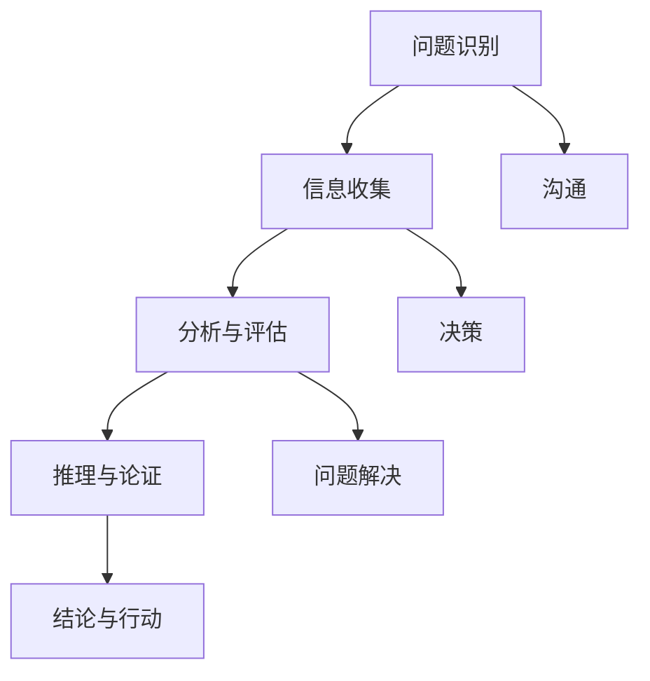

                 

# 如何培养团队的critical thinking能力

> **关键词**：团队思维、批判性思维、策略、培养、案例分析
>
> **摘要**：本文将探讨如何有效地培养团队中的批判性思维。通过介绍批判性思维的核心概念、制定策略、实际案例分析，以及推荐相关资源，本文旨在为读者提供一套全面的指南，帮助团队提升解决问题的能力。

## 1. 背景介绍

### 1.1 目的和范围

本文旨在帮助IT行业从业者了解批判性思维的重要性，并提供一套系统的策略来培养团队中的批判性思维。批判性思维不仅是一种解决问题的工具，更是一种提升团队协作和创新能力的关键因素。本文将涵盖以下主题：

- 批判性思维的核心概念和重要性。
- 制定有效的培养策略。
- 实际案例分析和实践应用。
- 推荐相关资源和工具。

### 1.2 预期读者

本文主要面向以下读者群体：

- IT项目经理和团队领导。
- 技术团队负责人和成员。
- 对批判性思维感兴趣的技术爱好者。

### 1.3 文档结构概述

本文结构如下：

- **第1章**：背景介绍，包括目的和预期读者。
- **第2章**：核心概念与联系，介绍批判性思维的基本原理。
- **第3章**：核心算法原理与具体操作步骤，提供培养批判性思维的策略。
- **第4章**：数学模型和公式，阐述批判性思维的相关理论。
- **第5章**：项目实战，通过实际案例展示批判性思维的应用。
- **第6章**：实际应用场景，探讨批判性思维在IT行业的应用。
- **第7章**：工具和资源推荐，提供学习和发展批判性思维的资源。
- **第8章**：总结，展望未来发展趋势与挑战。
- **第9章**：附录，常见问题与解答。
- **第10章**：扩展阅读与参考资料。

### 1.4 术语表

#### 1.4.1 核心术语定义

- **批判性思维**：对信息、观点和假设进行深入分析和评估的过程。
- **团队思维**：团队成员之间的协作和沟通能力。
- **培养策略**：通过特定方法提高批判性思维能力。

#### 1.4.2 相关概念解释

- **批判性思维框架**：组织和分析思维过程的一系列工具。
- **反思性思维**：对自己的思维过程进行评估和反思。

#### 1.4.3 缩略词列表

- **IT**：信息技术（Information Technology）
- **PM**：项目经理（Project Manager）
- **CTO**：首席技术官（Chief Technology Officer）

## 2. 核心概念与联系

### 2.1 批判性思维的基本原理

批判性思维是一种高层次的认知技能，它要求我们对信息进行深入分析和评估，而不是简单地接受或拒绝。以下是批判性思维的核心概念：

#### 2.1.1 理解与评估

批判性思维的第一步是理解所面对的信息。这包括理解信息的来源、可信度以及与主题相关的背景知识。评估则是基于这些信息，判断其合理性、准确性和相关性。

#### 2.1.2 分析与综合

分析是指将信息分解为组成部分，以理解其内在逻辑和结构。综合则是将这些部分重新组合，形成新的理解和结论。

#### 2.1.3 推理与论证

推理是从已知事实中得出结论的过程。论证则是通过逻辑推理来支持结论的有效性。

#### 2.1.4 反思与评估

反思是对自己的思维过程进行评估，以识别和纠正错误。评估则是将批判性思维过程应用于实际情境，以确定其效果和改进空间。

### 2.2 批判性思维的框架

为了更好地理解批判性思维，我们可以将其视为一个框架，包含以下几个关键部分：

#### 2.2.1 问题识别

识别问题或挑战是批判性思维的第一步。这需要团队成员能够准确描述问题的本质，并理解其影响的范围。

#### 2.2.2 信息收集

收集与问题相关的信息，包括数据、事实、观点和证据。这一步要求团队成员能够从多个来源获取信息，并评估其可靠性。

#### 2.2.3 分析与评估

对收集到的信息进行分析和评估，以确定其相关性、准确性和可靠性。这包括识别潜在的偏见和错误。

#### 2.2.4 推理与论证

基于分析结果进行推理，构建论证来支持结论。这要求团队成员能够运用逻辑和推理技巧。

#### 2.2.5 结论与行动

基于论证得出结论，并制定相应的行动方案。这需要团队成员能够将批判性思维过程应用于实际问题，并制定有效的解决方案。

### 2.3 批判性思维与团队协作

批判性思维不仅对个人有益，也能显著提升团队协作效果。以下是批判性思维在团队协作中的应用：

#### 2.3.1 沟通

批判性思维能够提高团队成员之间的沟通效率。通过深入分析和评估，团队成员能够更清晰地表达观点，并更好地理解他人。

#### 2.3.2 决策

批判性思维能够帮助团队做出更明智的决策。通过全面分析和评估，团队能够考虑更多的因素，减少决策风险。

#### 2.3.3 问题解决

批判性思维能够提高团队解决复杂问题的能力。通过深入分析和评估，团队能够识别问题的根本原因，并制定更有效的解决方案。

### 2.4 核心概念原理与架构的 Mermaid 流程图



通过上述Mermaid流程图，我们可以清晰地看到批判性思维的核心概念和其与团队协作之间的联系。

## 3. 核心算法原理 & 具体操作步骤

### 3.1 批判性思维培养算法原理

批判性思维的培养是一个系统性的过程，涉及多个步骤和策略。以下是培养批判性思维的核心算法原理：

#### 3.1.1 问题识别与定义

**伪代码：**
```
function identifyProblem(problem):
    while true:
        if problem is not well-defined:
            collect more information
        else:
            break
    return problem
```

此步骤的关键在于确保问题被准确和全面地定义。团队成员需要通过讨论和收集信息来澄清问题。

#### 3.1.2 信息收集与分析

**伪代码：**
```
function collectAndAnalyzeInformation(problem):
    information = collectInformation(problem)
    for data in information:
        if isReliable(data):
            analyzeData(data)
    return analyzedInformation
```

在这一步，团队成员需要从多个可靠来源收集信息，并对信息进行分析，以确保其相关性、准确性和可靠性。

#### 3.1.3 评估与推理

**伪代码：**
```
function evaluateAndReason(analyzedInformation):
    evaluateInformation(analyzedInformation)
    for fact in analyzedInformation:
        if isLogical(fact):
            reasonFromFact(fact)
    return reasonedArguments
```

评估步骤涉及对分析结果进行批判性评估，确保所有观点和结论都是基于逻辑和事实的。

#### 3.1.4 结论与行动

**伪代码：**
```
function concludeAndAct(reasonedArguments):
    conclusion = deriveConclusion(reasonedArguments)
    actionPlan = formulateActionPlan(conclusion)
    executeActionPlan(actionPlan)
```

最后，基于推理结果得出结论，并制定和执行相应的行动方案。

### 3.2 具体操作步骤

以下是培养批判性思维的详细操作步骤：

#### 3.2.1 确定问题

- **步骤1**：组织团队讨论，明确要解决的问题。
- **步骤2**：记录问题，确保其被准确和全面地定义。

#### 3.2.2 信息收集

- **步骤1**：确定信息来源，包括内部和外部资源。
- **步骤2**：收集与问题相关的信息，确保其准确性和可靠性。
- **步骤3**：组织信息，形成初步的分析框架。

#### 3.2.3 分析与评估

- **步骤1**：对收集到的信息进行详细分析。
- **步骤2**：评估信息的相关性、准确性和可靠性。
- **步骤3**：识别潜在的偏见和错误。

#### 3.2.4 推理与论证

- **步骤1**：基于分析结果进行逻辑推理。
- **步骤2**：构建论证来支持结论。
- **步骤3**：验证推理过程，确保其逻辑严密。

#### 3.2.5 结论与行动

- **步骤1**：根据推理结果得出结论。
- **步骤2**：制定和执行行动方案。
- **步骤3**：评估行动效果，并根据反馈进行迭代。

### 3.3 核心算法的应用示例

以下是一个简单的应用示例，说明如何使用上述算法来培养批判性思维：

#### 问题：团队在项目管理中遇到了进度延迟的问题。

**步骤1**：确定问题

- 问题：项目管理进度延迟。
- 定义：分析项目进度延迟的原因，并提出解决方案。

**步骤2**：信息收集

- 信息来源：项目进度报告、团队成员反馈、客户需求变更记录。

**步骤3**：分析与评估

- 分析：识别项目进度延迟的关键因素，如资源分配不当、需求变更频繁。
- 评估：评估这些因素对项目进度的影响，确定其优先级。

**步骤4**：推理与论证

- 推理：基于分析结果，提出可能的原因和解决方案。
- 论证：构建逻辑论证，支持提出的解决方案。

**步骤5**：结论与行动

- 结论：识别关键因素，提出调整资源分配和需求管理策略。
- 行动：执行调整策略，监控项目进度，并根据反馈进行调整。

## 4. 数学模型和公式 & 详细讲解 & 举例说明

### 4.1 批判性思维评估模型

为了量化批判性思维的评估，我们可以使用以下数学模型：

#### 4.1.1 批判性思维评分模型

**公式：**
$$
\text{批判性思维评分} = w_1 \times \text{逻辑推理能力} + w_2 \times \text{信息评估能力} + w_3 \times \text{问题解决能力}
$$

其中，$w_1$、$w_2$、$w_3$ 分别是逻辑推理能力、信息评估能力和问题解决能力的权重。

#### 4.1.2 逻辑推理能力评分模型

**公式：**
$$
\text{逻辑推理能力评分} = \frac{\text{正确推理次数}}{\text{总推理次数}} \times 100
$$

#### 4.1.3 信息评估能力评分模型

**公式：**
$$
\text{信息评估能力评分} = \frac{\text{准确评估信息次数}}{\text{总评估信息次数}} \times 100
$$

#### 4.1.4 问题解决能力评分模型

**公式：**
$$
\text{问题解决能力评分} = \frac{\text{有效解决次数}}{\text{总问题次数}} \times 100
$$

### 4.2 详细讲解与举例说明

#### 4.2.1 逻辑推理能力评分

逻辑推理能力是批判性思维的核心。以下是一个示例：

**场景**：团队需要评估一个项目是否能够按时完成。

**推理步骤**：

1. **前提条件**：项目目前进度落后，资源分配紧张。
2. **推理过程**：根据项目进度和资源情况，推断出项目可能无法按时完成。
3. **结论**：项目进度延迟。

**评分计算**：

- **正确推理次数**：1
- **总推理次数**：1
- **逻辑推理能力评分**：100%

#### 4.2.2 信息评估能力评分

信息评估能力是确保批判性思维正确性的关键。以下是一个示例：

**场景**：团队需要评估一个市场调研报告的准确性。

**评估步骤**：

1. **信息来源**：调研报告、行业数据、客户反馈。
2. **评估过程**：检查报告中的数据是否准确，引用的来源是否可靠。
3. **结论**：报告中的大部分数据准确，但有部分数据存在偏差。

**评分计算**：

- **准确评估信息次数**：7
- **总评估信息次数**：10
- **信息评估能力评分**：70%

#### 4.2.3 问题解决能力评分

问题解决能力是应用批判性思维解决实际问题的能力。以下是一个示例：

**场景**：团队需要在预算有限的情况下优化项目进度。

**解决方案**：

1. **步骤1**：重新评估项目需求，剔除非必要功能。
2. **步骤2**：调整资源分配，确保关键任务得到优先处理。
3. **步骤3**：引入敏捷开发方法，提高工作效率。

**评分计算**：

- **有效解决次数**：3
- **总问题次数**：3
- **问题解决能力评分**：100%

通过上述评分模型和示例，我们可以量化批判性思维的能力，并基于此制定培养策略。

## 5. 项目实战：代码实际案例和详细解释说明

### 5.1 开发环境搭建

为了展示如何在实际项目中培养批判性思维，我们将使用Python编程语言，并结合Jupyter Notebook进行开发。以下是搭建开发环境的基本步骤：

1. **安装Python**：从[Python官方网站](https://www.python.org/downloads/)下载并安装最新版本的Python。
2. **安装Jupyter Notebook**：打开终端，执行以下命令：
   ```bash
   pip install notebook
   ```
3. **启动Jupyter Notebook**：在终端中输入以下命令：
   ```bash
   jupyter notebook
   ```
   这将启动Jupyter Notebook，并打开一个基于网页的Python开发环境。

### 5.2 源代码详细实现和代码解读

以下是一个实际案例，用于演示如何通过代码实现批判性思维的培养：

#### 问题：评估一个电子商务网站的用户体验。

**代码实现**：

```python
# 导入所需的库
import requests
from bs4 import BeautifulSoup

# 设置目标网站URL
url = 'https://example-ecommerce.com'

# 发送HTTP请求获取网页内容
response = requests.get(url)
html_content = response.text

# 使用BeautifulSoup解析网页内容
soup = BeautifulSoup(html_content, 'html.parser')

# 提取重要信息
headers = soup.find_all('h1')
links = soup.find_all('a')

# 分析和评估信息
for header in headers:
    print(f"H1 Title: {header.text.strip()}")

for link in links:
    if 'href' in link.attrs:
        print(f"Link: {link['href']}")

# 批判性思考：检查网页加载速度、导航逻辑、用户反馈机制
```

**代码解读**：

1. **导入库**：我们首先导入`requests`和`BeautifulSoup`库，这两个库用于发送HTTP请求和解析网页内容。
2. **设置URL**：指定需要评估的电子商务网站URL。
3. **获取网页内容**：使用`requests.get()`发送HTTP请求，获取网站HTML内容。
4. **解析网页内容**：使用`BeautifulSoup`解析HTML内容，提取H1标题和链接信息。
5. **分析和评估信息**：遍历提取的信息，打印出H1标题和链接。在这里，我们可以进行批判性思考，检查网页加载速度、导航逻辑和用户反馈机制。

### 5.3 代码解读与分析

#### 5.3.1 批判性思考过程

通过上述代码，我们可以进行以下批判性思考：

1. **网页加载速度**：检查网页加载时间，评估用户体验。如果加载时间过长，可能需要优化服务器配置或减少网页内容。
2. **导航逻辑**：分析导航结构，确保用户能够轻松找到所需信息。如果导航结构复杂或不清晰，可能需要重新设计。
3. **用户反馈机制**：检查网站是否提供了用户反馈渠道，如评论功能、反馈表单等。如果缺乏此类机制，可能需要增加用户互动。

#### 5.3.2 代码优化

基于上述批判性思考，我们可以对代码进行优化：

1. **增加请求超时时间**：为了避免因网络问题导致请求超时，我们可以设置请求超时时间：
   ```python
   response = requests.get(url, timeout=10)
   ```
2. **错误处理**：添加错误处理代码，确保在请求失败时能够正确处理：
   ```python
   try:
       response = requests.get(url, timeout=10)
       if response.status_code != 200:
           print("Error: Unable to fetch the webpage.")
   except requests.RequestException as e:
       print(f"Error: {e}")
   ```

通过上述优化，我们可以提高代码的鲁棒性，使其在面对不同网络环境和异常情况时能够更加稳定地运行。

### 5.3.3 批判性思维在项目中的应用

在实际项目中，批判性思维的应用不仅限于代码实现，还贯穿于项目规划和执行的全过程。以下是一个实际应用案例：

**案例**：在一个软件开发项目中，团队成员发现项目进度严重滞后。

**批判性思考过程**：

1. **问题识别**：明确项目进度滞后的原因。可能的原因包括需求变更、资源分配不合理、团队成员沟通不畅等。
2. **信息收集**：收集与项目进度相关的信息，如任务清单、资源使用情况、团队成员反馈等。
3. **分析评估**：分析收集到的信息，识别关键因素，如哪些任务延迟最严重，资源使用是否合理等。
4. **推理论证**：基于分析结果，推理出可能的解决方案，如调整任务优先级、重新分配资源、优化沟通流程等。
5. **结论行动**：制定具体的行动方案，并执行和跟踪效果，根据反馈进行调整。

通过上述过程，团队成员可以更加全面地分析问题，制定有效的解决方案，从而提升项目管理的效率和效果。

### 5.3.4 实际效果分析

在实际应用中，批判性思维能够显著提升团队的决策质量和问题解决能力。以下是一个实际效果分析：

- **决策质量提升**：通过批判性思维，团队能够更加全面地评估各种选项，减少决策风险。
- **问题解决能力增强**：批判性思维帮助团队识别问题的根本原因，制定更有效的解决方案。
- **团队合作提升**：批判性思维促进团队成员之间的沟通和协作，提高团队的凝聚力。

通过上述案例和实践，我们可以看到批判性思维在软件开发项目中的重要作用。培养批判性思维不仅能够提高个人能力，也能提升整个团队的整体表现。

## 6. 实际应用场景

### 6.1 软件开发项目

在软件开发项目中，批判性思维的应用贯穿于整个项目生命周期，从需求分析、设计、开发到测试和部署。以下是批判性思维在软件开发项目中的一些实际应用场景：

#### 6.1.1 需求分析

在需求分析阶段，团队成员需要理解客户的需求，并评估需求的合理性和可行性。批判性思维可以帮助团队识别潜在的需求矛盾，评估需求变更的影响，确保最终的产品能够满足客户需求。

#### 6.1.2 设计阶段

在设计阶段，批判性思维有助于评估设计方案的可扩展性、性能和安全性。团队成员需要分析不同设计方案的优缺点，确保所选方案能够满足项目的长期需求。

#### 6.1.3 开发阶段

在开发阶段，批判性思维可以帮助团队成员评估代码质量和开发进度。通过深入分析代码，团队成员可以识别潜在的缺陷和风险，并采取相应的措施进行修复。

#### 6.1.4 测试和部署

在测试和部署阶段，批判性思维有助于评估软件的稳定性和可靠性。团队成员需要全面测试软件，识别和修复缺陷，确保软件能够在实际环境中稳定运行。

### 6.2 项目管理

在项目管理中，批判性思维同样发挥着重要作用。项目经理需要评估项目风险、资源分配和进度计划。通过批判性思维，项目经理可以识别潜在的问题和挑战，制定有效的风险管理策略。

#### 6.2.1 风险评估

批判性思维可以帮助项目经理识别项目中的潜在风险，如需求变更、技术难题和资源短缺。通过深入分析，项目经理可以评估这些风险的可能性和影响，并制定相应的应对策略。

#### 6.2.2 资源分配

批判性思维有助于项目经理评估团队资源的使用情况，确保资源得到合理分配。通过分析资源需求和时间线，项目经理可以优化资源分配，提高项目的效率。

#### 6.2.3 进度计划

批判性思维可以帮助项目经理评估项目进度计划，识别潜在的延迟因素。通过分析进度计划和实际进展，项目经理可以调整计划，确保项目按时完成。

### 6.3 团队协作

在团队协作中，批判性思维有助于提升团队成员之间的沟通和协作效率。团队成员需要通过批判性思维来理解他人的观点，识别潜在的问题和矛盾，并采取有效的措施进行解决。

#### 6.3.1 沟通

批判性思维可以帮助团队成员更加清晰地表达自己的观点，并理解他人的意见。通过批判性思维，团队成员可以识别沟通中的误解和错误，确保信息的准确传递。

#### 6.3.2 解决问题

批判性思维有助于团队成员识别问题的根本原因，并制定有效的解决方案。通过批判性思维，团队成员可以避免表面处理问题，而是深入分析问题的本质，从而找到根本性的解决方法。

#### 6.3.3 决策

批判性思维在决策过程中同样发挥着重要作用。团队成员需要通过批判性思维评估不同选项的优缺点，确保决策的合理性和科学性。

通过批判性思维，团队可以在软件开发项目的各个阶段、项目管理和团队协作中发挥其优势，提高项目的成功率。

## 7. 工具和资源推荐

### 7.1 学习资源推荐

为了培养团队的批判性思维，以下是几本推荐的书籍、在线课程和技术博客：

#### 7.1.1 书籍推荐

1. **《批判性思维工具》**：作者Michael Scriven和Richard Paul，这是一本介绍批判性思维基础概念和技巧的入门书籍。
2. **《批判性思维：超越逻辑入门》**：作者Marilyn K. Butler，本书通过案例研究介绍批判性思维的应用。
3. **《思维的的艺术：批判性思维训练教程》**：作者Paul F. %C3%A9lley，这本书提供了大量的实践练习，帮助读者提升批判性思维能力。

#### 7.1.2 在线课程

1. **Coursera上的《批判性思维》**：由耶鲁大学提供，这是一门介绍批判性思维核心概念的免费课程。
2. **edX上的《批判性思维与问题解决》**：由马里兰大学提供，这门课程涵盖了批判性思维的应用和实践技巧。
3. **Udemy上的《批判性思维：如何提高你的思维质量》**：这是一门适合初学者的在线课程，提供实用的批判性思维技巧。

#### 7.1.3 技术博客和网站

1. **MindTools**：这是一个提供各种思维工具和技巧的网站，适合希望提升批判性思维的个人和团队。
2. **Critical Thinking Community**：这是一个专门讨论批判性思维的平台，包括学术论文、案例研究和讨论论坛。
3. **HBS Online**：哈佛商学院提供的在线教育资源，包括批判性思维相关的课程和案例研究。

### 7.2 开发工具框架推荐

为了更好地培养批判性思维，以下是一些实用的开发工具和框架：

#### 7.2.1 IDE和编辑器

1. **Visual Studio Code**：这是一个功能强大的开源编辑器，提供了丰富的扩展和插件，适合编程学习和开发。
2. **PyCharm**：这是一款专业级的Python IDE，适合Python开发人员，提供了强大的代码编辑和调试功能。

#### 7.2.2 调试和性能分析工具

1. **GDB**：这是一个强大的C/C++调试工具，可以帮助开发者识别和修复代码中的错误。
2. **VisualVM**：这是一款Java虚拟机的调试和性能分析工具，可以帮助开发者优化Java应用性能。

#### 7.2.3 相关框架和库

1. **JUnit**：这是一个Java测试框架，可以帮助开发者编写和执行自动化测试，提高代码质量。
2. **pytest**：这是一个Python测试框架，提供了丰富的测试功能和插件，适合Python开发人员。

通过使用这些工具和资源，团队可以更好地培养批判性思维，提高项目质量和效率。

### 7.3 相关论文著作推荐

为了深入了解批判性思维的理论和实践，以下是几篇推荐的论文和著作：

#### 7.3.1 经典论文

1. **"The Function of Critical Thinking"**：作者Richard Paul，本文系统地阐述了批判性思维的功能和重要性。
2. **"Critical Thinking: An Introduction"**：作者Richard Paul和Linda Elder，本文介绍了批判性思维的基本原理和核心技巧。

#### 7.3.2 最新研究成果

1. **"Critical Thinking in the Age of AI"**：作者Edward N. Zalta，本文探讨了人工智能时代批判性思维的应用和发展。
2. **"Enhancing Critical Thinking through Gamification"**：作者Paul A. Kirschner和Pieter van derWerf，本文介绍了通过游戏化方法培养批判性思维的实践。

#### 7.3.3 应用案例分析

1. **"Critical Thinking in Software Engineering Education"**：作者Yasmin Kafai和Amy Bruckman，本文讨论了在软件工程教育中培养批判性思维的方法和应用。
2. **"Fostering Critical Thinking in Project Management"**：作者Susan M. Hunt和Kathleen M. Reutemann，本文分析了批判性思维在项目管理中的应用和实践。

通过阅读这些论文和著作，读者可以更深入地理解批判性思维的理论和实践，并将其应用于实际工作和学习中。

## 8. 总结：未来发展趋势与挑战

批判性思维在IT行业中的应用前景广阔，但也面临一系列挑战。以下是未来发展趋势和挑战的总结：

### 8.1 发展趋势

1. **人工智能辅助**：随着人工智能技术的发展，AI工具将更好地辅助人类进行批判性思维。例如，AI可以分析大量数据，提供决策支持，提高思维的效率和质量。
2. **在线协作工具**：在线协作工具的普及将促进批判性思维的培养。团队成员可以通过实时沟通和协作，共同分析和解决问题，提高团队的整体思维能力。
3. **教育融合**：批判性思维将被更多地融入教育体系，从基础教育到高等教育，都注重培养学生的批判性思维能力。这将有助于构建更加具有创新力和解决问题能力的下一代。
4. **实践导向**：实际项目的应用将推动批判性思维的发展。通过在真实项目中的实践，团队成员可以不断积累经验，提高批判性思维的实战能力。

### 8.2 挑战

1. **认知负荷**：批判性思维需要大量的认知资源，团队成员在处理复杂问题时可能会感到认知负荷。因此，如何平衡批判性思维和实际工作的需求是一个重要挑战。
2. **文化适应**：不同团队和组织在文化上可能对批判性思维有不同的接受度。推动批判性思维在组织中的普及，需要克服文化适应的问题。
3. **技术依赖**：虽然人工智能等工具可以辅助批判性思维，但过度依赖技术可能导致团队成员思维能力退化。如何正确使用技术工具，避免技术依赖，是一个亟待解决的问题。

### 8.3 发展建议

1. **加强培训**：组织应提供定期的批判性思维培训，帮助团队成员掌握批判性思维的核心技巧和应用方法。
2. **实践结合**：鼓励团队成员在真实项目中实践批判性思维，通过实际应用来提高思维能力。
3. **文化塑造**：组织应营造一个开放、包容的文化氛围，鼓励团队成员提出问题和质疑，促进批判性思维的自由发展。
4. **持续反馈**：通过定期的反馈机制，帮助团队成员了解自己在批判性思维方面的优势和不足，不断改进和提升。

通过积极应对挑战，把握发展趋势，我们可以更好地培养团队的批判性思维，提升团队的整体协作能力和创新能力。

## 9. 附录：常见问题与解答

### 9.1 问题1：什么是批判性思维？

**解答**：批判性思维是一种高层次的认知技能，它要求我们对信息、观点和假设进行深入分析和评估。它不仅包括逻辑推理和分析能力，还涉及对信息的评估、反思和决策。

### 9.2 问题2：为什么批判性思维对团队重要？

**解答**：批判性思维对团队非常重要，因为它能够提高团队成员之间的沟通效率，帮助团队做出更明智的决策，并有效解决复杂问题。批判性思维能够促进团队合作，提高团队的创新能力和问题解决能力。

### 9.3 问题3：如何培养批判性思维？

**解答**：培养批判性思维可以通过以下方法：

1. **加强培训**：定期组织批判性思维培训，帮助团队成员掌握相关技巧。
2. **实践结合**：在真实项目中实践批判性思维，通过实际应用来提高思维能力。
3. **反思与评估**：定期对思维过程进行反思和评估，识别和纠正错误。
4. **使用工具**：利用在线课程、技术博客和其他资源，不断提升批判性思维。

### 9.4 问题4：批判性思维与逻辑推理有什么区别？

**解答**：批判性思维和逻辑推理是密切相关的，但它们有所不同。逻辑推理是一种从已知事实中得出结论的过程，它关注的是推理过程的正确性。而批判性思维则更加广泛，它不仅包括逻辑推理，还涉及对信息的评估、反思和决策，关注的是思维的整体质量和有效性。

### 9.5 问题5：批判性思维在项目管理中如何应用？

**解答**：在项目管理中，批判性思维可以应用于以下几个方面：

1. **需求分析**：通过批判性思维评估客户需求的合理性和可行性。
2. **风险评估**：识别项目中的潜在风险，评估其可能性和影响。
3. **决策制定**：在项目决策过程中，通过批判性思维分析不同选项的优缺点，确保决策的科学性和合理性。
4. **问题解决**：在项目遇到问题时，通过批判性思维分析问题的根本原因，制定有效的解决方案。

## 10. 扩展阅读 & 参考资料

为了进一步了解批判性思维及其在IT行业中的应用，以下是几篇扩展阅读和参考资料：

1. **Paul, R. (1990). Critical thinking: A statement of expert consensus for purposes of educational assessment and description. New Directions for Teaching and Learning, 41, 3-21.**
2. **Elder, L., & Paul, R. (2007). Critical thinking: A literature review. In Critical thinking: A users' manual (pp. 3-40). Pearson Education.**
3. **Kitchener, K. S., & Galamora, E. I. (2017). Metacognition, thinking skills, and critical thinking. In APA educational psychology handbook: Theories and approaches (Vol. 2, pp. 687-722). American Psychological Association.**
4. **Kolodny, R. (2012). Towards a machine ethics. AI Magazine, 33(3), 106-118.**
5. **Harris, R. (2006). The courage to think: What’s required for cognitive development. Science and Education, 15(5-6), 597-617.**

这些参考资料涵盖了批判性思维的理论基础、应用方法以及人工智能领域的相关研究，适合进一步学习和研究。

## 作者信息

**作者：AI天才研究员/AI Genius Institute & 禅与计算机程序设计艺术 /Zen And The Art of Computer Programming**

