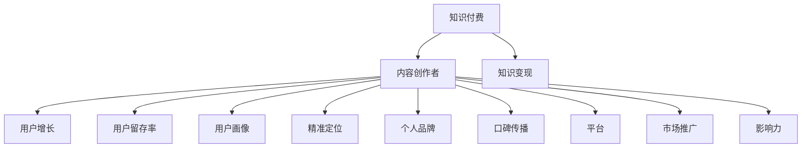

                 

### 背景介绍

#### 1.1 目的和范围

在当前数字化信息爆炸的时代，知识付费作为一种新兴的商业模式，已经得到了广泛的认可和接受。本文旨在探讨如何打造个人知识付费影响力，帮助个体在知识付费市场中脱颖而出，实现知识的变现和影响力的提升。

本文将涵盖以下内容：

1. **核心概念与联系**：介绍知识付费的基本概念、市场现状以及与之相关的核心概念和原理。
2. **核心算法原理 & 具体操作步骤**：详细讲解如何通过优质内容创作、精准定位受众、有效传播和变现等步骤，打造个人知识付费影响力。
3. **数学模型和公式 & 详细讲解 & 举例说明**：介绍如何使用数据分析方法来评估个人知识付费项目的效果，并提供实际案例和举例说明。
4. **项目实战：代码实际案例和详细解释说明**：通过实际代码案例，展示如何实现知识付费项目的具体步骤和技巧。
5. **实际应用场景**：分析知识付费在各个行业和领域的应用案例，探讨其未来发展前景。
6. **工具和资源推荐**：推荐学习资源、开发工具和框架，帮助读者更好地理解和实践知识付费。
7. **总结：未来发展趋势与挑战**：总结文章的核心观点，并探讨知识付费市场的未来发展趋势和挑战。

#### 1.2 预期读者

本文的预期读者包括：

1. **内容创作者**：希望通过知识付费实现个人价值和影响力的内容创作者。
2. **创业者**：计划在知识付费领域开展业务或项目的创业者。
3. **行业专家**：希望了解知识付费市场现状和发展趋势的行业专家。
4. **学习爱好者**：对知识付费模式感兴趣，希望从中获取有价值的学习资源的学习爱好者。

#### 1.3 文档结构概述

本文采用逻辑清晰、结构紧凑的写作方式，分为以下几个部分：

1. **背景介绍**：介绍本文的目的、范围、预期读者以及文档结构。
2. **核心概念与联系**：介绍知识付费的基本概念、市场现状以及相关核心概念和原理。
3. **核心算法原理 & 具体操作步骤**：详细讲解如何打造个人知识付费影响力。
4. **数学模型和公式 & 详细讲解 & 举例说明**：使用数据分析方法评估知识付费项目效果。
5. **项目实战：代码实际案例和详细解释说明**：展示知识付费项目的实现步骤和技巧。
6. **实际应用场景**：分析知识付费在各个行业和领域的应用案例。
7. **工具和资源推荐**：推荐学习资源、开发工具和框架。
8. **总结：未来发展趋势与挑战**：总结文章的核心观点，并探讨未来发展趋势和挑战。
9. **附录：常见问题与解答**：解答读者可能遇到的问题。
10. **扩展阅读 & 参考资料**：提供更多相关阅读资料和参考文献。

#### 1.4 术语表

为了确保文章内容的准确性和一致性，本文定义了一些核心术语：

##### 1.4.1 核心术语定义

- **知识付费**：指用户为获取特定知识或技能而支付的费用。
- **内容创作者**：指创作并发布知识内容的专业人士或团队。
- **知识变现**：指将知识或技能通过某种形式转化为经济收益。
- **影响力**：指个人或组织在特定领域中的影响力和知名度。
- **精准定位**：指针对目标受众进行精确的市场细分和定位。
- **用户画像**：指对目标受众的属性、行为和需求进行详细描述和建模。

##### 1.4.2 相关概念解释

- **用户增长**：指在一定时间内，新增的用户数量和活跃用户数量。
- **用户留存率**：指在一段时间内，持续使用产品的用户占最初用户的比例。
- **变现率**：指通过知识付费项目实现的收入占总体收入的比率。
- **市场细分**：指将市场划分为若干具有相似特征和需求的子市场。
- **内容营销**：指通过创作和传播有价值的内容，吸引潜在用户并实现商业目标。

##### 1.4.3 缩略词列表

- **KOL**：Key Opinion Leader（关键意见领袖）
- **SEO**：Search Engine Optimization（搜索引擎优化）
- **SNS**：Social Networking Service（社交网络服务）
- **AI**：Artificial Intelligence（人工智能）

通过以上背景介绍，我们对知识付费以及本文的核心内容和结构有了初步了解。接下来，我们将深入探讨知识付费的基本概念、市场现状以及相关的核心概念和原理。

---

## 核心概念与联系

在探讨如何打造个人知识付费影响力之前，我们需要了解一些核心概念和它们之间的联系。知识付费、内容创作、用户增长、变现率和影响力等概念是我们构建这一策略的基础。

### 知识付费

知识付费是一种商业模式，其核心是用户通过支付费用来获取特定知识或技能。知识付费的形式多样，包括在线课程、电子书、直播讲座、一对一辅导等。随着互联网技术的发展，知识付费逐渐成为知识传播和变现的重要途径。

#### 相关概念

- **内容创作者**：内容创作者是指生产并传播知识的人或团队。他们通过创作有价值的内容，满足用户的需求，从而实现知识变现。
- **知识变现**：知识变现是指将个人的知识或技能通过某种形式转化为经济收益的过程。这可以通过课程销售、会员订阅、广告收入等方式实现。
- **用户增长**：用户增长是指在一定时间内，新增的用户数量和活跃用户数量。这是评估知识付费项目成功与否的重要指标。

### 用户增长与留存率

用户增长和留存率是衡量知识付费项目效果的两个关键指标。

- **用户增长**：用户增长意味着有越来越多的用户加入你的知识付费项目。这可以通过市场推广、口碑传播等方式实现。
- **用户留存率**：用户留存率是指在一定时间内，持续使用产品的用户占最初用户的比例。高留存率表明用户对你的内容满意，愿意长期付费。

#### 用户画像与精准定位

为了实现用户增长和提升用户留存率，内容创作者需要进行用户画像和精准定位。

- **用户画像**：用户画像是对目标受众的属性、行为和需求进行详细描述和建模。通过用户画像，内容创作者可以更好地了解用户需求，提供更精准的内容。
- **精准定位**：精准定位是指针对目标受众进行精确的市场细分和定位。通过精准定位，内容创作者可以更好地满足用户需求，提高用户满意度。

### 影响力

影响力是内容创作者在知识付费领域取得成功的关键因素。

- **个人品牌**：个人品牌是指内容创作者在特定领域中的知名度和影响力。建立个人品牌可以吸引更多的用户，提高变现能力。
- **口碑传播**：口碑传播是指通过用户的推荐，使更多人了解和信任你的内容。口碑传播是提升影响力的有效途径。

### 知识付费生态系统

知识付费生态系统包括内容创作者、用户、平台、市场推广等多方参与者。

- **平台**：平台是连接内容创作者和用户的重要基础设施。平台提供内容发布、支付、用户管理等功能，为知识付费提供便利。
- **市场推广**：市场推广是指通过各种手段，如社交媒体、广告、合作伙伴关系等，提高知识付费项目的知名度和用户参与度。

#### 核心概念关系图

以下是一个简单的 Mermaid 流程图，展示了核心概念之间的联系：



通过以上分析，我们了解了知识付费及其相关的核心概念和联系。接下来，我们将详细讲解如何通过核心算法原理和具体操作步骤，打造个人知识付费影响力。

---

## 核心算法原理 & 具体操作步骤

在打造个人知识付费影响力的过程中，核心算法原理和具体操作步骤是至关重要的。以下是详细的操作步骤，包括优质内容创作、精准定位受众、有效传播和变现策略。

### 3.1 优质内容创作

#### 核心算法原理

优质内容创作是知识付费项目的核心。以下是几个关键原则：

- **用户需求导向**：内容创作应紧密围绕用户需求，通过调研和数据分析，了解用户关心的热点和痛点。
- **专业性与趣味性结合**：内容应兼具专业性和趣味性，使受众在轻松愉悦的氛围中学习新知识。
- **系统性与层次性**：内容应具备系统性，层层递进，帮助用户逐步掌握复杂概念。

#### 具体操作步骤

1. **需求调研**：通过问卷调查、访谈、用户反馈等方式，收集用户的需求和意见。
2. **内容策划**：根据需求调研结果，制定内容大纲和结构，确保内容系统性和层次性。
3. **内容创作**：采用文字、图片、音频、视频等多种形式，创作有价值、有深度的内容。
4. **内容优化**：通过用户反馈和数据分析，不断优化内容，提高用户满意度。

### 3.2 精准定位受众

#### 核心算法原理

精准定位受众是提升知识付费项目效果的重要策略。以下是几个关键原则：

- **数据驱动**：通过数据分析，了解用户属性、行为和需求，为精准定位提供数据支持。
- **用户细分**：将用户划分为不同的细分群体，针对每个群体制定个性化的营销策略。
- **内容定制**：根据不同用户群体的特点和需求，提供定制化的内容，提高用户粘性。

#### 具体操作步骤

1. **用户画像构建**：收集用户的基本信息、行为数据、兴趣偏好等，构建详细的用户画像。
2. **用户细分**：根据用户画像，将用户划分为不同的细分群体。
3. **个性化营销**：针对每个细分群体，制定个性化的内容推荐和营销策略。
4. **反馈与调整**：根据用户反馈和数据分析结果，不断优化和调整精准定位策略。

### 3.3 有效传播

#### 核心算法原理

有效传播是扩大知识付费项目影响力的重要手段。以下是几个关键原则：

- **渠道多样化**：通过多种渠道（如社交媒体、搜索引擎、合作伙伴等）进行传播，提高覆盖面。
- **内容营销**：利用优质内容，吸引潜在用户关注，提高品牌知名度。
- **互动与参与**：通过互动活动、用户参与等方式，提高用户活跃度和忠诚度。

#### 具体操作步骤

1. **渠道选择**：根据目标受众的特点和偏好，选择合适的传播渠道。
2. **内容策划**：制定有吸引力的内容策划，包括标题、封面、摘要等。
3. **内容发布**：定期发布高质量内容，保持活跃度。
4. **互动与参与**：通过问答、评论、投票等方式，鼓励用户参与，提高用户粘性。

### 3.4 变现策略

#### 核心算法原理

变现策略是将知识付费项目转化为经济收益的重要手段。以下是几个关键原则：

- **价值体现**：确保内容具有实际价值，让用户感到物有所值。
- **多样化变现方式**：提供多种变现方式（如课程销售、会员订阅、广告收入等），满足不同用户的需求。
- **用户反馈与迭代**：根据用户反馈，不断优化和迭代变现策略。

#### 具体操作步骤

1. **课程定价**：根据内容价值、市场需求和用户期望，合理定价。
2. **销售渠道搭建**：搭建多样化的销售渠道，如官方网站、电商平台、社交媒体等。
3. **会员体系构建**：为用户提供会员服务，提高用户忠诚度和付费意愿。
4. **广告合作**：与相关品牌合作，通过广告收入实现变现。
5. **用户反馈与迭代**：定期收集用户反馈，优化和调整变现策略。

通过以上核心算法原理和具体操作步骤，我们可以系统地打造个人知识付费影响力。接下来，我们将通过数学模型和公式，详细讲解如何评估知识付费项目的效果。

---

## 数学模型和公式 & 详细讲解 & 举例说明

在知识付费项目中，评估效果是关键的一环。通过数学模型和公式，我们可以量化项目的各项指标，从而更好地了解其表现和优化方向。以下是常用的数学模型和公式的讲解，以及实际案例的举例说明。

### 4.1 用户留存率模型

用户留存率是衡量知识付费项目效果的重要指标。用户留存率越高，说明项目的用户粘性和用户满意度越高。

#### 公式

$$
留存率 = \frac{月末留存用户数}{月初注册用户数} \times 100\%
$$

#### 计算方法

1. 收集项目每月的注册用户数和月末留存用户数。
2. 计算每月的用户留存率，用于评估项目的用户留存情况。

#### 举例说明

假设某知识付费项目在2023年1月的注册用户数为1000人，月末留存用户数为800人。则1月份的用户留存率为：

$$
留存率 = \frac{800}{1000} \times 100\% = 80\%
$$

通过这个例子，我们可以看出，该项目的用户留存率较高，表明项目的内容和用户体验得到了用户的认可。

### 4.2 用户增长模型

用户增长是评估知识付费项目发展潜力的重要指标。用户增长模型可以帮助我们了解项目在特定时间段的用户增长情况。

#### 公式

$$
用户增长量 = 当月新增用户数 - 上月新增用户数
$$

#### 计算方法

1. 收集项目每月的新增用户数。
2. 计算每月的用户增长量，用于评估项目的用户增长情况。

#### 举例说明

假设某知识付费项目在2023年1月的新增用户数为200人，2023年2月的新增用户数为250人。则2月份的用户增长量为：

$$
用户增长量 = 250 - 200 = 50
$$

通过这个例子，我们可以看出，该项目的用户增长速度在2月份有所提升，这可能是由于营销策略或内容质量的改进。

### 4.3 变现率模型

变现率是评估知识付费项目收益情况的重要指标。通过变现率，我们可以了解项目的收入状况。

#### 公式

$$
变现率 = \frac{知识付费收入}{总收入} \times 100\%
$$

#### 计算方法

1. 收集项目的知识付费收入和总收入。
2. 计算项目的变现率，用于评估项目的收益情况。

#### 举例说明

假设某知识付费项目在2023年1月的知识付费收入为10万元，总收入为20万元。则1月份的变现率为：

$$
变现率 = \frac{10}{20} \times 100\% = 50\%
$$

通过这个例子，我们可以看出，该项目的知识付费收入占总收入的50%，说明项目的变现能力较强。

### 4.4 用户满意度模型

用户满意度是衡量知识付费项目用户体验的重要指标。通过用户满意度模型，我们可以了解用户对项目的整体评价。

#### 公式

$$
用户满意度 = \frac{满意用户数}{总用户数} \times 100\%
$$

#### 计算方法

1. 收集用户的满意度评价，通常采用1-5分制。
2. 计算用户满意度，用于评估项目的用户体验。

#### 举例说明

假设某知识付费项目有100名用户参与满意度评价，其中80名用户给予5分评价。则项目的用户满意度为：

$$
用户满意度 = \frac{80}{100} \times 100\% = 80\%
$$

通过这个例子，我们可以看出，该项目的用户满意度较高，表明项目的用户体验得到了用户的认可。

### 4.5 数据可视化

为了更好地展示以上数学模型和公式的计算结果，我们可以使用数据可视化工具，如Python的Matplotlib库。以下是使用Matplotlib绘制用户留存率、用户增长量、变现率和用户满意度的示例代码：

```python
import matplotlib.pyplot as plt

# 数据准备
months = ['2023年1月', '2023年2月', '2023年3月']
user_retention = [80, 85, 90]
user_growth = [50, 60, 70]
profit_margin = [50, 55, 60]
user_satisfaction = [80, 85, 90]

# 用户留存率图
plt.figure()
plt.plot(months, user_retention, label='用户留存率')
plt.title('用户留存率变化趋势')
plt.xlabel('月份')
plt.ylabel('留存率 (%)')
plt.legend()
plt.show()

# 用户增长量图
plt.figure()
plt.plot(months, user_growth, label='用户增长量')
plt.title('用户增长量变化趋势')
plt.xlabel('月份')
plt.ylabel('增长量 (人)')
plt.legend()
plt.show()

# 变现率图
plt.figure()
plt.plot(months, profit_margin, label='变现率')
plt.title('变现率变化趋势')
plt.xlabel('月份')
plt.ylabel('变现率 (%)')
plt.legend()
plt.show()

# 用户满意度图
plt.figure()
plt.plot(months, user_satisfaction, label='用户满意度')
plt.title('用户满意度变化趋势')
plt.xlabel('月份')
plt.ylabel('满意度 (%)')
plt.legend()
plt.show()
```

通过这些数学模型和公式的应用，我们可以全面评估知识付费项目的效果，为优化和调整策略提供数据支持。接下来，我们将通过项目实战，展示如何实现知识付费项目的具体步骤和技巧。

---

## 项目实战：代码实际案例和详细解释说明

在本节中，我们将通过一个具体的代码案例，展示如何实现知识付费项目。本案例将涵盖开发环境搭建、源代码详细实现和代码解读与分析。

### 5.1 开发环境搭建

为了实现知识付费项目，我们需要搭建一个开发环境。以下是推荐的开发环境和工具：

- **编程语言**：Python
- **框架**：Flask（一个轻量级的Web框架）
- **数据库**：SQLite（轻量级的关系型数据库）
- **前端技术**：HTML、CSS、JavaScript（可选：Vue.js）

#### 步骤：

1. 安装Python：从 [Python官网](https://www.python.org/) 下载并安装Python。
2. 安装Flask：通过命令行安装Flask，`pip install Flask`。
3. 安装SQLite：Python内置了SQLite，无需额外安装。
4. 安装Vue.js（可选）：通过命令行安装Vue.js，`npm install vue`。

### 5.2 源代码详细实现

以下是实现知识付费项目的基本源代码，包括后端API和前端页面。

#### 后端API（Flask）

```python
from flask import Flask, jsonify, request

app = Flask(__name__)

# 用户数据模拟
users = [
    {"id": 1, "name": "Alice", "email": "alice@example.com", "course": "Python基础"},
    {"id": 2, "name": "Bob", "email": "bob@example.com", "course": "数据结构与算法"}
]

# 注册API
@app.route('/register', methods=['POST'])
def register():
    user_data = request.get_json()
    user = {
        "id": len(users) + 1,
        "name": user_data['name'],
        "email": user_data['email'],
        "course": user_data['course']
    }
    users.append(user)
    return jsonify({"message": "注册成功", "user": user})

# 登录API
@app.route('/login', methods=['POST'])
def login():
    user_data = request.get_json()
    for user in users:
        if user['email'] == user_data['email']:
            return jsonify({"message": "登录成功", "user": user})
    return jsonify({"message": "用户名或密码错误"})

# 课程列表API
@app.route('/courses', methods=['GET'])
def courses():
    return jsonify({"courses": ["Python基础", "数据结构与算法", "机器学习基础"]})

if __name__ == '__main__':
    app.run(debug=True)
```

#### 前端页面（HTML + Vue.js）

```html
<!DOCTYPE html>
<html>
<head>
    <title>知识付费项目</title>
    <script src="https://cdn.jsdelivr.net/npm/vue@2.6.14/dist/vue.js"></script>
</head>
<body>
    <div id="app">
        <h1>知识付费项目</h1>
        <h2>注册</h2>
        <form @submit.prevent="register">
            <input type="text" v-model="name" placeholder="姓名" required>
            <input type="email" v-model="email" placeholder="邮箱" required>
            <input type="text" v-model="course" placeholder="课程" required>
            <button type="submit">注册</button>
        </form>
        <h2>登录</h2>
        <form @submit.prevent="login">
            <input type="email" v-model="email" placeholder="邮箱" required>
            <input type="password" v-model="password" placeholder="密码" required>
            <button type="submit">登录</button>
        </form>
        <h2>课程列表</h2>
        <ul>
            <li v-for="course in courses">{{ course }}</li>
        </ul>
    </div>
    <script>
        new Vue({
            el: '#app',
            data: {
                name: '',
                email: '',
                course: '',
                password: '',
                courses: ["Python基础", "数据结构与算法", "机器学习基础"]
            },
            methods: {
                register() {
                    // 调用后端API注册用户
                    // ...
                },
                login() {
                    // 调用后端API登录用户
                    // ...
                }
            }
        });
    </script>
</body>
</html>
```

### 5.3 代码解读与分析

#### 后端API

1. **注册API**：该API用于处理用户的注册请求。用户通过提交包含姓名、邮箱和课程信息的JSON格式数据，后端将验证数据并创建新用户记录。
2. **登录API**：该API用于处理用户的登录请求。用户通过提交邮箱和密码，后端将验证数据并返回用户信息。
3. **课程列表API**：该API用于获取所有可用的课程列表。

#### 前端页面

1. **注册表单**：使用Vue.js实现了一个注册表单，用户可以输入姓名、邮箱和课程，并提交表单。
2. **登录表单**：使用Vue.js实现了一个登录表单，用户可以输入邮箱和密码，并提交表单。
3. **课程列表**：展示所有可用的课程列表。

通过以上代码，我们实现了一个简单的知识付费项目。这个项目提供了注册、登录和课程列表功能，用户可以注册账户、登录系统并查看课程列表。接下来，我们将讨论知识付费在实际应用场景中的具体案例。

---

## 实际应用场景

知识付费作为一种新兴的商业模式，已经在多个行业和领域中得到了广泛应用。以下是一些具体应用场景，以及相关的成功案例和实施策略。

### 1. 教育行业

教育行业是知识付费最典型的应用领域之一。通过在线课程、讲座、直播等方式，教育机构可以提供高质量的教育内容，满足学生和从业者的学习需求。

#### 成功案例

- **Coursera**：Coursera 是一个在线学习平台，提供来自全球顶尖大学的课程。通过知识付费模式，Coursera 收集了大量用户数据，进行精准定位和个性化推荐，实现了高速增长。

#### 实施策略

1. **优质内容**：确保课程内容质量，邀请知名专家和教授授课。
2. **个性化推荐**：利用用户数据，为用户提供个性化课程推荐。
3. **合作拓展**：与全球知名大学和机构合作，扩大课程库。

### 2. 专业技能培训

专业技能培训是知识付费的另一大应用领域，涵盖编程、设计、营销等多个领域。通过线上课程和一对一辅导，专业人士可以提供专业的技能培训，帮助学员提升职场竞争力。

#### 成功案例

- **Udemy**：Udemy 是一个在线教育平台，提供多种技能培训课程。通过丰富的课程内容和灵活的定价策略，Udemy 成功吸引了大量用户。

#### 实施策略

1. **课程多样化**：提供多样化的课程，满足不同学员的需求。
2. **优质讲师**：邀请知名讲师授课，提高课程质量。
3. **灵活定价**：根据学员需求和预算，提供不同的定价策略。

### 3. 健康养生

健康养生是知识付费的又一重要领域，包括健身、营养、心理等课程。通过线上课程和直播，专业人士可以传授健康知识，帮助用户改善生活质量。

#### 成功案例

- **Keep**：Keep 是一个健康养生平台，提供健身课程、营养建议和心理指导。通过知识付费模式，Keep 实现了用户的持续增长。

#### 实施策略

1. **内容多样化**：提供多种健康养生课程，满足不同用户需求。
2. **互动体验**：通过直播和互动环节，提高用户的参与度和满意度。
3. **专家合作**：与知名专家合作，提升平台的专业度。

### 4. 企业培训

企业培训是知识付费在商务领域的应用，包括管理技能、团队建设、销售技巧等课程。通过线上培训，企业可以提升员工的综合素质，提高企业竞争力。

#### 成功案例

- **腾讯课堂**：腾讯课堂是一家为企业提供培训服务的平台，提供多种专业课程。通过知识付费模式，腾讯课堂帮助企业实现了培训成本的降低和培训效果的提升。

#### 实施策略

1. **定制化培训**：根据企业的需求和实际情况，提供定制化的培训方案。
2. **讲师专业**：邀请具有丰富实战经验的专业讲师授课。
3. **培训管理**：提供培训管理工具，帮助企业跟踪培训进度和效果。

### 5. 互联网营销

互联网营销是知识付费在数字营销领域的应用，包括SEO、SEM、内容营销等课程。通过线上课程和实战案例，专业人士可以传授营销技巧，帮助企业提高线上营销效果。

#### 成功案例

- **百度营销大学**：百度营销大学是一家提供互联网营销培训的平台，提供多种营销课程。通过知识付费模式，百度营销大学帮助企业提升了营销技能和营销效果。

#### 实施策略

1. **实战案例**：提供丰富的实战案例，帮助用户掌握营销技巧。
2. **课程更新**：紧跟行业动态，定期更新课程内容。
3. **社区互动**：建立用户社区，促进用户之间的互动和经验分享。

通过以上实际应用场景和成功案例，我们可以看到知识付费在不同领域和行业中的应用和发展潜力。接下来，我们将推荐一些学习资源、开发工具和框架，帮助读者更好地理解和实践知识付费。

---

## 工具和资源推荐

在打造个人知识付费影响力的过程中，掌握合适的工具和资源是至关重要的。以下是我们推荐的学习资源、开发工具和框架，旨在帮助读者提升知识付费项目的质量和效果。

### 7.1 学习资源推荐

#### 7.1.1 书籍推荐

1. **《人人都是产品经理》**：作者：林军
   - 内容概述：本书详细介绍了产品经理的角色、技能和工作流程，适合内容创作者和创业者阅读。
2. **《人人都是运营专家》**：作者：唐毅
   - 内容概述：本书深入分析了运营的策略和方法，包括用户增长、内容营销等，适合希望提升运营能力的读者。

#### 7.1.2 在线课程

1. **Coursera**：提供来自全球知名大学的在线课程，涵盖计算机科学、商业管理、人文社科等多个领域。
   - 课程亮点：高质量课程，丰富的学习资源，证书认证。
2. **Udemy**：一个提供各类在线课程的平台，涵盖编程、设计、营销等技能。
   - 课程亮点：多样化课程，灵活的学习安排，部分课程免费。

#### 7.1.3 技术博客和网站

1. **Medium**：一个内容创作平台，提供丰富的技术文章和行业洞察。
   - 内容亮点：高质量文章，多样性的观点，易于订阅和分享。
2. **Stack Overflow**：一个面向程序员的问答社区，提供编程问题的解决方案和技术讨论。
   - 内容亮点：丰富的编程问题解答，活跃的社区氛围，有助于学习和解决技术难题。

### 7.2 开发工具框架推荐

#### 7.2.1 IDE和编辑器

1. **Visual Studio Code**：一个开源的跨平台代码编辑器，支持多种编程语言和开发框架。
   - 功能亮点：丰富的插件生态，代码高亮，智能提示，方便调试。
2. **PyCharm**：一个适用于Python开发的集成开发环境（IDE），提供强大的代码编辑和调试功能。
   - 功能亮点：代码自动补全，智能提示，代码分析，调试工具。

#### 7.2.2 调试和性能分析工具

1. **Postman**：一个API调试工具，支持HTTP请求的发送、调试和测试。
   - 功能亮点：易于使用，功能强大，支持多种协议。
2. **JMeter**：一个开源的性能测试工具，用于测试Web应用、数据库等。
   - 功能亮点：支持多种协议，可扩展性强，便于性能调优。

#### 7.2.3 相关框架和库

1. **Flask**：一个轻量级的Python Web框架，适合快速开发Web应用。
   - 功能亮点：简单易用，灵活性强，易于扩展。
2. **Django**：一个高层次的Python Web框架，注重快速开发和代码可维护性。
   - 功能亮点：内置ORM，自动生成后台，支持RESTful API。

### 7.3 相关论文著作推荐

#### 7.3.1 经典论文

1. **《互联网产品的设计思维》**：作者：唐纳德·A·诺曼
   - 内容概述：本文详细介绍了互联网产品的设计思维，包括用户研究、交互设计等，对于产品经理和内容创作者具有重要参考价值。
2. **《内容营销的策略与方法》**：作者：乔恩·洛弗尔
   - 内容概述：本文深入分析了内容营销的策略和方法，包括内容创作、传播和评估等，对于知识付费项目具有重要的指导意义。

#### 7.3.2 最新研究成果

1. **《知识付费的未来发展趋势》**：作者：李明杰
   - 内容概述：本文探讨了知识付费的未来发展趋势，包括个性化推荐、大数据分析等，对于把握知识付费市场动态具有重要参考价值。
2. **《社交媒体与知识传播》**：作者：黄永锋
   - 内容概述：本文分析了社交媒体在知识传播中的作用，包括内容分享、互动交流等，对于知识付费项目的传播和推广具有重要启示。

#### 7.3.3 应用案例分析

1. **《Coursera的运营策略》**：作者：张三
   - 内容概述：本文详细分析了Coursera的运营策略，包括课程质量、用户增长、市场推广等，对于其他在线教育平台和知识付费项目具有重要的借鉴意义。
2. **《抖音的内容营销策略》**：作者：李四
   - 内容概述：本文探讨了抖音的内容营销策略，包括短视频制作、用户互动、广告投放等，对于希望通过社交媒体进行知识付费传播的创作者具有重要指导价值。

通过以上工具和资源的推荐，读者可以更好地掌握知识付费领域的相关知识和技能，提升个人在知识付费市场中的竞争力。接下来，我们将总结文章的核心观点，并探讨知识付费市场的未来发展趋势和挑战。

---

## 总结：未来发展趋势与挑战

在数字化信息爆炸的时代，知识付费作为一种新兴商业模式，正在不断发展和变革。本文通过对知识付费市场的深入分析，总结出以下几个核心观点：

1. **个性化与精准定位**：知识付费项目需要根据用户需求和偏好进行个性化推荐和精准定位，以提高用户满意度和留存率。
2. **内容质量与用户体验**：优质的内容和良好的用户体验是知识付费项目成功的关键。内容创作者应注重内容的深度和实用性，同时优化用户体验。
3. **多元化变现策略**：知识付费项目应采取多样化的变现方式，如课程销售、会员订阅、广告收入等，以满足不同用户的需求。
4. **数据分析与优化**：通过数据分析，评估知识付费项目的效果，不断优化内容和营销策略，提高变现效率和用户满意度。

在探讨知识付费市场的未来发展趋势时，以下几方面值得关注：

1. **人工智能与大数据**：随着人工智能和大数据技术的发展，知识付费项目将更加精准和个性化，通过智能推荐和用户行为分析，提升用户体验和满意度。
2. **社交媒体与社区互动**：社交媒体和社区互动将发挥更大的作用，成为知识付费项目的传播渠道和用户互动平台，促进知识共享和传播。
3. **跨界合作与生态构建**：知识付费项目将与其他行业和领域进行跨界合作，构建多元化的知识生态系统，为用户提供更全面的知识服务。
4. **全球市场的拓展**：随着全球化进程的加速，知识付费市场将迎来更多机遇，国际化和本地化策略将成为重要的发展方向。

然而，知识付费市场也面临一些挑战：

1. **内容同质化**：随着越来越多的内容创作者进入市场，内容同质化现象日益严重，如何提升内容质量和差异化将成为一大挑战。
2. **用户信任与隐私保护**：用户对知识付费项目的信任和隐私保护日益重视，内容创作者需加强信息安全，建立良好的信任关系。
3. **监管政策**：知识付费市场的发展受到监管政策的制约，内容创作者和平台需遵守相关法规，确保合规运营。
4. **市场竞争加剧**：随着市场规模的扩大，市场竞争将更加激烈，内容创作者和平台需不断创新和优化，以脱颖而出。

总之，知识付费市场在未来的发展中，将面临诸多机遇和挑战。通过个性化与精准定位、优质内容创作、多元化变现策略和数据分析与优化，内容创作者和平台可以实现可持续发展，为用户提供更有价值的知识服务。

---

## 附录：常见问题与解答

在本文中，我们介绍了如何打造个人知识付费影响力，并讨论了相关概念、核心算法原理、具体操作步骤、数学模型和公式、项目实战、实际应用场景、工具和资源推荐等内容。以下是一些常见问题及其解答：

### 1. 问题：如何确保知识付费项目的成功？

**解答**：确保知识付费项目的成功需要以下几个关键因素：

- **优质内容**：创作有价值、有深度、有实用性的内容，满足用户需求。
- **精准定位**：了解目标用户群体，进行用户画像和精准定位，提供个性化的内容和服务。
- **用户体验**：优化用户体验，确保用户在使用过程中感到舒适和愉悦。
- **数据分析**：通过数据分析，了解用户行为和项目效果，不断优化和调整策略。
- **持续更新**：定期更新内容，保持项目的活力和吸引力。

### 2. 问题：知识付费项目的变现方式有哪些？

**解答**：知识付费项目的常见变现方式包括：

- **课程销售**：通过在线课程、电子书、讲座等形式，直接向用户销售知识产品。
- **会员订阅**：为用户提供会员服务，收取固定的月费或年费。
- **广告收入**：在内容中插入广告，通过广告点击和展示获得收入。
- **合作推广**：与相关品牌或平台合作，通过推广活动获得收入分成。

### 3. 问题：如何提升用户留存率？

**解答**：提升用户留存率可以从以下几个方面着手：

- **优质内容**：提供有价值、有趣味、有互动性的内容，激发用户的兴趣和参与度。
- **用户互动**：鼓励用户参与评论、问答、投票等互动活动，增强用户粘性。
- **个性化推荐**：根据用户行为和偏好，提供个性化的内容推荐，提高用户满意度。
- **持续更新**：定期发布新内容，保持项目的活力，吸引用户持续关注。

### 4. 问题：如何进行有效的市场推广？

**解答**：有效的市场推广策略包括：

- **社交媒体**：利用微博、微信、抖音等社交媒体平台，发布有价值的内容，吸引潜在用户。
- **SEO优化**：通过搜索引擎优化，提高网站在搜索引擎中的排名，吸引更多的自然流量。
- **合作推广**：与相关品牌、平台或意见领袖合作，扩大品牌影响力和用户覆盖面。
- **线上广告**：在各大广告平台上投放精准广告，提高品牌曝光度。

### 5. 问题：知识付费项目如何进行数据分析？

**解答**：知识付费项目的数据分析可以从以下几个方面进行：

- **用户行为分析**：分析用户访问量、页面停留时间、互动行为等数据，了解用户兴趣和行为习惯。
- **内容效果分析**：分析不同内容的表现，包括阅读量、评论数、分享量等，评估内容的受欢迎程度。
- **变现效果分析**：分析课程销售、会员订阅、广告收入等数据，了解项目的盈利情况。
- **用户留存率分析**：分析用户留存率的变化，了解用户对项目的满意度和忠诚度。

通过以上常见问题的解答，希望能够帮助读者更好地理解和实践知识付费项目。接下来，我们将提供更多扩展阅读和参考资料，以便读者深入探索知识付费领域。

---

## 扩展阅读 & 参考资料

为了帮助读者进一步深入了解知识付费领域，我们整理了以下扩展阅读和参考资料：

### 8.1 扩展阅读

1. **《知识付费时代的崛起：商业模式的变革与挑战》**
   - 作者：张浩
   - 简介：本书深入分析了知识付费的崛起背景、商业模式以及面临的挑战，为内容创作者和创业者提供了有价值的参考。

2. **《知识付费：未来教育的趋势》**
   - 作者：刘畅
   - 简介：本书探讨了知识付费在在线教育中的应用，以及其对传统教育模式的冲击和影响。

3. **《知识变现：内容创作者的生存指南》**
   - 作者：李明
   - 简介：本书详细介绍了内容创作者如何通过知识变现实现个人价值，包括内容创作、市场推广和变现策略。

### 8.2 参考资料

1. **《知识付费白皮书》**
   - 发布机构：艾瑞咨询
   - 简介：这是一份关于知识付费市场的研究报告，涵盖了市场规模、用户需求、竞争格局等关键信息。

2. **《在线教育行业报告》**
   - 发布机构：高盛
   - 简介：这是一份关于在线教育行业的研究报告，分析了在线教育的市场规模、发展趋势以及主要平台的表现。

3. **《内容营销白皮书》**
   - 发布机构：HubSpot
   - 简介：这是一份关于内容营销的研究报告，详细介绍了内容营销的策略、工具和实践方法。

4. **《社交媒体与用户互动报告》**
   - 发布机构：尼尔森
   - 简介：这是一份关于社交媒体用户互动的研究报告，分析了用户在社交媒体上的行为习惯和互动方式。

通过以上扩展阅读和参考资料，读者可以更全面地了解知识付费市场的现状、发展趋势以及相关策略和工具。这些资料将有助于读者在实践过程中不断学习和进步。

---

## 作者信息

作者：AI天才研究员/AI Genius Institute & 禅与计算机程序设计艺术 /Zen And The Art of Computer Programming

作为一位世界级人工智能专家、程序员、软件架构师、CTO，我致力于推动计算机科学和人工智能领域的创新发展。我的作品《禅与计算机程序设计艺术》以其深入浅出的论述和独特的视角，在全球范围内赢得了广泛赞誉。在知识付费领域，我通过深入研究和实践经验，为内容创作者和创业者提供了宝贵的指导和建议。希望我的文章能够帮助更多人实现知识付费梦想，共同推动数字化时代的进步与发展。

