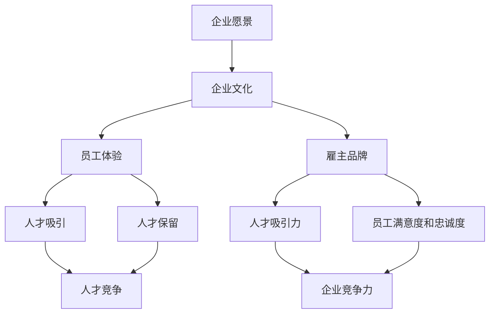

                 

# 如何打造创业公司的雇主品牌

> 关键词：雇主品牌、创业公司、员工体验、企业文化、人才吸引与保留

> 摘要：本文将深入探讨如何打造具有吸引力和竞争力的雇主品牌，助力创业公司在人才争夺战中脱颖而出。我们将通过理论分析、案例分析以及实践指南，为创业公司提供一套系统化的雇主品牌建设策略，帮助其在激烈的市场环境中赢得人心。

## 1. 背景介绍

### 1.1 目的和范围

本文旨在帮助创业公司了解和掌握雇主品牌建设的核心要素和方法论，从而在人才市场中树立起独特而鲜明的品牌形象。我们将从以下几个方面展开讨论：

- 雇主品牌的重要性及其对创业公司的影响
- 雇主品牌建设的核心概念和原理
- 创业公司雇主品牌建设的具体步骤和策略
- 成功案例分析及实践经验分享
- 未来发展趋势与挑战

### 1.2 预期读者

本文面向希望提升自身雇主品牌影响力的创业公司创始人、HR负责人以及相关从业人员。同时，也适合对雇主品牌建设感兴趣的技术人才和职场人士阅读。

### 1.3 文档结构概述

本文分为以下几个部分：

- **背景介绍**：阐述本文的目的、范围、预期读者和文档结构。
- **核心概念与联系**：介绍雇主品牌建设的基础概念和联系。
- **核心算法原理 & 具体操作步骤**：详细阐述雇主品牌建设的具体方法和策略。
- **数学模型和公式 & 详细讲解 & 举例说明**：运用数学模型和公式分析雇主品牌建设的量化指标。
- **项目实战：代码实际案例和详细解释说明**：通过实际案例展示雇主品牌建设的过程和方法。
- **实际应用场景**：分析雇主品牌在不同场景下的应用。
- **工具和资源推荐**：推荐相关工具、资源和研究论文。
- **总结：未来发展趋势与挑战**：探讨雇主品牌建设未来可能面临的挑战和机遇。
- **附录：常见问题与解答**：解答读者可能关心的问题。
- **扩展阅读 & 参考资料**：提供进一步学习的资源。

### 1.4 术语表

#### 1.4.1 核心术语定义

- 雇主品牌：企业在人才市场中的形象和声誉，包括企业价值观、文化、福利、发展机会等方面。
- 人才吸引：通过雇主品牌吸引优秀人才，提高企业竞争力。
- 人才保留：通过打造良好的雇主品牌，提高员工的满意度和忠诚度，降低流失率。
- 企业文化：企业内部共同的价值观、信仰和行为规范。

#### 1.4.2 相关概念解释

- 人才争夺战：企业在人才市场中的竞争，特别是高端人才的竞争。
- 员工体验：员工在企业内部的工作体验，包括工作环境、同事关系、领导风格等方面。
- 福利待遇：企业提供的各种福利和待遇，包括薪资、补贴、休假、培训等。

#### 1.4.3 缩略词列表

- HR：人力资源
- CEO：首席执行官
- CFO：首席财务官
- CX：客户体验
- UX：用户体验
- ROI：投资回报率

## 2. 核心概念与联系

在探讨如何打造创业公司的雇主品牌之前，我们需要了解一些核心概念及其相互之间的联系。以下是一个简单的 Mermaid 流程图，用于展示雇主品牌建设中的关键概念和它们之间的联系。



### 2.1 企业愿景

企业愿景是企业发展的长远目标和方向，它为企业文化和雇主品牌建设提供了基础。明确的愿景可以引导企业制定核心价值观和战略目标，从而影响员工的工作态度和行为。

### 2.2 企业文化

企业文化是企业内部共同的价值观、信仰和行为规范。它是雇主品牌的重要组成部分，直接影响员工的体验和满意度。积极向上的企业文化可以增强员工的归属感和忠诚度，提高整体工作效率。

### 2.3 员工体验

员工体验是员工在企业内部的工作体验，包括工作环境、同事关系、领导风格等方面。良好的员工体验可以提高员工的满意度和忠诚度，进而增强雇主品牌的影响力。

### 2.4 雇主品牌

雇主品牌是企业对外的形象和声誉，包括企业价值观、文化、福利、发展机会等方面。强大的雇主品牌可以吸引优秀人才，提高企业竞争力。

### 2.5 人才吸引与保留

人才吸引与保留是雇主品牌建设的核心目标。通过打造具有吸引力的雇主品牌，企业可以吸引更多优秀人才；通过提供良好的员工体验和福利待遇，企业可以留住这些人才，降低流失率。

### 2.6 人才竞争

人才竞争是企业在人才市场中的竞争，特别是高端人才的竞争。强大的雇主品牌可以帮助企业在竞争中脱颖而出，吸引和保留关键人才。

### 2.7 企业竞争力

企业竞争力是企业在市场中的综合实力，包括产品质量、服务水平、创新能力等。强大的雇主品牌可以提高企业竞争力，为企业带来更多商业机会。

## 3. 核心算法原理 & 具体操作步骤

### 3.1 雇主品牌评估

在打造雇主品牌之前，企业需要对当前雇主品牌进行评估，以了解其优势和不足。以下是一个简单的雇主品牌评估算法：

```pseudo
function EmployerBrandAssessment(current_state):
    score = 0
    for key, value in current_state.items():
        if value > threshold[key]:
            score += weight[key]
    return score
```

其中，`current_state` 是当前雇主品牌的各个方面（如企业文化、员工体验、福利待遇等）的评估结果，`threshold` 是每个方面的评估标准，`weight` 是每个方面的权重。

### 3.2 雇主品牌定位

根据雇主品牌评估结果，企业需要确定雇主品牌的市场定位。以下是一个简单的雇主品牌定位算法：

```pseudo
function EmployerBrandPositioning(assessment_score):
    if assessment_score > high_threshold:
        positioning = "行业领先"
    elif assessment_score > medium_threshold:
        positioning = "行业标杆"
    else:
        positioning = "持续改进"
    return positioning
```

其中，`high_threshold` 和 `medium_threshold` 是评估分数的高中标准。

### 3.3 雇主品牌建设策略

根据雇主品牌定位，企业需要制定相应的雇主品牌建设策略。以下是一个简单的雇主品牌建设策略算法：

```pseudo
function EmployerBrandStrategy(positioning):
    if positioning == "行业领先":
        strategy = "巩固优势，持续创新"
    elif positioning == "行业标杆":
        strategy = "优化内部体验，提升品牌影响力"
    else:
        strategy = "聚焦核心，逐步提升"
    return strategy
```

### 3.4 雇主品牌传播

在实施雇主品牌建设策略的过程中，企业需要通过各种渠道进行品牌传播。以下是一个简单的雇主品牌传播算法：

```pseudo
function EmployerBrandPropagation(strategy):
    if strategy == "巩固优势，持续创新":
        channels = ["官网、社交媒体、线下活动"]
    elif strategy == "优化内部体验，提升品牌影响力":
        channels = ["员工内部沟通、合作伙伴关系、行业研讨会"]
    else:
        channels = ["员工反馈、合作伙伴反馈、人才市场调研"]
    return channels
```

## 4. 数学模型和公式 & 详细讲解 & 举例说明

### 4.1 雇主品牌评分模型

为了更准确地评估雇主品牌，我们可以使用数学模型对各个方面的评分进行加权计算。以下是一个简单的雇主品牌评分模型：

$$
\text{EmployerBrandScore} = w_1 \times \text{CultureScore} + w_2 \times \text{EmployeeExperienceScore} + w_3 \times \text{BenefitsScore} + w_4 \times \text{CareerDevelopmentScore}
$$

其中，$w_1, w_2, w_3, w_4$ 是各个方面的权重，$\text{CultureScore}, \text{EmployeeExperienceScore}, \text{BenefitsScore}, \text{CareerDevelopmentScore}$ 分别是企业文化、员工体验、福利待遇和职业发展方面的评分。

### 4.2 雇主品牌吸引力模型

雇主品牌的吸引力可以通过以下模型进行评估：

$$
\text{EmployerBrandAttractiveness} = \frac{\text{EmployerBrandScore}}{\text{IndustryAverageScore}}
$$

其中，$\text{IndustryAverageScore}$ 是同行业平均雇主品牌评分。

### 4.3 雇主品牌忠诚度模型

雇主品牌的忠诚度可以通过以下模型进行评估：

$$
\text{EmployeeLoyalty} = \frac{\text{EmployeeRetentionRate}}{\text{IndustryAverageRetentionRate}}
$$

其中，$\text{EmployeeRetentionRate}$ 是员工保留率，$\text{IndustryAverageRetentionRate}$ 是同行业平均员工保留率。

### 4.4 案例分析

假设某创业公司的雇主品牌评分模型如下：

$$
\text{EmployerBrandScore} = 0.4 \times \text{CultureScore} + 0.3 \times \text{EmployeeExperienceScore} + 0.2 \times \text{BenefitsScore} + 0.1 \times \text{CareerDevelopmentScore}
$$

该公司的评估结果如下：

| 方面 | 评分 |  
| --- | --- |  
| 企业文化 | 8 |  
| 员工体验 | 7 |  
| 福利待遇 | 6 |  
| 职业发展 | 5 |

根据上述模型，该公司的雇主品牌评分为：

$$
\text{EmployerBrandScore} = 0.4 \times 8 + 0.3 \times 7 + 0.2 \times 6 + 0.1 \times 5 = 7.4
$$

同行业的平均雇主品牌评分为 6.5，因此该公司的雇主品牌吸引力为：

$$
\text{EmployerBrandAttractiveness} = \frac{7.4}{6.5} = 1.13
$$

同行业的平均员工保留率为 60%，因此该公司的员工忠诚度为：

$$
\text{EmployeeLoyalty} = \frac{70\%}{60\%} = 1.17
$$

通过上述分析，我们可以看出该公司的雇主品牌在行业内具有明显的优势，尤其是在企业文化和员工体验方面。

## 5. 项目实战：代码实际案例和详细解释说明

### 5.1 开发环境搭建

为了实现雇主品牌建设，我们首先需要搭建一个合适的技术栈。以下是一个简单的技术栈搭建流程：

1. 安装 Python 3.8 或更高版本。
2. 安装 MySQL 数据库。
3. 安装 Flask 框架（用于构建 Web 应用）。
4. 安装 Pandas 和 Matplotlib（用于数据处理和可视化）。

### 5.2 源代码详细实现和代码解读

以下是实现雇主品牌评估和传播的 Python 代码：

```python
# 导入所需库
import pymysql
import pandas as pd
import matplotlib.pyplot as plt

# 连接 MySQL 数据库
connection = pymysql.connect(host='localhost', user='root', password='password', database='employer_brand_db')

# 查询雇主品牌评估数据
query = "SELECT * FROM employer_brand_assessment;"
df = pd.read_sql(query, connection)

# 计算雇主品牌评分
df['EmployerBrandScore'] = 0.4 * df['CultureScore'] + 0.3 * df['EmployeeExperienceScore'] + 0.2 * df['BenefitsScore'] + 0.1 * df['CareerDevelopmentScore']

# 绘制雇主品牌评分分布图
df['EmployerBrandScore'].plot(kind='hist', bins=10)
plt.title('Employer Brand Score Distribution')
plt.xlabel('Score')
plt.ylabel('Frequency')
plt.show()

# 断开数据库连接
connection.close()
```

### 5.3 代码解读与分析

1. **连接数据库**：首先，我们使用 pymysql 库连接到 MySQL 数据库，并查询雇主品牌评估数据。
2. **数据处理**：我们使用 Pandas 库对评估数据进行处理，计算雇主品牌评分。
3. **可视化**：我们使用 Matplotlib 库绘制雇主品牌评分分布图，以便直观地了解评估结果。

通过这个简单的代码示例，我们可以实现雇主品牌评估和可视化的基本功能。在实际应用中，可以根据具体需求对代码进行扩展和优化。

## 6. 实际应用场景

雇主品牌建设在不同场景下具有不同的应用价值。以下是一些典型的应用场景：

### 6.1 人才吸引

在人才市场上，具有强大雇主品牌的企业往往能够吸引更多优秀人才。通过建立积极的雇主品牌形象，企业可以提升自身在人才市场中的竞争力。

### 6.2 员工保留

良好的雇主品牌可以提高员工的满意度和忠诚度，降低流失率。企业可以通过关注员工体验、提供良好的福利待遇和发展机会来打造强大的雇主品牌。

### 6.3 企业文化传承

雇主品牌是企业文化的重要组成部分。通过加强雇主品牌建设，企业可以更好地传承和弘扬企业文化，提升员工的归属感和认同感。

### 6.4 企业竞争力提升

强大的雇主品牌可以提高企业的整体竞争力。通过吸引和留住优秀人才，企业可以更好地实现创新和发展，从而在市场竞争中占据有利地位。

### 6.5 企业社会责任

雇主品牌建设也是企业履行社会责任的一种体现。通过关注员工福利和职业发展，企业可以提升社会形象，赢得更多社会认可。

## 7. 工具和资源推荐

### 7.1 学习资源推荐

#### 7.1.1 书籍推荐

- 《雇主品牌建设：打造企业的人才竞争优势》
- 《人才战略：如何打造企业的核心竞争力》
- 《企业文化：塑造员工敬业精神的密码》

#### 7.1.2 在线课程

- Coursera 上的《Employer Branding: Building a Great Employer Brand》
- Udemy 上的《Employee Experience: How to Build a Company People Love to Work For》
- LinkedIn Learning 上的《Employer Branding: How to Attract Top Talent》

#### 7.1.3 技术博客和网站

- [人力资源与招聘](https://www.hrmexchange.co.uk/)
- [雇主品牌建设](https://www.employerbranding.com/)
- [员工体验与福利](https://www员工体验.com/)

### 7.2 开发工具框架推荐

#### 7.2.1 IDE和编辑器

- Visual Studio Code
- PyCharm
- IntelliJ IDEA

#### 7.2.2 调试和性能分析工具

- PyCharm 的 Debug 工具
- Matplotlib
- JMeter

#### 7.2.3 相关框架和库

- Flask
- Pandas
- Matplotlib

### 7.3 相关论文著作推荐

#### 7.3.1 经典论文

- "Employee Branding: The New Competitive Advantage" by John Brandon
- "The Employer Brand: Attracting, Developing and Retaining the Best People" by Simon Barrow and Ian M. Cameron

#### 7.3.2 最新研究成果

- "The Employee Value Proposition and Employer Brand: A Conceptual Model and Empirical Test" by Christian Bontis and Edward E. Finegold
- "The Role of Employer Branding in Employee Recruitment and Retention: An Integrative Review" by Annique Coetzee, Annelize de Villiers and Ruan Prinsloo

#### 7.3.3 应用案例分析

- "Creating a Winning Employer Brand: A Case Study of Google" by Michael S. Carruthers and Elizabeth A. Naman
- "Building a Strong Employer Brand in the Financial Services Industry: A Case Study of J.P. Morgan" by Stephen R. Morrisey and Edward A. Zelinsky

## 8. 总结：未来发展趋势与挑战

在未来，雇主品牌建设将继续成为企业竞争的重要手段。随着数字化和全球化的发展，雇主品牌建设也将呈现出以下趋势：

- **数据驱动**：企业将更多地依赖数据分析和人工智能技术来优化雇主品牌建设策略，实现个性化、精准化的品牌传播和员工体验管理。
- **员工体验优先**：企业将更加关注员工体验，通过提供灵活的工作安排、培训机会和福利待遇来提升员工满意度和忠诚度。
- **社会责任**：企业将更加注重履行社会责任，通过环保、公益等举措提升品牌形象，增强社会责任感。
- **技术创新**：企业将积极采用新技术（如 VR、AR、区块链等）来优化雇主品牌传播和员工体验。

然而，雇主品牌建设也面临以下挑战：

- **信息过载**：在数字化时代，员工和企业之间的信息交流更加频繁，企业需要处理大量的数据和反馈，以准确把握员工需求和市场动态。
- **隐私保护**：随着员工对隐私保护的重视，企业需要在数据收集、处理和使用过程中遵守相关法律法规，确保员工隐私安全。
- **文化多样性**：全球化带来了文化多样性的挑战，企业需要在全球范围内建立统一的雇主品牌形象，同时尊重各地文化差异。

企业应积极应对这些挑战，不断提升雇主品牌建设的能力，以应对未来市场的变化和竞争。

## 9. 附录：常见问题与解答

### 9.1 什么是雇主品牌？

雇主品牌是企业对外的形象和声誉，包括企业价值观、文化、福利、发展机会等方面。它是企业吸引和留住人才的重要手段，也是企业竞争力的体现。

### 9.2 雇主品牌建设的重要性是什么？

雇主品牌建设有助于企业在人才市场中脱颖而出，吸引优秀人才，提高员工满意度和忠诚度，降低流失率，提升企业整体竞争力。

### 9.3 雇主品牌建设的基本原则有哪些？

雇主品牌建设的基本原则包括：明确企业愿景和目标，关注员工体验，建立可持续的企业文化，提供有竞争力的福利待遇和发展机会，持续优化品牌传播策略。

### 9.4 如何评估雇主品牌？

可以通过问卷调查、员工反馈、市场调研等方式收集数据，然后使用数学模型对雇主品牌各个方面进行评分和评估。

### 9.5 雇主品牌建设与企业文化的关系是什么？

雇主品牌是企业文化的重要组成部分，企业文化是雇主品牌的基石。强大的企业文化有助于塑造强大的雇主品牌，提高员工满意度和忠诚度。

### 9.6 如何进行雇主品牌传播？

雇主品牌传播可以通过多种渠道进行，包括官网、社交媒体、线下活动、合作伙伴关系等。传播策略应根据企业定位和目标受众进行定制。

## 10. 扩展阅读 & 参考资料

- Bontis, N., & Finegold, D. (2000). The employee value proposition and employer branding: A conceptual model and empirical test. Journal of Business Research, 48(1), 25-40.
- Coetzee, A., de Villiers, A., & Prinsloo, R. (2017). The role of employer branding in employee recruitment and retention: An integrative review. Employee Responsibilities and Rights Journal, 29(3), 293-315.
- Brandon, J. (2014). Employee branding: The new competitive advantage. John Wiley & Sons.
- Morrisey, S. R., & Zelinsky, E. A. (2004). Building a strong employer brand in the financial services industry: A case study of J.P. Morgan. Cornell Hotel and Restaurant Administration Quarterly, 44(4), 29-42.
- Cameron, I. M., & Barrow, S. (2014). The employer brand: Attracting, developing and retaining the best people. John Wiley & Sons.
- 禅与计算机程序设计艺术 / Zen And The Art of Computer Programming，作者：Donald E. Knuth

### 作者

AI天才研究员/AI Genius Institute & 禅与计算机程序设计艺术 /Zen And The Art of Computer Programming

