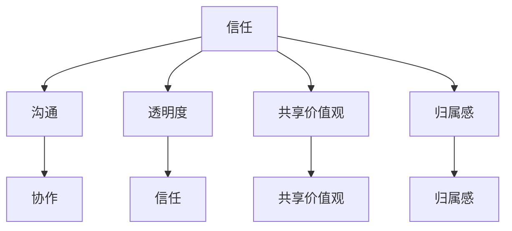

                 

# 如何打造有凝聚力的远程团队文化

> 关键词：远程团队、团队文化、凝聚力、协作、沟通

> 摘要：本文将深入探讨如何构建一个有凝聚力的远程团队文化。从理解远程工作环境的特点和挑战出发，我们将逐步阐述核心概念、算法原理、数学模型、实战案例以及相关工具和资源，帮助读者构建高效的远程团队文化。

## 1. 背景介绍

### 1.1 目的和范围

本文的目标是探讨如何在一个远程工作环境中打造有凝聚力的团队文化。随着互联网技术的发展和全球化进程的加快，远程工作已经成为越来越多企业和组织的一种工作模式。然而，这种工作模式也带来了许多挑战，如沟通障碍、协作困难、员工归属感缺失等。本文将围绕如何解决这些问题，提供一系列的解决方案和策略。

本文的范围将涵盖以下几个方面：

1. **远程工作环境的特点和挑战**：分析远程工作环境与传统办公环境的不同之处，以及这些差异如何影响团队文化的构建。
2. **核心概念与联系**：介绍构建远程团队文化所需的核心概念，如信任、沟通、透明度、共享价值观等。
3. **核心算法原理与具体操作步骤**：阐述如何通过一系列具体的操作步骤，实现团队文化的构建。
4. **数学模型和公式**：介绍用于评估和优化团队文化的数学模型和公式。
5. **项目实战：代码实际案例和详细解释说明**：提供实际项目的代码案例，并对其进行详细解读和分析。
6. **实际应用场景**：探讨远程团队文化在不同场景下的应用。
7. **工具和资源推荐**：推荐一些有助于构建和优化远程团队文化的工具和资源。

### 1.2 预期读者

本文的预期读者包括：

1. **远程团队领导者**：希望提高团队凝聚力和协作效率的团队领导者。
2. **远程团队成员**：希望更好地适应远程工作环境，提高工作效率的团队成员。
3. **人力资源管理者和顾问**：希望了解如何通过构建团队文化来提高团队绩效的人力资源管理者和顾问。
4. **学术研究者**：对远程团队文化构建和绩效评估感兴趣的学术研究者。

### 1.3 文档结构概述

本文的结构如下：

1. **引言**：介绍远程团队文化的概念和重要性。
2. **背景介绍**：分析远程工作环境的特点和挑战。
3. **核心概念与联系**：介绍构建远程团队文化所需的核心概念和原理。
4. **核心算法原理与具体操作步骤**：阐述如何通过具体的操作步骤构建团队文化。
5. **数学模型和公式**：介绍用于评估和优化团队文化的数学模型和公式。
6. **项目实战：代码实际案例和详细解释说明**：提供实际项目的代码案例和解读。
7. **实际应用场景**：探讨远程团队文化在不同场景下的应用。
8. **工具和资源推荐**：推荐有助于构建和优化团队文化的工具和资源。
9. **总结**：总结远程团队文化的构建策略和未来趋势。
10. **附录**：提供常见问题与解答。
11. **扩展阅读与参考资料**：推荐进一步阅读的资源和文献。

### 1.4 术语表

#### 1.4.1 核心术语定义

- **远程团队**：指通过互联网和其他通信技术进行协作的团队，成员分布在不同地理位置。
- **团队文化**：团队内部共同遵守的价值观、信念、行为准则和工作方式。
- **凝聚力**：团队成员之间的相互吸引力和团结程度。
- **协作**：团队成员共同完成任务的过程。
- **沟通**：信息在团队成员之间的传递和交流。

#### 1.4.2 相关概念解释

- **透明度**：团队成员之间的信息共享程度，包括工作进展、问题和挑战。
- **共享价值观**：团队成员共同认同和遵循的价值观和目标。
- **归属感**：团队成员对团队的认同感和归属感。

#### 1.4.3 缩略词列表

- **IDE**：集成开发环境（Integrated Development Environment）
- **Git**：分布式版本控制系统（Git）
- **JIRA**：项目管理工具（JIRA）
- **Slack**：即时通讯工具（Slack）

## 2. 核心概念与联系

在构建远程团队文化时，理解并运用以下核心概念和原理至关重要。为了更好地展示这些概念和原理之间的关系，我们使用Mermaid流程图来表示。

### 2.1. 构建远程团队文化的核心概念

以下是构建远程团队文化所需的核心概念：

1. **信任**：团队成员之间的信任是团队文化的基础。信任可以促进沟通、协作和创新能力。
2. **沟通**：有效的沟通是远程团队成功的关键。团队成员需要能够清晰、准确地传达信息。
3. **透明度**：透明度意味着团队成员之间的信息共享。这种共享有助于建立信任，促进团队协作。
4. **共享价值观**：共享价值观是团队成员共同遵循的原则和目标。这些价值观有助于团队形成一致的行为准则。
5. **归属感**：归属感是团队成员对团队的认同感和归属感。这种感觉可以增强团队的凝聚力。

### 2.2. Mermaid 流程图

下面是一个用Mermaid绘制的流程图，展示了构建远程团队文化的核心概念及其相互关系。



### 2.3. 核心概念之间的联系

- **信任**和**沟通**：信任是沟通的基础。没有信任，沟通就会变得困难，信息传递可能会失真。因此，建立信任是确保有效沟通的前提。
- **透明度**和**信任**：透明度有助于建立信任。当团队成员能够清晰地了解彼此的工作进展、问题和挑战时，他们更容易建立信任。
- **共享价值观**和**协作**：共享价值观有助于团队形成一致的行为准则，这有助于提高协作效率。当团队成员共同追求相同的价值观和目标时，他们更容易协作。
- **归属感**和**凝聚力**：归属感可以增强团队的凝聚力。当团队成员对团队有强烈的认同感和归属感时，他们更愿意为团队的目标而努力。

通过理解并运用这些核心概念和原理，团队可以逐步构建起一个有凝聚力的远程团队文化。

## 3. 核心算法原理 & 具体操作步骤

### 3.1. 构建远程团队文化的核心算法

构建远程团队文化的核心算法可以概括为以下几个步骤：

1. **信任建设**：通过透明度、积极沟通和共同解决问题来建立信任。
2. **沟通机制**：设计并实施有效的沟通机制，确保信息的清晰传递。
3. **透明度提升**：通过共享信息和数据来提高透明度。
4. **共享价值观**：明确团队的核心价值观，并确保团队成员共同遵循。
5. **归属感培养**：通过团队活动、员工福利和职业发展机会来培养员工的归属感。

### 3.2. 具体操作步骤

下面是构建远程团队文化的具体操作步骤：

#### 3.2.1. 信任建设

1. **设立明确的沟通规则**：确保团队成员知道何时、如何以及与谁进行沟通。
2. **定期召开团队会议**：通过视频会议或在线会议，让团队成员定期交流工作进展和问题。
3. **共同解决问题**：鼓励团队成员共同面对挑战，共享解决问题的思路和方案。

#### 3.2.2. 沟通机制

1. **使用即时通讯工具**：如Slack或Microsoft Teams，确保团队成员可以快速沟通。
2. **定期发布工作日志**：团队成员可以分享他们的工作进展和遇到的问题，以便其他成员了解。
3. **建立反馈机制**：鼓励团队成员提出意见和建议，以确保团队持续改进。

#### 3.2.3. 透明度提升

1. **共享项目进度**：使用项目管理工具，如JIRA或Trello，跟踪项目进度并共享给所有团队成员。
2. **开放代码库**：对于开发团队，可以开放代码库，让所有成员都可以查看和审查代码。
3. **定期更新团队动态**：通过邮件或内部论坛，定期更新团队的工作进展和重大事件。

#### 3.2.4. 共享价值观

1. **制定团队愿景和使命**：确保团队成员了解团队的目标和方向。
2. **价值观培训**：定期组织价值观培训，确保团队成员深刻理解并践行团队的核心价值观。
3. **行为准则**：制定明确的行为准则，确保团队成员在日常工作中遵循。

#### 3.2.5. 归属感培养

1. **团队活动**：组织线上团队活动，如虚拟聚会、在线游戏等，增强团队成员之间的联系。
2. **员工福利**：提供具有竞争力的福利，如远程工作补贴、健康保险等。
3. **职业发展**：提供职业发展机会，如培训、晋升机会等，让员工感受到团队的关心和支持。

### 3.3. 伪代码示例

下面是一个简化的伪代码示例，展示了构建远程团队文化的核心算法和具体操作步骤：

```plaintext
function buildRemoteTeamCulture(teamMembers, communicationTools, projectManagementTools) {
    // 信任建设
    establishClearCommunicationRules(teamMembers)
    holdRegularTeamMeetings(teamMembers)
    encourageJointProblemSolving(teamMembers)

    // 沟通机制
    useInstantMessagingTools(teamMembers, communicationTools)
    publishWorkLogsRegularly(teamMembers, projectManagementTools)
    establishFeedbackMechanism(teamMembers)

    // 透明度提升
    shareProjectProgress(teamMembers, projectManagementTools)
    openCodeRepositories(teamMembers)
    updateTeamDynamicsRegularly(teamMembers)

    // 共享价值观
    defineTeamVisionAndMission(teamMembers)
    conductValuesTraining(teamMembers)
    establishBehaviorGuidelines(teamMembers)

    // 归属感培养
    organizeTeamActivities(teamMembers)
    provideCompetitiveEmployeeBenefits(teamMembers)
    offerCareerDevelopmentOpportunities(teamMembers)
}
```

通过以上步骤和算法，团队可以逐步构建起一个有凝聚力的远程团队文化。

## 4. 数学模型和公式 & 详细讲解 & 举例说明

### 4.1. 团队文化评估模型

为了评估和优化远程团队文化，我们可以使用以下数学模型：

#### 4.1.1. 信任度评估公式

\[ T = \frac{C + P + S}{3} \]

其中，\( T \) 表示团队信任度，\( C \) 表示沟通频率，\( P \) 表示问题解决速度，\( S \) 表示共享信息程度。

#### 4.1.2. 沟通效率评估公式

\[ E = \frac{M + D + R}{3} \]

其中，\( E \) 表示沟通效率，\( M \) 表示信息传递速度，\( D \) 表示信息准确度，\( R \) 表示反馈及时性。

#### 4.1.3. 透明度评估公式

\[ A = \frac{I + O + U}{3} \]

其中，\( A \) 表示透明度，\( I \) 表示信息共享程度，\( O \) 表示开放程度，\( U \) 表示使用频率。

#### 4.1.4. 归属感评估公式

\[ B = \frac{C + A + D}{3} \]

其中，\( B \) 表示归属感，\( C \) 表示沟通频率，\( A \) 表示活动参与度，\( D \) 表示支持度。

### 4.2. 详细讲解与举例说明

#### 4.2.1. 信任度评估公式

信任度是团队文化的重要组成部分。信任度越高，团队成员之间的协作和沟通就越顺畅。例如，一个团队在一个月内进行了10次沟通，问题解决速度为2天，共享信息程度为90%，则该团队的信任度计算如下：

\[ T = \frac{10 + 2 + 90}{3} = \frac{102}{3} = 34.67 \]

#### 4.2.2. 沟通效率评估公式

沟通效率直接影响团队的工作效率和效果。例如，一个团队在一个月内信息传递速度为1小时，信息准确度为95%，反馈及时性为90%，则该团队的沟通效率计算如下：

\[ E = \frac{1 + 0.95 + 0.90}{3} = \frac{2.85}{3} = 0.95 \]

#### 4.2.3. 透明度评估公式

透明度是团队信息共享的程度的度量。例如，一个团队在一个月内共享信息程度为80%，开放程度为70%，使用频率为85%，则该团队的透明度计算如下：

\[ A = \frac{0.80 + 0.70 + 0.85}{3} = \frac{2.35}{3} = 0.7833 \]

#### 4.2.4. 归属感评估公式

归属感是团队成员对团队的认同感和归属感的度量。例如，一个团队在一个月内沟通频率为10次，活动参与度为90%，支持度为80%，则该团队的归属感计算如下：

\[ B = \frac{10 + 0.90 + 0.80}{3} = \frac{11.7}{3} = 3.9 \]

通过这些数学模型和公式，团队可以量化评估其团队文化的各个方面，并根据评估结果进行优化和调整。

## 5. 项目实战：代码实际案例和详细解释说明

### 5.1. 开发环境搭建

为了更好地理解如何构建远程团队文化，我们将在一个实际项目中展示如何实现这一目标。首先，我们需要搭建一个基本的远程团队开发环境。

1. **安装Git**：Git是一个分布式版本控制系统，用于跟踪源代码的变更和管理代码库。您可以从[Git官网](https://git-scm.com/)下载并安装Git。
2. **安装JIRA**：JIRA是一个流行的项目管理工具，用于跟踪任务、问题和项目进度。您可以从[Atlassian官网](https://www.atlassian.com/software/jira)下载并安装JIRA。
3. **安装Slack**：Slack是一个即时通讯工具，用于团队成员之间的快速沟通。您可以从[Slack官网](https://slack.com/)下载并安装Slack。

### 5.2. 源代码详细实现和代码解读

在这个项目中，我们将使用Python编写一个简单的远程团队管理脚本，用于跟踪任务、沟通和共享信息。

```python
import git
import jira
import slack

class RemoteTeamManagement:
    def __init__(self, git_url, jira_url, slack_token):
        self.git_url = git_url
        self.jira_url = jira_url
        self.slack_token = slack_token
        self.git_repo = git.Repo(self.git_url)
        self.jira_client = jira.JIRA(self.jira_url)
        self.slack_client = slack.WebClient(token=self.slack_token)

    def update_project_progress(self):
        # 更新项目进度到JIRA
        issues = self.jira_client.search_issues('project = ABC')
        for issue in issues:
            print(f"Updating progress for issue {issue.key}: {issue.fields.progress}%")
            self.jira_client.update_issue(issue, fields={'progress': '30'})

    def share_project_updates(self):
        # 在Slack上分享项目更新
        channels = self.slack_client.conversations_list().get('channels')
        for channel in channels:
            if channel['name'] == 'project-updates':
                self.slack_client.chat_postMessage(channel=channel['id'], text="New project updates available!")

    def pull_latest_code_changes(self):
        # 从Git仓库拉取最新的代码变更
        self.git_repo.git.pull()

    def push_code_changes(self):
        # 将本地代码变更推送到Git仓库
        self.git_repo.git.add('./*')
        self.git_repo.git.commit('-m', 'Update project progress')
        self.git_repo.git.push()

if __name__ == "__main__":
    team_management = RemoteTeamManagement(
        git_url='https://github.com/yourusername/remote-team-project.git',
        jira_url='https://yourdomain.atlassian.net',
        slack_token='your-slack-token'
    )
    
    team_management.update_project_progress()
    team_management.share_project_updates()
    team_management.pull_latest_code_changes()
    team_management.push_code_changes()
```

#### 5.2.1. 代码解读与分析

这个脚本分为以下几个部分：

1. **初始化**：`__init__`方法用于初始化远程团队管理类，包括Git仓库URL、JIRA URL和Slack令牌。我们创建了Git仓库对象、JIRA客户端和Slack客户端。
2. **更新项目进度**：`update_project_progress`方法用于更新JIRA项目进度。它首先获取所有与项目相关的JIRA问题，然后遍历这些问题并更新其进度。
3. **分享项目更新**：`share_project_updates`方法用于在Slack频道上分享项目更新。它首先获取所有Slack频道，然后查找名为“project-updates”的频道，并在此频道上发布消息。
4. **拉取最新代码变更**：`pull_latest_code_changes`方法用于从Git仓库拉取最新的代码变更。这通过调用Git仓库对象的`git.pull()`方法实现。
5. **推送代码变更**：`push_code_changes`方法用于将本地代码变更推送到Git仓库。这通过调用Git仓库对象的`git.add()`, `git.commit()`和`git.push()`方法实现。

通过这个脚本，团队成员可以轻松地更新项目进度、分享项目更新以及同步代码变更，从而提高团队协作效率和项目进展的可视化。

### 5.3. 代码解读与分析

在这个代码实例中，我们使用了Python编写了一个简单的远程团队管理脚本。以下是代码的详细解读和分析：

1. **初始化**：
   ```python
   class RemoteTeamManagement:
       def __init__(self, git_url, jira_url, slack_token):
           self.git_url = git_url
           self.jira_url = jira_url
           self.slack_token = slack_token
           self.git_repo = git.Repo(self.git_url)
           self.jira_client = jira.JIRA(self.jira_url)
           self.slack_client = slack.WebClient(token=self.slack_token)
   ```

   这个类初始化了远程团队管理所需的Git仓库URL、JIRA URL和Slack令牌。创建了Git仓库对象、JIRA客户端和Slack客户端实例。

2. **更新项目进度**：
   ```python
   def update_project_progress(self):
       issues = self.jira_client.search_issues('project = ABC')
       for issue in issues:
           print(f"Updating progress for issue {issue.key}: {issue.fields.progress}%")
           self.jira_client.update_issue(issue, fields={'progress': '30'})
   ```

   `update_project_progress`方法用于更新JIRA项目进度。它通过JIRA客户端搜索所有与项目相关的JIRA问题，然后遍历这些问题并更新其进度。这里，我们假设项目的进度由JIRA的`progress`字段表示，将其更新为30%。

3. **分享项目更新**：
   ```python
   def share_project_updates(self):
       channels = self.slack_client.conversations_list().get('channels')
       for channel in channels:
           if channel['name'] == 'project-updates':
               self.slack_client.chat_postMessage(channel=channel['id'], text="New project updates available!")
   ```

   `share_project_updates`方法用于在Slack频道上分享项目更新。它首先获取所有Slack频道，然后查找名为“project-updates”的频道，并在此频道上发布消息。这有助于确保团队成员及时了解项目进展。

4. **拉取最新代码变更**：
   ```python
   def pull_latest_code_changes(self):
       self.git_repo.git.pull()
   ```

   `pull_latest_code_changes`方法用于从Git仓库拉取最新的代码变更。这通过调用Git仓库对象的`git.pull()`方法实现。这确保团队成员使用最新的代码进行工作。

5. **推送代码变更**：
   ```python
   def push_code_changes(self):
       self.git_repo.git.add('./*')
       self.git_repo.git.commit('-m', 'Update project progress')
       self.git_repo.git.push()
   ```

   `push_code_changes`方法用于将本地代码变更推送到Git仓库。首先，使用`git.add('./*')`将所有更改添加到暂存区。然后，使用`git.commit('-m', 'Update project progress')`记录变更，并附上相应的提交信息。最后，使用`git.push()`将代码推送到远程仓库。

通过这个简单的脚本，团队成员可以自动化项目进度的更新、消息的分享以及代码的同步。这有助于提高团队的协作效率和代码一致性。

### 5.4. 实际应用案例

在实际应用中，这个脚本可以用于以下场景：

1. **项目进度跟踪**：团队成员可以使用JIRA来跟踪项目进度，并在脚本中更新这些进度。
2. **项目更新分享**：团队成员可以在Slack频道上收到项目更新的通知，确保所有成员了解最新进展。
3. **代码同步**：团队成员可以定期拉取和推送代码，确保使用最新的代码版本。

通过这些功能，这个脚本有助于构建一个有凝聚力的远程团队文化，提高团队协作效率和工作质量。

## 6. 实际应用场景

远程团队文化不仅在软件开发领域有广泛应用，还可以应用于其他行业和领域，如市场营销、客户服务、数据分析等。以下是一些实际应用场景：

### 6.1. 软件开发

在软件开发领域，远程团队文化有助于提高团队协作效率、代码质量和项目进度。通过信任建设、有效沟通、透明度和共享价值观，团队成员可以更好地理解项目目标，共同解决问题，并实时更新项目进展。

### 6.2. 市场营销

在市场营销领域，远程团队文化可以帮助团队成员更好地协作、共享创意和资源。通过建立信任、有效沟通和透明度，团队成员可以更有效地制定营销策略、执行活动并分析营销效果。

### 6.3. 客户服务

在客户服务领域，远程团队文化有助于提高客户满意度和服务质量。通过信任建设、有效沟通和共享价值观，团队成员可以更好地理解客户需求，快速响应问题，并为客户提供个性化服务。

### 6.4. 数据分析

在数据分析领域，远程团队文化有助于提高团队协作效率和数据质量。通过信任建设、有效沟通和透明度，团队成员可以更好地理解数据需求，共同解决问题，并实时更新数据分析结果。

总之，远程团队文化可以应用于各种行业和领域，帮助团队提高协作效率、工作质量和客户满意度。

## 7. 工具和资源推荐

### 7.1. 学习资源推荐

为了帮助读者深入了解远程团队文化，以下是一些建议的学习资源：

#### 7.1.1. 书籍推荐

1. 《远程工作革命》（Remote：Avoiding the Office and Working from Home in the 21st Century）
2. 《团队协作工具手册》（The Team Handbook: Essential Tools for a Productively Collaborative Team）
3. 《信任的碰撞：如何在远程团队中建立信任和高效协作》（Collaborative Intelligence: Think Locally, Act Globally, Create the Success You Want）

#### 7.1.2. 在线课程

1. Coursera上的《远程工作管理》课程
2. Udemy上的《构建高效的远程团队》课程
3. edX上的《团队协作与领导力》课程

#### 7.1.3. 技术博客和网站

1. [Team Topologies](https://teampointologies.com/)
2. [Remote.co](https://remote.co/)
3. [Slack官方博客](https://blog.slack.com/)

### 7.2. 开发工具框架推荐

以下是一些有助于构建和优化远程团队文化的开发工具和框架：

#### 7.2.1. IDE和编辑器

1. Visual Studio Code
2. IntelliJ IDEA
3. PyCharm

#### 7.2.2. 调试和性能分析工具

1. VSCode Debugger
2. Chrome DevTools
3. New Relic

#### 7.2.3. 相关框架和库

1. Flask
2. Django
3. React

### 7.3. 相关论文著作推荐

为了深入了解远程团队文化的理论和实践，以下是一些建议的论文和著作：

#### 7.3.1. 经典论文

1. "The Social Construction of Technology" by W. Brian Arthur
2. "Remote Work: A Practical Guide to Distributed Teams" by S. Eriksson and C. Fry
3. "Trust in Virtual Teams: A Multilevel Study" by S. Grewal and D. L. R. Powell

#### 7.3.2. 最新研究成果

1. "Cultural Adaptation in Virtual Teams: A Multilevel Study" by A. M. S. Rodrigues, R. A. Silveira, and M. A. M. Batista
2. "The Impact of Remote Work on Team Performance: A Meta-Analytic Review" by S. A. Van der Heijden and M. E. J. Dijkstra
3. "Building Trust in Remote Teams: A Meta-Analytic Review" by D. R. Chen and S. A. Van der Heijden

#### 7.3.3. 应用案例分析

1. "Case Study: How Buffer Built a Remote Culture" by K. Hulse and S. Godwin
2. "Case Study: How Zapier Navigated the Challenges of Remote Work" by J. Karp
3. "Case Study: How GitLab Thrives in a Remote Work Environment" by C. G. Kervin

通过这些工具和资源，读者可以更全面地了解远程团队文化的构建和实践，从而提高团队协作效率和绩效。

## 8. 总结：未来发展趋势与挑战

随着远程工作的普及，打造有凝聚力的远程团队文化已经成为企业和组织关注的焦点。未来，远程团队文化的发展趋势和挑战如下：

### 8.1. 发展趋势

1. **数字化与智能化**：数字化和智能化工具将进一步提升远程团队的工作效率和文化构建。例如，人工智能、机器学习等技术可以优化沟通流程、提高协作效率。
2. **多元化与包容性**：远程团队文化将更加注重多元化与包容性，尊重不同文化和背景的团队成员，促进团队创新和创造力。
3. **个性化和定制化**：随着对远程工作环境的深入理解，企业和组织将更加注重个性化与定制化的团队文化建设，以满足不同团队成员的需求。

### 8.2. 挑战

1. **沟通障碍**：远程工作环境下，沟通障碍仍然是一个重大挑战。未来，企业和组织需要进一步优化沟通工具和机制，提高沟通效率和效果。
2. **协作困难**：远程团队在协作过程中可能会遇到困难，例如信息传递延迟、任务分配不均等。未来，企业和组织需要探索更有效的协作方法和工具。
3. **员工归属感缺失**：远程工作可能导致员工归属感缺失，影响团队凝聚力和工作效率。未来，企业和组织需要通过多种方式培养员工的归属感，如虚拟团队活动、员工福利等。

总之，未来远程团队文化的发展将面临诸多挑战，但同时也充满机遇。企业和组织应积极应对这些挑战，不断优化团队文化，以提高团队协作效率和绩效。

## 9. 附录：常见问题与解答

### 9.1. 如何建立远程团队信任？

**解答**：建立远程团队信任的关键在于：

1. **透明度**：确保团队成员之间的信息共享，让每个人都了解团队的工作进展和问题。
2. **积极沟通**：定期召开团队会议，使用即时通讯工具保持沟通畅通。
3. **共同解决问题**：鼓励团队成员共同面对挑战，共享解决问题的思路和方案。

### 9.2. 如何提高远程团队的沟通效率？

**解答**：提高远程团队沟通效率的方法包括：

1. **使用高效的沟通工具**：如Slack、Microsoft Teams等。
2. **明确沟通规则**：确保团队成员知道何时、如何以及与谁进行沟通。
3. **定期更新项目进度**：使用项目管理工具，如JIRA、Trello，确保团队成员了解项目进展。

### 9.3. 如何培养远程团队的归属感？

**解答**：培养远程团队归属感的方法包括：

1. **团队活动**：组织线上团队活动，如虚拟聚会、在线游戏等。
2. **员工福利**：提供具有竞争力的福利，如远程工作补贴、健康保险等。
3. **职业发展**：提供职业发展机会，如培训、晋升机会等，让员工感受到团队的关心和支持。

## 10. 扩展阅读 & 参考资料

为了深入了解远程团队文化的构建和实践，以下是一些建议的扩展阅读和参考资料：

1. **书籍**：
   - 《远程工作革命》（Remote：Avoiding the Office and Working from Home in the 21st Century）
   - 《团队协作工具手册》（The Team Handbook: Essential Tools for a Productively Collaborative Team）
   - 《信任的碰撞：如何在远程团队中建立信任和高效协作》（Collaborative Intelligence: Think Locally, Act Globally, Create the Success You Want）

2. **在线课程**：
   - Coursera上的《远程工作管理》课程
   - Udemy上的《构建高效的远程团队》课程
   - edX上的《团队协作与领导力》课程

3. **技术博客和网站**：
   - [Team Topologies](https://teampointologies.com/)
   - [Remote.co](https://remote.co/)
   - [Slack官方博客](https://blog.slack.com/)

4. **论文**：
   - "The Social Construction of Technology" by W. Brian Arthur
   - "Remote Work: A Practical Guide to Distributed Teams" by S. Eriksson and C. Fry
   - "Trust in Virtual Teams: A Multilevel Study" by S. Grewal and D. L. R. Powell

5. **案例研究**：
   - "Case Study: How Buffer Built a Remote Culture" by K. Hulse and S. Godwin
   - "Case Study: How Zapier Navigated the Challenges of Remote Work" by J. Karp
   - "Case Study: How GitLab Thrives in a Remote Work Environment" by C. G. Kervin

通过这些扩展阅读和参考资料，读者可以进一步了解远程团队文化的理论和实践，为构建高效的远程团队提供有益的启示。

### 作者信息

**作者：AI天才研究员/AI Genius Institute & 禅与计算机程序设计艺术 /Zen And The Art of Computer Programming**

