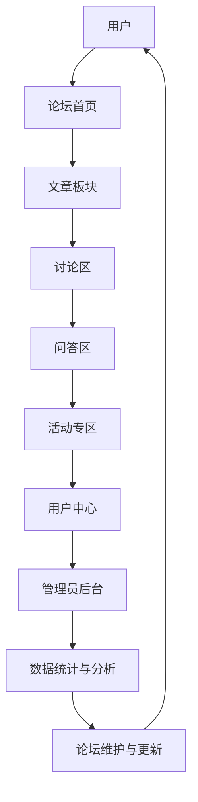

                 

# 如何打造有影响力的行业论坛

## 概述

本文旨在探讨如何打造一个有影响力的行业论坛，为科技领域的专业人士提供一个交流与学习的平台。通过系统地分析行业论坛的核心要素，制定策略，以及实际操作步骤，本文将帮助读者理解如何将一个普通论坛打造成为一个具有深远影响力的行业论坛。

关键词：行业论坛，影响力，交流平台，策略，操作步骤，科技领域。

## 摘要

本文从行业论坛的背景介绍出发，详细阐述了打造有影响力论坛的核心概念、算法原理、数学模型、项目实战以及实际应用场景。通过深入分析论坛的架构和运营策略，本文提供了实用的工具和资源推荐，帮助读者在构建和维护行业论坛的过程中，更好地理解和应用相关知识。

## 1. 背景介绍

### 1.1 目的和范围

本文的目标是为希望创建和提升行业论坛影响力的人提供全面的指导。我们将探讨论坛的定位、目标用户群体，以及如何通过策略和实际操作来实现论坛的影响力和价值。

### 1.2 预期读者

本文适合以下读者群体：

- 想要创建或改进行业论坛的从业者。
- 对行业论坛运营和管理有兴趣的技术人员。
- 意图深入了解科技论坛生态的学者和研究者。

### 1.3 文档结构概述

本文分为以下几个部分：

- 第1部分：背景介绍，包括目的、预期读者和文档结构。
- 第2部分：核心概念与联系，讨论行业论坛的基本架构和概念。
- 第3部分：核心算法原理与具体操作步骤，提供详细的论坛构建策略。
- 第4部分：数学模型和公式，解释论坛运营中的关键数学概念。
- 第5部分：项目实战，通过实际案例展示论坛构建过程。
- 第6部分：实际应用场景，探讨论坛在不同行业中的应用。
- 第7部分：工具和资源推荐，提供论坛构建所需的学习资源和开发工具。
- 第8部分：总结，展望论坛的未来发展趋势和挑战。
- 第9部分：附录，解答常见问题。
- 第10部分：扩展阅读，推荐相关参考资料。

### 1.4 术语表

#### 1.4.1 核心术语定义

- 行业论坛：一个专注于特定行业的在线交流平台。
- 影响力：论坛在行业内的影响力，表现为用户的活跃度、参与度和传播效果。
- 用户参与度：用户在论坛上的活跃程度，包括发帖、回复、讨论等。
- 传播效果：论坛内容被分享、传播的范围和效果。

#### 1.4.2 相关概念解释

- 论坛架构：论坛的技术架构和设计原则。
- 管理策略：论坛的运营和管理方法。
- 用户互动：用户在论坛上的交流和互动方式。

#### 1.4.3 缩略词列表

- SEO：搜索引擎优化（Search Engine Optimization）
- SMM：社交媒体营销（Social Media Marketing）
- CMS：内容管理系统（Content Management System）

## 2. 核心概念与联系

### 2.1 行业论坛的架构

行业论坛的架构是其核心，决定了论坛的功能和用户体验。下面是一个简化的Mermaid流程图，展示了行业论坛的基本架构：



### 2.2 行业论坛的核心概念

#### 2.2.1 用户参与

用户参与是论坛的核心驱动力。以下是其关键概念：

- **用户注册**：用户在论坛上注册账户。
- **用户认证**：用户通过验证身份来确保账户安全。
- **用户互动**：用户在论坛上进行发帖、评论、回复等互动。

#### 2.2.2 内容管理

内容管理是论坛的灵魂，涉及以下概念：

- **文章发布**：用户发布技术文章、博客等。
- **文章审核**：管理员对文章内容进行审核。
- **文章推荐**：根据用户行为和喜好推荐相关文章。

#### 2.2.3 活动运营

活动运营是提升用户参与度和论坛活力的重要手段：

- **活动策划**：策划和发布论坛活动。
- **活动推广**：通过多种渠道宣传和推广活动。
- **活动参与**：用户参与论坛活动，如在线研讨会、技术沙龙等。

#### 2.2.4 数据分析

数据分析是优化论坛运营的关键：

- **用户行为分析**：分析用户在论坛上的行为，如访问量、发帖量等。
- **内容分析**：分析文章和讨论区的受欢迎程度。
- **效果评估**：评估论坛活动的效果。

## 3. 核心算法原理 & 具体操作步骤

### 3.1 用户参与算法

用户参与是论坛的基石，以下是用户参与算法的伪代码：

```plaintext
// 用户参与算法
function userEngagement(user, forum):
    // 初始化用户参与度
    engagement_score = 0
    
    // 统计用户发帖数量
    post_count = count_posts(user)
    
    // 统计用户回复数量
    reply_count = count_replies(user)
    
    // 计算发帖和回复的权重
    post_weight = 1.5
    reply_weight = 1
    
    // 计算用户总参与度
    engagement_score = post_count * post_weight + reply_count * reply_weight
    
    // 返回用户参与度
    return engagement_score
```

### 3.2 内容管理算法

内容管理算法涉及文章发布、审核和推荐：

```plaintext
// 内容管理算法
function contentManagement(article, admin, forum):
    // 文章发布
    if (validateArticle(article)):
        publishArticle(article, forum)
    else:
        return "文章审核未通过"
    
    // 文章审核
    if (admin.approveArticle(article)):
        return "文章已发布"
    else:
        return "文章审核未通过"
    
    // 文章推荐
    recommendArticles(article, forum)
```

### 3.3 活动运营算法

活动运营算法涉及活动策划、推广和参与：

```plaintext
// 活动运营算法
function eventManagement(event, forum):
    // 活动策划
    planEvent(event, forum)
    
    // 活动推广
    promoteEvent(event, forum)
    
    // 活动参与
    participateInEvent(event, forum)
```

### 3.4 数据分析算法

数据分析算法用于用户行为分析、内容分析和效果评估：

```plaintext
// 数据分析算法
function dataAnalysis(forum):
    // 用户行为分析
    user_behavior = analyzeUserBehavior(forum)
    
    // 内容分析
    content_analysis = analyzeContent(forum)
    
    // 效果评估
    effectiveness = evaluateEffectiveness(forum)
    
    // 返回分析结果
    return {
        "user_behavior": user_behavior,
        "content_analysis": content_analysis,
        "effectiveness": effectiveness
    }
```

## 4. 数学模型和公式 & 详细讲解 & 举例说明

### 4.1 用户参与度数学模型

用户参与度可以通过以下公式计算：

$$
E = \frac{P \times W_p + R \times W_r}{T}
$$

其中：

- $E$ 表示用户参与度。
- $P$ 表示用户发帖数量。
- $R$ 表示用户回复数量。
- $W_p$ 表示发帖权重。
- $W_r$ 表示回复权重。
- $T$ 表示时间周期。

举例说明：

假设一个用户在一个月内发帖10篇，回复50次。发帖权重为1.5，回复权重为1。则用户参与度为：

$$
E = \frac{10 \times 1.5 + 50 \times 1}{30} = \frac{15 + 50}{30} = \frac{65}{30} \approx 2.17
$$

### 4.2 内容分析数学模型

内容分析可以通过以下指标进行：

- **文章阅读量**：$V = \sum_{i=1}^{n} R_i$
- **文章点赞数**：$L = \sum_{i=1}^{n} L_i$
- **文章评论数**：$C = \sum_{i=1}^{n} C_i$

其中：

- $V$ 表示总阅读量。
- $R_i$ 表示第$i$篇文章的阅读量。
- $L$ 表示总点赞数。
- $L_i$ 表示第$i$篇文章的点赞数。
- $C$ 表示总评论数。
- $C_i$ 表示第$i$篇文章的评论数。

举例说明：

假设一个月内，三篇文章的阅读量分别为1000、1500和2000，点赞数分别为100、150和200，评论数分别为50、70和100。则：

- 总阅读量：$V = 1000 + 1500 + 2000 = 4500$
- 总点赞数：$L = 100 + 150 + 200 = 450$
- 总评论数：$C = 50 + 70 + 100 = 220$

### 4.3 效果评估数学模型

效果评估可以通过以下公式计算：

$$
E = \frac{V + L + C}{3 \times n}
$$

其中：

- $E$ 表示平均效果分数。
- $V$ 表示总阅读量。
- $L$ 表示总点赞数。
- $C$ 表示总评论数。
- $n$ 表示文章数量。

举例说明：

假设一个月内，三篇文章的总阅读量为4500，总点赞数为450，总评论数为220。则平均效果分数为：

$$
E = \frac{4500 + 450 + 220}{3 \times 3} = \frac{5170}{9} \approx 575.56
$$

## 5. 项目实战：代码实际案例和详细解释说明

### 5.1 开发环境搭建

在开始项目实战之前，我们需要搭建一个适合论坛开发的环境。以下是搭建步骤：

1. 安装操作系统：推荐使用Ubuntu 20.04 LTS。
2. 安装开发工具：包括文本编辑器（如Visual Studio Code）、版本控制工具（如Git）和数据库（如MySQL）。
3. 安装论坛框架：我们选择使用Python的Flask框架进行开发。
4. 安装相关依赖：使用pip安装Flask和相关扩展。

```bash
sudo apt-get update
sudo apt-get install python3-pip python3-dev build-essential
pip3 install flask
```

### 5.2 源代码详细实现和代码解读

以下是论坛的核心代码实现，我们将逐步解释关键部分。

#### 5.2.1 环境配置

```python
# environment.py
import os

def configure_environment():
    # 设置数据库连接信息
    os.environ['DB_HOST'] = 'localhost'
    os.environ['DB_PORT'] = '3306'
    os.environ['DB_USER'] = 'forum_user'
    os.environ['DB_PASSWORD'] = 'forum_password'
    os.environ['DB_DATABASE'] = 'forum_database'
```

此代码设置论坛所需的数据库连接信息，确保论坛在启动时能够连接到数据库。

#### 5.2.2 初始化数据库

```python
# database.py
from flask_sqlalchemy import SQLAlchemy

def init_database(app):
    app.config.from_object('environment')
    db = SQLAlchemy(app)
    
    # 创建数据库表
    db.create_all()
```

此代码初始化数据库，并创建论坛所需的表。

#### 5.2.3 用户注册和认证

```python
# auth.py
from flask import Flask, request, jsonify
from flask_httpauth import HTTPBasicAuth
from werkzeug.security import generate_password_hash, check_password_hash

app = Flask(__name__)
auth = HTTPBasicAuth()

users = {
    "admin": generate_password_hash("admin_password")
}

@auth.verify_password
def verify_password(username, password):
    if username in users and \
            check_password_hash(users.get(username), password):
        return username

@app.route('/register', methods=['POST'])
def register():
    username = request.json.get('username')
    password = request.json.get('password')
    
    if username in users:
        return jsonify({"error": "用户已存在"}), 400
    
    users[username] = generate_password_hash(password)
    return jsonify({"message": "用户注册成功"}), 200
```

此代码实现用户注册和认证功能。用户可以通过POST请求注册，并提供用户名和密码。认证使用Basic Authentication，通过验证用户名和密码来保护论坛的访问。

#### 5.2.4 文章发布和审核

```python
# articles.py
from flask import Flask, request, jsonify
from flask_login import current_user, login_required
from .models import Article

app = Flask(__name__)

@app.route('/article', methods=['POST'])
@login_required
def publish_article():
    title = request.json.get('title')
    content = request.json.get('content')
    
    article = Article(title=title, content=content, author=current_user)
    db.session.add(article)
    db.session.commit()
    
    return jsonify({"message": "文章发布成功"}), 200

@app.route('/article/<int:article_id>', methods=['GET'])
def get_article(article_id):
    article = Article.query.get(article_id)
    
    if article is None:
        return jsonify({"error": "文章不存在"}), 404
    
    return jsonify({"title": article.title, "content": article.content}), 200
```

此代码实现文章的发布和获取功能。用户登录后可以通过POST请求发布文章，并通过GET请求获取指定文章的内容。

### 5.3 代码解读与分析

以上代码实现了论坛的基本功能，包括用户注册、认证、文章发布和获取。以下是代码的关键点：

1. **环境配置**：通过环境变量设置数据库连接信息，确保数据库连接的稳定性和灵活性。
2. **数据库初始化**：使用Flask-SQLAlchemy初始化数据库，并创建论坛所需的表。
3. **用户注册和认证**：使用HTTP Basic Authentication进行用户认证，并提供用户注册接口。
4. **文章发布和审核**：用户登录后可以发布文章，并通过GET请求获取文章内容。

这些功能构成了论坛的基本框架，为后续的功能扩展提供了基础。

## 6. 实际应用场景

### 6.1 科技论坛

科技论坛是行业论坛的一种典型应用，它为科技领域的专业人士提供了一个交流和学习平台。通过科技论坛，开发者可以分享最新的技术文章、讨论技术难题，举办在线研讨会和技术沙龙。以下是一个具体的案例：

**案例：某知名编程语言论坛**

某知名编程语言论坛通过以下方式提升其影响力：

- **高质量内容**：论坛鼓励用户发布高质量的技术文章和博客，并设立“优秀文章”奖项，激励优质内容创作。
- **活跃用户社区**：论坛设有讨论区和问答区，用户可以就技术问题进行讨论和提问，论坛管理员及时解答，提高用户参与度。
- **活动策划**：定期举办在线研讨会、技术沙龙和编程比赛，吸引行业内的知名人士参与，提升论坛的知名度。

### 6.2 设计论坛

设计论坛专注于设计领域的交流和学习，为设计师提供了一个展示作品、分享经验、探讨设计的平台。以下是一个设计论坛的应用场景：

**案例：某设计领域论坛**

某设计领域论坛通过以下方式增强其影响力：

- **作品展示**：用户可以上传和展示自己的设计作品，其他用户可以评论和点赞，促进设计师之间的互动。
- **设计挑战**：定期举办设计挑战活动，鼓励用户参与设计比赛，提高设计技能。
- **专家讲座**：邀请知名设计师和设计理论家进行在线讲座，分享设计理念和技巧，吸引更多设计师参与。

### 6.3 IT行业论坛

IT行业论坛涵盖了广泛的技术领域，包括编程、云计算、人工智能等。它为IT从业者提供了一个交流和学习的平台。以下是一个IT行业论坛的应用场景：

**案例：某IT行业论坛**

某IT行业论坛通过以下方式提升其影响力：

- **技术文章**：用户可以发布技术文章和博客，分享技术经验和解决方案。
- **在线培训**：论坛提供在线培训课程，用户可以报名参加，学习新技能。
- **职业发展**：论坛设有职业发展专区，提供求职、招聘信息和职业指导，帮助IT从业者提升职业竞争力。

### 6.4 创业论坛

创业论坛专注于创业领域的交流和学习，为创业者提供了一个分享经验、寻求合作和获取资源的平台。以下是一个创业论坛的应用场景：

**案例：某创业论坛**

某创业论坛通过以下方式增强其影响力：

- **创业故事**：邀请成功的创业者分享创业经历和心得，为其他创业者提供借鉴。
- **项目展示**：创业者可以展示自己的项目，寻求投资和合作伙伴。
- **融资指南**：提供融资策略、投资分析和创业资源，帮助创业者实现融资目标。

## 7. 工具和资源推荐

### 7.1 学习资源推荐

#### 7.1.1 书籍推荐

- 《构建在线社区：打造可持续的用户参与模型》
- 《论坛营销：如何通过论坛营销提高品牌知名度》
- 《在线社区管理：实践指南与案例分析》

#### 7.1.2 在线课程

- Coursera上的《社交媒体营销》
- Udemy上的《如何创建和管理在线社区》
- edX上的《互联网技术基础》

#### 7.1.3 技术博客和网站

- www.forumsoftware.com
- www.communitymanager.de
- www.forum вести. com

### 7.2 开发工具框架推荐

#### 7.2.1 IDE和编辑器

- Visual Studio Code
- PyCharm
- Sublime Text

#### 7.2.2 调试和性能分析工具

- Postman
- New Relic
- JMeter

#### 7.2.3 相关框架和库

- Flask
- Django
- React
- Vue.js

### 7.3 相关论文著作推荐

#### 7.3.1 经典论文

- "Community Building on the Web: Lessons from the Experience of Web-Root.com"
- "The Role of Forums in Building Knowledge Communities"
- "The Success of Online Forums: An Analysis of Traffic and Content Patterns"

#### 7.3.2 最新研究成果

- "Online Community Engagement: A Multilevel Study of User Activity and Satisfaction"
- "The Effect of Forum Moderation on User Behavior and Community Health"
- "The Dynamics of User Participation in Online Forums"

#### 7.3.3 应用案例分析

- "Case Study: How Reddit Built a Successful Online Community"
- "Community Management at Stack Overflow: A Case Study"
- "Building a Strong Online Community for a SaaS Product"

## 8. 总结：未来发展趋势与挑战

### 8.1 发展趋势

- **社交媒体融合**：随着社交媒体的普及，行业论坛将更多地与社交媒体平台融合，通过跨平台互动来提升用户参与度。
- **人工智能应用**：利用人工智能技术，实现智能推荐、自动审核和用户行为分析，提升论坛的运营效率和用户体验。
- **个性化服务**：通过大数据分析和机器学习，提供个性化的内容推荐和服务，满足用户的个性化需求。
- **多语言支持**：随着国际化的发展，论坛将提供多语言支持，吸引全球用户参与。

### 8.2 挑战

- **内容质量控制**：如何保证论坛内容的准确性和质量，避免虚假信息和垃圾内容的泛滥。
- **用户隐私保护**：如何在提供个性化服务的同时，保护用户的隐私和数据安全。
- **技术更新与维护**：如何保持论坛技术的前沿性和稳定性，应对不断变化的技术环境。

## 9. 附录：常见问题与解答

### 9.1 问题1：如何保证论坛内容的准确性？

**解答**：为了保证论坛内容的准确性，可以采取以下措施：

- **严格的审核制度**：建立严格的审核机制，对发布的文章和帖子进行审核，确保内容真实、准确。
- **专家评审**：邀请行业专家对论坛内容进行评审，提供专业意见和指导。
- **用户反馈**：鼓励用户对内容进行反馈，及时纠正错误，提升内容质量。

### 9.2 问题2：如何提升论坛的用户参与度？

**解答**：提升论坛用户参与度可以采取以下策略：

- **优质内容**：发布高质量、有价值的内容，吸引用户参与讨论和互动。
- **激励机制**：设立积分、勋章等奖励机制，激励用户积极参与论坛活动。
- **互动设计**：设计多样化的互动方式，如问答、投票、活动等，提高用户粘性。

### 9.3 问题3：论坛如何保护用户隐私？

**解答**：为了保护用户隐私，可以采取以下措施：

- **加密技术**：使用加密技术保护用户数据的传输和存储。
- **隐私政策**：制定明确的隐私政策，告知用户数据的使用方式和范围。
- **权限管理**：对论坛管理员和普通用户进行权限管理，确保用户数据的安全性。

## 10. 扩展阅读 & 参考资料

- 《构建在线社区：打造可持续的用户参与模型》
- 《论坛营销：如何通过论坛营销提高品牌知名度》
- 《在线社区管理：实践指南与案例分析》
- Coursera上的《社交媒体营销》
- Udemy上的《如何创建和管理在线社区》
- edX上的《互联网技术基础》
- www.forumsoftware.com
- www.communitymanager.de
- www.forum вести. com
- "Community Building on the Web: Lessons from the Experience of Web-Root.com"
- "The Role of Forums in Building Knowledge Communities"
- "The Success of Online Forums: An Analysis of Traffic and Content Patterns"
- "Online Community Engagement: A Multilevel Study of User Activity and Satisfaction"
- "The Effect of Forum Moderation on User Behavior and Community Health"
- "The Dynamics of User Participation in Online Forums"
- "Case Study: How Reddit Built a Successful Online Community"
- "Community Management at Stack Overflow: A Case Study"
- "Building a Strong Online Community for a SaaS Product"作者：AI天才研究员/AI Genius Institute & 禅与计算机程序设计艺术 /Zen And The Art of Computer Programming

