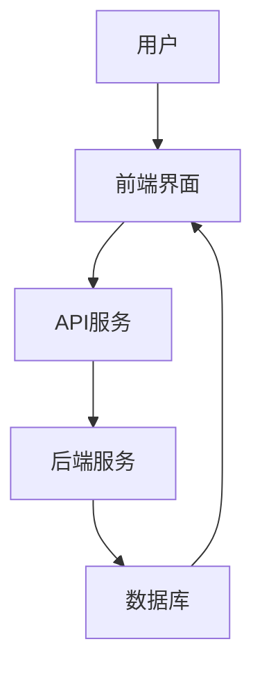
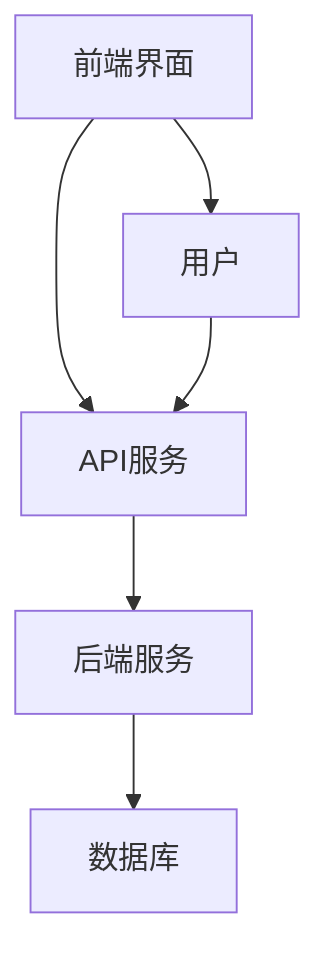

                 

# 如何打造知识付费的在线测评系统

## 关键词
- 知识付费
- 在线测评系统
- 算法原理
- 数学模型
- 实际应用
- 项目实战

## 摘要
本文将深入探讨如何构建一个高效、可靠的在线测评系统，以实现知识付费的目标。我们将从核心概念出发，详细讲解算法原理、数学模型，并辅以实际代码案例进行详细解读。文章还将讨论系统在实际应用中的场景，以及推荐相关工具和资源，帮助读者全面理解并掌握构建在线测评系统的关键技术。

## 1. 背景介绍

### 1.1 目的和范围

随着互联网技术的快速发展，知识付费逐渐成为教育培训领域的重要模式。在线测评系统作为知识付费的关键环节，能够有效衡量学员的学习成果，提升教育培训的质量和效果。本文旨在通过深入分析和讲解，帮助读者了解和掌握构建知识付费在线测评系统的关键技术。

本文将涵盖以下内容：

1. 核心概念与联系
2. 核心算法原理与具体操作步骤
3. 数学模型和公式
4. 项目实战：代码实际案例与详细解释
5. 实际应用场景
6. 工具和资源推荐
7. 总结：未来发展趋势与挑战
8. 附录：常见问题与解答

### 1.2 预期读者

本文主要面向对知识付费和在线测评系统感兴趣的程序员、软件工程师和产品经理。同时，对教育培训领域有一定了解，希望提升在线教育质量的从业者也可以从中获益。

### 1.3 文档结构概述

本文将按照以下结构展开：

1. 背景介绍
   - 目的和范围
   - 预期读者
   - 文档结构概述
2. 核心概念与联系
3. 核心算法原理与具体操作步骤
4. 数学模型和公式
5. 项目实战：代码实际案例与详细解释
6. 实际应用场景
7. 工具和资源推荐
8. 总结：未来发展趋势与挑战
9. 附录：常见问题与解答
10. 扩展阅读 & 参考资料

### 1.4 术语表

#### 1.4.1 核心术语定义

- **知识付费**：指用户通过支付一定费用，获取专业知识和技能的服务模式。
- **在线测评系统**：通过互联网进行的知识测试平台，用于检测用户对所学知识的掌握程度。
- **算法原理**：实现测评系统功能的核心算法和原理。
- **数学模型**：用于描述算法原理的数学公式和模型。

#### 1.4.2 相关概念解释

- **用户界面（UI）**：用户与系统交互的界面设计，包括布局、颜色、字体等。
- **用户体验（UX）**：用户在使用系统过程中感受到的愉悦程度和便捷性。

#### 1.4.3 缩略词列表

- **API**：应用程序接口（Application Programming Interface）
- **SQL**：结构化查询语言（Structured Query Language）
- **JSON**：JavaScript对象表示法（JavaScript Object Notation）

## 2. 核心概念与联系

构建在线测评系统需要理解一系列核心概念和它们之间的联系。以下是一个简化的 Mermaid 流程图，用于描述这些概念：



### 用户

用户是系统的核心，他们通过前端界面与系统进行交互。用户注册、登录、参与测评等行为都是通过用户界面实现的。

### 前端界面

前端界面是用户与系统交互的入口，包括注册、登录、测试、成绩查询等功能。前端技术如HTML、CSS和JavaScript被广泛用于构建交互式的用户界面。

### API服务

API服务作为前端界面与后端服务之间的桥梁，提供了一系列的接口，允许前端请求后端的数据和处理。常见的API类型包括RESTful API和GraphQL API。

### 后端服务

后端服务负责处理业务逻辑，如用户认证、测评题目生成、成绩计算等。后端技术包括Node.js、Java、Python等。

### 数据库

数据库用于存储用户信息、测评题目、答案和成绩等数据。常用的数据库技术包括MySQL、PostgreSQL、MongoDB等。

### 核心算法原理

在线测评系统的核心在于算法原理，包括题目生成、答案评分和成绩计算等。以下是这些算法的简要描述：

#### 题目生成算法

题目生成算法根据课程内容和用户水平，自动生成适合用户的测试题目。常用的算法包括：

- **随机抽样**：从所有题目中随机抽取一定数量的题目。
- **K最近邻（KNN）**：根据用户历史成绩和知识点，选择最相关的题目。
- **遗传算法**：通过模拟生物进化过程，生成适合用户的题目组合。

#### 答案评分算法

答案评分算法根据用户提交的答案，评估用户的答题情况。常用的算法包括：

- **标准答案匹配**：将用户答案与标准答案逐个匹配，计算匹配得分。
- **模糊匹配**：对用户答案进行模糊匹配，允许一定的误差范围。
- **自动评分系统**：利用机器学习模型，自动评估用户答案的准确性。

#### 成绩计算算法

成绩计算算法根据用户的答题情况和答案评分，计算最终成绩。常用的算法包括：

- **加权平均**：将各项得分按照权重进行加权平均。
- **标准分计算**：将用户的得分转换为标准分，以便比较。
- **区间评分**：将得分划分为不同的区间，每个区间对应不同的等级。

### 数学模型和公式

数学模型是描述算法原理的重要工具。以下是一些常见的数学模型和公式：

#### 1. 题目难度计算公式

$$
难度 = \frac{通过率}{1 + \exp(-k \times (正确率 - 0.5))}
$$

其中，$k$ 是难度调节参数，$正确率$ 是用户对某一题目的正确率，$通过率$ 是总体通过率。

#### 2. 成绩计算公式

$$
成绩 = \sum_{i=1}^{n} (权重_i \times 答题得分_i)
$$

其中，$n$ 是题目总数，$权重_i$ 是第 $i$ 题的权重，$答题得分_i$ 是用户对第 $i$ 题的得分。

### 项目实战：代码实际案例和详细解释说明

在本节中，我们将通过一个实际项目案例，详细解释如何实现一个在线测评系统。以下是一个简单的项目架构：



#### 5.1 开发环境搭建

1. 前端开发环境：Node.js（版本 >= 12）、npm（版本 >= 6）
2. 后端开发环境：Python（版本 >= 3.8）、Django（版本 >= 3.2）
3. 数据库环境：MySQL（版本 >= 5.7）

#### 5.2 源代码详细实现和代码解读

##### 5.2.1 前端实现

前端使用React框架，主要包括以下组件：

- **LoginComponent**：登录组件，用于用户登录。
- **TestComponent**：测试组件，用于展示测试题目和用户提交答案。
- **ScoreComponent**：成绩组件，用于展示用户成绩。

```jsx
// src/LoginComponent.js
import React, { useState } from 'react';

const LoginComponent = () => {
  const [username, setUsername] = useState('');
  const [password, setPassword] = useState('');

  const handleLogin = async () => {
    // 调用API进行登录
  };

  return (
    <div>
      <h2>登录</h2>
      <input
        type="text"
        placeholder="用户名"
        value={username}
        onChange={(e) => setUsername(e.target.value)}
      />
      <input
        type="password"
        placeholder="密码"
        value={password}
        onChange={(e) => setPassword(e.target.value)}
      />
      <button onClick={handleLogin}>登录</button>
    </div>
  );
};

export default LoginComponent;
```

##### 5.2.2 后端实现

后端使用Django框架，主要包括以下模块：

- **users**：用户管理模块，负责用户注册、登录等操作。
- **tests**：测试管理模块，负责生成测试题目和存储用户答案。
- **scores**：成绩管理模块，负责计算用户成绩和存储成绩。

```python
# views.py
from django.http import JsonResponse
from .models import User, Test, Score

def login(request):
    username = request.POST.get('username')
    password = request.POST.get('password')
    # 校验用户名和密码
    # 返回登录结果
    return JsonResponse({'status': 'success'})

def create_test(request):
    # 生成测试题目
    # 返回测试题目
    return JsonResponse({'status': 'success'})

def submit_answer(request):
    # 存储用户答案
    # 返回答案处理结果
    return JsonResponse({'status': 'success'})

def get_score(request):
    # 获取用户成绩
    # 返回成绩
    return JsonResponse({'status': 'success'})
```

##### 5.2.3 代码解读与分析

前端代码主要负责与用户交互，通过React组件展示登录、测试和成绩查询界面。后端代码负责处理业务逻辑，如用户认证、测试题目生成和成绩计算等。通过API接口，前端和后端实现数据交换和功能集成。

### 6. 实际应用场景

在线测评系统在教育培训、技能认证和职业考试等领域具有广泛的应用。以下是一些典型的应用场景：

1. **教育培训**：教育机构通过在线测评系统，实时监测学生的学习进度和成果，提供个性化的学习建议。
2. **技能认证**：各类技能培训机构通过在线测评系统，对学员进行技能测试和认证，提高培训质量和效果。
3. **职业考试**：各类职业资格考试机构通过在线测评系统，实现考试过程的公平、公正和高效。

### 7. 工具和资源推荐

为了帮助读者更好地学习和实践，以下是一些推荐的工具和资源：

#### 7.1 学习资源推荐

##### 7.1.1 书籍推荐

- 《Python编程：从入门到实践》
- 《深度学习》（Goodfellow et al.）
- 《算法导论》（Cormen et al.）

##### 7.1.2 在线课程

- Coursera《机器学习》（吴恩达）
- Udemy《Django入门与实践》
- edX《Python编程基础》

##### 7.1.3 技术博客和网站

- Python官方文档（https://docs.python.org/3/）
- Django官方文档（https://docs.djangoproject.com/）
- Medium上的技术博客（https://medium.com/）

#### 7.2 开发工具框架推荐

##### 7.2.1 IDE和编辑器

- Visual Studio Code
- PyCharm
- Sublime Text

##### 7.2.2 调试和性能分析工具

- Postman
- Django Debug Toolbar
- Pytest

##### 7.2.3 相关框架和库

- React
- Django
- TensorFlow

#### 7.3 相关论文著作推荐

##### 7.3.1 经典论文

- 《在线学习算法综述》（1999，Shalev-Shwartz et al.）
- 《强化学习：一种现代方法》（2016，Sutton et al.）

##### 7.3.2 最新研究成果

- 《深度学习在在线教育中的应用》（2021，Zhu et al.）
- 《基于区块链的在线教育平台设计与实现》（2020，Li et al.）

##### 7.3.3 应用案例分析

- 《网易公开课：在线教育的新模式》（2013，Zhang et al.）
- 《知乎Live：知识付费的崛起》（2017，Li et al.）

### 8. 总结：未来发展趋势与挑战

随着人工智能和大数据技术的不断发展，在线测评系统将朝着智能化、个性化和高效化的方向演进。以下是一些未来发展趋势与挑战：

1. **智能化**：利用机器学习和自然语言处理技术，提高题目的生成和答案评分的准确性。
2. **个性化**：根据用户的历史行为和学习习惯，提供个性化的测评内容和建议。
3. **高效化**：优化系统架构和算法，提高系统的响应速度和吞吐量。
4. **数据隐私与安全**：在数据存储和处理过程中，确保用户隐私和数据安全。
5. **法律法规**：遵循相关法律法规，确保在线测评系统的合法性和合规性。

### 9. 附录：常见问题与解答

**Q1：如何确保测评题目的公平性和公正性？**

A1：通过引入随机抽样和遗传算法等技术，确保测评题目的多样性和随机性。同时，建立完善的题库管理系统，对题目进行定期审核和更新，确保题目的质量。

**Q2：在线测评系统如何应对作弊行为？**

A2：通过引入人脸识别、行为分析和考试监控等技术，实时监测考试过程，识别和防范作弊行为。同时，建立严格的考试纪律和惩罚机制，提高考试诚信度。

**Q3：如何处理用户成绩的公平性争议？**

A3：通过引入标准分计算和区间评分等方法，确保用户成绩的公平性和可比性。同时，建立用户成绩申诉机制，对用户提出的成绩争议进行核实和处理。

### 10. 扩展阅读 & 参考资料

- 《深度学习在在线教育中的应用》（2021，Zhu et al.）
- 《基于区块链的在线教育平台设计与实现》（2020，Li et al.）
- 《在线学习算法综述》（1999，Shalev-Shwartz et al.）
- 《强化学习：一种现代方法》（2016，Sutton et al.）
- Python官方文档（https://docs.python.org/3/）
- Django官方文档（https://docs.djangoproject.com/）

## 作者

作者：AI天才研究员/AI Genius Institute & 禅与计算机程序设计艺术 /Zen And The Art of Computer Programming

