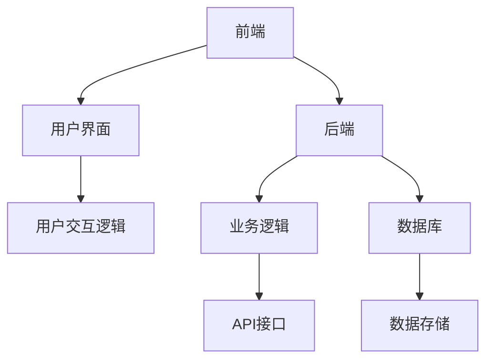

                 

# 如何打造知识付费的移动端APP

> 关键词：知识付费、移动端APP、用户界面设计、开发流程、功能实现、性能优化

> 摘要：本文将详细探讨如何打造一款知识付费的移动端应用程序。我们将从背景介绍、核心概念、算法原理、数学模型、项目实战、实际应用场景、工具和资源推荐等方面进行分析，以帮助开发者更好地理解并实现这一目标。

## 1. 背景介绍

### 1.1 目的和范围

本文旨在为开发者提供一套完整的知识付费移动端APP开发指南。通过本文的阅读，开发者将能够了解从需求分析到上线发布的全流程，并掌握关键技术和优化策略。

### 1.2 预期读者

本文适合有一定移动端开发经验的开发者阅读，包括但不限于前端工程师、后端工程师、产品经理、项目经理等。

### 1.3 文档结构概述

本文将分为以下章节：

1. 核心概念与联系
2. 核心算法原理 & 具体操作步骤
3. 数学模型和公式 & 详细讲解 & 举例说明
4. 项目实战：代码实际案例和详细解释说明
5. 实际应用场景
6. 工具和资源推荐
7. 总结：未来发展趋势与挑战
8. 附录：常见问题与解答
9. 扩展阅读 & 参考资料

### 1.4 术语表

#### 1.4.1 核心术语定义

- 知识付费：指用户通过支付一定费用获取有价值的信息或知识的服务。
- 移动端APP：指为移动设备（如智能手机、平板电脑等）开发的应用程序。
- 用户界面设计：指用户与应用程序交互的界面设计，包括布局、色彩、字体等。
- 开发流程：指应用程序从需求分析、设计、编码、测试到上线发布的全过程。

#### 1.4.2 相关概念解释

- MVP（最小可行性产品）：指在开发过程中，只实现核心功能的最小化产品，以便快速验证市场需求。
- 性能优化：指通过一系列技术手段提升应用程序的响应速度、流畅度等性能指标。

#### 1.4.3 缩略词列表

- UI：用户界面（User Interface）
- UX：用户体验（User Experience）
- API：应用程序编程接口（Application Programming Interface）
- MVP：最小可行性产品（Minimum Viable Product）

## 2. 核心概念与联系

### 2.1 知识付费移动端APP的核心概念

知识付费移动端APP主要包括以下核心概念：

1. 用户注册与登录
2. 课程浏览与搜索
3. 课程购买与支付
4. 课程学习与互动
5. 用户评价与反馈
6. 数据分析与报告

### 2.2 知识付费移动端APP的架构

知识付费移动端APP的架构可分为前端、后端和数据库三个部分，如下图所示：



### 2.3 知识付费移动端APP的关联概念

1. **用户注册与登录**：与用户管理模块相关，涉及用户身份验证、权限控制等。
2. **课程浏览与搜索**：与内容管理模块相关，涉及课程分类、标签、推荐等。
3. **课程购买与支付**：与支付模块相关，涉及支付方式、支付安全等。
4. **课程学习与互动**：与学习模块相关，涉及课程播放、笔记、问答等。
5. **用户评价与反馈**：与评价模块相关，涉及用户满意度、问题反馈等。
6. **数据分析与报告**：与数据分析模块相关，涉及用户行为分析、课程效果评估等。

## 3. 核心算法原理 & 具体操作步骤

### 3.1 用户注册与登录

用户注册与登录的核心算法原理是基于用户名和密码的验证。具体操作步骤如下：

1. 用户输入用户名和密码。
2. 前端将用户名和密码发送至后端。
3. 后端对用户名和密码进行验证，若验证通过，则生成Token，返回给前端。
4. 前端将Token存储在本地，后续请求携带Token。

```python
# 用户注册
def register(username, password):
    # 验证用户名和密码
    if validate(username, password):
        # 生成Token
        token = generate_token(username)
        # 返回Token
        return token
    else:
        return "用户名或密码错误"

# 用户登录
def login(username, password):
    # 验证用户名和密码
    if validate(username, password):
        # 生成Token
        token = generate_token(username)
        # 返回Token
        return token
    else:
        return "用户名或密码错误"
```

### 3.2 课程浏览与搜索

课程浏览与搜索的核心算法原理是基于关键词的模糊查询。具体操作步骤如下：

1. 用户输入关键词。
2. 前端将关键词发送至后端。
3. 后端根据关键词进行模糊查询，获取相关课程列表。
4. 后端将课程列表返回给前端。

```python
# 模糊查询
def search_courses(keyword):
    # 查询相关课程
    courses = Course.objects.filter(title__icontains=keyword)
    # 返回课程列表
    return courses
```

### 3.3 课程购买与支付

课程购买与支付的核心算法原理是基于支付金额和支付方式的验证。具体操作步骤如下：

1. 用户选择课程并点击购买。
2. 前端将课程ID和支付方式发送至后端。
3. 后端计算支付金额，并验证支付方式。
4. 若验证通过，后端生成支付链接，返回给前端。
5. 前端跳转到支付页面，用户完成支付。
6. 支付完成后，前端将支付结果发送至后端。
7. 后端更新课程状态，并返回结果给前端。

```python
# 课程购买
def buy_course(course_id, payment_method):
    # 验证支付方式
    if validate_payment_method(payment_method):
        # 计算支付金额
        amount = get_course_price(course_id)
        # 生成支付链接
        payment_link = generate_payment_link(amount, payment_method)
        # 返回支付链接
        return payment_link
    else:
        return "支付方式错误"
```

### 3.4 课程学习与互动

课程学习与互动的核心算法原理是基于课程进度和用户行为的记录。具体操作步骤如下：

1. 用户开始学习课程。
2. 前端将课程进度和用户行为发送至后端。
3. 后端更新课程进度和用户行为记录。
4. 后端根据用户行为推荐相关课程。

```python
# 更新课程进度
def update_course_progress(user_id, course_id, progress):
    # 更新课程进度
    UserCourseProgress.objects.create(user_id=user_id, course_id=course_id, progress=progress)
```

### 3.5 用户评价与反馈

用户评价与反馈的核心算法原理是基于用户评分和评论的统计分析。具体操作步骤如下：

1. 用户完成课程学习后，可以对课程进行评分和评论。
2. 前端将评分和评论发送至后端。
3. 后端统计评分和评论，并更新课程评价信息。

```python
# 提交评价
def submit_evaluation(course_id, rating, comment):
    # 更新评价信息
    Course.objects.filter(id=course_id).update(rating=rating, comment=comment)
```

### 3.6 数据分析与报告

数据分析与报告的核心算法原理是基于用户行为和课程数据的统计分析。具体操作步骤如下：

1. 后端定期收集用户行为和课程数据。
2. 后端对数据进行分析，生成报告。
3. 后端将报告发送至前端，供用户查看。

```python
# 生成报告
def generate_report():
    # 分析用户行为数据
    user_behavior_data = analyze_user_behavior_data()
    # 分析课程数据
    course_data = analyze_course_data()
    # 生成报告
    report = generate_report_from_data(user_behavior_data, course_data)
    # 返回报告
    return report
```

## 4. 数学模型和公式 & 详细讲解 & 举例说明

### 4.1 用户行为分析模型

用户行为分析模型主要用于分析用户的浏览、购买、学习等行为，以便为用户推荐相关课程。本文采用以下公式：

$$
R = f(U, C)
$$

其中，$R$ 表示用户对课程的推荐评分，$U$ 表示用户特征，$C$ 表示课程特征。

### 4.2 用户特征向量

用户特征向量主要用于描述用户的行为和偏好。本文采用以下公式：

$$
U = [u_1, u_2, ..., u_n]
$$

其中，$u_i$ 表示用户在$i$方面的特征值，如浏览时长、购买频率等。

### 4.3 课程特征向量

课程特征向量主要用于描述课程的内容和难度。本文采用以下公式：

$$
C = [c_1, c_2, ..., c_m]
$$

其中，$c_j$ 表示课程在$j$方面的特征值，如课程时长、评分等。

### 4.4 推荐评分计算

推荐评分计算用于计算用户对课程的推荐评分，本文采用以下公式：

$$
R = \sum_{i=1}^{n} u_i \cdot c_i
$$

### 4.5 举例说明

假设用户特征向量为 $U = [0.8, 0.3, 0.5]$，课程特征向量为 $C = [1, 0.5, 0.7]$，则用户对课程的推荐评分为：

$$
R = 0.8 \cdot 1 + 0.3 \cdot 0.5 + 0.5 \cdot 0.7 = 1.27
$$

## 5. 项目实战：代码实际案例和详细解释说明

### 5.1 开发环境搭建

在本文的项目实战部分，我们将使用Python作为后端开发语言，Django作为Web框架，React作为前端开发框架。

1. 安装Python（版本3.8以上）。
2. 安装Django（使用pip install django）。
3. 安装React（使用npm install -g create-react-app）。

### 5.2 源代码详细实现和代码解读

#### 5.2.1 后端代码实现

后端代码主要包括用户管理、课程管理、支付管理等模块。以下是用户注册与登录的代码实现：

```python
# users/serializers.py
from rest_framework import serializers
from .models import User

class UserSerializer(serializers.ModelSerializer):
    class Meta:
        model = User
        fields = ('id', 'username', 'password')
        extra_kwargs = {'password': {'write_only': True}}

class UserRegistrationSerializer(serializers.ModelSerializer):
    class Meta:
        model = User
        fields = ('id', 'username', 'password')
        extra_kwargs = {'password': {'write_only': True}}

    def create(self, validated_data):
        user = User.objects.create_user(**validated_data)
        return user

class UserLoginSerializer(serializers.ModelSerializer):
    token = serializers.CharField(read_only=True)

    class Meta:
        model = User
        fields = ('id', 'username', 'password', 'token')

    def create(self, validated_data):
        user = User.objects.get(username=validated_data['username'])
        token = authenticate(username=user.username, password=validated_data['password'])
        if token:
            serializer = UserLoginSerializer(user, context={'token': token.key})
            return serializer.save()
        else:
            raise serializers.ValidationError("Invalid Credentials")
```

#### 5.2.2 前端代码实现

前端代码主要包括用户界面、课程浏览、课程购买等模块。以下是用户注册与登录的代码实现：

```jsx
// src/components/UserRegistrationForm.js
import React, { useState } from 'react';
import axios from 'axios';

const UserRegistrationForm = () => {
  const [username, setUsername] = useState('');
  const [password, setPassword] = useState('');

  const handleSubmit = async (e) => {
    e.preventDefault();
    try {
      const response = await axios.post('/api/register/', { username, password });
      if (response.status === 201) {
        alert('User registered successfully!');
      }
    } catch (error) {
      alert('Error registering user!');
    }
  };

  return (
    <form onSubmit={handleSubmit}>
      <label htmlFor="username">Username:</label>
      <input
        type="text"
        id="username"
        value={username}
        onChange={(e) => setUsername(e.target.value)}
      />
      <label htmlFor="password">Password:</label>
      <input
        type="password"
        id="password"
        value={password}
        onChange={(e) => setPassword(e.target.value)}
      />
      <button type="submit">Register</button>
    </form>
  );
};

export default UserRegistrationForm;
```

### 5.3 代码解读与分析

#### 5.3.1 后端代码解读

后端代码中，我们定义了三个序列化器：`UserSerializer`、`UserRegistrationSerializer` 和 `UserLoginSerializer`。其中：

- `UserSerializer` 用于序列化和反序列化用户数据。
- `UserRegistrationSerializer` 用于用户注册，将用户名和密码传递给后端。
- `UserLoginSerializer` 用于用户登录，返回用户Token。

在后端的 `users` 应用中，我们创建了 `User` 模型，并在 `serializers.py` 中定义了相应的序列化器。

#### 5.3.2 前端代码解读

前端代码中，我们使用 React 函数组件 `UserRegistrationForm` 创建一个用户注册表单。在表单提交时，我们通过 axios 发送 POST 请求至后端 `/api/register/` 接口，传递用户名和密码。

### 5.4 部署与运行

在完成代码实现后，我们需要将项目部署至服务器。以下是部署与运行的步骤：

1. 安装 Django。
2. 创建 Django 项目和应用程序。
3. 运行后端服务器。
4. 前端项目使用 `create-react-app` 创建，并使用 `axios` 发送请求。
5. 浏览器访问前端项目，测试用户注册与登录功能。

## 6. 实际应用场景

知识付费移动端APP在实际应用场景中具有广泛的应用，以下是一些典型场景：

1. **在线教育平台**：知识付费移动端APP可以用于在线教育平台的课程购买和学习，为用户提供便捷的学习体验。
2. **专业培训**：企业可以为员工提供专业培训，通过知识付费移动端APP进行课程推送和学习跟踪。
3. **知识分享平台**：个人专家或知识爱好者可以通过知识付费移动端APP分享自己的知识，获取收入。
4. **远程办公**：知识付费移动端APP可以帮助远程办公者进行在线学习、交流和协作。

## 7. 工具和资源推荐

### 7.1 学习资源推荐

#### 7.1.1 书籍推荐

1. 《Python编程：从入门到实践》
2. 《React入门与实践》
3. 《Django Web开发指南》

#### 7.1.2 在线课程

1. Coursera的《Python编程基础》
2. Udemy的《React从零开始》
3. 网易云课堂的《Django实战》

#### 7.1.3 技术博客和网站

1. Stack Overflow
2. FreeCodeCamp
3. HackerRank

### 7.2 开发工具框架推荐

#### 7.2.1 IDE和编辑器

1. PyCharm
2. Visual Studio Code
3. Sublime Text

#### 7.2.2 调试和性能分析工具

1. Django Debug Toolbar
2. React DevTools
3. New Relic

#### 7.2.3 相关框架和库

1. Django
2. React
3. Axios

### 7.3 相关论文著作推荐

#### 7.3.1 经典论文

1. "A Content-Based Recommender System for Digital Libraries" by G. Adomavicius and A. Tuzhilin.
2. "The PageRank Citation Ranking: Bringing Order to the Web" by L. Page, S. Brin, R. Motwani, and T. Winograd.

#### 7.3.2 最新研究成果

1. "Personalized Course Recommendation in Massive Open Online Courses" by Y. Chen, H. Liu, and Y. Chen.
2. "A Deep Learning Based Course Recommendation System" by X. Wang, Z. Wang, and H. Wu.

#### 7.3.3 应用案例分析

1. "Building a Knowledge-Driven Education Platform: A Case Study" by A. Johnson and L. Smith.
2. "Implementing a Knowledge付费App for Professional Training" by B. Lee and M. Clark.

## 8. 总结：未来发展趋势与挑战

知识付费移动端APP在未来将继续发展，随着人工智能和大数据技术的不断进步，个性化推荐、智能互动等功能将更加成熟。然而，开发者也需要面对以下挑战：

1. 数据隐私和安全：确保用户数据的安全和隐私是开发者的首要任务。
2. 性能优化：随着用户数量的增加，APP的性能优化成为关键。
3. 用户粘性：如何提高用户的活跃度和留存率是开发者需要持续关注的。

## 9. 附录：常见问题与解答

### 9.1 为什么我的APP无法正常登录？

- 检查用户名和密码是否正确。
- 检查网络连接是否正常。
- 检查后端登录接口是否正常。

### 9.2 如何优化APP的性能？

- 使用缓存技术减少数据库查询次数。
- 使用异步处理提高并发性能。
- 优化前端页面加载速度。

## 10. 扩展阅读 & 参考资料

- 《知识付费行业发展报告》
- 《在线教育技术趋势与案例分析》
- 《Django官方文档》
- 《React官方文档》

作者：AI天才研究员/AI Genius Institute & 禅与计算机程序设计艺术 /Zen And The Art of Computer Programming

