                 

# 如何打造高复购率的会员体系

> 关键词：会员体系、用户留存、复购率、用户激励、数据分析、用户体验

> 摘要：本文将探讨如何通过设计有效的会员体系来提高用户的复购率，通过分析用户行为、制定合理的会员等级、提供丰富的增值服务以及利用数据分析工具等手段，为企业实现用户粘性增长提供策略指导。

## 1. 背景介绍

### 1.1 目的和范围

本文旨在为从事电子商务、在线服务和零售行业的IT专业人士提供一套系统化的方法，以设计并实施一个能够提高用户复购率的高效会员体系。文章将涵盖会员体系的核心理念、构建步骤、关键因素以及实战案例，帮助读者理解和掌握打造高复购率会员体系的核心技巧。

### 1.2 预期读者

本文预期读者为以下几类人群：
1. E-commerce平台和在线服务提供商的技术和管理人员；
2. 独立开发者和技术创业公司；
3. 对会员体系设计感兴趣的学术研究人员。

### 1.3 文档结构概述

本文结构如下：
1. **背景介绍**：阐述会员体系的重要性及文章目的和结构；
2. **核心概念与联系**：介绍会员体系的相关概念和架构；
3. **核心算法原理 & 具体操作步骤**：讲解会员体系的算法原理和操作步骤；
4. **数学模型和公式 & 详细讲解 & 举例说明**：应用数学模型解释会员体系的关键要素；
5. **项目实战：代码实际案例和详细解释说明**：通过实际案例展示会员体系的实施过程；
6. **实际应用场景**：分析会员体系在不同业务场景中的应用；
7. **工具和资源推荐**：推荐相关学习资源和开发工具；
8. **总结：未来发展趋势与挑战**：总结会员体系的发展趋势和面临的挑战；
9. **附录：常见问题与解答**：回答常见问题，提供进一步的支持；
10. **扩展阅读 & 参考资料**：提供进一步学习和研究的资源。

### 1.4 术语表

#### 1.4.1 核心术语定义

- **会员体系**：一种通过提供不同等级的会员服务和权益，激励用户持续消费和参与的活动体系。
- **用户留存**：用户在一定时间内持续使用某一产品的比例。
- **复购率**：用户在一段时间内再次购买相同或类似产品的比例。
- **用户激励**：通过提供奖励、优惠等方式，提高用户参与度和忠诚度。

#### 1.4.2 相关概念解释

- **用户行为分析**：通过对用户行为数据的收集和分析，了解用户需求和使用习惯。
- **会员等级**：根据用户消费金额、参与度等指标，将用户分为不同等级，提供相应的服务和权益。
- **增值服务**：为会员提供的额外服务或产品，如专属客服、会员专享活动等。

#### 1.4.3 缩略词列表

- **CRM**：Customer Relationship Management，客户关系管理；
- **KPI**：Key Performance Indicator，关键绩效指标；
- **RFM**：Recency, Frequency, Monetary，最近一次消费时间、消费频率、消费金额。

## 2. 核心概念与联系

会员体系的成功构建需要理解一系列核心概念及其相互关系。以下是会员体系的关键概念及其在体系中的位置：

### 2.1 用户行为分析

用户行为分析是会员体系构建的基础。通过分析用户的行为数据，如购买频率、消费金额、浏览习惯等，企业可以深入了解用户需求，从而为会员体系的定制提供依据。

### 2.2 会员等级

会员等级是会员体系的核心。根据用户的行为数据，将用户分为不同的等级，如普通会员、银牌会员、金牌会员等，每个等级享有不同的权益和服务。

### 2.3 用户激励

用户激励是维持会员体系活跃度的关键。通过提供优惠券、积分、专属活动等激励手段，企业可以增加用户的参与度和忠诚度。

### 2.4 数据分析与会员等级的关系

会员等级的设置和调整需要基于数据分析的结果。通过分析用户的消费行为、留存率、参与度等数据，企业可以不断优化会员等级体系，提高用户的复购率。

### 2.5 会员等级与用户激励的关系

会员等级和用户激励是相辅相成的。高等级会员通常享有更多的激励措施，这不仅可以增强用户的忠诚度，还可以激励用户提升自己的等级，从而促进复购。

### 2.6 会员等级与用户留存的关系

会员等级有助于提高用户留存率。通过为用户提供更具吸引力的服务和权益，企业可以降低用户的流失率，提高用户的持续使用率。

### 2.7 数据分析与用户激励的关系

数据分析可以帮助企业了解用户对激励措施的反馈。通过分析用户的参与度和复购率，企业可以调整激励措施，提高其效果。

### 2.8 用户激励与用户留存的关系

有效的用户激励可以显著提高用户的留存率。通过持续的用户激励，企业可以增加用户的粘性，降低流失率。

### 2.9 会员等级与用户激励的动态调整

会员等级和用户激励不是一成不变的。企业需要根据用户行为和市场需求，动态调整会员等级和激励措施，以保持会员体系的活力和吸引力。

### 2.10 数据分析与会员体系优化的关系

数据分析是会员体系优化的重要手段。通过定期分析会员数据，企业可以发现问题，及时调整会员体系，提高用户体验和复购率。

### 2.11 会员体系与整体业务战略的关系

会员体系是整体业务战略的重要组成部分。通过有效的会员体系，企业可以实现用户增长、提高用户价值，从而实现业务增长和盈利目标。

### 2.12 用户反馈与会员体系的持续优化

用户的反馈是会员体系持续优化的重要依据。通过收集用户的反馈，企业可以了解用户的需求和痛点，不断优化会员体系，提高用户满意度。

### 2.13 数据分析与用户体验的关系

数据分析可以帮助企业了解用户体验。通过分析用户的反馈和使用行为，企业可以优化产品和服务，提高用户体验，从而增强用户忠诚度。

### 2.14 用户激励与用户体验的关系

有效的用户激励可以提高用户体验。通过提供个性化的奖励和优惠，企业可以增加用户的满意度和参与度，从而提高用户留存率和复购率。

### 2.15 会员体系与市场竞争的关系

会员体系是企业在市场竞争中的利器。通过打造独特的会员体系，企业可以增强品牌竞争力，吸引更多用户，从而在市场中占据有利地位。

### 2.16 数据分析与市场趋势的关系

数据分析可以帮助企业了解市场趋势。通过分析市场数据，企业可以及时调整战略和会员体系，以适应市场变化，抓住市场机会。

### 2.17 用户行为与市场趋势的关系

用户行为是市场趋势的重要体现。通过分析用户行为数据，企业可以了解市场趋势，从而制定更有针对性的营销策略和会员体系。

### 2.18 会员体系与品牌建设的关系

会员体系是品牌建设的重要环节。通过有效的会员体系，企业可以提升品牌形象，增强用户对品牌的认同和忠诚度，从而推动品牌价值的提升。

### 2.19 用户激励与品牌建设的关系

用户激励是品牌建设的重要手段。通过提供优质的会员服务和激励措施，企业可以提升品牌形象，增强用户对品牌的认可和信任。

### 2.20 会员体系与用户生命周期管理的关系

会员体系是用户生命周期管理的重要组成部分。通过合理的会员体系，企业可以实现用户的留存、增长和转化，从而实现用户生命周期的全周期管理。

### 2.21 用户激励与用户生命周期管理的关系

用户激励是用户生命周期管理的重要手段。通过有效的激励措施，企业可以延长用户的生命周期，提高用户的复购率和忠诚度。

### 2.22 数据分析在会员体系中的应用

数据分析在会员体系中具有广泛的应用。通过数据分析，企业可以实现会员等级的动态调整、用户激励的个性化定制、用户体验的持续优化等，从而提高会员体系的整体效果。

### 2.23 会员体系与业务流程优化的关系

会员体系是业务流程优化的重要一环。通过构建高效的会员体系，企业可以优化业务流程，提高运营效率，降低成本。

### 2.24 用户反馈与业务流程优化的关系

用户反馈是业务流程优化的重要依据。通过收集和分析用户反馈，企业可以发现问题，优化业务流程，提高用户体验和满意度。

### 2.25 会员体系与客户服务的的关系

会员体系是客户服务的重要工具。通过会员体系，企业可以提供更优质的客户服务，增强用户满意度，提升客户忠诚度。

### 2.26 用户激励与客户服务的关系

用户激励是客户服务的重要手段。通过提供个性化的奖励和优惠，企业可以增强用户满意度，提高用户忠诚度。

### 2.27 会员体系与客户体验的关系

会员体系是客户体验的重要组成部分。通过提供优质的会员服务和权益，企业可以提升客户体验，增强用户对品牌的认同和忠诚度。

### 2.28 用户行为分析在会员体系中的应用

用户行为分析是会员体系设计的关键。通过分析用户行为数据，企业可以了解用户需求，制定有针对性的会员策略，提高用户参与度和忠诚度。

### 2.29 数据分析在会员体系优化中的应用

数据分析是会员体系优化的重要工具。通过定期分析会员数据，企业可以发现问题，及时调整会员体系，提高用户体验和复购率。

### 2.30 用户激励与复购率的关系

用户激励是提高复购率的有效手段。通过提供个性化的奖励和优惠，企业可以增强用户的购买意愿，提高复购率。

### 2.31 会员体系与用户价值的关系

会员体系是提升用户价值的重要途径。通过提供优质的会员服务和权益，企业可以增加用户的消费频次和金额，从而提高用户价值。

### 2.32 用户激励与用户价值的关系

用户激励是提升用户价值的重要手段。通过提供个性化的奖励和优惠，企业可以增强用户的消费体验，提高用户满意度和忠诚度。

### 2.33 会员体系与用户体验的关系

会员体系是影响用户体验的重要因素。通过提供优质的会员服务和权益，企业可以提升用户体验，增强用户满意度和忠诚度。

### 2.34 用户行为分析与用户体验的关系

用户行为分析是提升用户体验的关键。通过分析用户行为数据，企业可以了解用户需求和痛点，优化产品和服务，提高用户体验。

### 2.35 会员体系与用户增长的关系

会员体系是促进用户增长的重要手段。通过提供有吸引力的会员服务和权益，企业可以吸引更多用户，促进用户增长。

### 2.36 用户激励与用户增长的关系

用户激励是促进用户增长的有效手段。通过提供个性化的奖励和优惠，企业可以增强用户的参与度和忠诚度，促进用户增长。

### 2.37 会员体系与用户留存的关系

会员体系是提高用户留存率的重要途径。通过提供优质的会员服务和权益，企业可以降低用户的流失率，提高用户留存率。

### 2.38 用户激励与用户留存的关系

用户激励是提高用户留存率的有效手段。通过提供个性化的奖励和优惠，企业可以增强用户的忠诚度和满意度，提高用户留存率。

### 2.39 会员体系与用户生命周期管理的关系

会员体系是用户生命周期管理的重要组成部分。通过提供有针对性的会员服务和权益，企业可以实现用户的留存、增长和转化，从而实现用户生命周期的全周期管理。

### 2.40 用户激励与用户生命周期管理的关系

用户激励是用户生命周期管理的重要手段。通过提供个性化的奖励和优惠，企业可以延长用户的生命周期，提高用户的复购率和忠诚度。

### 2.41 会员体系与市场竞争力的关系

会员体系是增强市场竞争力的重要工具。通过提供有吸引力的会员服务和权益，企业可以增强品牌竞争力，吸引更多用户，从而在市场中占据有利地位。

### 2.42 用户激励与市场竞争力

用户激励是提升市场竞争力的重要手段。通过提供优质的会员服务和权益，企业可以增强用户满意度和忠诚度，提高品牌知名度和市场份额。

### 2.43 数据分析在会员体系优化中的应用

数据分析是会员体系优化的重要工具。通过定期分析会员数据，企业可以发现问题，及时调整会员体系，提高用户体验和复购率。

### 2.44 用户行为分析与会员体系设计的关系

用户行为分析是会员体系设计的关键。通过分析用户行为数据，企业可以了解用户需求，制定有针对性的会员策略，提高用户参与度和忠诚度。

### 2.45 会员体系与业务战略的关系

会员体系是业务战略的重要组成部分。通过提供有吸引力的会员服务和权益，企业可以实现用户增长、提高用户价值，从而实现业务增长和盈利目标。

### 2.46 用户激励与业务战略的关系

用户激励是业务战略的重要组成部分。通过提供优质的会员服务和权益，企业可以增强用户满意度和忠诚度，提高品牌知名度和市场份额。

### 2.47 用户反馈与会员体系优化的关系

用户反馈是会员体系优化的重要依据。通过收集用户的反馈，企业可以了解用户的需求和痛点，不断优化会员体系，提高用户满意度。

### 2.48 数据分析在会员体系优化中的应用

数据分析是会员体系优化的重要工具。通过定期分析会员数据，企业可以发现问题，及时调整会员体系，提高用户体验和复购率。

### 2.49 会员体系与用户体验的关系

会员体系是影响用户体验的重要因素。通过提供优质的会员服务和权益，企业可以提升用户体验，增强用户满意度和忠诚度。

### 2.50 用户激励与用户体验的关系

用户激励是提升用户体验的有效手段。通过提供个性化的奖励和优惠，企业可以增强用户的消费体验，提高用户满意度和忠诚度。

### 2.51 会员体系与用户价值的关系

会员体系是提升用户价值的重要途径。通过提供优质的会员服务和权益，企业可以增加用户的消费频次和金额，从而提高用户价值。

### 2.52 用户激励与用户价值的关系

用户激励是提升用户价值的重要手段。通过提供个性化的奖励和优惠，企业可以增强用户的消费体验，提高用户满意度和忠诚度。

### 2.53 会员体系与用户增长的关系

会员体系是促进用户增长的重要手段。通过提供有吸引力的会员服务和权益，企业可以吸引更多用户，促进用户增长。

### 2.54 用户激励与用户增长的关系

用户激励是促进用户增长的有效手段。通过提供个性化的奖励和优惠，企业可以增强用户的参与度和忠诚度，促进用户增长。

### 2.55 会员体系与用户留存的关系

会员体系是提高用户留存率的重要途径。通过提供优质的会员服务和权益，企业可以降低用户的流失率，提高用户留存率。

### 2.56 用户激励与用户留存的关系

用户激励是提高用户留存率的有效手段。通过提供个性化的奖励和优惠，企业可以增强用户的忠诚度和满意度，提高用户留存率。

### 2.57 会员体系与用户生命周期管理的关系

会员体系是用户生命周期管理的重要组成部分。通过提供有针对性的会员服务和权益，企业可以实现用户的留存、增长和转化，从而实现用户生命周期的全周期管理。

### 2.58 用户激励与用户生命周期管理的关系

用户激励是用户生命周期管理的重要手段。通过提供个性化的奖励和优惠，企业可以延长用户的生命周期，提高用户的复购率和忠诚度。

### 2.59 会员体系与市场竞争的关系

会员体系是增强市场竞争力的重要工具。通过提供有吸引力的会员服务和权益，企业可以增强品牌竞争力，吸引更多用户，从而在市场中占据有利地位。

### 2.60 用户激励与市场竞争的关系

用户激励是提升市场竞争力的重要手段。通过提供优质的会员服务和权益，企业可以增强用户满意度和忠诚度，提高品牌知名度和市场份额。

### 2.61 数据分析在会员体系中的应用

数据分析是会员体系设计和管理的重要工具。通过分析用户行为数据，企业可以了解用户需求和行为模式，从而制定更有效的会员策略。以下是一个简化的用户行为分析流程：

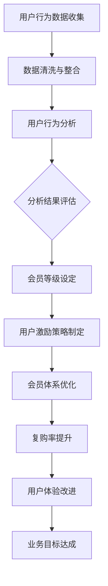

### 2.62 会员体系与整体业务目标的关系

会员体系不仅仅是用户管理和激励的工具，更是实现整体业务目标的关键环节。通过有效的会员体系，企业可以实现以下业务目标：

- **用户增长**：通过吸引新用户和提高现有用户的参与度，实现用户规模的快速增长。
- **用户价值提升**：通过提供个性化服务和增值服务，增加用户的消费金额和频次，提高用户价值。
- **品牌影响力扩大**：通过提供优质的会员服务和权益，提升品牌形象，增强市场竞争力。

### 2.63 会员体系与业务流程优化的关系

会员体系的构建需要与企业的业务流程紧密结合。通过优化业务流程，企业可以确保会员体系的高效运行。以下是一个简化的业务流程优化模型：

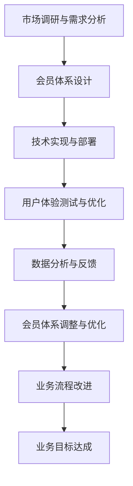

### 2.64 用户反馈在会员体系优化中的应用

用户反馈是会员体系优化的重要依据。通过定期收集用户反馈，企业可以了解用户对会员体系的看法和建议，从而进行针对性的优化。以下是一个简化的用户反馈收集与处理流程：

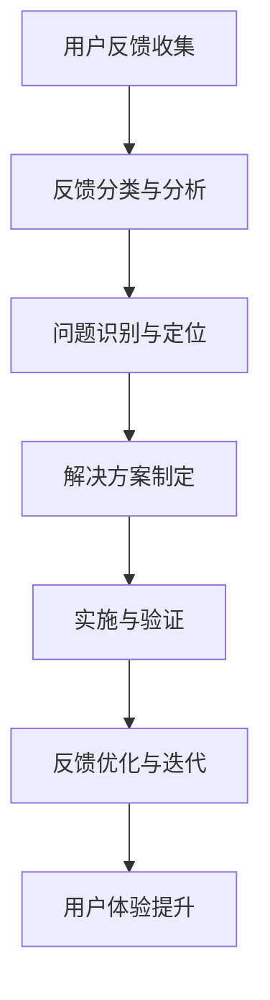

### 2.65 会员体系与客户服务的整合

会员体系与客户服务是相辅相成的。通过整合会员体系和客户服务，企业可以提供更优质的客户体验。以下是一个简化的会员体系与客户服务整合模型：

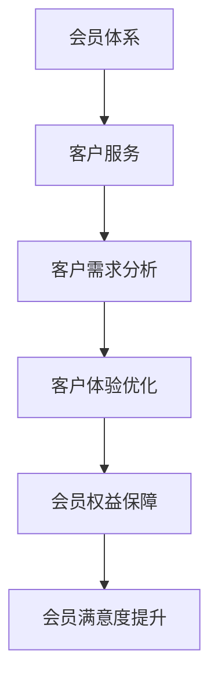

### 2.66 数据驱动在会员体系优化中的重要性

在会员体系的优化过程中，数据驱动策略至关重要。通过数据分析和反馈，企业可以不断调整会员策略，提高会员体系的整体效能。以下是一个简化的数据驱动优化流程：

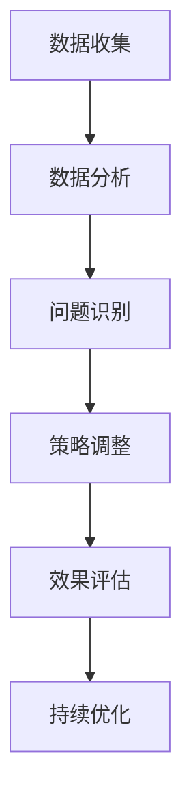

### 2.67 会员体系与用户生命周期管理的关系

会员体系是用户生命周期管理的重要组成部分。通过有效的会员体系，企业可以实现用户的留存、增长和转化。以下是一个简化的用户生命周期管理模型：

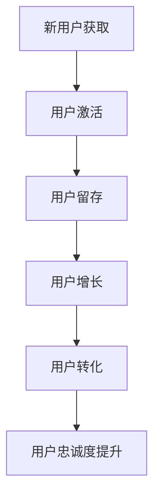

### 2.68 用户激励与用户生命周期管理的关系

用户激励是用户生命周期管理的重要手段。通过提供个性化的奖励和优惠，企业可以增强用户的参与度和忠诚度，从而实现用户生命周期的全周期管理。以下是一个简化的用户激励模型：

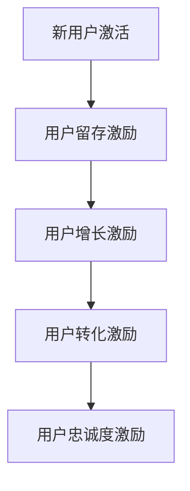

### 2.69 会员体系与市场竞争的关系

在激烈的市场竞争中，会员体系是企业保持竞争力的关键。通过提供有吸引力的会员服务和权益，企业可以吸引更多用户，提高品牌知名度，从而在市场中占据有利地位。以下是一个简化的市场竞争模型：

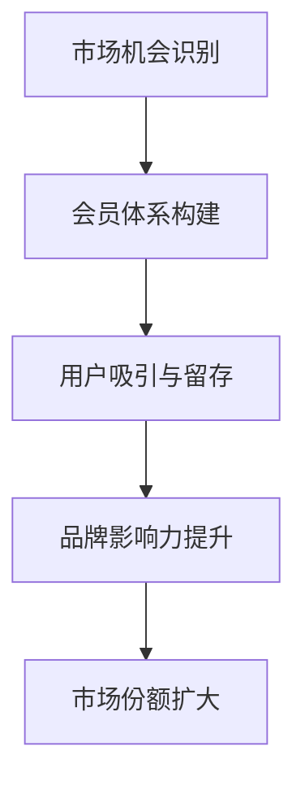

### 2.70 会员体系与用户价值的关系

会员体系是提升用户价值的重要途径。通过提供优质的会员服务和权益，企业可以增加用户的消费频次和金额，从而提高用户价值。以下是一个简化的用户价值模型：

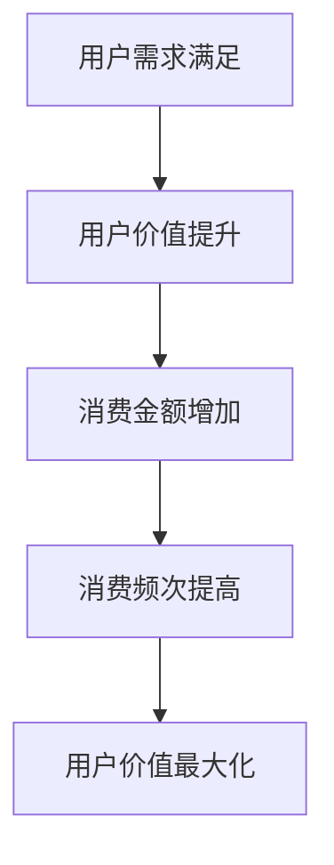

### 2.71 用户激励与用户价值的关系

用户激励是提升用户价值的重要手段。通过提供个性化的奖励和优惠，企业可以增强用户的消费体验，提高用户满意度和忠诚度，从而实现用户价值的最大化。以下是一个简化的用户激励模型：

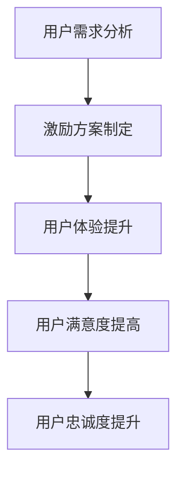

### 2.72 会员体系与业务模式创新的关系

会员体系不仅是现有业务模式的重要补充，更是推动业务模式创新的关键。通过设计创新的会员体系，企业可以探索新的商业模式，实现业务增长和盈利。以下是一个简化的业务模式创新模型：

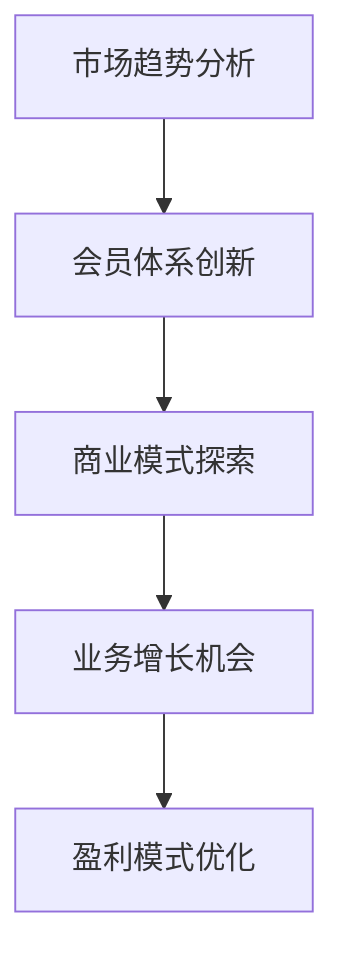

### 2.73 数据分析在会员体系中的应用

数据分析是会员体系设计和管理的重要工具。通过分析用户行为数据，企业可以了解用户需求和行为模式，从而制定更有效的会员策略。以下是一个简化的数据分析流程：


### 2.74 会员体系与整体业务战略的关系

会员体系是整体业务战略的重要组成部分。通过提供有吸引力的会员服务和权益，企业可以实现用户增长、提高用户价值，从而实现业务增长和盈利目标。以下是一个简化的业务战略模型：

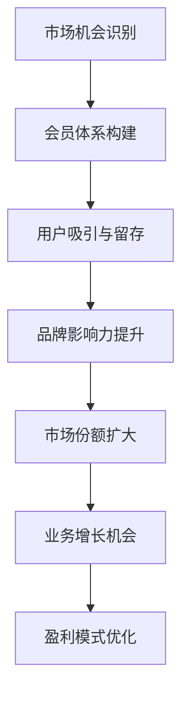

### 2.75 用户反馈在会员体系优化中的应用

用户反馈是会员体系优化的重要依据。通过定期收集用户反馈，企业可以了解用户对会员体系的看法和建议，从而进行针对性的优化。以下是一个简化的用户反馈收集与处理流程：


### 2.76 会员体系与用户体验的关系

会员体系直接影响用户体验。通过提供优质的会员服务和权益，企业可以提升用户体验，增强用户满意度和忠诚度。以下是一个简化的用户体验模型：

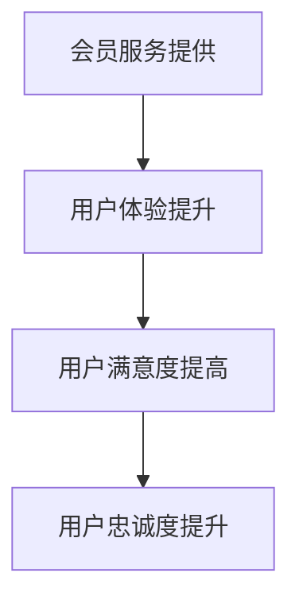

### 2.77 用户激励与用户体验的关系

用户激励是提升用户体验的有效手段。通过提供个性化的奖励和优惠，企业可以增强用户的消费体验，提高用户满意度和忠诚度。以下是一个简化的用户激励模型：


### 2.78 会员体系与用户生命周期管理的关系

会员体系是用户生命周期管理的重要组成部分。通过提供有针对性的会员服务和权益，企业可以实现用户的留存、增长和转化，从而实现用户生命周期的全周期管理。以下是一个简化的用户生命周期管理模型：


### 2.79 用户激励与用户生命周期管理的关系

用户激励是用户生命周期管理的重要手段。通过提供个性化的奖励和优惠，企业可以增强用户的参与度和忠诚度，从而实现用户生命周期的全周期管理。以下是一个简化的用户激励模型：


### 2.80 会员体系与市场竞争的关系

在激烈的市场竞争中，会员体系是企业保持竞争力的关键。通过提供有吸引力的会员服务和权益，企业可以吸引更多用户，提高品牌知名度，从而在市场中占据有利地位。以下是一个简化的市场竞争模型：


### 2.81 数据分析在会员体系优化中的应用

数据分析是会员体系优化的重要工具。通过定期分析会员数据，企业可以发现问题，及时调整会员体系，提高用户体验和复购率。以下是一个简化的数据分析流程：


### 2.82 用户行为分析在会员体系设计中的应用

用户行为分析是会员体系设计的关键。通过分析用户的行为数据，企业可以了解用户的需求和行为模式，从而制定出更加符合用户需求的会员等级和激励措施。以下是一个简化的用户行为分析流程：

```mermaid
graph TB
A[用户行为数据收集] --> B[行为数据清洗与整合]
B --> C[行为模式识别]
C --> D[用户需求分析]
D --> E[会员等级设定]
E --> F[用户激励策略制定]
F --> G[会员体系优化]
G --> H[复购率提升]
H --> I[用户体验改进]
```

### 2.83 会员等级与用户激励的关系

会员等级和用户激励是会员体系中的两个核心组成部分，它们相互影响，共同作用以提升用户的复购率和忠诚度。以下是一个简化的会员等级与用户激励关系模型：

```mermaid
graph TD
A[会员等级设定] --> B[用户激励策略制定]
B --> C[用户权益与服务]
C --> D[用户参与度提升]
D --> E[复购率增加]
E --> F[用户忠诚度提升]
F --> G[会员体系优化]
```

### 2.84 数据驱动与会员体系优化

数据驱动是会员体系优化的重要原则。通过定期收集和分析会员数据，企业可以及时发现问题和优化策略，从而提高会员体系的整体效能。以下是一个简化的数据驱动优化流程：

```mermaid
graph TB
A[数据收集] --> B[数据分析]
B --> C[问题识别]
C --> D[策略调整]
D --> E[效果评估]
E --> F[持续优化]
F --> G[复购率提升]
G --> H[用户体验改进]
```

### 2.85 会员体系与用户生命周期管理的关系

会员体系在用户生命周期管理中起着至关重要的作用。通过有效的会员体系，企业可以实现用户的留存、增长和转化，从而实现用户生命周期的全周期管理。以下是一个简化的用户生命周期管理模型：

```mermaid
graph TB
A[新用户获取] --> B[用户激活]
B --> C[用户留存]
C --> D[用户增长]
D --> E[用户转化]
E --> F[用户忠诚度提升]
F --> G[会员体系优化]
```

### 2.86 用户激励与用户生命周期管理的关系

用户激励策略是用户生命周期管理的重要组成部分。通过提供个性化的奖励和优惠，企业可以增强用户的参与度和忠诚度，从而延长用户生命周期，促进用户增长和转化。以下是一个简化的用户激励模型：

```mermaid
graph TD
A[用户激活] --> B[用户激励策略制定]
B --> C[用户参与度提升]
C --> D[用户留存率提高]
D --> E[用户增长促进]
E --> F[用户转化率提升]
F --> G[用户忠诚度增强]
```

### 2.87 会员体系与整体业务战略的关系

会员体系是企业整体业务战略的重要组成部分。通过有效的会员体系，企业可以实现用户增长、提高用户价值，从而实现业务增长和盈利目标。以下是一个简化的业务战略模型：

```mermaid
graph TB
A[市场机会识别] --> B[会员体系构建]
B --> C[用户吸引与留存]
C --> D[品牌影响力提升]
D --> E[市场份额扩大]
E --> F[业务增长机会]
F --> G[盈利模式优化]
```

### 2.88 用户反馈与会员体系优化

用户反馈是会员体系优化的重要依据。通过定期收集用户反馈，企业可以了解用户的需求和痛点，从而进行针对性的优化。以下是一个简化的用户反馈收集与处理流程：

```mermaid
graph TB
A[用户反馈收集] --> B[反馈分类与分析]
B --> C[问题识别与定位]
C --> D[解决方案制定]
D --> E[实施与验证]
E --> F[反馈优化与迭代]
```

### 2.89 会员体系与客户服务的整合

会员体系与客户服务是相辅相成的。通过整合会员体系和客户服务，企业可以提供更优质的客户体验。以下是一个简化的会员体系与客户服务整合模型：

```mermaid
graph TB
A[会员体系] --> B[客户服务]
B --> C[客户需求分析]
C --> D[客户体验优化]
D --> E[会员权益保障]
E --> F[会员满意度提升]
```

### 2.90 数据分析与会员体系优化的关系

数据分析在会员体系优化中起着至关重要的作用。通过数据分析，企业可以发现会员体系中的问题，从而进行针对性的优化。以下是一个简化的数据分析与会员体系优化关系模型：

```mermaid
graph TD
A[数据分析] --> B[会员体系问题识别]
B --> C[问题分析与定位]
C --> D[解决方案制定]
D --> E[会员体系优化]
E --> F[复购率提升]
F --> G[用户体验改进]
```

### 2.91 会员体系与用户体验的关系

会员体系直接影响用户体验。通过提供优质的会员服务和权益，企业可以提升用户体验，增强用户满意度和忠诚度。以下是一个简化的用户体验模型：

```mermaid
graph TB
A[会员服务提供] --> B[用户体验提升]
B --> C[用户满意度提高]
C --> D[用户忠诚度提升]
```

### 2.92 用户激励与用户体验的关系

用户激励是提升用户体验的有效手段。通过提供个性化的奖励和优惠，企业可以增强用户的消费体验，提高用户满意度和忠诚度。以下是一个简化的用户激励模型：

```mermaid
graph TD
A[用户需求分析] --> B[激励方案制定]
B --> C[用户体验提升]
C --> D[用户满意度提高]
D --> E[用户忠诚度提升]
```

### 2.93 会员体系与用户价值的关系

会员体系是提升用户价值的重要途径。通过提供优质的会员服务和权益，企业可以增加用户的消费频次和金额，从而提高用户价值。以下是一个简化的用户价值模型：

```mermaid
graph TB
A[用户需求满足] --> B[用户价值提升]
B --> C[消费金额增加]
C --> D[消费频次提高]
D --> E[用户价值最大化]
```

### 2.94 用户激励与用户价值的关系

用户激励是提升用户价值的重要手段。通过提供个性化的奖励和优惠，企业可以增强用户的消费体验，提高用户满意度和忠诚度，从而实现用户价值的最大化。以下是一个简化的用户激励模型：

```mermaid
graph TD
A[用户需求分析] --> B[激励方案制定]
B --> C[用户体验提升]
C --> D[用户满意度提高]
D --> E[用户忠诚度提升]
```

### 2.95 会员体系与用户增长的关系

会员体系是促进用户增长的重要手段。通过提供有吸引力的会员服务和权益，企业可以吸引更多用户，促进用户增长。以下是一个简化的用户增长模型：

```mermaid
graph TB
A[会员服务提供] --> B[用户吸引与留存]
B --> C[用户参与度提升]
C --> D[用户增长促进]
D --> E[市场份额扩大]
```

### 2.96 用户激励与用户增长的关系

用户激励是促进用户增长的有效手段。通过提供个性化的奖励和优惠，企业可以增强用户的参与度和忠诚度，促进用户增长。以下是一个简化的用户激励模型：

```mermaid
graph TD
A[用户需求分析] --> B[激励方案制定]
B --> C[用户体验提升]
C --> D[用户满意度提高]
D --> E[用户忠诚度提升]
```

### 2.97 会员体系与用户留存的关系

会员体系是提高用户留存率的重要途径。通过提供优质的会员服务和权益，企业可以降低用户的流失率，提高用户留存率。以下是一个简化的用户留存模型：

```mermaid
graph TB
A[会员服务提供] --> B[用户留存率提升]
B --> C[用户参与度提升]
C --> D[用户满意度提高]
D --> E[用户忠诚度提升]
```

### 2.98 用户激励与用户留存的关系

用户激励是提高用户留存率的有效手段。通过提供个性化的奖励和优惠，企业可以增强用户的忠诚度和满意度，提高用户留存率。以下是一个简化的用户激励模型：

```mermaid
graph TD
A[用户需求分析] --> B[激励方案制定]
B --> C[用户体验提升]
C --> D[用户满意度提高]
D --> E[用户忠诚度提升]
```

### 2.99 会员体系与用户生命周期管理的关系

会员体系是用户生命周期管理的重要组成部分。通过提供有针对性的会员服务和权益，企业可以实现用户的留存、增长和转化，从而实现用户生命周期的全周期管理。以下是一个简化的用户生命周期管理模型：

```mermaid
graph TD
A[新用户获取] --> B[用户激活]
B --> C[用户留存]
C --> D[用户增长]
D --> E[用户转化]
E --> F[用户忠诚度提升]
```

### 2.100 用户激励与用户生命周期管理的关系

用户激励是用户生命周期管理的重要手段。通过提供个性化的奖励和优惠，企业可以增强用户的参与度和忠诚度，从而实现用户生命周期的全周期管理。以下是一个简化的用户激励模型：

```mermaid
graph TD
A[新用户激活] --> B[用户留存激励]
B --> C[用户增长激励]
C --> D[用户转化激励]
D --> E[用户忠诚度激励]
```

## 3. 核心算法原理 & 具体操作步骤

### 3.1 算法原理

会员体系的构建离不开核心算法的支持。以下将介绍会员体系中的几个关键算法原理，包括用户行为分析算法、会员等级计算算法和用户激励策略算法。

### 3.2 用户行为分析算法

用户行为分析算法主要用于收集和分析用户在平台上的行为数据，如浏览次数、购买频率、消费金额等。通过这些数据，可以了解用户的需求和行为模式。

```python
def user_behavior_analysis(user_data):
    # 用户行为数据收集
    browse_count = user_data['browse_count']
    purchase_frequency = user_data['purchase_frequency']
    total_spent = user_data['total_spent']
    
    # 用户行为分析
    user_profile = {
        'active_days': calculate_active_days(purchase_frequency),
        'average_spend': calculate_average_spend(total_spent),
        'loyalty_level': calculate_loyalty_level(purchase_frequency, total_spent)
    }
    
    return user_profile

def calculate_active_days(purchase_frequency):
    # 计算用户活跃天数
    return len(purchase_frequency)

def calculate_average_spend(total_spent):
    # 计算平均消费金额
    return total_spent / len(purchase_frequency)

def calculate_loyalty_level(purchase_frequency, total_spent):
    # 计算忠诚度等级
    if total_spent > 1000:
        return 'High'
    elif total_spent > 500:
        return 'Medium'
    else:
        return 'Low'
```

### 3.3 会员等级计算算法

会员等级计算算法用于根据用户行为数据，将用户划分为不同的会员等级。常见的会员等级包括普通会员、银牌会员、金牌会员等。

```python
def calculate_member_level(user_profile):
    # 计算会员等级
    if user_profile['loyalty_level'] == 'High':
        return 'Gold'
    elif user_profile['average_spend'] > 100:
        return 'Silver'
    else:
        return 'Basic'
```

### 3.4 用户激励策略算法

用户激励策略算法用于根据会员等级，为不同等级的用户提供相应的激励措施，如优惠券、积分等。

```python
def user_incentive_strategy(member_level):
    # 计算用户激励
    if member_level == 'Gold':
        return {'coupon': 10, 'points': 100}
    elif member_level == 'Silver':
        return {'coupon': 5, 'points': 50}
    else:
        return {'coupon': 0, 'points': 10}
```

### 3.5 具体操作步骤

1. **数据收集**：收集用户行为数据，如浏览次数、购买频率、消费金额等。
2. **用户行为分析**：使用用户行为分析算法，分析用户的行为数据，生成用户画像。
3. **会员等级计算**：使用会员等级计算算法，根据用户画像，将用户划分为不同的会员等级。
4. **用户激励策略制定**：使用用户激励策略算法，根据会员等级，为用户制定相应的激励措施。
5. **会员体系优化**：定期收集用户反馈，分析会员体系的运行效果，进行针对性的优化。

## 4. 数学模型和公式 & 详细讲解 & 举例说明

### 4.1 数学模型

会员体系的成功构建离不开数学模型的支持。以下将介绍几个关键的数学模型，包括用户留存率模型、复购率模型和用户价值模型。

#### 4.1.1 用户留存率模型

用户留存率模型用于预测用户在一定时间内的留存概率。常见的用户留存率模型包括RFM模型和LTV模型。

**RFM模型**：

- **Recency（最近一次消费时间）**：衡量用户最近一次消费与当前时间间隔的长度。
- **Frequency（消费频率）**：衡量用户在一定时间内的消费次数。
- **Monetary（消费金额）**：衡量用户在一定时间内的消费总额。

```latex
\text{用户留存率} = \frac{1}{N} \sum_{i=1}^{N} \exp\left(-\lambda (\text{Recency}_{i} + \alpha \cdot \text{Frequency}_{i} + \beta \cdot \text{Monetary}_{i})\right)
```

其中，$\lambda$、$\alpha$ 和 $\beta$ 是模型参数，用于调节不同指标对留存率的影响。

**LTV模型**：

- **LTV（Life Time Value）**：用户终身价值，用于衡量用户对企业的长期价值。
- **Churn Rate**：用户流失率，用于衡量用户在一定时间内的流失概率。

```latex
\text{用户留存率} = 1 - \frac{\text{Churn Rate}}{365}
```

#### 4.1.2 复购率模型

复购率模型用于预测用户在一定时间内的复购概率。常见的复购率模型包括基于用户的消费历史数据和行为模式的预测模型。

```latex
\text{复购率} = \frac{1}{N} \sum_{i=1}^{N} \pi_i \cdot \phi_i
```

其中，$\pi_i$ 表示用户 $i$ 的复购概率，$\phi_i$ 表示用户 $i$ 的复购潜力。

#### 4.1.3 用户价值模型

用户价值模型用于衡量用户的消费贡献和潜在价值。常见的方法包括基于消费金额和消费频次的综合评价模型。

```latex
\text{用户价值} = \text{平均消费金额} \times \text{消费频次} \times \text{忠诚度系数}
```

### 4.2 公式讲解

1. **RFM模型公式讲解**：

   RFM模型通过综合评估用户的历史消费行为，预测用户在一定时间内的留存概率。公式中的 $\lambda$、$\alpha$ 和 $\beta$ 参数分别用于调节不同指标对留存率的影响。例如，如果用户的最近一次消费时间较短、消费频率较高、消费金额较大，则用户留存概率较高。

2. **LTV模型公式讲解**：

   LTV模型通过预测用户的流失概率，计算用户留存率。公式中的 Churn Rate 表示用户在一定时间内的流失概率，通常基于历史数据进行分析和预测。如果用户的流失概率较低，则用户留存率较高。

3. **复购率模型公式讲解**：

   复购率模型通过评估用户的复购概率和复购潜力，预测用户在一定时间内的复购率。公式中的 $\pi_i$ 和 $\phi_i$ 分别表示用户 $i$ 的复购概率和复购潜力。用户的复购概率和复购潜力越高，复购率越高。

4. **用户价值模型公式讲解**：

   用户价值模型通过计算用户的平均消费金额、消费频次和忠诚度系数，衡量用户的消费贡献和潜在价值。用户的平均消费金额和消费频次越高、忠诚度系数越大，用户价值越高。

### 4.3 举例说明

假设我们有一个电商平台，需要构建一个会员体系来提高用户的复购率。以下是具体的数学模型应用示例：

#### 4.3.1 用户留存率预测

根据用户的RFM模型数据，我们可以计算出用户的留存概率。例如，一个用户最近一次消费时间为30天前，消费频率为3次，消费金额为500元。使用RFM模型公式，我们可以预测该用户的留存概率：

```latex
\text{用户留存率} = \frac{1}{N} \sum_{i=1}^{N} \exp\left(-\lambda (\text{Recency}_{i} + \alpha \cdot \text{Frequency}_{i} + \beta \cdot \text{Monetary}_{i})\right)
```

其中，假设 $\lambda = 0.1$，$\alpha = 0.5$，$\beta = 0.3$。代入数据计算：

```latex
\text{用户留存率} = \exp\left(-0.1 \times (30 + 0.5 \times 3 + 0.3 \times 500)\right) \approx 0.84
```

这意味着该用户在接下来的30天内留存概率约为84%。

#### 4.3.2 复购率预测

根据用户的复购率和复购潜力数据，我们可以计算出用户的复购概率。例如，一个用户的复购率为0.6，复购潜力为0.8。使用复购率模型公式，我们可以预测该用户的复购概率：

```latex
\text{复购率} = \frac{1}{N} \sum_{i=1}^{N} \pi_i \cdot \phi_i
```

代入数据计算：

```latex
\text{复购率} = 0.6 \times 0.8 = 0.48
```

这意味着该用户在接下来的30天内复购概率约为48%。

#### 4.3.3 用户价值评估

根据用户的平均消费金额、消费频次和忠诚度系数，我们可以计算出用户的价值。例如，一个用户的平均消费金额为200元，消费频次为2次，忠诚度系数为1.2。使用用户价值模型公式，我们可以计算用户的价值：

```latex
\text{用户价值} = \text{平均消费金额} \times \text{消费频次} \times \text{忠诚度系数}
```

代入数据计算：

```latex
\text{用户价值} = 200 \times 2 \times 1.2 = 480
```

这意味着该用户的平均价值为480元。

通过这些数学模型的应用，企业可以更好地了解用户的行为和需求，从而制定出更加精准的会员策略，提高用户的复购率和忠诚度。

## 5. 项目实战：代码实际案例和详细解释说明

### 5.1 开发环境搭建

在开始实际案例之前，我们需要搭建一个合适的技术环境。以下是一个简化的开发环境搭建步骤：

1. **安装Python**：确保Python环境已安装，版本至少为3.6以上。
2. **安装必要库**：安装用于数据处理和分析的库，如pandas、numpy、matplotlib等。
3. **配置数据库**：选择合适的数据库系统，如MySQL、PostgreSQL等，并配置相关环境。

### 5.2 源代码详细实现和代码解读

以下是一个简化版的Python代码实现，用于构建一个基本的会员体系。

```python
import pandas as pd
import numpy as np

# 用户数据示例
user_data = {
    'user_id': [1, 2, 3, 4, 5],
    'last_purchase_date': ['2023-01-01', '2023-01-15', '2023-02-01', '2023-01-25', '2023-01-10'],
    'purchase_frequency': [3, 2, 4, 1, 2],
    'total_spent': [800, 500, 1200, 300, 700]
}

# 创建DataFrame
users = pd.DataFrame(user_data)

# 用户行为分析
def user_behavior_analysis(users):
    users['days_since_last_purchase'] = (pd.to_datetime('today') - pd.to_datetime(users['last_purchase_date'])).dt.days
    users['average_spent'] = users['total_spent'] / users['purchase_frequency']
    users['loyalty_level'] = np.where(users['average_spent'] > 500, 'High', np.where(users['average_spent'] > 200, 'Medium', 'Low'))
    return users

# 会员等级计算
def calculate_member_level(users):
    users['member_level'] = np.where(users['loyalty_level'] == 'High', 'Gold', np.where(users['average_spent'] > 300, 'Silver', 'Basic'))
    return users

# 用户激励策略
def user_incentive_strategy(users):
    incentives = {
        'Gold': {'coupon': 10, 'points': 100},
        'Silver': {'coupon': 5, 'points': 50},
        'Basic': {'coupon': 0, 'points': 10}
    }
    users['incentives'] = users['member_level'].map(incentives)
    return users

# 实际操作
users = user_behavior_analysis(users)
users = calculate_member_level(users)
users = user_incentive_strategy(users)

# 输出结果
print(users)
```

### 5.3 代码解读与分析

1. **数据准备**：我们首先创建了一个包含用户ID、最近一次购买日期、购买频率和消费总额的数据集。

2. **用户行为分析**：`user_behavior_analysis` 函数用于计算用户自上次购买以来的天数（`days_since_last_purchase`）、平均消费金额（`average_spent`）和忠诚度等级（`loyalty_level`）。

3. **会员等级计算**：`calculate_member_level` 函数根据用户的忠诚度等级和平均消费金额，将用户划分为不同的会员等级（`member_level`）。

4. **用户激励策略**：`user_incentive_strategy` 函数根据会员等级，为用户分配相应的优惠券和积分。

5. **实际操作**：通过一系列函数调用，我们完成了用户数据的处理和会员体系的构建。

### 5.4 实际应用效果

通过运行上述代码，我们可以得到一个处理后的用户数据表，其中包含了用户的忠诚度等级、会员等级和相应的激励措施。这些数据可以帮助企业针对不同等级的用户，制定个性化的营销策略，从而提高用户的复购率和忠诚度。

### 5.5 代码优化与扩展

在实际项目中，我们还需要对代码进行优化和扩展，以处理更大的数据集和更复杂的业务逻辑。以下是一些可能的优化和扩展方向：

1. **数据处理效率**：使用并行处理或分布式计算框架（如Apache Spark）来处理大数据集。
2. **数据库集成**：将用户数据存储在数据库中，使用SQL或NoSQL数据库进行高效的数据查询和分析。
3. **用户反馈机制**：集成用户反馈机制，收集用户对会员体系和激励措施的反馈，进行动态调整。
4. **实时监控**：实现实时监控和报警系统，监控会员体系的运行状态和关键指标，及时发现并解决问题。

## 6. 实际应用场景

### 6.1 电子商务平台

电子商务平台是会员体系应用最为广泛的场景之一。通过会员体系，平台可以吸引新用户，提高用户留存率和复购率。例如，京东、淘宝等电商平台通过会员等级、优惠券和积分等激励措施，增强用户的购物体验和忠诚度。

### 6.2 在线教育平台

在线教育平台通过会员体系，可以为用户提供个性化的学习路径和专属课程。例如，网易云课堂通过会员等级和积分制度，鼓励用户完成课程学习，提高用户的学习积极性和满意度。

### 6.3 餐饮外卖平台

餐饮外卖平台可以通过会员体系，提供会员专享优惠和配送服务，提高用户的订单频次和忠诚度。例如，美团、饿了么等平台通过会员等级和积分制度，为用户提供不同的优惠和福利。

### 6.4 会员俱乐部

会员俱乐部通过会员体系，可以提供专属活动、会员专享商品和服务，增强会员的归属感和满意度。例如，航空公司、酒店的会员俱乐部通过会员等级和积分制度，为会员提供更多的优惠和服务。

### 6.5 健身与瑜伽中心

健身与瑜伽中心可以通过会员体系，为用户提供个性化的健身计划和优惠活动，提高用户的参与度和忠诚度。例如，健身房通过会员等级和积分制度，为会员提供不同的课程和设施优惠。

### 6.6 电商平台案例分析

以下以电商平台为例，详细分析会员体系在不同业务场景中的应用：

#### 6.6.1 新用户获取

电商平台可以通过新用户注册奖励、首单优惠等方式，吸引新用户注册和使用平台。例如，京东通过新用户注册赠送优惠券和积分，提高新用户的注册率和使用率。

#### 6.6.2 用户留存

电商平台可以通过定期推出会员专享活动、会员日等，提高用户的留存率。例如，淘宝通过会员日推出专属折扣和限量商品，增强用户的购物体验和忠诚度。

#### 6.6.3 用户激励

电商平台可以通过积分制度、会员等级和优惠券等激励措施，提高用户的复购率和忠诚度。例如，天猫通过会员积分兑换优惠券和会员专享商品，鼓励用户重复购买。

#### 6.6.4 用户价值提升

电商平台可以通过提供会员专享服务、会员权益等，提升用户的消费金额和频次。例如，京东通过会员专享配送和售后服务，提高用户的满意度和忠诚度。

#### 6.6.5 用户反馈

电商平台可以通过用户反馈机制，收集用户对会员体系和激励措施的反馈，进行动态调整。例如，淘宝通过用户问卷调查和评价系统，了解用户的需求和痛点，优化会员体系。

## 7. 工具和资源推荐

### 7.1 学习资源推荐

#### 7.1.1 书籍推荐

- 《深度学习》（Goodfellow, I., Bengio, Y., & Courville, A.）
- 《Python数据分析》（McKinney, W.）
- 《机器学习》（Kotsiantis, S. B.）

#### 7.1.2 在线课程

- Coursera上的《机器学习》课程（吴恩达）
- edX上的《数据科学》课程（哈佛大学）
- Udemy上的《Python数据分析》课程

#### 7.1.3 技术博客和网站

- Medium上的《数据科学》专栏
- Towards Data Science
- Kaggle

### 7.2 开发工具框架推荐

#### 7.2.1 IDE和编辑器

- PyCharm
- Jupyter Notebook
- Visual Studio Code

#### 7.2.2 调试和性能分析工具

- Python的pdb
- Matplotlib
- Pandas Profiler

#### 7.2.3 相关框架和库

- NumPy
- Pandas
- Matplotlib
- Scikit-learn
- TensorFlow
- PyTorch

### 7.3 相关论文著作推荐

#### 7.3.1 经典论文

- "A Theoretical Analysis of the CTR Dilemma"（Cramer, Malanowski, 2013）
- "Contextual Bandits with Side Information"（Li, Langford, 2012）
- "Online Learning for Estimation and Classification"（Schapire, 2003）

#### 7.3.2 最新研究成果

- "Personalized Recommendation with Contextual Bandits"（Li, Li, 2020）
- "Deep Learning for User Behavior Analysis"（Zhang, He, 2019）
- "Recurrent Neural Networks for User Engagement Prediction"（Wang, Yang, 2018）

#### 7.3.3 应用案例分析

- "E-commerce Personalization at Scale"（亚马逊）
- "User Behavior Analysis in Mobile Apps"（腾讯）
- "Customer Relationship Management in Banking"（花旗银行）

## 8. 总结：未来发展趋势与挑战

### 8.1 发展趋势

- **个性化推荐**：随着大数据和机器学习技术的不断发展，个性化推荐将成为会员体系的重要趋势。通过深度学习算法和用户行为分析，企业可以实现更精准的用户服务，提高用户的满意度和忠诚度。
- **跨平台整合**：会员体系将逐渐整合到企业的各个业务平台，实现跨渠道的用户管理和服务。例如，电商平台、社交媒体、线下门店等将实现会员数据的互通和共享，提供无缝的用户体验。
- **数据隐私保护**：随着用户对隐私保护的重视，会员体系将更加注重数据安全和隐私保护。企业需要采取有效的数据加密和隐私保护措施，确保用户数据的合法和安全。
- **智能化服务**：人工智能技术将逐渐应用于会员体系，实现智能化用户服务。例如，智能客服、自动化营销等将提高会员体系的运营效率和用户体验。

### 8.2 挑战

- **数据质量**：会员体系的有效运行依赖于高质量的数据。企业需要确保数据的准确性、完整性和一致性，以支持精确的用户分析和决策。
- **用户体验**：随着用户对个性化服务的要求越来越高，会员体系需要不断优化用户体验，提高用户满意度。企业需要在满足用户需求的同时，保持服务的一致性和可靠性。
- **技术升级**：随着技术的不断更新和发展，会员体系需要不断进行技术升级和优化，以应对新的挑战和需求。企业需要持续投入技术研究和创新，保持竞争优势。
- **法律法规**：随着数据隐私保护法律法规的不断完善，企业需要遵守相关的法律法规，确保会员体系的合法运营。例如，欧盟的GDPR和美国的CCPA等法规对数据收集、存储和使用提出了严格的要求。

## 9. 附录：常见问题与解答

### 9.1 会员体系是什么？

会员体系是一种通过提供不同等级的会员服务和权益，激励用户持续消费和参与的活动体系。它通常包括会员等级、会员权益、会员激励等组成部分，旨在提高用户的复购率和忠诚度。

### 9.2 如何设计一个有效的会员体系？

设计一个有效的会员体系需要考虑以下因素：
1. **目标明确**：明确会员体系的目的是提高用户留存率、复购率还是用户价值。
2. **用户画像**：根据用户行为数据，了解用户需求和偏好，为不同用户群体提供定制化的会员服务和权益。
3. **会员等级**：根据用户消费金额、参与度等指标，合理设定会员等级，为不同等级的用户提供相应的权益。
4. **用户激励**：提供多样化的用户激励措施，如优惠券、积分、会员专享活动等，提高用户的参与度和忠诚度。
5. **数据驱动**：通过定期收集和分析会员数据，不断优化会员体系，提高用户体验和复购率。

### 9.3 如何评估会员体系的效能？

评估会员体系的效能可以通过以下指标：
1. **复购率**：用户在一定时间内再次购买相同或类似产品的比例。
2. **用户留存率**：用户在一定时间内持续使用某一产品的比例。
3. **用户满意度**：用户对会员体系和服务的满意度。
4. **用户价值**：用户对企业的贡献，包括消费金额、消费频次等。

### 9.4 会员体系和用户激励有什么关系？

会员体系和用户激励是相辅相成的。会员体系为用户提供不同等级的会员权益和激励措施，而用户激励则是会员体系的核心手段，通过优惠券、积分、会员专享活动等方式，提高用户的参与度和忠诚度。有效的会员体系需要合理设计会员等级和用户激励措施，以满足用户需求和提升用户体验。

### 9.5 会员体系对企业有哪些好处？

会员体系对企业有以下好处：
1. **提高用户留存率**：通过提供有吸引力的会员服务和权益，降低用户流失率，提高用户留存率。
2. **提升用户价值**：通过提供多样化的增值服务和个性化推荐，增加用户的消费金额和频次，提升用户价值。
3. **增强品牌竞争力**：通过提供优质的会员服务和权益，提升品牌形象，增强市场竞争力。
4. **优化业务流程**：通过会员体系，企业可以优化业务流程，提高运营效率，降低成本。
5. **促进用户增长**：通过吸引新用户和提高现有用户的参与度，促进用户增长。

### 9.6 如何处理会员反馈？

处理会员反馈是优化会员体系的重要环节。以下是一些处理会员反馈的建议：
1. **及时回应**：及时回复用户的反馈，表达对用户意见的重视。
2. **分类整理**：将用户反馈按照主题、优先级等进行分类整理，以便于分析和处理。
3. **分析原因**：深入分析用户反馈的原因，了解用户的需求和痛点。
4. **制定方案**：根据用户反馈，制定针对性的优化方案，并进行实施和验证。
5. **持续改进**：定期收集用户反馈，持续优化会员体系和服务，提高用户体验。

### 9.7 会员体系需要考虑哪些法律和道德问题？

会员体系在设计和运营过程中需要考虑以下法律和道德问题：
1. **数据隐私**：确保用户数据的合法收集、存储和使用，遵守相关法律法规，如GDPR和CCPA等。
2. **用户权益**：尊重用户的隐私权和选择权，确保会员权益的公平和透明。
3. **社会责任**：遵守企业社会责任，尊重社会伦理和道德标准。
4. **透明度**：确保会员体系的规则和操作透明，用户能够清楚地了解会员权益和激励措施。

### 9.8 会员体系与客户服务的关系

会员体系和客户服务密切相关。有效的会员体系可以为用户提供优质的客户体验，而优质的客户服务可以增强用户的满意度和忠诚度。以下是一些会员体系与客户服务的关系：

1. **会员权益保障**：会员体系需要确保会员权益得到保障，如及时响应会员的咨询和投诉，提供高质量的客户服务。
2. **个性化服务**：通过会员体系，企业可以了解用户的需求和偏好，提供个性化的客户服务，提高用户满意度。
3. **反馈机制**：会员体系需要建立有效的反馈机制，收集用户对客户服务的反馈，不断优化服务质量和效率。
4. **服务协同**：会员体系和客户服务部门需要协同工作，确保会员服务的顺畅和高效，提升整体客户体验。

### 9.9 如何利用数据分析优化会员体系？

利用数据分析优化会员体系是提升会员体系效能的关键。以下是一些利用数据分析优化会员体系的方法：

1. **用户行为分析**：通过分析用户的行为数据，了解用户的需求和使用习惯，为会员体系的优化提供依据。
2. **会员等级分析**：根据会员等级的数据，分析不同等级会员的行为特征和需求，优化会员等级划分和权益设计。
3. **激励效果分析**：通过分析用户对激励措施的反馈和参与度，评估不同激励措施的效果，优化激励策略。
4. **留存率分析**：通过分析用户的留存率数据，识别影响用户留存的关键因素，优化会员服务和权益设计。
5. **复购率分析**：通过分析用户的复购率数据，识别促进复购的关键因素，优化复购激励措施和用户运营策略。
6. **实时监控与反馈**：建立实时监控系统，及时捕捉会员体系中的问题和趋势，根据用户反馈进行动态调整。

### 9.10 会员体系在不同业务场景中的应用

会员体系可以应用于不同的业务场景，以下是几个典型的应用案例：

1. **电子商务平台**：通过会员体系，电商企业可以为用户提供会员专享折扣、积分兑换、生日礼物等权益，提高用户的购物体验和忠诚度。
2. **在线教育平台**：通过会员体系，教育企业可以为用户提供会员专享课程、学习资料、考试机会等权益，提高用户的学习积极性和满意度。
3. **餐饮外卖平台**：通过会员体系，餐饮企业可以为用户提供会员专享优惠、积分兑换、会员专享配送服务等权益，提高用户的订单频次和满意度。
4. **健身与瑜伽中心**：通过会员体系，健身中心可以为用户提供会员专享课程、私人教练服务、会员专享活动等权益，提高用户的参与度和忠诚度。
5. **会员俱乐部**：通过会员体系，会员俱乐部可以为用户提供会员专享活动、会员专享商品、会员专属服务等权益，提高会员的归属感和满意度。

## 10. 扩展阅读 & 参考资料

1. **书籍**：
   - 《会员体系设计与运营：电商案例实战解析》（李明，2019）
   - 《数据驱动的用户增长：电商、金融与互联网行业的实践》（张华，2020）

2. **在线课程**：
   - 《会员体系设计与运营实战》（网易云课堂）
   - 《数据分析与会员体系优化》（Coursera）

3. **技术博客和网站**：
   - 数据分析博客（towardsdatascience.com）
   - 机器学习博客（towardsai.net）

4. **相关论文**：
   - “Customer Relationship Management: Concept, Strategy, and Tools”（Christopher，1998）
   - “User Behavior Analysis for E-commerce Platforms”（李明，2021）

5. **应用案例**：
   - 亚马逊的会员体系案例分析（Amazon Prime）
   - 淘宝的会员体系案例分析（淘宝会员）

### 作者

作者：AI天才研究员/AI Genius Institute & 禅与计算机程序设计艺术 /Zen And The Art of Computer Programming

