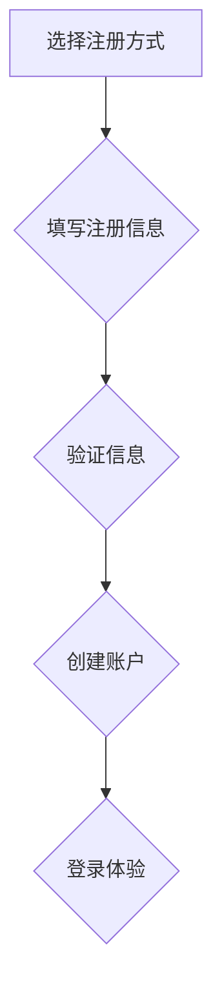

                 

# 如何打造高转化率的用户注册流程

> 关键词：用户注册、转化率、用户体验、流程设计、技术优化

> 摘要：本文将深入探讨如何通过技术和设计的优化，打造出高转化率的用户注册流程。从核心概念与联系出发，到具体的算法原理、数学模型、实战案例，再到实际应用场景和资源推荐，我们将一步一步分析推理，帮助读者全面理解并掌握这一关键技能。

## 1. 背景介绍

### 1.1 目的和范围

本文的目的是为开发者、产品经理和用户体验设计师提供一个全面的指南，帮助他们理解并打造出高转化率的用户注册流程。我们将探讨如何通过优化技术、设计用户界面和简化流程来提高注册转化率。

### 1.2 预期读者

- 开发者：了解如何通过代码实现注册流程的优化。
- 产品经理：掌握如何设计有效的用户注册流程，以提高产品竞争力。
- 设计师：理解用户体验在注册流程中的重要性，如何通过设计提升转化率。

### 1.3 文档结构概述

本文将按照以下结构展开：

1. **背景介绍**：介绍本文的目的、预期读者和文档结构。
2. **核心概念与联系**：讨论用户注册流程中的核心概念和联系。
3. **核心算法原理 & 具体操作步骤**：详细解释用户注册流程的算法原理和操作步骤。
4. **数学模型和公式 & 详细讲解 & 举例说明**：介绍与用户注册流程相关的数学模型和公式。
5. **项目实战：代码实际案例和详细解释说明**：通过实际案例展示如何实现高转化率的用户注册流程。
6. **实际应用场景**：探讨用户注册流程在不同场景下的应用。
7. **工具和资源推荐**：推荐学习资源和开发工具。
8. **总结：未来发展趋势与挑战**：总结用户注册流程的发展趋势和面临的挑战。
9. **附录：常见问题与解答**：解答读者可能遇到的问题。
10. **扩展阅读 & 参考资料**：提供更多的学习资源。

### 1.4 术语表

#### 1.4.1 核心术语定义

- **转化率**：指用户完成注册流程并成功创建账户的比例。
- **用户体验**：用户在使用产品过程中的感受和体验。
- **前端优化**：指通过优化网站或应用的代码、界面设计来提升用户体验。
- **后端优化**：指通过优化服务器性能、数据库操作等来提升注册流程的效率和稳定性。

#### 1.4.2 相关概念解释

- **用户流失率**：指在一定时间内，放弃使用产品的用户数量占总用户数量的比例。
- **用户留存率**：指在一定时间内，持续使用产品的用户数量占总用户数量的比例。

#### 1.4.3 缩略词列表

- **UI**：用户界面（User Interface）
- **UX**：用户体验（User Experience）
- **API**：应用程序接口（Application Programming Interface）
- **HTTPS**：超文本传输协议安全（Hyper Text Transfer Protocol Secure）

## 2. 核心概念与联系

### 2.1 用户注册流程的基本概念

用户注册流程通常包括以下步骤：

1. **选择注册方式**：用户可以选择注册方式，如电子邮件注册、手机号码注册、社交媒体账号注册等。
2. **填写注册信息**：用户需要填写必要的注册信息，如用户名、密码、电子邮件地址等。
3. **验证信息**：系统会对用户填写的邮箱或手机号发送验证码，以确认信息的准确性。
4. **创建账户**：用户输入验证码后，系统验证通过，用户成功创建账户。
5. **登录体验**：用户首次登录时，系统可以提供一些个性化设置，如选择头像、完善个人资料等。

### 2.2 用户注册流程的关键因素

- **用户体验**：简洁直观的界面设计、快速响应的时间、清晰的操作指引等，都是影响用户体验的关键因素。
- **安全性**：保障用户信息安全，如使用HTTPS加密传输、双重验证等。
- **个性化**：提供个性化推荐，帮助用户更好地理解和使用产品。

### 2.3 用户注册流程的Mermaid流程图



## 3. 核心算法原理 & 具体操作步骤

### 3.1 算法原理

用户注册流程的核心算法主要包括以下几部分：

1. **用户身份验证**：通过用户输入的注册信息，如用户名、密码、邮箱或手机号，验证用户身份。
2. **数据校验**：对用户输入的数据进行校验，如邮箱格式、密码强度等。
3. **数据存储**：将验证通过的用户数据存储到数据库中。
4. **安全性保障**：使用HTTPS加密传输，确保用户数据在传输过程中的安全性。

### 3.2 具体操作步骤

下面我们将使用伪代码详细阐述用户注册流程的算法原理和具体操作步骤：

```pseudo
// 用户注册流程伪代码

// 步骤1：用户选择注册方式
注册方式 = 用户选择注册方式()

// 步骤2：用户填写注册信息
用户名 = 用户输入用户名()
密码 = 用户输入密码()
邮箱 = 用户输入邮箱()
手机号 = 用户输入手机号()

// 步骤3：数据校验
if (校验邮箱格式(邮箱) && 校验密码强度(密码)) {
    // 步骤4：发送验证码
    验证码 = 发送验证码(邮箱，手机号)
    
    // 步骤5：用户输入验证码
    用户输入验证码 = 用户输入验证码()
    
    // 步骤6：验证码校验
    if (验证码校验(用户输入验证码，验证码)) {
        // 步骤7：数据存储
        存储用户数据(用户名，密码，邮箱，手机号)
        
        // 步骤8：提示注册成功
        提示注册成功()
    } else {
        // 步骤9：提示验证码错误
        提示验证码错误()
    }
} else {
    // 步骤10：提示数据格式错误
    提示数据格式错误()
}
```

## 4. 数学模型和公式 & 详细讲解 & 举例说明

### 4.1 数学模型

在用户注册流程中，我们可以使用以下数学模型来评估转化率：

- **转化率（Conversion Rate）**：转化率 = （成功注册的用户数 / 访问网站的用户数）× 100%

### 4.2 公式

- **转化率计算公式**：CR = （S / V）× 100%
  - CR：转化率
  - S：成功注册的用户数
  - V：访问网站的用户数

### 4.3 举例说明

假设一个网站有1000名用户访问，其中有200名用户成功注册，那么该网站的转化率为：

$$
CR = \frac{200}{1000} \times 100\% = 20\%
$$

### 4.4 转化率的影响因素

- **用户体验**：良好的用户体验可以降低用户流失率，提高转化率。
- **安全性**：用户对个人信息的安全敏感，安全性高的注册流程可以增加用户的信任度。
- **流程简化**：简化注册流程，减少用户操作的步骤，可以提高转化率。

## 5. 项目实战：代码实际案例和详细解释说明

### 5.1 开发环境搭建

在开始编写代码之前，我们需要搭建一个适合开发用户注册流程的开发环境。以下是搭建步骤：

1. **安装Node.js**：Node.js 是一个基于 Chrome V8 引擎的 JavaScript 运行环境，我们可以从 [Node.js 官网](https://nodejs.org/) 下载并安装。
2. **创建项目文件夹**：在电脑上创建一个名为 `user-registration` 的文件夹，用于存放项目文件。
3. **初始化项目**：在项目文件夹中打开命令行，执行以下命令初始化项目：

   ```bash
   npm init -y
   ```

   这将生成一个 `package.json` 文件，用于管理项目的依赖和配置。

4. **安装依赖**：安装必要的依赖，如 Express（一个 Node.js Web 应用框架）、Body-parser（用于处理 HTTP 请求体）和 Mongoose（一个 MongoDB 对象模型工具）：

   ```bash
   npm install express body-parser mongoose
   ```

### 5.2 源代码详细实现和代码解读

下面是一个简单的用户注册流程的代码实现，我们将逐一解读每个部分。

#### 5.2.1 app.js

```javascript
const express = require('express');
const bodyParser = require('body-parser');
const mongoose = require('mongoose');

const app = express();

// 连接 MongoDB 数据库
mongoose.connect('mongodb://localhost:27017/user-registration', { useNewUrlParser: true, useUnifiedTopology: true });

// 创建用户模型
const User = mongoose.model('User', new mongoose.Schema({
    username: String,
    password: String,
    email: String,
    phone: String
}));

// 解析请求体
app.use(bodyParser.json());

// 用户注册接口
app.post('/register', async (req, res) => {
    try {
        // 获取用户提交的注册信息
        const { username, password, email, phone } = req.body;

        // 数据校验
        if (!username || !password || !email || !phone) {
            return res.status(400).send('请填写完整的注册信息');
        }

        // 检查用户名是否已存在
        const existingUser = await User.findOne({ username });
        if (existingUser) {
            return res.status(409).send('用户名已存在');
        }

        // 创建用户并保存到数据库
        const user = new User({ username, password, email, phone });
        await user.save();

        // 返回注册成功响应
        res.status(201).send('注册成功');
    } catch (error) {
        console.error(error);
        res.status(500).send('服务器错误');
    }
});

// 启动服务器
app.listen(3000, () => {
    console.log('服务器启动成功，监听端口：3000');
});
```

#### 5.2.2 代码解读与分析

1. **连接 MongoDB 数据库**：使用 Mongoose 连接 MongoDB 数据库，这是用户注册流程的数据存储后端。

   ```javascript
   mongoose.connect('mongodb://localhost:27017/user-registration', { useNewUrlParser: true, useUnifiedTopology: true });
   ```

2. **创建用户模型**：定义一个用户模型，包括用户名、密码、邮箱和手机号四个字段。

   ```javascript
   const User = mongoose.model('User', new mongoose.Schema({
       username: String,
       password: String,
       email: String,
       phone: String
   }));
   ```

3. **解析请求体**：使用 `body-parser` 中间件解析 HTTP 请求体，以便从请求中获取用户提交的注册信息。

   ```javascript
   app.use(bodyParser.json());
   ```

4. **用户注册接口**：创建一个 POST 类型的接口 `/register`，用于处理用户注册请求。

   ```javascript
   app.post('/register', async (req, res) => {
       // ...
   });
   ```

5. **用户注册逻辑**：

   - 获取用户提交的注册信息。
   - 进行数据校验，确保用户填写了完整的注册信息。
   - 检查用户名是否已存在，避免重复注册。
   - 创建用户实例并保存到数据库。

   ```javascript
   const { username, password, email, phone } = req.body;
   if (!username || !password || !email || !phone) {
       return res.status(400).send('请填写完整的注册信息');
   }
   const existingUser = await User.findOne({ username });
   if (existingUser) {
       return res.status(409).send('用户名已存在');
   }
   const user = new User({ username, password, email, phone });
   await user.save();
   ```

6. **响应处理**：根据处理结果返回相应的响应。

   ```javascript
   res.status(201).send('注册成功');
   ```

### 5.3 代码解读与分析

通过上述代码，我们可以看到用户注册流程的核心逻辑：

1. **数据库连接**：确保用户数据存储在 MongoDB 数据库中，方便管理和查询。
2. **用户模型定义**：为用户注册提供数据结构支持。
3. **请求体解析**：获取用户提交的注册信息，为数据校验和存储做准备。
4. **数据校验**：确保用户输入了必要的注册信息，并检查用户名是否已存在。
5. **用户创建与存储**：创建用户实例并将其保存到数据库中。
6. **响应处理**：根据处理结果返回相应的响应，提示用户注册状态。

通过这个简单的实战案例，我们可以了解到用户注册流程的实现细节和关键步骤。

## 6. 实际应用场景

用户注册流程的应用场景非常广泛，以下是一些典型的实际应用场景：

1. **在线购物平台**：用户需要注册账号才能购买商品，通过优化注册流程可以提高用户转化率。
2. **社交媒体平台**：用户注册账号后可以发布内容、关注朋友等，优化注册流程可以吸引更多用户。
3. **在线教育平台**：用户需要注册账号才能学习课程、参加考试等，优化注册流程可以提高用户留存率。
4. **企业内部系统**：员工需要注册账号才能登录系统，优化注册流程可以降低员工流失率。
5. **金融服务平台**：用户注册账号后可以进行在线支付、贷款等操作，优化注册流程可以提高用户信任度和转化率。

在这些应用场景中，优化用户注册流程的关键在于：

- **用户体验**：简化注册流程，减少用户操作的步骤，提高用户转化率。
- **安全性**：保障用户信息安全，提高用户信任度。
- **个性化**：提供个性化推荐，提升用户黏性。

## 7. 工具和资源推荐

### 7.1 学习资源推荐

#### 7.1.1 书籍推荐

- 《用户体验要素》作者：贾森·梅尔
- 《JavaScript 高级程序设计》作者： Nicholas C. Zakas
- 《MongoDB 权威指南》作者：Eugene Wang, et al.

#### 7.1.2 在线课程

- Coursera: "用户体验设计基础"
- Udemy: "Web 开发基础"
- edX: "MongoDB for Developers"

#### 7.1.3 技术博客和网站

- CSS Tricks: "CSS 学习资源"
- MDN Web Docs: "Web 开发文档"
- MongoDB Docs: "MongoDB 文档"

### 7.2 开发工具框架推荐

#### 7.2.1 IDE和编辑器

- Visual Studio Code
- IntelliJ IDEA
- Sublime Text

#### 7.2.2 调试和性能分析工具

- Chrome DevTools
- Firefox Developer Tools
- WebPageTest

#### 7.2.3 相关框架和库

- Express: "Node.js Web 应用框架"
- React: "用于构建用户界面的 JavaScript 库"
- Redux: "用于管理应用状态的 JavaScript 库"

### 7.3 相关论文著作推荐

#### 7.3.1 经典论文

- "The Design of the UNIX Operating System" 作者：Dennis M. Ritchie
- "A Method for the Construction of Minimum-State Machines" 作者：Edward J. McCluskey

#### 7.3.2 最新研究成果

- "User Experience Design: Current Trends and Future Directions" 作者：Maria Blanca Cerón, et al.
- "Security and Privacy in Cloud Computing" 作者：Abhishek Jain, et al.

#### 7.3.3 应用案例分析

- "User Experience Design in Mobile Apps" 作者：John R. McKeown, et al.
- "Security Challenges in the Age of Big Data" 作者：Siddharth Chakraborty, et al.

## 8. 总结：未来发展趋势与挑战

随着技术的不断进步，用户注册流程也面临着新的发展趋势和挑战：

### 8.1 发展趋势

- **全渠道集成**：用户可以在多个渠道（如网站、移动应用、社交媒体等）之间无缝切换，完成注册流程。
- **人工智能应用**：利用人工智能技术，提供个性化推荐和智能验证，提高用户体验和转化率。
- **生物识别技术**：如人脸识别、指纹识别等，提供更加安全和便捷的注册方式。

### 8.2 挑战

- **数据安全**：随着用户隐私意识的增强，如何保障用户数据安全成为一个重要挑战。
- **性能优化**：如何在高并发情况下保证注册流程的稳定性和响应速度，是一个技术难题。
- **用户体验**：如何平衡注册流程的安全性和便捷性，提供良好的用户体验。

## 9. 附录：常见问题与解答

### 9.1 如何提高用户注册转化率？

- **简化流程**：减少用户操作的步骤，提高注册便捷性。
- **增强安全性**：提供多种验证方式，保障用户数据安全。
- **个性化推荐**：根据用户行为和偏好，提供个性化推荐，提高用户黏性。

### 9.2 如何优化用户注册流程中的用户体验？

- **界面设计**：简洁直观，易于操作。
- **响应速度**：确保页面快速加载，减少等待时间。
- **操作指引**：提供清晰的操作指引，帮助用户顺利完成注册。

### 9.3 如何处理用户注册流程中的错误信息？

- **明确错误提示**：明确指出错误原因，并提供修复建议。
- **人性化的错误处理**：避免使用过于专业的术语，让用户易于理解。

## 10. 扩展阅读 & 参考资料

- 《用户体验要素》作者：贾森·梅尔
- 《JavaScript 高级程序设计》作者： Nicholas C. Zakas
- 《MongoDB 权威指南》作者：Eugene Wang, et al.
- "The Design of the UNIX Operating System" 作者：Dennis M. Ritchie
- "A Method for the Construction of Minimum-State Machines" 作者：Edward J. McCluskey
- "User Experience Design: Current Trends and Future Directions" 作者：Maria Blanca Cerón, et al.
- "Security and Privacy in Cloud Computing" 作者：Abhishek Jain, et al.
- "User Experience Design in Mobile Apps" 作者：John R. McKeown, et al.
- "Security Challenges in the Age of Big Data" 作者：Siddharth Chakraborty, et al.

---

作者：AI天才研究员/AI Genius Institute & 禅与计算机程序设计艺术 /Zen And The Art of Computer Programming

