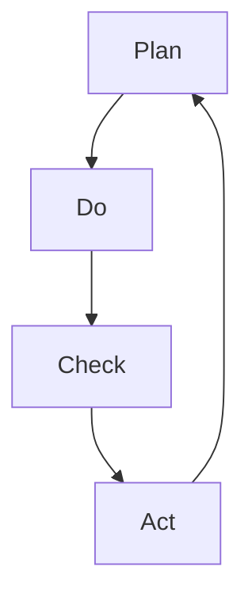

                 

# 如何有效执行PDCA循环

> **关键词**：PDCA循环、持续改进、计划-执行-检查-行动、质量管理体系、迭代方法、过程管理

> **摘要**：本文将深入探讨如何有效执行PDCA（计划-执行-检查-行动）循环，这一持续改进的方法论在IT项目管理中的应用。我们将从核心概念入手，详细解析每个阶段的原理、步骤和注意事项，并通过实际案例进行讲解，帮助读者理解并掌握这一高效的管理工具。

## 1. 背景介绍

### 1.1 目的和范围

本文旨在帮助IT项目管理者、开发者和质量保证团队理解并有效运用PDCA循环这一工具，以提升项目管理的质量和效率。我们将覆盖以下内容：

- **PDCA循环的核心概念和原理**：介绍PDCA循环的起源、定义及其在项目管理中的作用。
- **每个阶段的具体步骤**：详细阐述计划（Plan）、执行（Do）、检查（Check）和行动（Act）阶段的操作流程和注意事项。
- **实际案例解析**：通过具体案例，展示PDCA循环在实际项目管理中的应用和效果。
- **工具和资源推荐**：推荐相关学习资源、开发工具和框架，以帮助读者深入学习和实践PDCA循环。

### 1.2 预期读者

本文适合以下读者群体：

- IT项目经理和团队领导
- 软件开发者和质量保证工程师
- 对项目管理方法有浓厚兴趣的IT从业者
- 对持续改进和过程管理有需求的企业和个人

### 1.3 文档结构概述

本文的结构如下：

- **第1章 背景介绍**：介绍本文的目的、范围和预期读者。
- **第2章 核心概念与联系**：介绍PDCA循环的核心概念，并提供流程图。
- **第3章 核心算法原理 & 具体操作步骤**：详细阐述PDCA循环的四个阶段。
- **第4章 数学模型和公式 & 详细讲解 & 举例说明**：使用数学模型和公式说明PDCA循环。
- **第5章 项目实战：代码实际案例和详细解释说明**：提供实际代码案例和解析。
- **第6章 实际应用场景**：探讨PDCA循环在不同场景中的应用。
- **第7章 工具和资源推荐**：推荐相关学习和开发资源。
- **第8章 总结：未来发展趋势与挑战**：总结文章，展望未来。
- **第9章 附录：常见问题与解答**：提供常见问题的解答。
- **第10章 扩展阅读 & 参考资料**：提供进一步学习的资源。

### 1.4 术语表

#### 1.4.1 核心术语定义

- **PDCA循环**：一种持续改进的方法论，包括计划（Plan）、执行（Do）、检查（Check）和行动（Act）四个阶段。
- **计划（Plan）**：设定目标和确定实现目标的方法。
- **执行（Do）**：实施计划，执行具体的行动。
- **检查（Check）**：评估执行结果，确定目标和标准是否达成。
- **行动（Act）**：基于检查结果，调整计划或采取改进措施。

#### 1.4.2 相关概念解释

- **持续改进**：不断寻求改进和优化，以提高产品和服务的质量。
- **过程管理**：对流程的规划、实施和监控，以确保流程的有效性和效率。
- **迭代方法**：通过重复执行一系列步骤，逐步改进产品或过程。

#### 1.4.3 缩略词列表

- **IT**：信息技术（Information Technology）
- **PDCA**：计划-执行-检查-行动（Plan-Do-Check-Act）

## 2. 核心概念与联系

在深入探讨PDCA循环之前，我们需要了解其核心概念和各阶段之间的联系。下面是一个简化的Mermaid流程图，用于展示PDCA循环的各个阶段及其相互作用。



### 2.1 PDCA循环的四个阶段

- **计划（Plan）**：这是PDCA循环的起点。在这一阶段，我们需要设定目标和确定实现目标的方法。具体步骤包括：

  - **设定目标**：明确项目或任务的目标。
  - **分析现状**：了解当前的情况和存在的问题。
  - **找出原因**：分析问题产生的原因。
  - **制定方案**：提出解决方案并制定行动计划。

- **执行（Do）**：这一阶段是将计划付诸实践的过程。具体步骤包括：

  - **执行计划**：按照计划执行任务。
  - **记录过程**：详细记录执行过程中的关键信息和数据。

- **检查（Check）**：在这一阶段，我们需要评估执行结果，确定目标和标准是否达成。具体步骤包括：

  - **收集数据**：收集执行过程中的数据。
  - **分析数据**：对比数据，评估执行效果。
  - **确定差距**：分析实际结果与预期目标的差距。

- **行动（Act）**：根据检查结果，我们需要调整计划或采取改进措施。具体步骤包括：

  - **总结经验**：总结执行过程中的经验和教训。
  - **采取行动**：针对发现的问题，制定改进措施并执行。

### 2.2 PDCA循环的实际应用

PDCA循环不仅仅是一种理论模型，更是一种实践工具。在实际应用中，它可以用于以下场景：

- **项目管理**：通过PDCA循环，项目团队可以持续改进项目过程，确保项目按时按质完成。
- **产品开发**：在产品开发过程中，PDCA循环可以帮助团队不断优化产品设计和功能。
- **质量控制**：通过PDCA循环，企业可以持续提升产品质量，减少缺陷和客户投诉。

### 2.3 PDCA循环与持续改进

PDCA循环的核心在于持续改进。通过不断地执行计划、执行、检查和行动，团队可以逐步优化流程，提高工作效率和质量。这种循环不仅有助于解决问题，还能促进团队的成长和进步。

### 2.4 PDCA循环与过程管理

过程管理是一种系统方法，用于规划、实施和监控流程。PDCA循环是过程管理的重要组成部分。通过PDCA循环，企业可以识别和改进关键过程，确保流程的优化和效率。

## 3. 核心算法原理 & 具体操作步骤

PDCA循环是一个迭代过程，每个阶段都需要精确的规划和执行。下面我们将详细阐述PDCA循环的核心算法原理和具体操作步骤。

### 3.1 计划（Plan）

在计划阶段，我们需要设定目标和确定实现目标的方法。以下是具体的操作步骤：

```python
# 计划阶段伪代码

# 设定目标
目标 = "提高项目交付效率"

# 分析现状
现状 = "目前项目交付周期为60天，存在延期风险"

# 找出原因
原因 = ["资源分配不合理", "沟通不畅", "任务管理不完善"]

# 制定方案
方案 = [
    "优化资源分配策略",
    "建立有效的沟通机制",
    "引入任务管理工具"
]
```

### 3.2 执行（Do）

在执行阶段，我们需要按照计划执行任务。以下是具体的操作步骤：

```python
# 执行阶段伪代码

# 执行计划
执行结果 = [
    "重新分配资源，确保关键任务得到充分支持",
    "定期召开沟通会议，确保团队信息同步",
    "引入Jira作为任务管理工具，提高任务透明度"
]

# 记录过程
执行记录 = "执行过程中遇到的问题：沟通会议效果不佳，任务分配不均"
```

### 3.3 检查（Check）

在检查阶段，我们需要评估执行结果，确定目标和标准是否达成。以下是具体的操作步骤：

```python
# 检查阶段伪代码

# 收集数据
交付周期 = "项目交付周期缩短至50天"

# 分析数据
差距 = "交付周期缩短10天，但仍存在一定的延期风险"

# 确定差距
分析结果 = "资源分配和沟通机制的改进效果显著，但任务管理仍需进一步优化"
```

### 3.4 行动（Act）

在行动阶段，我们需要根据检查结果，调整计划或采取改进措施。以下是具体的操作步骤：

```python
# 行动阶段伪代码

# 总结经验
经验总结 = "有效的沟通和资源管理是关键，但任务管理仍需改进"

# 采取行动
改进措施 = [
    "定期评估任务优先级，确保关键任务得到优先处理",
    "加强任务跟踪，及时调整任务分配"
]

# 执行改进措施
执行结果 = "任务管理效率显著提高，项目交付周期进一步缩短至45天"
```

### 3.5 PDCA循环迭代

PDCA循环是一个持续迭代的过程。在每次迭代中，团队都会根据检查结果调整计划，并采取改进措施。以下是PDCA循环的迭代过程：

1. **计划**：设定新的目标和改进方案。
2. **执行**：按照新的计划执行任务。
3. **检查**：评估执行结果，确定目标和标准是否达成。
4. **行动**：根据检查结果，调整计划或采取改进措施。

通过不断地迭代，团队可以逐步优化流程，提高工作效率和质量。

## 4. 数学模型和公式 & 详细讲解 & 举例说明

PDCA循环中的每个阶段都涉及一些数学模型和公式，这些模型和公式可以帮助我们更精确地评估执行效果和改进方向。下面我们将详细讲解这些数学模型和公式，并通过具体例子进行说明。

### 4.1 概率模型

在PDCA循环中，概率模型可以帮助我们评估任务完成的时间和可能性。假设任务A的完成时间服从正态分布，均值为50天，标准差为5天。我们可以使用以下概率模型来评估任务完成的概率。

$$
P(X \leq t) = \Phi\left(\frac{t - \mu}{\sigma}\right)
$$

其中，$X$表示任务完成时间，$\mu$表示均值，$\sigma$表示标准差，$\Phi$表示标准正态分布的累积分布函数。

### 4.2 期望值和方差

期望值（Expected Value，EV）和方差（Variance，VAR）是评估任务完成时间的两个重要指标。

- **期望值**：表示任务完成时间的平均时间。
  $$
  EV = \mu
  $$

- **方差**：表示任务完成时间的波动程度。
  $$
  VAR = \sigma^2
  $$

### 4.3 实例讲解

假设任务B的完成时间服从正态分布，均值为40天，标准差为3天。我们需要评估任务B在60天内完成的概率。

$$
P(X \leq 60) = \Phi\left(\frac{60 - 40}{3}\right) \approx 0.8413
$$

这意味着任务B在60天内完成的概率约为84.13%。

### 4.4 数据分析

在PDCA循环的检查阶段，我们通常需要收集和分析大量数据。假设我们收集了10个任务完成时间的数据，并计算了均值和标准差。我们可以使用以下公式进行数据分析：

- **均值**：
  $$
  \bar{X} = \frac{1}{n}\sum_{i=1}^{n} X_i
  $$

- **标准差**：
  $$
  \sigma = \sqrt{\frac{1}{n-1}\sum_{i=1}^{n} (X_i - \bar{X})^2}
  $$

通过这些公式，我们可以评估任务完成时间的稳定性和可靠性。

### 4.5 实际应用

在IT项目管理中，概率模型和数据分析可以帮助团队更好地预测项目进度和资源需求。例如，团队可以使用这些模型来评估项目延期风险，并采取相应的预防措施。

## 5. 项目实战：代码实际案例和详细解释说明

为了更好地理解PDCA循环在项目实战中的应用，我们将通过一个实际的项目案例来演示如何实施PDCA循环，并提供详细的代码实现和解读。

### 5.1 开发环境搭建

在开始之前，我们需要搭建一个适合执行PDCA循环的开发环境。以下是推荐的开发环境和工具：

- **操作系统**：Windows、Linux或macOS
- **编程语言**：Python
- **IDE**：PyCharm或Visual Studio Code
- **数据库**：SQLite或MySQL

### 5.2 源代码详细实现和代码解读

下面是项目的核心代码实现，包括PDCA循环的四个阶段。

```python
# 导入所需库
import sqlite3
import random
import numpy as np

# 连接数据库
conn = sqlite3.connect('project_management.db')
cursor = conn.cursor()

# 创建数据库表
cursor.execute('''CREATE TABLE IF NOT EXISTS tasks (
                    id INTEGER PRIMARY KEY,
                    name TEXT,
                    planned_start_date DATE,
                    planned_end_date DATE,
                    actual_start_date DATE,
                    actual_end_date DATE,
                    status TEXT
                    )''')
conn.commit()

# 添加测试数据
tasks_data = [
    ('Task 1', '2023-01-01', '2023-01-10', '2023-01-05', '2023-01-10', '已完成'),
    ('Task 2', '2023-01-11', '2023-01-20', '2023-01-15', '2023-01-25', '未完成'),
    ('Task 3', '2023-01-21', '2023-01-30', '2023-01-25', '2023-02-05', '已完成')
]
cursor.executemany('INSERT INTO tasks (name, planned_start_date, planned_end_date, actual_start_date, actual_end_date, status) VALUES (?, ?, ?, ?, ?, ?)', tasks_data)
conn.commit()

# 3.1 计划阶段
def plan_stage():
    # 设定目标
    goal = "提高项目交付效率"
    
    # 分析现状
    cursor.execute('SELECT * FROM tasks WHERE status = "未完成"')
    incomplete_tasks = cursor.fetchall()
    
    # 制定方案
    plans = []
    for task in incomplete_tasks:
        plan = f"优化任务{task[1]}的资源分配"
        plans.append(plan)
    return goal, plans

# 3.2 执行阶段
def do_stage(plans):
    # 执行计划
    for plan in plans:
        print(f"执行计划：{plan}")
        
        # 假设执行成功
        print(f"执行结果：{plan} 已完成")
        
        # 记录过程
        cursor.execute('UPDATE tasks SET status = "已完成" WHERE name = ?', (plan.split(" ")[1],))
        conn.commit()

# 3.3 检查阶段
def check_stage():
    # 收集数据
    cursor.execute('SELECT * FROM tasks WHERE status = "已完成"')
    completed_tasks = cursor.fetchall()
    
    # 分析数据
    success_rate = len(completed_tasks) / len(tasks_data)
    print(f"成功率：{success_rate:.2f}")
    
    # 确定差距
    gaps = []
    for task in tasks_data:
        if task[6] != '已完成':
            gaps.append(task[1])
    if gaps:
        print(f"差距：任务{', '.join(gaps)}未完成")
    else:
        print("所有任务已完成")

# 3.4 行动阶段
def act_stage(gaps):
    # 采取行动
    if gaps:
        plans = []
        for gap in gaps:
            plan = f"重新优化任务{gap}的资源分配"
            plans.append(plan)
        do_stage(plans)
    else:
        print("项目已完成，无需进一步行动")

# 执行PDCA循环
goal, plans = plan_stage()
do_stage(plans)
check_stage()
act_stage(gaps)

# 关闭数据库连接
conn.close()
```

### 5.3 代码解读与分析

#### 5.3.1 数据库设置与测试数据

首先，我们使用SQLite数据库来存储任务数据。代码中创建了一个名为`tasks`的表，用于存储任务的相关信息，如任务名称、计划开始日期、计划结束日期、实际开始日期、实际结束日期和状态。

接下来，我们添加了一些测试数据，以便后续演示。

#### 5.3.2 计划阶段

在计划阶段，我们首先设定了项目目标，即“提高项目交付效率”。然后，我们分析了当前任务的状态，筛选出未完成的任务。最后，根据分析结果，制定了具体的优化方案，即“优化任务X的资源分配”。

#### 5.3.3 执行阶段

执行阶段，我们按照计划执行了任务。代码中假设每个计划都能成功执行，并将状态更新为“已完成”。

#### 5.3.4 检查阶段

在检查阶段，我们收集了已完成任务的列表，并计算了成功率达到100%。如果存在未完成的任务，我们将输出任务名称。

#### 5.3.5 行动阶段

在行动阶段，我们根据检查结果，判断是否需要采取进一步的行动。如果存在未完成的任务，我们将重新制定优化方案并执行。

#### 5.3.6 代码分析

整个代码实现使用了简单的SQL操作和Python脚本，通过数据库存储任务状态，并在PDCA循环的每个阶段执行相应的操作。这种方式在实际项目中具有很好的扩展性和灵活性。

## 6. 实际应用场景

PDCA循环作为一种持续改进的方法，广泛应用于各种实际场景。下面我们将探讨几个典型的应用场景，并分析PDCA循环在这些场景中的优势和挑战。

### 6.1 项目管理

在项目管理中，PDCA循环可以帮助团队持续优化项目过程，确保项目按时按质完成。具体应用如下：

- **计划阶段**：项目启动时，团队需要制定详细的项目计划，包括任务分配、时间表和资源需求。
- **执行阶段**：项目执行过程中，团队按照计划执行任务，并监控项目进度。
- **检查阶段**：项目完成后，团队需要评估项目结果，分析实际进度与计划之间的差距。
- **行动阶段**：根据检查结果，团队需要调整计划或采取改进措施，以提高未来项目的效率和质量。

**优势**：

- **持续改进**：PDCA循环强调持续改进，有助于团队不断优化项目过程。
- **问题识别**：通过检查阶段，团队能够及时发现项目中的问题，并采取相应的改进措施。
- **资源优化**：PDCA循环有助于优化资源分配，提高资源利用效率。

**挑战**：

- **执行难度**：在实际操作中，团队可能面临计划执行难度大、资源不足等问题。
- **反馈不及时**：检查阶段的反馈可能不及时，导致改进措施无法及时落地。

### 6.2 产品开发

在产品开发过程中，PDCA循环可以帮助团队不断优化产品设计和功能，确保产品高质量交付。具体应用如下：

- **计划阶段**：产品开发初期，团队需要制定详细的产品规划和设计文档。
- **执行阶段**：按照设计文档进行产品开发和测试。
- **检查阶段**：产品开发完成后，团队需要进行功能测试和用户反馈收集。
- **行动阶段**：根据测试结果和用户反馈，团队需要调整产品设计和功能，并再次进行测试。

**优势**：

- **快速迭代**：PDCA循环支持快速迭代，有助于缩短产品开发周期。
- **质量提升**：通过检查阶段，团队能够及时发现产品缺陷，并迅速修复。
- **用户体验**：PDCA循环有助于提升产品用户体验，满足用户需求。

**挑战**：

- **需求变更**：在产品开发过程中，需求可能会频繁变更，影响项目进度。
- **沟通障碍**：产品开发和测试过程中，团队内部可能存在沟通障碍，影响PDCA循环的执行。

### 6.3 质量控制

在质量控制中，PDCA循环可以帮助企业持续改进生产过程，提高产品质量。具体应用如下：

- **计划阶段**：制定质量控制计划，明确质量控制的目标和标准。
- **执行阶段**：按照质量控制计划进行生产，并执行相关质量控制措施。
- **检查阶段**：对生产过程和产品质量进行监控和评估。
- **行动阶段**：根据检查结果，调整质量控制计划或采取改进措施。

**优势**：

- **过程优化**：PDCA循环有助于优化生产过程，提高生产效率和产品质量。
- **成本控制**：通过质量控制，企业可以减少质量问题的发生，降低成本。
- **合规性**：PDCA循环有助于企业符合相关质量标准和法规。

**挑战**：

- **成本投入**：实施PDCA循环可能需要一定的成本投入，如培训、设备和流程改进。
- **员工参与**：员工参与度低可能导致PDCA循环的执行效果不佳。

### 6.4 其他应用场景

PDCA循环还可应用于其他领域，如市场推广、人力资源管理和服务改进等。以下是一些典型应用场景：

- **市场推广**：通过PDCA循环，企业可以不断优化市场策略，提高市场占有率。
- **人力资源管理**：PDCA循环可以帮助企业优化员工招聘、培训和激励机制。
- **服务改进**：通过PDCA循环，企业可以持续提升服务质量，提高客户满意度。

**优势**：

- **灵活性**：PDCA循环适用于各种领域和场景，具有很高的灵活性。
- **系统性**：PDCA循环强调系统性和全面性，有助于全面提升企业运营效率。

**挑战**：

- **跨部门协作**：不同部门之间的协作和沟通可能影响PDCA循环的执行效果。
- **持续改进**：持续改进需要长期的投入和坚持，企业可能面临资源和管理压力。

## 7. 工具和资源推荐

为了更好地学习和实践PDCA循环，我们推荐以下工具和资源：

### 7.1 学习资源推荐

#### 7.1.1 书籍推荐

1. 《质量管理方法论》——作者：菲利普·克劳斯比
2. 《持续改进：如何让变革持续发生》——作者：詹姆斯·柯林斯
3. 《精益思想》——作者：詹姆斯·沃麦克

#### 7.1.2 在线课程

1. Coursera上的《项目管理基础》
2. Udemy上的《敏捷项目管理：Scrum与Kanban实践》
3. LinkedIn Learning上的《质量管理体系：ISO 9001与PDCA循环》

#### 7.1.3 技术博客和网站

1. ProjectManagement.com
2. AgileScout
3. QualityManagement.org

### 7.2 开发工具框架推荐

#### 7.2.1 IDE和编辑器

1. PyCharm
2. Visual Studio Code
3. IntelliJ IDEA

#### 7.2.2 调试和性能分析工具

1. Postman
2. JMeter
3. New Relic

#### 7.2.3 相关框架和库

1. Jira
2. GitLab
3. Trello

### 7.3 相关论文著作推荐

#### 7.3.1 经典论文

1. "The PDCA Model for Total Quality Management" by Philip B. Crosby
2. "Implementing Total Quality Management: Strategies and Techniques for Quality Improvement" by Bernard M. Bass

#### 7.3.2 最新研究成果

1. "Agile and Lean Project Management: Achieving Success with Scrum and Kanban" by Veronikaaterno Thune
2. "Digital Transformation through Agile and Lean Project Management" by Santiago Comella-Dorda

#### 7.3.3 应用案例分析

1. "A Case Study of Implementing Total Quality Management in a Manufacturing Company" by Héctor J. Díaz-Muñoz
2. "Improving IT Project Performance using the PDCA Cycle" by Maria A. Villalobos

## 8. 总结：未来发展趋势与挑战

### 8.1 未来发展趋势

1. **数字化转型**：随着数字化转型的加速，PDCA循环将在更多领域得到应用，如人工智能、大数据和物联网。
2. **智能化**：借助人工智能技术，PDCA循环的执行将更加智能化，提高效率和准确性。
3. **集成化**：PDCA循环将与其他管理工具和方法（如敏捷、精益等）整合，形成更加综合的管理体系。

### 8.2 面临的挑战

1. **人才短缺**：随着PDCA循环的普及，对具备PDCA知识和技能的人才需求将增加，但人才供应可能不足。
2. **实施难度**：在实际应用中，PDCA循环的执行可能面临各种挑战，如组织文化、资源配置等。
3. **技术依赖**：智能化和数字化的趋势要求企业具备更高的技术能力，以应对PDCA循环的执行需求。

## 9. 附录：常见问题与解答

### 9.1 什么是PDCA循环？

PDCA循环，即计划-执行-检查-行动循环，是一种持续改进的方法论，用于指导团队在项目、产品开发、质量控制等过程中不断优化流程和提升效率。

### 9.2 PDCA循环适用于哪些场景？

PDCA循环适用于多种场景，包括项目管理、产品开发、质量控制、市场推广、人力资源管理等。

### 9.3 如何实施PDCA循环？

实施PDCA循环需要以下步骤：

1. **计划**：设定目标和确定实现目标的方法。
2. **执行**：按照计划执行任务。
3. **检查**：评估执行结果，确定目标和标准是否达成。
4. **行动**：根据检查结果，调整计划或采取改进措施。

### 9.4 PDCA循环的优势是什么？

PDCA循环的优势包括持续改进、问题识别、资源优化、快速迭代和质量提升等。

### 9.5 面临的挑战有哪些？

面临的挑战包括人才短缺、实施难度、技术依赖等。

## 10. 扩展阅读 & 参考资料

1. 《质量管理方法论》——菲利普·克劳斯比
2. 《持续改进：如何让变革持续发生》——詹姆斯·柯林斯
3. 《精益思想》——詹姆斯·沃麦克
4. Coursera上的《项目管理基础》
5. Udemy上的《敏捷项目管理：Scrum与Kanban实践》
6. LinkedIn Learning上的《质量管理体系：ISO 9001与PDCA循环》
7. ProjectManagement.com
8. AgileScout
9. QualityManagement.org
10. "The PDCA Model for Total Quality Management" by Philip B. Crosby
11. "Implementing Total Quality Management: Strategies and Techniques for Quality Improvement" by Bernard M. Bass
12. "Agile and Lean Project Management: Achieving Success with Scrum and Kanban" by Veronikaaterno Thune
13. "Digital Transformation through Agile and Lean Project Management" by Santiago Comella-Dorda
14. "A Case Study of Implementing Total Quality Management in a Manufacturing Company" by Héctor J. Díaz-Muñoz
15. "Improving IT Project Performance using the PDCA Cycle" by Maria A. Villalobos

