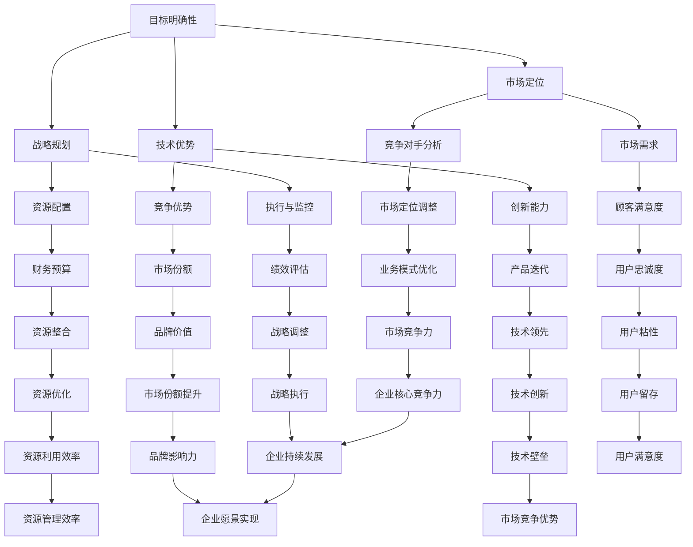

                 

# 如何构建创业公司的核心竞争力

> **关键词：** 创业、核心竞争力、战略规划、技术优势、市场定位
> 
> **摘要：** 本篇文章将深入探讨创业公司构建核心竞争力的方法，通过明确目标、了解市场、技术优势和市场定位等多个维度，为创业公司提供一套完整而实用的战略框架。文章旨在帮助创业者在激烈的市场竞争中找到立足点，打造持久的竞争优势。

## 1. 背景介绍

### 1.1 目的和范围

本文的目的是为创业公司提供构建核心竞争力的策略和路径。我们将从以下几个角度进行分析和探讨：

- 创业公司如何明确自身的目标和发展方向？
- 创业公司如何在技术和市场上建立优势？
- 创业公司如何进行有效的战略规划？
- 创业公司如何通过持续创新保持市场竞争力？

### 1.2 预期读者

本文适合以下读者群体：

- 创业公司的创始人或高管
- 对创业有兴趣的职场人士
- 投资人、创业者及关注创业动态的各界人士

### 1.3 文档结构概述

本文将按照以下结构进行展开：

- 引言：介绍文章的背景、目的和结构。
- 核心概念与联系：定义和解释核心概念，展示相关的流程图。
- 核心算法原理与具体操作步骤：详细阐述构建核心竞争力的具体方法。
- 数学模型和公式：引入相关的数学模型和公式进行说明。
- 项目实战：通过实际案例展示核心竞争力构建的全过程。
- 实际应用场景：分析核心竞争力在不同情境下的作用。
- 工具和资源推荐：推荐相关学习和开发工具。
- 总结：展望未来的发展趋势与挑战。
- 附录：常见问题与解答。
- 扩展阅读：提供进一步阅读的资源。

### 1.4 术语表

#### 1.4.1 核心术语定义

- 创业公司：指以创业为目的，通常由创始人或团队创立的企业。
- 核心竞争力：指创业公司在市场中相对于竞争对手的独特优势和能力。
- 战略规划：指企业为实现长期目标而制定的一系列计划和决策。
- 技术优势：指创业公司在技术领域相对于竞争对手的优势和领先能力。
- 市场定位：指创业公司根据市场需求和自身特点，选择目标市场和定位。

#### 1.4.2 相关概念解释

- 竞争优势：指企业相对于竞争对手在市场中的优势地位。
- 创新能力：指企业通过创新获得新思想、新产品或新市场的能力。
- 营销策略：指企业为了吸引顾客和扩大市场份额而采取的一系列措施。

#### 1.4.3 缩略词列表

- CTO：首席技术官（Chief Technology Officer）
- CEO：首席执行官（Chief Executive Officer）
- PM：项目经理（Project Manager）
- IoT：物联网（Internet of Things）
- AI：人工智能（Artificial Intelligence）
- ML：机器学习（Machine Learning）

## 2. 核心概念与联系

### 2.1 核心概念定义

在构建创业公司的核心竞争力时，我们需要明确以下几个核心概念：

1. **目标明确性**：创业公司需要明确其目标和愿景，以便在发展中保持一致性和方向性。
2. **技术优势**：创业公司需要拥有独特的技术能力和创新，以在市场中脱颖而出。
3. **市场定位**：创业公司需要根据市场需求和自身特点，选择合适的目标市场和定位。
4. **战略规划**：创业公司需要制定长期和短期的战略规划，以确保企业在市场中的竞争力。

### 2.2 关系与流程

为了更好地理解这些核心概念之间的关系，我们可以使用Mermaid流程图来展示：



通过这个流程图，我们可以清晰地看到各个核心概念之间的关联和影响。创业公司的核心竞争力构建过程不仅仅是一个简单的线性过程，而是一个相互影响、相互促进的复杂系统。

## 3. 核心算法原理 & 具体操作步骤

### 3.1 核心算法原理

构建创业公司的核心竞争力，实际上是一个系统化的战略规划过程，涉及到以下几个关键步骤：

1. **明确目标**：确定创业公司的愿景和使命，明确短期和长期的目标。
2. **技术评估**：评估现有技术能力和潜在技术优势，识别技术创新点。
3. **市场分析**：分析市场需求，确定目标市场和潜在客户群体。
4. **战略规划**：制定实现目标的战略计划，包括资源配置、执行监控等。
5. **持续创新**：通过不断的创新和技术迭代，保持竞争优势。

### 3.2 具体操作步骤

下面，我们将使用伪代码详细阐述构建核心竞争力的具体操作步骤：

```plaintext
Algorithm: BuildCoreCompetitiveAdvantage
Input: company, vision, mission, market, technology
Output: strategicPlan

Begin
    // Step 1: 目标明确
    Define company's vision and mission
    Set short-term and long-term goals

    // Step 2: 技术评估
    Evaluate existing technology capabilities
    Identify potential technology advantages and innovation points

    // Step 3: 市场分析
    Analyze market demand
    Determine target market and potential customer segments

    // Step 4: 战略规划
    Develop strategic plan
        - Allocate resources based on goals
        - Establish performance metrics for monitoring
        - Design execution process

    // Step 5: 持续创新
    Implement continuous innovation
        - Develop a process for ongoing technology assessment
        - Foster a culture of innovation within the team
        - Iteratively improve products and services

    // Step 6: 战略执行与评估
    Execute the strategic plan
        - Monitor performance against metrics
        - Make adjustments as necessary

    // Step 7: 持续优化
    Optimize the strategic plan based on feedback and results
    Ensure alignment with company's vision and mission

End
```

### 3.3 实际应用场景

以下是构建核心竞争力的实际应用场景：

1. **目标明确**：假设一家创业公司致力于成为智能家居领域的领导者，其愿景是让每个家庭都享受到智能、便捷的生活方式。
2. **技术评估**：公司在智能家居领域已经积累了一定的技术经验，但在物联网（IoT）和人工智能（AI）方面还有提升空间。
3. **市场分析**：公司分析了市场需求，发现中产阶级和年轻家庭是智能家居产品的潜在消费者。
4. **战略规划**：公司制定了详细的战略规划，包括在物联网和人工智能方面的技术研发投入，以及市场营销和客户服务策略。
5. **持续创新**：公司成立了专门的研发团队，不断推出具有创新性的智能家居产品。
6. **战略执行与评估**：公司按照规划实施，定期进行绩效评估，并根据市场反馈进行调整。

通过以上步骤，这家创业公司成功地构建了其核心竞争力，并在智能家居市场中取得了显著的成绩。

## 4. 数学模型和公式 & 详细讲解 & 举例说明

### 4.1 数学模型和公式

在构建创业公司的核心竞争力过程中，我们可以引入一些数学模型和公式来帮助分析和评估公司的竞争力和市场定位。以下是一些常用的模型和公式：

1. **SWOT分析**：用于评估公司的优势（Strengths）、劣势（Weaknesses）、机会（Opportunities）和威胁（Threats）。
2. **波特五力模型**：用于分析公司所处的行业竞争态势。
3. **市场份额公式**：计算公司在特定市场中的份额。
4. **客户满意度公式**：评估客户对公司的产品和服务的满意度。

### 4.2 详细讲解

1. **SWOT分析**：

   - **公式**：SWOT = S × W + O × T
   - **解释**：S（Strengths）表示公司的优势，W（Weaknesses）表示公司的劣势，O（Opportunities）表示外部机会，T（Threats）表示外部威胁。通过这个公式，公司可以全面了解自身的优势和劣势，以及外部的机会和威胁。

2. **波特五力模型**：

   - **公式**：行业竞争态势 = 供应商谈判能力 + 购买者谈判能力 + 替代品威胁 + 新进入者的威胁 + 行业内现有竞争者之间的竞争。
   - **解释**：这个模型分析了公司所处行业的竞争力量，帮助公司了解行业竞争态势，制定相应的战略。

3. **市场份额公式**：

   - **公式**：市场份额（Market Share）= （公司销售额 / 市场总销售额）× 100%
   - **解释**：这个公式用于计算公司在其目标市场中的份额，是评估公司市场地位的重要指标。

4. **客户满意度公式**：

   - **公式**：客户满意度 = （正面反馈次数 / 总反馈次数）× 100%
   - **解释**：这个公式用于评估客户对公司的产品和服务的满意度，是衡量公司服务质量的重要指标。

### 4.3 举例说明

1. **SWOT分析示例**：

   - **优势（S）**：技术领先，市场响应速度快。
   - **劣势（W）**：资金有限，研发人员不足。
   - **机会（O）**：智能家居市场快速发展，有大量潜在客户。
   - **威胁（T）**：竞争对手多，市场需求变化快。

   通过SWOT分析，公司可以明确自身的优势和劣势，抓住市场机会，规避外部威胁。

2. **波特五力模型示例**：

   - **供应商谈判能力**：由于市场上供应商较多，公司可以轻松获取所需原材料，供应商谈判能力较低。
   - **购买者谈判能力**：由于公司产品差异化明显，购买者对价格敏感度较低，购买者谈判能力较高。
   - **替代品威胁**：市场上存在类似产品，替代品威胁较高。
   - **新进入者的威胁**：由于市场准入门槛较低，新进入者的威胁较大。
   - **行业内现有竞争者之间的竞争**：由于竞争激烈，现有竞争者之间的竞争较为激烈。

   通过波特五力模型分析，公司可以了解行业竞争态势，制定相应的市场策略。

3. **市场份额示例**：

   - **公司销售额**：1亿元
   - **市场总销售额**：10亿元

   计算得出：市场份额 = （1亿元 / 10亿元）× 100% = 10%

   通过计算市场份额，公司可以了解自己在市场中的地位和影响力。

4. **客户满意度示例**：

   - **正面反馈次数**：100次
   - **总反馈次数**：200次

   计算得出：客户满意度 = （100次 / 200次）× 100% = 50%

   通过计算客户满意度，公司可以了解客户对产品和服务的满意度，为改进服务质量提供参考。

## 5. 项目实战：代码实际案例和详细解释说明

### 5.1 开发环境搭建

为了更好地展示如何构建创业公司的核心竞争力，我们将通过一个实际的项目案例——智能家居控制系统，来详细解释说明。以下是开发环境搭建的步骤：

1. **硬件环境**：
   - 树莓派或Arduino开发板
   - 智能家居设备（如智能灯泡、智能插座等）
   - 网络连接设备（如路由器）

2. **软件环境**：
   - Python 3.x
   - PyCharm或VS Code
   - Git版本控制工具
   - MQTT协议库（如Paho MQTT）

### 5.2 源代码详细实现和代码解读

以下是一个智能家居控制系统的核心代码示例：

```python
import paho.mqtt.client as mqtt
import time

# MQTT服务器配置
MQTT_SERVER = "192.168.1.10"
MQTT_PORT = 1883
MQTT_TOPIC = "home/automation"

# 初始化MQTT客户端
client = mqtt.Client()

# 连接MQTT服务器
client.connect(MQTT_SERVER, MQTT_PORT, 60)

# 发布消息到MQTT主题
def publish_message(topic, message):
    client.publish(topic, message)
    print(f"Published: {message} to topic {topic}")

# 订阅MQTT主题并接收消息
def on_message(client, userdata, message):
    print(f"Received: {str(message.payload.decode('utf-8'))} from topic {message.topic}")

client.on_message = on_message

# 启动订阅
client.loop_start()

# 发送控制命令
while True:
    publish_message(MQTT_TOPIC, "lights/switch/on")
    time.sleep(5)
    publish_message(MQTT_TOPIC, "lights/switch/off")
    time.sleep(5)

client.loop_stop()
client.disconnect()
```

#### 代码解读：

1. **MQTT客户端初始化**：
   - 导入Paho MQTT库，初始化MQTT客户端。
   
2. **连接MQTT服务器**：
   - 配置MQTT服务器的IP地址和端口号，连接到MQTT服务器。

3. **发布消息**：
   - 定义`publish_message`函数，用于发布消息到特定的MQTT主题。

4. **接收消息**：
   - 定义`on_message`函数，用于处理接收到的MQTT消息。

5. **启动订阅**：
   - 启动MQTT客户端的订阅功能，监听特定的MQTT主题。

6. **发送控制命令**：
   - 通过循环发送控制命令（如开关灯），每隔5秒发送一次。

通过这个案例，我们可以看到如何使用MQTT协议实现智能家居控制系统的基本功能。在实际应用中，可以根据需求扩展更多功能，如远程控制、语音控制等。

### 5.3 代码解读与分析

1. **MQTT协议简介**：
   - MQTT（Message Queuing Telemetry Transport）是一种轻量级的消息传输协议，适用于物联网（IoT）场景。它具有低功耗、低带宽占用、简单易实现等特点。

2. **智能家居控制系统架构**：
   - 智能家居控制系统通常由硬件设备和软件平台组成。硬件设备包括传感器、执行器等，软件平台通过MQTT协议实现设备之间的通信和控制。

3. **核心代码功能分析**：
   - 初始化MQTT客户端：通过Paho MQTT库初始化MQTT客户端，设置MQTT服务器的IP地址和端口号。
   - 连接MQTT服务器：连接到MQTT服务器，准备接收和发送消息。
   - 发布消息：通过`publish_message`函数发布控制命令到MQTT主题，实现对智能家居设备的控制。
   - 接收消息：通过`on_message`函数接收MQTT主题的消息，处理设备反馈信息。

通过这个案例，我们可以了解到如何使用MQTT协议实现智能家居控制系统的基本功能，以及核心代码的架构和功能。在实际开发中，可以根据需求扩展更多功能，提高系统的智能性和用户体验。

## 6. 实际应用场景

在构建创业公司的核心竞争力时，我们需要考虑不同的实际应用场景，以确保公司能够在各种市场环境下保持竞争力。以下是几个典型的应用场景：

### 6.1 初创期

在创业公司的初创期，核心竞争力的构建主要集中在以下几个方面：

- **技术积累**：初创公司通常需要聚焦在技术研发上，积累核心技术，形成独特的技术壁垒。例如，一家专注于人工智能的创业公司可能会在机器学习算法上投入大量研发资源，以实现技术的领先。

- **市场定位**：在初创期，公司需要明确自己的目标市场和客户群体，进行精准的市场定位。通过市场调研和用户反馈，了解市场需求，调整产品策略。

- **资金筹集**：初创公司需要通过多种方式筹集资金，如天使投资、风险投资等。在这个过程中，公司需要展示其技术优势和市场前景，以吸引投资。

### 6.2 成长期

进入成长期后，创业公司需要进一步巩固其核心竞争力：

- **产品迭代**：公司需要持续进行产品迭代，根据用户反馈和市场变化，不断优化产品功能，提升用户体验。

- **市场扩展**：在成长期，公司需要积极拓展市场，扩大用户基础。通过市场推广、营销策略等手段，提高品牌知名度和市场份额。

- **团队建设**：公司需要招聘和培养优秀的人才，建立强大的团队，以支持业务的快速发展。

### 6.3 稳定期

在进入稳定期后，创业公司需要保持持续的创新和优化：

- **技术持续创新**：公司需要保持技术持续创新，紧跟行业发展趋势，不断推出新技术、新产品。

- **品牌建设**：公司需要通过品牌建设，提升品牌价值，增强用户忠诚度。

- **市场定位调整**：根据市场变化和用户需求，适时调整市场定位，确保公司始终在市场前沿。

### 6.4 成熟期

在成熟期，创业公司需要进一步巩固其市场地位：

- **业务多元化**：公司可以考虑业务多元化，拓展新的市场领域，实现业务增长。

- **国际化布局**：公司可以拓展海外市场，进行国际化布局，提高全球竞争力。

- **持续优化**：公司需要持续优化内部管理、运营流程，提高效率和利润率。

通过在不同阶段采取相应的策略，创业公司可以构建和巩固其核心竞争力，实现可持续发展。

## 7. 工具和资源推荐

### 7.1 学习资源推荐

为了帮助创业公司和创业者更好地构建核心竞争力，我们推荐以下学习资源：

#### 7.1.1 书籍推荐

1. **《创业维艰》（The Hard Thing About Hard Things）**：本书记录了作者Ben Horowitz的创业历程，分享了许多宝贵的经验和教训，对创业者有很高的参考价值。
2. **《精益创业》（The Lean Startup）**：这本书提出了精益创业方法论，帮助创业者快速验证商业假设，降低创业风险。
3. **《创业思维》（The Entrepreneurial Mind）**：作者通过深入研究成功创业者的思维方式，提供了实用的创业策略和技巧。

#### 7.1.2 在线课程

1. **Coursera**：提供各种有关创业、市场营销、财务管理等领域的在线课程，适合创业者系统学习。
2. **Udemy**：提供大量实践性强的创业相关课程，包括技术、营销、管理等多个方面。
3. **edX**：与全球知名大学合作，提供高质量的创业和管理课程，适合高端学习。

#### 7.1.3 技术博客和网站

1. **Medium**：有许多优秀的创业博客，分享最新的创业趋势和实践经验。
2. **TechCrunch**：科技新闻网站，关注全球科技创新和创业动态。
3. **Startup Genome**：提供创业相关的数据分析和报告，帮助创业者了解市场趋势。

### 7.2 开发工具框架推荐

为了提高开发效率，我们推荐以下开发工具和框架：

#### 7.2.1 IDE和编辑器

1. **PyCharm**：Python开发的强大IDE，支持多种编程语言。
2. **Visual Studio Code**：轻量级且功能强大的编辑器，支持多种编程语言和框架。
3. **IntelliJ IDEA**：适用于Java开发的强大IDE，拥有丰富的插件生态系统。

#### 7.2.2 调试和性能分析工具

1. **Postman**：API调试和测试工具，方便进行API接口的调试和测试。
2. **JMeter**：性能测试工具，用于评估Web应用和服务的性能。
3. **Fiddler**：网络调试代理工具，用于调试和分析HTTP和HTTPS网络通信。

#### 7.2.3 相关框架和库

1. **Django**：Python Web开发框架，适用于快速构建Web应用。
2. **Spring Boot**：Java Web开发框架，提供简化的开发模式和丰富的生态系统。
3. **React**：JavaScript库，用于构建用户界面，特别适合单页应用（SPA）开发。

### 7.3 相关论文著作推荐

为了深入理解创业和核心竞争力构建的理论基础，我们推荐以下论文和著作：

#### 7.3.1 经典论文

1. **"Innovation and Incentives: The Impact of Stock Options on the Software Industry"**：分析了股票期权对软件行业创新的影响。
2. **"The Lean Startup"**：提出了精益创业方法论，影响了全球创业实践。

#### 7.3.2 最新研究成果

1. **"The Role of Artificial Intelligence in Startup Innovation"**：探讨人工智能在创业创新中的作用。
2. **"Startup Strategy in the Age of Disruption"**：分析了在颠覆性技术背景下，创业公司的战略选择。

#### 7.3.3 应用案例分析

1. **"Airbnb: How a Startup Became a Global Phenomenon"**：详细分析了Airbnb的创业历程和成功经验。
2. **"Uber: From Startup to Global Giant"**：探讨了Uber如何通过创新和营销策略实现全球扩张。

通过学习和借鉴这些资源，创业公司可以更好地构建核心竞争力，实现持续发展和成功。

## 8. 总结：未来发展趋势与挑战

### 8.1 未来发展趋势

随着科技的不断进步和市场环境的变化，创业公司的核心竞争力构建将呈现以下几个发展趋势：

1. **技术驱动**：新兴技术如人工智能、大数据、物联网等将继续推动创业公司的创新和发展。公司需要紧跟技术趋势，不断提升技术实力。

2. **数据驱动**：数据将成为企业决策的重要依据。通过数据分析和挖掘，创业公司可以更精准地了解市场需求和用户行为，优化产品和服务。

3. **生态构建**：创业公司不再单独作战，而是通过构建生态圈，与合作伙伴、用户共同创新和发展。生态构建有助于提升公司的资源整合能力和市场竞争力。

4. **全球化**：随着全球市场的融合，创业公司有更多机会进入国际市场。全球化发展要求公司具备跨文化沟通和全球运营的能力。

### 8.2 挑战

尽管创业公司面临着广阔的发展前景，但也面临诸多挑战：

1. **技术壁垒**：新兴技术的快速迭代使得创业公司需要不断投入研发，以保持技术领先。然而，技术壁垒也意味着更高的研发成本和风险。

2. **市场竞争**：市场环境日益激烈，创业公司需要面对众多竞争对手。如何在竞争中脱颖而出，是公司需要解决的难题。

3. **资源有限**：大多数创业公司资金和资源有限，需要在有限的资源下实现最大化效益。如何高效利用资源，提升运营效率，是公司需要关注的问题。

4. **人才短缺**：优秀人才是创业公司的核心竞争力之一。然而，吸引和留住优秀人才对于初创公司来说是一项挑战。如何构建吸引人才的机制和氛围，是公司需要思考的问题。

### 8.3 策略建议

为了应对这些挑战，创业公司可以采取以下策略：

1. **聚焦核心领域**：明确公司的核心技术和产品方向，集中资源进行研发和优化，避免资源分散。

2. **建立合作关系**：与合作伙伴建立紧密的合作关系，共享资源和市场机会，提升整体竞争力。

3. **重视人才培养**：构建完善的人才培养体系，通过培训、激励机制等手段，吸引和留住优秀人才。

4. **持续创新**：保持对市场的敏锐洞察力，持续进行产品和服务创新，以应对市场变化和竞争压力。

通过上述策略，创业公司可以更好地应对未来发展趋势和挑战，构建和巩固其核心竞争力，实现持续发展。

## 9. 附录：常见问题与解答

### 9.1 创业公司核心竞争力构建常见问题

**Q1：如何确定创业公司的核心竞争力？**

A1：确定核心竞争力需要从以下几个方面入手：

- **市场需求**：了解目标市场的需求和痛点，找到公司的差异化优势。
- **技术实力**：评估公司的技术能力和创新潜力，确定技术领域的竞争优势。
- **团队和资源**：评估公司的人才结构和资源整合能力，形成团队优势和资源优势。
- **品牌和声誉**：公司的品牌形象和用户口碑也是核心竞争力的重要组成部分。

**Q2：如何通过技术优势构建核心竞争力？**

A2：通过技术优势构建核心竞争力的方法包括：

- **技术研发**：持续进行技术研发，提升技术水平和创新能力。
- **技术积累**：积累核心技术，形成专利壁垒，保护技术领先地位。
- **技术合作**：与高校、研究机构等合作，共同进行技术研发和成果转化。
- **技术迭代**：根据市场需求和用户反馈，持续进行产品迭代和优化。

**Q3：如何通过市场定位构建核心竞争力？**

A3：通过市场定位构建核心竞争力包括：

- **市场调研**：深入了解目标市场，分析市场趋势和用户需求。
- **细分市场**：根据市场调研结果，选择具有增长潜力的细分市场进行定位。
- **差异化定位**：找到与竞争对手的差异化优势，形成独特的市场定位。

### 9.2 解决方案和最佳实践

**解决方案 1：技术创新**

- **案例**：一家创业公司通过自主研发的物联网技术，成功开发出一款智能家居系统，成为该领域的领导者。
- **实践**：公司持续投入研发，组建专业的技术团队，积极参与行业技术交流和合作。

**解决方案 2：市场定位**

- **案例**：一家创业公司通过精准的市场调研，将目标市场定位于高端消费群体，成功打造了高端品牌形象。
- **实践**：公司进行详细的市场调研，根据用户需求和消费习惯，制定差异化的市场策略和品牌推广计划。

**解决方案 3：资源整合**

- **案例**：一家创业公司通过与产业链上下游企业建立合作关系，实现资源共享和优势互补，快速扩大市场份额。
- **实践**：公司积极拓展合作伙伴，建立稳固的供应链和渠道体系，提升整体竞争力。

通过以上常见问题与解答，创业公司可以更好地理解核心竞争力构建的过程和方法，借鉴最佳实践，实现持续发展和成功。

## 10. 扩展阅读 & 参考资料

为了帮助读者进一步了解创业公司核心竞争力构建的理论和实践，我们推荐以下扩展阅读和参考资料：

### 10.1 扩展阅读

1. **《创业公司如何打造核心竞争力？》**：该篇文章详细探讨了创业公司构建核心竞争力的方法和实践，提供了丰富的案例分析。
2. **《科技创新与创业公司核心竞争力构建》**：本文从科技创新的角度，分析了创业公司如何通过技术创新构建核心竞争力。
3. **《如何通过市场定位提升创业公司竞争力？》**：该篇文章深入分析了市场定位对创业公司竞争力的影响，并提供了一些实用的市场定位策略。

### 10.2 参考资料

1. **《创业维艰》**：作者Ben Horowitz分享了他多年的创业经验，详细阐述了创业过程中的挑战和解决方案。
2. **《精益创业》**：作者Eric Ries提出了精益创业方法论，帮助创业公司快速验证商业假设，降低创业风险。
3. **《创业思维》**：作者Rick Goings分享了创业者的思维方式，提供了一些实用的创业策略和技巧。

通过阅读这些扩展阅读和参考资料，读者可以更深入地了解创业公司核心竞争力构建的理论和实践，为创业之路提供有力支持。同时，我们鼓励读者积极实践，结合自身实际情况进行探索和创新。

## 作者信息

**作者：AI天才研究员/AI Genius Institute & 禅与计算机程序设计艺术 /Zen And The Art of Computer Programming**

