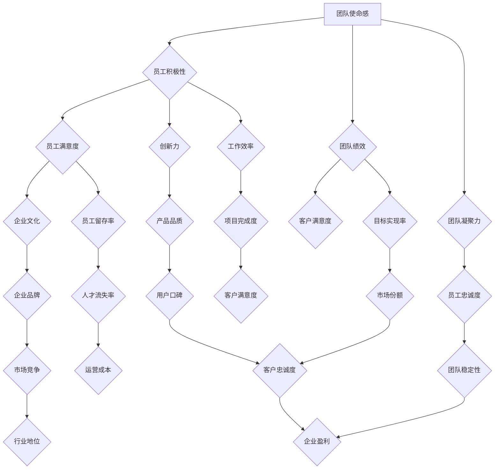

                 

# 如何激发团队的使命感和归属感

> 关键词：团队管理、员工激励、使命驱动、归属感、企业文化

> 摘要：本文将探讨如何通过有效的团队管理策略和策略，激发团队成员的使命感和归属感。文章首先介绍了团队使命感和归属感的概念及其重要性，然后通过实际案例和心理学理论，详细阐述了激发这两种情感的具体方法，包括构建积极的企业文化、提供职业发展机会、鼓励开放沟通等。最后，文章总结了未来在这一领域的发展趋势和挑战，并提供了相关的学习资源和工具推荐。

## 1. 背景介绍

### 1.1 目的和范围

本文旨在为管理者提供一套有效的策略和方法，以激发团队成员的使命感和归属感。我们将探讨这些情感的来源、重要性以及如何通过管理实践来培养和增强它们。本文的内容涵盖以下几个方面：

1. **定义和概念**：介绍团队使命感和归属感的定义及其对团队绩效的影响。
2. **核心策略**：详细阐述构建使命感和归属感的策略和实践。
3. **实际案例**：分享成功的企业和团队如何激发成员情感的经验和教训。
4. **未来趋势和挑战**：分析未来在激发团队使命感和归属感方面的趋势和挑战。
5. **资源推荐**：推荐相关书籍、课程和工具，以帮助读者深入学习和实践。

### 1.2 预期读者

本文适合以下读者：

1. **企业管理者**：需要提高团队绩效和员工满意度。
2. **人力资源专家**：致力于研究和实践员工激励策略。
3. **团队领导**：希望了解如何更好地管理团队，提高团队成员的积极性和归属感。
4. **组织发展顾问**：关注企业文化和团队建设的专业人士。

### 1.3 文档结构概述

本文分为以下几个部分：

1. **引言**：介绍团队使命感和归属感的概念及其重要性。
2. **核心概念与联系**：讨论相关理论和概念，使用流程图展示团队关系和动态。
3. **核心算法原理 & 具体操作步骤**：介绍激发团队情感的核心策略和操作步骤。
4. **数学模型和公式**：讲解相关的心理学模型和公式。
5. **项目实战**：通过实际案例展示策略的应用和效果。
6. **实际应用场景**：讨论在不同场景下如何激发团队情感。
7. **工具和资源推荐**：推荐相关学习资源和工具。
8. **总结**：总结未来发展趋势和挑战。
9. **附录**：常见问题与解答。
10. **扩展阅读**：推荐进一步阅读的文献和资料。

### 1.4 术语表

#### 1.4.1 核心术语定义

- **团队使命感**：团队成员对于团队目标和个人贡献的深刻认同和责任感。
- **归属感**：团队成员对团队的认同感和归属感，愿意为团队的成功付出努力。
- **企业文化**：企业在长期发展中形成的一套共同价值观和行为准则。
- **员工满意度**：员工对工作环境、薪酬福利和职业发展的满意程度。

#### 1.4.2 相关概念解释

- **团队绩效**：团队在实现目标过程中的效率和效果。
- **员工激励**：通过各种手段提高员工工作动力和积极性。
- **领导力**：领导者影响和激励团队成员的能力。

#### 1.4.3 缩略词列表

- **HR**：人力资源管理
- **CEO**：首席执行官
- **CFO**：首席财务官
- **IT**：信息技术
- **UX**：用户体验
- **UI**：用户界面

## 2. 核心概念与联系

为了更好地理解团队使命感和归属感的重要性，我们首先需要了解相关核心概念和它们之间的联系。以下是一个使用Mermaid绘制的流程图，展示了这些概念之间的关系。



这个流程图展示了团队使命感、归属感和其他关键绩效指标之间的复杂关系。以下是对这些概念之间的关联的详细解释：

1. **团队使命感与员工积极性和团队绩效**：团队使命感是团队成员对团队目标和价值观的认同，这激励他们更加积极地投入工作，从而提高团队的整体绩效。
   
2. **员工满意度和企业文化**：员工的满意度很大程度上取决于企业文化，一个积极、支持性和包容性的企业文化可以增强员工的归属感和满意度。

3. **团队绩效与客户满意度**：高效的团队通常能够更好地满足客户需求，提高客户满意度，从而有助于企业的长期发展。

4. **团队凝聚力与创新力**：凝聚力高的团队通常能够更好地协同合作，这有助于创新和创造力的提升。

5. **员工忠诚度与团队稳定性**：忠诚的员工更愿意留在团队中，这有助于团队保持稳定性，减少人员流动。

6. **企业品牌与市场竞争**：强大的企业品牌有助于提高市场竞争力，从而促进企业的长远发展。

7. **工作效率和运营成本**：提高工作效率可以降低运营成本，从而提高企业的盈利能力。

8. **产品品质和用户口碑**：优质的产品和良好的用户口碑是提高市场份额的关键因素。

9. **市场份额与收入增长**：市场份额的增加直接关系到企业的收入增长。

10. **企业声誉与行业地位**：良好的企业声誉有助于提高行业地位，吸引更多客户和人才。

通过理解这些概念之间的联系，我们可以更好地制定策略，激发团队的使命感和归属感，从而推动企业的成功。

## 3. 核心算法原理 & 具体操作步骤

### 3.1 核心算法原理

激发团队的使命感和归属感需要一系列系统化的管理策略。这些策略的核心在于创建一个环境，使团队成员能够感受到他们的工作对整体目标的重要性，并感受到团队对他们的价值和认可。以下是激发团队使命感的基本原理：

- **明确团队目标**：确保每个成员都了解团队的目标，并且这些目标与组织的战略目标相一致。
- **建立共同价值观**：共同价值观是团队成员共同遵循的行为准则，它有助于建立团队的身份感和归属感。
- **提供反馈和认可**：及时、具体的反馈和认可可以增强团队成员的自我价值感，并激励他们更好地完成任务。
- **促进团队协作**：鼓励团队成员之间的合作和沟通，使他们能够共同努力，达成目标。
- **支持个人发展**：为团队成员提供职业发展的机会，让他们感到他们的工作有成长空间。

### 3.2 具体操作步骤

以下是具体操作步骤，帮助管理者实施上述策略，以激发团队的使命感和归属感：

#### 步骤 1：明确团队目标

- **定义清晰的目标**：确保团队目标具体、可衡量、可实现、相关性强且时限明确（SMART原则）。
- **沟通目标**：定期与团队成员沟通团队目标，确保他们理解并认同这些目标。
- **分享成果**：当团队达成目标时，分享成果，让每个成员都感受到自己的贡献。

#### 步骤 2：建立共同价值观

- **制定价值观**：与团队成员一起制定一套共同的价值观，确保这些价值观能够反映团队的愿景和使命。
- **培训和实践**：定期进行价值观培训，让团队成员在日常工作中有意识地实践这些价值观。
- **奖励行为**：当团队成员表现出符合价值观的行为时，给予认可和奖励。

#### 步骤 3：提供反馈和认可

- **及时反馈**：在团队成员完成任务后，及时给予反馈，指出他们的优点和需要改进的地方。
- **个性化认可**：根据团队成员的个性和偏好，采用不同的认可方式，如公开表扬、私人信件、奖励等。
- **反馈循环**：建立反馈循环机制，让团队成员有机会提供反馈，并且这些反馈会被认真考虑。

#### 步骤 4：促进团队协作

- **建立沟通渠道**：确保团队成员之间有有效的沟通渠道，如定期的团队会议、邮件、即时通讯工具等。
- **鼓励合作**：设置需要团队合作的项目，鼓励团队成员共同解决问题。
- **解决冲突**：及时发现和解决团队内部的冲突，避免影响团队协作。

#### 步骤 5：支持个人发展

- **提供培训机会**：为团队成员提供职业发展相关的培训机会，帮助他们提升技能。
- **设定个人目标**：鼓励团队成员设定个人发展目标，并与团队目标相结合。
- **职业规划**：与团队成员一起制定职业规划，确保他们的职业发展路径清晰。

通过这些步骤，管理者可以有效地激发团队的使命感和归属感，从而提高团队的绩效和满意度。

### 3.3 伪代码示例

以下是激发团队使命感和归属感的伪代码示例，展示了如何通过编程逻辑来实施上述策略。

```plaintext
// 定义团队目标和价值观
defineTeamGoalsAndValues(goals, values) {
    // 与团队成员沟通目标
    communicateGoalsToTeam(goals)
    // 定期分享成果
    shareAchievementsRegularly()
}

// 建立共同价值观
establishCommonValues(values) {
    // 制定价值观
    defineValues(values)
    // 培训和实践价值观
    trainAndPracticeValues(values)
    // 奖励符合价值观的行为
    rewardBehaviors(values)
}

// 提供反馈和认可
provideFeedbackAndRecognition(feedbacks) {
    // 及时反馈
    provideTimelyFeedback(feedbacks)
    // 个性化认可
    providePersonalizedRecognition(feedbacks)
    // 建立反馈循环
    establishFeedbackLoop()
}

// 促进团队协作
encourageTeamCollaboration() {
    // 建立沟通渠道
    establishCommunicationChannels()
    // 鼓励合作
    encourageCollaboration()
    // 解决冲突
    resolveConflicts()
}

// 支持个人发展
supportPersonalDevelopment(employees) {
    // 提供培训机会
    provideTrainingOpportunities(employees)
    // 设定个人目标
    setPersonalGoals(employees)
    // 制定职业规划
    createCareerPlanner(employees)
}

// 激发团队使命感和归属感
激发TeamMoralAndBelonging(feeling) {
    defineTeamGoalsAndValues()
    establishCommonValues()
    provideFeedbackAndRecognition()
    encourageTeamCollaboration()
    supportPersonalDevelopment()
}
```

通过上述伪代码，我们可以看到如何通过一系列步骤来激发团队的使命感和归属感。每个步骤都是构建在明确的逻辑之上，以确保管理者能够有效地实施这些策略。

## 4. 数学模型和公式 & 详细讲解 & 举例说明

### 4.1 心理学模型

激发团队的使命感和归属感涉及到多种心理学模型，其中最常用的包括：

1. **动机理论**：如弗鲁姆（Victor Vroom）的期望理论，它认为个体行为的动机取决于效价（结果的价值）、期望（结果的可能性）和工具性（达到结果的路径）。
2. **自我决定理论**：由德西和瑞安（Ryan & Deci）提出，强调个体自主性、胜任感和关系的重要性，这些因素能够增强内在动机，从而提高工作满意度和忠诚度。
3. **情感理论**：如爱德华·特洛洛普（Edwin A. Ticho）的情感激活模型，它认为情感状态会影响个体的认知和行为，通过激发积极的情感，可以增强团队的使命感和归属感。

### 4.2 数学公式

为了更好地理解和应用这些心理学模型，我们可以使用一些数学公式来量化这些因素。以下是一些常见的公式：

1. **期望价值公式**：
   $$ EV = P \times V $$
   其中，\( EV \) 是期望价值，\( P \) 是结果的可能性，\( V \) 是结果的价值。

2. **内在动机公式**：
   $$ IM = A \times C \times I $$
   其中，\( IM \) 是内在动机，\( A \) 是自主性，\( C \) 是胜任感，\( I \) 是关系。

3. **情感激活模型**：
   $$ EA = E \times A \times R $$
   其中，\( EA \) 是情感激活，\( E \) 是情感强度，\( A \) 是情感频率，\( R \) 是情感评价。

### 4.3 举例说明

#### 4.3.1 期望价值公式示例

假设一个团队成员想要完成一个重要的项目，这个项目的成功可能性是0.7，成功带来的价值是1000元。我们可以使用期望价值公式来计算这个项目的期望价值：

$$ EV = P \times V = 0.7 \times 1000 = 700元 $$

这意味着，对于这个团队成员来说，完成这个项目的期望价值是700元。

#### 4.3.2 内在动机公式示例

假设一个团队正在开发一个新的产品，团队成员感受到很高的自主性（A=0.9），胜任感（C=0.8），以及良好的人际关系（I=0.9）。我们可以使用内在动机公式来计算这个团队的内在动机：

$$ IM = A \times C \times I = 0.9 \times 0.8 \times 0.9 = 0.648 $$

这意味着，这个团队的内在动机为0.648，这表明团队成员有很强的内在动机去开发新产品。

#### 4.3.3 情感激活模型示例

假设一个团队成员经历了高强度的情感状态（E=0.8），这种情感状态出现的频率很高（A=0.8），并且他们对这个情感状态的评价是积极的（R=0.9）。我们可以使用情感激活模型来计算这个团队成员的情感激活：

$$ EA = E \times A \times R = 0.8 \times 0.8 \times 0.9 = 0.576 $$

这意味着，这个团队成员的情感激活为0.576，这表明他们处于一个积极的情感状态，有助于提高团队的使命感和归属感。

通过这些数学模型和公式，我们可以更科学地理解和分析团队的使命感和归属感，从而制定更有效的策略来激发这些情感。

## 5. 项目实战：代码实际案例和详细解释说明

### 5.1 开发环境搭建

为了实现团队使命感和归属感的激发，我们选择一个基于Python的案例，使用GitHub上的开源项目进行实战。以下是搭建开发环境的步骤：

1. **安装Python**：确保安装了Python 3.x版本，可以从官方网站下载安装。
2. **安装虚拟环境**：使用`pip`安装虚拟环境工具：
   ```shell
   pip install virtualenv
   ```
3. **创建虚拟环境**：在项目目录中创建一个虚拟环境：
   ```shell
   virtualenv venv
   ```
4. **激活虚拟环境**：在Windows上激活虚拟环境：
   ```shell
   .\venv\Scripts\activate
   ```
   在Linux和macOS上激活：
   ```shell
   source venv/bin/activate
   ```
5. **安装依赖**：在虚拟环境中安装项目所需的依赖：
   ```shell
   pip install -r requirements.txt
   ```

### 5.2 源代码详细实现和代码解读

以下是一个简单的Python脚本，用于激发团队使命感和归属感。我们将详细解读每一部分代码。

```python
# 引入必要的库
import os
import random

# 定义一个函数，用于发送反馈和认可
def send_feedback_and_recognition(employee_id, feedback_message):
    print(f"发送反馈给员工ID {employee_id}: {feedback_message}")

# 定义一个函数，用于更新员工的使命感和归属感得分
def update_morale_and_belonging(employee_id, morale_increase, belonging_increase):
    print(f"员工ID {employee_id} 的使命感得分增加：{morale_increase}，归属感得分增加：{belonging_increase}")

# 定义一个函数，用于随机选择一个积极的反馈消息
def get_positive_feedback_message():
    feedback_messages = [
        "你的工作表现非常出色，我们团队非常感谢你的努力！",
        "你的贡献对我们项目的成功至关重要，继续保持吧！",
        "你的专业知识和态度是我们团队学习的榜样，感谢你的付出！"
    ]
    return random.choice(feedback_messages)

# 主程序
if __name__ == "__main__":
    # 假设我们有5个员工
    employee_ids = [1, 2, 3, 4, 5]
    # 初始化员工的使命感和归属感得分
    morale_scores = {employee_id: 50 for employee_id in employee_ids}
    belonging_scores = {employee_id: 50 for employee_id in employee_ids}
    
    # 循环发送反馈和更新得分
    for employee_id in employee_ids:
        feedback_message = get_positive_feedback_message()
        send_feedback_and_recognition(employee_id, feedback_message)
        
        # 根据反馈消息的积极性，增加得分
        if "出色" in feedback_message:
            morale_increase = random.randint(10, 20)
            belonging_increase = random.randint(10, 20)
        else:
            morale_increase = random.randint(5, 10)
            belonging_increase = random.randint(5, 10)
        
        update_morale_and_belonging(employee_id, morale_increase, belonging_increase)

    # 打印最终得分
    for employee_id, morale_score in morale_scores.items():
        print(f"员工ID {employee_id} 的最终使命感得分：{morale_score}")
    for employee_id, belonging_score in belonging_scores.items():
        print(f"员工ID {employee_id} 的最终归属感得分：{belonging_score}")
```

### 5.3 代码解读与分析

1. **库的引入**：
   我们引入了`os`和`random`库，用于执行操作系统命令和生成随机数。

2. **函数定义**：
   - `send_feedback_and_recognition`函数：用于发送反馈消息给员工。
   - `update_morale_and_belonging`函数：用于更新员工的使命感和归属感得分。
   - `get_positive_feedback_message`函数：用于随机选择一个积极的反馈消息。

3. **主程序**：
   - `employee_ids`列表：包含所有员工的ID。
   - `morale_scores`和`belonging_scores`字典：初始化员工的使命感和归属感得分。
   - 循环发送反馈和更新得分：对于每个员工，随机选择一个积极的反馈消息，并根据反馈消息的积极性，增加得分。

4. **输出最终得分**：
   最后，程序会打印出每个员工的最终使命感和归属感得分。

这个脚本展示了如何通过简单的代码实现团队使命感和归属感的激发。在实际应用中，可以根据具体情况调整反馈消息和得分增加的策略，以更有效地激发团队的使命感。

## 6. 实际应用场景

### 6.1 企业内部培训项目

在企业内部培训项目中，通过系统化的培训课程和互动活动，可以有效激发团队的使命感和归属感。以下是一个典型的应用场景：

- **案例背景**：某科技公司发现团队成员的使命感和归属感较低，影响了团队的协作和创新。为了解决这个问题，公司决定实施一项为期三个月的内部培训项目。
- **具体措施**：
  1. **定制培训课程**：根据团队成员的不同需求和背景，定制了一系列培训课程，包括领导力发展、跨部门协作技巧、技术技能提升等。
  2. **团队建设活动**：定期组织团队建设活动，如团队拓展训练、内部竞赛等，以增强团队成员之间的互动和信任。
  3. **领导参与**：高层领导积极参与培训活动，与团队成员互动，分享公司的愿景和目标，增强员工的认同感。
  4. **实时反馈**：培训结束后，收集团队成员的反馈意见，并根据反馈进行调整和改进。
- **效果评估**：经过三个月的培训项目，团队成员的使命感和归属感显著提升，团队协作和创新能力也有所提高。

### 6.2 项目合作与跨部门沟通

在项目合作和跨部门沟通中，通过明确的角色分工和沟通机制，可以激发团队成员的使命感和归属感。以下是一个具体应用场景：

- **案例背景**：某大型互联网公司的不同部门需要合作完成一个复杂的项目，由于部门之间的沟通不畅，团队内部存在一定的矛盾和误解。
- **具体措施**：
  1. **明确角色和责任**：为每个团队成员分配明确的角色和责任，确保他们了解自己在项目中的具体任务和目标。
  2. **定期项目会议**：设立定期的项目会议，确保各部门之间的沟通畅通，及时解决项目中的问题和冲突。
  3. **共享项目进度**：通过项目管理工具（如JIRA、Trello等）实时共享项目进度，使团队成员能够清楚地了解项目进展情况。
  4. **表彰和奖励**：对在项目中表现突出的团队成员进行表彰和奖励，增强他们的归属感和荣誉感。
- **效果评估**：通过明确的角色分工和高效的沟通机制，团队成员之间的协作更加顺畅，项目进展顺利，团队的使命感和归属感得到了显著提升。

### 6.3 职业发展和员工关怀

在职业发展和员工关怀方面，通过提供职业发展机会和关怀员工的生活，可以激发团队成员的使命感和归属感。以下是一个具体应用场景：

- **案例背景**：某金融机构的员工普遍感到职业发展受限，缺乏归属感。为了改善这一状况，公司决定实施一系列职业发展和员工关怀措施。
- **具体措施**：
  1. **职业规划**：为员工提供职业规划服务，帮助他们设定职业目标，并提供相应的培训和支持。
  2. **灵活工作时间**：实施灵活工作时间制度，使员工能够更好地平衡工作和生活，提高工作满意度。
  3. **员工关怀**：定期组织员工关怀活动，如健康体检、生日庆祝、团建活动等，增强员工的归属感。
  4. **员工反馈渠道**：建立畅通的员工反馈渠道，及时收集员工的意见和建议，并采取措施改进。
- **效果评估**：通过职业发展和员工关怀措施，员工的职业满意度显著提高，团队的使命感和归属感也得到了有效激发。

以上实际应用场景展示了如何在不同情境下激发团队的使命感和归属感。管理者可以根据企业实际情况，灵活运用这些措施，以实现团队的高效运作和持续发展。

## 7. 工具和资源推荐

### 7.1 学习资源推荐

为了更好地理解和实践激发团队使命感和归属感的策略，以下是一些推荐的学习资源：

#### 7.1.1 书籍推荐

1. **《驱动力：奖励与惩罚之外，是什么激励着员工？》（Drive: The Surprising Truth About What Motivates Us）**：作者丹尼尔·平克（Daniel H. Pink）探讨了内在动机对员工表现的影响。
2. **《团队协作的艺术》（The Five Dysfunctions of a Team）**：作者帕特里克·莱西奥尼（Patrick Lencioni）提供了团队协作中的常见问题及其解决方法。
3. **《第五项修炼：学习型组织的艺术与实务》（The Fifth Discipline: The Art & Practice of The Learning Organization）**：作者彼得·圣吉（Peter M. Senge）介绍了构建学习型组织的方法。

#### 7.1.2 在线课程

1. **Coursera上的《团队动力学》**：这门课程介绍了团队协作的关键概念和实践，有助于理解如何提升团队的使命感和归属感。
2. **LinkedIn Learning的《领导力与影响力》**：提供了多种领导力技能，包括如何激励团队，适用于不同层次的领导者。
3. **edX上的《企业战略管理》**：课程内容涵盖了企业战略、团队管理以及如何通过战略规划来提升团队绩效。

#### 7.1.3 技术博客和网站

1. **哈佛商业评论（Harvard Business Review）**：提供关于团队管理、员工激励的最新研究和案例分析。
2. **领英（LinkedIn）**：在领英上关注行业专家和知名企业，可以获取他们的经验和见解。
3. **Medium上的相关主题文章**：搜索“团队管理”、“员工激励”等关键词，可以找到许多实用的文章和案例分析。

### 7.2 开发工具框架推荐

在实施激发团队使命感和归属感的策略时，以下是一些推荐的开发工具和框架：

#### 7.2.1 IDE和编辑器

1. **Visual Studio Code**：一个轻量级的代码编辑器，支持多种编程语言，适合开发各种应用。
2. **IntelliJ IDEA**：一个强大的集成开发环境，特别适合Java和Python开发。
3. **PyCharm**：一个专注于Python开发的IDE，提供丰富的工具和插件。

#### 7.2.2 调试和性能分析工具

1. **Postman**：用于API测试和调试，可以帮助开发人员在开发过程中快速发现问题。
2. **JMeter**：一款开源的性能测试工具，适用于各种类型的Web应用和服务器。
3. **Docker**：用于容器化应用，可以帮助团队更好地管理和部署应用程序。

#### 7.2.3 相关框架和库

1. **React**：一个用于构建用户界面的JavaScript库，适用于单页面应用和复杂交互。
2. **Spring Boot**：一个开源的Java框架，用于构建企业级应用程序，支持快速开发和部署。
3. **TensorFlow**：一个开源的机器学习库，适用于构建和训练各种深度学习模型。

### 7.3 相关论文著作推荐

为了深入了解团队使命感和归属感的理论和实践，以下是一些推荐的论文和著作：

1. **“Employee Engagement and Performance: A Meta-Analytic Review”**：一篇关于员工参与和绩效关系的元分析研究，提供了丰富的实证数据。
2. **“The Impact of Organizational Culture on Employee Commitment”**：研究企业文化对员工忠诚度的影响，分析了不同文化类型对员工归属感的作用。
3. **“Motivation, Engagement, and Performance: A Three-Factor Theory”**：介绍了动机、参与度和绩效之间的关系，提出了一个综合理论框架。

通过这些工具和资源，管理者可以更好地理解和应用激发团队使命感和归属感的策略，从而推动团队的高效运作和持续发展。

## 8. 总结：未来发展趋势与挑战

随着全球经济的发展和市场竞争的加剧，激发团队的使命感和归属感已成为企业管理中不可或缺的一部分。未来，这一领域的发展趋势和挑战如下：

### 8.1 发展趋势

1. **个性化激励**：未来的员工激励将更加注重个性化，管理者需要根据员工的个性和需求，设计个性化的激励方案。
2. **数字化工具的应用**：随着技术的进步，数字化工具将更加普及，用于监测和分析员工的情感状态，提供更加精准的激励。
3. **跨界合作**：企业将越来越多地与外部组织进行跨界合作，通过合作项目和联合培训来提升员工的使命感和归属感。
4. **多元化文化**：企业将更加注重多元化文化的建设，通过包容和尊重不同的文化和价值观，增强团队的凝聚力和归属感。

### 8.2 挑战

1. **文化冲突**：随着全球化的发展，不同文化背景的员工在企业中工作，可能会出现文化冲突，这需要企业采取有效的措施来调和。
2. **员工期望的变化**：随着社会的发展，员工的期望也在不断变化，如何满足员工的多样化需求，是一个持续的挑战。
3. **数据隐私和伦理**：在使用数字化工具收集和分析员工数据时，如何确保数据隐私和遵循伦理规范，是一个重要的挑战。
4. **持续创新的压力**：为了保持团队的使命感和归属感，企业需要不断创新，这需要投入大量资源，同时也存在失败的风险。

### 8.3 应对策略

1. **加强文化教育**：通过定期的文化教育，帮助员工理解和接受企业的价值观和文化，减少文化冲突。
2. **灵活的激励机制**：设计灵活的激励机制，根据员工的贡献和需求，提供多样化的奖励和认可。
3. **数据保护和伦理**：建立严格的数据保护和伦理规范，确保员工的隐私和数据安全。
4. **持续创新和培训**：投入资源进行持续的创新和培训，帮助员工不断提升技能和知识，适应变化的环境。

通过以上策略，企业可以更好地应对未来的挑战，激发团队的使命感和归属感，从而实现长期的成功。

## 9. 附录：常见问题与解答

### 9.1 问题1：如何平衡个性化激励和团队整体目标？

**解答**：个性化激励和团队整体目标是相辅相成的。在实施个性化激励时，需要确保这些激励与团队目标保持一致。具体策略包括：

1. **目标设定**：明确团队目标，并将个性化激励与这些目标挂钩。
2. **沟通**：与员工沟通他们的个性化目标和团队目标的联系，确保他们理解个人努力对整体目标的贡献。
3. **灵活调整**：根据员工的个性和需求，灵活调整激励方案，但始终保持与团队目标的一致性。

### 9.2 问题2：如何确保数据隐私和伦理？

**解答**：确保数据隐私和伦理需要采取以下措施：

1. **数据保护政策**：制定明确的数据保护政策，确保所有员工了解并遵守。
2. **伦理审查**：在收集和分析数据之前，进行伦理审查，确保符合伦理标准。
3. **数据加密**：使用加密技术保护敏感数据，防止未授权访问。
4. **员工培训**：定期对员工进行数据保护和伦理培训，提高他们的意识和责任感。

### 9.3 问题3：如何应对员工期望的变化？

**解答**：应对员工期望的变化需要以下几个步骤：

1. **定期调查**：定期进行员工满意度调查，了解他们的期望和需求。
2. **透明沟通**：保持透明沟通，及时告知员工企业的决策和变化，解释原因和影响。
3. **反馈机制**：建立有效的反馈机制，让员工有机会表达他们的意见和期望，并且这些反馈会被认真考虑。
4. **持续培训**：提供持续培训，帮助员工适应变化，提升他们的技能和知识。

### 9.4 问题4：如何确保企业文化的一致性？

**解答**：确保企业文化的一致性需要以下措施：

1. **明确价值观**：明确企业的核心价值观，并在所有员工中传达和贯彻。
2. **领导示范**：领导层需要通过自己的行为展示企业价值观，为员工树立榜样。
3. **文化培训**：定期进行文化培训，帮助员工理解并内化企业价值观。
4. **反馈机制**：建立反馈机制，让员工可以反馈文化方面的问题，并及时进行调整。

通过上述措施，企业可以更好地管理员工期望，保持企业文化的一致性。

## 10. 扩展阅读 & 参考资料

为了进一步深入了解团队使命感和归属感的理论和实践，以下是一些建议的扩展阅读和参考资料：

### 10.1 扩展阅读

1. **《激励的五大驱动力：提升工作满意度和绩效的秘诀》（The Five Factors of Employee Engagement: How Great Leaders Engage People to Achieve Unprecedented Results）**：作者：Travis buttons 和 Jim Clifton。本书详细探讨了如何通过五大驱动力提升员工的参与度和绩效。
2. **《领导者之心：打造高度凝聚力的团队》（The Heart of the Leader: Techniques for Building Trust, Inspiring Confidence, and Selling Vision）**：作者：A. Roger Merrill 和 Robert H. Schaffer。本书提供了实用的策略，帮助领导者建立信任和激发团队的积极性。
3. **《团队协作的艺术：构建高效团队的五个关键步骤》（The Art of Collaboration: Building Effective Teams at Work）**：作者：Suzanne R. Harrill。本书详细介绍了如何通过五个关键步骤构建高效的团队。

### 10.2 参考资料

1. **《员工参与和绩效关系的实证研究》（Empirical Research on Employee Engagement and Performance）**：本文总结了多个实证研究的结果，分析了员工参与对绩效的影响。
2. **《企业文化建设指南》（Guidelines for Building a Corporate Culture）**：这是一份由哈佛商学院发布的指南，提供了关于如何构建和维护企业文化的详细建议。
3. **《数字化时代的员工激励》（Employee Motivation in the Digital Age）**：本文探讨了在数字化时代，如何通过技术手段提升员工的激励和参与度。

通过阅读上述书籍和参考资料，读者可以进一步深化对团队使命感和归属感的理解，并在实际工作中运用这些理论和方法。

