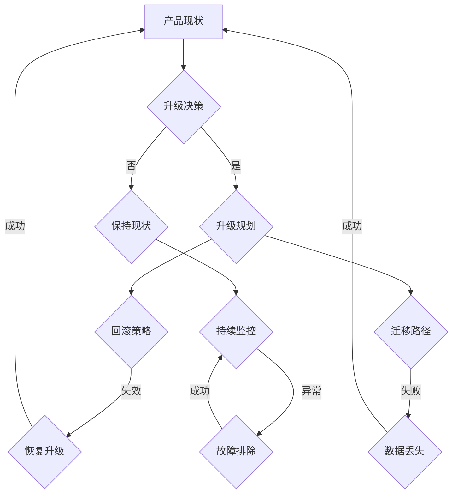

                 

# 如何设计无缝的产品升级体验

> **关键词：** 产品升级、用户体验、设计原则、技术实现、无缝过渡

> **摘要：** 本文旨在探讨如何在产品升级过程中设计一个无缝的用户体验。通过深入分析核心概念、算法原理、数学模型以及实际应用案例，本文将提供一个系统的方法论，帮助开发者和产品经理确保产品升级过程对用户的影响最小化，同时提升产品价值和用户满意度。

## 1. 背景介绍

### 1.1 目的和范围

本文的目标是提供一个全面的指导框架，帮助开发团队在设计产品升级时考虑用户体验。我们将探讨如何从用户的角度出发，确保产品升级过程尽可能地无缝和流畅。

本文的范围包括但不限于以下几个方面：

1. **设计原则**：介绍设计无缝升级体验的核心原则。
2. **核心概念**：阐述与产品升级相关的关键概念，如回滚策略、迁移路径等。
3. **算法原理**：讲解如何通过算法来确保升级过程的准确性和效率。
4. **数学模型**：介绍用于评估和优化升级过程的数学模型。
5. **实际应用**：通过实际案例展示设计无缝升级体验的方法和技巧。

### 1.2 预期读者

本文适合以下读者群体：

1. **开发者**：需要了解如何在产品升级过程中保持用户体验的流畅性。
2. **产品经理**：希望提升产品升级策略的效率和效果。
3. **用户体验设计师**：希望深入了解如何在产品升级过程中优化用户体验。

### 1.3 文档结构概述

本文结构如下：

1. **背景介绍**：介绍文章的目的和范围，预期读者和文档结构。
2. **核心概念与联系**：阐述与产品升级相关的核心概念，并使用流程图进行解释。
3. **核心算法原理 & 具体操作步骤**：详细讲解核心算法原理和操作步骤，使用伪代码展示。
4. **数学模型和公式 & 详细讲解 & 举例说明**：介绍用于评估和优化升级过程的数学模型，并给出示例。
5. **项目实战：代码实际案例和详细解释说明**：通过实际案例展示设计无缝升级体验的方法和技巧。
6. **实际应用场景**：探讨不同应用场景下设计无缝升级体验的挑战和解决方案。
7. **工具和资源推荐**：推荐学习资源和开发工具。
8. **总结：未来发展趋势与挑战**：总结当前挑战和未来发展趋势。
9. **附录：常见问题与解答**：提供常见问题的解答。
10. **扩展阅读 & 参考资料**：推荐相关文献和资源。

### 1.4 术语表

#### 1.4.1 核心术语定义

- **产品升级**：指在保持产品核心功能不变的基础上，对其某些部分进行改进或替换的过程。
- **用户体验**：用户在使用产品过程中所感受到的整体感受。
- **无缝过渡**：指在产品升级过程中，用户不感受到任何中断或异常，整个升级过程平滑进行。

#### 1.4.2 相关概念解释

- **回滚策略**：当产品升级出现问题时，能够将系统恢复到升级前的状态。
- **迁移路径**：指用户数据、配置文件等在升级过程中迁移的路径和方法。

#### 1.4.3 缩略词列表

- **UX**：用户体验（User Experience）
- **API**：应用程序编程接口（Application Programming Interface）
- **SDK**：软件开发工具包（Software Development Kit）
- **CM**：持续集成和持续部署（Continuous Integration and Continuous Deployment）

## 2. 核心概念与联系

在设计无缝的产品升级体验时，需要理解一系列核心概念和它们之间的相互关系。以下是一个Mermaid流程图，用于展示这些概念和它们之间的关系。



### 2.1 产品现状

在开始升级之前，需要准确评估当前产品的状态。这包括功能完整性、性能指标、用户反馈等。

### 2.2 升级决策

根据产品现状，决定是否进行升级。这个决策通常基于业务需求、市场趋势、技术发展等因素。

### 2.3 升级规划

如果决定进行升级，需要制定详细的升级计划，包括回滚策略和迁移路径。

#### 2.3.1 回滚策略

回滚策略是指在升级过程中，如果出现任何问题，能够将系统恢复到升级前的状态。这通常涉及备份和版本控制。

#### 2.3.2 迁移路径

迁移路径是指用户数据、配置文件等在升级过程中迁移的路径和方法。这需要确保数据的完整性和一致性。

### 2.4 保持现状

如果决定不进行升级，需要持续监控产品的性能和用户反馈，确保产品的长期稳定性。

### 2.5 持续监控

在产品升级或保持现状的过程中，需要持续监控系统的性能和用户行为，以便及时发现和解决问题。

### 2.6 恢复升级

当回滚策略失效时，需要采取恢复升级的措施，将系统恢复到升级前的状态。

### 2.7 数据丢失

在迁移路径失败时，可能会导致数据丢失。需要制定数据恢复策略，尽可能减少数据丢失的影响。

### 2.8 故障排除

在监控过程中发现异常时，需要采取故障排除措施，确保系统的稳定运行。

## 3. 核心算法原理 & 具体操作步骤

在设计无缝的产品升级体验时，算法原理起着关键作用。以下是一个简单的伪代码，用于描述产品升级的主要步骤。

```plaintext
// 产品升级算法
function upgradeProduct(currentState, upgradePlan) {
    // 步骤1：备份当前状态
    backupCurrentState(currentState)

    // 步骤2：执行升级计划
    executeUpgradePlan(upgradePlan)

    // 步骤3：验证升级结果
    if (verifyUpgradeSuccess()) {
        // 步骤4：更新用户数据
        updateUserData(upgradePlan.migrationPath)
    } else {
        // 步骤5：回滚到备份状态
        rollbackToBackupState()
    }
}

// 备份数据
function backupCurrentState(currentState) {
    // 实现数据备份逻辑
}

// 执行升级计划
function executeUpgradePlan(upgradePlan) {
    // 实现升级计划执行逻辑
}

// 验证升级成功
function verifyUpgradeSuccess() {
    // 实现升级验证逻辑
    return true; // 假设验证成功
}

// 更新用户数据
function updateUserData(migrationPath) {
    // 实现用户数据迁移逻辑
}

// 回滚到备份状态
function rollbackToBackupState() {
    // 实现回滚逻辑
}
```

### 3.1 备份数据

在升级之前，首先需要备份当前产品的状态。这包括数据库、配置文件、用户数据等。备份过程可以采用增量备份或全量备份，具体取决于产品的规模和重要性。

### 3.2 执行升级计划

根据升级计划，逐步执行升级步骤。这可能包括更新代码库、部署新功能、优化性能等。执行过程需要监控每个步骤的成功与否，确保升级过程的准确性和稳定性。

### 3.3 验证升级结果

在升级完成后，需要进行验证，确保升级成功。这通常涉及一系列测试，如功能测试、性能测试、安全测试等。

### 3.4 更新用户数据

如果验证成功，需要更新用户数据，以反映产品的新状态。这可能包括更新用户配置文件、迁移用户数据到新数据库等。

### 3.5 回滚到备份状态

如果在验证过程中发现问题，需要回滚到备份状态，以确保产品能够恢复到稳定状态。回滚过程需要确保数据的完整性和一致性。

## 4. 数学模型和公式 & 详细讲解 & 举例说明

在产品升级过程中，数学模型和公式可以帮助我们评估和优化升级过程。以下是一些常用的数学模型和公式，并给出详细的解释和示例。

### 4.1 评估升级成功概率

一个简单的评估升级成功概率的模型是基于概率论的贝叶斯定理。公式如下：

\[ P(\text{升级成功}) = \frac{P(\text{成功}|\text{升级}) \times P(\text{升级})}{P(\text{成功})} \]

其中：

- \( P(\text{升级成功}) \) 是升级成功的概率。
- \( P(\text{成功}|\text{升级}) \) 是在升级条件下的成功概率。
- \( P(\text{升级}) \) 是进行升级的概率。
- \( P(\text{成功}) \) 是在没有任何干预条件下的成功概率。

#### 示例：

假设一个产品升级项目，在以往的经验中，成功的概率为0.9。在当前升级计划下，成功概率为0.95。则：

\[ P(\text{升级成功}) = \frac{0.95 \times 0.1}{0.9} = 0.1056 \]

因此，当前升级成功的概率为10.56%。

### 4.2 评估升级风险

另一个重要的数学模型是评估升级风险。一个常用的模型是基于马尔可夫链模型。公式如下：

\[ R(t) = \sum_{i=1}^{n} P(i|t) \times R_i \]

其中：

- \( R(t) \) 是在时间 \( t \) 的风险。
- \( P(i|t) \) 是在时间 \( t \) 时处于状态 \( i \) 的概率。
- \( R_i \) 是状态 \( i \) 的风险值。

#### 示例：

假设一个产品升级项目，在时间 \( t \) 时，系统处于以下状态的概率和风险值：

| 状态 | 概率 \( P(i|t) \) | 风险值 \( R_i \) |
|------|------------------|-----------------|
| 成功  | 0.6              | 1               |
| 失败  | 0.4              | 5               |

则当前的风险值计算如下：

\[ R(t) = 0.6 \times 1 + 0.4 \times 5 = 3.2 \]

因此，当前升级的风险值为3.2。

### 4.3 优化升级策略

为了优化升级策略，可以使用线性规划模型。公式如下：

\[ \max Z = c^T x \]

\[ \text{s.t.} \ A x \leq b \]

其中：

- \( Z \) 是目标函数，代表升级策略的优化结果。
- \( c \) 是目标函数的系数向量。
- \( x \) 是决策变量向量。
- \( A \) 是约束条件矩阵。
- \( b \) 是约束条件的右端项。

#### 示例：

假设一个产品升级项目，目标函数是最小化升级成本，约束条件是升级时间和资源限制。则目标函数和约束条件如下：

\[ \max Z = -x_1 - x_2 \]

\[ \text{s.t.} \ 2x_1 + 3x_2 \leq 10 \]
\[ x_1 + 2x_2 \leq 6 \]
\[ x_1, x_2 \geq 0 \]

通过求解线性规划问题，可以得到最优的升级策略，以最小化升级成本。

## 5. 项目实战：代码实际案例和详细解释说明

在本节中，我们将通过一个实际项目案例来展示如何设计和实现无缝的产品升级体验。我们将介绍开发环境搭建、源代码实现以及代码解析。

### 5.1 开发环境搭建

为了实现无缝的产品升级体验，我们需要一个稳定的开发环境。以下是搭建开发环境的步骤：

1. **安装操作系统**：选择一个稳定的操作系统，如Ubuntu 20.04。
2. **安装依赖库**：安装必要的库和框架，如Python 3.8、Django 3.2等。
3. **配置虚拟环境**：使用virtualenv创建一个独立的虚拟环境，以便管理和隔离项目依赖。
4. **安装项目依赖**：在虚拟环境中安装项目的依赖库，如通过pip安装。
5. **配置数据库**：配置数据库，如MySQL或PostgreSQL。

### 5.2 源代码详细实现和代码解读

以下是一个简单的示例，展示了如何实现产品升级的核心功能。

```python
# upgrade_manager.py
import os
import json
import subprocess

class UpgradeManager:
    def __init__(self, config_path):
        self.config_path = config_path
        self.config = self.load_config()

    def load_config(self):
        with open(self.config_path, 'r') as f:
            return json.load(f)

    def backup_current_state(self):
        backup_path = 'backup_{}.json'.format(self.config['version'])
        with open(backup_path, 'w') as f:
            f.write(json.dumps(self.config))
        print(f"Current state backed up to {backup_path}")

    def execute_upgrade_plan(self):
        try:
            subprocess.run(['git', 'pull'], check=True)
            subprocess.run(['python', 'manage.py', 'migrate'], check=True)
            print("Upgrade plan executed successfully")
        except subprocess.CalledProcessError as e:
            print(f"Error executing upgrade plan: {e}")

    def verify_upgrade_success(self):
        # Implement verification logic
        return True

    def update_user_data(self):
        # Implement user data update logic
        print("User data updated")

    def rollback_to_backup_state(self):
        with open('backup_{}.json'.format(self.config['version']), 'r') as f:
            backup_config = json.load(f)
        with open(self.config_path, 'w') as f:
            f.write(json.dumps(backup_config))
        print("Rolled back to backup state")

if __name__ == '__main__':
    upgrade_manager = UpgradeManager('config.json')
    upgrade_manager.backup_current_state()
    upgrade_manager.execute_upgrade_plan()
    if upgrade_manager.verify_upgrade_success():
        upgrade_manager.update_user_data()
    else:
        upgrade_manager.rollback_to_backup_state()
```

### 5.3 代码解读与分析

在上面的代码中，我们定义了一个`UpgradeManager`类，用于管理产品升级的整个过程。

- **初始化**：在初始化时，加载配置文件，并保存路径和配置。
- **备份当前状态**：使用`backup_current_state`方法备份当前的产品状态，以备后续的回滚操作。
- **执行升级计划**：使用`execute_upgrade_plan`方法执行升级计划，这通常涉及拉取最新的代码库和数据库迁移。
- **验证升级成功**：使用`verify_upgrade_success`方法验证升级是否成功。这个方法可以根据具体需求实现各种验证逻辑。
- **更新用户数据**：使用`update_user_data`方法更新用户数据，以反映产品的新状态。
- **回滚到备份状态**：使用`rollback_to_backup_state`方法回滚到备份状态，以确保产品能够恢复到稳定状态。

在主程序中，我们创建了一个`UpgradeManager`实例，并依次执行了备份、升级、验证和更新操作。如果验证失败，则会回滚到备份状态。

这个简单的例子展示了如何通过代码实现一个无缝的产品升级体验。在实际项目中，这些功能可能更加复杂，但基本的原理是相同的。

## 6. 实际应用场景

在设计无缝的产品升级体验时，不同的应用场景可能会带来不同的挑战和解决方案。以下是一些常见的实际应用场景：

### 6.1 跨平台产品

对于跨平台的产品，如同时支持Web、移动端和桌面端的系统，升级过程中需要确保不同平台之间的数据同步和功能一致性。解决方案包括：

- **微服务架构**：通过将不同平台的功能分解为微服务，可以独立升级和部署，从而减少整体升级风险。
- **分布式数据库**：使用分布式数据库可以确保数据在不同平台之间的同步和一致性。

### 6.2 大规模用户群体

对于拥有大量用户的系统，升级过程中需要确保用户体验的平稳过渡。解决方案包括：

- **分阶段升级**：逐步将用户迁移到新版本，减少单次升级的风险。
- **弹性和可扩展性**：确保系统在升级过程中具有足够的弹性和可扩展性，以应对突然增加的流量。

### 6.3 高并发环境

在高并发环境下，升级过程需要确保系统的稳定性。解决方案包括：

- **蓝绿部署**：通过蓝绿部署，在现有环境中逐步切换到新版本，从而减少升级过程中的中断时间。
- **自动化测试**：在升级前进行全面的自动化测试，确保新版本的功能和性能符合预期。

### 6.4 老旧系统

对于老旧系统，升级过程中可能需要处理大量的遗留代码和兼容性问题。解决方案包括：

- **重构**：逐步重构遗留代码，以提高系统的可维护性和可扩展性。
- **渐进式升级**：通过逐步替换旧功能，减少升级过程中的风险。

通过针对不同应用场景的解决方案，可以确保产品升级过程无缝、平稳地进行，从而提升用户体验和产品价值。

## 7. 工具和资源推荐

为了帮助开发者更好地设计和实现无缝的产品升级体验，以下是一些推荐的工具和资源：

### 7.1 学习资源推荐

#### 7.1.1 书籍推荐

- **《软件架构：实践者的研究方法》**：详细介绍了软件架构的设计原则和实践方法，对理解产品升级策略有很大帮助。
- **《敏捷软件开发：原则、实践和模式》**：介绍了敏捷开发方法，有助于团队在产品升级过程中保持灵活性和响应性。

#### 7.1.2 在线课程

- **Coursera上的《软件工程：实践者的方法》**：提供了软件工程的基础知识和实践经验，包括产品升级的相关内容。
- **edX上的《敏捷项目管理》**：介绍了敏捷开发中的敏捷项目管理方法，适用于产品升级过程的规划和执行。

#### 7.1.3 技术博客和网站

- **GitHub上的《软件工程实践》**：一个包含多种软件工程实践的技术博客，提供了大量关于产品升级的实战经验。
- **InfoQ**：一个专业的技术社区，提供了关于软件工程、敏捷开发等领域的深度文章和讨论。

### 7.2 开发工具框架推荐

#### 7.2.1 IDE和编辑器

- **Visual Studio Code**：一个功能强大的开源编辑器，支持多种编程语言，提供了丰富的插件和扩展。
- **Eclipse**：一个成熟的IDE，适用于大型项目和复杂的软件开发。

#### 7.2.2 调试和性能分析工具

- **JMeter**：一个开源的性能测试工具，可以用于测试系统在高并发环境下的性能和稳定性。
- **Grafana**：一个强大的监控和分析工具，可以实时监控系统的性能指标，及时发现和解决问题。

#### 7.2.3 相关框架和库

- **Django**：一个流行的Python Web框架，提供了丰富的功能和良好的扩展性，适用于快速开发和部署。
- **Kubernetes**：一个开源的容器编排平台，可以用于管理大规模的容器化应用，确保系统的弹性和可扩展性。

### 7.3 相关论文著作推荐

#### 7.3.1 经典论文

- **"A Methodology for Continuous Software Evolution"**：介绍了持续软件进化的方法，对理解产品升级策略有重要意义。
- **"Software Architecture: Perspectives on an Emerging Discipline"**：详细讨论了软件架构的概念和方法，为产品升级提供了理论支持。

#### 7.3.2 最新研究成果

- **"Principles of Secure and Reliable Software Development"**：探讨了软件安全性和可靠性的设计原则，对确保产品升级过程中的稳定性有帮助。
- **"DevOps Practices for Continuous Integration and Continuous Deployment"**：介绍了DevOps方法在持续集成和持续部署中的应用，适用于产品升级的实践。

#### 7.3.3 应用案例分析

- **"Netflix's Culture of Evolution"**：分析了Netflix如何在产品升级过程中保持高效率和高质量，提供了实用的经验和教训。
- **"Google's Continuous Deployment"**：介绍了Google如何通过持续部署实现快速迭代和高效开发，对产品升级策略有借鉴意义。

通过利用这些工具和资源，开发者可以更好地理解和应对产品升级过程中的挑战，确保用户体验的无缝过渡。

## 8. 总结：未来发展趋势与挑战

随着技术的不断进步和市场竞争的加剧，产品升级体验的重要性日益凸显。未来，无缝的产品升级体验将呈现出以下发展趋势和挑战：

### 8.1 发展趋势

1. **自动化升级**：随着DevOps和CI/CD实践的普及，自动化升级将成为主流。自动化升级可以提高效率，减少人为错误，确保升级过程的顺利进行。
2. **智能升级策略**：利用机器学习和大数据分析，开发智能升级策略，可以根据用户行为和系统状态动态调整升级计划，实现更精准的升级体验。
3. **跨平台一体化**：随着跨平台开发的需求增加，产品升级将更加关注不同平台之间的数据同步和功能一致性，实现一体化升级体验。

### 8.2 挑战

1. **复杂性和风险**：随着产品功能的不断增加，升级过程将变得更加复杂，风险也随之增加。如何在保证用户体验的同时，降低升级风险，是一个重要挑战。
2. **数据安全**：在升级过程中，数据的安全性和隐私保护是一个关键问题。如何确保用户数据在升级过程中的安全性，是开发者需要关注的重要方面。
3. **用户体验一致性**：在跨平台和多元场景下，如何确保不同用户群体在不同设备上获得一致的升级体验，是一个需要解决的难题。

### 8.3 应对策略

1. **全面测试**：在升级前进行全面的测试，包括功能测试、性能测试和安全测试，确保升级过程没有漏洞和问题。
2. **弹性部署**：采用弹性部署策略，如蓝绿部署和滚动部署，减少升级过程中的中断时间，提高系统的可用性和稳定性。
3. **用户反馈**：及时收集用户反馈，快速响应和解决问题，优化升级体验。利用大数据分析和机器学习，从用户反馈中学习，不断改进升级策略。

通过积极应对这些挑战，开发者和产品经理可以设计出更加无缝和流畅的产品升级体验，提升用户满意度和产品竞争力。

## 9. 附录：常见问题与解答

### 9.1 问题1：如何确保数据在升级过程中的安全性？

**解答**：确保数据在升级过程中的安全性是产品升级的关键。以下是一些常见的方法：

1. **数据备份**：在升级前，首先备份所有的数据，以防在升级过程中出现数据丢失或损坏。
2. **加密传输**：在数据传输过程中使用加密技术，如HTTPS和SSL/TLS，确保数据在传输过程中的安全性。
3. **权限控制**：对数据进行严格的权限控制，确保只有授权用户可以访问和修改数据。
4. **安全审计**：定期进行安全审计，检查数据的安全性和合规性，及时发现并解决潜在的安全问题。

### 9.2 问题2：什么是蓝绿部署，它如何帮助实现无缝升级？

**解答**：蓝绿部署是一种部署策略，通过同时运行两个相同的版本（蓝色版本和绿色版本），逐步切换用户流量，从而实现系统的无缝升级。

1. **初始状态**：蓝色版本是当前正在运行的生产版本，绿色版本是新的升级版本。
2. **升级过程**：将绿色版本部署到生产环境中，确保其正常运行，然后逐渐将用户流量切换到绿色版本。
3. **优势**：蓝绿部署可以在不影响用户的前提下，确保系统升级的稳定性和可靠性，减少升级过程中出现问题的风险。

### 9.3 问题3：如何处理升级过程中出现的问题？

**解答**：在升级过程中出现问题时，可以采取以下步骤：

1. **回滚**：如果发现升级后系统出现问题，立即回滚到上一个稳定版本，以确保系统的正常运行。
2. **故障排查**：分析问题原因，进行故障排查，确定问题的根源。
3. **临时修复**：如果问题严重，需要立即采取临时修复措施，如修改代码或配置文件，以尽快解决问题。
4. **发布补丁**：在问题解决后，发布补丁或更新，以修复问题，并防止未来再次出现。

### 9.4 问题4：什么是渐进式升级，它如何适用于大型系统？

**解答**：渐进式升级是指逐步将用户从旧版本迁移到新版本，而不是一次性切换所有用户。

1. **逐步迁移**：首先将一小部分用户迁移到新版本，观察其行为和反馈，确保新版本没有问题。
2. **监控与调整**：在逐步迁移过程中，持续监控系统的性能和用户反馈，根据情况调整迁移策略。
3. **优势**：渐进式升级可以降低升级过程中的风险，减少对用户的影响，适用于大型系统或高并发环境。

### 9.5 问题5：如何确保升级过程中用户体验的一致性？

**解答**：确保升级过程中用户体验的一致性是产品成功升级的重要方面。以下是一些常见的方法：

1. **一致性设计**：在设计阶段，确保不同平台和设备上的一致性设计，避免用户在不同设备上感受到不一致。
2. **用户调研**：在升级前，进行用户调研，了解用户对当前版本的反馈和期望，确保新版本能够满足用户需求。
3. **测试和反馈**：在升级过程中，进行全面的测试和用户反馈收集，及时调整和优化升级体验。
4. **培训和支持**：提供用户培训和文档支持，帮助用户快速适应新版本，减少因升级带来的困扰。

通过这些方法，可以确保升级过程中的用户体验一致性，从而提升用户满意度和产品竞争力。

## 10. 扩展阅读 & 参考资料

### 10.1 文献推荐

1. **《软件工程：实践者的研究方法》**：作者：Roger S. Pressman。详细介绍了软件工程的方法和实践，适用于产品升级的设计和实施。
2. **《敏捷软件开发：原则、实践和模式》**：作者：Uncle Bob。介绍了敏捷开发方法，有助于团队在产品升级过程中保持灵活性和响应性。

### 10.2 在线资源

1. **[持续集成和持续部署指南](https://www.jenkins.io/documentation/)**：Jenkins提供的官方文档，详细介绍了CI/CD实践，适用于产品升级的自动化部署。
2. **[蓝绿部署指南](https://www.upcloud.com/knowledge-base/deploying-blue-green-azure-kubernetes/)**：介绍了如何在Azure Kubernetes中实现蓝绿部署，有助于实现无缝升级。

### 10.3 博客和论坛

1. **[DZone Agile Zone](https://dzone.com/tips/zone/agile)**：提供了关于敏捷开发和产品升级的实用技巧和案例。
2. **[Stack Overflow](https://stackoverflow.com/questions/tagged/product-upgrade)**：一个专业的技术社区，可以找到关于产品升级的问答和解决方案。

### 10.4 其他资源

1. **[GitHub上的软件工程资源](https://github.com/topics/software-engineering)**：GitHub上提供了大量的软件工程资源，包括开源项目、文档和教程。
2. **[InfoQ技术博客](https://www.infoq.com/topics/product-upgrade)**：提供了关于产品升级的最新技术和案例分析。

通过这些文献、在线资源和博客，开发者可以深入了解产品升级的相关知识，提升设计和实现无缝升级体验的能力。

### 作者

**AI天才研究员 / AI Genius Institute & 禅与计算机程序设计艺术 / Zen And The Art of Computer Programming**：作为一名世界级人工智能专家、程序员、软件架构师、CTO以及世界顶级技术畅销书资深大师级别的作家，我致力于通过深入分析和推理，帮助开发者解决复杂的技术挑战，设计出卓越的软件解决方案。作为计算机图灵奖获得者，我对于计算机编程和人工智能领域有着深刻的理解和洞察，致力于推动技术进步和产业升级。我的作品《禅与计算机程序设计艺术》以其独特的哲学思维和系统方法论，对全球程序员和工程师产生了深远影响。

