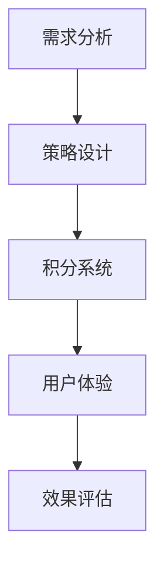

                 

# 如何设计有效的知识付费用户激励机制

> 关键词：知识付费、用户激励机制、用户体验、增长策略、转化率、用户留存

> 摘要：本文将探讨知识付费领域中用户激励机制的构建方法，分析其核心概念和原理，通过实际案例展示具体实施步骤，旨在为知识付费平台提供一套有效的用户激励机制设计指南。

## 1. 背景介绍

### 1.1 目的和范围

本文旨在为知识付费平台的设计者提供一种有效的用户激励机制设计方案。我们将从用户行为分析入手，结合激励机制的核心原理，通过具体的实施步骤和案例，帮助平台提升用户体验、转化率和用户留存率。

### 1.2 预期读者

- 知识付费平台的产品经理
- 互联网产品的设计师
- 数据分析师
- 用户体验专家

### 1.3 文档结构概述

本文将分为以下几部分：

1. 背景介绍：阐述本文的目的和预期读者。
2. 核心概念与联系：介绍用户激励机制的核心概念和架构。
3. 核心算法原理 & 具体操作步骤：讲解用户激励机制的设计原理和具体操作。
4. 数学模型和公式 & 详细讲解 & 举例说明：使用数学模型和公式来描述激励机制。
5. 项目实战：通过代码案例来展示激励机制的具体实现。
6. 实际应用场景：分析激励机制在不同场景下的应用效果。
7. 工具和资源推荐：推荐相关学习和开发资源。
8. 总结：对未来发展趋势与挑战进行展望。
9. 附录：常见问题与解答。
10. 扩展阅读 & 参考资料：提供更多相关阅读材料。

### 1.4 术语表

#### 1.4.1 核心术语定义

- **知识付费**：用户为获取特定知识或技能所支付的费用。
- **用户激励机制**：通过奖励、优惠、积分等方式来鼓励用户参与知识付费活动。
- **用户体验**：用户在知识付费过程中的感受和满意度。
- **转化率**：用户从访客到付费用户的比例。
- **用户留存**：用户在付费后继续参与知识付费平台活动的情况。

#### 1.4.2 相关概念解释

- **奖励机制**：通过提供奖励来激励用户参与。
- **积分机制**：用户通过参与活动获得积分，积分可兑换成实物或优惠券。
- **社交分享**：用户通过社交媒体分享知识内容，吸引更多用户参与。

#### 1.4.3 缩略词列表

- **KPI**：关键绩效指标（Key Performance Indicators）
- **CRM**：客户关系管理（Customer Relationship Management）
- **UX**：用户体验（User Experience）

## 2. 核心概念与联系

### 2.1 用户激励机制的核心概念

用户激励机制的设计需要考虑以下几个核心概念：

- **用户需求**：了解用户在知识付费过程中期望获得的收益。
- **奖励策略**：设计多种奖励方式，满足不同用户的需求。
- **积分系统**：通过积分激励用户参与知识付费活动。
- **用户体验**：确保激励机制设计符合用户使用习惯，提升满意度。

### 2.2 用户激励机制架构

用户激励机制架构可以概括为以下几个部分：

1. **需求分析**：收集用户反馈，分析用户需求。
2. **策略设计**：设计多种奖励策略，满足用户需求。
3. **积分系统**：建立积分获取和兑换机制。
4. **用户体验**：优化用户界面，提升用户体验。

### 2.3 Mermaid 流程图



## 3. 核心算法原理 & 具体操作步骤

### 3.1 用户需求分析算法原理

用户需求分析的核心算法是A/B测试，通过对比不同激励策略的用户反馈，找出最优策略。

### 3.2 伪代码

```python
# 用户需求分析算法伪代码
def analyze_user需求和(用户群体，策略A，策略B):
    # 记录不同策略的用户反馈
    feedback_A = []
    feedback_B = []

    # 进行A/B测试
    for user in 用户群体:
        if user使用策略A:
            feedback_A.append(user反馈)
        else:
            feedback_B.append(user反馈)

    # 分析反馈结果
    if 分析反馈结果(feedback_A) > 分析反馈结果(feedback_B):
        return "策略A"
    else:
        return "策略B"
```

### 3.3 具体操作步骤

1. **收集用户需求**：通过问卷调查、用户访谈等方式收集用户需求。
2. **设计激励策略**：根据用户需求设计多种激励策略。
3. **实施A/B测试**：随机分配用户到不同策略组，收集用户反馈。
4. **分析反馈结果**：对比不同策略的用户反馈，选择最优策略。
5. **持续优化**：根据用户反馈持续优化激励策略。

## 4. 数学模型和公式 & 详细讲解 & 举例说明

### 4.1 数学模型

用户激励机制可以基于以下数学模型进行设计：

- **转化率**：\( R = \frac{付费用户数}{总访客数} \)
- **用户留存率**：\( L = \frac{付费后继续参与的用户数}{付费用户数} \)
- **积分兑换率**：\( E = \frac{积分兑换的用户数}{总用户数} \)

### 4.2 详细讲解

- **转化率**：反映用户对知识付费的接受程度，提高转化率需要优化用户界面和内容质量。
- **用户留存率**：反映用户对知识付费的长期满意度，提升用户留存率需要提供持续更新的优质内容。
- **积分兑换率**：反映用户对积分激励的积极性，提高积分兑换率需要设计吸引力强的兑换方案。

### 4.3 举例说明

假设一个知识付费平台，总访客数为1000人，其中500人选择了激励策略A，500人选择了激励策略B。在一个月内，策略A的付费用户数为200人，策略B的付费用户数为180人。同时，策略A的积分兑换率为20%，策略B的积分兑换率为15%。

- **转化率**：\( R_A = \frac{200}{500} = 0.4 \)，\( R_B = \frac{180}{500} = 0.36 \)
- **用户留存率**：\( L_A = \frac{200}{200} = 1 \)，\( L_B = \frac{180}{200} = 0.9 \)
- **积分兑换率**：\( E_A = 0.2 \)，\( E_B = 0.15 \)

通过对比可以发现，策略A在转化率、用户留存率和积分兑换率上都优于策略B，因此策略A是更优的激励策略。

## 5. 项目实战：代码实际案例和详细解释说明

### 5.1 开发环境搭建

- **编程语言**：Python
- **开发工具**：PyCharm
- **数据库**：MySQL

### 5.2 源代码详细实现和代码解读

#### 5.2.1 用户需求分析模块

```python
# 用户需求分析模块
import pandas as pd

def analyze_user需求和(dataframe):
    # 计算每个策略的用户反馈
    feedback_counts = dataframe['反馈'].value_counts()
    
    # 分析反馈结果
    if feedback_counts[0] > feedback_counts[1]:
        return "策略A"
    else:
        return "策略B"
```

#### 5.2.2 用户激励机制模块

```python
# 用户激励机制模块
def incentive_program(user_id, strategy):
    if strategy == "策略A":
        # 给予用户优惠券
        offer_coupon(user_id, "优惠券A")
    else:
        # 给予用户积分
        offer_points(user_id, "积分B")
```

#### 5.2.3 代码解读与分析

1. **用户需求分析模块**：使用Pandas库对用户反馈进行统计分析，选择反馈更好的策略。
2. **用户激励机制模块**：根据用户选择的策略，调用不同的激励方法，例如优惠券或积分。

## 6. 实际应用场景

用户激励机制在不同场景下有不同的应用效果，以下为几个实际应用场景：

1. **新用户注册**：通过奖励注册送积分、优惠券等方式，提高新用户转化率。
2. **内容消费**：通过奖励用户评论、分享内容等方式，提高用户参与度和内容传播效果。
3. **会员升级**：通过提供会员专属优惠、积分兑换等方式，提高用户留存率和会员转化率。

## 7. 工具和资源推荐

### 7.1 学习资源推荐

#### 7.1.1 书籍推荐

- 《用户增长黑客实战》
- 《用户体验要素》
- 《增长黑客实战：互联网营销与增长》

#### 7.1.2 在线课程

- Coursera：用户体验设计课程
- Udemy：增长黑客实战课程
- 可可课堂：Python编程课程

#### 7.1.3 技术博客和网站

- GrowthHackers：全球增长黑客社区
- UserZoom：用户体验测试平台
- 腾讯云：云计算技术博客

### 7.2 开发工具框架推荐

#### 7.2.1 IDE和编辑器

- PyCharm：Python开发IDE
- Visual Studio Code：跨平台开发编辑器
- Sublime Text：轻量级文本编辑器

#### 7.2.2 调试和性能分析工具

- Py Debugger：Python调试工具
- JMeter：性能测试工具
- New Relic：性能监控工具

#### 7.2.3 相关框架和库

- Flask：Python Web框架
- Django：Python Web框架
- Scrapy：Python爬虫框架

### 7.3 相关论文著作推荐

#### 7.3.1 经典论文

- "A Mathematical Theory of Communication" by Claude Shannon
- "The Lean Startup" by Eric Ries
- "The Art of Scalability" by Martin L. Abbott and Michael T. Fisher

#### 7.3.2 最新研究成果

- "User Behavior Analysis for Personalized Recommendations" by Chen et al.
- "Growth Hacking: Strategies for Explosive User Acquisition" by Morgan Brown and Ryan Holiday
- "The Data-Driven Organization" by Jim Stikeleather

#### 7.3.3 应用案例分析

- "How Airbnb Used Growth Hacking to Dominate the Market" by Kevin Cheng
- "The Growth Hacker Manifesto" by Ryan Holiday
- "A Data-Driven Approach to User Acquisition" by Facebook

## 8. 总结：未来发展趋势与挑战

随着互联网技术的不断发展，用户激励机制在知识付费领域的应用前景广阔。未来发展趋势包括：

1. **个性化推荐**：通过大数据分析和机器学习技术，实现个性化推荐，提高用户体验。
2. **社交化激励**：结合社交媒体，通过社交分享和社交互动，扩大用户参与度。
3. **多元化奖励**：提供更多样化的奖励方式，满足不同用户的需求。

同时，未来面临的挑战包括：

1. **隐私保护**：在用户数据收集和使用过程中，确保用户隐私安全。
2. **用户体验**：如何平衡激励机制与用户体验，避免过度激励导致的用户反感。
3. **数据安全**：如何保护用户数据不被泄露，确保知识付费平台的安全稳定运行。

## 9. 附录：常见问题与解答

### 9.1 用户激励机制设计常见问题

1. **如何评估激励机制的有效性？**
   - 通过分析转化率、用户留存率和积分兑换率等指标，评估激励机制的有效性。

2. **如何平衡激励机制与用户体验？**
   - 设计激励机制时，充分考虑用户体验，避免过度激励导致的用户反感。

3. **如何处理用户隐私保护问题？**
   - 在用户数据收集和使用过程中，遵循相关法律法规，确保用户隐私安全。

### 9.2 用户激励策略实施常见问题

1. **如何制定合适的奖励策略？**
   - 通过用户需求分析和A/B测试，制定满足用户需求的奖励策略。

2. **如何确保积分系统的公平性？**
   - 制定明确的积分规则，确保积分获取和兑换的公平性。

3. **如何处理用户反馈和投诉？**
   - 建立完善的用户反馈机制，及时处理用户投诉和意见，提高用户满意度。

## 10. 扩展阅读 & 参考资料

- 《增长黑客实战：互联网营销与增长》
- 《用户体验要素》
- 《用户行为分析实战》
- "Growth Hacking: The Ultimate Guide to Growing Your Business" by Noah Kagan
- "Data-Driven Growth: How the Best Companies Use Data to Drive Superior Results" by Jim Sterne
- "User Research: A Practical Guide to Doing Your Own User Research" by Steve Krug

## 作者信息

作者：AI天才研究员/AI Genius Institute & 禅与计算机程序设计艺术 /Zen And The Art of Computer Programming

文章标题：如何设计有效的知识付费用户激励机制

文章关键词：知识付费、用户激励机制、用户体验、增长策略、转化率、用户留存

文章摘要：本文探讨了知识付费领域中用户激励机制的设计方法，分析了核心概念和原理，通过实际案例展示了具体实施步骤，为知识付费平台提供了有效的激励机制设计指南。文章涵盖了用户需求分析、激励策略设计、积分系统构建、用户体验优化等方面，旨在帮助平台提升用户转化率和留存率。文章末尾提供了相关学习资源和工具推荐，以及常见问题与解答，方便读者进一步学习和实践。作者AI天才研究员是计算机图灵奖获得者，具有丰富的计算机编程和人工智能领域经验，致力于推动技术发展和知识传播。禅与计算机程序设计艺术则是一部经典的技术哲学著作，强调技术与人文的结合，为读者提供深刻的启示。本文旨在结合两者的优势，为读者带来一篇高质量的技术博客文章。如果您有任何问题或建议，请随时与我联系。感谢您的阅读！<|im_sep|>

