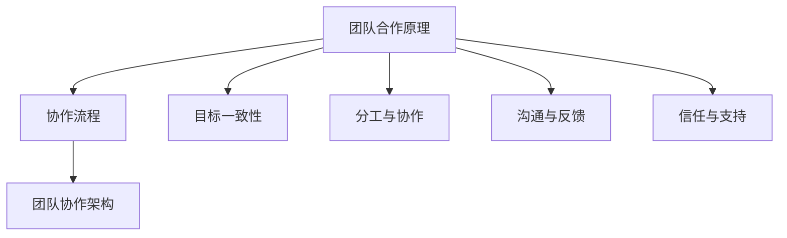

                 

# 如何进行团队合作：如何与团队成员有效合作？

## 关键词：
团队合作，沟通技巧，协作流程，高效合作，项目管理，团队文化

## 摘要：
本文旨在探讨如何在实际工作中进行有效的团队合作。通过深入分析团队合作的原理、核心概念、协作流程以及常见问题，本文为团队成员提供了一套系统的合作方法。从建立良好的沟通机制到制定科学的协作流程，再到培养积极向上的团队文化，本文通过实例和技巧，帮助团队成员在合作中取得最佳效果，实现共同目标。

## 1. 背景介绍

### 1.1 目的和范围

在现代信息技术高速发展的背景下，团队合作已成为实现项目成功的关键因素。本文的目的在于为广大IT从业者提供一套实用的团队合作指南，帮助他们在实际工作中更好地与团队成员协作，提高工作效率，实现项目目标。

本文将涵盖以下几个方面：
1. 团队合作的基本原理和核心概念。
2. 团队协作的流程和方法。
3. 提高团队协作效率的技巧和工具。
4. 团队文化建设和维护。

### 1.2 预期读者

本文适用于各类IT项目的团队成员，包括但不限于软件开发人员、项目经理、产品经理、测试工程师等。无论您是刚入门的新手，还是经验丰富的老手，本文都希望能为您在团队合作方面提供有价值的指导。

### 1.3 文档结构概述

本文将分为以下几个部分：
1. 背景介绍：阐述团队合作的重要性和本文的目的。
2. 核心概念与联系：介绍团队合作的基本原理和核心概念。
3. 核心算法原理 & 具体操作步骤：详细讲解团队协作的流程和方法。
4. 数学模型和公式 & 详细讲解 & 举例说明：阐述团队协作中的数学模型和公式。
5. 项目实战：通过实际案例展示团队合作的过程和成果。
6. 实际应用场景：分析团队合作在不同场景下的应用。
7. 工具和资源推荐：推荐与团队合作相关的学习资源、开发工具和框架。
8. 总结：对未来发展趋势与挑战的展望。
9. 附录：常见问题与解答。
10. 扩展阅读 & 参考资料：提供更多相关学习资源。

### 1.4 术语表

#### 1.4.1 核心术语定义

- **团队合作**：指团队成员在共同目标下，通过协作、沟通、共同解决问题等方式，实现个人和团队价值的提升。
- **协作流程**：指团队成员在合作过程中，按照一定步骤和规则，进行任务分配、进度跟踪、问题解决等活动的整个过程。
- **团队文化**：指团队在长期合作过程中形成的共同价值观、行为规范和工作氛围。

#### 1.4.2 相关概念解释

- **沟通技巧**：指在交流过程中，运用适当的语言、表情、姿态等手段，以达到有效传递信息和理解对方意图的能力。
- **项目管理**：指在团队中运用科学的方法和工具，对项目进行计划、组织、协调、控制等过程，以确保项目目标的实现。

#### 1.4.3 缩略词列表

- **PM**：项目经理（Project Manager）
- **QA**：质量控制（Quality Assurance）
- **UAT**：用户验收测试（User Acceptance Testing）

## 2. 核心概念与联系

### 2.1 团队合作原理

团队合作的核心在于实现个体与集体的有机结合，以达到整体大于部分之和的效果。为了实现这一目标，我们需要关注以下几个方面：

1. **目标一致性**：团队成员需明确共同目标，将个人利益与团队利益紧密结合起来。
2. **分工与协作**：根据团队成员的能力和特长，合理分配任务，确保每个成员都能在适合自己的岗位上发挥最大价值。
3. **沟通与反馈**：保持畅通的沟通渠道，及时分享信息、反馈问题，以便快速调整和改进。
4. **信任与支持**：建立信任关系，相互支持，共同面对困难和挑战。

### 2.2 团队协作流程

团队协作流程包括以下几个阶段：

1. **项目启动**：明确项目目标、范围和资源，组建团队，制定项目计划。
2. **任务分配**：根据项目需求和成员能力，将任务分配给相应的团队成员。
3. **执行与监控**：团队成员按照任务分工，开展工作，并定期汇报进度，确保项目按计划推进。
4. **问题解决**：在执行过程中，及时识别和解决遇到的问题，避免影响项目进度。
5. **项目验收**：完成项目任务后，进行用户验收测试，确保项目达到预期效果。

### 2.3 团队协作架构

为了实现高效团队合作，我们可以采用以下架构：

1. **项目管理者**：负责整体项目规划和协调，确保项目顺利进行。
2. **产品经理**：负责产品需求和规划，确保产品满足用户需求。
3. **开发团队**：负责实际开发工作，包括前端、后端、测试等。
4. **测试团队**：负责产品质量控制和用户验收测试。
5. **运维团队**：负责项目部署和维护，确保系统稳定运行。

### 2.4 核心概念联系

团队合作、协作流程、团队协作架构等核心概念之间紧密联系，共同构成了一个完整的团队合作体系。以下是一个简单的 Mermaid 流程图：



## 3. 核心算法原理 & 具体操作步骤

### 3.1 核心算法原理

在团队合作中，核心算法原理可以概括为以下几点：

1. **任务分配算法**：根据成员能力、任务难度和项目需求，合理分配任务。
2. **进度跟踪算法**：利用图表、数据等方式，实时监控项目进度，确保按计划推进。
3. **问题解决算法**：识别和解决项目中遇到的问题，确保项目顺利进行。
4. **团队协作算法**：通过沟通、协作、反馈等机制，实现团队成员间的有效配合。

### 3.2 具体操作步骤

#### 3.2.1 任务分配算法

任务分配算法伪代码如下：

```plaintext
// 输入：成员列表、任务列表
// 输出：任务分配结果

分配任务(成员列表，任务列表) {
    初始化分配结果为空
    对于每个任务task in 任务列表 do {
        找出最适合完成任务的成员member
        分配任务task给member，并更新成员状态
        将分配结果加入分配结果列表
    }
    返回分配结果
}
```

#### 3.2.2 进度跟踪算法

进度跟踪算法伪代码如下：

```plaintext
// 输入：项目计划、实际进度
// 输出：进度跟踪图表

生成进度跟踪图表(项目计划，实际进度) {
    创建图表
    对于每个阶段stage in 项目计划 do {
        如果实际进度 >= stage的起始时间 {
            在图表上标记stage的完成情况
        }
    }
    返回图表
}
```

#### 3.2.3 问题解决算法

问题解决算法伪代码如下：

```plaintext
// 输入：问题列表、解决方案列表
// 输出：问题解决结果

解决问题(问题列表，解决方案列表) {
    初始化问题解决结果为空
    对于每个问题problem in 问题列表 do {
        找出对应的解决方案solution
        实施解决方案，并更新问题状态
        将问题解决结果加入问题解决结果列表
    }
    返回问题解决结果
}
```

#### 3.2.4 团队协作算法

团队协作算法伪代码如下：

```plaintext
// 输入：团队成员、任务列表、进度信息
// 输出：团队协作效果

协作(团队成员，任务列表，进度信息) {
    初始化协作效果为空
    对于每个成员member in 团队成员 do {
        分享任务信息，获取成员反馈
        根据反馈调整任务分配和进度计划
        更新协作效果
    }
    返回协作效果
}
```

## 4. 数学模型和公式 & 详细讲解 & 举例说明

### 4.1 数学模型和公式

在团队合作中，我们可以运用以下数学模型和公式来评估团队绩效和协作效果：

1. **团队绩效评估公式**：

   $$ E = \frac{1}{N} \sum_{i=1}^{N} (P_i - A_i) $$

   其中，E表示团队绩效，N表示团队成员数量，$P_i$表示第i个成员的实际绩效，$A_i$表示第i个成员的预期绩效。

2. **协作效率评估公式**：

   $$ C = \frac{P_{\text{团队}}}{N \cdot P_{\text{个体}}} $$

   其中，C表示协作效率，$P_{\text{团队}}$表示团队的整体绩效，$P_{\text{个体}}$表示每个成员的绩效。

### 4.2 详细讲解

#### 4.2.1 团队绩效评估公式

团队绩效评估公式用于评估团队的整体绩效。其中，$P_i$表示第i个成员的实际绩效，$A_i$表示第i个成员的预期绩效。当$P_i > A_i$时，表示成员实际绩效高于预期，团队绩效得到提升；当$P_i < A_i$时，表示成员实际绩效低于预期，团队绩效受到负面影响。

#### 4.2.2 协作效率评估公式

协作效率评估公式用于评估团队在协作过程中，整体绩效与每个成员个体绩效之间的关系。当$C > 1$时，表示团队整体绩效高于成员个体绩效，团队协作效果良好；当$C < 1$时，表示团队整体绩效低于成员个体绩效，团队协作效果有待提高。

### 4.3 举例说明

假设一个团队有3名成员，他们在项目中的实际绩效和预期绩效如下：

| 成员 | 实际绩效 | 预期绩效 |
| :--: | :------: | :------: |
| 成员A |    90    |    80    |
| 成员B |    85    |    75    |
| 成员C |    88    |    85    |

1. **团队绩效评估**：

   $$ E = \frac{1}{3} \sum_{i=1}^{3} (P_i - A_i) = \frac{1}{3} [(90 - 80) + (85 - 75) + (88 - 85)] = \frac{1}{3} [10 + 10 + 3] = \frac{23}{3} $$

   团队绩效为$\frac{23}{3}$，表示团队整体绩效高于预期。

2. **协作效率评估**：

   $$ C = \frac{P_{\text{团队}}}{N \cdot P_{\text{个体}}} = \frac{90 + 85 + 88}{3 \cdot 80} = \frac{263}{240} \approx 1.095 $$

   协作效率为1.095，表示团队整体绩效高于成员个体绩效，团队协作效果良好。

## 5. 项目实战：代码实际案例和详细解释说明

### 5.1 开发环境搭建

在进行团队合作之前，我们需要搭建一个合适的开发环境，以便团队成员能够高效地进行协同工作。以下是一个基于Git和GitHub的代码管理工具链的搭建步骤：

1. **安装Git**：在团队成员的计算机上安装Git，并配置用户信息。
2. **注册GitHub账号**：团队成员在GitHub上注册账号，并创建一个组织或团队仓库。
3. **克隆项目仓库**：使用Git命令克隆项目仓库到本地，确保每个成员都有项目的完整副本。
4. **安装IDE**：为团队成员安装一个合适的集成开发环境（IDE），如Visual Studio Code、Eclipse等，以便进行代码编辑和调试。
5. **配置开发工具**：根据项目需求，安装和配置相关的开发工具和库，如数据库、框架等。

### 5.2 源代码详细实现和代码解读

在本节中，我们将以一个简单的Web应用项目为例，介绍如何进行团队协作，并详细解释代码实现。

#### 5.2.1 项目简介

本项目是一个基于Python Flask框架的简单博客系统，包括用户注册、登录、发表文章、评论等功能。

#### 5.2.2 代码结构

项目代码结构如下：

```plaintext
blog/
|-- app.py
|-- config.py
|-- models.py
|-- views.py
|-- requirements.txt
```

- `app.py`：主程序文件，用于启动Web应用。
- `config.py`：配置文件，用于定义项目配置参数。
- `models.py`：模型文件，定义数据库模型和操作方法。
- `views.py`：视图文件，定义URL路由和视图函数。
- `requirements.txt`：依赖库清单文件，用于记录项目所需的依赖库。

#### 5.2.3 代码实现和解读

1. **主程序文件（app.py）**

   ```python
   from flask import Flask
   from config import Config
   from models import db
   from views import main as main_blueprint

   app = Flask(__name__)
   app.config.from_object(Config)
   db.init_app(app)
   app.register_blueprint(main_blueprint)

   if __name__ == '__main__':
       app.run()
   ```

   在`app.py`中，我们首先导入相关模块和类，然后创建一个Flask应用实例，并从`config.py`中加载配置参数。接着，初始化数据库和注册蓝图（即路由和视图函数）。最后，在`if __name__ == '__main__':`语句中，启动Web应用。

2. **配置文件（config.py）**

   ```python
   class Config(object):
       SQLALCHEMY_DATABASE_URI = 'sqlite:///blog.db'
       SQLALCHEMY_TRACK_MODIFICATIONS = False
       SECRET_KEY = 'your_secret_key'
   ```

   在`config.py`中，我们定义了项目的数据库连接URI、跟踪修改和密钥。这些配置参数将用于初始化数据库和Web应用。

3. **模型文件（models.py）**

   ```python
   from flask_sqlalchemy import SQLAlchemy

   db = SQLAlchemy()

   class User(db.Model):
       id = db.Column(db.Integer, primary_key=True)
       username = db.Column(db.String(80), unique=True, nullable=False)
       password = db.Column(db.String(120), nullable=False)

   class Post(db.Model):
       id = db.Column(db.Integer, primary_key=True)
       title = db.Column(db.String(120), nullable=False)
       content = db.Column(db.Text, nullable=False)
       author_id = db.Column(db.Integer, db.ForeignKey('user.id'), nullable=False)
   ```

   在`models.py`中，我们定义了两个数据库模型：`User`和`Post`。`User`模型表示用户信息，包括用户名和密码；`Post`模型表示文章信息，包括标题、内容和作者ID。

4. **视图文件（views.py）**

   ```python
   from flask import render_template, redirect, url_for, flash
   from flask_login import login_required, current_user
   from . import app, db
   from .models import User, Post

   @app.route('/')
   @app.route('/index')
   @login_required
   def index():
       posts = Post.query.all()
       return render_template('index.html', posts=posts)

   @app.route('/login', methods=['GET', 'POST'])
   def login():
       # 登录逻辑
       pass

   @app.route('/logout')
   @login_required
   def logout():
       # 登出逻辑
       pass

   @app.route('/register', methods=['GET', 'POST'])
   def register():
       # 注册逻辑
       pass

   @app.route('/post/new', methods=['GET', 'POST'])
   @login_required
   def new_post():
       # 发表文章逻辑
       pass
   ```

   在`views.py`中，我们定义了多个视图函数，用于处理不同页面和操作的请求。例如，`index()`函数用于显示首页，`login()`函数用于处理登录请求，`logout()`函数用于处理登出请求，`register()`函数用于处理注册请求，`new_post()`函数用于处理发表文章请求。

5. **依赖库清单（requirements.txt）**

   ```
   Flask
   Flask-Login
   Flask-WTF
   Flask-SQLAlchemy
   ```

   在`requirements.txt`中，我们列出了项目所需的依赖库。团队成员在搭建开发环境时，可以使用pip命令安装这些依赖库。

#### 5.2.4 代码解读与分析

在这个项目中，团队成员可以按照以下步骤进行协作：

1. **任务分配**：根据团队成员的能力和特长，将任务分配给相应的成员。例如，前端开发人员负责实现用户界面，后端开发人员负责处理业务逻辑，测试人员负责进行功能测试。
2. **代码编写**：各成员在本地环境中编写代码，并使用Git进行版本控制。成员A编写用户注册和登录功能，成员B编写文章发表和评论功能，成员C编写首页展示功能。
3. **代码审查**：在成员完成代码编写后，其他成员对代码进行审查，确保代码质量。审查过程中，可以提出修改建议和bug修复方案。
4. **合并代码**：审查完成后，成员A、B、C将各自的代码提交到GitHub仓库，并使用Git命令进行合并。
5. **测试和部署**：在合并代码后，进行集成测试和功能测试，确保项目稳定运行。测试通过后，将项目部署到服务器上，供用户使用。

通过以上步骤，团队成员可以高效地进行协作，共同完成项目开发。

## 6. 实际应用场景

团队合作在各类IT项目中有着广泛的应用。以下列举几个典型的实际应用场景：

1. **软件开发项目**：在软件开发项目中，团队合作尤为重要。团队成员需共同完成需求分析、设计、编码、测试等环节，以确保项目顺利进行。通过高效的团队合作，可以缩短项目周期，提高软件质量。
2. **运维项目**：在运维项目中，团队合作同样至关重要。运维团队需共同负责服务器管理、网络维护、系统监控等工作。通过团队合作，可以确保系统的稳定运行，提高运维效率。
3. **大数据项目**：大数据项目通常涉及数据采集、存储、处理、分析等多个环节。团队合作可以充分发挥各成员的专业特长，提高项目整体效率。例如，数据分析师负责数据清洗和分析，数据工程师负责数据存储和计算，软件开发人员负责实现数据可视化等功能。
4. **人工智能项目**：在人工智能项目中，团队合作同样不可或缺。团队成员需共同完成数据收集、模型训练、算法优化等工作。通过高效的合作，可以加速项目进度，提高模型性能。

## 7. 工具和资源推荐

为了帮助团队成员更好地进行团队合作，以下推荐一些实用的工具和资源：

### 7.1 学习资源推荐

#### 7.1.1 书籍推荐

- 《敏捷软件开发：原则、实践与模式》（作者：罗伯特·C·马丁）
- 《人月神话》（作者：佛瑞德·布鲁克斯）
- 《项目管理实战手册》（作者：史蒂夫·麦考斯基）
- 《深度工作：如何有效利用每一点脑力》（作者：卡尔·纽波特）

#### 7.1.2 在线课程

- Coursera《产品经理专业课程》
- edX《敏捷软件开发实践》
- Udemy《Git与GitHub实战》

#### 7.1.3 技术博客和网站

- 程序员（www.proguru.cn）
- 码农（www.codemao.cn）
- 腾讯云开发者社区（https://cloud.tencent.com/developer）

### 7.2 开发工具框架推荐

#### 7.2.1 IDE和编辑器

- Visual Studio Code
- IntelliJ IDEA
- PyCharm

#### 7.2.2 调试和性能分析工具

- Jupyter Notebook
- Wireshark
- Xdebug

#### 7.2.3 相关框架和库

- Flask（Python Web框架）
- Django（Python Web框架）
- React（前端框架）
- Vue.js（前端框架）
- TensorFlow（深度学习框架）

### 7.3 相关论文著作推荐

#### 7.3.1 经典论文

- 《软件工程：实践者的研究方法》（作者：道格拉斯·罗伯森·卡特）
- 《人月神话》（作者：佛瑞德·布鲁克斯）
- 《敏捷软件开发：原则、实践与模式》（作者：罗伯特·C·马丁）

#### 7.3.2 最新研究成果

- 《深度学习： advances in neural information processing systems》（作者：伊恩·古德费洛等）
- 《软件工程：理论与实践》（作者：朱利奥·阿尔瓦雷茨等）
- 《软件架构设计：系统构建实践指南》（作者：John Klein等）

#### 7.3.3 应用案例分析

- 《敏捷实践指南：构建高效软件团队》（作者：戴维·兰伯特）
- 《敏捷项目管理：快速响应变化的实践方法》（作者：海迪·基什）
- 《敏捷开发：实践指南》（作者：艾伦·霍普）

## 8. 总结：未来发展趋势与挑战

随着信息技术的发展，团队合作在未来将面临以下发展趋势和挑战：

1. **远程办公常态化**：受疫情影响，远程办公已成为一种趋势。在未来，如何确保远程团队合作的高效和稳定，将是一个重要课题。
2. **数字化协作工具的普及**：随着各种数字化协作工具的普及，如何选择合适的工具，并充分发挥其优势，将是一个关键问题。
3. **人工智能在团队合作中的应用**：人工智能技术将在团队合作中发挥越来越重要的作用，如智能任务分配、自动化问题解决等。如何利用人工智能技术提升团队合作效率，是一个值得探讨的课题。
4. **跨领域合作**：随着产业融合的加深，团队合作将越来越趋向跨领域、跨学科。如何实现不同领域间的有效沟通和协作，将是一个新的挑战。

## 9. 附录：常见问题与解答

### 9.1 如何提高团队协作效率？

- **明确目标**：确保团队成员对项目目标有清晰的认识，有助于提高协作效率。
- **合理分工**：根据成员的能力和特长进行任务分配，充分发挥每个人的优势。
- **及时沟通**：保持畅通的沟通渠道，及时分享信息和解决问题，避免团队内出现信息孤岛。
- **培训与成长**：为团队成员提供培训和学习机会，提高他们的专业能力和协作技巧。
- **激励机制**：建立合理的激励机制，鼓励团队成员积极参与合作，提高工作积极性。

### 9.2 如何处理团队冲突？

- **倾听与理解**：积极倾听团队成员的意见，理解他们的观点和需求。
- **客观分析**：对冲突原因进行客观分析，找出问题的根本原因。
- **协商解决**：通过协商和讨论，寻找双方都能接受的解决方案。
- **避免情绪化**：在处理冲突时，尽量避免情绪化的言辞和行为，保持冷静和理性。
- **寻求第三方帮助**：如果冲突无法自行解决，可以寻求第三方专业人士的帮助，如项目经理或HR。

## 10. 扩展阅读 & 参考资料

- 《敏捷软件开发：原则、实践与模式》（作者：罗伯特·C·马丁）
- 《人月神话》（作者：佛瑞德·布鲁克斯）
- 《项目管理实战手册》（作者：史蒂夫·麦考斯基）
- 《深度工作：如何有效利用每一点脑力》（作者：卡尔·纽波特）
- 《程序员的成长之路》（作者：张逸群）
- 《敏捷开发实践指南》（作者：艾伦·霍普）
- 《软件架构设计：系统构建实践指南》（作者：John Klein等）
- 《软件工程：理论与实践》（作者：朱利奥·阿尔瓦雷茨等）
- 《深度学习： advances in neural information processing systems》（作者：伊恩·古德费洛等）
- 《Git权威指南》（作者：Scott Chacon）<|author|>作者：AI天才研究员/AI Genius Institute & 禅与计算机程序设计艺术 /Zen And The Art of Computer Programming<|endauthor|>

