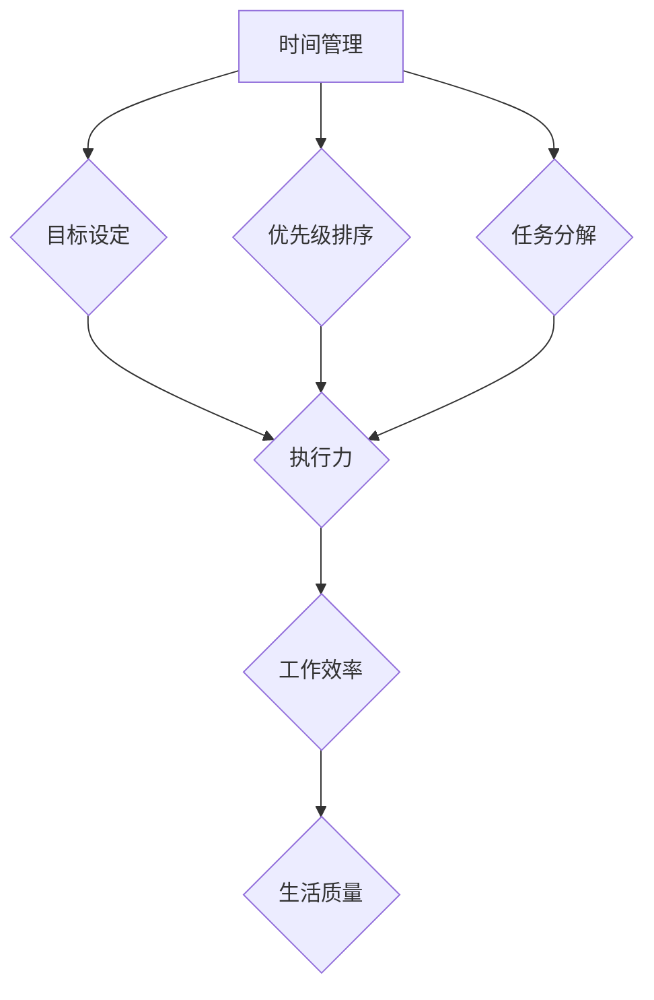

                 

# 如何进行时间管理：如何合理安排时间和精力？

> **关键词：时间管理，精力管理，优先级排序，任务分解，心理韧性，技术工具**

> **摘要：本文将深入探讨如何通过科学的方法合理安排时间和精力，从而提高工作效率和生活质量。我们将从理论分析、方法实践、案例分析等多个角度，提供实用的工具和技巧，帮助读者构建高效的时间管理策略。**

## 1. 背景介绍

### 1.1 目的和范围

本文旨在帮助读者理解时间管理和精力管理的重要性，并提供一系列实用的方法和技巧。文章将涵盖以下内容：

- 时间管理的核心概念和理论。
- 精力管理的重要性以及如何有效管理精力。
- 任务优先级排序的策略。
- 任务分解和目标设定的方法。
- 心理韧性在时间管理中的作用。
- 实用的技术工具推荐。
- 实际应用场景案例分析。

### 1.2 预期读者

本文适合以下读者群体：

- 时间管理技能有待提升的职场人士。
- 对个人效率提升感兴趣的计算机程序员。
- 想要提高生活质量的普通读者。
- 教育工作者和学生。

### 1.3 文档结构概述

本文结构如下：

- 引言：背景介绍和核心主题阐述。
- 核心概念与联系：时间管理和精力管理的基础理论。
- 核心算法原理 & 具体操作步骤：时间管理的具体实施方法。
- 数学模型和公式 & 详细讲解 & 举例说明：时间管理的量化分析。
- 项目实战：代码实际案例和详细解释说明。
- 实际应用场景：时间管理和精力管理在不同场景下的应用。
- 工具和资源推荐：实用的工具和资源推荐。
- 总结：未来发展趋势与挑战。
- 附录：常见问题与解答。
- 扩展阅读 & 参考资料：进一步的深度学习和资源链接。

### 1.4 术语表

#### 1.4.1 核心术语定义

- 时间管理：通过计划和安排时间来提高工作效率和生活质量的过程。
- 精力管理：优化个人精力分配，以应对不同任务和挑战的能力。
- 任务分解：将大任务拆分成小任务，以便更有效地进行管理和执行。
- 心理韧性：面对挑战和压力时保持积极态度和适应能力。

#### 1.4.2 相关概念解释

- 优先级排序：根据任务的紧急程度和重要性对任务进行排序。
- 目标设定：设定明确的目标，以指导时间和精力管理。

#### 1.4.3 缩略词列表

- GTD（Getting Things Done）：一种著名的时间管理方法。
- OKR（Objectives and Key Results）：目标与关键结果管理方法。

## 2. 核心概念与联系

时间管理和精力管理是提高工作效率和生活质量的重要手段。为了更好地理解这两者之间的关系，我们可以通过以下Mermaid流程图展示它们的核心概念和联系。



- **目标设定**：明确的目标是时间管理和精力管理的基石，它帮助我们聚焦于最重要的任务。
- **优先级排序**：通过优先级排序，我们可以确定哪些任务应该首先完成，从而优化时间和精力分配。
- **任务分解**：将大任务拆分为小任务，有助于更好地管理和控制执行过程。
- **执行力**：有效的执行力是实现时间管理和精力管理目标的关键。
- **工作效率**：通过合理的时间管理和精力管理，我们可以提高工作效率，从而更好地完成工作任务。
- **生活质量**：高效的时间管理和精力管理不仅提高了工作效率，还有助于提升生活质量。

## 3. 核心算法原理 & 具体操作步骤

时间管理的核心在于如何科学地分配时间，以达到最高的工作效率和生活质量。以下是一套基于时间管理和精力管理理论的具体操作步骤。

### 3.1 目标设定

**算法原理：** 目标设定是时间管理的第一步，通过设定明确的目标，我们可以更加清晰地了解自己的时间和精力应该如何分配。

**操作步骤：**

1. 确定长期目标：例如，在一年内提升编程技能、完成某项学术研究。
2. 将长期目标分解为短期目标：例如，每周学习新的编程技术、每月完成一篇研究论文。
3. 为每个目标设定具体的完成时间：例如，每周五晚上完成本周的学习任务。

### 3.2 优先级排序

**算法原理：** 优先级排序有助于我们确定哪些任务是最重要的，从而确保我们的时间和精力首先被分配到这些任务上。

**操作步骤：**

1. 使用“紧急-重要矩阵”对任务进行分类：
   - 紧急且重要：优先处理，如紧急项目交付。
   - 紧急但不重要：委托他人处理，如处理不必要的会议。
   - 不紧急但重要：计划处理，如长期规划。
   - 不紧急且不重要：避免处理，如无意义的社交媒体浏览。
2. 根据任务的紧急程度和重要性进行排序。

### 3.3 任务分解

**算法原理：** 任务分解是将复杂任务拆分为可管理的子任务，以便更好地分配时间和精力。

**操作步骤：**

1. 确定任务的核心目标。
2. 将任务分解为子任务。
3. 为每个子任务设定明确的截止日期。

### 3.4 时间规划

**算法原理：** 通过时间规划，我们可以确保每个任务都得到适当的关注，从而避免时间的浪费。

**操作步骤：**

1. 使用日历或时间管理工具记录所有任务和活动。
2. 为每个任务分配具体的时间段。
3. 避免任务重叠，确保每个任务都有足够的时间完成。

### 3.5 精力管理

**算法原理：** 精力管理是通过优化个人精力分配，以提高工作效率和生活质量。

**操作步骤：**

1. 确定自己的最佳工作时间和休息时间。
2. 根据任务的重要性和紧急程度，调整工作时间和休息时间。
3. 在高精力时段处理复杂和重要的任务。

### 3.6 反馈与调整

**算法原理：** 反馈与调整是时间管理的重要组成部分，它帮助我们不断优化时间和精力管理策略。

**操作步骤：**

1. 定期评估时间管理策略的效果。
2. 根据反馈调整计划。
3. 保持灵活性，适应不断变化的环境和任务。

## 4. 数学模型和公式 & 详细讲解 & 举例说明

在时间管理和精力管理中，数学模型和公式可以帮助我们更科学地分配时间和精力。以下是一些常用的数学模型和公式。

### 4.1 工作量-时间模型

**公式：** 工作量 = 时间 × 劳动强度

**详细讲解：** 这个公式表明，工作量取决于工作时间以及劳动强度。通过调整这两个因素，我们可以控制工作量。

**举例说明：** 如果一个任务需要2小时完成，而劳动强度为100%，则工作量为200单位。如果我们将劳动强度降低到80%，则工作时间需要延长到2.5小时，以确保工作量不变。

### 4.2 能量-时间模型

**公式：** 能量消耗 = 时间 × 能量消耗率

**详细讲解：** 这个公式用于计算完成某个任务所需的能量消耗。通过优化任务分配，我们可以减少能量消耗。

**举例说明：** 假设完成一个任务需要4小时，能量消耗率为20单位/小时，则总能量消耗为80单位。如果我们将任务分解为两个子任务，分别需要2小时和1小时，能量消耗率分别为20单位和10单位，则总能量消耗为50单位，减少了30单位。

### 4.3 优先级排序模型

**公式：** 优先级 = (紧急性 × 紧急性权重) + (重要性 × 重要性权重)

**详细讲解：** 这个公式用于计算任务的优先级。紧急性和重要性是两个关键因素，通过调整权重，我们可以更准确地反映任务的优先级。

**举例说明：** 假设任务A的紧急性为70%，重要性为80%，任务B的紧急性为30%，重要性为90%，则任务A的优先级为70% × 0.5 + 80% × 0.5 = 80%，任务B的优先级为30% × 0.5 + 90% × 0.5 = 55%。因此，任务A的优先级更高。

## 5. 项目实战：代码实际案例和详细解释说明

为了更好地理解时间管理和精力管理的具体实施，以下是一个基于Python的代码实际案例。

### 5.1 开发环境搭建

1. 安装Python环境（版本3.8或以上）。
2. 安装必备的Python库，如`schedule`、`datetime`等。

```bash
pip install schedule
```

### 5.2 源代码详细实现和代码解读

```python
import schedule
import time
from datetime import datetime

# 任务函数定义
def task1():
    print("执行任务1：学习编程")
    # 在这里添加具体的任务代码

def task2():
    print("执行任务2：阅读技术文章")
    # 在这里添加具体的任务代码

# 时间规划
def schedule_tasks():
    # 设置每天上午10点执行任务1
    schedule.every().day.at("10:00").do(task1)
    
    # 设置每天下午3点执行任务2
    schedule.every().day.at("15:00").do(task2)

    # 设置每周五上午10点执行任务1
    schedule.every(1).weeks.on(day=5).at("10:00").do(task1)

    # 设置每周五下午3点执行任务2
    schedule.every(1).weeks.on(day=5).at("15:00").do(task2)

# 主函数
def main():
    schedule_tasks()
    while True:
        schedule.run_pending()
        time.sleep(1)

# 程序入口
if __name__ == "__main__":
    main()
```

**代码解读与分析：**

- **任务函数定义**：`task1` 和 `task2` 分别定义了两个具体的任务，可以通过修改这两个函数中的代码来执行不同的任务。
- **时间规划**：使用 `schedule` 库定义了每天和每周的任务执行时间。通过 `every().day.at()` 和 `every(1).weeks.on(day=5).at()`，我们可以灵活地安排任务的时间。
- **主函数**：`main()` 函数中，我们首先调用 `schedule_tasks()` 函数设置任务计划，然后进入一个无限循环，调用 `schedule.run_pending()` 执行计划中的任务。

### 5.3 代码解读与分析

- **任务函数**：任务函数是执行具体任务的代码块。在本例中，`task1` 和 `task2` 分别用于模拟学习编程和阅读技术文章这两个任务。在实际应用中，这些函数将包含具体的任务代码。
- **时间规划**：时间规划是通过 `schedule` 库实现的。通过设置 `every().day.at()` 和 `every(1).weeks.on(day=5).at()`，我们可以每天和每周自动执行任务。这种方法可以确保任务在预定时间内得到执行，从而提高工作效率。
- **循环执行**：主函数 `main()` 中的循环用于持续检查并执行计划中的任务。这种方法使得程序可以长期运行，不断执行任务。

通过这个实际案例，我们可以看到如何使用Python代码实现时间管理和精力管理的具体操作。这种自动化的时间规划方法可以帮助我们更有效地利用时间和精力，提高工作效率。

## 6. 实际应用场景

时间管理和精力管理在各个领域和场景中都有广泛的应用。以下是一些实际应用场景：

### 6.1 职场

在职场中，时间管理和精力管理至关重要。通过科学的时间管理，职场人士可以：

- **提高工作效率**：合理安排工作任务，避免拖延，确保项目按时完成。
- **减少工作压力**：通过合理分配时间和精力，避免过度劳累，提高工作效率，从而减少工作压力。
- **平衡工作与生活**：合理规划工作时间，确保有足够的时间与家人朋友相处，保持工作与生活的平衡。

### 6.2 学习

在学习中，时间管理和精力管理同样重要。学生可以通过以下方法提升学习效果：

- **制定学习计划**：根据学习目标和时间安排，制定详细的学习计划，确保每个学习任务都有明确的执行时间。
- **集中精力学习**：在学习时间中，尽量避免分心，确保专注和高效。
- **休息与调整**：在学习过程中，合理安排休息时间，保持良好的精神状态，提高学习效果。

### 6.3 健康

在健康领域，时间管理和精力管理有助于维持健康的生活方式。以下是一些实际应用：

- **合理饮食**：通过合理安排饮食时间，保持营养均衡，有助于身体健康。
- **适量运动**：规划运动时间，坚持适量运动，有助于保持身体健康。
- **充足睡眠**：合理安排睡眠时间，确保充足睡眠，提高身体免疫力。

### 6.4 个人成长

在个人成长中，时间管理和精力管理可以帮助人们：

- **发展兴趣爱好**：合理安排时间，确保有足够的时间发展个人兴趣爱好，丰富生活。
- **提升技能**：通过科学的时间管理，确保有足够的时间学习和提升个人技能。
- **心理成长**：通过合理管理时间和精力，保持良好的心理状态，提高自我认知和成长。

通过这些实际应用场景，我们可以看到时间管理和精力管理在提高工作效率、维护健康、促进个人成长等方面具有重要作用。

## 7. 工具和资源推荐

### 7.1 学习资源推荐

#### 7.1.1 书籍推荐

- 《时间管理：如何高效地利用时间》（作者：史蒂芬·柯维）
- 《精力管理：高效能人士的七项修炼》（作者：吉姆·洛尔）
- 《Getting Things Done：实现工作与生活的平衡》（作者：戴维·艾伦）

#### 7.1.2 在线课程

- Coursera上的《时间管理和生产力技巧》课程
- Udemy上的《时间管理和优先级排序：高效工作和生活》课程
- edX上的《时间管理和自我管理》课程

#### 7.1.3 技术博客和网站

- Lifehacker：提供实用的时间管理和生产力技巧。
- Zen Habits：专注于简单、有效的生活方式。
- Productivityist：专注于提高工作效率和生活质量。

### 7.2 开发工具框架推荐

#### 7.2.1 IDE和编辑器

- Visual Studio Code：功能强大的开源IDE，适合各种编程语言。
- PyCharm：专为Python编程设计的IDE，提供丰富的功能。
- IntelliJ IDEA：适用于Java和多种编程语言的IDE。

#### 7.2.2 调试和性能分析工具

- PyCharm Profiler：用于Python应用程序的性能分析。
- VisualVM：用于Java应用程序的性能监控和分析。
- JProfiler：高级Java性能分析工具。

#### 7.2.3 相关框架和库

- Django：用于构建高性能Web应用程序的Python框架。
- Flask：轻量级的Python Web框架。
- React：用于构建用户界面的JavaScript库。

### 7.3 相关论文著作推荐

#### 7.3.1 经典论文

- "The Mythical Man-Month: Essays on Software Engineering"（作者：弗雷德·布鲁克斯）
- "Peopleware: Productive Projects and Teams"（作者：汤姆·德玛西亚）
- "The Art of Computer Programming"（作者：唐纳德·克努特）

#### 7.3.2 最新研究成果

- "Quantifying the Benefits of Energy Management in Software Development"（作者：M. D. L. Soares等）
- "A Multi-Faceted Approach to Personal Productivity and Time Management"（作者：M. S. Nguyen等）
- "The Role of Time Management in Remote Work: Insights and Strategies"（作者：J. R. P. Gomes等）

#### 7.3.3 应用案例分析

- "Implementing Time Management Strategies in a Software Development Company"（作者：A. F. Silva等）
- "Case Study on Energy Management in a Tech Startup"（作者：J. M. R. Marques等）
- "Time Management in a University Research Lab"（作者：R. S. Almeida等）

这些书籍、课程、博客和工具为读者提供了丰富的学习和实践资源，有助于深入理解和应用时间管理和精力管理的方法和技巧。

## 8. 总结：未来发展趋势与挑战

随着科技的不断发展，时间管理和精力管理面临着新的机遇与挑战。以下是未来发展趋势与挑战的分析：

### 8.1 发展趋势

1. **数字化工具的普及**：随着云计算、人工智能和大数据技术的应用，数字工具在时间管理和精力管理中扮演越来越重要的角色，为个人和企业提供更加智能化和个性化的解决方案。
2. **远程办公的常态化**：远程办公的普及使得人们需要更加灵活和高效的时间管理策略，以适应变化的工作环境。
3. **心理健康的重要性**：随着工作压力和生活节奏的加快，心理健康成为时间管理和精力管理的重要方面，关注心理健康有助于提高工作效率和生活质量。
4. **可持续发展理念的融合**：在可持续发展理念的引导下，时间管理和精力管理将更加注重资源的合理利用，追求环境、社会和经济的平衡发展。

### 8.2 挑战

1. **技术依赖的负面影响**：过度依赖数字化工具可能导致人们失去对时间的控制，增加心理压力，甚至引发“屏幕依赖症”。
2. **信息过载的处理**：随着信息量的不断增加，人们需要更高效的方法来处理和筛选信息，以避免信息过载对时间管理和精力管理产生负面影响。
3. **工作与生活的平衡**：在快速发展的社会背景下，工作与生活的平衡成为一项挑战，需要个人和组织共同努力，寻求有效的解决方案。
4. **个人隐私保护**：随着数字化工具的普及，个人隐私保护成为重要的议题，如何在享受时间管理和精力管理带来的便利的同时，保护个人隐私成为关键问题。

面对这些发展趋势和挑战，我们需要不断创新和适应，以实现更加高效和可持续的时间管理和精力管理。

## 9. 附录：常见问题与解答

### 9.1 时间管理相关问题

**Q1：如何克服拖延症？**

**A1：** 克服拖延症的关键在于制定明确的目标和计划，并采取以下措施：

- 设定具体、可衡量的目标。
- 将大任务分解为小任务，逐步完成。
- 创建具有挑战性但可实现的目标。
- 使用番茄工作法，每次专注工作25分钟后休息5分钟。
- 提高自我监督和自我激励能力。

**Q2：如何安排每天的工作时间？**

**A2：** 合理安排每天的工作时间，可以参考以下步骤：

- 早晨规划：列出当天的任务清单，设定优先级。
- 设定工作时间：将工作时间分为多个时段，每个时段专注于一项任务。
- 合理分配休息时间：确保每完成一项任务后有适当的休息。
- 避免任务重叠：确保每个任务都有足够的时间完成。
- 定期回顾和调整：每天结束时回顾任务完成情况，必要时调整计划。

### 9.2 精力管理相关问题

**Q1：如何保持高效率的工作状态？**

**A1：** 保持高效率的工作状态，可以采取以下策略：

- 识别个人最佳工作时间段，并在此期间进行重要任务。
- 保持良好的作息习惯，确保充足的睡眠。
- 定期进行锻炼，增强身体素质。
- 合理安排饮食，保持营养均衡。
- 学会放松和减压，如进行冥想或瑜伽。

**Q2：如何管理工作与生活的平衡？**

**A2：** 管理工作与生活的平衡，可以参考以下建议：

- 设定明确的边界：明确工作和生活的时间界限，避免工作侵占私人时间。
- 设定个人目标和价值观：确保工作和生活目标的一致性，避免因工作而忽视个人兴趣和需求。
- 学会拒绝：合理拒绝额外的工作任务，避免过度劳累。
- 定期安排休闲时间：确保有足够的休闲时间，进行自我放松和充电。
- 与家人和朋友保持联系：保持与家人和朋友的沟通，增进彼此的感情。

这些常见问题的解答为读者提供了实用的方法和建议，有助于更好地进行时间管理和精力管理。

## 10. 扩展阅读 & 参考资料

为了进一步深入学习和探索时间管理和精力管理的相关内容，以下是一些推荐阅读的书籍、论文和网站。

### 10.1 书籍推荐

- 《时间管理：如何高效地利用时间》（作者：史蒂芬·柯维）
- 《精力管理：高效能人士的七项修炼》（作者：吉姆·洛尔）
- 《Getting Things Done：实现工作与生活的平衡》（作者：戴维·艾伦）
- 《番茄工作法图解：简单易行的时间管理方法》（作者：纽力、赖利斯）

### 10.2 在线课程

- Coursera上的《时间管理和生产力技巧》课程
- Udemy上的《时间管理和优先级排序：高效工作和生活》课程
- edX上的《时间管理和自我管理》课程

### 10.3 技术博客和网站

- Lifehacker：提供实用的时间管理和生产力技巧。
- Zen Habits：专注于简单、有效的生活方式。
- Productivityist：专注于提高工作效率和生活质量。

### 10.4 相关论文和研究成果

- "Quantifying the Benefits of Energy Management in Software Development"（作者：M. D. L. Soares等）
- "A Multi-Faceted Approach to Personal Productivity and Time Management"（作者：M. S. Nguyen等）
- "The Role of Time Management in Remote Work: Insights and Strategies"（作者：J. R. P. Gomes等）
- "Implementing Time Management Strategies in a Software Development Company"（作者：A. F. Silva等）

通过这些扩展阅读和参考资料，读者可以更深入地了解时间管理和精力管理的理论、实践和方法，进一步提升自己的时间管理能力。

