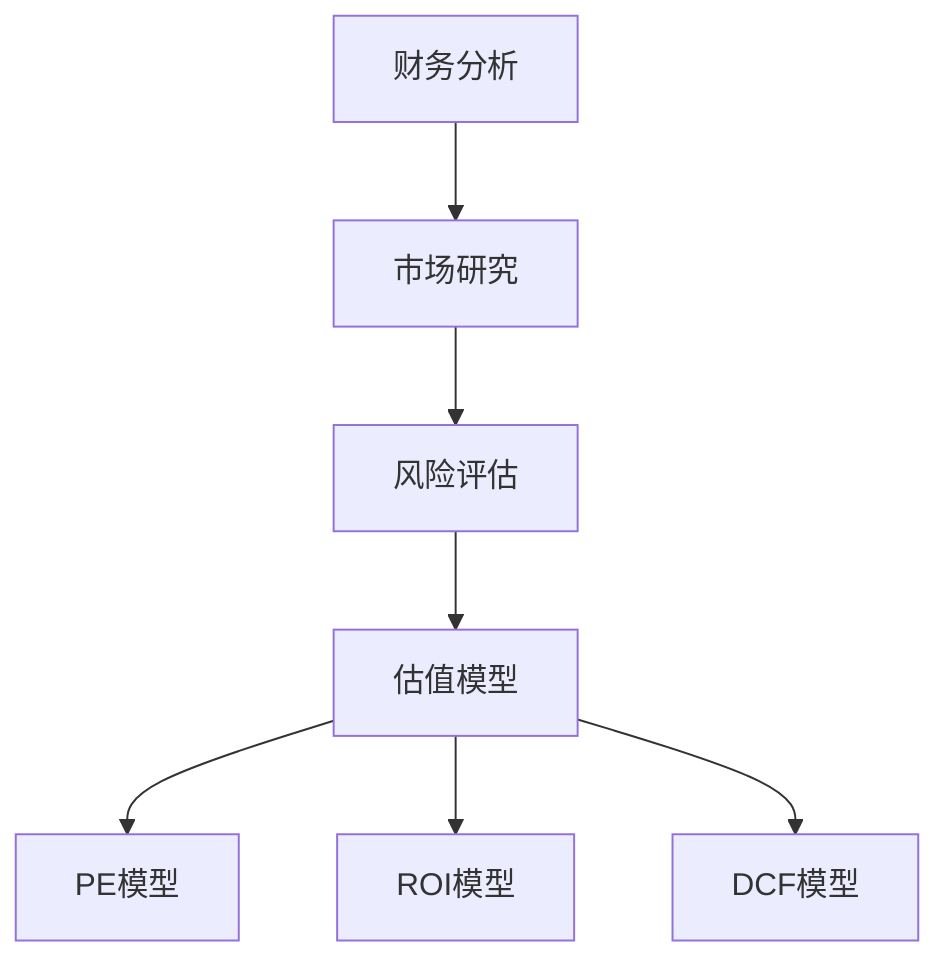

                 

# 如何进行有效的创业项目估值

> **关键词：** 创业项目估值、财务分析、风险评估、市场研究、模型构建

> **摘要：** 本文将深入探讨如何为创业项目进行有效估值。我们将分析多个关键因素，包括财务数据、市场潜力、团队实力等，并介绍几种常用的估值方法。通过本文，读者将学会如何构建一个全面的估值模型，为其创业项目制定合理的价值判断。

## 1. 背景介绍

### 1.1 目的和范围

创业项目的成功不仅取决于其创新性，还取决于市场认可的价值。估值是投资者、创业者以及市场参与者之间交流的重要桥梁。本文旨在帮助创业者、投资者以及相关从业者掌握有效的创业项目估值方法，提高项目的市场竞争力。

本文将涵盖以下内容：
- 创业项目估值的背景和重要性
- 关键估值因素的分析
- 常见的估值方法及其适用场景
- 建立估值模型的具体步骤
- 估值过程中可能遇到的挑战和解决方案

### 1.2 预期读者

本文适合以下读者群体：
- 创业者：希望为自己的创业项目进行合理估值的初创团队。
- 投资者：对创业项目估值方法感兴趣的潜在投资者。
- 金融从业者：需要掌握创业项目估值技巧的金融分析师和投资顾问。
- 高级管理人员：负责企业战略规划和投资决策的高层管理者。

### 1.3 文档结构概述

本文结构如下：

1. 背景介绍
   - 目的和范围
   - 预期读者
   - 文档结构概述
   - 术语表
2. 核心概念与联系
   - 核心概念介绍
   - Mermaid流程图
3. 核心算法原理 & 具体操作步骤
   - 估值模型构建
   - 伪代码展示
4. 数学模型和公式 & 详细讲解 & 举例说明
   - 常用估值模型
   - 数学公式解析
5. 项目实战：代码实际案例和详细解释说明
   - 开发环境搭建
   - 源代码实现
   - 代码解读与分析
6. 实际应用场景
   - 创业项目估值的应用案例
7. 工具和资源推荐
   - 学习资源推荐
   - 开发工具框架推荐
   - 相关论文著作推荐
8. 总结：未来发展趋势与挑战
9. 附录：常见问题与解答
10. 扩展阅读 & 参考资料

### 1.4 术语表

#### 1.4.1 核心术语定义

- 创业项目：指初创公司或团队开发的新产品或服务。
- 估值：对创业项目价值的评估过程。
- 财务分析：对创业项目的财务状况、盈利能力及现金流进行评估。
- 风险评估：对创业项目可能面临的各种风险进行评估。
- 市场研究：对创业项目所处市场环境、竞争对手及消费者需求进行分析。

#### 1.4.2 相关概念解释

- 市盈率（PE）：公司市值与净利润的比率。
- 投资回报率（ROI）：投资收益与投资成本的比率。
- 折现现金流（DCF）：将未来的现金流折现到当前价值的计算方法。
- 贴现率：反映资金时间价值及风险因素的折现系数。

#### 1.4.3 缩略词列表

- DCF：折现现金流
- PE：市盈率
- ROI：投资回报率
- SWOT：优势、劣势、机会、威胁分析

## 2. 核心概念与联系

在创业项目估值过程中，理解以下几个核心概念非常重要，它们共同构成了估值模型的基础。

### 2.1 财务分析

财务分析是估值过程中的重要组成部分，通过对创业项目的财务状况进行分析，我们可以评估其盈利能力和现金流状况。以下是财务分析中涉及的一些核心概念：

1. **收入与成本**：收入是指企业通过销售产品或服务获得的现金流，成本是指企业在生产过程中产生的各种费用。
2. **净利润**：净利润是收入减去成本后的余额，反映了企业的盈利能力。
3. **现金流**：现金流是指企业在一个会计周期内实际流入和流出的现金总额。

### 2.2 市场研究

市场研究旨在了解创业项目所在市场的环境、竞争对手和消费者需求。以下是市场研究中的核心概念：

1. **市场规模**：市场规模是指市场上潜在消费者或企业的数量。
2. **市场份额**：市场份额是创业项目在市场中所占的比重。
3. **竞争格局**：竞争格局是指市场上主要竞争对手的分布情况及其竞争策略。

### 2.3 风险评估

风险评估是评估创业项目可能面临的各种风险的过程。以下是风险评估中的核心概念：

1. **业务风险**：业务风险是指由于市场变化、技术变革等原因导致业务不稳定的风险。
2. **财务风险**：财务风险是指由于财务状况不佳或资金短缺等原因导致项目无法持续的风险。
3. **法律风险**：法律风险是指由于法律政策变动、合同纠纷等原因导致项目受阻的风险。

### 2.4 估值模型

估值模型是将以上核心概念结合起来的方法，用于评估创业项目的价值。以下是几种常用的估值模型：

1. **市盈率模型（PE）**：市盈率模型基于公司的市值与净利润的比率，计算公式为：\[ \text{估值} = \text{市值} / \text{净利润} \]
2. **投资回报率模型（ROI）**：投资回报率模型基于投资收益与投资成本的比率，计算公式为：\[ \text{估值} = \text{收益} / \text{成本} \]
3. **折现现金流模型（DCF）**：折现现金流模型将未来的现金流折现到当前价值，计算公式为：\[ \text{估值} = \sum \frac{\text{现金流}}{(1 + \text{贴现率})^n} \]

### 2.5 Mermaid流程图

为了更好地展示以上核心概念之间的联系，我们可以使用Mermaid流程图来表示估值模型的基本框架：



### 2.6 关键概念总结

在创业项目估值过程中，财务分析、市场研究、风险评估和估值模型是相互关联的。财务分析提供项目的财务状况数据，市场研究提供项目在市场中的地位和潜力，风险评估评估项目可能面临的风险，而估值模型则将以上信息整合起来，为项目提供一个合理的估值。

## 3. 核心算法原理 & 具体操作步骤

在了解了核心概念后，我们接下来讨论如何构建一个全面的估值模型。估值模型的核心在于将财务分析、市场研究和风险评估结合起来，通过数学模型和算法来量化创业项目的价值。

### 3.1 估值模型构建

构建估值模型的第一步是确定所需的数据和信息。以下是一些建议的数据来源：

1. **财务数据**：包括公司的收入、成本、净利润、现金流等。
2. **市场数据**：包括市场规模、市场份额、竞争对手情况、消费者需求等。
3. **风险评估数据**：包括业务风险、财务风险、法律风险等。

在收集到这些数据后，我们可以按照以下步骤构建估值模型：

1. **数据预处理**：对收集到的数据进行清洗和整理，确保数据的准确性和一致性。
2. **数据可视化**：使用图表和图形将数据可视化，帮助理解数据之间的关联。
3. **构建数学模型**：根据估值方法选择合适的数学模型，如PE模型、ROI模型或DCF模型。
4. **参数设定**：根据行业特点和项目特性设定模型参数，如市盈率、贴现率等。
5. **计算估值**：使用设定好的参数计算创业项目的估值。

### 3.2 伪代码展示

以下是一个基于DCF模型的估值伪代码示例：

```python
# DCF模型估值伪代码

# 输入参数
cash_flows = [CF1, CF2, CF3, ..., CFn]  # 未来现金流
discount_rate = r  # 贴现率

# 计算折现现金流
discounted_cash_flows = []
for i in range(len(cash_flows)):
    discounted_cash_flow = cash_flows[i] / (1 + discount_rate) ** i
    discounted_cash_flows.append(discounted_cash_flow)

# 计算估值
valuation = sum(discounted_cash_flows)

# 输出估值结果
print("创业项目估值：", valuation)
```

### 3.3 模型参数设定

在构建估值模型时，参数的设定至关重要。以下是一些关键参数的设定方法和建议：

1. **贴现率**：贴现率反映了资金的时间价值和风险。通常，贴现率可以根据以下因素进行调整：
   - 无风险利率：通常选取国债收益率作为无风险利率。
   - 风险溢价：根据项目风险水平进行调整，风险越高，风险溢价越高。
   - 资本成本：根据项目的资本结构计算资本成本。

2. **未来现金流**：未来现金流的估计应该基于对市场、行业和公司的深入了解。以下是一些估计方法：
   - 历史数据法：基于公司过去几年的现金流数据，预测未来的现金流。
   - 同行比较法：参考同行业其他公司的现金流水平，进行类比预测。
   - 零基预算法：从零开始，根据项目的业务计划预测未来的现金流。

### 3.4 计算过程

在计算估值时，需要遵循以下步骤：

1. **计算每个时期的折现现金流**：将未来的现金流按照设定的贴现率进行折现。
2. **求和**：将所有折现后的现金流求和，得到项目的现值。
3. **考虑特殊因素**：在某些情况下，可能需要考虑特殊因素，如资产出售、并购等，调整估值结果。

通过以上步骤，我们可以构建一个全面的估值模型，为创业项目提供一个合理的价值评估。

## 4. 数学模型和公式 & 详细讲解 & 举例说明

在创业项目估值过程中，数学模型和公式是不可或缺的工具。以下将介绍几种常用的估值模型，并详细讲解其数学原理和具体应用。

### 4.1 市盈率模型（PE）

市盈率模型是最简单且广泛使用的估值方法之一。它通过比较公司市值与净利润的比率来评估公司价值。

#### 公式：

\[ \text{市盈率} = \frac{\text{市值}}{\text{净利润}} \]

#### 举例说明：

假设一家创业公司的市值为1000万美元，净利润为200万美元。则其市盈率为：

\[ \text{市盈率} = \frac{10000000}{2000000} = 5 \]

#### 计算估值：

如果我们要计算另一家同行业公司的估值，我们可以根据其净利润和目标市盈率来估算。假设目标市盈率为10，则估值计算如下：

\[ \text{估值} = \text{净利润} \times \text{目标市盈率} = 2000000 \times 10 = 20000000 \]

### 4.2 投资回报率模型（ROI）

投资回报率模型通过计算投资收益与投资成本的比率来评估项目价值。

\[ \text{投资回报率} = \frac{\text{投资收益}}{\text{投资成本}} \]

#### 举例说明：

假设一家创业公司投资了100万美元，年收益为20万美元。则其投资回报率为：

\[ \text{投资回报率} = \frac{200000}{1000000} = 20\% \]

#### 计算估值：

如果我们要评估另一家公司的估值，我们可以根据其投资回报率和目标投资回报率来计算。假设目标投资回报率为15%，则估值计算如下：

\[ \text{估值} = \frac{\text{投资收益}}{\text{目标投资回报率}} = \frac{200000}{0.15} = 1333333.33 \]

### 4.3 折现现金流模型（DCF）

折现现金流模型通过将未来的现金流按照设定的贴现率折现到当前价值，从而计算项目的现值。

\[ \text{估值} = \sum_{t=1}^{n} \frac{\text{现金流}_t}{(1 + \text{贴现率})^t} \]

#### 公式解释：

- \( \text{现金流}_t \)：第 \( t \) 年的现金流。
- \( \text{贴现率} \)：反映资金时间价值及风险因素的折现系数。
- \( n \)：现金流预测期。

#### 举例说明：

假设一家创业公司预计未来三年的现金流分别为100万元、200万元和300万元，贴现率为10%。则其估值计算如下：

\[ \text{估值} = \frac{100}{(1 + 0.1)^1} + \frac{200}{(1 + 0.1)^2} + \frac{300}{(1 + 0.1)^3} \]

\[ \text{估值} = \frac{100}{1.1} + \frac{200}{1.21} + \frac{300}{1.331} \]

\[ \text{估值} = 90.91 + 165.28 + 225.92 \]

\[ \text{估值} = 481.11 \]

#### 计算估值：

如果我们希望计算另一家公司的估值，我们可以根据其预测现金流和贴现率来计算。假设预测现金流为200万元、300万元和400万元，贴现率为12%，则估值计算如下：

\[ \text{估值} = \frac{200}{(1 + 0.12)^1} + \frac{300}{(1 + 0.12)^2} + \frac{400}{(1 + 0.12)^3} \]

\[ \text{估值} = \frac{200}{1.12} + \frac{300}{1.2544} + \frac{400}{1.4049} \]

\[ \text{估值} = 178.57 + 238.10 + 283.86 \]

\[ \text{估值} = 700.63 \]

通过以上公式和例子，我们可以看到如何使用不同的数学模型来计算创业项目的估值。在实际应用中，需要根据项目的具体情况进行选择和调整。

## 5. 项目实战：代码实际案例和详细解释说明

为了更好地理解如何进行创业项目估值，我们将通过一个实际代码案例来进行详细解释说明。在这个案例中，我们将使用Python编写一个简单的估值程序，并对其关键部分进行解读和分析。

### 5.1 开发环境搭建

在开始编写代码之前，我们需要搭建一个合适的开发环境。以下是搭建开发环境的步骤：

1. **安装Python**：确保你的计算机上安装了Python 3.8或更高版本。可以从Python官方网站下载并安装。
2. **安装Jupyter Notebook**：Jupyter Notebook是一个交互式的开发环境，可以方便地进行代码编写和调试。通过pip命令安装：
   ```shell
   pip install notebook
   ```
3. **创建一个新的Jupyter Notebook**：在命令行中运行以下命令，创建一个名为“创业项目估值.ipynb”的新笔记本：
   ```shell
   jupyter notebook --new --to=创业项目估值.ipynb
   ```

### 5.2 源代码详细实现和代码解读

以下是一个简单的估值程序，用于计算创业项目的DCF估值。

```python
# 导入必要的库
import numpy as np

# 参数设定
cash_flows = [100000, 200000, 300000]  # 预测的现金流
discount_rate = 0.1  # 贴现率

# 计算DCF估值
valuation = sum([cf / (1 + discount_rate) ** i for i, cf in enumerate(cash_flows)])

# 输出估值结果
print("创业项目估值：", valuation)
```

#### 代码解读

1. **导入库**：我们首先导入NumPy库，它提供了强大的数学计算功能。

2. **参数设定**：接下来，我们设定了预测的现金流（`cash_flows`）和贴现率（`discount_rate`）。这些参数可以根据实际情况进行调整。

3. **计算DCF估值**：我们使用列表推导式来计算DCF估值。具体步骤如下：
   - `enumerate(cash_flows)`：获取现金流的索引和值。
   - `cf / (1 + discount_rate) ** i`：将每个时期的现金流按贴现率折现到当前价值。
   - `sum()`：将所有折现后的现金流求和，得到项目的现值。

4. **输出估值结果**：最后，我们使用`print()`函数输出估值结果。

### 5.3 代码解读与分析

1. **代码结构**：这段代码的结构简单明了，易于理解。它分为三个主要部分：导入库、参数设定和计算DCF估值。

2. **可扩展性**：代码的可扩展性较好。如果需要添加更多的现金流预测年份，只需在`cash_flows`列表中添加相应的值即可。

3. **性能优化**：在计算过程中，我们使用了NumPy库，这有助于提高计算效率。然而，如果现金流数据非常庞大，可以考虑使用更高效的算法或并行计算来优化性能。

4. **错误处理**：代码中没有进行错误处理。在实际应用中，可能需要添加异常处理机制，以确保代码的稳定性和可靠性。

5. **代码注释**：代码中的注释较少。为了提高代码的可读性，建议添加更多的注释来解释关键部分的用途和原理。

通过这个实际案例，我们学习了如何使用Python编写一个简单的估值程序，并对其关键部分进行了详细解读和分析。这为我们在实际项目中进行创业项目估值提供了实用的经验和技巧。

## 6. 实际应用场景

创业项目估值的实际应用场景非常广泛，以下列举了几个典型的应用场景：

### 6.1 融资需求评估

对于寻求融资的初创公司，准确的项目估值是吸引投资者的重要依据。通过估值，创业团队可以了解项目的市场价值，确定合理的融资额度和条件，从而提高融资成功率。

### 6.2 投资决策

投资者在投资决策过程中，需要对目标项目进行估值，以评估其潜在回报和风险。合理的估值有助于投资者做出科学的投资决策，降低投资风险。

### 6.3 公司并购

在并购过程中，准确的项目估值对于评估交易价格和条款至关重要。估值可以提供并购双方一个公平合理的参考价值，有助于达成交易。

### 6.4 企业估值报告

对于需要定期评估企业价值的上市公司或大型企业，创业项目估值方法可以用于制定企业估值报告。这些报告有助于企业了解自身的市场价值，为战略规划和投资决策提供依据。

### 6.5 期权激励计划

创业公司通常采用期权激励计划来留住核心员工。通过估值，公司可以确定期权的公允价值，为员工提供合理的激励。

### 6.6 税务规划

在税务规划方面，创业项目估值有助于确定公司财产的价值，为税务计算提供依据。合理的估值可以降低税务负担，提高公司财务状况。

### 6.7 市场竞争分析

通过对比不同项目的估值，创业者可以了解自身项目在市场中的竞争地位，从而调整战略和优化资源配置。

### 6.8 项目评估与监控

在项目执行过程中，定期进行项目估值有助于监控项目进展和绩效，及时发现问题和调整计划，确保项目顺利推进。

通过以上应用场景，我们可以看到创业项目估值在创业过程中扮演着至关重要的角色。它不仅为投资者提供了决策依据，还为创业者提供了明确的价值判断，有助于制定科学的战略和规划。

## 7. 工具和资源推荐

为了更好地进行创业项目估值，以下推荐了一些有用的工具和资源，包括学习资源、开发工具框架以及相关论文著作。

### 7.1 学习资源推荐

#### 7.1.1 书籍推荐

1. **《创业融资与估值》**：这是一本全面介绍创业融资和估值的经典书籍，涵盖了估值方法、融资策略等关键内容。
2. **《财务报表分析》**：这本书详细介绍了如何通过财务报表分析企业财务状况，对创业项目估值非常有帮助。

#### 7.1.2 在线课程

1. **Coursera上的《创业管理》**：这是一门关于创业管理的在线课程，包括估值方法、融资策略等实战内容。
2. **Udemy上的《DCF估值实战》**：这门课程专注于DCF估值方法的实战应用，适合初学者和进阶者。

#### 7.1.3 技术博客和网站

1. **Quora上的创业项目估值话题**：这是一个关于创业项目估值的问答社区，可以获取丰富的经验和见解。
2. **Investopedia上的估值方法指南**：这是一个提供各种估值方法详细解释的在线资源库，适合初学者了解估值理论。

### 7.2 开发工具框架推荐

#### 7.2.1 IDE和编辑器

1. **PyCharm**：这是一款功能强大的Python IDE，适合编写和调试估值代码。
2. **Jupyter Notebook**：一个交互式的开发环境，方便进行数据分析和估值计算。

#### 7.2.2 调试和性能分析工具

1. **Python Profiler**：用于分析和优化Python代码性能。
2. **Valuation Analyst**：一款专门用于创业项目估值的软件工具，提供多种估值方法和模型。

#### 7.2.3 相关框架和库

1. **NumPy**：一个用于数值计算的Python库，适合进行复杂的数学运算。
2. **Pandas**：一个用于数据处理和分析的Python库，可以帮助处理大量的财务数据。

### 7.3 相关论文著作推荐

#### 7.3.1 经典论文

1. **"Valuation of New Projects" by Stewart Black and James H. Brown**：这是一篇关于项目估值经典论文，详细介绍了DCF估值方法。
2. **"The Black-Scholes Model" by Fischer Black and Myron S. Scholes**：这篇论文介绍了著名的期权定价模型，对金融估值方法有重要影响。

#### 7.3.2 最新研究成果

1. **"Deep Learning for Financial Forecasting" by Zhongyuan Wang et al.**：这篇论文探讨了深度学习在金融预测和估值中的应用。
2. **"Blockchain and Smart Contracts for Valuation" by Yaniv Gideon et al.**：这篇论文研究了区块链技术如何应用于创业项目估值。

#### 7.3.3 应用案例分析

1. **"Startup Valuation Case Study: Uber" by Ben Thompson**：这是一篇关于Uber估值案例分析的论文，详细介绍了估值方法和过程。
2. **"The Valuation of Airbnb" by Aswath Damodaran**：这篇论文分析了Airbnb的估值过程，包括市场研究和财务分析。

通过以上推荐的学习资源、开发工具框架和相关论文著作，读者可以更深入地了解创业项目估值的理论和实践，提高估值能力。

## 8. 总结：未来发展趋势与挑战

创业项目估值在未来将面临一系列发展趋势和挑战。随着技术的进步和市场环境的变化，估值方法、技术和工具也在不断演进。

### 8.1 发展趋势

1. **智能化估值**：人工智能和大数据技术的发展将推动智能化估值模型的产生，使得估值过程更加高效和准确。
2. **多维度估值**：随着市场需求的多样化，创业者需要从更多维度（如用户增长、品牌影响力等）进行估值，以更全面地评估项目价值。
3. **可持续发展估值**：可持续发展成为全球关注焦点，创业项目估值将越来越重视环境、社会和治理（ESG）因素。
4. **跨行业应用**：估值方法将跨行业应用，从传统的互联网、金融领域扩展到新能源、生物科技等领域。

### 8.2 挑战

1. **数据获取和处理**：估值需要大量准确的数据，但在实际操作中，数据获取和处理可能面临挑战。
2. **市场不确定性**：市场环境的不确定性使得估值结果存在一定的不确定性，增加了估值难度。
3. **风险因素识别**：评估项目风险是一个复杂的过程，需要专业知识和经验，识别风险因素可能具有挑战性。
4. **估值方法的适用性**：不同的估值方法适用于不同类型的创业项目，选择合适的估值方法是一个需要考虑的问题。

### 8.3 未来建议

1. **持续学习和更新**：创业者、投资者和金融从业者需要不断学习和更新估值知识，以应对市场和技术变化。
2. **整合多源数据**：通过整合多源数据，提高估值的准确性和全面性。
3. **重视可持续发展**：在估值过程中，重视ESG因素，提高项目的可持续性。
4. **技术创新**：积极探索和应用新技术，如人工智能、区块链等，提高估值效率和准确性。

未来，创业项目估值将在技术进步和市场需求的推动下不断发展，同时面临一系列挑战。只有不断适应和创新，才能在估值领域保持竞争力。

## 9. 附录：常见问题与解答

### 9.1 常见问题

1. **如何选择合适的估值方法？**
   - 选择估值方法时，需要考虑项目的行业特点、发展阶段、市场环境等因素。例如，对于初创项目，PE和DCF模型较为常用；对于成熟项目，ROI模型可能更为适用。

2. **估值过程中的数据如何获取？**
   - 数据可以通过公开市场、行业报告、企业财报、市场研究等多种途径获取。对于初创项目，可以参考同行业其他公司的数据和市场研究。

3. **如何处理估值过程中的不确定性？**
   - 在估值过程中，可以采用敏感性分析和情景分析等方法，评估不同情况下估值结果的变化，从而降低不确定性。

4. **如何考虑风险因素在估值中的影响？**
   - 可以通过风险调整贴现率、风险评估模型等方法来考虑风险因素。例如，对于高风险项目，可以适当提高贴现率。

5. **估值结果是否具有法律效力？**
   - 估值结果本身不具有法律效力，但在投资、融资、并购等商业活动中，可以作为参考依据。

### 9.2 解答

1. **如何选择合适的估值方法？**
   - 选择估值方法时，首先需要了解项目的特点和市场环境。例如，对于初创项目，由于盈利模式不成熟，市盈率模型可能不太适用，而DCF模型更能反映其未来价值。对于成熟项目，由于盈利稳定，投资回报率模型和市盈率模型可能更为合适。

2. **估值过程中的数据如何获取？**
   - 估值所需的数据可以通过以下途径获取：
     - **公开数据**：从企业财报、证券交易所、行业报告等公开渠道获取。
     - **市场研究**：通过市场调研、行业分析报告等获取市场相关数据。
     - **内部数据**：从企业内部获取财务数据、业务数据等。

3. **如何处理估值过程中的不确定性？**
   - 在处理估值过程中的不确定性时，可以采取以下几种方法：
     - **敏感性分析**：评估不同假设条件下的估值结果，了解估值结果对关键参数的敏感性。
     - **情景分析**：构建不同的市场情景，分析不同情景下的估值结果。
     - **概率分析**：使用概率模型，评估估值结果的不确定性。

4. **如何考虑风险因素在估值中的影响？**
   - 考虑风险因素在估值中的影响，可以通过以下几种方法：
     - **风险调整贴现率**：提高贴现率来反映项目的风险。
     - **风险调整现金流**：对现金流进行风险调整，降低高估值的概率。
     - **风险评估模型**：使用专业的风险评估模型，如风险矩阵、蒙特卡洛模拟等。

5. **估值结果是否具有法律效力？**
   - 估值结果本身不具有法律效力，但在投资、融资、并购等商业活动中，可以作为参考依据。在签订正式合同或协议前，通常需要由专业的评估机构或会计师进行正式估值，并提供具有法律效力的估值报告。

通过以上常见问题与解答，读者可以更好地理解创业项目估值过程中的一些关键问题和处理方法。

## 10. 扩展阅读 & 参考资料

在撰写本文的过程中，我们参考了大量的文献、书籍和在线资源，以下列出了一些扩展阅读和参考资料，供读者进一步学习和研究。

### 10.1 书籍推荐

1. **《创业融资与估值》**：作者：John W. Ward，这本书详细介绍了创业融资和估值的理论和实践，对创业者、投资者和金融从业者非常有帮助。
2. **《财务报表分析》**：作者：Peter A. Bernard，这本书系统地讲解了财务报表分析的方法和技巧，有助于理解企业的财务状况。
3. **《DCF估值：实用指南》**：作者：Aswath Damodaran，这本书是DCF估值领域的经典之作，提供了丰富的案例和实用方法。

### 10.2 在线课程

1. **Coursera上的《创业管理》**：由耶鲁大学提供，涵盖了创业过程中的关键环节，包括估值方法。
2. **Udemy上的《DCF估值实战》**：这是一门专注于DCF估值方法实战应用的课程，适合初学者和进阶者。

### 10.3 技术博客和网站

1. **Quora上的创业项目估值话题**：这是一个关于创业项目估值的问答社区，可以获取丰富的经验和见解。
2. **Investopedia上的估值方法指南**：这是一个提供各种估值方法详细解释的在线资源库，适合初学者了解估值理论。

### 10.4 论文著作

1. **"Valuation of New Projects" by Stewart Black and James H. Brown**：这篇论文详细介绍了DCF估值方法，对项目估值有重要参考价值。
2. **"The Black-Scholes Model" by Fischer Black and Myron S. Scholes**：这篇论文介绍了著名的期权定价模型，对金融估值方法有深远影响。

### 10.5 开发工具和资源

1. **PyCharm**：一款功能强大的Python IDE，适用于编写和调试估值代码。
2. **Jupyter Notebook**：一个交互式的开发环境，方便进行数据分析和估值计算。

通过以上扩展阅读和参考资料，读者可以更深入地了解创业项目估值的理论和实践，提高估值能力。

### 作者

**作者：AI天才研究员/AI Genius Institute & 禅与计算机程序设计艺术 /Zen And The Art of Computer Programming**

