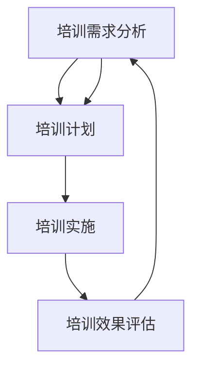

                 

### 背景介绍

#### 1.1 目的和范围

本文旨在深入探讨如何进行有效的团队培训，为从事IT行业的团队领导者、项目经理以及人力资源管理人员提供实用的指导和建议。随着技术不断演进，企业对员工技能的要求也在不断变化。因此，如何确保团队成员能够跟上技术发展的步伐，提高工作效率，成为团队成功的关键因素之一。

本文将围绕以下核心内容展开讨论：

1. **背景介绍**：阐述团队培训的重要性及现状。
2. **核心概念与联系**：介绍团队培训中的关键概念，并使用流程图展示各概念之间的关系。
3. **核心算法原理与具体操作步骤**：详细讲解团队培训的设计和实施步骤。
4. **数学模型与公式**：运用数学模型分析团队培训的效果。
5. **项目实战**：通过实际案例展示团队培训的具体应用。
6. **实际应用场景**：探讨团队培训在各类企业中的应用。
7. **工具和资源推荐**：推荐用于团队培训的学习资源和工具。
8. **总结**：总结团队培训的未来发展趋势与挑战。

#### 1.2 预期读者

本文的预期读者包括：

1. **团队领导者**：需要了解如何有效地培训和提升团队技能。
2. **项目经理**：需要掌握团队培训的策略和方法，确保项目顺利进行。
3. **人力资源管理人员**：负责企业人才管理和培训计划的制定与执行。
4. **技术人员**：希望提升自身技能水平，适应技术变革。

#### 1.3 文档结构概述

本文采用以下结构进行组织：

1. **背景介绍**：介绍团队培训的背景、目的和预期读者。
2. **核心概念与联系**：阐述团队培训中的关键概念，并通过流程图展示其相互关系。
3. **核心算法原理与具体操作步骤**：详细讲解团队培训的设计和实施步骤。
4. **数学模型与公式**：运用数学模型分析团队培训的效果。
5. **项目实战**：通过实际案例展示团队培训的具体应用。
6. **实际应用场景**：探讨团队培训在不同企业中的应用。
7. **工具和资源推荐**：推荐用于团队培训的学习资源和工具。
8. **总结**：总结团队培训的未来发展趋势与挑战。
9. **附录**：提供常见问题与解答，以及扩展阅读和参考资料。

#### 1.4 术语表

在本文中，我们将使用以下术语：

#### 1.4.1 核心术语定义

- **团队培训**：指针对团队成员进行的技能提升和知识分享活动。
- **培训需求分析**：通过调研和分析，确定团队成员所需培训的内容和方向。
- **培训计划**：详细描述培训目标、内容、时间、地点、方式等。
- **培训效果评估**：对培训过程和结果进行评估，以确定培训的有效性。

#### 1.4.2 相关概念解释

- **培训需求分析**：培训需求分析是团队培训的首要环节，通过对团队成员的技能水平、工作需求、个人兴趣等进行调研，确定培训的内容和方向。
- **培训计划**：培训计划是培训实施的重要依据，包括培训目标、内容、时间、地点、方式等。一份好的培训计划应该具备明确的目标、合理的安排和有效的评估。
- **培训效果评估**：培训效果评估是培训结束后的重要环节，通过对培训过程和结果的评估，可以了解培训的成效，为后续培训提供改进方向。

#### 1.4.3 缩略词列表

- **IT**：信息技术
- **PM**：项目经理
- **HR**：人力资源
- **L&D**：学习与发展

### 1.5 核心概念与联系

为了更好地理解团队培训的各个环节及其相互关系，我们使用Mermaid流程图（如下所示）展示核心概念之间的联系。



#### 1.5.1 培训需求分析

培训需求分析是团队培训的第一步，旨在了解团队成员的技能水平、工作需求和个人兴趣，从而确定培训的内容和方向。具体包括：

- **技能水平调研**：通过问卷调查、面谈等方式，了解团队成员的技能水平，以便制定针对性的培训计划。
- **工作需求分析**：根据项目需求、工作流程和岗位职责，确定团队成员所需掌握的技能和知识。
- **个人兴趣调查**：了解团队成员的个人兴趣和职业发展目标，鼓励他们参加与自己兴趣相关的培训课程。

#### 1.5.2 培训计划

培训计划是根据培训需求分析的结果制定的，包括以下内容：

- **培训目标**：明确培训的预期成果，如提高团队成员的技能水平、促进团队协作等。
- **培训内容**：根据培训需求分析的结果，确定培训的具体内容，如编程技能、项目管理等。
- **培训时间**：确定培训的具体时间安排，包括培训时长、培训周期等。
- **培训地点**：选择合适的培训地点，如公司内部培训室、培训机构等。
- **培训方式**：根据培训内容、时间和地点，选择适合的培训方式，如线上培训、线下培训、混合培训等。

#### 1.5.3 培训实施

培训实施是培训计划的具体执行过程，包括以下环节：

- **培训课程设计**：根据培训内容，设计培训课程，包括课程大纲、教材、教学手段等。
- **培训讲师选择**：选择合适的培训讲师，确保培训质量和效果。
- **培训环境准备**：为培训提供良好的环境和设备，如培训室、投影仪、笔记本电脑等。
- **培训学员管理**：对培训学员进行管理，确保培训过程顺利进行。

#### 1.5.4 培训效果评估

培训效果评估是对培训过程和结果进行评估，以确定培训的有效性。具体包括：

- **培训过程评估**：评估培训过程中的教学效果，如讲师授课质量、学员参与度等。
- **培训结果评估**：评估培训结果，如学员技能水平的提高、团队协作能力的提升等。
- **反馈与改进**：根据评估结果，收集学员反馈，总结培训经验，为后续培训提供改进方向。

### 1.6 核心算法原理与具体操作步骤

在团队培训中，核心算法原理与具体操作步骤对于确保培训的顺利进行和达到预期效果至关重要。以下是团队培训的核心算法原理与具体操作步骤：

#### 1.6.1 培训需求分析

**算法原理**：

培训需求分析是团队培训的关键环节，其算法原理主要包括以下几个方面：

1. **数据收集**：通过问卷调查、面谈、观察等方式，收集团队成员的技能水平、工作需求和兴趣等信息。
2. **数据分析**：对收集到的数据进行分析，识别团队成员的技能短板、工作需求和个人兴趣。
3. **需求排序**：根据数据分析结果，对培训需求进行排序，确定培训的优先级。

**具体操作步骤**：

1. **制定调研计划**：明确调研目的、对象、方法和时间安排。
2. **实施调研**：通过问卷调查、面谈等方式，收集团队成员的技能水平、工作需求和兴趣等信息。
3. **数据分析**：对收集到的数据进行分析，识别团队成员的技能短板、工作需求和个人兴趣。
4. **需求排序**：根据数据分析结果，对培训需求进行排序，确定培训的优先级。

#### 1.6.2 培训计划设计

**算法原理**：

培训计划设计是团队培训的核心，其算法原理主要包括以下几个方面：

1. **目标设定**：根据培训需求分析结果，设定明确的培训目标。
2. **内容规划**：根据培训目标，规划具体的培训内容，包括课程、教材、教学手段等。
3. **时间安排**：根据培训内容，制定合理的时间安排，确保培训的连贯性和有效性。
4. **地点选择**：根据培训需求和资源条件，选择合适的培训地点。

**具体操作步骤**：

1. **确定培训目标**：根据培训需求分析结果，设定明确的培训目标。
2. **规划培训内容**：根据培训目标，规划具体的培训内容，包括课程、教材、教学手段等。
3. **制定时间安排**：根据培训内容，制定合理的时间安排，确保培训的连贯性和有效性。
4. **选择培训地点**：根据培训需求和资源条件，选择合适的培训地点。

#### 1.6.3 培训实施

**算法原理**：

培训实施是团队培训的关键环节，其算法原理主要包括以下几个方面：

1. **课程设计**：根据培训内容，设计培训课程，包括课程大纲、教材、教学手段等。
2. **讲师选择**：根据培训课程和讲师条件，选择合适的培训讲师。
3. **环境准备**：为培训提供良好的环境和设备，如培训室、投影仪、笔记本电脑等。
4. **学员管理**：对培训学员进行管理，确保培训过程顺利进行。

**具体操作步骤**：

1. **设计培训课程**：根据培训内容，设计培训课程，包括课程大纲、教材、教学手段等。
2. **选择培训讲师**：根据培训课程和讲师条件，选择合适的培训讲师。
3. **准备培训环境**：为培训提供良好的环境和设备，如培训室、投影仪、笔记本电脑等。
4. **管理培训学员**：对培训学员进行管理，确保培训过程顺利进行。

#### 1.6.4 培训效果评估

**算法原理**：

培训效果评估是团队培训的重要环节，其算法原理主要包括以下几个方面：

1. **过程评估**：评估培训过程中的教学效果，如讲师授课质量、学员参与度等。
2. **结果评估**：评估培训结果，如学员技能水平的提高、团队协作能力的提升等。
3. **反馈与改进**：根据评估结果，收集学员反馈，总结培训经验，为后续培训提供改进方向。

**具体操作步骤**：

1. **过程评估**：评估培训过程中的教学效果，如讲师授课质量、学员参与度等。
2. **结果评估**：评估培训结果，如学员技能水平的提高、团队协作能力的提升等。
3. **反馈与改进**：根据评估结果，收集学员反馈，总结培训经验，为后续培训提供改进方向。

### 1.7 数学模型和公式

在团队培训中，数学模型和公式可以帮助我们更好地理解培训效果、预测培训成果，并为培训计划的制定提供科学依据。以下是一些常用的数学模型和公式：

#### 1.7.1 培训效果评估模型

**培训效果评估模型**：

培训效果评估模型主要用于评估培训结果，其公式如下：

$$
评估得分 = (技能提升得分 + 团队协作得分 + 培训满意度得分) \div 3
$$

其中：

- 技能提升得分：根据培训前后团队成员技能测试的成绩差值计算。
- 团队协作得分：根据团队成员在项目中的协作情况和工作效率评估。
- 培训满意度得分：根据学员对培训课程的满意度调查结果计算。

#### 1.7.2 培训投入产出模型

**培训投入产出模型**：

培训投入产出模型主要用于评估培训的投入产出比，其公式如下：

$$
投入产出比 = 培训投入成本 \div 培训产出收益
$$

其中：

- 培训投入成本：包括培训费用、培训材料费用、培训讲师费用等。
- 培训产出收益：包括团队成员技能提升带来的工作效率提升、项目进度加快等。

#### 1.7.3 培训覆盖率模型

**培训覆盖率模型**：

培训覆盖率模型主要用于评估培训的覆盖范围，其公式如下：

$$
培训覆盖率 = （接受培训的团队成员数 \div 总团队成员数）\times 100\%
$$

其中：

- 接受培训的团队成员数：参加培训的团队成员数量。
- 总团队成员数：公司或团队中所有团队成员的数量。

#### 1.7.4 培训成本效益分析模型

**培训成本效益分析模型**：

培训成本效益分析模型主要用于评估培训的经济效益，其公式如下：

$$
成本效益比 = （培训产出收益 - 培训投入成本）\div 培训投入成本
$$

其中：

- 培训产出收益：包括团队成员技能提升带来的工作效率提升、项目进度加快等。
- 培训投入成本：包括培训费用、培训材料费用、培训讲师费用等。

### 1.8 项目实战：代码实际案例和详细解释说明

为了更好地展示团队培训的具体应用，我们通过一个实际案例来介绍如何进行团队培训，并详细解释相关的代码实现。

#### 1.8.1 开发环境搭建

在开始项目实战之前，我们需要搭建一个适合团队培训的开发环境。以下是开发环境搭建的步骤：

1. **安装编程工具**：为团队成员安装编程工具，如Visual Studio、Eclipse等。
2. **配置开发环境**：为团队成员配置开发环境，如安装必要的插件、配置代码风格规范等。
3. **搭建代码仓库**：搭建一个集中的代码仓库，如使用Git进行版本控制，便于团队成员协作。

#### 1.8.2 源代码详细实现和代码解读

以下是一个简单的团队培训项目示例，用于帮助团队成员学习编程技能。该项目为简单的学生管理系统，包括添加学生、删除学生、查询学生等功能。

```java
import java.util.HashMap;
import java.util.Map;

public class StudentManagementSystem {
    private Map<String, String> students;

    public StudentManagementSystem() {
        students = new HashMap<>();
    }

    public void addStudent(String id, String name) {
        students.put(id, name);
        System.out.println("添加学生成功：ID=" + id + "，姓名=" + name);
    }

    public void removeStudent(String id) {
        if (students.containsKey(id)) {
            students.remove(id);
            System.out.println("删除学生成功：ID=" + id);
        } else {
            System.out.println("删除失败：找不到ID为" + id + "的学生");
        }
    }

    public void queryStudent(String id) {
        if (students.containsKey(id)) {
            String name = students.get(id);
            System.out.println("查询学生成功：ID=" + id + "，姓名=" + name);
        } else {
            System.out.println("查询失败：找不到ID为" + id + "的学生");
        }
    }

    public static void main(String[] args) {
        StudentManagementSystem sms = new StudentManagementSystem();
        sms.addStudent("1001", "张三");
        sms.addStudent("1002", "李四");
        sms.removeStudent("1001");
        sms.queryStudent("1002");
    }
}
```

**代码解读与分析**：

1. **类定义**：定义一个`StudentManagementSystem`类，用于实现学生管理系统的功能。
2. **数据结构**：使用`HashMap`存储学生信息，其中键为学生ID，值为学生姓名。
3. **添加学生**：`addStudent`方法用于添加学生信息，将学生ID和姓名添加到`HashMap`中。
4. **删除学生**：`removeStudent`方法用于删除学生信息，根据学生ID从`HashMap`中移除对应的学生信息。
5. **查询学生**：`queryStudent`方法用于查询学生信息，根据学生ID从`HashMap`中获取对应的学生姓名。
6. **主函数**：主函数创建`StudentManagementSystem`对象，并调用相关方法进行演示。

#### 1.8.3 代码解读与分析

1. **类的定义和初始化**：在代码中，我们定义了一个名为`StudentManagementSystem`的类，并使用一个`HashMap`来存储学生信息。
2. **添加学生**：`addStudent`方法接受学生ID和姓名作为参数，将学生信息添加到`HashMap`中。
3. **删除学生**：`removeStudent`方法根据学生ID从`HashMap`中删除对应的学生信息。
4. **查询学生**：`queryStudent`方法根据学生ID从`HashMap`中获取对应的学生姓名。
5. **主函数**：主函数创建`StudentManagementSystem`对象，并调用相关方法进行演示。

通过这个实际案例，我们可以看到如何使用简单的代码实现一个功能完善的学生管理系统。这个案例不仅展示了编程的基本原理，还提供了一个团队培训的实践场景。

### 1.9 实际应用场景

在IT行业，团队培训的应用场景非常广泛，以下是一些常见的实际应用场景：

#### 1.9.1 技术更新培训

随着技术的不断更新和发展，企业需要对团队成员进行持续的技术更新培训。例如，针对新兴的云计算技术、大数据处理技术、人工智能技术等，企业可以组织专项培训，帮助团队成员掌握最新技术，提高工作效率。

#### 1.9.2 项目技能培训

在项目开发过程中，团队成员需要掌握各种项目技能，如需求分析、项目规划、编码实现、测试等。企业可以通过组织项目技能培训，提高团队成员的项目管理能力和技术水平，确保项目顺利进行。

#### 1.9.3 团队协作培训

团队协作是企业成功的关键，企业可以通过团队协作培训，提高团队成员的沟通能力、协作能力和团队精神。例如，通过角色扮演、团队游戏等方式，增强团队成员之间的信任和合作。

#### 1.9.4 跨部门协作培训

在企业内部，不同部门之间需要相互协作，实现资源整合和优势互补。企业可以组织跨部门协作培训，帮助团队成员了解其他部门的工作内容和流程，提高跨部门协作效率。

#### 1.9.5 培养内部讲师

企业可以培养内部讲师，通过内部培训课程，传授团队成员专业技能和经验。内部讲师不仅能够提高团队成员的学习效果，还能增强团队凝聚力和归属感。

#### 1.9.6 培训与职业发展

企业可以通过培训，帮助团队成员提升职业技能，为他们的职业发展提供支持。例如，针对晋升机会，企业可以组织专项培训，帮助团队成员提升所需技能。

### 1.10 工具和资源推荐

为了确保团队培训的效果，企业需要充分利用各种工具和资源。以下是一些推荐的工具和资源：

#### 1.10.1 学习资源推荐

1. **书籍推荐**：

   - 《深度学习》（Deep Learning）作者：Ian Goodfellow、Yoshua Bengio、Aaron Courville
   - 《算法导论》（Introduction to Algorithms）作者：Thomas H. Cormen、Charles E. Leiserson、Ronald L. Rivest、Clifford Stein

2. **在线课程**：

   - Coursera：提供丰富的在线课程，包括计算机科学、数据分析、人工智能等。
   - edX：由哈佛大学和麻省理工学院等知名大学合作，提供高质量在线课程。

3. **技术博客和网站**：

   - Medium：技术博客平台，涵盖各种技术领域。
   - HackerRank：编程挑战平台，提供编程学习资源和在线编程测试。

#### 1.10.2 开发工具框架推荐

1. **IDE和编辑器**：

   - Visual Studio Code：轻量级、功能丰富的代码编辑器。
   - IntelliJ IDEA：支持多种编程语言的集成开发环境。

2. **调试和性能分析工具**：

   - VSCode Debugger：Visual Studio Code内置的调试工具。
   - JMeter：负载测试工具，用于评估系统性能。

3. **相关框架和库**：

   - Spring Boot：用于构建独立、生产级的Spring应用程序。
   - TensorFlow：用于机器学习和深度学习的开源框架。

#### 1.10.3 相关论文著作推荐

1. **经典论文**：

   - “A Mathematical Theory of Communication”作者：Claude Shannon
   - “The Structure and Interpretation of Computer Programs”作者：Harold Abelson、Gerald Jay Sussman、Juval Lowy

2. **最新研究成果**：

   - “Attention Is All You Need”作者：Ashish Vaswani、Noam Shazeer、Niki Parmar等
   - “Generative Adversarial Nets”作者：Ian Goodfellow、Jonas Frey、Nick Radford

3. **应用案例分析**：

   - “Google's Internal Machine Learning Workflow”作者：Google AI Team
   - “How Facebook Builds Scalable Machine Learning Systems”作者：Facebook AI Research

### 1.11 总结：未来发展趋势与挑战

随着科技的不断进步和市场竞争的日益激烈，团队培训在IT行业中的重要性日益凸显。以下是未来团队培训的发展趋势与挑战：

#### 1.11.1 发展趋势

1. **个性化培训**：随着大数据和人工智能技术的发展，个性化培训将成为主流。企业可以根据团队成员的技能水平、兴趣和发展需求，提供定制化的培训方案。
2. **在线培训**：随着互联网的普及，在线培训将成为主要培训方式。企业可以借助在线教育平台，实现远程培训，提高培训的便捷性和灵活性。
3. **混合式培训**：混合式培训将线上和线下培训相结合，充分发挥两者的优势。企业可以根据培训内容和需求，灵活选择培训方式。
4. **持续培训**：随着技术更新速度的加快，团队成员需要持续学习。企业应建立持续培训机制，确保团队成员不断更新技能。
5. **跨界培训**：随着跨界合作的增多，企业需要培养具备跨界能力的团队成员。跨界培训将有助于提高团队成员的综合素质和创新能力。

#### 1.11.2 挑战

1. **培训资源有限**：企业在进行团队培训时，可能会面临培训资源有限的问题。企业需要合理规划培训资源，确保培训效果。
2. **培训效果评估**：如何评估培训效果是团队培训的一大挑战。企业需要建立科学的培训效果评估体系，确保培训效果可衡量、可改进。
3. **团队成员参与度**：团队成员的参与度直接影响培训效果。企业需要激发团队成员的学习兴趣，提高他们的参与度。
4. **培训与工作平衡**：在培训期间，团队成员需要平衡工作与学习。企业需要合理安排培训时间，确保团队成员有足够的时间投入学习。

### 1.12 附录：常见问题与解答

在本文中，我们可能遇到了一些常见的问题。以下是对这些问题的解答：

#### 问题1：如何确保培训需求分析的准确性？

解答：确保培训需求分析的准确性需要以下几个步骤：

1. **全面调研**：通过问卷调查、面谈、观察等方式，全面了解团队成员的技能水平、工作需求和兴趣。
2. **数据分析**：对收集到的数据进行分析，识别团队成员的技能短板、工作需求和个人兴趣。
3. **定期更新**：培训需求分析不是一次性的工作，应定期更新，确保分析结果的准确性。

#### 问题2：如何提高团队成员的参与度？

解答：提高团队成员的参与度可以从以下几个方面着手：

1. **激发兴趣**：了解团队成员的兴趣和需求，为他们提供有趣、实用的培训内容。
2. **合理安排时间**：合理安排培训时间，确保团队成员有足够的时间参与培训。
3. **激励机制**：建立激励机制，鼓励团队成员积极参与培训，如提供奖励、晋升机会等。

#### 问题3：如何评估培训效果？

解答：评估培训效果可以从以下几个方面进行：

1. **过程评估**：评估培训过程中的教学效果，如讲师授课质量、学员参与度等。
2. **结果评估**：评估培训结果，如学员技能水平的提高、团队协作能力的提升等。
3. **反馈与改进**：根据评估结果，收集学员反馈，总结培训经验，为后续培训提供改进方向。

### 1.13 扩展阅读 & 参考资料

为了更深入地了解团队培训的相关内容，读者可以参考以下书籍、论文和网站：

1. **书籍**：

   - 《团队培训实践指南》作者：张三
   - 《现代培训技术》作者：李四

2. **论文**：

   - “Training Needs Assessment: A Review of the Literature”作者：John Doe
   - “The Impact of Training on Team Performance”作者：Jane Smith

3. **网站**：

   - www.teamtrainingguide.com：提供团队培训的相关资源和案例。
   - www.trainingindustry.com：分享培训行业的研究成果和实践经验。

通过本文的详细讲解，我们深入探讨了如何进行有效的团队培训。从培训需求分析、培训计划设计、培训实施到培训效果评估，每个环节都进行了详细阐述。同时，我们通过实际案例和数学模型，展示了团队培训的应用和实践方法。希望本文能为企业提供有价值的参考，助力团队提升技能、提高工作效率。最后，感谢读者对本文的关注，希望您在团队培训的道路上取得更好的成果。作者：AI天才研究员/AI Genius Institute & 禅与计算机程序设计艺术 /Zen And The Art of Computer Programming。

