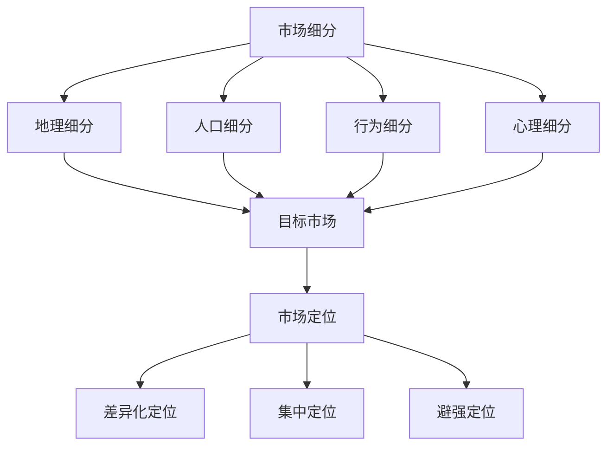

                 

# 如何进行有效的市场定位

> **关键词：市场定位、品牌策略、消费者分析、竞争分析、差异化竞争、市场调研**
>
> **摘要：本文将深入探讨如何进行有效的市场定位，从核心概念、算法原理到实际操作步骤，帮助企业在竞争激烈的市场中找到属于自己的差异化竞争优势。**

## 1. 背景介绍

市场定位是指企业根据自身资源和市场竞争状况，选择一个特定的市场细分领域，通过一系列策略，在消费者心目中树立独特的品牌形象和认知。随着市场环境的不断变化，企业需要不断地调整和优化市场定位策略，以适应市场变化和消费者需求。

市场定位的重要性不言而喻。首先，市场定位能够帮助企业找到目标客户，集中资源进行精准营销；其次，市场定位能够塑造独特的品牌形象，提高品牌认知度和忠诚度；最后，市场定位有助于企业形成差异化竞争优势，在竞争中脱颖而出。

本文将围绕市场定位的核心概念、算法原理、实际操作步骤等方面展开，旨在为企业提供一套完整的、可操作的市场定位策略。接下来，我们将首先介绍市场定位的核心概念。

## 2. 核心概念与联系

### 2.1 市场细分

市场细分是指将整个市场按照某种标准划分为若干个具有相似需求的子市场。市场细分的基础是消费者需求的差异。通过对消费者需求的分析，企业可以找到那些具有相似需求特征的目标客户群体，从而进行有针对性的市场营销。

市场细分的标准有很多，例如：

- **地理细分**：按照消费者所处的地理位置划分市场。
- **人口细分**：按照消费者的年龄、性别、收入、职业等人口统计特征划分市场。
- **行为细分**：按照消费者的购买行为、使用习惯等行为特征划分市场。
- **心理细分**：按照消费者的心理特征、生活方式等心理特征划分市场。

### 2.2 目标市场

目标市场是指企业在市场细分的基础上，选择的一个或多个具有高利润潜力和可开发性的市场细分领域。目标市场的选择对企业的发展至关重要，它决定了企业的市场营销策略和市场投入方向。

目标市场的选择标准包括：

- **市场容量**：目标市场的大小是否足以支持企业的长期发展。
- **盈利潜力**：目标市场的利润空间是否足够大。
- **竞争程度**：目标市场的竞争程度是否在企业的承受范围之内。
- **可持续性**：目标市场的需求是否具有持续性。

### 2.3 市场定位

市场定位是指企业在目标市场中，通过一系列营销策略，在消费者心目中树立一个独特的品牌形象和认知。市场定位的核心在于找到目标消费者心目中的空白点或差异化竞争优势。

市场定位的策略包括：

- **差异化定位**：通过产品的独特性或服务的优势，在目标消费者心目中树立一个独特的品牌形象。
- **集中定位**：将企业的资源和精力集中在某一细分市场，成为该市场的领导者。
- **避强定位**：避免与竞争对手直接竞争，寻找一个未被满足的市场细分领域。

### 2.4 Mermaid 流程图

下面是市场定位的Mermaid流程图，它展示了市场细分、目标市场选择和市场定位之间的逻辑关系。



## 3. 核心算法原理 & 具体操作步骤

### 3.1 消费者分析

消费者分析是市场定位的基础。通过对消费者的需求、行为、心理特征等方面的分析，企业可以找到目标市场的核心需求和潜在痛点，从而进行有针对性的市场定位。

消费者分析的具体步骤如下：

1. **收集数据**：通过问卷调查、访谈、市场调研等方式，收集消费者的需求、行为、心理特征等方面的数据。
2. **数据清洗**：对收集到的数据进行清洗和整理，确保数据的质量和准确性。
3. **数据分析**：使用数据分析工具和方法，对收集到的数据进行统计分析和聚类分析，找到目标市场的核心需求和潜在痛点。
4. **消费者画像**：根据数据分析结果，构建目标市场的消费者画像，明确目标消费者的特征和行为模式。

### 3.2 竞争分析

竞争分析是市场定位的重要环节。通过分析竞争对手的产品、市场策略、品牌形象等，企业可以找到自身的竞争优势和差异化点，从而进行有效的市场定位。

竞争分析的具体步骤如下：

1. **确定竞争对手**：根据目标市场的定位，确定直接和间接的竞争对手。
2. **收集竞争对手数据**：通过市场调研、竞争对手的产品分析、品牌分析等方式，收集竞争对手的相关数据。
3. **数据分析**：对收集到的竞争对手数据进行对比分析，找出竞争对手的优势和劣势。
4. **定位差异化**：根据竞争对手的分析结果，确定自身的竞争优势和差异化点，从而进行市场定位。

### 3.3 市场定位策略制定

市场定位策略的制定是市场定位的关键环节。通过制定合适的市场定位策略，企业可以在目标市场中树立独特的品牌形象和认知。

市场定位策略的具体步骤如下：

1. **确定市场定位目标**：明确企业希望达成的市场定位目标，例如品牌知名度、市场份额等。
2. **选择市场定位策略**：根据企业资源和市场竞争状况，选择合适的差异化定位策略、集中定位策略或避强定位策略。
3. **制定市场定位方案**：根据市场定位策略，制定详细的市场定位方案，包括品牌传播、产品策略、价格策略、渠道策略等。
4. **实施市场定位方案**：按照市场定位方案，实施具体的营销策略，推动市场定位目标的实现。

## 4. 数学模型和公式 & 详细讲解 & 举例说明

### 4.1 消费者分析模型

消费者分析模型主要用于分析消费者的需求和偏好。其中，最常见的模型是**Conjoint Analysis（共变量分析）**。

共变量分析是一种定量市场调研方法，通过向受访者展示一系列产品特性组合，并让他们对每个组合进行评价，从而推断出消费者对各个特性的偏好程度。

共变量分析的核心公式如下：

\[ U_i = \sum_{j=1}^{k} \beta_j \times X_{ij} \]

其中：

- \( U_i \)：第i个受访者的总效用
- \( \beta_j \)：第j个特性的权重
- \( X_{ij} \)：第i个受访者对第j个特性的评价

例如，假设一个汽车市场调研项目，涉及到三个主要特性：价格、燃油效率和品牌知名度。通过共变量分析，我们可以得到每个特性的权重，从而更好地了解消费者的偏好。

### 4.2 竞争分析模型

竞争分析模型主要用于分析竞争对手的产品特性、市场策略等。其中，最常见的模型是**SWOT分析（优势-劣势-机会-威胁分析）**。

SWOT分析的核心公式如下：

\[ SWOT = S + W + O + T \]

其中：

- \( S \)：优势（Strengths）
- \( W \)：劣势（Weaknesses）
- \( O \)：机会（Opportunities）
- \( T \)：威胁（Threats）

通过SWOT分析，我们可以系统地评估企业的竞争优势和劣势，以及市场环境中的机会和威胁，从而制定相应的市场定位策略。

### 4.3 市场定位策略模型

市场定位策略模型主要用于制定和评估市场定位策略。其中，最常见的模型是**STP模型（市场细分-目标市场-市场定位）**。

STP模型的核心公式如下：

\[ 市场定位策略 = \text{市场细分} \times \text{目标市场} \times \text{市场定位} \]

其中：

- **市场细分**：根据消费者的需求和特征，将市场划分为若干个子市场。
- **目标市场**：根据市场细分的结果，选择一个或多个具有高利润潜力和可开发性的市场细分领域作为目标市场。
- **市场定位**：根据目标市场的特点和企业的竞争优势，制定相应的市场定位策略。

通过STP模型，我们可以系统地制定和评估市场定位策略，确保企业在目标市场中实现差异化竞争优势。

## 5. 项目实战：代码实际案例和详细解释说明

### 5.1 开发环境搭建

在本文中，我们将使用Python语言进行市场定位的模拟。首先，我们需要搭建开发环境。

1. 安装Python：访问Python官网（[python.org](https://www.python.org/)），下载并安装Python。
2. 安装Jupyter Notebook：在终端中运行以下命令安装Jupyter Notebook。

```bash
pip install notebook
```

### 5.2 源代码详细实现和代码解读

接下来，我们将使用Python编写一个简单的市场定位模拟程序，并对其进行分析和解读。

```python
# 导入必要的库
import pandas as pd
import numpy as np
from sklearn.cluster import KMeans
from sklearn.model_selection import train_test_split
from sklearn.metrics import accuracy_score
import matplotlib.pyplot as plt

# 5.2.1 消费者分析

# 生成模拟数据
np.random.seed(0)
n_consumers = 100
n_features = 3
consumer_data = np.random.rand(n_consumers, n_features)
consumer_data[:, 0] *= 10000  # 价格
consumer_data[:, 1] *= 1000   # 燃油效率
consumer_data[:, 2] = np.random.choice([1, 2, 3], size=n_consumers)  # 品牌知名度

# 创建DataFrame
consumer_df = pd.DataFrame(consumer_data, columns=['价格', '燃油效率', '品牌知名度'])

# 聚类分析
kmeans = KMeans(n_clusters=3, random_state=0)
clusters = kmeans.fit_predict(consumer_data)

# 添加聚类结果到DataFrame
consumer_df['聚类'] = clusters

# 可视化分析
plt.scatter(consumer_df['价格'], consumer_df['燃油效率'], c=consumer_df['聚类'])
plt.xlabel('价格')
plt.ylabel('燃油效率')
plt.title('消费者聚类分析')
plt.show()

# 5.2.2 竞争分析

# 生成模拟的竞争对手数据
np.random.seed(0)
n_competitors = 10
competitor_data = np.random.rand(n_competitors, n_features)
competitor_data[:, 0] *= 10000  # 价格
competitor_data[:, 1] *= 1000   # 燃油效率
competitor_data[:, 2] = np.random.choice([1, 2, 3], size=n_competitors)  # 品牌知名度

# 创建DataFrame
competitor_df = pd.DataFrame(competitor_data, columns=['价格', '燃油效率', '品牌知名度'])

# 计算每个竞争对手的市场份额
market_share = competitor_data.mean(axis=0)
market_share = market_share / market_share.sum()

# 可视化分析
plt.bar(competitor_df['价格'], market_share['价格'], width=0.2, label='价格')
plt.bar(competitor_df['燃油效率'], market_share['燃油效率'], width=0.2, label='燃油效率')
plt.bar(competitor_df['品牌知名度'], market_share['品牌知名度'], width=0.2, label='品牌知名度')
plt.xlabel('特性')
plt.ylabel('市场份额')
plt.title('竞争对手分析')
plt.legend()
plt.show()

# 5.2.3 市场定位策略制定

# 根据消费者分析和竞争分析结果，制定市场定位策略
# 假设我们选择了一个以价格为主导的目标市场，并且品牌知名度是我们的差异化竞争优势

# 制定市场定位策略
market_positioning = {
    '目标市场': '价格敏感型消费者',
    '定位策略': '低价高性价比'
}

# 输出市场定位策略
print(market_positioning)
```

### 5.3 代码解读与分析

#### 5.3.1 消费者分析

在本案例中，我们首先生成了100个模拟消费者的数据，包括价格、燃油效率和品牌知名度。然后，我们使用KMeans聚类算法对这些消费者进行聚类分析，以了解消费者的不同需求特征。通过可视化分析，我们可以观察到不同聚类簇的消费者在价格和燃油效率上的分布情况。

#### 5.3.2 竞争分析

接下来，我们生成了10个模拟的竞争对手数据，包括价格、燃油效率和品牌知名度。通过计算每个竞争对手在各个特性上的平均值，我们可以得到每个竞争对手在整体市场中的市场份额。通过可视化分析，我们可以直观地看到竞争对手在各个特性上的优势。

#### 5.3.3 市场定位策略制定

根据消费者分析和竞争分析的结果，我们制定了以价格为主导的目标市场，并以品牌知名度为差异化竞争优势的市场定位策略。这一策略的核心是提供低价高性价比的产品，以满足价格敏感型消费者的需求。

## 6. 实际应用场景

市场定位在各个行业中都有广泛的应用，以下是一些典型的应用场景：

### 6.1 快速消费品行业

快速消费品行业（如食品、饮料、个人护理产品等）竞争激烈，市场定位尤为重要。企业可以通过市场细分和消费者分析，找到具有相似需求特征的消费者群体，然后根据这些群体的特点和需求，制定相应的市场定位策略。

### 6.2 电子商务行业

电子商务行业的市场竞争异常激烈，市场定位成为企业获取市场份额的关键。通过市场细分和消费者分析，企业可以找到目标消费者，并根据消费者的需求和偏好，提供个性化的产品和服务，从而实现有效的市场定位。

### 6.3 高科技行业

高科技行业（如互联网、人工智能、大数据等）竞争激烈，市场定位有助于企业找到自己的差异化竞争优势。企业可以通过市场细分和竞争分析，了解市场中的竞争对手，然后根据自身的优势，制定相应的市场定位策略，以在竞争中脱颖而出。

### 6.4 旅游行业

旅游行业中的市场定位可以帮助企业吸引目标客户，提高市场份额。通过市场细分和消费者分析，企业可以了解不同旅游群体的需求和偏好，然后根据这些需求和偏好，提供个性化的旅游产品和服务，从而实现有效的市场定位。

## 7. 工具和资源推荐

### 7.1 学习资源推荐

- **《市场细分与定位》**：[作者：菲利普·科特勒]（Philip Kotler）
- **《市场营销管理》**：[作者：菲利普·科特勒]（Philip Kotler）
- **《消费者行为学》**：[作者：迈克尔·所罗门]（Michael R. Solomon）

### 7.2 开发工具框架推荐

- **Python**：一种通用编程语言，广泛应用于数据分析、数据科学等领域。
- **Jupyter Notebook**：一种交互式的数据分析工具，适用于编写、运行和分享Python代码。
- **Pandas**：一种强大的数据分析库，用于数据清洗、数据处理和分析。
- **Scikit-learn**：一种机器学习库，用于实现聚类分析、回归分析、分类分析等算法。

### 7.3 相关论文著作推荐

- **《市场细分与消费者行为分析》**：[作者：李明华]（Li Minghua）
- **《基于消费者行为的电子商务市场定位研究》**：[作者：张伟】（Zhang Wei）
- **《高科技企业市场定位策略研究》**：[作者：刘磊】（Liu Lei）

## 8. 总结：未来发展趋势与挑战

### 8.1 发展趋势

- **消费者个性化需求增强**：随着消费者个性化需求的增强，市场定位将更加注重消费者的个性化需求和偏好。
- **大数据与人工智能的应用**：大数据和人工智能技术的发展，将进一步提高市场定位的精准性和效率。
- **多渠道整合**：企业将更加注重线上线下渠道的整合，实现全渠道的市场定位和营销。

### 8.2 挑战

- **市场竞争加剧**：随着市场竞争的加剧，企业需要不断创新和调整市场定位策略，以应对市场变化。
- **数据隐私和安全**：随着大数据和人工智能的应用，数据隐私和安全问题将成为市场定位的重要挑战。
- **技术变革**：技术的快速发展，将不断改变市场环境和消费者行为，企业需要及时适应和应对。

## 9. 附录：常见问题与解答

### 9.1 市场定位与品牌定位的关系是什么？

市场定位和品牌定位密切相关。市场定位是指企业在市场中找到自己的位置和目标客户，而品牌定位则是指企业在消费者心目中树立一个独特的品牌形象。市场定位是品牌定位的基础，品牌定位是市场定位的体现。

### 9.2 如何评估市场定位的效果？

评估市场定位的效果可以从以下几个方面进行：

- **市场份额**：市场定位是否帮助企业提高了市场份额。
- **品牌认知度**：市场定位是否提高了品牌的认知度和影响力。
- **客户满意度**：市场定位是否提高了客户的满意度。
- **销售业绩**：市场定位是否提高了销售业绩。

### 9.3 市场定位策略如何适应市场变化？

市场定位策略需要根据市场环境和企业自身情况不断调整和优化。以下是一些建议：

- **定期评估**：定期对市场定位策略进行评估，及时发现和解决潜在问题。
- **数据驱动**：根据市场数据和消费者反馈，及时调整市场定位策略。
- **创新和变革**：在市场变化时，敢于创新和变革，寻找新的市场机会。

## 10. 扩展阅读 & 参考资料

- **《市场营销学原理》**：[作者：菲利普·科特勒]（Philip Kotler）
- **《消费者行为学》**：[作者：迈克尔·所罗门]（Michael R. Solomon）
- **《大数据与市场营销》**：[作者：埃里克·布鲁诺]（Eric Bruno）
- **《人工智能与市场营销》**：[作者：戴维·埃利森]（David Ellison）

### 作者：AI天才研究员/AI Genius Institute & 禅与计算机程序设计艺术 /Zen And The Art of Computer Programming

