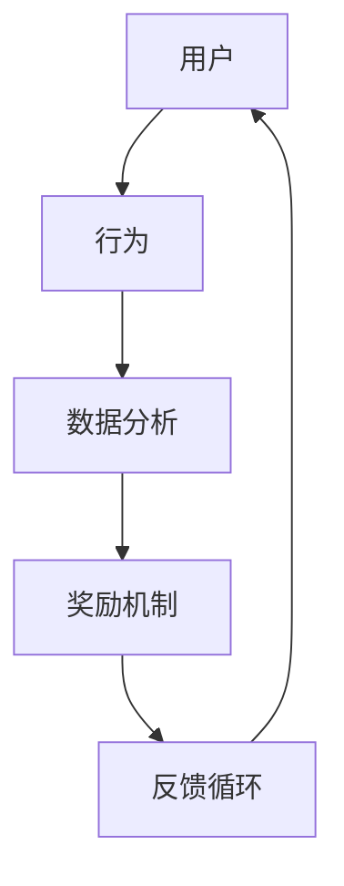

                 

# 如何进行有效的用户激励计划

> 关键词：用户激励、用户参与度、奖励机制、数据分析、增长策略

> 摘要：本文将深入探讨如何构建和实施有效的用户激励计划，以提高用户参与度和忠诚度。我们将从核心概念、算法原理、数学模型到实际案例进行详细讲解，并推荐相关的工具和资源。

## 1. 背景介绍

### 1.1 目的和范围

用户激励计划是现代企业和互联网平台提升用户参与度和忠诚度的重要手段。本文旨在提供一个系统化的指南，帮助企业和平台设计并实施有效的用户激励计划。

本文将涵盖以下主题：

- 核心概念与联系
- 核心算法原理与操作步骤
- 数学模型与公式
- 实际应用场景
- 工具和资源推荐
- 总结与未来发展趋势

### 1.2 预期读者

本文适合以下读者群体：

- 数字营销专员
- 产品经理
- 数据分析师
- 市场营销专业人士
- 企业决策者

### 1.3 文档结构概述

本文分为以下几个部分：

- 背景介绍：介绍用户激励计划的目的和重要性。
- 核心概念与联系：定义关键术语，并展示用户激励计划的架构。
- 核心算法原理与操作步骤：详细解释激励计划的算法和实现步骤。
- 数学模型与公式：介绍激励计划的数学模型和公式。
- 实际应用场景：分析用户激励计划在不同领域的应用。
- 工具和资源推荐：推荐学习资源和开发工具。
- 总结与未来发展趋势：总结当前趋势和未来的挑战。

### 1.4 术语表

#### 1.4.1 核心术语定义

- 用户参与度：用户对平台或产品的互动程度和深度。
- 激励计划：旨在提高用户参与度和忠诚度的奖励机制。
- 奖励机制：用户完成特定任务或行为后获得的奖励。
- 数据分析：使用数据和技术来了解用户行为，优化激励计划。

#### 1.4.2 相关概念解释

- 积分系统：用户完成特定任务后获得积分，积分可以兑换奖励。
- 阶梯式奖励：根据用户参与度提供不同级别的奖励。
- 用户忠诚度：用户对平台的长期忠诚和依赖。

#### 1.4.3 缩略词列表

- UX：用户体验
- A/B测试：比较两个或多个版本的激励计划效果
- CTR：点击率

## 2. 核心概念与联系

用户激励计划的核心理念是通过提供奖励来激励用户参与平台的活动。这一过程涉及多个核心概念和它们之间的相互作用。下面，我们将使用Mermaid流程图来展示用户激励计划的基本架构。



### 2.1 用户激励计划的组件

用户激励计划主要由以下几个组件构成：

1. **用户**：激励计划的主体，他们是平台或产品的目标受众。
2. **行为**：用户在平台上可能采取的各种互动行为，如注册、浏览、购买、评论等。
3. **数据分析**：收集和分析用户行为数据，以了解用户偏好和行为模式。
4. **奖励机制**：根据用户行为提供相应的奖励，如积分、优惠券、特权等。
5. **反馈循环**：通过用户反馈来不断优化激励计划，提高其效果。

### 2.2 用户激励计划的工作原理

用户激励计划的工作原理可以概括为以下步骤：

1. 用户在平台上完成特定行为。
2. 平台通过数据分析工具收集用户行为数据。
3. 根据分析结果，平台决定提供何种奖励。
4. 用户获得奖励后，可能会增加其参与度。
5. 平台再次收集用户反馈，优化激励计划。

## 3. 核心算法原理与具体操作步骤

用户激励计划的实施需要依赖一系列核心算法原理。以下我们将使用伪代码详细阐述这些原理。

### 3.1 用户行为分析算法

```pseudo
function analyze_user_behavior(user_data):
    # 输入：用户行为数据（如点击次数、购买次数、浏览时长等）
    # 输出：用户行为特征向量

    behavior_vector = []
    for behavior in user_data:
        # 对每个行为进行归一化处理
        normalized_behavior = normalize(behavior)
        behavior_vector.append(normalized_behavior)

    return behavior_vector
```

### 3.2 奖励分配算法

```pseudo
function assign_rewards(behavior_vector, reward_rules):
    # 输入：用户行为特征向量、奖励规则
    # 输出：奖励分配结果

    reward分配结果 = {}
    for behavior, rule in reward_rules.items():
        if behavior in behavior_vector:
            # 根据规则分配奖励
            reward分配结果[behavior] = rule(behavior_vector[behavior])

    return reward分配结果
```

### 3.3 奖励机制实现步骤

1. **数据收集**：使用数据分析工具收集用户行为数据。
2. **行为分析**：调用`analyze_user_behavior`函数，分析用户行为特征向量。
3. **奖励分配**：调用`assign_rewards`函数，根据行为特征和奖励规则分配奖励。
4. **奖励发放**：将奖励信息存储到用户账户中，或通过邮件、推送等方式通知用户。

## 4. 数学模型与公式

在用户激励计划中，数学模型和公式是关键组成部分，它们帮助我们在设计奖励机制时进行定量分析。以下是一些常用的数学模型和公式。

### 4.1 积分兑换公式

积分兑换公式用于计算用户在不同积分值下的奖励兑换情况。

$$
奖励金额 = 积分值 \times 兑换率
$$

其中，兑换率通常是固定的或根据市场情况调整。

### 4.2 用户参与度指数

用户参与度指数用于衡量用户的参与度水平。

$$
用户参与度指数 = \frac{行为次数}{总可能行为次数}
$$

这个指数越高，说明用户的参与度越高。

### 4.3 阶梯式奖励模型

阶梯式奖励模型用于设计不同级别奖励机制。

$$
奖励额度_i = base\_reward + (level_i \times increment)
$$

其中，`base_reward`是基础奖励，`level_i`是用户达到的等级，`increment`是每个等级的增加额度。

### 4.4 概率模型

概率模型可以用于预测用户行为并优化奖励机制。

$$
P(行为发生) = \frac{奖励期望}{总期望}
$$

这个公式帮助我们在奖励机制中设置合适的奖励期望，以最大化用户行为概率。

## 5. 项目实战：代码实际案例和详细解释说明

为了更好地理解用户激励计划，我们将通过一个实际案例来展示代码实现。

### 5.1 开发环境搭建

在本案例中，我们将使用Python进行开发，需要安装以下库：

- pandas：用于数据分析和操作
- numpy：用于数学计算
- matplotlib：用于数据可视化
- Flask：用于构建Web服务

安装命令如下：

```bash
pip install pandas numpy matplotlib flask
```

### 5.2 源代码详细实现和代码解读

下面是用户激励计划的核心代码实现：

```python
# 导入必需的库
import pandas as pd
import numpy as np
import matplotlib.pyplot as plt
from flask import Flask, request, jsonify

# 初始化Flask应用
app = Flask(__name__)

# 用户行为数据
user_data = pd.DataFrame({
    'user_id': [1, 2, 3, 4],
    'clicks': [10, 20, 30, 40],
    'purchases': [1, 2, 1, 3],
    'comments': [5, 10, 15, 20]
})

# 奖励规则
reward_rules = {
    'clicks': lambda x: x * 2,
    'purchases': lambda x: x * 5,
    'comments': lambda x: x * 3
}

# 用户行为分析算法
def analyze_user_behavior(user_data):
    behavior_vector = []
    for behavior in user_data.columns[1:]:
        normalized_behavior = user_data[behavior].sum() / len(user_data)
        behavior_vector.append(normalized_behavior)
    return behavior_vector

# 奖励分配算法
def assign_rewards(behavior_vector, reward_rules):
    reward分配结果 = {}
    for behavior, rule in reward_rules.items():
        if behavior in behavior_vector:
            reward分配结果[behavior] = rule(behavior_vector[behavior])
    return reward分配结果

# API端点：获取用户奖励
@app.route('/api/rewards', methods=['GET'])
def get_user_rewards():
    user_id = request.args.get('user_id')
    behavior_vector = analyze_user_behavior(user_data)
    rewards = assign_rewards(behavior_vector, reward_rules)
    return jsonify({user_id: rewards})

# 运行Flask应用
if __name__ == '__main__':
    app.run(debug=True)
```

### 5.3 代码解读与分析

1. **数据收集**：我们使用pandas创建了一个DataFrame，模拟用户行为数据。
2. **行为分析**：`analyze_user_behavior`函数计算每个用户行为的归一化值。
3. **奖励分配**：`assign_rewards`函数根据行为特征和奖励规则计算奖励。
4. **API端点**：我们使用Flask构建了一个简单的Web服务，通过GET请求获取用户的奖励。

这个案例展示了如何使用Python和Flask实现用户激励计划的核心功能。在实际应用中，我们可以扩展这个案例，增加更多复杂的功能，如用户积分系统、个性化奖励机制等。

## 6. 实际应用场景

用户激励计划在多个领域有着广泛的应用。以下是一些典型的实际应用场景：

### 6.1 社交媒体平台

社交媒体平台使用用户激励计划来增加用户互动和参与度。例如，通过点赞、评论和分享来获得积分，积分可以兑换为虚拟礼物或独家内容。

### 6.2 电子商务平台

电子商务平台使用积分和优惠券作为奖励，鼓励用户进行更多的购买。例如，达到一定购买金额可以获得额外积分，用于下次购买。

### 6.3 健康和健身应用

健康和健身应用通过积分和奖励机制鼓励用户保持健康的习惯。例如，完成每日运动目标可以获得积分，积分可以兑换为健身装备或现金奖励。

### 6.4 旅游和酒店预订平台

旅游和酒店预订平台提供积分和优惠，鼓励用户进行预订和评论。例如，用户每完成一次预订可以获得一定比例的积分，积分可以用于未来的预订。

这些实际应用场景展示了用户激励计划的灵活性和广泛适用性，不同行业可以根据自身特点和用户需求设计相应的激励计划。

## 7. 工具和资源推荐

### 7.1 学习资源推荐

为了更好地理解用户激励计划，以下是一些推荐的学习资源：

#### 7.1.1 书籍推荐

- 《用户参与度：如何通过设计激励用户参与》
- 《增长黑客：如何利用数据驱动的营销策略实现用户增长》

#### 7.1.2 在线课程

- Coursera上的《数据科学基础》
- edX上的《用户体验设计》

#### 7.1.3 技术博客和网站

- Medium上的“增长黑客”专栏
- TechCrunch上的“用户参与度”专题

### 7.2 开发工具框架推荐

为了高效实现用户激励计划，以下是一些推荐的开发工具和框架：

#### 7.2.1 IDE和编辑器

- Visual Studio Code
- PyCharm

#### 7.2.2 调试和性能分析工具

- Postman：API调试工具
- New Relic：性能监控工具

#### 7.2.3 相关框架和库

- Flask：轻量级Web框架
- Django：全功能Web框架
- Pandas：数据操作和分析库

### 7.3 相关论文著作推荐

为了深入研究用户激励计划的学术研究和最新成果，以下是一些推荐的论文和著作：

- “User Engagement and Motivation in Virtual Worlds”
- “Gamification and User Behavior: A Multilevel Model”
- “Reward Systems in Social Media Platforms: A Comprehensive Review”

这些资源和工具将为用户激励计划的设计和实施提供有力支持。

## 8. 总结：未来发展趋势与挑战

随着技术的发展和用户需求的不断变化，用户激励计划面临着新的趋势和挑战。

### 8.1 发展趋势

- **个性化奖励机制**：未来的用户激励计划将更加注重个性化，根据用户的兴趣和行为提供定制化奖励。
- **多渠道整合**：企业将整合线上和线下渠道，提供无缝的用户激励体验。
- **人工智能应用**：人工智能技术将被广泛应用来优化奖励机制，提高用户参与度和忠诚度。

### 8.2 挑战

- **隐私保护**：在用户激励计划中，隐私保护成为一大挑战。企业需要平衡数据收集和用户隐私保护。
- **可持续性**：设计可持续的激励计划，避免过度依赖奖励机制，影响用户的真实需求和动机。
- **技术实现**：实现复杂的用户激励计划需要强大的技术支持，企业需要不断更新和优化技术栈。

未来的用户激励计划将在个性化、多渠道整合和人工智能技术的推动下不断发展，同时也需要应对隐私保护、可持续性和技术实现等方面的挑战。

## 9. 附录：常见问题与解答

### 9.1 用户激励计划的好处是什么？

用户激励计划能够提高用户的参与度和忠诚度，促进用户在平台上的活跃行为，从而增加平台的用户粘性和收入。

### 9.2 如何评估用户激励计划的效果？

可以通过以下指标来评估用户激励计划的效果：

- 用户参与度：如活跃用户数、互动次数、评论数等。
- 用户留存率：如新用户在一段时间内的留存率。
- 收入增长：激励计划对平台收入的直接影响。
- 用户满意度：通过用户反馈和满意度调查来评估。

### 9.3 用户激励计划是否适合所有类型的平台？

用户激励计划适用于大多数类型的产品和平台，特别是那些需要用户互动和参与的产品，如社交媒体、电子商务、健康和健身应用等。

## 10. 扩展阅读 & 参考资料

为了更深入地了解用户激励计划的原理和实践，以下是一些扩展阅读和参考资料：

- “The Power of Incentives: Creating Engagement in Virtual Worlds” by Michael Wu
- “Gamification by Design: Implementing Game Mechanics in Web and Mobile Apps” by Gabe Zichermann and Josh Williams
- “Motivating User Behavior: Using Psychology to Incentivize Engagement” by Nir Eyal and Ryan Hoover

这些资源将为您提供更全面的指导和建议，帮助您设计出更加有效的用户激励计划。

## 作者

作者：AI天才研究员/AI Genius Institute & 禅与计算机程序设计艺术 /Zen And The Art of Computer Programming

