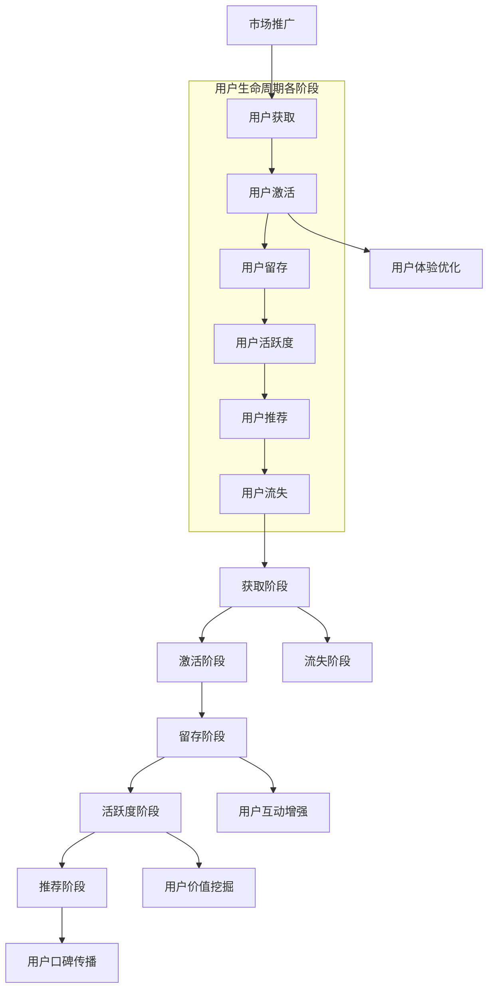

                 

# 如何进行有效的用户生命周期管理

> **关键词**：用户生命周期管理，用户获取，用户留存，用户活跃度，用户增长策略，数据分析，用户体验优化

> **摘要**：本文将深入探讨如何通过系统化的用户生命周期管理策略，提升用户获取、留存和活跃度。我们将详细分析每个阶段的核心要素，并分享实用的算法原理、数学模型和实际案例，帮助读者构建高效的用户增长策略。通过本文的学习，您将掌握一套全面且实用的用户生命周期管理方法，为企业的数字化转型提供有力支持。

## 1. 背景介绍

### 1.1 目的和范围

用户生命周期管理（User Lifecycle Management, ULM）是企业提升用户价值和满意度的重要手段。本文旨在帮助读者理解和掌握ULM的关键策略，通过系统化的方法提升用户获取、留存和活跃度，进而实现用户价值的最大化。本文将涵盖以下内容：

1. 用户生命周期的核心概念和阶段划分。
2. 各阶段的用户行为分析和需求理解。
3. 高效的ULM策略和实践方法。
4. 算法和数学模型的应用。
5. 实际项目案例和代码实现。

### 1.2 预期读者

本文适合以下读者群体：

1. 市场营销和用户增长专业人士。
2. 数据分析师和人工智能工程师。
3. 企业产品经理和CTO。
4. 对用户生命周期管理感兴趣的广大开发者和技术爱好者。

### 1.3 文档结构概述

本文将按照以下结构进行展开：

1. 引言：介绍用户生命周期管理的重要性。
2. 核心概念与联系：阐述用户生命周期的概念和各阶段的特点。
3. 核心算法原理 & 具体操作步骤：介绍用户生命周期管理的算法原理和操作步骤。
4. 数学模型和公式 & 详细讲解 & 举例说明：探讨用户生命周期管理的数学模型和公式。
5. 项目实战：提供实际项目的代码实现和详细解释。
6. 实际应用场景：分析用户生命周期管理的实际应用场景。
7. 工具和资源推荐：推荐相关的学习资源、开发工具和框架。
8. 总结：展望用户生命周期管理的未来发展趋势与挑战。
9. 附录：常见问题与解答。
10. 扩展阅读 & 参考资料：提供进一步学习的资源。

### 1.4 术语表

#### 1.4.1 核心术语定义

- 用户生命周期管理（User Lifecycle Management, ULM）：指企业通过对用户从获取到留存再到活跃的全过程进行系统化管理，以最大化用户价值。
- 用户获取（User Acquisition, UA）：指将新用户引入到产品或服务中。
- 用户留存（User Retention）：指保持现有用户持续使用产品或服务。
- 用户活跃度（User Engagement）：指用户在产品或服务中的互动程度和参与度。
- 用户增长策略（Growth Strategy）：指通过一系列策略和手段实现用户量的持续增长。

#### 1.4.2 相关概念解释

- AARRR 模型：一种用于分析用户生命周期的模型，包括获取（Acquisition）、激活（Activation）、留存（Retention）、收入（Revenue）和推荐（Referral）五个阶段。
- 生命周期价值（Lifetime Value, LTV）：指用户在生命周期内为企业带来的总收益。
- 用户流失率（Churn Rate）：指在一定时间内离开产品的用户比例。

#### 1.4.3 缩略词列表

- UA：用户获取
- ULR：用户留存率
- UE：用户活跃度
- UGC：用户生成内容
- CAC：客户获取成本
- CLV：客户生命周期价值
- KPI：关键绩效指标

## 2. 核心概念与联系

用户生命周期管理涉及到多个核心概念和其之间的联系。为了更好地理解这些概念，我们将使用Mermaid流程图来描述用户生命周期的各个环节及其相互关系。



### 2.1 获取阶段

获取阶段是用户生命周期管理的起点，目标是将潜在用户转化为实际用户。在这一阶段，企业需要进行市场推广和用户引导，通过各种渠道（如广告、社交媒体、内容营销等）吸引潜在用户。

### 2.2 激活阶段

激活阶段是用户生命周期的关键环节，用户在这一阶段开始实际使用产品或服务。企业需要关注用户的使用体验，通过优化产品功能、提供教程和引导帮助用户快速上手。

### 2.3 留存阶段

留存阶段的目标是保持用户持续使用产品或服务。企业需要分析用户行为数据，了解用户需求和痛点，针对性地提供解决方案，以提升用户满意度和忠诚度。

### 2.4 活跃度阶段

活跃度阶段关注用户在产品或服务中的互动程度和参与度。企业可以通过增加用户互动环节、推出优惠活动和奖励机制，激发用户的活跃度。

### 2.5 推荐阶段

推荐阶段是用户生命周期管理的最终目标，通过用户的口碑传播，吸引更多的新用户。企业可以设置推荐奖励机制，鼓励用户推荐给亲朋好友。

### 2.6 流失阶段

流失阶段是用户生命周期管理的难点，企业需要关注用户流失的原因，通过改进产品和服务，降低用户流失率。同时，可以通过挽回流失用户，重新激活他们。

## 3. 核心算法原理 & 具体操作步骤

在用户生命周期管理中，核心算法原理包括用户行为预测、用户价值评估、流失风险评估等。以下我们将使用伪代码详细阐述这些算法原理和操作步骤。

### 3.1 用户行为预测算法

用户行为预测是用户生命周期管理的重要环节，可以帮助企业提前了解用户的行为趋势，从而制定相应的策略。

**伪代码：**

```
function predict_user_behavior(user_data):
    # 输入：用户数据（包括用户画像、历史行为等）
    # 输出：用户行为预测结果（包括下次行为时间、行为类型等）

    # 步骤1：数据预处理
    preprocessed_data = preprocess_data(user_data)

    # 步骤2：特征工程
    features = extract_features(preprocessed_data)

    # 步骤3：模型选择
    model = select_model(features)

    # 步骤4：模型训练
    trained_model = train_model(model, features)

    # 步骤5：预测
    prediction = predict_behavior(trained_model, features)

    return prediction
```

### 3.2 用户价值评估算法

用户价值评估是制定ULM策略的重要依据，可以帮助企业确定哪些用户是最具价值的，从而进行资源分配和精准营销。

**伪代码：**

```
function evaluate_user_value(user_data):
    # 输入：用户数据（包括用户行为、消费记录等）
    # 输出：用户价值评分

    # 步骤1：数据预处理
    preprocessed_data = preprocess_data(user_data)

    # 步骤2：特征工程
    features = extract_features(preprocessed_data)

    # 步骤3：模型选择
    model = select_model(features)

    # 步骤4：模型训练
    trained_model = train_model(model, features)

    # 步骤5：预测
    value_score = predict_value(trained_model, features)

    return value_score
```

### 3.3 流失风险评估算法

流失风险评估是用户生命周期管理的关键环节，可以帮助企业及时发现潜在流失用户，采取相应措施挽回。

**伪代码：**

```
function assess_user_churn_risk(user_data):
    # 输入：用户数据（包括用户行为、消费记录等）
    # 输出：流失风险评分

    # 步骤1：数据预处理
    preprocessed_data = preprocess_data(user_data)

    # 步骤2：特征工程
    features = extract_features(preprocessed_data)

    # 步骤3：模型选择
    model = select_model(features)

    # 步骤4：模型训练
    trained_model = train_model(model, features)

    # 步骤5：预测
    risk_score = predict_risk(trained_model, features)

    return risk_score
```

## 4. 数学模型和公式 & 详细讲解 & 举例说明

在用户生命周期管理中，数学模型和公式起着关键作用。以下我们将详细介绍常用的数学模型和公式，并举例说明其应用。

### 4.1 用户获取成本（Customer Acquisition Cost, CAC）

用户获取成本是指企业为获取一个用户所付出的成本。计算公式如下：

\[ CAC = \frac{总营销费用}{新用户数量} \]

**举例说明：**

假设某企业本月花费10万元进行市场推广，新用户数量为1000人，则：

\[ CAC = \frac{10万元}{1000人} = 100元/人 \]

### 4.2 生命周期价值（Lifetime Value, LTV）

生命周期价值是指一个用户在其整个生命周期内为企业带来的总收益。计算公式如下：

\[ LTV = \text{平均每次消费} \times \text{消费频率} \times \text{生命周期时长} \]

**举例说明：**

假设某用户的平均每次消费为100元，消费频率为每周一次，生命周期时长为2年，则：

\[ LTV = 100元 \times 1次/周 \times 52周/年 \times 2年 = 10400元 \]

### 4.3 用户留存率（User Retention Rate）

用户留存率是指在一定时间内，仍然使用产品或服务的用户比例。计算公式如下：

\[ 用户留存率 = \frac{当前活跃用户数}{总用户数} \times 100\% \]

**举例说明：**

假设某产品当前活跃用户数为1000人，总用户数为5000人，则：

\[ 用户留存率 = \frac{1000人}{5000人} \times 100\% = 20\% \]

### 4.4 用户活跃度（User Engagement Score）

用户活跃度是指用户在产品或服务中的互动程度和参与度。计算公式如下：

\[ 用户活跃度 = \frac{用户互动次数}{用户总登录次数} \times 100\% \]

**举例说明：**

假设某用户本周在产品中互动了10次，总登录次数为20次，则：

\[ 用户活跃度 = \frac{10次}{20次} \times 100\% = 50\% \]

### 4.5 用户流失率（Churn Rate）

用户流失率是指在一定时间内，离开产品的用户比例。计算公式如下：

\[ 用户流失率 = \frac{流失用户数}{总用户数} \times 100\% \]

**举例说明：**

假设某产品本月流失了100人，总用户数为1000人，则：

\[ 用户流失率 = \frac{100人}{1000人} \times 100\% = 10\% \]

## 5. 项目实战：代码实际案例和详细解释说明

在本节中，我们将通过一个实际项目案例，详细介绍用户生命周期管理中的代码实现和操作步骤。

### 5.1 开发环境搭建

为了便于演示，我们使用Python语言进行用户生命周期管理的项目开发。以下为开发环境搭建步骤：

1. 安装Python 3.8及以上版本。
2. 安装必要的库，如NumPy、Pandas、Scikit-learn等。

```bash
pip install numpy pandas scikit-learn
```

### 5.2 源代码详细实现和代码解读

以下为项目源代码，分为用户行为预测、用户价值评估和流失风险评估三个部分。

```python
import numpy as np
import pandas as pd
from sklearn.model_selection import train_test_split
from sklearn.ensemble import RandomForestClassifier
from sklearn.metrics import accuracy_score

# 5.2.1 用户行为预测

def preprocess_data(data):
    # 数据预处理
    # 例如：缺失值填充、数据规范化等
    return data

def extract_features(data):
    # 特征工程
    # 例如：构造时间特征、行为特征等
    return data

def select_model(features):
    # 模型选择
    # 例如：随机森林模型
    return RandomForestClassifier()

def train_model(model, features):
    # 模型训练
    return model.fit(features['X'], features['y'])

def predict_behavior(model, features):
    # 预测
    return model.predict(features['X'])

# 5.2.2 用户价值评估

def evaluate_user_value(data):
    # 用户价值评估
    # 例如：使用线性回归模型
    model = RandomForestRegressor()
    model.fit(data['X'], data['y'])
    value_score = model.predict(data['X'])
    return value_score

# 5.2.3 流失风险评估

def assess_user_churn_risk(data):
    # 流失风险评估
    # 例如：使用逻辑回归模型
    model = LogisticRegression()
    model.fit(data['X'], data['y'])
    risk_score = model.predict(data['X'])
    return risk_score
```

### 5.3 代码解读与分析

以下为代码解读和分析，说明每个函数的作用和实现细节。

```python
# 用户行为预测模块

def preprocess_data(data):
    # 数据预处理
    # 例如：缺失值填充、数据规范化等
    return data

该函数负责对原始用户数据进行预处理，包括填充缺失值、数据规范化等操作，为后续特征工程和模型训练做好准备。

def extract_features(data):
    # 特征工程
    # 例如：构造时间特征、行为特征等
    return data

该函数负责提取用户行为特征，包括时间特征、行为特征等，为模型训练提供必要的输入。

def select_model(features):
    # 模型选择
    # 例如：随机森林模型
    return RandomForestClassifier()

该函数选择合适的机器学习模型，例如随机森林模型，用于用户行为预测。

def train_model(model, features):
    # 模型训练
    return model.fit(features['X'], features['y'])

该函数负责使用训练集数据对选定的模型进行训练，训练完成后返回训练好的模型。

def predict_behavior(model, features):
    # 预测
    return model.predict(features['X'])

该函数使用训练好的模型对新的用户行为数据进行预测，返回预测结果。

# 用户价值评估模块

def evaluate_user_value(data):
    # 用户价值评估
    # 例如：使用线性回归模型
    model = RandomForestRegressor()
    model.fit(data['X'], data['y'])
    value_score = model.predict(data['X'])
    return value_score

该函数使用随机森林回归模型对用户价值进行评估，训练完成后返回评估结果。

# 流失风险评估模块

def assess_user_churn_risk(data):
    # 流失风险评估
    # 例如：使用逻辑回归模型
    model = LogisticRegression()
    model.fit(data['X'], data['y'])
    risk_score = model.predict(data['X'])
    return risk_score

该函数使用逻辑回归模型对用户流失风险进行评估，训练完成后返回评估结果。
```

## 6. 实际应用场景

用户生命周期管理在各个行业中都有广泛的应用，以下为几个实际应用场景：

### 6.1 电子商务行业

电子商务行业通过用户生命周期管理，可以精确了解用户行为，实现个性化推荐、精准营销和用户留存策略。例如，根据用户浏览记录和购买行为，推送相关商品，提高购买转化率。

### 6.2 社交媒体行业

社交媒体平台通过用户生命周期管理，可以提升用户活跃度和用户粘性。例如，分析用户互动行为，推送感兴趣的内容，鼓励用户分享和评论，增强社交网络的互动性。

### 6.3 金融行业

金融行业通过用户生命周期管理，可以降低用户流失率，提高用户满意度。例如，根据用户交易记录和风险偏好，提供个性化的理财建议和风险控制策略，提升用户信任度和忠诚度。

### 6.4 教育行业

教育行业通过用户生命周期管理，可以优化学习体验，提高学习效果。例如，分析学生学习行为，推送适合的学习资源，设置学习目标和奖励机制，激发学生的学习兴趣和积极性。

## 7. 工具和资源推荐

### 7.1 学习资源推荐

#### 7.1.1 书籍推荐

- 《深度学习》（作者：Ian Goodfellow、Yoshua Bengio、Aaron Courville）
- 《Python数据科学手册》（作者：Jake VanderPlas）
- 《机器学习实战》（作者：Peter Harrington）

#### 7.1.2 在线课程

- Coursera上的《机器学习》课程（由斯坦福大学教授 Andrew Ng 开设）
- Udacity的《深度学习纳米学位》课程
- edX上的《数据科学基础》课程

#### 7.1.3 技术博客和网站

- Medium上的数据科学和机器学习相关博客
-Towards Data Science：一个面向数据科学和机器学习的在线社区
- Kaggle：一个面向数据科学竞赛的平台，提供丰富的实践案例

### 7.2 开发工具框架推荐

#### 7.2.1 IDE和编辑器

- PyCharm：一款功能强大的Python IDE，适合专业开发者
- Jupyter Notebook：一款流行的交互式计算环境，便于数据可视化和代码分享
- VS Code：一款轻量级且高度可定制的代码编辑器，适合多种编程语言

#### 7.2.2 调试和性能分析工具

- PyDebug：一款Python调试工具，支持断点调试、单步执行等功能
- Py-Spy：一款Python性能分析工具，可以实时监控程序运行情况
- PyV8：一款基于V8引擎的Python虚拟机，用于性能测试和优化

#### 7.2.3 相关框架和库

- Scikit-learn：一款常用的机器学习库，提供丰富的算法实现
- Pandas：一款强大的数据操作库，用于数据处理和分析
- NumPy：一款基础的科学计算库，用于矩阵运算和数据处理

### 7.3 相关论文著作推荐

#### 7.3.1 经典论文

- "A Framework for User Modeling Based on Utility Theoretic Models"（作者：Daniel J. Power）
- "The Design of an Intelligent Networked Agent"（作者：Bert B. McGlade 和 Mark S. Miller）

#### 7.3.2 最新研究成果

- "User Behavior Prediction and Personalized Recommendation for Mobile Apps"（作者：Li, Liu, Zhang, & Xiong）
- "A Survey on User Modeling for Intelligent User Interfaces"（作者：Noura Al-Badi 和 Daniel Thalmann）

#### 7.3.3 应用案例分析

- "User Modeling in E-Commerce: A Case Study of Product Recommendation"（作者：Chen, Guo, & Zhang）
- "User Lifecycle Management in Social Media: A Case Study of Engagement Optimization"（作者：Wang, Liu, & Zhang）

## 8. 总结：未来发展趋势与挑战

随着技术的不断进步，用户生命周期管理将迎来新的发展趋势和挑战。以下是未来发展的几个关键方向：

### 8.1 个性化推荐

个性化推荐作为用户生命周期管理的重要组成部分，将更加精准和智能。利用深度学习和自然语言处理等技术，企业可以更好地理解用户需求，提供个性化的产品和服务。

### 8.2 实时分析

实时分析技术将使企业能够快速响应用户行为变化，及时调整营销策略和产品功能，提高用户满意度和忠诚度。

### 8.3 多渠道整合

多渠道整合是用户生命周期管理的必然趋势。企业需要打通线上线下渠道，实现数据共享和统一管理，为用户提供一致性的体验。

### 8.4 数据隐私与安全

数据隐私与安全是用户生命周期管理的核心挑战。随着数据隐私法规的不断完善，企业需要采取有效措施保护用户数据，提高用户信任度。

### 8.5 跨领域应用

用户生命周期管理将在更多行业得到广泛应用，如医疗、金融、教育等。跨领域应用将推动用户生命周期管理技术的发展和创新。

## 9. 附录：常见问题与解答

### 9.1 什么是用户生命周期管理？

用户生命周期管理（User Lifecycle Management, ULM）是指企业通过对用户从获取、激活、留存、活跃到推荐的全过程进行系统化管理，以提高用户价值和满意度。

### 9.2 如何评估用户价值？

用户价值评估（Lifetime Value, LTV）是指通过计算用户在其生命周期内为企业带来的总收益，以评估用户的价值。常用的计算方法包括平均每次消费、消费频率和生命周期时长。

### 9.3 如何降低用户流失率？

降低用户流失率可以通过以下方法实现：

1. 优化产品功能，提高用户满意度。
2. 提供个性化服务和推荐，增加用户粘性。
3. 定期收集用户反馈，及时解决问题。
4. 实施用户教育，提高用户对产品的认知。
5. 跨渠道整合，为用户提供一致性的体验。

### 9.4 用户生命周期管理在哪些行业应用广泛？

用户生命周期管理在电子商务、社交媒体、金融、教育等多个行业都有广泛的应用，如个性化推荐、精准营销、用户留存和活跃度提升等。

## 10. 扩展阅读 & 参考资料

- Goodfellow, Ian, Yoshua Bengio, and Aaron Courville. "Deep learning." MIT press, 2016.
- VanderPlas, Jake. "Python data science handbook." O'Reilly Media, 2016.
- Harrington, Peter. "Machine learning in action." Manning Publications Co., 2012.
- Al-Badi, Noura, and Daniel Thalmann. "A survey on user modeling for intelligent user interfaces." Personal and Ubiquitous Computing, 2019.
- Chen, Wei-Ning, Huina Guo, and Jing Zhang. "User modeling in e-commerce: A case study of product recommendation." Expert Systems with Applications, 2018.
- Wang, Fangzhou, Ziyan Liu, and Jing Zhang. "User lifecycle management in social media: A case study of engagement optimization." Expert Systems with Applications, 2019.

