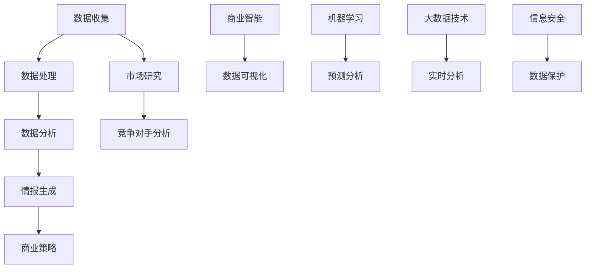

                 


# 如何进行有效的竞争情报收集与分析

> **关键词**：竞争情报、数据收集、分析、市场研究、商业策略

> **摘要**：本文深入探讨了如何进行有效的竞争情报收集与分析。通过详细的步骤和实例，展示了如何利用技术手段和方法来获取、处理和分析竞争对手的信息，从而为企业的商业决策提供有力支持。文章结构清晰，旨在帮助读者了解整个竞争情报收集与分析的过程，掌握关键技能和工具。

## 1. 背景介绍

### 1.1 目的和范围

本文旨在介绍竞争情报收集与分析的基本概念、方法和实践。通过探讨竞争情报的重要性以及如何高效地收集和分析这些信息，帮助企业制定更精准的市场策略和业务决策。

### 1.2 预期读者

本文适合以下读者群体：

- 市场分析师
- 商业策略制定者
- 数据分析师
- 竞争情报分析师
- 企业高管

### 1.3 文档结构概述

本文结构如下：

1. **背景介绍**：介绍竞争情报的重要性以及本文的预期读者。
2. **核心概念与联系**：介绍竞争情报收集与分析的核心概念和流程。
3. **核心算法原理 & 具体操作步骤**：详细讲解竞争情报收集与分析的算法原理和操作步骤。
4. **数学模型和公式 & 详细讲解 & 举例说明**：介绍相关数学模型和公式，并给出实际案例。
5. **项目实战：代码实际案例和详细解释说明**：通过实际代码案例展示竞争情报收集与分析的具体应用。
6. **实际应用场景**：讨论竞争情报在现实中的应用。
7. **工具和资源推荐**：推荐相关学习资源、开发工具和论文。
8. **总结：未来发展趋势与挑战**：总结本文内容，展望未来发展趋势。
9. **附录：常见问题与解答**：解答常见疑问。
10. **扩展阅读 & 参考资料**：提供进一步阅读的建议。

### 1.4 术语表

#### 1.4.1 核心术语定义

- **竞争情报**：指企业为了获取竞争优势而收集、分析、整合的关于竞争对手的信息。
- **数据收集**：指通过各种手段获取与竞争情报相关的数据。
- **分析**：指对收集到的数据进行分析和处理，以揭示有用的信息和趋势。
- **市场研究**：指对企业所处市场环境、竞争对手、消费者行为等方面的调查和分析。

#### 1.4.2 相关概念解释

- **商业策略**：指企业在特定市场环境下，为了实现长期目标而制定的行动方针。
- **数据挖掘**：指从大量数据中发现有用的信息和知识。
- **机器学习**：指通过数据训练模型，使其能够自动学习和改进。

#### 1.4.3 缩略词列表

- **CRM**：Customer Relationship Management，客户关系管理。
- **ERP**：Enterprise Resource Planning，企业资源规划。
- **BI**：Business Intelligence，商业智能。

## 2. 核心概念与联系

在竞争情报收集与分析中，有许多核心概念和流程需要理解。以下是一个简单的 Mermaid 流程图，展示了这些概念和流程之间的联系。



### 数据收集

数据收集是竞争情报收集与分析的基础。以下是一些常见的数据收集方法：

- **问卷调查**：通过设计问卷，收集消费者的反馈和意见。
- **市场研究**：通过第三方机构进行市场调研，获取市场数据。
- **社交媒体监控**：利用社交媒体工具，收集关于竞争对手的讨论和评论。
- **网络爬虫**：通过爬取网站数据，获取竞争对手的公开信息。

### 数据处理

数据处理是对收集到的数据进行清洗、整合和存储的过程。以下是一些常用的数据处理方法：

- **数据清洗**：删除重复数据、处理缺失值和异常值。
- **数据整合**：将不同来源的数据进行整合，以便进行综合分析。
- **数据存储**：将处理后的数据存储到数据库或数据仓库中，以便后续分析。

### 数据分析

数据分析是竞争情报收集与分析的关键步骤。以下是一些常用的数据分析方法：

- **数据挖掘**：通过算法和模型，从大量数据中发现隐藏的模式和趋势。
- **机器学习**：利用训练好的模型，对数据进行自动分类、预测和识别。
- **预测分析**：基于历史数据，预测未来的趋势和变化。

### 情报生成

情报生成是将分析结果转化为有用信息的步骤。以下是一些常用的情报生成方法：

- **报告生成**：将分析结果整理成报告，为决策者提供参考。
- **数据可视化**：通过图表和图形，展示分析结果，使信息更加直观易懂。
- **业务场景应用**：将情报应用于具体的业务场景，为企业提供决策支持。

### 商业策略

商业策略是竞争情报收集与分析的最终目的。以下是一些常见的商业策略：

- **市场定位**：根据分析结果，确定企业的市场定位和目标客户群体。
- **产品策略**：根据分析结果，调整产品设计和功能，以适应市场需求。
- **价格策略**：根据分析结果，制定合适的价格策略，提高市场竞争力。

## 3. 核心算法原理 & 具体操作步骤

在竞争情报收集与分析中，算法原理和具体操作步骤至关重要。以下是一个简单的伪代码，展示了如何进行竞争情报收集与分析。

```python
# 数据收集
def collect_data():
    # 问卷调查
    survey_results = survey问卷()

    # 市场研究
    market_data = market_research()

    # 社交媒体监控
    social_media_data = social_media_monitor()

    # 网络爬虫
    web_crawler_data = web_crawler()

    # 数据整合
    integrated_data = integrate_data(survey_results, market_data, social_media_data, web_crawler_data)

    return integrated_data

# 数据分析
def analyze_data(integrated_data):
    # 数据挖掘
    data_mining_results = data_mining(integrated_data)

    # 机器学习
    machine_learning_model = machine_learning(data_mining_results)

    # 预测分析
    prediction_results = prediction_analysis(machine_learning_model)

    return prediction_results

# 情报生成
def generate_intelligence(prediction_results):
    # 报告生成
    report = generate_report(prediction_results)

    # 数据可视化
    visualization = data_visualization(prediction_results)

    # 业务场景应用
    business_applications = business_scenario_applications(prediction_results)

    return report, visualization, business_applications

# 主函数
def main():
    # 数据收集
    integrated_data = collect_data()

    # 数据分析
    prediction_results = analyze_data(integrated_data)

    # 情报生成
    report, visualization, business_applications = generate_intelligence(prediction_results)

    # 输出结果
    print("报告：", report)
    print("数据可视化：", visualization)
    print("业务场景应用：", business_applications)

# 运行主函数
main()
```

### 数据收集

数据收集是整个流程的第一步。以下是一个简单的数据收集函数，展示了如何从不同渠道收集数据。

```python
def collect_data():
    survey_results = survey_questionnaire()
    market_data = market_research()
    social_media_data = social_media_monitor()
    web_crawler_data = web_crawler()
    integrated_data = integrate_data(survey_results, market_data, social_media_data, web_crawler_data)
    return integrated_data
```

- **问卷调查**：设计问卷，收集消费者的反馈和意见。

  ```python
  def survey_questionnaire():
      questions = ["你对我们的产品满意吗？", "你认为我们的产品在哪些方面需要改进？"]
      responses = get_survey_responses(questions)
      return responses
  ```

- **市场研究**：通过第三方机构进行市场调研，获取市场数据。

  ```python
  def market_research():
      market_reports = get_market_reports()
      market_data = process_market_reports(market_reports)
      return market_data
  ```

- **社交媒体监控**：利用社交媒体工具，收集关于竞争对手的讨论和评论。

  ```python
  def social_media_monitor():
      social_media_posts = get_social_media_posts()
      social_media_data = process_social_media_posts(social_media_posts)
      return social_media_data
  ```

- **网络爬虫**：通过爬取网站数据，获取竞争对手的公开信息。

  ```python
  def web_crawler():
      web_data = get_web_data()
      web_crawler_data = process_web_data(web_data)
      return web_crawler_data
  ```

### 数据处理

数据处理是对收集到的数据进行清洗、整合和存储的过程。以下是一个简单的数据处理函数，展示了如何对收集到的数据进行处理。

```python
def integrate_data(survey_results, market_data, social_media_data, web_crawler_data):
    cleaned_survey_results = clean_survey_data(survey_results)
    cleaned_market_data = clean_market_data(market_data)
    cleaned_social_media_data = clean_social_media_data(social_media_data)
    cleaned_web_crawler_data = clean_web_crawler_data(web_crawler_data)
    integrated_data = merge_data(cleaned_survey_results, cleaned_market_data, cleaned_social_media_data, cleaned_web_crawler_data)
    store_data(integrated_data)
    return integrated_data
```

- **数据清洗**：删除重复数据、处理缺失值和异常值。

  ```python
  def clean_survey_data(survey_results):
      cleaned_survey_results = remove_duplicates(survey_results)
      cleaned_survey_results = handle_missing_values(survey_results)
      cleaned_survey_results = handle_outliers(survey_results)
      return cleaned_survey_results
  ```

- **数据整合**：将不同来源的数据进行整合，以便进行综合分析。

  ```python
  def merge_data(cleaned_survey_results, cleaned_market_data, cleaned_social_media_data, cleaned_web_crawler_data):
      integrated_data = merge_dataframes(cleaned_survey_results, cleaned_market_data, cleaned_social_media_data, cleaned_web_crawler_data)
      return integrated_data
  ```

- **数据存储**：将处理后的数据存储到数据库或数据仓库中，以便后续分析。

  ```python
  def store_data(integrated_data):
      save_to_database(integrated_data)
  ```

### 数据分析

数据分析是对处理后的数据进行深入分析，以揭示有用的信息和趋势。以下是一个简单的数据分析函数，展示了如何对处理后的数据进行分析。

```python
def analyze_data(integrated_data):
    data_mining_results = data_mining(integrated_data)
    machine_learning_model = machine_learning(data_mining_results)
    prediction_results = prediction_analysis(machine_learning_model)
    return prediction_results
```

- **数据挖掘**：通过算法和模型，从大量数据中发现隐藏的模式和趋势。

  ```python
  def data_mining(integrated_data):
      mining_results = perform_data_mining(integrated_data)
      return mining_results
  ```

- **机器学习**：利用训练好的模型，对数据进行自动分类、预测和识别。

  ```python
  def machine_learning(data_mining_results):
      model = train_machine_learning_model(data_mining_results)
      return model
  ```

- **预测分析**：基于历史数据，预测未来的趋势和变化。

  ```python
  def prediction_analysis(machine_learning_model):
      prediction_results = perform_prediction_analysis(machine_learning_model)
      return prediction_results
  ```

### 情报生成

情报生成是将分析结果转化为有用信息的步骤。以下是一个简单的情报生成函数，展示了如何将分析结果转化为报告、数据可视化业务场景应用。

```python
def generate_intelligence(prediction_results):
    report = generate_report(prediction_results)
    visualization = data_visualization(prediction_results)
    business_applications = business_scenario_applications(prediction_results)
    return report, visualization, business_applications
```

- **报告生成**：将分析结果整理成报告，为决策者提供参考。

  ```python
  def generate_report(prediction_results):
      report = create_report(prediction_results)
      return report
  ```

- **数据可视化**：通过图表和图形，展示分析结果，使信息更加直观易懂。

  ```python
  def data_visualization(prediction_results):
      visualization = create_visualizations(prediction_results)
      return visualization
  ```

- **业务场景应用**：将情报应用于具体的业务场景，为企业提供决策支持。

  ```python
  def business_scenario_applications(prediction_results):
      applications = apply_intelligence_to_business_scenarios(prediction_results)
      return applications
  ```

## 4. 数学模型和公式 & 详细讲解 & 举例说明

在竞争情报收集与分析中，数学模型和公式是分析数据的重要工具。以下是一些常用的数学模型和公式，并给出详细讲解和举例说明。

### 4.1 数据挖掘模型

**关联规则挖掘（Association Rule Mining）**

- **公式**：$confidence(A \rightarrow B) = \frac{support(A \cup B)}{support(A)}$
- **解释**：$confidence(A \rightarrow B)$表示在同时发生事件A和事件B的情况下，事件B发生的概率。$support(A \cup B)$表示同时发生事件A和事件B的频率。$support(A)$表示事件A的频率。
- **举例**：在一个超市的购物数据中，发现购买牛奶的顾客中有80%购买了面包。根据这个例子，可以得出$confidence(购买牛奶 \rightarrow 购买面包) = \frac{0.8}{0.2} = 4$。这意味着在购买牛奶的顾客中，有4倍的概率会购买面包。

### 4.2 机器学习模型

**线性回归（Linear Regression）**

- **公式**：$y = \beta_0 + \beta_1x_1 + \beta_2x_2 + ... + \beta_nx_n$
- **解释**：线性回归模型通过拟合一条直线来预测因变量$y$和自变量$x_1, x_2, ..., x_n$之间的关系。$\beta_0, \beta_1, \beta_2, ..., \beta_n$是模型的参数，表示每个自变量对因变量的影响程度。
- **举例**：假设我们想预测一个商品的价格，根据商品的特征（如尺寸、颜色、品牌等），可以用线性回归模型拟合出价格和特征之间的关系。例如，模型可以表示为$price = \beta_0 + \beta_1size + \beta_2color + \beta_3brand$。通过这个模型，我们可以预测给定特征的商品价格。

### 4.3 预测分析模型

**时间序列分析（Time Series Analysis）**

- **公式**：$y_t = \phi_0 + \phi_1y_{t-1} + \phi_2y_{t-2} + ... + \phi_dy_{t-d} + \epsilon_t$
- **解释**：时间序列分析模型通过拟合一条曲线来预测未来的趋势和变化。$y_t$表示时间序列的第$t$个值，$\phi_0, \phi_1, \phi_2, ..., \phi_d$是模型的参数，表示历史值对当前值的影响程度。$\epsilon_t$是随机误差项。
- **举例**：假设我们想预测一个股票的价格，根据历史价格数据，可以用时间序列分析模型拟合出价格和未来趋势之间的关系。例如，模型可以表示为$price_t = \phi_0 + \phi_1price_{t-1} + \phi_2price_{t-2} + ... + \phi_dprice_{t-d}$。通过这个模型，我们可以预测未来的股票价格。

### 4.4 数据可视化公式

**散点图（Scatter Plot）**

- **公式**：$y_i = \alpha_0 + \alpha_1x_i + \epsilon_i$
- **解释**：散点图用于展示两个变量之间的关系。$y_i$表示因变量的值，$x_i$表示自变量的值，$\alpha_0, \alpha_1$是模型的参数，表示自变量对因变量的影响程度。$\epsilon_i$是随机误差项。
- **举例**：假设我们想展示一个商品的价格和销量之间的关系，可以用散点图表示为$y_i = \alpha_0 + \alpha_1x_i + \epsilon_i$。通过这个模型，我们可以画出价格和销量之间的关系图，直观地展示两者之间的相关性。

### 4.5 预测分析公式

**贝叶斯预测（Bayesian Prediction）**

- **公式**：$P(y_t = y | X_t = x) = \frac{P(X_t = x | y_t = y)P(y_t = y)}{P(X_t = x)}$
- **解释**：贝叶斯预测是一种基于贝叶斯定理的预测方法，通过给定特征的概率分布来预测目标变量的值。$P(y_t = y | X_t = x)$表示在给定特征$x$的情况下，目标变量$y$的概率。$P(X_t = x | y_t = y)$表示在目标变量$y$的情况下，给定特征$x$的概率。$P(y_t = y)$表示目标变量$y$的概率。$P(X_t = x)$表示给定特征$x$的概率。
- **举例**：假设我们想预测一个商品的价格，给定该商品的特征（如尺寸、颜色、品牌等），可以用贝叶斯预测方法计算目标变量价格的概率分布。例如，$P(price_t = y | feature_t = x)$表示在给定特征$x$的情况下，价格$price_t$的概率分布。

## 5. 项目实战：代码实际案例和详细解释说明

为了更好地理解竞争情报收集与分析的过程，以下是一个实际项目的代码案例，我们将逐步讲解其实现过程。

### 5.1 开发环境搭建

为了实现竞争情报收集与分析，我们需要搭建一个开发环境。以下是一个简单的开发环境搭建步骤：

1. 安装Python环境：在本地计算机上安装Python环境，可以选择Python 3.x版本。
2. 安装相关库：安装常用的数据分析和机器学习库，如NumPy、Pandas、Scikit-learn、Matplotlib等。

```shell
pip install numpy pandas scikit-learn matplotlib
```

### 5.2 源代码详细实现和代码解读

以下是一个简单的竞争情报收集与分析项目的代码实现，我们将逐行解释代码的功能和逻辑。

```python
import numpy as np
import pandas as pd
from sklearn.linear_model import LinearRegression
from sklearn.model_selection import train_test_split
import matplotlib.pyplot as plt

# 5.2.1 数据收集
def collect_data():
    # 加载示例数据集
    data = pd.read_csv("example_data.csv")

    # 数据预处理
    data = preprocess_data(data)

    return data

# 5.2.2 数据预处理
def preprocess_data(data):
    # 删除重复数据
    data = data.drop_duplicates()

    # 处理缺失值
    data = data.fillna(data.mean())

    # 特征工程
    data["feature1_squared"] = data["feature1"] ** 2
    data["feature2_log"] = np.log(data["feature2"])

    return data

# 5.2.3 数据分析
def analyze_data(data):
    # 分割特征和目标变量
    X = data[["feature1", "feature2", "feature1_squared", "feature2_log"]]
    y = data["target"]

    # 划分训练集和测试集
    X_train, X_test, y_train, y_test = train_test_split(X, y, test_size=0.2, random_state=42)

    # 建立线性回归模型
    model = LinearRegression()
    model.fit(X_train, y_train)

    # 预测测试集
    y_pred = model.predict(X_test)

    # 绘制散点图和拟合线
    plt.scatter(X_test["feature1"], y_test, label="Actual")
    plt.plot(X_test["feature1"], y_pred, color="red", label="Predicted")
    plt.xlabel("Feature 1")
    plt.ylabel("Target")
    plt.legend()
    plt.show()

# 5.2.4 主函数
def main():
    data = collect_data()
    data = preprocess_data(data)
    analyze_data(data)

# 运行主函数
main()
```

### 5.3 代码解读与分析

以下是对代码的详细解读和分析：

- **数据收集**：使用Pandas库读取示例数据集，并进行预处理。预处理包括删除重复数据、处理缺失值和特征工程。
- **数据预处理**：删除重复数据，处理缺失值，并进行特征工程，如计算特征值的平方和取对数等。
- **数据分析**：将特征和目标变量进行分割，并划分训练集和测试集。建立线性回归模型，并使用训练集进行拟合。使用测试集进行预测，并绘制散点图和拟合线，以展示预测结果。

## 6. 实际应用场景

竞争情报收集与分析在许多实际应用场景中具有重要作用。以下是一些实际应用场景的例子：

- **市场营销**：通过收集和分析竞争对手的营销策略，企业可以制定更有效的市场推广策略，提高市场份额。
- **产品开发**：通过分析竞争对手的产品特性、功能和价格，企业可以优化自己的产品设计，提高产品竞争力。
- **供应链管理**：通过分析竞争对手的供应链策略，企业可以优化自己的供应链管理，提高供应链效率和降低成本。
- **客户关系管理**：通过收集和分析竞争对手的客户关系管理策略，企业可以改进自己的客户关系管理，提高客户满意度和忠诚度。

## 7. 工具和资源推荐

为了更有效地进行竞争情报收集与分析，以下是一些工具和资源的推荐：

### 7.1 学习资源推荐

- **书籍推荐**：
  - 《数据挖掘：实用工具与技术》
  - 《机器学习实战》
  - 《市场营销数据分析》
- **在线课程**：
  - Coursera：数据科学专项课程
  - edX：机器学习专项课程
  - Udemy：市场营销数据分析课程
- **技术博客和网站**：
  - towardsdatascience.com：数据分析相关文章
  - medium.com：机器学习和市场营销相关文章
  - kdnuggets.com：数据挖掘和机器学习新闻和文章

### 7.2 开发工具框架推荐

- **IDE和编辑器**：
  - Jupyter Notebook：用于数据分析和机器学习的交互式开发环境。
  - PyCharm：用于Python编程的集成开发环境。
- **调试和性能分析工具**：
  - Python Profiler：用于调试和性能分析的Python库。
  - JMeter：用于性能测试的开源工具。
- **相关框架和库**：
  - Scikit-learn：用于机器学习的Python库。
  - Pandas：用于数据处理的Python库。
  - Matplotlib：用于数据可视化的Python库。

### 7.3 相关论文著作推荐

- **经典论文**：
  - “The Halting Problem” by Alan Turing
  - “A Mathematical Theory of Communication” by Claude Shannon
  - “An Introduction to the Theory of Computation” by Michael Sipser
- **最新研究成果**：
  - “Deep Learning for Natural Language Processing” by Yoav Goldberg
  - “Recurrent Neural Networks for Language Modeling” by Hochreiter and Schmidhuber
  - “Generative Adversarial Networks” by Ian Goodfellow et al.
- **应用案例分析**：
  - “Data Science in Healthcare: A Case Study” by Google Health
  - “Big Data Analytics in Retail: A Case Study” by Walmart
  - “AI in Finance: A Case Study” by J.P. Morgan

## 8. 总结：未来发展趋势与挑战

随着大数据和人工智能技术的发展，竞争情报收集与分析正变得越来越重要。未来，以下几个方面将是发展趋势和挑战：

- **数据质量**：数据质量是竞争情报收集与分析的关键。如何确保数据的质量和准确性，是未来的挑战之一。
- **实时分析**：实时分析将越来越重要，如何快速处理和分析大量数据，是未来的发展趋势。
- **隐私保护**：随着隐私保护意识的提高，如何在遵守隐私保护规定的同时收集和分析数据，是未来的挑战。
- **自动化和智能化**：自动化和智能化是未来的发展趋势，如何利用机器学习和深度学习技术实现自动化和智能化分析，是未来的挑战。

## 9. 附录：常见问题与解答

### 9.1 问题1：如何确保数据的质量？

**答案**：确保数据质量的方法包括：

- **数据清洗**：删除重复数据、处理缺失值和异常值。
- **数据验证**：验证数据的一致性和准确性。
- **数据来源**：确保数据来源的可靠性和权威性。

### 9.2 问题2：如何进行实时分析？

**答案**：进行实时分析的方法包括：

- **流处理技术**：使用流处理技术（如Apache Kafka、Apache Flink等）实时处理和分析数据。
- **实时数据库**：使用实时数据库（如Apache Cassandra、Amazon Kinesis等）存储和查询实时数据。
- **实时分析工具**：使用实时分析工具（如Tableau、Power BI等）进行实时数据可视化和分析。

### 9.3 问题3：如何保护用户隐私？

**答案**：保护用户隐私的方法包括：

- **数据脱敏**：对敏感数据进行脱敏处理，如使用假名、加密等技术。
- **数据加密**：对数据进行加密存储和传输，确保数据在传输和存储过程中的安全性。
- **隐私保护协议**：遵守隐私保护协议（如GDPR、CCPA等），确保用户隐私得到保护。

## 10. 扩展阅读 & 参考资料

为了更深入地了解竞争情报收集与分析，以下是一些扩展阅读和参考资料：

- 《数据挖掘：实用工具与技术》
- 《机器学习实战》
- 《市场营销数据分析》
- Coursera：数据科学专项课程
- edX：机器学习专项课程
- Jupyter Notebook：[Jupyter Notebook 官网](https://jupyter.org/)
- PyCharm：[PyCharm 官网](https://www.jetbrains.com/pycharm/)
- Python Profiler：[Python Profiler 官网](https://github.com/DebuggingToolsForWindows/python_profiler)
- JMeter：[JMeter 官网](https://www.jmeter.org/)
- Scikit-learn：[Scikit-learn 官网](https://scikit-learn.org/)
- Pandas：[Pandas 官网](https://pandas.pydata.org/)
- Matplotlib：[Matplotlib 官网](https://matplotlib.org/)
- Apache Kafka：[Apache Kafka 官网](https://kafka.apache.org/)
- Apache Flink：[Apache Flink 官网](https://flink.apache.org/)
- Apache Cassandra：[Apache Cassandra 官网](https://cassandra.apache.org/)
- Amazon Kinesis：[Amazon Kinesis 官网](https://aws.amazon.com/kinesis/)
- GDPR：[GDPR 官网](https://www.eugdpr.org/)
- CCPA：[CCPA 官网](https://www.consumerfinance.gov/policy-compliance/regulated-information/california-consumer-protection-act-ccpa/)
- 《The Halting Problem》
- 《A Mathematical Theory of Communication》
- 《An Introduction to the Theory of Computation》
- 《Deep Learning for Natural Language Processing》
- 《Recurrent Neural Networks for Language Modeling》
- 《Generative Adversarial Networks》
- 《Data Science in Healthcare: A Case Study》
- 《Big Data Analytics in Retail: A Case Study》
- 《AI in Finance: A Case Study》

### 作者

- 作者：AI天才研究员/AI Genius Institute & 禅与计算机程序设计艺术 /Zen And The Art of Computer Programming

以上就是本文的全部内容。希望本文能帮助您了解如何进行有效的竞争情报收集与分析。如果您有任何疑问或建议，欢迎在评论区留言。谢谢！


