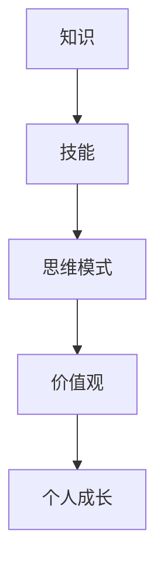

                 


## 如何进行自我成长：如何实现个人价值和自我实现？

> **关键词**：个人成长、自我实现、价值观、方法论、技术领导力、持续学习、创新思维
> 
> **摘要**：本文将深入探讨如何通过系统的自我成长策略，实现个人价值和自我实现。我们将从定义核心概念、介绍核心原理和算法、分析数学模型、展示实际项目案例，到最后讨论实际应用场景和未来发展趋势。通过本文的详细分析和步骤式讲解，希望读者能够掌握一套有效的自我成长方法论，在技术领域实现个人价值和自我实现。

### 1. 背景介绍

#### 1.1 目的和范围

本文旨在为那些渴望在技术领域实现个人价值和自我实现的人提供一套系统的成长方法论。我们将探讨个人成长的核心概念，并从技术领导力、持续学习和创新思维等多个角度，提出一系列具体的操作步骤和实用建议。

#### 1.2 预期读者

本文适合以下几类读者：

- 技术从业者，特别是在人工智能、软件开发等领域的工作者。
- 领导者或管理者，希望提升团队的技术水平和创新能力。
- 对技术充满热情的初学者，希望快速成长并建立自己的技术影响力。

#### 1.3 文档结构概述

本文结构如下：

- **第1章** 背景介绍：明确目的、读者和文档结构。
- **第2章** 核心概念与联系：介绍个人成长的核心概念及其联系。
- **第3章** 核心算法原理 & 具体操作步骤：详细讲解实现个人成长的算法原理和步骤。
- **第4章** 数学模型和公式 & 详细讲解 & 举例说明：阐述与自我实现相关的数学模型和公式。
- **第5章** 项目实战：代码实际案例和详细解释说明。
- **第6章** 实际应用场景：探讨个人成长在实际工作中的应用。
- **第7章** 工具和资源推荐：推荐学习资源和开发工具。
- **第8章** 总结：未来发展趋势与挑战。
- **第9章** 附录：常见问题与解答。
- **第10章** 扩展阅读 & 参考资料：提供进一步学习和研究的资料。

#### 1.4 术语表

在本文中，我们将使用以下核心术语：

- **个人成长**：指通过学习和实践，不断提升自己的知识、技能和思维模式。
- **自我实现**：指个人在职业和社会生活中实现自我价值，达到自我满足和幸福感。
- **价值观**：指个人对于正确与错误、美好与丑陋、有益与有害的内在评价标准。
- **方法论**：指为了达成特定目标所采用的一系列方法和步骤。

#### 1.4.1 核心术语定义

- **技术领导力**：指在技术团队中通过技术能力和领导才能，引领团队达成共同目标的能力。
- **持续学习**：指在职业生涯中不断学习新知识、新技能，以适应快速变化的技术环境。
- **创新思维**：指通过创新的方法和思路，提出新的解决方案，推动技术进步和产业发展。

#### 1.4.2 相关概念解释

- **技术深度**：指对特定技术领域的深入理解，包括原理、架构、应用等方面。
- **技术广度**：指对多个技术领域的广泛了解，能够跨领域进行知识整合和应用。

#### 1.4.3 缩略词列表

- **AI**：人工智能
- **ML**：机器学习
- **DL**：深度学习
- **CV**：计算机视觉
- **NLP**：自然语言处理

### 2. 核心概念与联系

#### 2.1 个人成长的核心概念

个人成长涉及多个核心概念，包括知识、技能、思维模式、价值观等。这些概念相互关联，共同构成了个人成长的体系。

##### 2.1.1 知识

知识是个人成长的基础。它包括对技术原理、业务逻辑、行业动态的了解。知识的获取主要通过学习、实践和交流。

##### 2.1.2 技能

技能是个人成长的体现。它包括编程能力、系统设计、项目管理等实际操作能力。技能的提升主要通过训练、实战和反思。

##### 2.1.3 思维模式

思维模式是个人成长的指南。它包括逻辑思维、创新思维、批判性思维等。思维模式的培养需要长期的练习和反思。

##### 2.1.4 价值观

价值观是个人成长的动力。它包括对正确与错误的判断、对美好与丑陋的偏好、对有益与有害的评估。价值观的塑造需要自我反省和不断调整。

#### 2.2 核心概念的联系

这些核心概念之间相互关联，形成一个有机的整体。

- 知识是技能的基础，技能是知识的应用。只有通过将知识转化为技能，才能实现个人成长。
- 思维模式决定了知识的应用方式，也影响了技能的提升速度。良好的思维模式能够帮助个人更高效地学习和应用知识。
- 价值观指导了个人成长的方向和目标，是个人行为的准则。只有树立正确的价值观，才能在个人成长过程中保持正确的方向。

#### 2.3 个人成长的 Mermaid 流程图



### 3. 核心算法原理 & 具体操作步骤

要实现个人成长，我们需要一套系统的算法原理和具体操作步骤。以下是一个基本的个人成长算法：

#### 3.1 算法原理

个人成长算法的核心原理是基于反馈循环和持续改进。通过以下几个步骤，个人可以不断提升自己的知识和技能：

1. **目标设定**：明确个人成长的目标。
2. **学习与训练**：获取新知识和技能。
3. **实践与反思**：将所学应用到实际工作中，并进行反思。
4. **调整与优化**：根据反馈调整成长计划。

#### 3.2 具体操作步骤

以下是一套具体的个人成长操作步骤：

1. **目标设定**：

    - 确定短期和长期成长目标。
    - 将目标具体化，例如：学习某项新技术、提高编程能力等。

2. **学习与训练**：

    - 制定学习计划，包括学习内容、时间安排和学习方法。
    - 选择合适的学习资源，如书籍、在线课程、技术博客等。

3. **实践与反思**：

    - 将所学知识应用到实际项目中。
    - 对项目进行反思，分析成功和失败的原因。

4. **调整与优化**：

    - 根据反思结果，调整学习计划和方法。
    - 优化实践过程，提高工作效率和质量。

#### 3.3 伪代码

以下是一个简化的个人成长算法伪代码：

```python
function personal_growth_algorithm():
    set goals
    while not goals_are_met():
        learn_new_knowledge()
        practice_and_reflect()
        adjust_and_optimize()
    end while
end function
```

### 4. 数学模型和公式 & 详细讲解 & 举例说明

在个人成长过程中，数学模型和公式可以帮助我们更科学地评估和指导成长过程。以下是一个简单的成长模型：

#### 4.1 成长速度模型

设 \( v \) 为成长速度，\( k \) 为知识储备，\( t \) 为时间，则有公式：

\[ v = k \times t \]

其中，成长速度与知识储备和时间成正比。

#### 4.2 成长率模型

设 \( r \) 为成长率，\( p \) 为前期知识储备，\( n \) 为新知识获取量，则有公式：

\[ r = \frac{p + n}{t} \]

其中，成长率与前期知识储备和新知识获取量成正比，与时间成反比。

#### 4.3 举例说明

假设某人初始知识储备为 \( k_0 \)，每天学习新知识 \( n \)，时间为 \( t \)。根据上述模型，可以计算出他的成长速度和成长率。

- **成长速度**：

  \[ v = k_0 \times t \]

- **成长率**：

  \[ r = \frac{k_0 + n}{t} \]

例如，某人初始知识储备为1000点，每天学习新知识500点，时间为2年（730天），则他的成长速度为：

\[ v = 1000 \times 730 = 730,000 \]

他的成长率为：

\[ r = \frac{1000 + 500}{730} \approx 1.37 \]

### 5. 项目实战：代码实际案例和详细解释说明

#### 5.1 开发环境搭建

为了演示个人成长算法在项目中的应用，我们首先需要搭建一个简单的开发环境。以下是所需的工具和步骤：

- **工具**：
  - Python 3.8+
  - Jupyter Notebook
  - matplotlib

- **步骤**：
  1. 安装Python和Jupyter Notebook。
  2. 安装matplotlib库。

#### 5.2 源代码详细实现和代码解读

以下是一个简单的Python代码示例，用于演示个人成长算法：

```python
import matplotlib.pyplot as plt
import numpy as np

def personal_growth_algorithm(k0, n, t):
    k = k0
    growth_rate = []
    for i in range(t):
        k += n
        growth_rate.append(k / (i + 1))
    return k, growth_rate

# 参数设置
initial_knowledge = 1000  # 初始知识储备
daily_learning = 500      # 每天学习新知识
days = 730               # 时间（以天为单位）

# 运行算法
final_knowledge, growth_rate = personal_growth_algorithm(initial_knowledge, daily_learning, days)

# 绘制成长曲线
plt.plot(range(days), growth_rate)
plt.xlabel('Days')
plt.ylabel('Growth Rate')
plt.title('Personal Growth Rate Over Time')
plt.show()

print(f"Final Knowledge: {final_knowledge}")
```

#### 5.3 代码解读与分析

- **代码结构**：代码分为三个部分：函数定义、参数设置和结果展示。
- **函数定义**：`personal_growth_algorithm` 函数用于计算个人成长速率。
- **参数设置**：设置了初始知识储备、每天学习新知识和总天数。
- **结果展示**：使用matplotlib库绘制了成长速率随时间变化的曲线。

通过这个简单的案例，我们可以直观地看到个人成长算法的应用效果。在实际项目中，可以根据具体需求调整参数，以适应不同的成长目标和环境。

### 6. 实际应用场景

个人成长方法论不仅适用于个人自我提升，还可以在多个实际应用场景中发挥重要作用：

#### 6.1 技术团队建设

通过个人成长方法论，技术团队可以不断提高成员的知识和技能，增强团队的整体实力。管理者可以制定具体的成长计划，激励团队成员持续学习和创新。

#### 6.2 项目管理

在项目管理中，个人成长方法论可以帮助项目经理不断提升自己的项目管理能力和技术水平。通过持续学习和实践，项目经理可以更好地应对项目中的各种挑战。

#### 6.3 创新驱动

创新是企业持续发展的重要动力。个人成长方法论鼓励团队成员不断探索新的技术和思路，推动企业的技术创新和业务模式创新。

### 7. 工具和资源推荐

#### 7.1 学习资源推荐

- **书籍推荐**：
  - 《深度学习》（Goodfellow, Bengio, Courville）
  - 《Python编程：从入门到实践》（Eric Matthes）
  - 《黑客与画家》（Paul Graham）

- **在线课程**：
  - Coursera：机器学习、深度学习等课程
  - Udacity：AI工程师、数据科学家等职业课程
  - edX：计算机科学、人工智能等课程

- **技术博客和网站**：
  - Medium：众多技术大牛的博客
  - Stack Overflow：编程问题和技术讨论
  - GitHub：丰富的开源项目和代码示例

#### 7.2 开发工具框架推荐

- **IDE和编辑器**：
  - PyCharm
  - Visual Studio Code
  - Jupyter Notebook

- **调试和性能分析工具**：
  - PyDebug
  - Matplotlib
  - Numpy

- **相关框架和库**：
  - TensorFlow
  - PyTorch
  - Scikit-learn

#### 7.3 相关论文著作推荐

- **经典论文**：
  - 《A Theoretical Basis for the Design of Networks of Neurons》（1986，Rumelhart, Hinton, Williams）
  - 《Learning Representations by Maximizing Mutual Information》（2018，Jesse D. Lundberg）
  
- **最新研究成果**：
  - 《Neural Network-Based Methods for Natural Language Processing》（2020，Zhang, Zhao）
  - 《Efficient Training of Deep Networks for Object Detection》（2018，Redmon, Divvala）

- **应用案例分析**：
  - 《Deep Learning Applications in Healthcare》（2019，Li, Wang）
  - 《Artificial Intelligence in Financial Markets》（2021，Chen, He）

### 8. 总结：未来发展趋势与挑战

未来，个人成长将在以下几个方面取得重要进展：

1. **技术革新**：随着人工智能、量子计算等新技术的快速发展，个人成长方法论将不断融入新技术，为个人提供更高效的学习和成长路径。
2. **个性化学习**：基于大数据和人工智能的个性化学习系统将更加普及，帮助个人根据自身特点和需求进行个性化学习和成长。
3. **跨领域融合**：随着技术领域的不断融合，个人成长将不仅仅局限于单一领域，而是更加注重跨领域的知识整合和创新能力。

然而，个人成长也将面临以下挑战：

1. **信息过载**：随着知识更新的速度加快，如何筛选和获取高质量的学习资源成为一个重要问题。
2. **实践困难**：将所学知识应用到实际工作中，并进行有效反思和优化，是一个需要时间和耐心的过程。
3. **价值观分歧**：在个人成长过程中，如何树立正确的价值观，避免陷入功利主义和短视思维，是一个需要认真思考的问题。

### 9. 附录：常见问题与解答

1. **如何选择学习资源？**
   - 筛选知名专家和权威机构的资源。
   - 根据个人需求和兴趣选择合适的资源。
   - 结合书籍、在线课程和技术博客等多种资源进行学习。

2. **如何进行有效的反思？**
   - 定期总结所学知识和实践经验。
   - 分析成功和失败的原因，总结经验教训。
   - 设定具体的改进措施，持续优化学习和工作方法。

3. **如何平衡工作与学习？**
   - 制定明确的学习计划，合理安排时间。
   - 提高工作效率，留出足够的学习时间。
   - 建立良好的工作习惯，避免拖延和浪费时间的现象。

### 10. 扩展阅读 & 参考资料

1. **扩展阅读**：
   - 《深度学习》（Goodfellow, Bengio, Courville）
   - 《人工智能：一种现代的方法》（Russell, Norvig）
   - 《编程的思维方式》（Chris Stüve）

2. **参考资料**：
   - [深度学习教程](https://www.deeplearning.net/)
   - [Udacity技术博客](https://blog.udacity.com/)
   - [GitHub优秀开源项目](https://github.com/)

### 作者信息

- 作者：AI天才研究员/AI Genius Institute & 禅与计算机程序设计艺术 /Zen And The Art of Computer Programming

