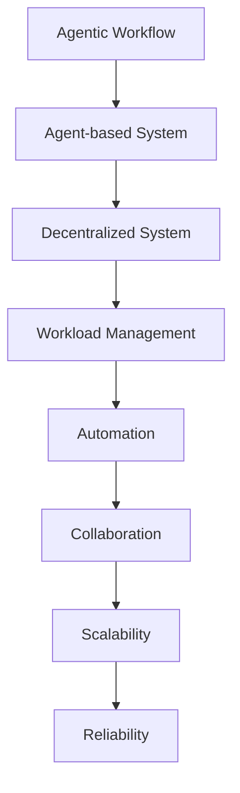

                 

# 如何选择适合的 Agentic Workflow 设计模式

> 
关键词：Agentic Workflow 设计模式、工作流自动化、分布式系统、协作、可扩展性、算法原理、应用场景

摘要：本文将深入探讨 Agentic Workflow 设计模式的选择和应用。我们将首先介绍 Agentic Workflow 的基本概念和特点，然后详细分析其设计模式的选择标准，包括目的、范围、预期读者、文档结构等。通过核心概念与联系、核心算法原理、数学模型和公式、项目实战、实际应用场景等多个方面的讲解，本文旨在帮助读者更好地理解 Agentic Workflow 的设计模式，并为其在实际项目中的应用提供指导。

## 1. 背景介绍

### 1.1 目的和范围

本文旨在探讨 Agentic Workflow 设计模式的选择和应用，帮助读者理解如何选择适合的 Agentic Workflow 设计模式，并在实际项目中有效应用。我们将从以下几个方面展开讨论：

- Agentic Workflow 的基本概念和特点
- 选择 Agentic Workflow 设计模式的准则和标准
- 核心概念与联系
- 核心算法原理与具体操作步骤
- 数学模型和公式与详细讲解
- 项目实战：代码实际案例和详细解释说明
- 实际应用场景
- 工具和资源推荐
- 总结：未来发展趋势与挑战

### 1.2 预期读者

本文主要面向以下读者：

- 对工作流自动化和分布式系统有基本了解的读者
- 想要在项目中应用 Agentic Workflow 设计模式的开发者
- 对 Agentic Workflow 设计模式感兴趣的学术研究者

### 1.3 文档结构概述

本文将按照以下结构进行论述：

1. 背景介绍
2. 核心概念与联系
3. 核心算法原理 & 具体操作步骤
4. 数学模型和公式 & 详细讲解 & 举例说明
5. 项目实战：代码实际案例和详细解释说明
6. 实际应用场景
7. 工具和资源推荐
8. 总结：未来发展趋势与挑战
9. 附录：常见问题与解答
10. 扩展阅读 & 参考资料

### 1.4 术语表

为了确保本文内容的清晰和一致性，以下是一些关键术语的定义：

#### 1.4.1 核心术语定义

- Agentic Workflow：一种基于代理的分布式工作流设计模式，旨在实现自动化、协作和可扩展的分布式系统。
- 代理（Agent）：具有自主性和交互能力的实体，能够根据环境进行决策并采取行动。
- 分布式系统：由多个相互通信的计算机节点组成的系统，协同工作以完成特定任务。
- 工作流（Workflow）：一种描述任务执行顺序和依赖关系的图形表示方法。

#### 1.4.2 相关概念解释

- 自主性（Autonomy）：代理拥有自我管理和自我决策的能力。
- 交互性（Interactivity）：代理能够与其他代理或系统组件进行通信和协作。
- 可扩展性（Scalability）：系统能够随着任务量的增加而有效地扩展。
- 可靠性（Reliability）：系统能够在面临故障、网络中断等异常情况下保持正常运行。

#### 1.4.3 缩略词列表

- Agentic Workflow：AWF
- 分布式系统：DS
- 自主性：Autonomy
- 交互性：Interactivity
- 可扩展性：Scalability
- 可靠性：Reliability

## 2. 核心概念与联系

在深入了解 Agentic Workflow 设计模式之前，我们需要先理解一些核心概念和它们之间的联系。以下是一个简单的 Mermaid 流程图，用于展示这些核心概念之间的关系。



### 2.1 Agentic Workflow

Agentic Workflow 是一种基于代理的工作流设计模式，它通过代理之间的协作来实现任务的自动化和分布式处理。Agentic Workflow 的核心思想是将任务分解为多个可并行执行的小任务，并分配给不同的代理节点。这些代理节点根据任务要求和环境动态调整其行为，以确保任务的完成和系统的可靠性。

### 2.2 代理系统

代理系统是 Agentic Workflow 的基础，它由多个具有自主性和交互能力的代理组成。代理系统能够在分布式环境中高效地完成任务，并通过消息传递进行协作。代理系统通常采用分布式计算框架，如分布式数据库、分布式文件系统和分布式缓存等，以提高系统的性能和可扩展性。

### 2.3 分布式系统

分布式系统是由多个相互通信的计算机节点组成的系统，节点之间通过网络进行通信。分布式系统能够实现任务的分布式处理，提高系统的性能和可靠性。在 Agentic Workflow 中，分布式系统的作用是将任务分配给不同的代理节点，并确保代理节点之间的高效协作。

### 2.4 工作负载管理

工作负载管理是 Agentic Workflow 的关键组件，它负责将任务分配给代理节点，并根据任务的执行情况动态调整代理节点的负载。工作负载管理能够提高系统的效率和性能，确保任务的顺利完成。

### 2.5 自动化

自动化是 Agentic Workflow 的核心目标之一，它通过代理之间的协作来实现任务的自动化执行。自动化能够提高系统的效率，减少人工干预，降低运营成本。

### 2.6 协作

协作是 Agentic Workflow 的关键特性之一，它通过代理之间的交互和协作来实现任务的分布式处理。协作能够提高系统的可扩展性和可靠性，确保任务的顺利完成。

### 2.7 可扩展性

可扩展性是 Agentic Workflow 的关键特性之一，它使系统能够随着任务量的增加而有效地扩展。可扩展性能够提高系统的性能和可靠性，确保系统的长期稳定运行。

### 2.8 可靠性

可靠性是 Agentic Workflow 的关键特性之一，它确保系统能够在面临故障、网络中断等异常情况下保持正常运行。可靠性能够提高系统的可靠性和稳定性，确保任务的顺利完成。

通过上述核心概念和联系的分析，我们可以更好地理解 Agentic Workflow 设计模式的基本原理和应用。在下一节中，我们将深入探讨 Agentic Workflow 的核心算法原理和具体操作步骤。

## 3. 核心算法原理 & 具体操作步骤

### 3.1 核心算法原理

Agentic Workflow 的核心算法原理主要包括任务分配、代理协作、负载均衡和异常处理等方面。以下是一个简单的伪代码，用于描述 Agentic Workflow 的核心算法原理。

```python
# 任务分配
def assign_tasks(workflow, agents):
    for task in workflow.tasks:
        agent = select_agent(agents)
        agent.assign_task(task)

# 代理协作
def collaborate(agents):
    for agent in agents:
        agent.execute_tasks()

# 负载均衡
def balance_load(agents):
    for agent in agents:
        if agent.load > threshold:
            transfer_tasks(agent)

# 异常处理
def handle_exceptions(agent, task):
    if task.failed:
        retry_task(task)
    else:
        raise_exception()

# 伪代码：Agentic Workflow 的核心算法原理
def agentic_workflow(workflow, agents):
    assign_tasks(workflow, agents)
    collaborate(agents)
    balance_load(agents)
    handle_exceptions()
```

### 3.2 具体操作步骤

下面是一个具体的操作步骤，用于实现 Agentic Workflow 的核心算法原理。

1. **任务分配**：首先，我们需要将工作流（workflow）中的任务分配给代理（agents）。这可以通过循环遍历工作流中的任务，并为每个任务选择一个代理来完成。任务选择算法可以根据代理的负载、能力等因素进行优化。

```python
def assign_tasks(workflow, agents):
    for task in workflow.tasks:
        agent = select_agent(agents)
        agent.assign_task(task)
```

2. **代理协作**：在任务分配完成后，代理需要执行其分配的任务。代理之间的协作可以通过消息传递机制来实现。代理可以定期向其他代理发送心跳消息，以保持通信和同步。

```python
def collaborate(agents):
    for agent in agents:
        agent.execute_tasks()
```

3. **负载均衡**：在代理执行任务的过程中，可能会出现负载不均衡的情况。为了保持系统的稳定性和性能，我们需要对代理的负载进行动态调整。这可以通过定期检查每个代理的负载，并在负载过高的代理上转移部分任务来实现。

```python
def balance_load(agents):
    for agent in agents:
        if agent.load > threshold:
            transfer_tasks(agent)
```

4. **异常处理**：在任务执行过程中，可能会出现各种异常情况，如任务失败、代理故障等。为了确保任务的顺利完成，我们需要对异常情况进行处理。例如，对于失败的

