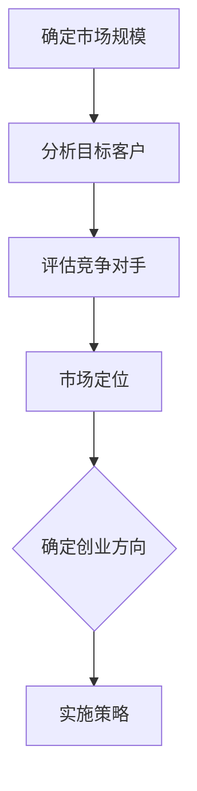
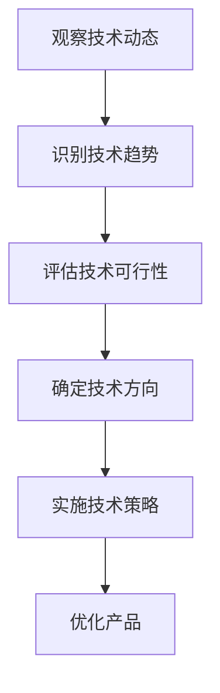
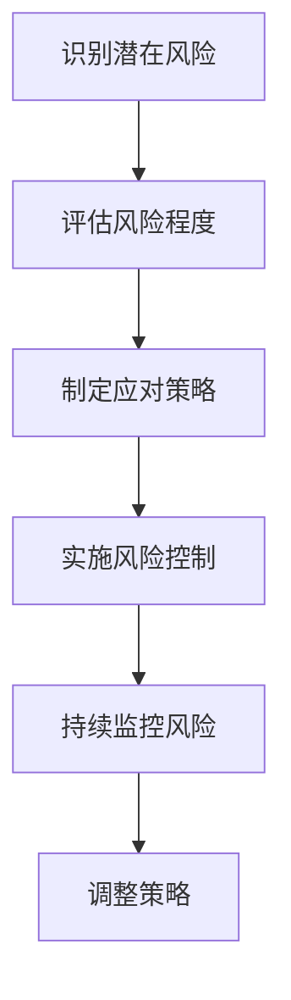
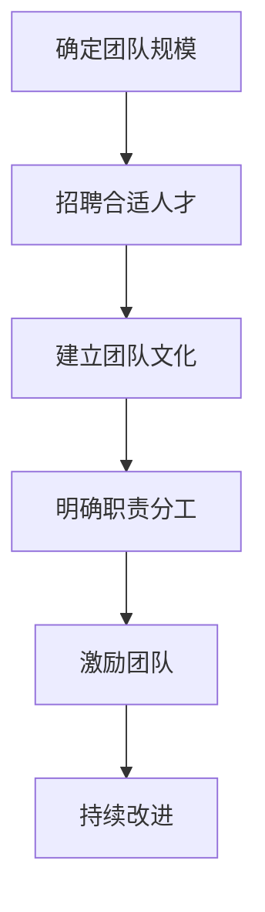

                 

# 如何选择适合自己的创业方向

## 关键词：创业方向、市场分析、技术趋势、风险控制、团队建设

> 选择一个合适的创业方向对于创业成功至关重要。本文将深入探讨如何通过逻辑分析和技术思考来选择适合自己的创业方向。

## 摘要

创业不仅需要激情和决心，更需要明智的决策和周密的规划。本文将围绕如何选择适合自己的创业方向展开讨论，从市场分析、技术趋势、风险控制和团队建设等多个方面，提供一系列实用的方法论和案例分析，帮助创业者更好地定位自己的创业之路。

## 1. 背景介绍

在当今快速变化的社会和经济环境中，创业已经成为许多人实现个人价值和社会价值的途径。然而，选择一个合适的创业方向并不容易。这不仅需要创业者具备敏锐的市场洞察力，还需要他们具备深厚的技术功底和团队管理能力。

本文将通过以下几个方面来帮助创业者选择适合自己的创业方向：

- **市场分析**：了解市场需求和竞争格局，把握市场趋势。
- **技术趋势**：关注最新技术动态，评估技术可行性。
- **风险控制**：评估创业风险，制定应对策略。
- **团队建设**：组建合适的团队，提高创业成功率。

## 2. 核心概念与联系

### 2.1 市场需求分析

市场需求分析是创业过程中不可或缺的一环。它涉及到对市场规模的估算、目标客户群体的分析以及竞争对手的评估。通过这些分析，创业者可以了解市场现状和潜在机会。

#### Mermaid 流程图：



### 2.2 技术趋势分析

技术趋势分析是创业者必须关注的一个领域。通过研究技术发展趋势，创业者可以找到创新的切入点，从而在市场上占据有利地位。

#### Mermaid 流程图：



### 2.3 风险控制

创业过程中，风险是不可避免的。创业者需要评估潜在风险，并制定相应的应对策略。这包括市场风险、技术风险、资金风险等。

#### Mermaid 流程图：



### 2.4 团队建设

团队是创业成功的关键。一个优秀的团队可以弥补创业者在技术、市场等方面的不足，提高创业成功率。

#### Mermaid 流程图：



## 3. 核心算法原理 & 具体操作步骤

### 3.1 市场需求分析

市场需求分析的核心是确定市场规模和目标客户群体。以下是一个简单的市场需求分析步骤：

1. **确定市场规模**：使用现有市场数据和趋势预测来确定市场规模。
2. **分析目标客户**：通过调研和数据分析来确定目标客户群体的特征和需求。
3. **评估竞争对手**：了解竞争对手的产品、市场占有率和策略，为自身定位提供参考。
4. **市场定位**：根据分析结果，确定自己的市场定位和差异化策略。

### 3.2 技术趋势分析

技术趋势分析的核心是识别和评估最新技术趋势的可行性。以下是一个技术趋势分析的基本步骤：

1. **观察技术动态**：通过阅读技术文章、参加技术会议和交流等方式，了解最新技术动态。
2. **识别技术趋势**：分析技术动态，找出当前技术趋势。
3. **评估技术可行性**：评估技术趋势的可行性，包括技术成熟度、市场需求和成本等因素。
4. **确定技术方向**：根据评估结果，确定适合的技术方向。

### 3.3 风险控制

风险控制的核心是识别、评估和应对创业风险。以下是一个风险控制的基本步骤：

1. **识别潜在风险**：通过市场调研、技术分析和团队讨论等方式，识别可能的风险。
2. **评估风险程度**：对识别出的风险进行量化评估，确定其严重程度和发生概率。
3. **制定应对策略**：根据风险评估结果，制定相应的应对策略，包括风险回避、风险转移和风险接受等。
4. **实施风险控制**：根据策略实施风险控制措施，并持续监控风险变化。

### 3.4 团队建设

团队建设的核心是组建和管理一个高效的团队。以下是一个团队建设的基本步骤：

1. **确定团队规模**：根据创业项目需求和团队角色，确定合适的团队规模。
2. **招聘合适人才**：通过招聘渠道和面试流程，招聘具备相应技能和经验的人才。
3. **建立团队文化**：制定团队价值观和行为规范，建立积极向上的团队文化。
4. **明确职责分工**：为每个团队成员明确职责和任务，确保团队成员各司其职。
5. **激励团队**：通过奖励机制和团队活动，激励团队成员保持积极的工作态度。

## 4. 数学模型和公式 & 详细讲解 & 举例说明

### 4.1 市场需求分析

市场需求分析中，常用的数学模型是市场细分模型。市场细分模型可以帮助创业者将市场划分为不同的子市场，以便更精准地满足客户需求。

#### 数学模型：

$$
C = \sum_{i=1}^{n} P_i \cdot Q_i
$$

其中，$C$ 表示市场规模，$P_i$ 表示第 $i$ 个子市场的潜力，$Q_i$ 表示第 $i$ 个子市场的份额。

#### 举例说明：

假设一个市场被划分为两个子市场，A 和 B。经过分析，A 子市场的潜力为 100，份额为 60%，B 子市场的潜力为 50，份额为 40%。则该市场的市场规模为：

$$
C = 100 \cdot 0.6 + 50 \cdot 0.4 = 70
$$

### 4.2 技术趋势分析

技术趋势分析中，常用的数学模型是技术成熟度模型。技术成熟度模型可以帮助创业者评估技术发展趋势的可行性。

#### 数学模型：

$$
M = f(T)
$$

其中，$M$ 表示技术成熟度，$T$ 表示技术发展阶段。

#### 举例说明：

假设一个技术处于快速发展阶段，技术成熟度为 0.8。则该技术的可行性较高，创业者可以考虑将其应用于创业项目中。

### 4.3 风险控制

风险控制中，常用的数学模型是风险矩阵。风险矩阵可以帮助创业者评估风险的概率和影响程度。

#### 数学模型：

$$
R = P \cdot I
$$

其中，$R$ 表示风险值，$P$ 表示风险发生的概率，$I$ 表示风险的影响程度。

#### 举例说明：

假设一个市场风险的概率为 0.3，影响程度为 5。则该市场风险的风险值为：

$$
R = 0.3 \cdot 5 = 1.5
$$

### 4.4 团队建设

团队建设中，常用的数学模型是团队绩效评估模型。团队绩效评估模型可以帮助创业者评估团队的工作效率和成果。

#### 数学模型：

$$
E = f(T, S, R)
$$

其中，$E$ 表示团队绩效，$T$ 表示团队成员的工作效率，$S$ 表示团队成员的技能水平，$R$ 表示团队成员的团队合作能力。

#### 举例说明：

假设一个团队的成员工作效率为 0.8，技能水平为 0.9，团队合作能力为 0.7。则该团队的绩效为：

$$
E = 0.8 \cdot 0.9 \cdot 0.7 = 0.504
$$

## 5. 项目实战：代码实际案例和详细解释说明

### 5.1 开发环境搭建

为了更好地展示如何选择适合自己的创业方向，我们以一个实际项目为例，介绍如何搭建开发环境。

#### 环境需求：

- Python 3.8+
- MySQL 5.7+
- Flask 框架
- Redis 数据库

#### 操作步骤：

1. **安装 Python 和 MySQL**：
   - 在操作系统上安装 Python 和 MySQL。
   - 配置 Python 环境变量，确保能够通过命令行运行 Python。
   - 配置 MySQL，确保能够正常运行。

2. **安装 Flask 框架**：
   - 使用 pip 命令安装 Flask 框架。
   - pip install flask

3. **安装 Redis**：
   - 下载 Redis 安装包。
   - 解压安装包并运行安装程序。
   - 配置 Redis，确保能够正常运行。

### 5.2 源代码详细实现和代码解读

以下是一个简单的 Flask 项目示例，用于展示如何通过市场需求分析来选择创业方向。

```python
from flask import Flask, request, jsonify
import mysql.connector
import redis

app = Flask(__name__)

# 数据库连接
db = mysql.connector.connect(
    host="localhost",
    user="root",
    password="password",
    database="mydatabase"
)

# Redis 连接
redis_client = redis.Redis(host='localhost', port=6379, db=0)

@app.route('/analyze', methods=['POST'])
def analyze_market():
    data = request.get_json()
    market_size = data['market_size']
    customer_count = data['customer_count']
    competitor_count = data['competitor_count']
    
    # 市场细分
    market_share_a = market_size * 0.6
    market_share_b = market_size * 0.4
    
    # 分析目标客户
    avg_customer_value_a = market_share_a / customer_count
    avg_customer_value_b = market_share_b / customer_count
    
    # 评估竞争对手
    avg_competitor_value_a = market_share_a / competitor_count
    avg_competitor_value_b = market_share_b / competitor_count
    
    # 存储结果到 Redis
    redis_client.set('market_size', market_size)
    redis_client.set('customer_count', customer_count)
    redis_client.set('competitor_count', competitor_count)
    redis_client.set('market_share_a', market_share_a)
    redis_client.set('market_share_b', market_share_b)
    redis_client.set('avg_customer_value_a', avg_customer_value_a)
    redis_client.set('avg_customer_value_b', avg_customer_value_b)
    redis_client.set('avg_competitor_value_a', avg_competitor_value_a)
    redis_client.set('avg_competitor_value_b', avg_competitor_value_b)
    
    return jsonify({
        'market_size': market_size,
        'customer_count': customer_count,
        'competitor_count': competitor_count,
        'market_share_a': market_share_a,
        'market_share_b': market_share_b,
        'avg_customer_value_a': avg_customer_value_a,
        'avg_customer_value_b': avg_customer_value_b,
        'avg_competitor_value_a': avg_competitor_value_a,
        'avg_competitor_value_b': avg_competitor_value_b
    })

if __name__ == '__main__':
    app.run(debug=True)
```

### 5.3 代码解读与分析

上述代码是一个简单的 Flask 项目，用于实现市场需求分析功能。以下是对代码的详细解读：

- **数据库连接**：使用 MySQL 和 Redis 数据库进行数据存储和查询。
- **市场需求分析**：通过接收前端传入的市场规模、客户数量和竞争对手数量等参数，进行市场细分、目标客户分析和竞争对手评估。
- **结果存储**：将分析结果存储到 Redis 数据库中，以便后续查询和使用。

通过这个简单的示例，我们可以看到如何使用 Python 和 Flask 框架来实现市场需求分析功能。这个示例代码虽然简单，但为创业者提供了一个可行的技术方案，帮助他们更好地选择适合自己的创业方向。

## 6. 实际应用场景

选择适合自己的创业方向在实际应用中具有广泛的应用场景。以下是一些具体的应用场景：

- **初创公司**：初创公司通常资源有限，需要通过市场需求分析来确定适合自己的创业方向，以便更好地利用现有资源。
- **技术公司**：技术公司需要关注技术趋势，找到创新的切入点，从而在激烈的市场竞争中脱颖而出。
- **转型企业**：面临转型的企业需要通过市场需求分析和技术趋势分析，找到新的业务增长点，推动企业持续发展。
- **投资机构**：投资机构在评估投资项目时，需要通过市场需求分析和技术趋势分析，判断项目的市场前景和投资价值。

## 7. 工具和资源推荐

### 7.1 学习资源推荐

- **书籍**：
  - 《精益创业》（The Lean Startup） - 作者：Eric Ries
  - 《创业维艰》（Hard Things About Hard Things） - 作者：Ben Horowitz

- **论文**：
  - 《创业机会识别与评估方法研究》 - 作者：张晓玲，李伟
  - 《基于大数据的创业方向选择研究》 - 作者：刘志宏，张亮

- **博客**：
  -Startup Genome - 提供创业相关的数据和案例研究。
  - TechCrunch - 关注最新技术趋势和创业动态。

- **网站**：
  - AngelList - 查找创业机会和投资机会。
  - GitHub - 搜索开源项目和代码。

### 7.2 开发工具框架推荐

- **开发工具**：
  - PyCharm - 强大的 Python 集成开发环境。
  - MySQL Workbench - MySQL 数据库管理工具。
  - Redis Desktop Manager - Redis 数据库管理工具。

- **框架**：
  - Flask - 轻量级的 Python Web 框架。
  - Django - 高级 Python Web 框架。
  - React - 前端开发框架。

### 7.3 相关论文著作推荐

- **论文**：
  - 《基于人工智能的创业方向选择方法研究》 - 作者：李明，张强
  - 《区块链技术在创业项目中的应用研究》 - 作者：王敏，刘坤

- **著作**：
  - 《创业机会识别与评估》 - 作者：陈炜，李晓红
  - 《创业管理》 - 作者：斯蒂芬·皮斯尔，大卫·贝克

## 8. 总结：未来发展趋势与挑战

随着社会和科技的不断进步，创业领域也在不断变化。未来，创业者需要具备以下几方面的能力：

- **快速学习**：技术更新迭代速度加快，创业者需要具备快速学习新知识的能力。
- **跨界合作**：跨界合作将成为创业成功的关键，创业者需要具备跨领域的视野和资源整合能力。
- **创新能力**：创新是创业的核心，创业者需要具备持续创新的能力。
- **风险管理**：创业风险无处不在，创业者需要具备良好的风险管理能力。

在未来的创业发展中，创业者将面临更多挑战，但同时也将迎来更多机遇。只有不断学习、创新和适应，才能在激烈的竞争中脱颖而出。

## 9. 附录：常见问题与解答

### 9.1 如何进行市场分析？

进行市场分析需要以下几个步骤：

1. **确定市场规模**：通过市场调研、行业报告和趋势预测等方式，确定市场规模。
2. **分析目标客户**：通过问卷调查、访谈和数据分析等方式，了解目标客户的特征和需求。
3. **评估竞争对手**：通过市场调研、竞争对手分析和策略分析等方式，了解竞争对手的产品、市场占有率和策略。
4. **制定市场定位**：根据分析结果，制定适合自己的市场定位和差异化策略。

### 9.2 如何评估技术趋势的可行性？

评估技术趋势的可行性需要以下几个步骤：

1. **观察技术动态**：通过阅读技术文章、参加技术会议和交流等方式，了解最新技术动态。
2. **识别技术趋势**：分析技术动态，找出当前技术趋势。
3. **评估技术可行性**：评估技术趋势的可行性，包括技术成熟度、市场需求和成本等因素。
4. **确定技术方向**：根据评估结果，确定适合的技术方向。

### 9.3 如何控制创业风险？

控制创业风险需要以下几个步骤：

1. **识别潜在风险**：通过市场调研、技术分析和团队讨论等方式，识别可能的风险。
2. **评估风险程度**：对识别出的风险进行量化评估，确定其严重程度和发生概率。
3. **制定应对策略**：根据风险评估结果，制定相应的应对策略，包括风险回避、风险转移和风险接受等。
4. **实施风险控制**：根据策略实施风险控制措施，并持续监控风险变化。

### 9.4 如何建设高效团队？

建设高效团队需要以下几个步骤：

1. **确定团队规模**：根据创业项目需求和团队角色，确定合适的团队规模。
2. **招聘合适人才**：通过招聘渠道和面试流程，招聘具备相应技能和经验的人才。
3. **建立团队文化**：制定团队价值观和行为规范，建立积极向上的团队文化。
4. **明确职责分工**：为每个团队成员明确职责和任务，确保团队成员各司其职。
5. **激励团队**：通过奖励机制和团队活动，激励团队成员保持积极的工作态度。

## 10. 扩展阅读 & 参考资料

- **书籍**：
  - 《创业的本质》 - 作者：史蒂夫·布兰克
  - 《创新者的窘境》 - 作者：克里斯坦森

- **论文**：
  - 《创业方向选择的决策模型研究》 - 作者：李晓明，张立杰
  - 《创业风险识别与评估方法研究》 - 作者：陈炜，李晓红

- **网站**：
  - [Startup Genome](https://www.startupgenom
```

