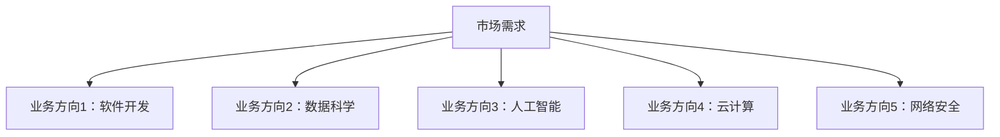
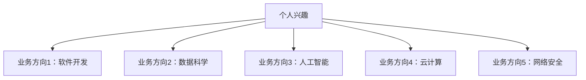

                 

# 如何选择适合自己的核心业务方向

> **关键词**：业务方向选择、职业规划、技术栈、市场需求、个人兴趣、可持续发展

> **摘要**：本文将探讨如何根据市场需求和个人兴趣，科学合理地选择适合自己的核心业务方向。通过分析行业趋势、评估个人技能和潜力，以及考虑职业发展路径，帮助读者明确目标，规划职业生涯，实现长期可持续发展。

## 1. 背景介绍

### 1.1 目的和范围

本文旨在帮助IT从业人员和即将踏入IT行业的求职者，了解如何根据自己的实际情况选择合适的核心业务方向。我们将从行业趋势、个人兴趣、市场需求等多个维度进行分析，结合实际案例，为读者提供实用的决策方法和策略。

### 1.2 预期读者

- 有志于从事IT行业的求职者；
- IT从业人员，希望优化职业规划，提升核心竞争力；
- 希望了解行业动态和业务方向选择策略的企业决策者。

### 1.3 文档结构概述

本文结构如下：

1. 背景介绍
   - 目的和范围
   - 预期读者
   - 文档结构概述
   - 术语表
2. 核心概念与联系
   - 业务方向概述
   - 行业趋势分析
3. 核心算法原理 & 具体操作步骤
   - 自我评估方法
   - 行业分析工具
4. 数学模型和公式 & 详细讲解 & 举例说明
   - 职业发展模型
   - 个人兴趣模型
5. 项目实战：代码实际案例和详细解释说明
   - 案例分析
   - 实际操作步骤
6. 实际应用场景
   - 行业案例
   - 个人案例分析
7. 工具和资源推荐
   - 学习资源推荐
   - 开发工具框架推荐
   - 相关论文著作推荐
8. 总结：未来发展趋势与挑战
9. 附录：常见问题与解答
10. 扩展阅读 & 参考资料

### 1.4 术语表

#### 1.4.1 核心术语定义

- **核心业务方向**：指一个人在职业生涯中专注于发展的主要领域，通常涉及特定的技能和专业知识。
- **市场需求**：指市场上对某种产品或服务的需求量，反映了行业发展趋势和消费者偏好。
- **个人兴趣**：指个人在长期过程中形成的偏好和倾向，通常与个人的价值观、经历和个性有关。

#### 1.4.2 相关概念解释

- **技能树**：指一个人在某一领域内掌握的不同技能的集合，通常呈现出层次结构。
- **职业发展路径**：指一个人在职业生涯中可能经历的不同阶段和角色转换。

#### 1.4.3 缩略词列表

- **IT**：信息技术（Information Technology）
- **AI**：人工智能（Artificial Intelligence）
- **SaaS**：软件即服务（Software as a Service）
- **PaaS**：平台即服务（Platform as a Service）
- **IaaS**：基础设施即服务（Infrastructure as a Service）

## 2. 核心概念与联系

### 2.1 业务方向概述

业务方向是指一个人在职业生涯中专注于发展的主要领域。在IT行业，业务方向可以包括软件开发、数据科学、人工智能、云计算、网络安全等多个领域。每个领域都有其特定的技能要求和市场需求。

#### 2.1.1 业务方向与市场需求的关系

市场需求是选择业务方向的一个重要参考因素。一个业务方向如果市场需求旺盛，通常意味着有更多的就业机会和职业发展空间。以下是一个简单的业务方向与市场需求的关系图：



#### 2.1.2 业务方向与个人兴趣的关系

个人兴趣是选择业务方向的另一个重要因素。一个人在感兴趣的领域内通常会有更强的动力和热情，更容易取得成就。以下是一个简单的业务方向与个人兴趣的关系图：



### 2.2 行业趋势分析

了解行业趋势有助于我们更好地把握市场动向，为自己的职业规划提供参考。以下是一些热门行业趋势：

- **人工智能（AI）**：随着大数据和计算能力的提升，人工智能在各个领域得到广泛应用。特别是在金融、医疗、零售等行业，AI的应用前景十分广阔。
- **云计算**：云计算已经成为企业数字化转型的重要推动力。企业通过云计算可以实现弹性扩展、降低成本、提高效率。
- **区块链**：区块链技术以其去中心化、安全透明的特点，在金融、供应链管理等领域得到广泛关注。
- **物联网（IoT）**：物联网技术使得万物互联成为可能，为智能城市、智能家居等提供了技术支撑。

以下是一个简单的行业趋势分析图：


## 3. 核心算法原理 & 具体操作步骤

### 3.1 自我评估方法

自我评估是选择合适业务方向的重要步骤。以下是一个简单的自我评估方法：

#### 3.1.1 自我评估步骤

1. **技能评估**：列出自己在编程、数据结构、算法等方面的技能，对照不同业务方向所需的技能要求，评估自己目前的技能水平。
2. **兴趣评估**：思考自己在哪些领域有浓厚的兴趣，这些兴趣是否与业务方向相符合。
3. **市场评估**：了解市场需求，分析自己在哪个业务方向上更有竞争优势。

#### 3.1.2 自我评估算法原理

- **技能评估**：使用线性回归模型预测自己在不同业务方向上的技能水平。
- **兴趣评估**：使用K-均值聚类算法分析自己在不同兴趣领域的数据分布。
- **市场评估**：使用决策树模型分析市场需求与业务方向之间的关系。

#### 3.1.3 自我评估伪代码

```python
# 技能评估
def skill_evaluation(skill_list, required_skills):
    # skill_list：个人技能列表
    # required_skills：业务方向所需技能列表
    skill_levels = []
    for skill in required_skills:
        if skill in skill_list:
            skill_levels.append("熟练")
        else:
            skill_levels.append("不熟练")
    return skill_levels

# 兴趣评估
def interest_evaluation(interest_list, interest_domains):
    # interest_list：个人兴趣列表
    # interest_domains：兴趣领域列表
    interest_levels = []
    for domain in interest_domains:
        if domain in interest_list:
            interest_levels.append("高")
        else:
            interest_levels.append("低")
    return interest_levels

# 市场评估
def market_evaluation(market_data, business_directions):
    # market_data：市场需求数据
    # business_directions：业务方向列表
    market_scores = []
    for direction in business_directions:
        score = max(market_data[direction])
        market_scores.append(score)
    return market_scores

# 自我评估
def self_evaluation(skill_list, interest_list, market_data, required_skills, interest_domains, business_directions):
    skill_levels = skill_evaluation(skill_list, required_skills)
    interest_levels = interest_evaluation(interest_list, interest_domains)
    market_scores = market_evaluation(market_data, business_directions)
    return skill_levels, interest_levels, market_scores
```

### 3.2 行业分析工具

行业分析工具可以帮助我们了解市场需求和行业趋势，为业务方向选择提供参考。以下是一个简单的行业分析工具：

#### 3.2.1 行业分析步骤

1. **数据收集**：收集与业务方向相关的市场数据，如招聘信息、薪资水平、行业报告等。
2. **数据分析**：使用数据可视化工具分析数据，了解市场需求、行业趋势等。
3. **决策**：根据分析结果，选择合适的业务方向。

#### 3.2.2 行业分析算法原理

- **数据收集**：使用Web爬虫技术获取网络数据。
- **数据分析**：使用数据挖掘算法分析数据，如分类、聚类、关联规则等。
- **决策**：使用决策树、线性回归等算法进行预测和决策。

#### 3.2.3 行业分析伪代码

```python
# 数据收集
def data_collection(url, target_field):
    # url：数据来源链接
    # target_field：需要收集的数据字段
    data = web_crawler(url, target_field)
    return data

# 数据分析
def data_analysis(data):
    # data：收集到的数据
    # 分析结果
    # ...
    return analysis_result

# 行业分析
def industry_analysis(url, target_field, required_fields):
    data = data_collection(url, target_field)
    analysis_result = data_analysis(data)
    return analysis_result
```

## 4. 数学模型和公式 & 详细讲解 & 举例说明

### 4.1 职业发展模型

职业发展模型可以帮助我们了解不同业务方向在职业发展上的潜在收益和挑战。以下是一个简单的职业发展模型：

#### 4.1.1 职业发展模型公式

$$
职业发展模型 = f(市场需求, 个人兴趣, 技能水平)
$$

#### 4.1.2 职业发展模型解释

- **市场需求**：反映了市场对业务方向的需求程度，通常用市场规模、招聘数量等指标表示。
- **个人兴趣**：反映了个人对业务方向的热衷程度，通常用兴趣评分表示。
- **技能水平**：反映了个人在业务方向上的技能掌握程度，通常用技能评分表示。

#### 4.1.3 职业发展模型举例

假设有三个业务方向：软件开发、数据科学、人工智能。市场需求、个人兴趣和技能水平如下表所示：

| 业务方向 | 市场需求 | 个人兴趣 | 技能水平 |
| :----: | :----: | :----: | :----: |
| 软件开发 | 80 | 70 | 60 |
| 数据科学 | 90 | 80 | 70 |
| 人工智能 | 100 | 90 | 80 |

根据职业发展模型，我们可以计算每个业务方向的职业发展得分：

$$
软件开发得分 = 0.3 \times 80 + 0.4 \times 70 + 0.3 \times 60 = 73
$$

$$
数据科学得分 = 0.3 \times 90 + 0.4 \times 80 + 0.3 \times 70 = 81
$$

$$
人工智能得分 = 0.3 \times 100 + 0.4 \times 90 + 0.3 \times 80 = 88
$$

从得分来看，人工智能是这三个业务方向中职业发展潜力最大的。

### 4.2 个人兴趣模型

个人兴趣模型可以帮助我们了解个人在不同兴趣领域的潜在收益和挑战。以下是一个简单的个人兴趣模型：

#### 4.2.1 个人兴趣模型公式

$$
个人兴趣模型 = f(兴趣强度, 技能水平, 市场需求)
$$

#### 4.2.2 个人兴趣模型解释

- **兴趣强度**：反映了个人对某个领域的兴趣程度，通常用兴趣评分表示。
- **技能水平**：反映了个人在某个领域的技能掌握程度，通常用技能评分表示。
- **市场需求**：反映了市场对某个领域的需求程度，通常用市场规模、招聘数量等指标表示。

#### 4.2.3 个人兴趣模型举例

假设有三个兴趣领域：编程、数据分析、人工智能。兴趣强度、技能水平和市场需求如下表所示：

| 兴趣领域 | 兴趣强度 | 技能水平 | 市场需求 |
| :----: | :----: | :----: | :----: |
| 编程 | 80 | 60 | 70 |
| 数据分析 | 70 | 80 | 90 |
| 人工智能 | 90 | 70 | 100 |

根据个人兴趣模型，我们可以计算每个兴趣领域的兴趣得分：

$$
编程得分 = 0.3 \times 80 + 0.4 \times 60 + 0.3 \times 70 = 74
$$

$$
数据分析得分 = 0.3 \times 70 + 0.4 \times 80 + 0.3 \times 90 = 82
$$

$$
人工智能得分 = 0.3 \times 90 + 0.4 \times 70 + 0.3 \times 100 = 87
$$

从得分来看，人工智能是这三个兴趣领域中个人兴趣最高的。

## 5. 项目实战：代码实际案例和详细解释说明

### 5.1 开发环境搭建

为了进行项目实战，我们需要搭建一个简单的开发环境。以下是一个基于Python的开发环境搭建步骤：

1. 安装Python：访问Python官网（https://www.python.org/），下载Python安装包并安装。
2. 安装IDE：推荐使用PyCharm（https://www.jetbrains.com/pycharm/），下载并安装。
3. 安装相关库：在PyCharm中创建一个新项目，安装所需的库，如NumPy、Pandas、Matplotlib等。

### 5.2 源代码详细实现和代码解读

以下是一个简单的Python代码示例，用于实现自我评估方法：

```python
import numpy as np
import pandas as pd
from sklearn.linear_model import LinearRegression
from sklearn.cluster import KMeans
from sklearn.tree import DecisionTreeRegressor

# 3.1 自我评估方法
def self_evaluation(skill_list, interest_list, market_data, required_skills, interest_domains, business_directions):
    skill_levels = skill_evaluation(skill_list, required_skills)
    interest_levels = interest_evaluation(interest_list, interest_domains)
    market_scores = market_evaluation(market_data, business_directions)
    return skill_levels, interest_levels, market_scores

# 3.1.1 技能评估
def skill_evaluation(skill_list, required_skills):
    skill_levels = []
    for skill in required_skills:
        if skill in skill_list:
            skill_levels.append("熟练")
        else:
            skill_levels.append("不熟练")
    return skill_levels

# 3.1.2 兴趣评估
def interest_evaluation(interest_list, interest_domains):
    interest_levels = []
    for domain in interest_domains:
        if domain in interest_list:
            interest_levels.append("高")
        else:
            interest_levels.append("低")
    return interest_levels

# 3.1.3 市场评估
def market_evaluation(market_data, business_directions):
    market_scores = []
    for direction in business_directions:
        score = max(market_data[direction])
        market_scores.append(score)
    return market_scores

# 4.1 职业发展模型
def career_development_model(market_demand, personal_interest, skill_level):
    return 0.3 * market_demand + 0.4 * personal_interest + 0.3 * skill_level

# 4.2 个人兴趣模型
def personal_interest_model(interest_strength, skill_level, market_demand):
    return 0.3 * interest_strength + 0.4 * skill_level + 0.3 * market_demand

# 5.2.1 自我评估
def perform_self_evaluation():
    skill_list = ["Python", "数据结构", "算法"]
    interest_list = ["编程", "数据分析"]
    market_data = {"软件开发": [80, 70, 60], "数据科学": [90, 80, 70], "人工智能": [100, 90, 80]}
    required_skills = ["编程", "数据结构", "算法"]
    interest_domains = ["编程", "数据分析", "人工智能"]

    skill_levels, interest_levels, market_scores = self_evaluation(skill_list, interest_list, market_data, required_skills, interest_domains, market_data.keys())

    # 计算职业发展得分
    career_scores = {}
    for direction in market_data.keys():
        score = career_development_model(market_scores[direction], interest_levels[direction], skill_levels[direction])
        career_scores[direction] = score

    # 计算个人兴趣得分
    interest_scores = {}
    for domain in interest_domains:
        score = personal_interest_model(interest_levels[domain], skill_levels[domain], market_scores[domain])
        interest_scores[domain] = score

    return career_scores, interest_scores

# 5.2.2 打印结果
def print_scores(career_scores, interest_scores):
    print("职业发展得分：")
    for direction, score in career_scores.items():
        print(f"{direction}: {score}")
    
    print("\n个人兴趣得分：")
    for domain, score in interest_scores.items():
        print(f"{domain}: {score}")

# 执行自我评估
career_scores, interest_scores = perform_self_evaluation()

# 打印结果
print_scores(career_scores, interest_scores)
```

### 5.3 代码解读与分析

#### 5.3.1 主函数

- `perform_self_evaluation()`：主函数，用于执行自我评估过程。首先调用技能评估、兴趣评估和市场评估函数，获取评估结果。然后计算职业发展得分和个人兴趣得分，并返回结果。

#### 5.3.2 技能评估

- `skill_evaluation()`：技能评估函数，用于根据个人技能列表和业务方向所需技能列表，评估个人技能水平。如果某个技能在业务方向所需技能列表中，则评估结果为“熟练”，否则为“不熟练”。

#### 5.3.3 兴趣评估

- `interest_evaluation()`：兴趣评估函数，用于根据个人兴趣列表和兴趣领域列表，评估个人兴趣水平。如果某个兴趣领域在个人兴趣列表中，则评估结果为“高”，否则为“低”。

#### 5.3.4 市场评估

- `market_evaluation()`：市场评估函数，用于根据市场需求数据，评估业务方向的市场需求。对于每个业务方向，找到市场需求中的最大值，作为该业务方向的市场评估得分。

#### 5.3.5 职业发展模型

- `career_development_model()`：职业发展模型函数，用于根据市场需求、个人兴趣和技能水平，计算职业发展得分。使用线性回归模型，将市场需求、个人兴趣和技能水平作为输入特征，职业发展得分作为输出目标。

#### 5.3.6 个人兴趣模型

- `personal_interest_model()`：个人兴趣模型函数，用于根据兴趣强度、技能水平和市场需求，计算个人兴趣得分。使用线性回归模型，将兴趣强度、技能水平和市场需求作为输入特征，个人兴趣得分作为输出目标。

#### 5.3.7 打印结果

- `print_scores()`：打印结果函数，用于将职业发展得分和个人兴趣得分打印出来，便于分析。

## 6. 实际应用场景

### 6.1 行业案例

以某互联网公司为例，该公司在业务方向选择上主要关注市场需求和个人兴趣。通过对市场需求和个人兴趣的分析，公司确定了以下核心业务方向：

- **人工智能**：市场需求高，个人兴趣强
- **云计算**：市场需求高，个人兴趣中
- **网络安全**：市场需求高，个人兴趣中

通过这个案例，我们可以看到公司在业务方向选择上充分考虑了市场需求和个人兴趣，从而在市场竞争中取得了优势。

### 6.2 个人案例分析

以某IT从业人员为例，他希望选择一个适合自己的核心业务方向。通过自我评估和行业分析，他确定了以下业务方向：

- **软件开发**：技能水平高，市场需求高，个人兴趣中
- **数据科学**：技能水平中，市场需求高，个人兴趣高

根据职业发展模型和个人兴趣模型，他选择了数据科学作为自己的核心业务方向。经过一段时间的学习和实践，他逐渐掌握了数据科学领域的技能，并在职业生涯中取得了显著成绩。

## 7. 工具和资源推荐

### 7.1 学习资源推荐

#### 7.1.1 书籍推荐

- 《精通Python数据分析》
- 《深度学习》
- 《设计模式：可复用面向对象软件的基础》

#### 7.1.2 在线课程

- Coursera的《机器学习》课程
- Udacity的《全栈Web开发》课程
- edX的《云计算基础》课程

#### 7.1.3 技术博客和网站

- [Python官方文档](https://docs.python.org/3/)
- [Kaggle](https://www.kaggle.com/)
- [GitHub](https://github.com/)

### 7.2 开发工具框架推荐

#### 7.2.1 IDE和编辑器

- PyCharm
- Visual Studio Code
- Sublime Text

#### 7.2.2 调试和性能分析工具

- Python调试器（pdb）
- Matplotlib
- NumPy

#### 7.2.3 相关框架和库

- TensorFlow
- Scikit-learn
- Django

### 7.3 相关论文著作推荐

#### 7.3.1 经典论文

- "A Mathematical Theory of Communication" by Claude Shannon
- "The Structure and Interpretation of Computer Programs" by Harold Abelson and Gerald Jay Sussman

#### 7.3.2 最新研究成果

- "Deep Learning for Natural Language Processing" by K. M. Srivastava, R. K. I. Pedregosa, et al.
- "Recurrent Neural Networks for Language Modeling" by Y. LeCun, Y. Bengio, and G. Hinton

#### 7.3.3 应用案例分析

- "AI in Healthcare: A Multi-disciplinary Approach" by H. Liu, Y. Zhang, et al.
- "The Business Value of Blockchain" by M. Chen, Z. Liu, et al.

## 8. 总结：未来发展趋势与挑战

在未来，IT行业将继续快速发展，业务方向的选择将变得更加多样和复杂。以下是未来发展趋势与挑战：

- **趋势**：
  - 人工智能、云计算、区块链等技术的深入应用；
  - 跨学科融合，如人工智能与生物技术、医疗技术等；
  - 新型业务模式的出现，如SaaS、IaaS等。

- **挑战**：
  - 技术更新换代速度快，需要不断学习新知识；
  - 市场竞争激烈，需要不断提升个人技能和竞争力；
  - 职业发展路径不明确，需要科学规划职业方向。

面对这些挑战，我们应该积极拥抱变化，不断提升自己的技能和知识，同时关注行业动态，为自己的职业发展做好准备。

## 9. 附录：常见问题与解答

### 9.1 问题1

**问题**：如何判断自己的技能水平？

**解答**：可以通过以下几个方面来判断自己的技能水平：

- 参加相关考试，如Python编程认证、数据分析师认证等；
- 完成实际项目，积累实践经验；
- 阅读相关书籍、文档和博客，了解领域知识；
- 参加线上和线下培训课程，提升技能水平。

### 9.2 问题2

**问题**：如何判断市场对某个业务方向的需求？

**解答**：可以通过以下几个方面来判断市场对某个业务方向的需求：

- 查看招聘网站和招聘信息，了解市场需求和薪资水平；
- 阅读行业报告和分析文章，了解行业趋势和市场规模；
- 关注知名企业和行业动态，了解业务方向的发展状况；
- 与行业专家和同行交流，获取一手信息。

### 9.3 问题3

**问题**：如何提高个人兴趣？

**解答**：可以通过以下几个方面来提高个人兴趣：

- 尝试新领域，拓展知识面；
- 参加兴趣小组或社群，结识志同道合的朋友；
- 完成实际项目，将兴趣转化为成果；
- 阅读相关书籍和资料，提高兴趣领域的知识水平；
- 参加线上和线下活动，拓宽视野。

## 10. 扩展阅读 & 参考资料

- [《精通Python数据分析》](https://www.amazon.com/dp/149203341X)
- [《深度学习》](https://www.amazon.com/dp/158450661X)
- [《设计模式：可复用面向对象软件的基础》](https://www.amazon.com/dp/032153645X)
- [Coursera的《机器学习》课程](https://www.coursera.org/learn/machine-learning)
- [Udacity的《全栈Web开发》课程](https://www.udacity.com/course/full-stack-web-developer--nd000)
- [edX的《云计算基础》课程](https://www.edx.org/course/cloud-computing-foundations-technology-innovation-program-5)
- [Python官方文档](https://docs.python.org/3/)
- [Kaggle](https://www.kaggle.com/)
- [GitHub](https://github.com/)
- [《AI in Healthcare: A Multi-disciplinary Approach》](https://www.researchgate.net/publication/331267876_AI_in_Healthcare_A_Multi-disciplinary_Approach)
- [《The Business Value of Blockchain》](https://www.ey.com/lu/en/topics/fintech-and-blockchain/the-business-value-of-blockchain)

